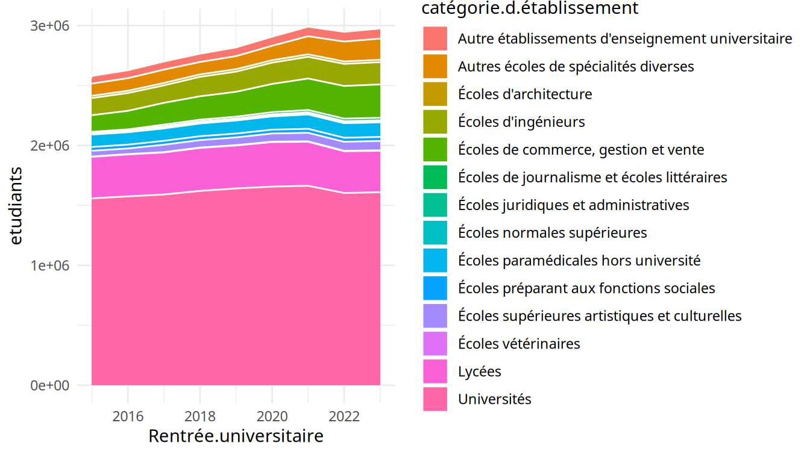
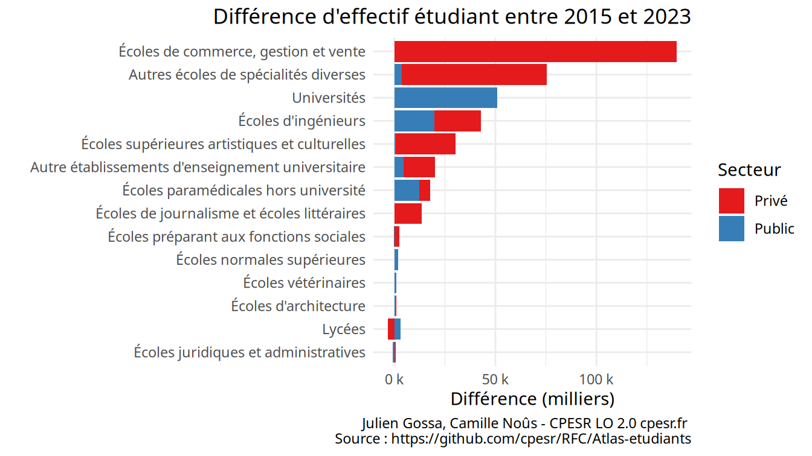
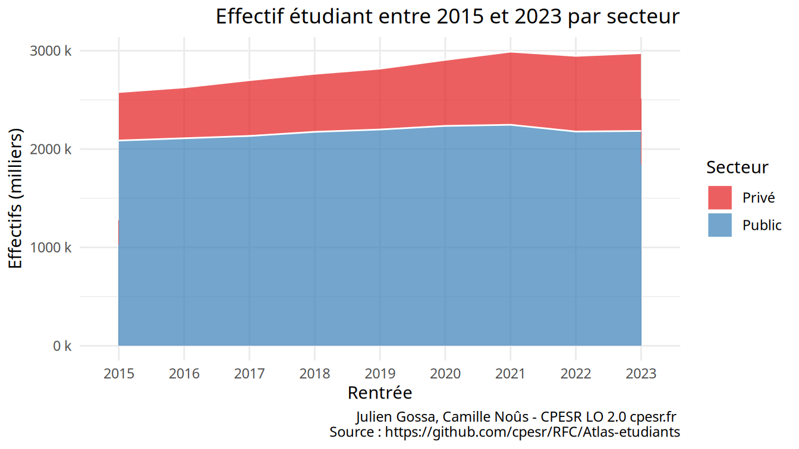
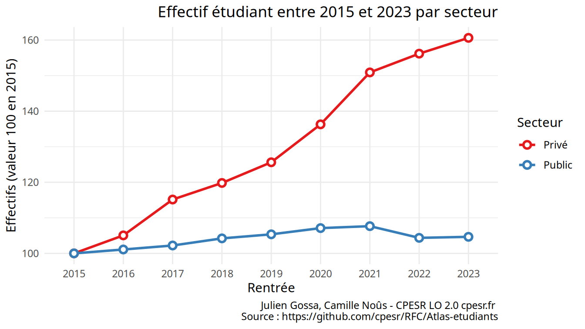

CPESR
================
CPESR
2024-09-19

## Données

- <https://data.enseignementsup-recherche.gouv.fr/explore/dataset/fr-esr-atlas_regional-effectifs-d-etudiants-inscrits-detail_etablissements/information/>

<!-- -->

    ##  [1] "Rentrée.universitaire"                                                      
    ##  [2] "catégorie.d.établissement"                                                  
    ##  [3] "secteur.d.établissement"                                                    
    ##  [4] "code.UAI.de.l.établissement"                                                
    ##  [5] "sigle.de.l.établissement"                                                   
    ##  [6] "libellé.de.l.établissement"                                                 
    ##  [7] "libellé.complémentaire.de.l.établissement"                                  
    ##  [8] "Code.UAI.de.la.composante"                                                  
    ##  [9] "sigle.de.la.composante"                                                     
    ## [10] "libellé.de.la.composante"                                                   
    ## [11] "libellé.complémentaire.de.la.composante"                                    
    ## [12] "id.région"                                                                  
    ## [13] "région"                                                                     
    ## [14] "id.académie"                                                                
    ## [15] "académie"                                                                   
    ## [16] "id.département"                                                             
    ## [17] "département"                                                                
    ## [18] "id.unité.urbaine"                                                           
    ## [19] "unité.urbaine"                                                              
    ## [20] "code.commune"                                                               
    ## [21] "Commune"                                                                    
    ## [22] "gps"                                                                        
    ## [23] "degetu"                                                                     
    ## [24] "degre_etudes"                                                               
    ## [25] "nombre.total.d.étudiants.inscrits.hors.doubles.inscriptions.université.CPGE"
    ## [26] "dont.femmes"                                                                
    ## [27] "dont.hommes"

## Explorations

