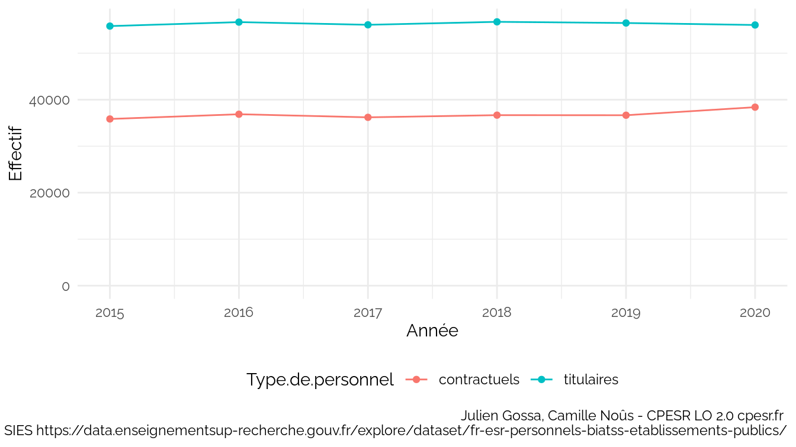
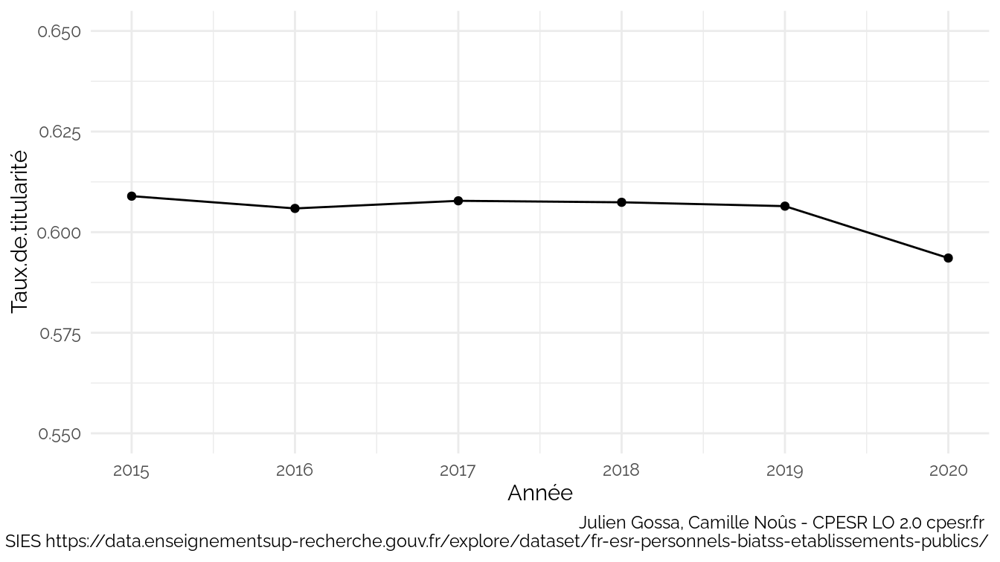
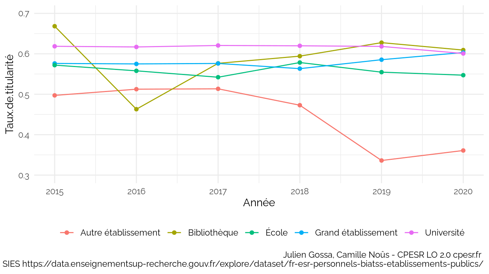
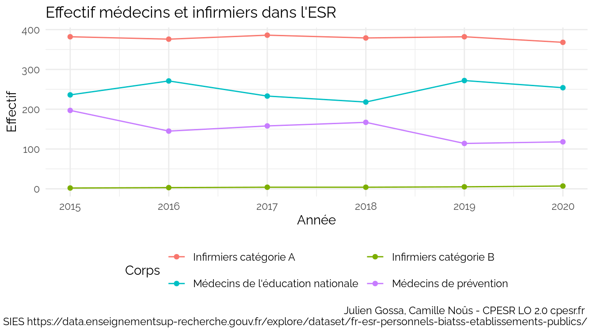
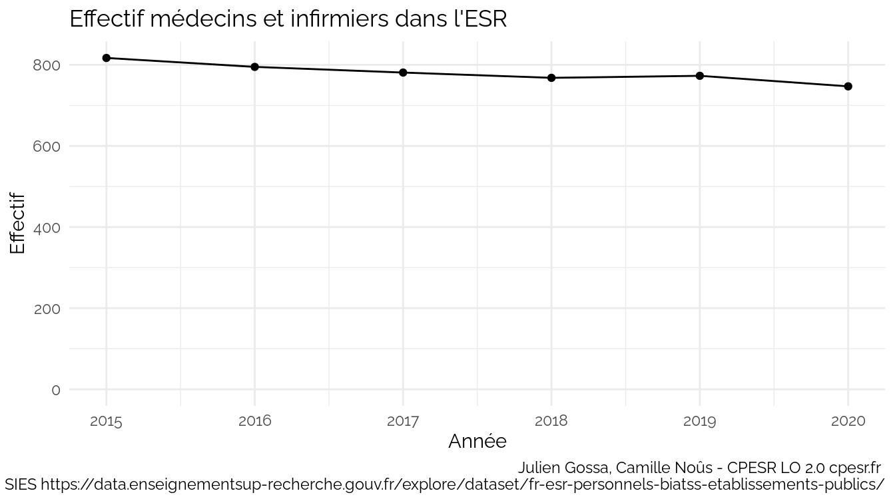

BIATSS
================

Source :
<https://data.enseignementsup-recherche.gouv.fr/explore/dataset/fr-esr-personnels-biatss-etablissements-publics/export/>

    ##  [1] "Année"                           "Année.universitaire"            
    ##  [3] "Type.de.personnel"               "etablissement_id_paysage"       
    ##  [5] "Etablissement"                   "etablissement_compos_id_paysage"
    ##  [7] "Décomposition.des.universités"   "etablissement_id_uai"           
    ##  [9] "etablissement_code_region"       "Région"                         
    ## [11] "etablissement_code_academie"     "Académie"                       
    ## [13] "etablissement_coordonnees"       "Catégorie"                      
    ## [15] "code_corps"                      "Corps"                          
    ## [17] "Filière"                         "etablissement_id_uai_source"    
    ## [19] "etablissement_type"              "etablissement_id_paysage_actuel"
    ## [21] "etablissement_actuel_lib"        "Effectif"                       
    ## [23] "effectif_femmes"                 "effectif_hommes"                
    ## [25] "classe_age3"                     "code_filiere"                   
    ## [27] "code_bap"                        "BAP"

    ## `summarise()` has grouped output by 'Année'. You can override using the
    ## `.groups` argument.

    ## `summarise()` has grouped output by 'Année'. You can override using the
    ## `.groups` argument.

    ## `summarise()` has grouped output by 'Année', 'etablissement_type'. You can
    ## override using the `.groups` argument.

    ## `summarise()` has grouped output by 'Année', 'Catégorie'. You can override
    ## using the `.groups` argument.

    ## `summarise()` has grouped output by 'Année', 'Catégorie'. You can override
    ## using the `.groups` argument.

    ## `summarise()` has grouped output by 'Année', 'Etablissement'. You can override
    ## using the `.groups` argument.

    ## Warning: Using `size` aesthetic for lines was deprecated in ggplot2 3.4.0.
    ## ℹ Please use `linewidth` instead.
    ## This warning is displayed once every 8 hours.
    ## Call `lifecycle::last_lifecycle_warnings()` to see where this warning was
    ## generated.

    ## `geom_smooth()` using formula = 'y ~ x'

    ## Warning: Removed 1 row containing non-finite outside the scale range
    ## (`stat_smooth()`).

    ## Warning: The following aesthetics were dropped during statistical transformation:
    ## colour.
    ## ℹ This can happen when ggplot fails to infer the correct grouping structure in
    ##   the data.
    ## ℹ Did you forget to specify a `group` aesthetic or to convert a numerical
    ##   variable into a factor?

    ## Warning: Removed 1 row containing missing values or values outside the scale range
    ## (`geom_point()`).

    ## Warning: Removed 1 row containing missing values or values outside the scale range
    ## (`geom_text_repel()`).

    ## Warning: ggrepel: 51 unlabeled data points (too many overlaps). Consider
    ## increasing max.overlaps

    ## `summarise()` has grouped output by 'Année', 'Etablissement'. You can override
    ## using the `.groups` argument.

<table>
<thead>
<tr>
<th style="text-align:left;">
Année
</th>
<th style="text-align:left;">
Etablissement
</th>
<th style="text-align:left;">
contractuels
</th>
<th style="text-align:left;">
titulaires
</th>
<th style="text-align:left;">
Taux.de.titularité
</th>
</tr>
</thead>
<tbody>
<tr>
<td style="text-align:left;">
2020
</td>
<td style="text-align:left;">
Université Côte d’Azur
</td>
<td style="text-align:left;">
805
</td>
<td style="text-align:left;">
780
</td>
<td style="text-align:left;">
0.49
</td>
</tr>
<tr>
<td style="text-align:left;">
2020
</td>
<td style="text-align:left;">
CY Cergy Paris Université
</td>
<td style="text-align:left;">
489
</td>
<td style="text-align:left;">
474
</td>
<td style="text-align:left;">
0.49
</td>
</tr>
<tr>
<td style="text-align:left;">
2020
</td>
<td style="text-align:left;">
Université de la Polynésie Française
</td>
<td style="text-align:left;">
55
</td>
<td style="text-align:left;">
55
</td>
<td style="text-align:left;">
0.5
</td>
</tr>
<tr>
<td style="text-align:left;">
2020
</td>
<td style="text-align:left;">
Le Mans Université
</td>
<td style="text-align:left;">
278
</td>
<td style="text-align:left;">
281
</td>
<td style="text-align:left;">
0.5
</td>
</tr>
<tr>
<td style="text-align:left;">
2020
</td>
<td style="text-align:left;">
Université de Haute-Alsace
</td>
<td style="text-align:left;">
250
</td>
<td style="text-align:left;">
253
</td>
<td style="text-align:left;">
0.5
</td>
</tr>
<tr>
<td style="text-align:left;">
2020
</td>
<td style="text-align:left;">
Université Gustave Eiffel
</td>
<td style="text-align:left;">
322
</td>
<td style="text-align:left;">
335
</td>
<td style="text-align:left;">
0.51
</td>
</tr>
<tr>
<td style="text-align:left;">
2020
</td>
<td style="text-align:left;">
Université de Corse Pasquale Paoli
</td>
<td style="text-align:left;">
185
</td>
<td style="text-align:left;">
194
</td>
<td style="text-align:left;">
0.51
</td>
</tr>
<tr>
<td style="text-align:left;">
2020
</td>
<td style="text-align:left;">
Université Bordeaux Montaigne
</td>
<td style="text-align:left;">
281
</td>
<td style="text-align:left;">
298
</td>
<td style="text-align:left;">
0.51
</td>
</tr>
<tr>
<td style="text-align:left;">
2020
</td>
<td style="text-align:left;">
Université de Tours
</td>
<td style="text-align:left;">
553
</td>
<td style="text-align:left;">
642
</td>
<td style="text-align:left;">
0.54
</td>
</tr>
<tr>
<td style="text-align:left;">
2020
</td>
<td style="text-align:left;">
Université Paris sciences et lettres
</td>
<td style="text-align:left;">
796
</td>
<td style="text-align:left;">
925
</td>
<td style="text-align:left;">
0.54
</td>
</tr>
<tr>
<td style="text-align:left;">
…
</td>
<td style="text-align:left;">
NA
</td>
<td style="text-align:left;">
…
</td>
<td style="text-align:left;">
…
</td>
<td style="text-align:left;">
…
</td>
</tr>
<tr>
<td style="text-align:left;">
2020
</td>
<td style="text-align:left;">
Avignon Université
</td>
<td style="text-align:left;">
103
</td>
<td style="text-align:left;">
238
</td>
<td style="text-align:left;">
0.7
</td>
</tr>
<tr>
<td style="text-align:left;">
2020
</td>
<td style="text-align:left;">
Université d’Artois
</td>
<td style="text-align:left;">
159
</td>
<td style="text-align:left;">
383
</td>
<td style="text-align:left;">
0.71
</td>
</tr>
<tr>
<td style="text-align:left;">
2020
</td>
<td style="text-align:left;">
Université du Littoral Côte d’Opale
</td>
<td style="text-align:left;">
152
</td>
<td style="text-align:left;">
374
</td>
<td style="text-align:left;">
0.71
</td>
</tr>
<tr>
<td style="text-align:left;">
2020
</td>
<td style="text-align:left;">
Université Toulouse III - Paul Sabatier
</td>
<td style="text-align:left;">
485
</td>
<td style="text-align:left;">
1194
</td>
<td style="text-align:left;">
0.71
</td>
</tr>
<tr>
<td style="text-align:left;">
2020
</td>
<td style="text-align:left;">
Université Savoie Mont Blanc
</td>
<td style="text-align:left;">
164
</td>
<td style="text-align:left;">
434
</td>
<td style="text-align:left;">
0.73
</td>
</tr>
<tr>
<td style="text-align:left;">
2020
</td>
<td style="text-align:left;">
Université de Poitiers
</td>
<td style="text-align:left;">
313
</td>
<td style="text-align:left;">
887
</td>
<td style="text-align:left;">
0.74
</td>
</tr>
<tr>
<td style="text-align:left;">
2020
</td>
<td style="text-align:left;">
Université Polytechnique Hauts-de-France
</td>
<td style="text-align:left;">
128
</td>
<td style="text-align:left;">
448
</td>
<td style="text-align:left;">
0.78
</td>
</tr>
<tr>
<td style="text-align:left;">
2020
</td>
<td style="text-align:left;">
Université des Antilles
</td>
<td style="text-align:left;">
94
</td>
<td style="text-align:left;">
373
</td>
<td style="text-align:left;">
0.8
</td>
</tr>
<tr>
<td style="text-align:left;">
2020
</td>
<td style="text-align:left;">
Université Toulouse - Jean Jaurès
</td>
<td style="text-align:left;">
165
</td>
<td style="text-align:left;">
703
</td>
<td style="text-align:left;">
0.81
</td>
</tr>
<tr>
<td style="text-align:left;">
2020
</td>
<td style="text-align:left;">
Université de Guyane
</td>
<td style="text-align:left;">
NA
</td>
<td style="text-align:left;">
85
</td>
<td style="text-align:left;">
NA
</td>
</tr>
</tbody>
</table>

    ## `summarise()` has grouped output by 'Année'. You can override using the
    ## `.groups` argument.

    ## `summarise()` has grouped output by 'Année'. You can override using the
    ## `.groups` argument.

    ## `summarise()` has grouped output by 'Année'. You can override using the
    ## `.groups` argument.

    ## `summarise()` has grouped output by 'Année'. You can override using the
    ## `.groups` argument.

    ## `summarise()` has grouped output by 'Année'. You can override using the
    ## `.groups` argument.

    ## `summarise()` has grouped output by 'Année'. You can override using the
    ## `.groups` argument.

    ## `summarise()` has grouped output by 'Année', 'Région'. You can override using
    ## the `.groups` argument.

<table>
<thead>
<tr>
<th style="text-align:right;">
Année
</th>
<th style="text-align:left;">
Région
</th>
<th style="text-align:right;">
INF - A
</th>
<th style="text-align:right;">
MED PREV
</th>
<th style="text-align:right;">
MEN
</th>
<th style="text-align:right;">
INF - B
</th>
</tr>
</thead>
<tbody>
<tr>
<td style="text-align:right;">
2020
</td>
<td style="text-align:left;">
Auvergne-Rhône-Alpes
</td>
<td style="text-align:right;">
52
</td>
<td style="text-align:right;">
30
</td>
<td style="text-align:right;">
25
</td>
<td style="text-align:right;">
NA
</td>
</tr>
<tr>
<td style="text-align:right;">
2020
</td>
<td style="text-align:left;">
Bourgogne-Franche-Comté
</td>
<td style="text-align:right;">
20
</td>
<td style="text-align:right;">
NA
</td>
<td style="text-align:right;">
11
</td>
<td style="text-align:right;">
NA
</td>
</tr>
<tr>
<td style="text-align:right;">
2020
</td>
<td style="text-align:left;">
Bretagne
</td>
<td style="text-align:right;">
28
</td>
<td style="text-align:right;">
2
</td>
<td style="text-align:right;">
23
</td>
<td style="text-align:right;">
NA
</td>
</tr>
<tr>
<td style="text-align:right;">
2020
</td>
<td style="text-align:left;">
Centre-Val de Loire
</td>
<td style="text-align:right;">
13
</td>
<td style="text-align:right;">
1
</td>
<td style="text-align:right;">
11
</td>
<td style="text-align:right;">
NA
</td>
</tr>
<tr>
<td style="text-align:right;">
2020
</td>
<td style="text-align:left;">
Collectivités d’outre-mer
</td>
<td style="text-align:right;">
NA
</td>
<td style="text-align:right;">
1
</td>
<td style="text-align:right;">
NA
</td>
<td style="text-align:right;">
NA
</td>
</tr>
<tr>
<td style="text-align:right;">
2020
</td>
<td style="text-align:left;">
Grand Est
</td>
<td style="text-align:right;">
39
</td>
<td style="text-align:right;">
16
</td>
<td style="text-align:right;">
10
</td>
<td style="text-align:right;">
NA
</td>
</tr>
<tr>
<td style="text-align:right;">
2020
</td>
<td style="text-align:left;">
Guadeloupe
</td>
<td style="text-align:right;">
2
</td>
<td style="text-align:right;">
2
</td>
<td style="text-align:right;">
NA
</td>
<td style="text-align:right;">
NA
</td>
</tr>
<tr>
<td style="text-align:right;">
2020
</td>
<td style="text-align:left;">
Guyane
</td>
<td style="text-align:right;">
1
</td>
<td style="text-align:right;">
NA
</td>
<td style="text-align:right;">
NA
</td>
<td style="text-align:right;">
NA
</td>
</tr>
<tr>
<td style="text-align:right;">
2020
</td>
<td style="text-align:left;">
Hauts-de-France
</td>
<td style="text-align:right;">
41
</td>
<td style="text-align:right;">
10
</td>
<td style="text-align:right;">
14
</td>
<td style="text-align:right;">
1
</td>
</tr>
<tr>
<td style="text-align:right;">
2020
</td>
<td style="text-align:left;">
La Réunion
</td>
<td style="text-align:right;">
1
</td>
<td style="text-align:right;">
3
</td>
<td style="text-align:right;">
NA
</td>
<td style="text-align:right;">
NA
</td>
</tr>
<tr>
<td style="text-align:right;">
2020
</td>
<td style="text-align:left;">
Normandie
</td>
<td style="text-align:right;">
25
</td>
<td style="text-align:right;">
1
</td>
<td style="text-align:right;">
9
</td>
<td style="text-align:right;">
NA
</td>
</tr>
<tr>
<td style="text-align:right;">
2020
</td>
<td style="text-align:left;">
Nouvelle-Aquitaine
</td>
<td style="text-align:right;">
31
</td>
<td style="text-align:right;">
9
</td>
<td style="text-align:right;">
32
</td>
<td style="text-align:right;">
1
</td>
</tr>
<tr>
<td style="text-align:right;">
2020
</td>
<td style="text-align:left;">
Occitanie
</td>
<td style="text-align:right;">
26
</td>
<td style="text-align:right;">
13
</td>
<td style="text-align:right;">
8
</td>
<td style="text-align:right;">
NA
</td>
</tr>
<tr>
<td style="text-align:right;">
2020
</td>
<td style="text-align:left;">
Pays de la Loire
</td>
<td style="text-align:right;">
19
</td>
<td style="text-align:right;">
4
</td>
<td style="text-align:right;">
21
</td>
<td style="text-align:right;">
NA
</td>
</tr>
<tr>
<td style="text-align:right;">
2020
</td>
<td style="text-align:left;">
Provence-Alpes-Côte d’Azur
</td>
<td style="text-align:right;">
16
</td>
<td style="text-align:right;">
2
</td>
<td style="text-align:right;">
15
</td>
<td style="text-align:right;">
NA
</td>
</tr>
<tr>
<td style="text-align:right;">
2020
</td>
<td style="text-align:left;">
Île-de-France
</td>
<td style="text-align:right;">
54
</td>
<td style="text-align:right;">
24
</td>
<td style="text-align:right;">
75
</td>
<td style="text-align:right;">
5
</td>
</tr>
</tbody>
</table>

## Statuts

Type.de.personnel

| Type.de.personnel | Effectif | Femmes |
|:------------------|---------:|-------:|
| contractuels      |    38391 |  25056 |
| titulaires        |    56067 |  35404 |

Catégorie

| Catégorie | Effectif | Femmes |
|:----------|---------:|-------:|
| A         |    36283 |  20637 |
| B         |    23395 |  15707 |
| C         |    34780 |  24116 |

Corps

| Corps                                                                              | Effectif | Femmes |
|:-----------------------------------------------------------------------------------|---------:|-------:|
| Adjoints administratifs de l’éducation nationale et de l’enseignement supérieur    |     6371 |   5571 |
| Adjoints techniques de recherche et de formation                                   |    26248 |  17189 |
| Adjoints techniques des établissements d’enseignement                              |       59 |     26 |
| Assistants de service social des administrations de l’Etat                         |      117 |    112 |
| Assistants ingénieurs                                                              |     7617 |   4414 |
| Attachés d’administration de l’Etat                                                |     2553 |   1745 |
| Bibliothécaires                                                                    |      638 |    474 |
| Bibliothécaires assistants spécialisés                                             |     1722 |   1330 |
| Conseillers techniques de service social des administrations de l’Etat             |       16 |     15 |
| Conservateurs des bibliothèques                                                    |      731 |    511 |
| Conservateurs généraux des bibliothèques                                           |      102 |     66 |
| Infirmiers catégorie A                                                             |      368 |    344 |
| Infirmiers catégorie B                                                             |        7 |      6 |
| Ingénieurs d’études                                                                |    17911 |  10212 |
| Ingénieurs de recherche                                                            |     5858 |   2453 |
| Magasiniers                                                                        |     2102 |   1330 |
| Médecins de l’éducation nationale                                                  |      254 |    204 |
| Médecins de prévention                                                             |      118 |     87 |
| Secrétaires administratifs de l’éducation nationale et de l’enseignement supérieur |     3329 |   2862 |
| Techniciens de recherche et de formation                                           |    18337 |  11509 |

Filière

| Filière                                                | Effectif | Femmes |
|:-------------------------------------------------------|---------:|-------:|
| Administrative                                         |    12253 |  10178 |
| Bibliothèque                                           |     5295 |   3711 |
| Ingénieurs et techniciens de recherche et de formation |    75971 |  45777 |
| Ouvrière                                               |       59 |     26 |
| Sociale et de santé                                    |      880 |    768 |

BAP

| BAP                                                           | Effectif | Femmes |
|:--------------------------------------------------------------|---------:|-------:|
|                                                               |    55529 |  37811 |
| Culture, Communication, Production et diffusion des savoirs   |     3283 |   1812 |
| Gestion et Pilotage                                           |    16391 |  14221 |
| Informatique, Statistiques et Calcul scientifique             |     4316 |    714 |
| Patrimoine immobilier, Logistique, Restauration et Prévention |     7617 |   2548 |
| Sciences Humaines et Sociales                                 |      382 |    203 |
| Sciences chimiques et Sciences des matériaux                  |     1521 |    788 |
| Sciences de l’Ingénieur et instrumentation scientifique       |     2360 |    274 |
| Sciences du vivant, de la terre et de l’environnement         |     3059 |   2089 |

### Statuts Université de Strasbourg

Unistra

| Catégorie | Corps                                                                              | code_corps   | Filière                                                | code_filiere        | BAP                                                           | code_bap | Effectif_contractuels | Effectif_titulaires | Femmes_contractuels | Femmes_titulaires |
|:----------|:-----------------------------------------------------------------------------------|:-------------|:-------------------------------------------------------|:--------------------|:--------------------------------------------------------------|:---------|----------------------:|--------------------:|--------------------:|------------------:|
| A         | Assistants de service social des administrations de l’Etat                         | ASSAE        | Sociale et de santé                                    | SOCIALE ET DE SANTE |                                                               |          |                     2 |                   3 |                   2 |                 3 |
| A         | Assistants ingénieurs                                                              | ASI          | Ingénieurs et techniciens de recherche et de formation | ITRF                |                                                               | NR       |                    NA |                   3 |                  NA |                 3 |
| A         | Assistants ingénieurs                                                              | ASI          | Ingénieurs et techniciens de recherche et de formation | ITRF                |                                                               |          |                   140 |                  NA |                  93 |                NA |
| A         | Assistants ingénieurs                                                              | ASI          | Ingénieurs et techniciens de recherche et de formation | ITRF                | Culture, Communication, Production et diffusion des savoirs   | F        |                    NA |                  14 |                  NA |                10 |
| A         | Assistants ingénieurs                                                              | ASI          | Ingénieurs et techniciens de recherche et de formation | ITRF                | Gestion et Pilotage                                           | J        |                    NA |                  35 |                  NA |                31 |
| A         | Assistants ingénieurs                                                              | ASI          | Ingénieurs et techniciens de recherche et de formation | ITRF                | Informatique, Statistiques et Calcul scientifique             | E        |                    NA |                  17 |                  NA |                 1 |
| A         | Assistants ingénieurs                                                              | ASI          | Ingénieurs et techniciens de recherche et de formation | ITRF                | Patrimoine immobilier, Logistique, Restauration et Prévention | G        |                    NA |                   5 |                  NA |                 0 |
| A         | Assistants ingénieurs                                                              | ASI          | Ingénieurs et techniciens de recherche et de formation | ITRF                | Sciences de l’Ingénieur et instrumentation scientifique       | C        |                    NA |                  11 |                  NA |                 0 |
| A         | Assistants ingénieurs                                                              | ASI          | Ingénieurs et techniciens de recherche et de formation | ITRF                | Sciences du vivant, de la terre et de l’environnement         | A        |                    NA |                  23 |                  NA |                14 |
| A         | Attachés d’administration de l’Etat                                                | AAE          | Administrative                                         | ADMINISTRATIVE      |                                                               |          |                    NA |                  42 |                  NA |                30 |
| A         | Bibliothécaires                                                                    | BIB          | Bibliothèque                                           | BIBLIOTHEQUE        |                                                               |          |                     1 |                  14 |                   1 |                11 |
| A         | Conservateurs des bibliothèques                                                    | CONSER.      | Bibliothèque                                           | BIBLIOTHEQUE        |                                                               |          |                    NA |                  16 |                  NA |                11 |
| A         | Conservateurs généraux des bibliothèques                                           | CONSER. GEN. | Bibliothèque                                           | BIBLIOTHEQUE        |                                                               |          |                    NA |                   2 |                  NA |                 1 |
| A         | Infirmiers catégorie A                                                             | INF - A      | Sociale et de santé                                    | SOCIALE ET DE SANTE |                                                               |          |                     4 |                   7 |                   3 |                 7 |
| A         | Ingénieurs d’études                                                                | IGE          | Ingénieurs et techniciens de recherche et de formation | ITRF                |                                                               |          |                   372 |                  NA |                 227 |                NA |
| A         | Ingénieurs d’études                                                                | IGE          | Ingénieurs et techniciens de recherche et de formation | ITRF                |                                                               | NR       |                    NA |                   2 |                  NA |                 2 |
| A         | Ingénieurs d’études                                                                | IGE          | Ingénieurs et techniciens de recherche et de formation | ITRF                | Culture, Communication, Production et diffusion des savoirs   | F        |                    NA |                  44 |                  NA |                26 |
| A         | Ingénieurs d’études                                                                | IGE          | Ingénieurs et techniciens de recherche et de formation | ITRF                | Gestion et Pilotage                                           | J        |                    NA |                  78 |                  NA |                57 |
| A         | Ingénieurs d’études                                                                | IGE          | Ingénieurs et techniciens de recherche et de formation | ITRF                | Informatique, Statistiques et Calcul scientifique             | E        |                    NA |                  70 |                  NA |                13 |
| A         | Ingénieurs d’études                                                                | IGE          | Ingénieurs et techniciens de recherche et de formation | ITRF                | Patrimoine immobilier, Logistique, Restauration et Prévention | G        |                    NA |                  14 |                  NA |                 5 |
| A         | Ingénieurs d’études                                                                | IGE          | Ingénieurs et techniciens de recherche et de formation | ITRF                | Sciences Humaines et Sociales                                 | D        |                    NA |                   3 |                  NA |                 1 |
| A         | Ingénieurs d’études                                                                | IGE          | Ingénieurs et techniciens de recherche et de formation | ITRF                | Sciences chimiques et Sciences des matériaux                  | B        |                    NA |                  12 |                  NA |                 5 |
| A         | Ingénieurs d’études                                                                | IGE          | Ingénieurs et techniciens de recherche et de formation | ITRF                | Sciences de l’Ingénieur et instrumentation scientifique       | C        |                    NA |                  14 |                  NA |                 2 |
| A         | Ingénieurs d’études                                                                | IGE          | Ingénieurs et techniciens de recherche et de formation | ITRF                | Sciences du vivant, de la terre et de l’environnement         | A        |                    NA |                  42 |                  NA |                29 |
| A         | Ingénieurs de recherche                                                            | IGR          | Ingénieurs et techniciens de recherche et de formation | ITRF                |                                                               |          |                   144 |                  NA |                  74 |                NA |
| A         | Ingénieurs de recherche                                                            | IGR          | Ingénieurs et techniciens de recherche et de formation | ITRF                | Culture, Communication, Production et diffusion des savoirs   | F        |                    NA |                   4 |                  NA |                 2 |
| A         | Ingénieurs de recherche                                                            | IGR          | Ingénieurs et techniciens de recherche et de formation | ITRF                | Gestion et Pilotage                                           | J        |                    NA |                  16 |                  NA |                 7 |
| A         | Ingénieurs de recherche                                                            | IGR          | Ingénieurs et techniciens de recherche et de formation | ITRF                | Informatique, Statistiques et Calcul scientifique             | E        |                    NA |                  21 |                  NA |                 2 |
| A         | Ingénieurs de recherche                                                            | IGR          | Ingénieurs et techniciens de recherche et de formation | ITRF                | Patrimoine immobilier, Logistique, Restauration et Prévention | G        |                    NA |                   6 |                  NA |                 3 |
| A         | Ingénieurs de recherche                                                            | IGR          | Ingénieurs et techniciens de recherche et de formation | ITRF                | Sciences Humaines et Sociales                                 | D        |                    NA |                   2 |                  NA |                 1 |
| A         | Ingénieurs de recherche                                                            | IGR          | Ingénieurs et techniciens de recherche et de formation | ITRF                | Sciences chimiques et Sciences des matériaux                  | B        |                    NA |                   5 |                  NA |                 3 |
| A         | Ingénieurs de recherche                                                            | IGR          | Ingénieurs et techniciens de recherche et de formation | ITRF                | Sciences de l’Ingénieur et instrumentation scientifique       | C        |                    NA |                  13 |                  NA |                 4 |
| A         | Ingénieurs de recherche                                                            | IGR          | Ingénieurs et techniciens de recherche et de formation | ITRF                | Sciences du vivant, de la terre et de l’environnement         | A        |                    NA |                  14 |                  NA |                10 |
| A         | Médecins de l’éducation nationale                                                  | MEN          | Sociale et de santé                                    | SOCIALE ET DE SANTE |                                                               |          |                     9 |                  NA |                   9 |                NA |
| B         | Bibliothécaires assistants spécialisés                                             | BIBAS        | Bibliothèque                                           | BIBLIOTHEQUE        |                                                               |          |                     1 |                  31 |                   1 |                28 |
| B         | Secrétaires administratifs de l’éducation nationale et de l’enseignement supérieur | SAENES       | Administrative                                         | ADMINISTRATIVE      |                                                               |          |                     3 |                  62 |                   2 |                56 |
| B         | Techniciens de recherche et de formation                                           | TECH         | Ingénieurs et techniciens de recherche et de formation | ITRF                |                                                               |          |                   292 |                  NA |                 195 |                NA |
| B         | Techniciens de recherche et de formation                                           | TECH         | Ingénieurs et techniciens de recherche et de formation | ITRF                |                                                               | NR       |                    NA |                  11 |                  NA |                 6 |
| B         | Techniciens de recherche et de formation                                           | TECH         | Ingénieurs et techniciens de recherche et de formation | ITRF                | Culture, Communication, Production et diffusion des savoirs   | F        |                    NA |                  30 |                  NA |                19 |
| B         | Techniciens de recherche et de formation                                           | TECH         | Ingénieurs et techniciens de recherche et de formation | ITRF                | Gestion et Pilotage                                           | J        |                    NA |                 169 |                  NA |               151 |
| B         | Techniciens de recherche et de formation                                           | TECH         | Ingénieurs et techniciens de recherche et de formation | ITRF                | Informatique, Statistiques et Calcul scientifique             | E        |                    NA |                  25 |                  NA |                 2 |
| B         | Techniciens de recherche et de formation                                           | TECH         | Ingénieurs et techniciens de recherche et de formation | ITRF                | Patrimoine immobilier, Logistique, Restauration et Prévention | G        |                    NA |                  39 |                  NA |                 3 |
| B         | Techniciens de recherche et de formation                                           | TECH         | Ingénieurs et techniciens de recherche et de formation | ITRF                | Sciences chimiques et Sciences des matériaux                  | B        |                    NA |                  15 |                  NA |                 8 |
| B         | Techniciens de recherche et de formation                                           | TECH         | Ingénieurs et techniciens de recherche et de formation | ITRF                | Sciences de l’Ingénieur et instrumentation scientifique       | C        |                    NA |                  15 |                  NA |                 1 |
| B         | Techniciens de recherche et de formation                                           | TECH         | Ingénieurs et techniciens de recherche et de formation | ITRF                | Sciences du vivant, de la terre et de l’environnement         | A        |                    NA |                  34 |                  NA |                26 |
| C         | Adjoints administratifs de l’éducation nationale et de l’enseignement supérieur    | ADJAENES     | Administrative                                         | ADMINISTRATIVE      |                                                               |          |                    21 |                 121 |                  15 |               105 |
| C         | Adjoints techniques de recherche et de formation                                   | ATRF         | Ingénieurs et techniciens de recherche et de formation | ITRF                |                                                               |          |                   319 |                  NA |                 227 |                NA |
| C         | Adjoints techniques de recherche et de formation                                   | ATRF         | Ingénieurs et techniciens de recherche et de formation | ITRF                |                                                               | NR       |                    NA |                   7 |                  NA |                 6 |
| C         | Adjoints techniques de recherche et de formation                                   | ATRF         | Ingénieurs et techniciens de recherche et de formation | ITRF                | Culture, Communication, Production et diffusion des savoirs   | F        |                    NA |                  14 |                  NA |                 8 |
| C         | Adjoints techniques de recherche et de formation                                   | ATRF         | Ingénieurs et techniciens de recherche et de formation | ITRF                | Gestion et Pilotage                                           | J        |                    NA |                 168 |                  NA |               150 |
| C         | Adjoints techniques de recherche et de formation                                   | ATRF         | Ingénieurs et techniciens de recherche et de formation | ITRF                | Informatique, Statistiques et Calcul scientifique             | E        |                    NA |                   2 |                  NA |                 1 |
| C         | Adjoints techniques de recherche et de formation                                   | ATRF         | Ingénieurs et techniciens de recherche et de formation | ITRF                | Patrimoine immobilier, Logistique, Restauration et Prévention | G        |                    NA |                 171 |                  NA |                73 |
| C         | Adjoints techniques de recherche et de formation                                   | ATRF         | Ingénieurs et techniciens de recherche et de formation | ITRF                | Sciences chimiques et Sciences des matériaux                  | B        |                    NA |                   6 |                  NA |                 2 |
| C         | Adjoints techniques de recherche et de formation                                   | ATRF         | Ingénieurs et techniciens de recherche et de formation | ITRF                | Sciences de l’Ingénieur et instrumentation scientifique       | C        |                    NA |                   3 |                  NA |                 0 |
| C         | Adjoints techniques de recherche et de formation                                   | ATRF         | Ingénieurs et techniciens de recherche et de formation | ITRF                | Sciences du vivant, de la terre et de l’environnement         | A        |                    NA |                  38 |                  NA |                23 |
| C         | Magasiniers                                                                        | MAG          | Bibliothèque                                           | BIBLIOTHEQUE        |                                                               |          |                    22 |                  43 |                  17 |                24 |

