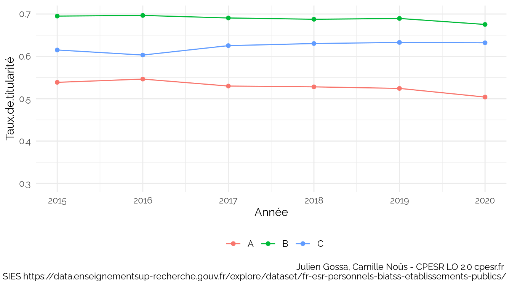

BIATSS
================

Source :
<https://data.enseignementsup-recherche.gouv.fr/explore/dataset/fr-esr-personnels-biatss-etablissements-publics/export/>

    ##  [1] "Année"                           "Année.universitaire"            
    ##  [3] "Type.de.personnel"               "etablissement_id_paysage"       
    ##  [5] "Etablissement"                   "etablissement_compos_id_paysage"
    ##  [7] "Décomposition.des.universités"   "etablissement_id_uai"           
    ##  [9] "etablissement_code_region"       "Région"                         
    ## [11] "etablissement_code_academie"     "Académie"                       
    ## [13] "etablissement_coordonnees"       "Catégorie"                      
    ## [15] "code_corps"                      "Corps"                          
    ## [17] "Filière"                         "etablissement_id_uai_source"    
    ## [19] "etablissement_type"              "etablissement_id_paysage_actuel"
    ## [21] "etablissement_actuel_lib"        "Effectif"                       
    ## [23] "effectif_femmes"                 "effectif_hommes"                
    ## [25] "classe_age3"                     "code_filiere"                   
    ## [27] "code_bap"                        "BAP"

    ## `summarise()` has grouped output by 'Année'. You can override using the
    ## `.groups` argument.

    ## `summarise()` has grouped output by 'Année'. You can override using the
    ## `.groups` argument.

    ## `summarise()` has grouped output by 'Année', 'etablissement_type'. You can
    ## override using the `.groups` argument.

    ## `summarise()` has grouped output by 'Année', 'Catégorie'. You can override
    ## using the `.groups` argument.

    ## `summarise()` has grouped output by 'Année', 'Catégorie'. You can override
    ## using the `.groups` argument.

    ## `summarise()` has grouped output by 'Année', 'Etablissement'. You can override
    ## using the `.groups` argument.
    ## `geom_smooth()` using formula 'y ~ x'

    ## Warning: Removed 1 rows containing non-finite values (stat_smooth).

    ## Warning: Removed 1 rows containing missing values (geom_point).

    ## Warning: Removed 1 rows containing missing values (geom_text_repel).

    ## Warning: ggrepel: 51 unlabeled data points (too many overlaps). Consider
    ## increasing max.overlaps

    ## `summarise()` has grouped output by 'Année', 'Etablissement'. You can override
    ## using the `.groups` argument.

<table>
<thead>
<tr>
<th style="text-align:left;">
Année
</th>
<th style="text-align:left;">
Etablissement
</th>
<th style="text-align:left;">
contractuels
</th>
<th style="text-align:left;">
titulaires
</th>
<th style="text-align:left;">
Taux.de.titularité
</th>
</tr>
</thead>
<tbody>
<tr>
<td style="text-align:left;">
2020
</td>
<td style="text-align:left;">
Université Côte d’Azur
</td>
<td style="text-align:left;">
805
</td>
<td style="text-align:left;">
780
</td>
<td style="text-align:left;">
0.49
</td>
</tr>
<tr>
<td style="text-align:left;">
2020
</td>
<td style="text-align:left;">
CY Cergy Paris Université
</td>
<td style="text-align:left;">
489
</td>
<td style="text-align:left;">
474
</td>
<td style="text-align:left;">
0.49
</td>
</tr>
<tr>
<td style="text-align:left;">
2020
</td>
<td style="text-align:left;">
Université de la Polynésie Française
</td>
<td style="text-align:left;">
55
</td>
<td style="text-align:left;">
55
</td>
<td style="text-align:left;">
0.5
</td>
</tr>
<tr>
<td style="text-align:left;">
2020
</td>
<td style="text-align:left;">
Le Mans Université
</td>
<td style="text-align:left;">
278
</td>
<td style="text-align:left;">
281
</td>
<td style="text-align:left;">
0.5
</td>
</tr>
<tr>
<td style="text-align:left;">
2020
</td>
<td style="text-align:left;">
Université de Haute-Alsace
</td>
<td style="text-align:left;">
250
</td>
<td style="text-align:left;">
253
</td>
<td style="text-align:left;">
0.5
</td>
</tr>
<tr>
<td style="text-align:left;">
2020
</td>
<td style="text-align:left;">
Université Gustave Eiffel
</td>
<td style="text-align:left;">
322
</td>
<td style="text-align:left;">
335
</td>
<td style="text-align:left;">
0.51
</td>
</tr>
<tr>
<td style="text-align:left;">
2020
</td>
<td style="text-align:left;">
Université de Corse Pasquale Paoli
</td>
<td style="text-align:left;">
185
</td>
<td style="text-align:left;">
194
</td>
<td style="text-align:left;">
0.51
</td>
</tr>
<tr>
<td style="text-align:left;">
2020
</td>
<td style="text-align:left;">
Université Bordeaux Montaigne
</td>
<td style="text-align:left;">
281
</td>
<td style="text-align:left;">
298
</td>
<td style="text-align:left;">
0.51
</td>
</tr>
<tr>
<td style="text-align:left;">
2020
</td>
<td style="text-align:left;">
Université de Tours
</td>
<td style="text-align:left;">
553
</td>
<td style="text-align:left;">
642
</td>
<td style="text-align:left;">
0.54
</td>
</tr>
<tr>
<td style="text-align:left;">
2020
</td>
<td style="text-align:left;">
Université Paris sciences et lettres
</td>
<td style="text-align:left;">
796
</td>
<td style="text-align:left;">
925
</td>
<td style="text-align:left;">
0.54
</td>
</tr>
<tr>
<td style="text-align:left;">
…
</td>
<td style="text-align:left;">
NA
</td>
<td style="text-align:left;">
…
</td>
<td style="text-align:left;">
…
</td>
<td style="text-align:left;">
…
</td>
</tr>
<tr>
<td style="text-align:left;">
2020
</td>
<td style="text-align:left;">
Avignon Université
</td>
<td style="text-align:left;">
103
</td>
<td style="text-align:left;">
238
</td>
<td style="text-align:left;">
0.7
</td>
</tr>
<tr>
<td style="text-align:left;">
2020
</td>
<td style="text-align:left;">
Université d’Artois
</td>
<td style="text-align:left;">
159
</td>
<td style="text-align:left;">
383
</td>
<td style="text-align:left;">
0.71
</td>
</tr>
<tr>
<td style="text-align:left;">
2020
</td>
<td style="text-align:left;">
Université du Littoral Côte d’Opale
</td>
<td style="text-align:left;">
152
</td>
<td style="text-align:left;">
374
</td>
<td style="text-align:left;">
0.71
</td>
</tr>
<tr>
<td style="text-align:left;">
2020
</td>
<td style="text-align:left;">
Université Toulouse III - Paul Sabatier
</td>
<td style="text-align:left;">
485
</td>
<td style="text-align:left;">
1194
</td>
<td style="text-align:left;">
0.71
</td>
</tr>
<tr>
<td style="text-align:left;">
2020
</td>
<td style="text-align:left;">
Université Savoie Mont Blanc
</td>
<td style="text-align:left;">
164
</td>
<td style="text-align:left;">
434
</td>
<td style="text-align:left;">
0.73
</td>
</tr>
<tr>
<td style="text-align:left;">
2020
</td>
<td style="text-align:left;">
Université de Poitiers
</td>
<td style="text-align:left;">
313
</td>
<td style="text-align:left;">
887
</td>
<td style="text-align:left;">
0.74
</td>
</tr>
<tr>
<td style="text-align:left;">
2020
</td>
<td style="text-align:left;">
Université Polytechnique Hauts-de-France
</td>
<td style="text-align:left;">
128
</td>
<td style="text-align:left;">
448
</td>
<td style="text-align:left;">
0.78
</td>
</tr>
<tr>
<td style="text-align:left;">
2020
</td>
<td style="text-align:left;">
Université des Antilles
</td>
<td style="text-align:left;">
94
</td>
<td style="text-align:left;">
373
</td>
<td style="text-align:left;">
0.8
</td>
</tr>
<tr>
<td style="text-align:left;">
2020
</td>
<td style="text-align:left;">
Université Toulouse - Jean Jaurès
</td>
<td style="text-align:left;">
165
</td>
<td style="text-align:left;">
703
</td>
<td style="text-align:left;">
0.81
</td>
</tr>
<tr>
<td style="text-align:left;">
2020
</td>
<td style="text-align:left;">
Université de Guyane
</td>
<td style="text-align:left;">
NA
</td>
<td style="text-align:left;">
85
</td>
<td style="text-align:left;">
NA
</td>
</tr>
</tbody>
</table>

    ## `summarise()` has grouped output by 'Année'. You can override using the
    ## `.groups` argument.

    ## `summarise()` has grouped output by 'Année'. You can override using the
    ## `.groups` argument.

    ## `summarise()` has grouped output by 'Année'. You can override using the
    ## `.groups` argument.

    ## `summarise()` has grouped output by 'Année'. You can override using the
    ## `.groups` argument.

    ## `summarise()` has grouped output by 'Année'. You can override using the
    ## `.groups` argument.

    ## `summarise()` has grouped output by 'Année'. You can override using the
    ## `.groups` argument.

    ## `summarise()` has grouped output by 'Année', 'Région'. You can override using
    ## the `.groups` argument.

<table>
<thead>
<tr>
<th style="text-align:right;">
Année
</th>
<th style="text-align:left;">
Région
</th>
<th style="text-align:right;">
INF - A
</th>
<th style="text-align:right;">
MED PREV
</th>
<th style="text-align:right;">
MEN
</th>
<th style="text-align:right;">
INF - B
</th>
</tr>
</thead>
<tbody>
<tr>
<td style="text-align:right;">
2020
</td>
<td style="text-align:left;">
Auvergne-Rhône-Alpes
</td>
<td style="text-align:right;">
52
</td>
<td style="text-align:right;">
30
</td>
<td style="text-align:right;">
25
</td>
<td style="text-align:right;">
NA
</td>
</tr>
<tr>
<td style="text-align:right;">
2020
</td>
<td style="text-align:left;">
Bourgogne-Franche-Comté
</td>
<td style="text-align:right;">
20
</td>
<td style="text-align:right;">
NA
</td>
<td style="text-align:right;">
11
</td>
<td style="text-align:right;">
NA
</td>
</tr>
<tr>
<td style="text-align:right;">
2020
</td>
<td style="text-align:left;">
Bretagne
</td>
<td style="text-align:right;">
28
</td>
<td style="text-align:right;">
2
</td>
<td style="text-align:right;">
23
</td>
<td style="text-align:right;">
NA
</td>
</tr>
<tr>
<td style="text-align:right;">
2020
</td>
<td style="text-align:left;">
Centre-Val de Loire
</td>
<td style="text-align:right;">
13
</td>
<td style="text-align:right;">
1
</td>
<td style="text-align:right;">
11
</td>
<td style="text-align:right;">
NA
</td>
</tr>
<tr>
<td style="text-align:right;">
2020
</td>
<td style="text-align:left;">
Collectivités d’outre-mer
</td>
<td style="text-align:right;">
NA
</td>
<td style="text-align:right;">
1
</td>
<td style="text-align:right;">
NA
</td>
<td style="text-align:right;">
NA
</td>
</tr>
<tr>
<td style="text-align:right;">
2020
</td>
<td style="text-align:left;">
Grand Est
</td>
<td style="text-align:right;">
39
</td>
<td style="text-align:right;">
16
</td>
<td style="text-align:right;">
10
</td>
<td style="text-align:right;">
NA
</td>
</tr>
<tr>
<td style="text-align:right;">
2020
</td>
<td style="text-align:left;">
Guadeloupe
</td>
<td style="text-align:right;">
2
</td>
<td style="text-align:right;">
2
</td>
<td style="text-align:right;">
NA
</td>
<td style="text-align:right;">
NA
</td>
</tr>
<tr>
<td style="text-align:right;">
2020
</td>
<td style="text-align:left;">
Guyane
</td>
<td style="text-align:right;">
1
</td>
<td style="text-align:right;">
NA
</td>
<td style="text-align:right;">
NA
</td>
<td style="text-align:right;">
NA
</td>
</tr>
<tr>
<td style="text-align:right;">
2020
</td>
<td style="text-align:left;">
Hauts-de-France
</td>
<td style="text-align:right;">
41
</td>
<td style="text-align:right;">
10
</td>
<td style="text-align:right;">
14
</td>
<td style="text-align:right;">
1
</td>
</tr>
<tr>
<td style="text-align:right;">
2020
</td>
<td style="text-align:left;">
Île-de-France
</td>
<td style="text-align:right;">
54
</td>
<td style="text-align:right;">
24
</td>
<td style="text-align:right;">
75
</td>
<td style="text-align:right;">
5
</td>
</tr>
<tr>
<td style="text-align:right;">
2020
</td>
<td style="text-align:left;">
La Réunion
</td>
<td style="text-align:right;">
1
</td>
<td style="text-align:right;">
3
</td>
<td style="text-align:right;">
NA
</td>
<td style="text-align:right;">
NA
</td>
</tr>
<tr>
<td style="text-align:right;">
2020
</td>
<td style="text-align:left;">
Normandie
</td>
<td style="text-align:right;">
25
</td>
<td style="text-align:right;">
1
</td>
<td style="text-align:right;">
9
</td>
<td style="text-align:right;">
NA
</td>
</tr>
<tr>
<td style="text-align:right;">
2020
</td>
<td style="text-align:left;">
Nouvelle-Aquitaine
</td>
<td style="text-align:right;">
31
</td>
<td style="text-align:right;">
9
</td>
<td style="text-align:right;">
32
</td>
<td style="text-align:right;">
1
</td>
</tr>
<tr>
<td style="text-align:right;">
2020
</td>
<td style="text-align:left;">
Occitanie
</td>
<td style="text-align:right;">
26
</td>
<td style="text-align:right;">
13
</td>
<td style="text-align:right;">
8
</td>
<td style="text-align:right;">
NA
</td>
</tr>
<tr>
<td style="text-align:right;">
2020
</td>
<td style="text-align:left;">
Pays de la Loire
</td>
<td style="text-align:right;">
19
</td>
<td style="text-align:right;">
4
</td>
<td style="text-align:right;">
21
</td>
<td style="text-align:right;">
NA
</td>
</tr>
<tr>
<td style="text-align:right;">
2020
</td>
<td style="text-align:left;">
Provence-Alpes-Côte d’Azur
</td>
<td style="text-align:right;">
16
</td>
<td style="text-align:right;">
2
</td>
<td style="text-align:right;">
15
</td>
<td style="text-align:right;">
NA
</td>
</tr>
</tbody>
</table>
