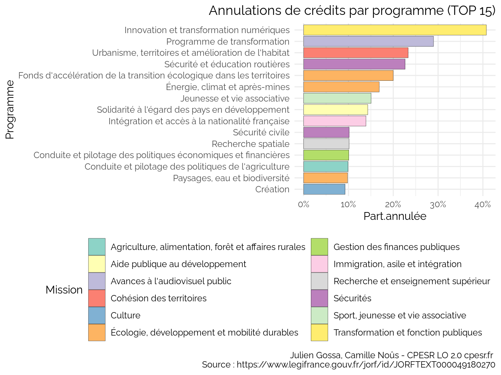

CPESR
================
CPESR
2024-02-22

## Données

- <https://www.legifrance.gouv.fr/jorf/id/JORFTEXT000049180270>
- <https://data.economie.gouv.fr/explore/dataset/plf-2024-depenses-2024-selon-nomenclatures-destination-et-nature/export/>

<!-- -->

    ## Joining with `by = join_by(Programme, Titre)`

## Explorations

    ## Warning: Using `size` aesthetic for lines was deprecated in ggplot2 3.4.0.
    ## ℹ Please use `linewidth` instead.
    ## This warning is displayed once every 8 hours.
    ## Call `lifecycle::last_lifecycle_warnings()` to see where this warning was
    ## generated.

