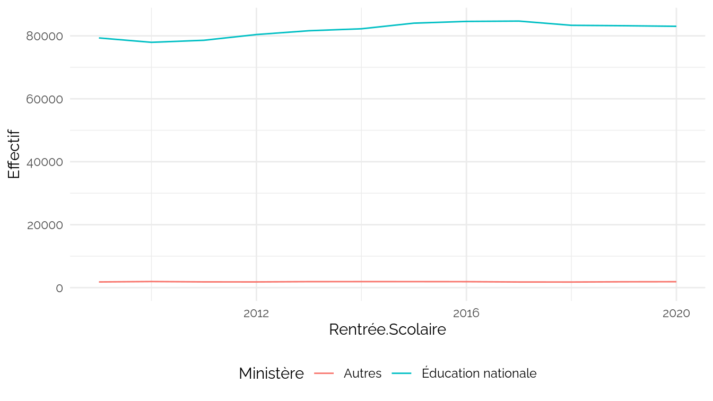
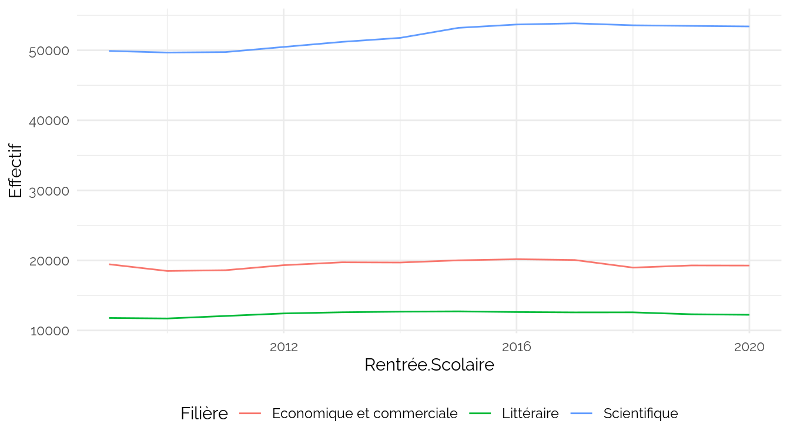
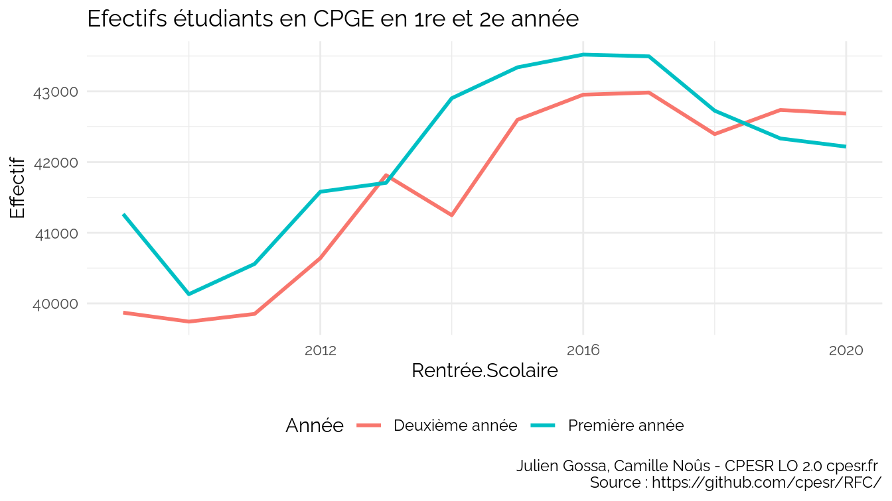

cpge
================
CPESR
2023-02-05

## Données

- <https://data.education.gouv.fr/explore/dataset/fr-en-effectifs-etudiants-cpge-par-annee-et-par-sexe/>

<!-- -->

    ## [1] "Rentrée.Scolaire"                 "Ministère"                       
    ## [3] "Filière"                          "Année"                           
    ## [5] "Nombre.de.garçons.dans.le.public" "Nombre.de.filles.dans.le.public" 
    ## [7] "Nombre.de.garçons.dans.le.privé"  "Nombre.de.filles.dans.le.privé"

## Explorations

### Ministère

### Filière

### Année

    ## Warning: Using `size` aesthetic for lines was deprecated in ggplot2 3.4.0.
    ## ℹ Please use `linewidth` instead.

