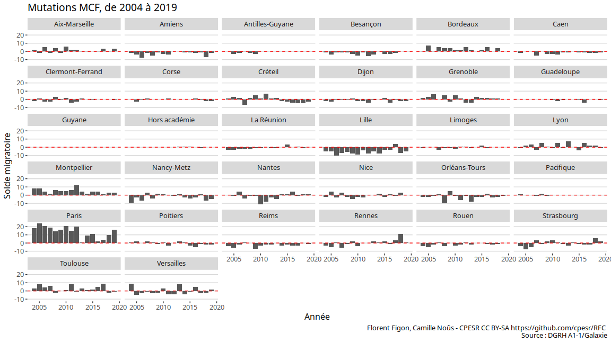
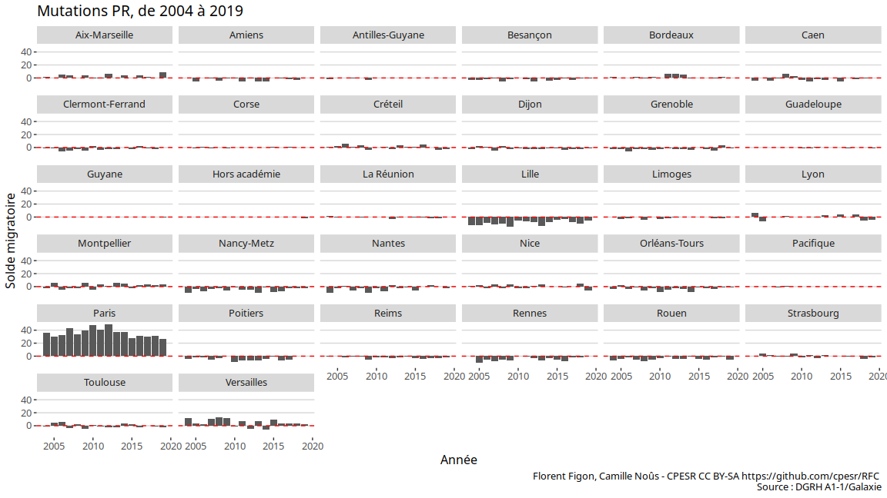
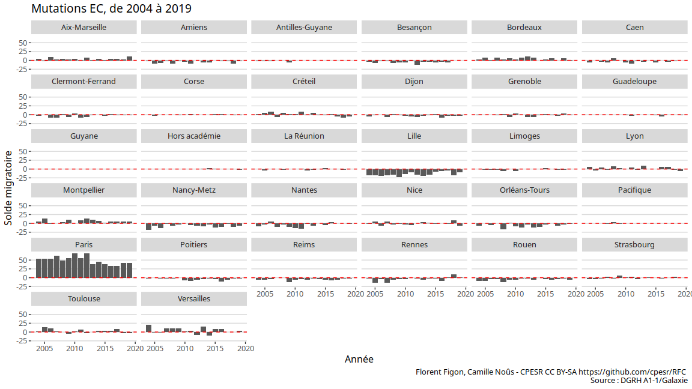

Recrutements par académie
================

## Description des données

  - Source :
    <https://www.enseignementsup-recherche.gouv.fr/cid118435/personnels-enseignants-du-superieur-bilans-et-statistiques.html>
  - Nombre d’observations : 474
  - Variables :

<!-- end list -->

    ## [1] "Academie"             "Annee"                "Solde.mutation.PR"   
    ## [4] "Solde.mutation.MCF"   "Solde.mutation.total"

  - Période : 2004, 2019

## Solde migratoire des mutations

### MCF

<!-- -->

### PR

<!-- -->

### Total EC (MCF + PR)

<!-- -->
