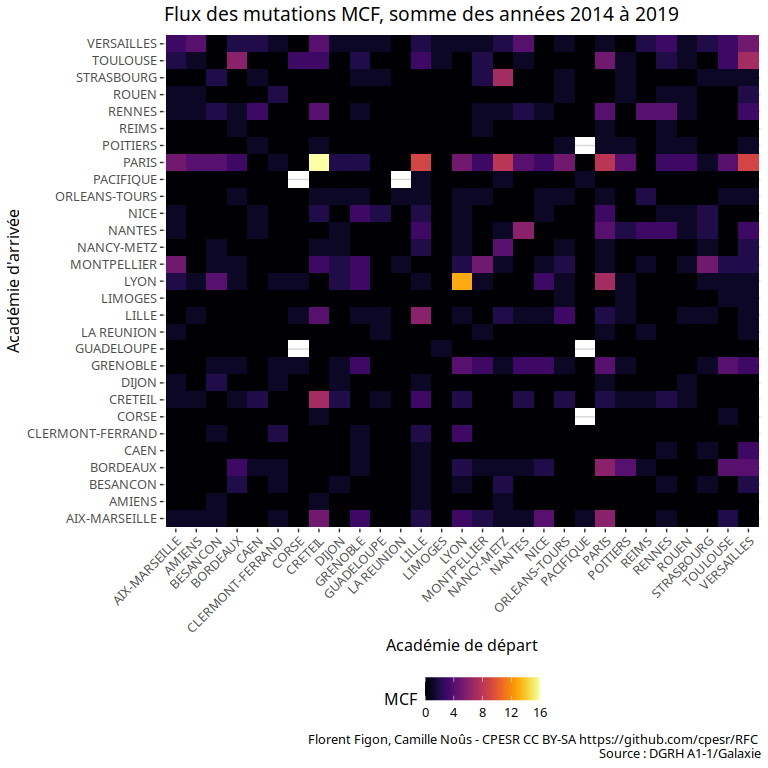

Recrutements par académie
================

## Description des données

  - Source :
    <https://www.enseignementsup-recherche.gouv.fr/cid118435/personnels-enseignants-du-superieur-bilans-et-statistiques.html>

### Recrutements par académies

  - Nombre d’observations : 474
  - Variables :

<!-- end list -->

    ## [1] "Academie"             "Annee"                "Solde.mutation.PR"   
    ## [4] "Solde.mutation.MCF"   "Solde.mutation.total"

  - Période : 2004, 2019

### Mutations entre académies

  - Nombre d’observations : 8170
  - Variables :

<!-- end list -->

    ## [1] "Annee"                    "Academie.origine"        
    ## [3] "Academie.recrutement"     "Groupe.CNU"              
    ## [5] "MCF"                      "Academie.origine.reg"    
    ## [7] "Academie.recrutement.reg"

  - Période : 2014, 2019

## Solde migratoire des mutations

### MCF

<!-- -->

### PR

<!-- -->

### Total EC (MCF + PR)

<!-- -->

## Flux géographiques des mutations MCF (sommes de 2014 à 2019)

    ## `summarise()` regrouping output by 'Academie.origine' (override with `.groups` argument)

<!-- -->

En regroupant les académies de Paris, Créteil et Versailles.

    ## `summarise()` regrouping output by 'Academie.origine.reg' (override with `.groups` argument)

<!-- -->
