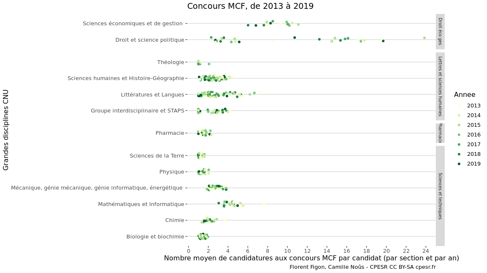
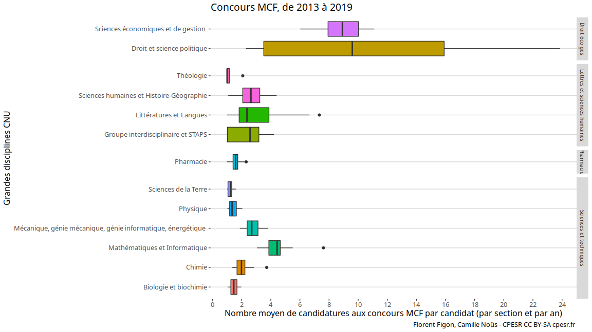
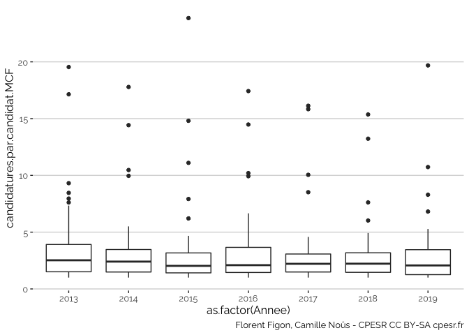
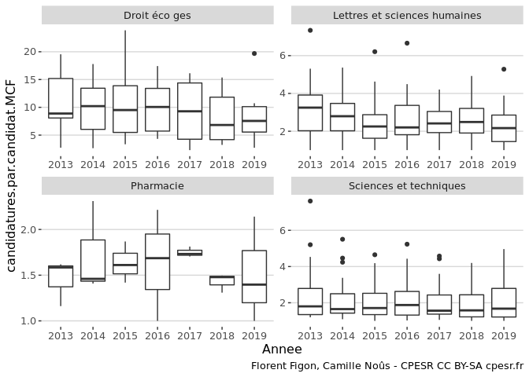

Concours MCF
================

*Ce document est un brouillon de différentes visualisations. Il a
seulement vocation à permettre la discussion. Les observations et
propositions peuvent être ajoutées [en
issues](https://github.com/cpesr/RFC/issues).*

## Description des données

  - Source :
    <https://www.enseignementsup-recherche.gouv.fr/cid118435/personnels-enseignants-du-superieur-bilans-et-statistiques.html>
  - Nombre d’observations : 855
  - Variables :

<!-- end list -->

    ##  [1] "TypeRecrutement"            "GrandeDisciplineCNU"       
    ##  [3] "GroupeCNU"                  "SectionCNU"                
    ##  [5] "SectionCNU.ID"              "Annee"                     
    ##  [7] "QualificationDossiers.MCF"  "QualificationQualifies.MCF"
    ##  [9] "PostesPublies.MCF"          "Candidatures.MCF"          
    ## [11] "Candidats.MCF"              "PostesPourvus.MCF"         
    ## [13] "Candidatures.MCF.F"         "Candidatures.MCF.H"        
    ## [15] "Candidats.MCF.F"            "Candidats.MCF.H"           
    ## [17] "Recrutes.MCF.F"             "Recrutes.MCF.H"

  - Période : 2005, 2019

## Nombre de candidatures par candidat aux postes MCF

### Vision globale par grande discipline et groupes CNU

<!-- -->

<!-- -->

**Remarques :**

  - Le nb de candidatures par candidat est borné par le nombre de postes
    publiés. S’il n’y a qu’un poste (ex. en LLA 2015), il ne peut y
    avoir qu’une candidature par candidat.
  - Ces calculs ne prennent pas en compte le fait que certains candidats
    candidatent dans plusieurs sections.
  - C’est un nombre moyen de candidatures. Certains candidatent plus,
    d’autres moins, et on ne connait pas cette disparité avec ce jeu
    de données.

**Questions :**

Si des personnes ont des idées de comment intégrer cette variable du nb
de postes dans le calcul et/ou l’analyse, nous sommes preneurs.

  - Une possibilité serait de ne garder que les sections \> 2 postes (ou
    tout autre chiffre plus pertinent).
  - \[@Pandalatesta\](<https://twitter.com/Pandalatesta/status/1333473037342175233>)
    : C’est possible d’avoir le nb de candidatures rapportés au nb de
    postes (en gros un candidat candidate à cb de % des postes publiés).
    Ca permettrait de voir si l’effet désespoir et plus fort que l’effet
    de spécialisation des profils qui permet de faire le tri.

Pour regarder le potentiel rôle du CNU comme filtre évitant le trop
plein de candidatures dans certaines disciplines :

  - \[@gaiauniversitas\](<https://twitter.com/gaiauniversitas/status/1333468971350200321>)
    : C’est certain qu’avec ce genre de graphe on comprend mieux
    pourquoi les profs de droits sont contre la suppression de la
    qualification.
  - \[@gaiauniversitas\](<https://twitter.com/gaiauniversitas/status/1333484701428969472>)
    : si dans une discipline les candidats font de nombreuses
    candidatures, on peut être tenté par un taux de qualification faible
    afin de ne pas submerger les comités de sélection.
  - \[@gaiauniversitas\](<https://twitter.com/gaiauniversitas/status/1333485369963270149>)
    : graphique du nombre moyen de candidatures par candidats, en
    fonction du taux de qualifiés
  - \[@snoevpr\](<https://twitter.com/Snoevpr/status/1333530523956862976>)
    : données sur 15 ans pour les postes publiés, et mettre en regard le
    nombre de candidats chaque année et le nombre de qualifiés (par
    section). Je doute qu on observe une corrélation significative….
  - \[@gaiauniversitas\](<https://twitter.com/gaiauniversitas/status/1333532431555702784>)
    : le point initial était l’étude d’une éventuelle corrélation entre
    le nombre moyen de candidatures par candidats en fonction du taux de
    qualifiés (section par section, ou groupe par groupe). Là je pense
    qu’on a des chances de voir une corrélation et ça peut être
    éclairant.
  - \[@snoevpr\](<https://twitter.com/Snoevpr/status/1333534262767857664>)
    : Pas si clair que ça soit si bien corrélé : par exemple, suivant
    les pratiques de fléchage, ça peut donner des choses assez
    différentes. Et y a un nombre non négligeable de qualifiés qui ne
    candidatent pas. A voir.

**Visualisation :**

  - \[@snoevpr\](<https://twitter.com/Snoevpr/status/1333487810280611843>)
    : le meme avec des symboles différents par section dans un groupe ?
  - \[@snoevpr\](<https://twitter.com/Snoevpr/status/1333511064248520707>)
    : tracer séparément chaque groupe puis superposer en décalant et
    sans les axes sauf pour un ?

### Evolution de 2013 à 2019 toutes sections confondues

<!-- -->

### Evolution de 2013 à 2019 par grande discipline

<!-- -->
