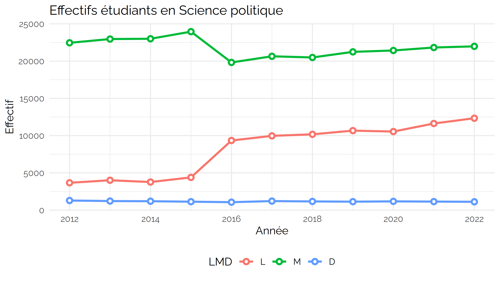
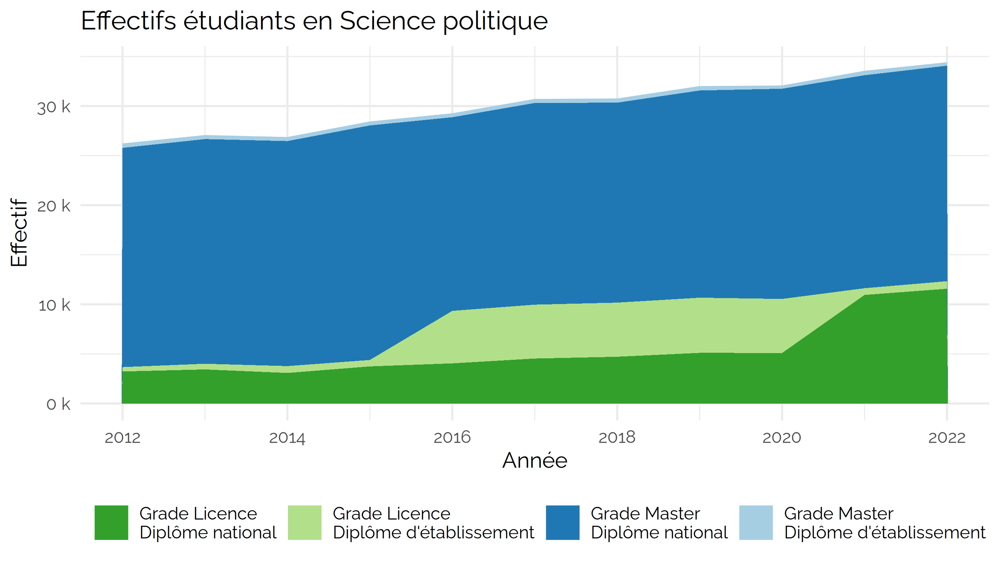
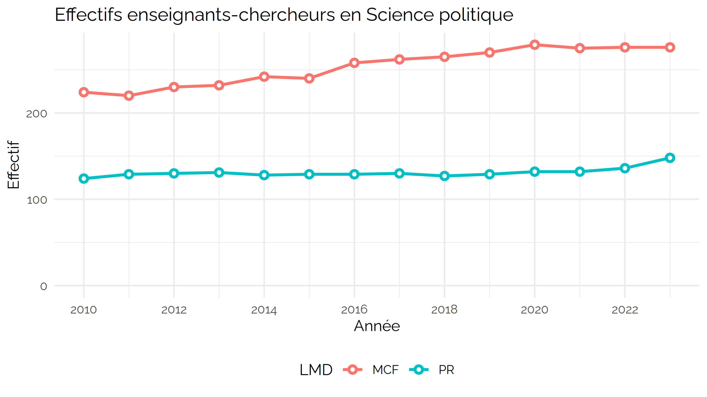
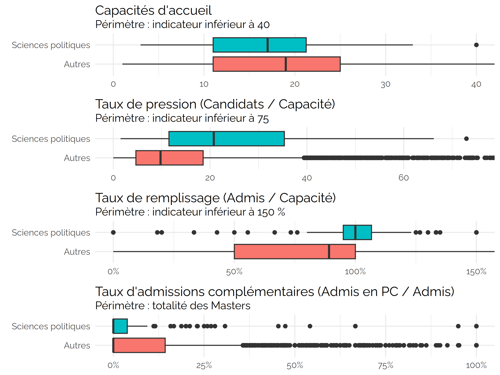
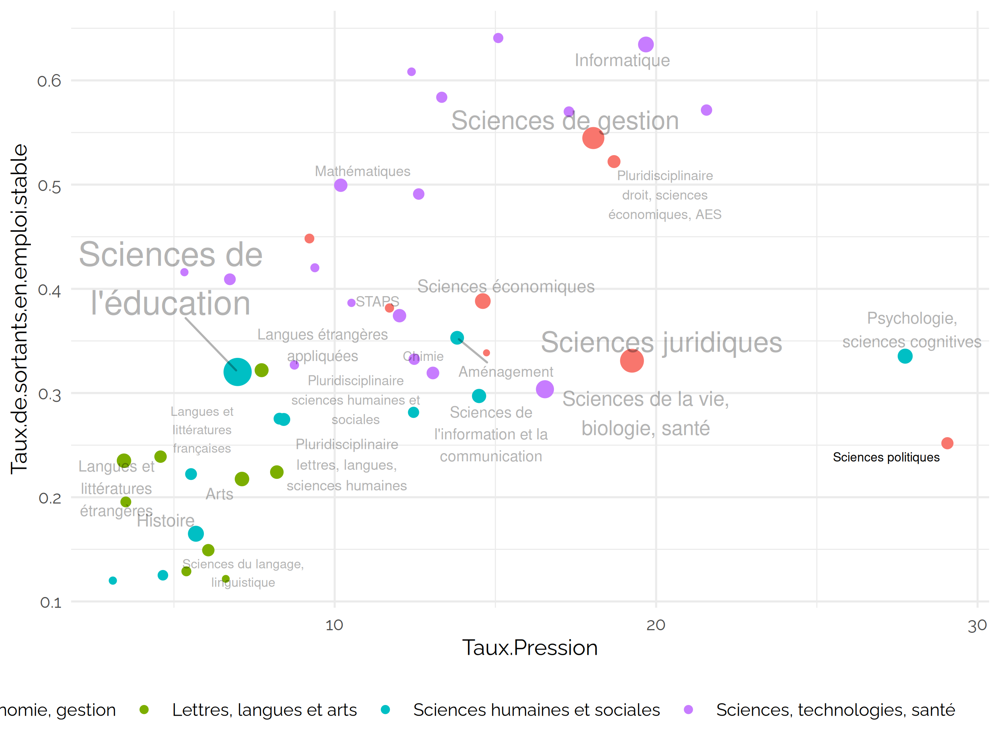

CPESR
================
CPESR
2025-03-16

## Données

## Explorations

Sexe ( 8 lignes)

| Rentrée | Catégorie    | Sexe  | Effectif | Part  |
|--------:|:-------------|:------|---------:|:------|
|    2022 | Doctorants   | Femme |      545 | 48.7% |
|    2022 | Doctorants   | Homme |      574 | 51.3% |
|    2022 | Etudiants LM | Femme |    21987 | 64%   |
|    2022 | Etudiants LM | Homme |    12328 | 36%   |
|    2022 | MCF          | Femme |      117 | 42%   |
|    2022 | MCF          | Homme |      159 | 58%   |
|    2022 | PR           | Femme |       38 | 28%   |
|    2022 | PR           | Homme |       98 | 72%   |

Données unnamed-chunk-4 ( 44 lignes)

| Rentrée | LMD | DN_DE | Effectif | Cursus | Diplôme         |
|--------:|:----|:------|---------:|:-------|:----------------|
|    2015 | L   | DU    |      652 | L DU   | d’établissement |
|    2015 | M   | DN    |    23654 | M DN   | national        |
|    2015 | M   | DU    |      298 | M DU   | d’établissement |
|    2015 | L   | DN    |     3738 | L DN   | national        |
|    2016 | L   | DU    |     5297 | L DU   | d’établissement |
|    2016 | M   | DN    |    19527 | M DN   | national        |

Données unnamed-chunk-7 ( 28 lignes)

| Rentrée | Catégorie | Effectif |
|--------:|:----------|---------:|
|    2011 | MCF       |      220 |
|    2011 | PR        |      129 |
|    2013 | PR        |      131 |
|    2013 | MCF       |      232 |
|    2010 | MCF       |      224 |
|    2010 | PR        |      124 |

Données unnamed-chunk-8 ( 51 lignes)

| Rentrée | Etablissement | Catégorie | Effectif |
|--------:|:--------------|:----------|---------:|
|    2011 | Autres        | MCF       |      219 |
|    2011 | Autres        | PR        |      117 |
|    2013 | Autres        | PR        |      119 |
|    2013 | Autres        | MCF       |      231 |
|    2010 | Autres        | MCF       |      223 |
|    2010 | Autres        | PR        |      113 |

Données unnamed-chunk-9 ( 33 lignes)

| Rentrée | Effectif | Type                   |    Val100 |
|--------:|---------:|:-----------------------|----------:|
|    2012 |      360 | Enseignants-chercheurs | 100.00000 |
|    2012 |     1289 | Doctorants             | 100.00000 |
|    2012 |    26124 | Etudiants LM           | 100.00000 |
|    2013 |      363 | Enseignants-chercheurs | 100.83333 |
|    2013 |     1217 | Doctorants             |  94.41427 |
|    2013 |    26969 | Etudiants LM           | 103.23457 |

## MonMaster

Nombre Masters ( 2 lignes)

| Session | Secteur.disciplinaire | Nombre | Part |
|--------:|:----------------------|-------:|:-----|
|    2024 | Autres                |   7966 | 98%  |
|    2024 | Sciences politiques   |    124 | 2%   |

Parcours ( 96 lignes)

| Session | Secteur.disciplinaire | Intitulé.de.la.mention | Intitulé.du.parcours | Capacité | Candidatures | Admis.PP | Admis.PC | Admis.HP |
|---:|:---|:---|:---|---:|---:|---:|---:|---:|
| 2024 | Sciences politiques | SCIENCE POLITIQUE | NA | 178 | 3405 | 153 | 1 | 2 |
| 2024 | Sciences politiques | GEOPOLITIQUE | NA | 104 | 1895 | 116 | 0 | 4 |
| 2024 | Sciences politiques | POLITIQUES PUBLIQUES | Politiques publiques (M1) | 90 | 2694 | 97 | 0 | 2 |
| 2024 | Sciences politiques | RELATIONS INTERNATIONALES | NA | 79 | 1174 | 72 | 13 | 0 |
| 2024 | Sciences politiques | SCIENCE POLITIQUE | Sciences politiques : Associations, Expertises et Métiers du politique | 47 | 880 | 46 | 0 | 6 |
| 2024 | Sciences politiques | SCIENCE POLITIQUE | M1 Science politique \#PR1110 | 43 | 2125 | 49 | 0 | 0 |
| 2024 | Sciences politiques | ETUDES POLITIQUES | NA | 40 | 134 | 39 | 0 | 0 |
| 2024 | Sciences politiques | ETUDES POLITIQUES | Violence et Politique | 30 | 215 | 35 | 0 | 0 |
| 2024 | Sciences politiques | SCIENCE POLITIQUE | Politique et Sécurité | 33 | 1054 | 33 | 0 | 0 |
| 2024 | Sciences politiques | RELATIONS INTERNATIONALES | Carrières internationales | 32 | 922 | 32 | 0 | 0 |
| 2024 | Sciences politiques | SCIENCE POLITIQUE | Action humanitaire internationale | 25 | 1136 | 20 | 0 | 12 |
| 2024 | Sciences politiques | SCIENCE POLITIQUE | Etudes politiques | 30 | 1509 | 30 | 0 | 1 |
| 2024 | Sciences politiques | POLITIQUES PUBLIQUES | Affaires publiques | 20 | 827 | 23 | 0 | 7 |
| 2024 | Sciences politiques | POLITIQUES PUBLIQUES | Administration et politiques publiques | 30 | 1072 | 29 | 0 | 0 |
| 2024 | Sciences politiques | SCIENCE POLITIQUE | Métiers de l’action territoriale | 29 | 495 | 29 | 0 | 0 |
| 2024 | Sciences politiques | SCIENCE POLITIQUE | Politique comparée et coopération internationale , Amériques | 28 | 513 | 28 | 0 | 0 |
| 2024 | Sciences politiques | SCIENCE POLITIQUE | Politique internationale et analyse des transitions (PIAT) | 24 | 762 | 26 | 0 | 2 |
| 2024 | Sciences politiques | SCIENCE POLITIQUE | Diversités et discriminations | 28 | 510 | 28 | 0 | 0 |
| 2024 | Sciences politiques | SCIENCE POLITIQUE | Sécurité globale: analyste politique | 28 | 956 | 28 | 0 | 0 |
| 2024 | Sciences politiques | SCIENCE POLITIQUE | Politique comparée: pensées et politiques du changement | 28 | 485 | 27 | 0 | 0 |
| 2024 | Sciences politiques | SCIENCE POLITIQUE | Politique transnationale et mondialisations | 28 | 812 | 26 | 0 | 0 |
| 2024 | Sciences politiques | SCIENCE POLITIQUE | Transformations socio- environnementales | 20 | 356 | 19 | 0 | 7 |
| 2024 | Sciences politiques | SCIENCE POLITIQUE | Métiers du politique | 25 | 655 | 25 | 0 | 0 |
| 2024 | Sciences politiques | POLITIQUES PUBLIQUES | Métiers de l’action publique et politique | 23 | 272 | 24 | 0 | 0 |
| 2024 | Sciences politiques | POLITIQUES PUBLIQUES | Gouvernance des données | 22 | 68 | 11 | 8 | 5 |
| 2024 | Sciences politiques | SCIENCE POLITIQUE | Communication et pouvoir | 23 | 1126 | 23 | 0 | 0 |
| 2024 | Sciences politiques | SCIENCE POLITIQUE | Action humanitaire | 22 | 945 | 22 | 0 | 0 |
| 2024 | Sciences politiques | SCIENCE POLITIQUE | Conflits et crises internationales | 22 | 2408 | 22 | 0 | 0 |
| 2024 | Sciences politiques | ETUDES POLITIQUES | Discours et Techniques du Politique | 30 | 164 | 21 | 0 | 0 |
| 2024 | Sciences politiques | POLITIQUES PUBLIQUES | Politiques de santé et risques environnementaux | 20 | 209 | 21 | 0 | 0 |
| 2024 | Sciences politiques | SCIENCE POLITIQUE | Politique comparée Afrique Moyen-Orient | 21 | 756 | 21 | 0 | 0 |
| 2024 | Sciences politiques | SCIENCE POLITIQUE | Métiers de l’international et de la coopération | 20 | 1027 | 20 | 0 | 0 |
| 2024 | Sciences politiques | POLITIQUES PUBLIQUES | Politiques sociales | 22 | 234 | 16 | 2 | 2 |
| 2024 | Sciences politiques | SCIENCE POLITIQUE | Gestion des collectivités territoriales | 20 | 344 | 20 | 0 | 0 |
| 2024 | Sciences politiques | SCIENCE POLITIQUE | Ingénierie de projets en politiques urbaines | 19 | 260 | 20 | 0 | 0 |
| 2024 | Sciences politiques | RELATIONS INTERNATIONALES | FRANCOPHONIE ET TRANSITION ECOLOGIQUE | 20 | 241 | 20 | 0 | 0 |
| 2024 | Sciences politiques | RELATIONS INTERNATIONALES | FRANCOPHONIE, STRATEGIES ET RELATIONS INTERNATIONALES | 20 | 447 | 20 | 0 | 0 |
| 2024 | Sciences politiques | SCIENCE POLITIQUE | M1 Action Publique et Stratégies France-International : M2 Politiques publiques et territoires | 20 | 417 | 20 | 0 | 0 |
| 2024 | Sciences politiques | SCIENCE POLITIQUE | Communication publique et démocratie participative | 20 | 502 | 20 | 0 | 0 |
| 2024 | Sciences politiques | RELATIONS INTERNATIONALES | SECURITE INTERNATIONALE ET DEFENSE | 20 | 1678 | 20 | 0 | 0 |
| 2024 | Sciences politiques | RELATIONS INTERNATIONALES | Relations internationales | 20 | 2505 | 20 | 0 | 0 |
| 2024 | Sciences politiques | SCIENCE POLITIQUE | M1 Politiques de communication : influence et affaires publiques \#PR1111 | 21 | 653 | 20 | 0 | 0 |
| 2024 | Sciences politiques | SCIENCE POLITIQUE | Travail politique et parlementaire | 20 | 378 | 20 | 0 | 0 |
| 2024 | Sciences politiques | SCIENCE POLITIQUE | Risques, sécurité et conflits | 20 | 794 | 20 | 0 | 0 |
| 2024 | Sciences politiques | RELATIONS INTERNATIONALES | PREVENTION ET GESTION DES RISQUES ET DES CRISES DANS L’ESPACE FRANCOPHONE | 20 | 526 | 20 | 0 | 0 |
| 2024 | Sciences politiques | RELATIONS INTERNATIONALES | FRANCOPHONIE, DEVELOPPEMENT CULTUREL ET LINGUISTIQUE | 20 | 327 | 20 | 0 | 0 |
| 2024 | Sciences politiques | GEOPOLITIQUE | Défense | 21 | 226 | 1 | 0 | 19 |
| 2024 | Sciences politiques | RELATIONS INTERNATIONALES | RELATIONS INTERNATIONALES ET DIPLOMATIE | 20 | 2346 | 19 | 0 | 0 |
| 2024 | Sciences politiques | SCIENCE POLITIQUE | Gouvernance et politiques urbaines alternatives (Altervilles) | 20 | 181 | 16 | 3 | 0 |
| 2024 | Sciences politiques | RELATIONS INTERNATIONALES | GESTION DE PROGRAMMES INTERNATIONAUX INTER-GOUVERNEMENTAUX ET NON-GOUVERNEMENTAUX | 20 | 1135 | 19 | 0 | 0 |
| 2024 | Sciences politiques | SCIENCE POLITIQUE | Métiers de la recherche en science politique | 20 | 296 | 15 | 4 | 0 |
| 2024 | Sciences politiques | SCIENCE POLITIQUE | Politiques européennes - Voisinages de l’Union européenne (AlterEurope) | 20 | 334 | 19 | 0 | 0 |
| 2024 | Sciences politiques | SCIENCE POLITIQUE | Enjeux sociaux et politiques de santé | 20 | 113 | 10 | 9 | 0 |
| 2024 | Sciences politiques | POLITIQUES PUBLIQUES | Droit de l’action publique | 25 | 165 | 16 | 0 | 3 |
| 2024 | Sciences politiques | SCIENCE POLITIQUE | Affaires publiques européennes | 18 | 1313 | 18 | 0 | 0 |
| 2024 | Sciences politiques | SCIENCE POLITIQUE | Expertise du politique et action publique | 20 | 742 | 18 | 0 | 0 |
| 2024 | Sciences politiques | SCIENCE POLITIQUE | Politique et sécurité en FOAD | 15 | 116 | 16 | 2 | 0 |
| 2024 | Sciences politiques | RELATIONS INTERNATIONALES | EXPERTISE ET RISQUES INTERNATIONAUX | 18 | 1155 | 17 | 0 | 0 |
| 2024 | Sciences politiques | RELATIONS INTERNATIONALES | Relations internationales et action à l’étranger | 17 | 3081 | 17 | 0 | 0 |
| 2024 | Sciences politiques | RELATIONS INTERNATIONALES | INTELLIGENCE STRATEGIQUE ET GESTION DE CRISES | 17 | 716 | 17 | 0 | 0 |
| 2024 | Sciences politiques | SCIENCE POLITIQUE | Transformations des démocraties contemporaines - Enquêtes, études, expertise | 17 | 377 | 17 | 0 | 0 |
| 2024 | Sciences politiques | RELATIONS INTERNATIONALES | Défense et dynamiques industrielles | 15 | 568 | 13 | 0 | 3 |
| 2024 | Sciences politiques | SCIENCE POLITIQUE | Sociologie politique et sociologie politique de l’international | 16 | 278 | 16 | 0 | 0 |
| 2024 | Sciences politiques | SCIENCE POLITIQUE | Culture et politique : mots, images, théories | 19 | 362 | 16 | 0 | 0 |
| 2024 | Sciences politiques | SCIENCE POLITIQUE | Affaires européennes | 19 | 808 | 16 | 0 | 0 |
| 2024 | Sciences politiques | ECONOMIE POLITIQUE ET INSTITUTIONS | M1 Economie, organisations et sociétés \#PR1147 | 13 | 92 | 16 | 0 | 0 |
| 2024 | Sciences politiques | SCIENCE POLITIQUE | Métiers des études et du conseil | 15 | 384 | 15 | 0 | 0 |
| 2024 | Sciences politiques | SCIENCE POLITIQUE | Développement et action humanitaire | 15 | 1247 | 15 | 0 | 0 |
| 2024 | Sciences politiques | SCIENCE POLITIQUE | Économie - Science Politique : Gouvernance des sociétés et territoires en transition | 10 | 352 | 15 | 0 | 0 |
| 2024 | Sciences politiques | SCIENCE POLITIQUE | M1 Action Publique et Stratégies France-International : M2 études stratégiques | 16 | 444 | 15 | 0 | 0 |
| 2024 | Sciences politiques | POLITIQUES PUBLIQUES | Opérateur en coopération internationale et développement | 15 | 339 | 15 | 0 | 0 |
| 2024 | Sciences politiques | SCIENCE POLITIQUE | M1 Action Publique et Stratégies France-International : M2 Coopération internationale et ONG | 13 | 739 | 13 | 0 | 0 |
| 2024 | Sciences politiques | POLITIQUES PUBLIQUES | Administration publique | 13 | 343 | 13 | 0 | 0 |
| 2024 | Sciences politiques | SCIENCE POLITIQUE | Politique Internationale | 13 | 376 | 10 | 3 | 0 |
| 2024 | Sciences politiques | ECONOMIE POLITIQUE ET INSTITUTIONS | M1 Economie et évaluation du développement et de la soutenabilité \#PR1146 | 12 | 177 | 9 | 4 | 0 |
| 2024 | Sciences politiques | SCIENCE POLITIQUE | M1 Action Publique et Stratégies France-International : M2 Politiques commerciales avec les pays émergents | 13 | 178 | 13 | 0 | 0 |
| 2024 | Sciences politiques | SCIENCE POLITIQUE | Migrations studies - Political Studies | 10 | 253 | 13 | 0 | 0 |
| 2024 | Sciences politiques | POLITIQUES PUBLIQUES | Transformation numérique et territoires | 15 | 74 | 4 | 2 | 6 |
| 2024 | Sciences politiques | ECONOMIE POLITIQUE ET INSTITUTIONS | M1 Sécurité des Transports et de leurs Réseaux, Institutions et Territoires \#PR1148 | 9 | 63 | 10 | 2 | 0 |
| 2024 | Sciences politiques | SCIENCE POLITIQUE | Transformations des démocraties contemporaines - Action publique et territoires | 11 | 506 | 11 | 0 | 0 |
| 2024 | Sciences politiques | SCIENCE POLITIQUE | Action Publique Territoriale | 11 | 222 | 6 | 5 | 0 |
| 2024 | Sciences politiques | SCIENCE POLITIQUE | Enquêtes et analyse des processus politiques (EAPP) | 12 | 324 | 10 | 0 | 1 |
| 2024 | Sciences politiques | SCIENCE POLITIQUE | Transformations des démocraties contemporaines - Administration du politique | 11 | 501 | 11 | 0 | 0 |
| 2024 | Sciences politiques | SCIENCE POLITIQUE | Transformations des démocraties contemporaines - Transitions écologiques | 11 | 413 | 10 | 0 | 0 |
| 2024 | Sciences politiques | POLITIQUES COMPAREES | Politique et action publique comparées - Master Comparative Politics and Public policy (parcours IDIL) | 10 | 95 | 8 | 2 | 0 |
| 2024 | Sciences politiques | SCIENCE POLITIQUE | Transformations des démocraties contemporaines - Ingénierie de la concertation | 9 | 124 | 9 | 0 | 0 |
| 2024 | Sciences politiques | ECONOMIE POLITIQUE ET INSTITUTIONS | M1 Valorisation touristique des patrimoines et préservation de l’environnement \#PR1149 | 9 | 59 | 6 | 2 | 0 |
| 2024 | Sciences politiques | SCIENCE POLITIQUE | Sécurité globale et analyste politique international | 7 | 226 | 7 | 0 | 0 |
| 2024 | Sciences politiques | POLITIQUES PUBLIQUES | Enseignement, droit, économie, management (EDEM) | 9 | 55 | 5 | 0 | 0 |
| 2024 | Sciences politiques | POLITIQUES PUBLIQUES | Graduate Program EcoLe Socio-Environnementale – Politiques de Santé et Risques Environnementaux | 3 | 20 | 4 | 0 | 0 |
| 2024 | Sciences politiques | POLITIQUES PUBLIQUES | Graduate program Numérique, politique, droit majeure Science Politique | 3 | 10 | 0 | 0 | 3 |
| 2024 | Sciences politiques | SCIENCE POLITIQUE | Graduate Program EcoLe Socio-Environnementale – Transformations socio-environnementales | 3 | 40 | 1 | 2 | 0 |
| 2024 | Sciences politiques | SCIENCE POLITIQUE | Sciences culturelles et sociales / Soziokulturelle Studien | 7 | 38 | 3 | 0 | 0 |
| 2024 | Sciences politiques | POLITIQUES PUBLIQUES | Earth Law (EL) | 4 | 8 | 2 | 0 | 0 |
| 2024 | Sciences politiques | SCIENCE POLITIQUE | Double diplôme international Master Science politique / Maitrise es Arts en étude de conflits | 3 | 185 | 1 | 0 | 0 |
| 2024 | Sciences politiques | SCIENCE POLITIQUE | Science politique internationale Ecole universitaire de recherche Francophonies Plurilinguismes : Politique des langues FRAPP | 5 | 26 | 0 | 0 | 0 |

Mention ( 7 lignes)

| Session | Secteur.disciplinaire | Intitulé.de.la.mention | Capacité | Candidatures | Admis.PP | Admis.PC | Admis.HP |
|---:|:---|:---|---:|---:|---:|---:|---:|
| 2024 | Sciences politiques | SCIENCE POLITIQUE | 1241 | 36761 | 1170 | 29 | 31 |
| 2024 | Sciences politiques | RELATIONS INTERNATIONALES | 338 | 16821 | 326 | 13 | 3 |
| 2024 | Sciences politiques | POLITIQUES PUBLIQUES | 314 | 6390 | 280 | 12 | 28 |
| 2024 | Sciences politiques | GEOPOLITIQUE | 125 | 2121 | 117 | 0 | 23 |
| 2024 | Sciences politiques | ETUDES POLITIQUES | 100 | 513 | 95 | 0 | 0 |
| 2024 | Sciences politiques | ECONOMIE POLITIQUE ET INSTITUTIONS | 43 | 391 | 41 | 8 | 0 |
| 2024 | Sciences politiques | POLITIQUES COMPAREES | 10 | 95 | 8 | 2 | 0 |

Discipline ( 1 lignes)

| Session | Secteur.disciplinaire | Capacité | Candidatures | Admis.PP | Admis.PC | Admis.HP |
|--------:|:----------------------|---------:|-------------:|---------:|---------:|---------:|
|    2024 | Sciences politiques   |     2171 |        63092 |     2037 |       64 |       85 |

## Insersion Pro

## Carte MM IP

