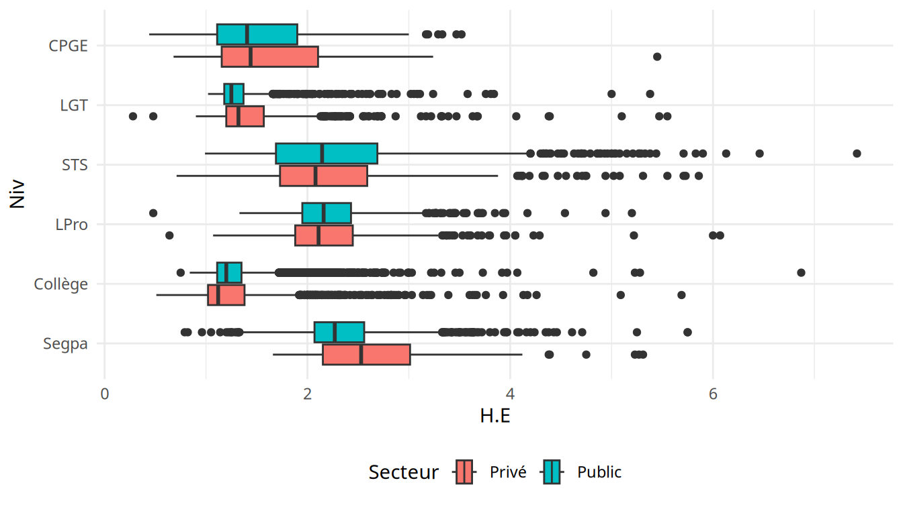
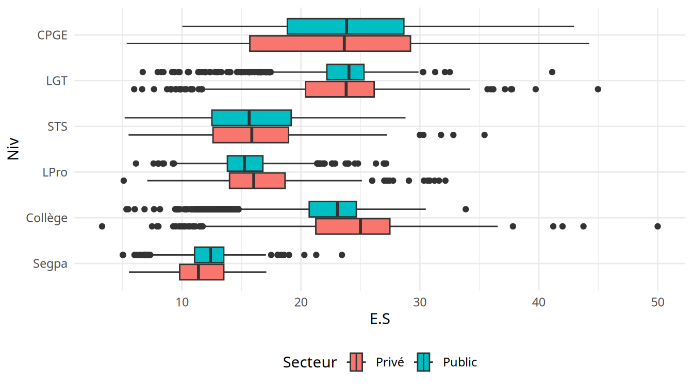
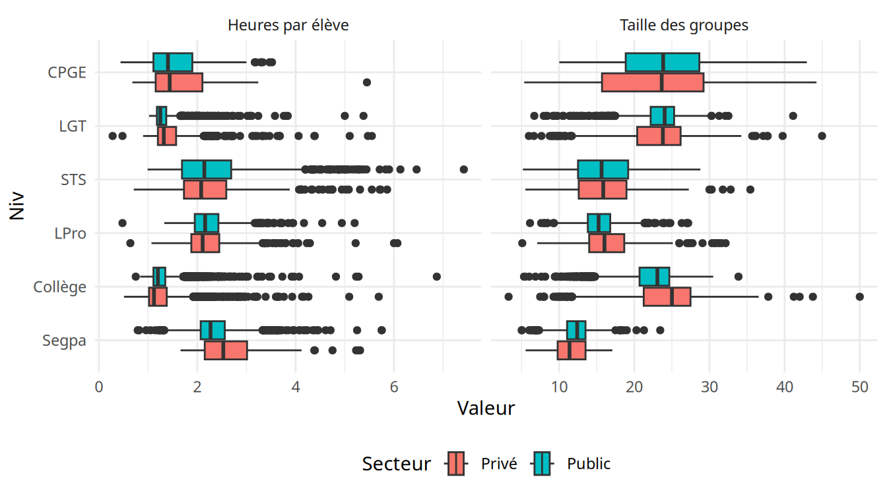
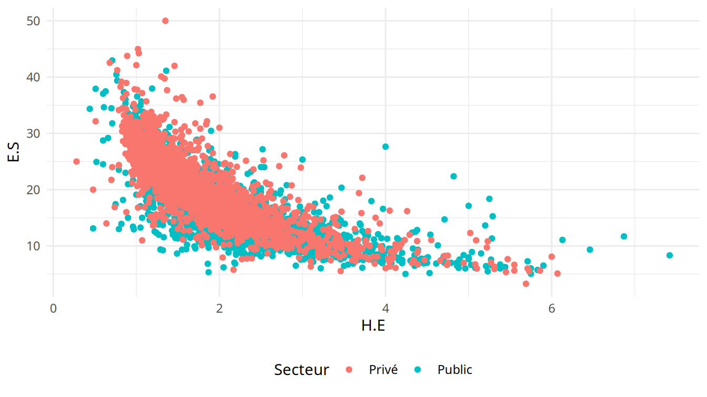
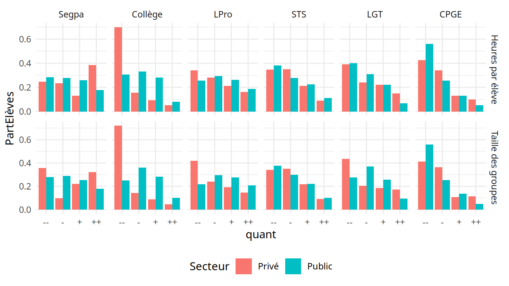
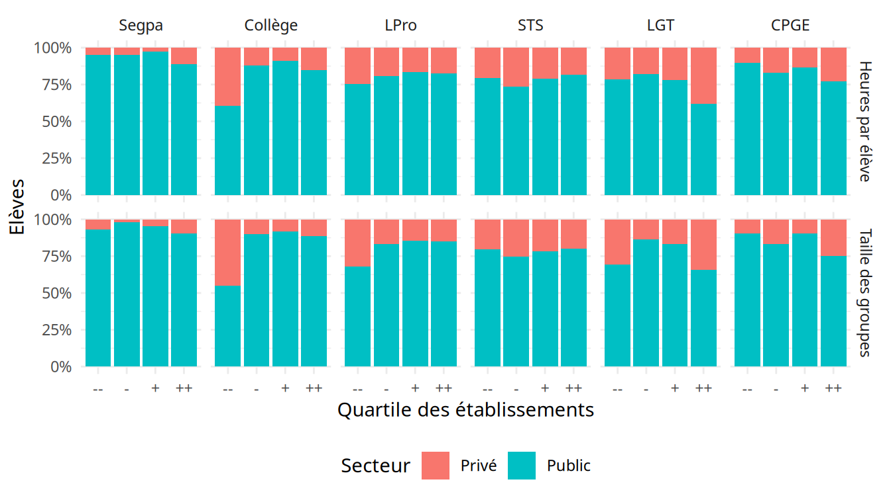
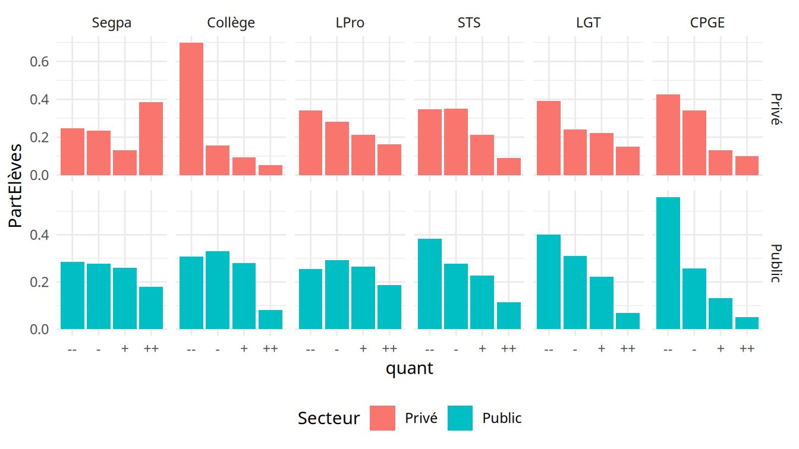

CPESR
================
CPESR
2024-09-25

## Données

- url source

<!-- -->

    ##  [1] "num_ligne"                                                                                                          
    ##  [2] "Année"                                                                                                              
    ##  [3] "Période.d.observation"                                                                                              
    ##  [4] "UAI"                                                                                                                
    ##  [5] "Nom.de.l.établissement"                                                                                             
    ##  [6] "Académie"                                                                                                           
    ##  [7] "Code.département"                                                                                                   
    ##  [8] "Libellé.departement"                                                                                                
    ##  [9] "Niveau"                                                                                                             
    ## [10] "Numérateur.H.E...nombre.d.heures.d.enseignement.hebdomadaire.devant.élèves."                                        
    ## [11] "Dénominateur.H.E...somme.des.élèves.en.division."                                                                   
    ## [12] "H.E"                                                                                                                
    ## [13] "Numérateur.E.S...nombre.d.élèves.d.une.structure.pondéré.par.le.nombre.d.heures.d.enseignement.dans.cette.structure"
    ## [14] "Dénominateur.E.S...nombre.d.heures.d.enseignement.hebdomadaire.devant.élèves."                                      
    ## [15] "E.S"                                                                                                                
    ## [16] "Secteur"                                                                                                            
    ## [17] "Numérateur.H.E..nombre.d.heures.d.enseignement.hebdomadaire.devant.élèves."                                         
    ## [18] "Dénominateur.H.E..somme.des.élèves.en.division."                                                                    
    ## [19] "Numérateur.E.S..nombre.d.élèves.d.une.structure.pondéré.par.le.nombre.d.heures.d.enseignement.dans.cette.structure" 
    ## [20] "Dénominateur.E.S..nombre.d.heures.d.enseignement.hebdomadaire.devant.élèves."                                       
    ## [21] "Elèves"

## Explorations

    ## Warning: Removed 131 rows containing non-finite outside the scale range
    ## (`stat_boxplot()`).

    ## Warning: Removed 115 rows containing non-finite outside the scale range
    ## (`stat_boxplot()`).

    ## Warning: Removed 246 rows containing non-finite outside the scale range
    ## (`stat_boxplot()`).

    ## Warning: Removed 132 rows containing missing values or values outside the scale range
    ## (`geom_point()`).

