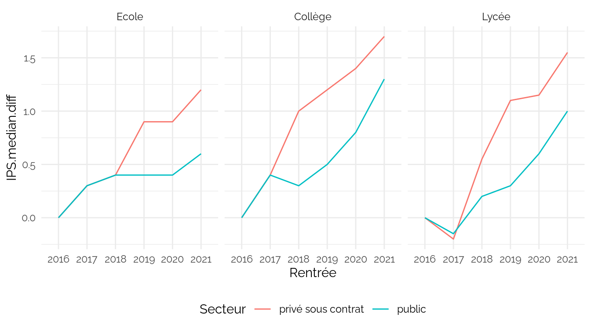

IPS
================
CPESR
2023-02-06

## Données

- <https://data.education.gouv.fr/explore/dataset/fr-en-ips_ecoles_v2>
- <https://data.education.gouv.fr/explore/dataset/fr-en-ips_colleges>
- <https://data.education.gouv.fr/explore/dataset/fr-en-ips_lycees>

<!-- -->

    ##  [1] "Rentrée.scolaire"         "Académie"                
    ##  [3] "Code.du.département"      "Département"             
    ##  [5] "UAI"                      "Nom.de.l.établissment"   
    ##  [7] "Code.INSEE.de.la.commune" "Nom.de.la.commune"       
    ##  [9] "Secteur"                  "IPS"

    ##  [1] "Rentrée.scolaire"         "Académie"                
    ##  [3] "Code.du.département"      "Département"             
    ##  [5] "UAI"                      "Nom.de.l.établissment"   
    ##  [7] "Code.INSEE.de.la.commune" "Nom.de.la.commune"       
    ##  [9] "Secteur"                  "IPS"                     
    ## [11] "Ecart.type.de.l.IPS"

    ##  [1] "rentree_scolaire"             "academie"                    
    ##  [3] "code_du_departement"          "departement"                 
    ##  [5] "uai"                          "nom_de_l_etablissment"       
    ##  [7] "code_insee_de_la_commune"     "nom_de_la_commune"           
    ##  [9] "secteur"                      "type_de_lycee"               
    ## [11] "ips_voie_gt"                  "ips_voie_pro"                
    ## [13] "ips_ensemble_gt_pro"          "ecart_type_de_l_ips_voie_gt" 
    ## [15] "ecart_type_de_l_ips_voie_pro"

    ##  [1] "Rentrée.scolaire"             "Académie"                    
    ##  [3] "Code.du.département"          "Département"                 
    ##  [5] "UAI"                          "Nom.de.l.établissment"       
    ##  [7] "Code.INSEE.de.la.commune"     "Nom.de.la.commune"           
    ##  [9] "Secteur"                      "IPS"                         
    ## [11] "Niveau"                       "Ecart.type.de.l.IPS"         
    ## [13] "type_de_lycee"                "ips_voie_gt"                 
    ## [15] "ips_voie_pro"                 "ecart_type_de_l_ips_voie_gt" 
    ## [17] "ecart_type_de_l_ips_voie_pro" "Rentrée"

## Explorations

### Départements

### Académie

## Privé public

### Type lycée

    ## Warning: Removed 16206 rows containing non-finite values (`stat_boxplot()`).

### Type lycée par IPS / département

    ## `geom_smooth()` using formula = 'y ~ x'

    ## Warning: The following aesthetics were dropped during statistical transformation: label
    ## ℹ This can happen when ggplot fails to infer the correct grouping structure in
    ##   the data.
    ## ℹ Did you forget to specify a `group` aesthetic or to convert a numerical
    ##   variable into a factor?

    ## Warning: ggrepel: 69 unlabeled data points (too many overlaps). Consider
    ## increasing max.overlaps

