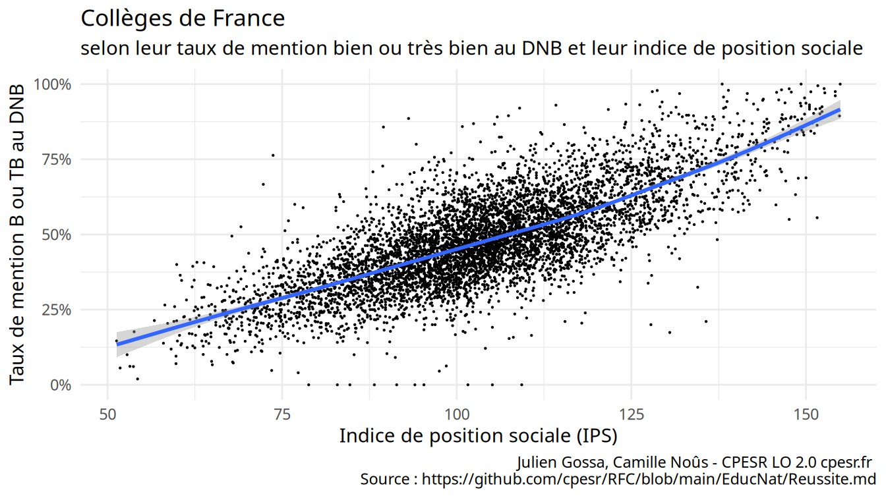
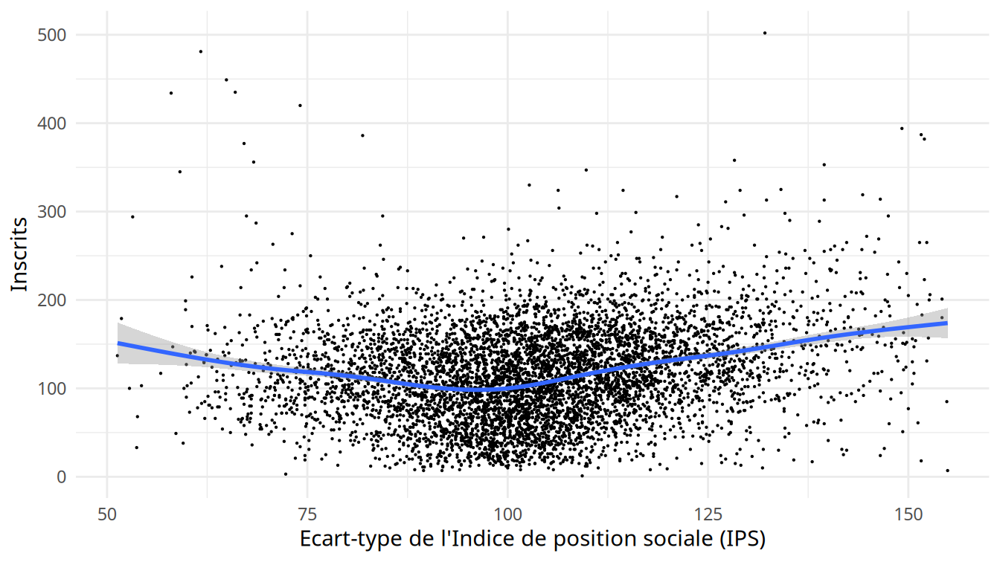
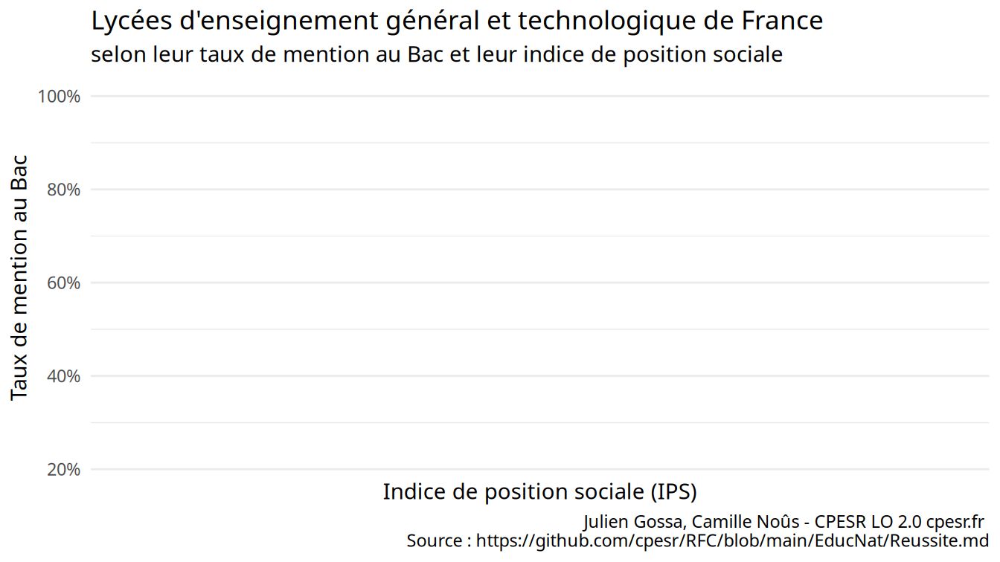
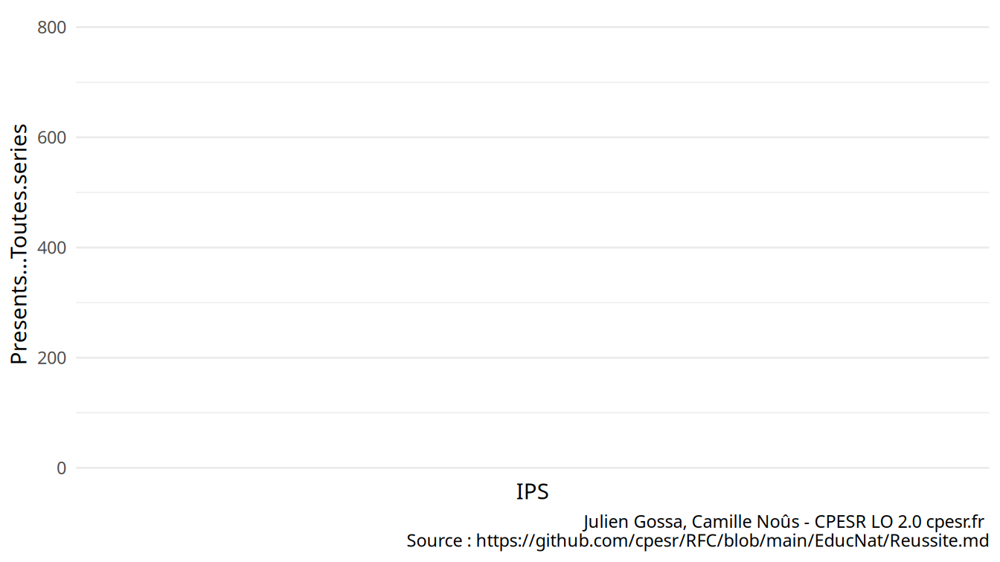

Réussite
================
CPESR
2023-04-19

## Données

## Données

- <https://data.education.gouv.fr/explore/dataset/fr-en-indicateurs-de-resultat-des-lycees-denseignement-general-et-technologique>

- <https://data.education.gouv.fr/explore/dataset/fr-en-indicateurs-de-resultat-des-lycees-denseignement-professionnels>

- <https://data.education.gouv.fr/explore/dataset/fr-en-dnb-par-etablissement>

- <https://data.education.gouv.fr/explore/dataset/fr-en-ips_ecoles_v2>

- <https://data.education.gouv.fr/explore/dataset/fr-en-ips_colleges>

- <https://data.education.gouv.fr/explore/dataset/fr-en-ips_lycees>

<!-- -->

    ##  [1] "Session"                   "Numero.d.etablissement"   
    ##  [3] "Type.d.etablissement"      "Patronyme"                
    ##  [5] "Secteur.d.enseignement"    "Commune"                  
    ##  [7] "Libellé.commune"           "Code.département"         
    ##  [9] "Libellé.département"       "Code.académie"            
    ## [11] "Libellé.académie"          "Code.région"              
    ## [13] "Libellé.région"            "Inscrits"                 
    ## [15] "Presents"                  "Admis"                    
    ## [17] "Admis.sans.mention"        "Nombre_d_admis_Mention_AB"
    ## [19] "Admis.Mention.bien"        "Admis.Mention.très.bien"  
    ## [21] "Taux.de.réussite"

    ##   [1] "Etablissement"                                                  
    ##   [2] "Annee"                                                          
    ##   [3] "Ville"                                                          
    ##   [4] "UAI"                                                            
    ##   [5] "Code.commune"                                                   
    ##   [6] "Academie"                                                       
    ##   [7] "Departement"                                                    
    ##   [8] "Secteur"                                                        
    ##   [9] "Presents...L"                                                   
    ##  [10] "Presents...ES"                                                  
    ##  [11] "Presents...S"                                                   
    ##  [12] "Presents...STG"                                                 
    ##  [13] "Presents...STI2D"                                               
    ##  [14] "Presents...STD2A"                                               
    ##  [15] "Presents...STMG"                                                
    ##  [16] "Presents...STI"                                                 
    ##  [17] "Presents...STL"                                                 
    ##  [18] "Presents...ST2S"                                                
    ##  [19] "Presents...TMD"                                                 
    ##  [20] "Presents...STHR"                                                
    ##  [21] "Presents...Toutes.series"                                       
    ##  [22] "Taux.de.reussite...L"                                           
    ##  [23] "Taux.de.reussite...ES"                                          
    ##  [24] "Taux.de.reussite...S"                                           
    ##  [25] "Taux.de.reussite...STG"                                         
    ##  [26] "Taux.de.reussite...STI2D"                                       
    ##  [27] "Taux.de.reussite...STD2A"                                       
    ##  [28] "Taux.de.reussite...STMG"                                        
    ##  [29] "Taux.de.reussite...STI"                                         
    ##  [30] "Taux.de.reussite...STL"                                         
    ##  [31] "Taux.de.reussite...ST2S"                                        
    ##  [32] "Taux.de.reussite...TMD"                                         
    ##  [33] "Taux.de.reussite...STHR"                                        
    ##  [34] "Taux.de.reussite...Toutes.series"                               
    ##  [35] "Taux.de.reussite.attendu.acad...L"                              
    ##  [36] "Taux.de.reussite.attendu.acad...ES"                             
    ##  [37] "Taux.de.reussite.attendu.acad...S"                              
    ##  [38] "Taux.de.reussite.attendu.acad...STG"                            
    ##  [39] "Taux.de.reussite.attendu.acad...STI2D"                          
    ##  [40] "Taux.de.reussite.attendu.acad...STD2A"                          
    ##  [41] "Taux.de.reussite.attendu.acad...STMG"                           
    ##  [42] "Taux.de.reussite.attendu.acad...STI"                            
    ##  [43] "Taux.de.reussite.attendu.acad...STL"                            
    ##  [44] "Taux.de.reussite.attendu.acad...ST2S"                           
    ##  [45] "Taux.de.reussite.attendu.acad...TMD"                            
    ##  [46] "Taux.de.reussite.attendu.acad...STHR"                           
    ##  [47] "Taux.de.reussite.attendu.acad...Toutes.series"                  
    ##  [48] "Taux.de.reussite.attendu.france...L"                            
    ##  [49] "Taux.de.reussite.attendu.france...ES"                           
    ##  [50] "Taux.de.reussite.attendu.france...S"                            
    ##  [51] "Taux.de.reussite.attendu.france...STG"                          
    ##  [52] "Taux.de.reussite.attendu.france...STI2D"                        
    ##  [53] "Taux.de.reussite.attendu.france...STD2A"                        
    ##  [54] "Taux.de.reussite.attendu.france...STMG"                         
    ##  [55] "Taux.de.reussite.attendu.france...STI"                          
    ##  [56] "Taux.de.reussite.attendu.france...STL"                          
    ##  [57] "Taux.de.reussite.attendu.france...ST2S"                         
    ##  [58] "Taux.de.reussite.attendu.france...TMD"                          
    ##  [59] "Taux.de.reussite.attendu.france...STHR"                         
    ##  [60] "Taux.de.reussite.attendu.france...Toutes.series"                
    ##  [61] "Taux.de.mentions...L"                                           
    ##  [62] "Taux.de.mentions...ES"                                          
    ##  [63] "Taux.de.mentions...S"                                           
    ##  [64] "Taux.de.mentions...STI2D"                                       
    ##  [65] "Taux.de.mentions...STD2A"                                       
    ##  [66] "Taux.de.mentions...STMG"                                        
    ##  [67] "Taux.de.mentions...STL"                                         
    ##  [68] "Taux.de.mentions...ST2S"                                        
    ##  [69] "Taux.de.mentions...TMD"                                         
    ##  [70] "Taux.de.mentions...STHR"                                        
    ##  [71] "Taux.de.mentions...Toutes.series"                               
    ##  [72] "Taux.de.mentions.attendu...L"                                   
    ##  [73] "Taux.de.mentions.attendu...ES"                                  
    ##  [74] "Taux.de.mentions.attendu...S"                                   
    ##  [75] "Taux.de.mentions.attendu...STI2D"                               
    ##  [76] "Taux.de.mentions.attendu...STD2A"                               
    ##  [77] "Taux.de.mentions.attendu...STMG"                                
    ##  [78] "Taux.de.mentions.attendu...STL"                                 
    ##  [79] "Taux.de.mentions.attendu...ST2S"                                
    ##  [80] "Taux.de.mentions.attendu...TMD"                                 
    ##  [81] "Taux.de.mentions.attendu...STHR"                                
    ##  [82] "Taux.de.mentions.attendu...Toutes.series"                       
    ##  [83] "Structure.pedagogique.5.groupes"                                
    ##  [84] "Structure.pedagogique.7.groupes"                                
    ##  [85] "Pourcentage.bacheliers.sortants.2de.1re.Terminale.Etablissement"
    ##  [86] "Pourcentage.bacheliers.sortants.Terminales.Etablissement"       
    ##  [87] "Pourcentage.bacheliers.sortants.2de.1re.Terminale.Acad"         
    ##  [88] "Pourcentage.bacheliers.sortants.Terminale.Acad"                 
    ##  [89] "Pourcentage.bacheliers.sortants.2de.1re.Terminale.France"       
    ##  [90] "Pourcentage.bacheliers.sortants.Terminale.France"               
    ##  [91] "Effectif.de.seconde"                                            
    ##  [92] "Effectif.de.premiere"                                           
    ##  [93] "Effectif.de.terminale"                                          
    ##  [94] "Taux.d.acces.2nde.bac"                                          
    ##  [95] "Taux.d.acces.attendu.acad.2nde.bac"                             
    ##  [96] "Taux.d.acces.attendu.france.2nde.bac"                           
    ##  [97] "Taux.d.acces.1ere.bac"                                          
    ##  [98] "Taux.d.acces.attendu.acad.1ere.bac"                             
    ##  [99] "Taux.d.acces.attendu.france.1ere.bac"                           
    ## [100] "Taux.d.acces.terminale.bac"                                     
    ## [101] "Taux.d.acces.attendu.france.terminale.bac"                      
    ## [102] "Region"                                                         
    ## [103] "Code.region"                                                    
    ## [104] "code_departement"                                               
    ## [105] "Libelle.departement"                                            
    ## [106] "Valeur.ajoutee.du.taux.de.reussite...Toutes.series"             
    ## [107] "Valeur.ajoutee.du.taux.d.acces.2nde.bac"                        
    ## [108] "Valeur.ajoutee.du.taux.de.mentions...Toutes.series"             
    ## [109] "Valeur.ajoutee.du.taux.de.reussite...L"                         
    ## [110] "Valeur.ajoutee.du.taux.de.reussite...ES"                        
    ## [111] "Valeur.ajoutee.du.taux.de.reussite...S"                         
    ## [112] "Valeur.ajoutee.du.taux.de.reussite...STG"                       
    ## [113] "Valeur.ajoutee.du.taux.de.reussite...STI2D"                     
    ## [114] "Valeur.ajoutee.du.taux.de.reussite...STD2A"                     
    ## [115] "Valeur.ajoutee.du.taux.de.reussite...STMG"                      
    ## [116] "Valeur.ajoutee.du.taux.de.reussite...STI"                       
    ## [117] "Valeur.ajoutee.du.taux.de.reussite...STL"                       
    ## [118] "Valeur.ajoutee.du.taux.de.reussite...ST2S"                      
    ## [119] "Valeur.ajoutee.du.taux.de.reussite...TMD"                       
    ## [120] "Valeur.ajoutee.du.taux.de.reussite...STHR"                      
    ## [121] "Valeur.ajoutee.du.taux.d.acces.1ere.bac"                        
    ## [122] "Valeur.ajoutee.du.taux.d.acces.terminale.bac"                   
    ## [123] "Valeur.ajoutee.du.taux.de.mentions...L"                         
    ## [124] "Valeur.ajoutee.du.taux.de.mentions...ES"                        
    ## [125] "Valeur.ajoutee.du.taux.de.mentions...S"                         
    ## [126] "Valeur.ajoutee.du.taux.de.mentions...STI2D"                     
    ## [127] "Valeur.ajoutee.du.taux.de.mentions...STD2A"                     
    ## [128] "Valeur.ajoutee.du.taux.de.mentions...STMG"                      
    ## [129] "Valeur.ajoutee.du.taux.de.mentions...STL"                       
    ## [130] "Valeur.ajoutee.du.taux.de.mentions...ST2S"                      
    ## [131] "Valeur.ajoutee.du.taux.de.mentions...TMD"                       
    ## [132] "Valeur.ajoutee.du.taux.de.mentions...STHR"                      
    ## [133] "Presents...Gnle"                                                
    ## [134] "Taux.de.reussite...Gnle"                                        
    ## [135] "Valeur.ajoutee.du.taux.de.réussite...Gnle"                      
    ## [136] "Taux.de.mentions...Gnle"                                        
    ## [137] "Valeur.ajoutée.du.taux.de.mentions...Gnle"

    ##   [1] "Etablissement"                                                                         
    ##   [2] "UAI"                                                                                   
    ##   [3] "Annee"                                                                                 
    ##   [4] "Ville"                                                                                 
    ##   [5] "Code.commune"                                                                          
    ##   [6] "Academie"                                                                              
    ##   [7] "Departement"                                                                           
    ##   [8] "Secteur"                                                                               
    ##   [9] "Presents...Specialites.pluri.technologiques.de.la.production"                          
    ##  [10] "Presents...Transformations"                                                            
    ##  [11] "Presents...Genie.civil.construction.bois"                                              
    ##  [12] "Presents...Materiaux.souples"                                                          
    ##  [13] "Presents...Mecanique.electricite.electronique"                                         
    ##  [14] "Presents...Production"                                                                 
    ##  [15] "Presents...Specialites.plurivalentes.des.services"                                     
    ##  [16] "Presents...Echanges.et.gestion"                                                        
    ##  [17] "Presents...Communication.et.information"                                               
    ##  [18] "Presents...Services.aux.personnes"                                                     
    ##  [19] "Presents...Services.a.la.collectivite"                                                 
    ##  [20] "Presents...Services"                                                                   
    ##  [21] "Presents...Toutes.series"                                                              
    ##  [22] "Taux.de.reussite...Specialites.pluri.technologiques.de.la.production"                  
    ##  [23] "Taux.de.reussite...Transformations"                                                    
    ##  [24] "Taux.de.reussite...Genie.civil.construction.bois"                                      
    ##  [25] "Taux.de.reussite...Materiaux.souples"                                                  
    ##  [26] "Taux.de.reussite...Mecanique.electricite.electronique"                                 
    ##  [27] "Taux.de.reussite...Production"                                                         
    ##  [28] "Taux.de.reussite...Specialites.plurivalentes.des.services"                             
    ##  [29] "Taux.de.reussite...Echanges.et.gestion"                                                
    ##  [30] "Taux.de.reussite...Communication.et.information"                                       
    ##  [31] "Taux.de.reussite...Services.aux.personnes"                                             
    ##  [32] "Taux.de.reussite...Services.a.la.collectivite"                                         
    ##  [33] "Taux.de.reussite...Services"                                                           
    ##  [34] "Taux.de.reussite...Toutes.series"                                                      
    ##  [35] "Taux.de.reussite.attendu.france...Specialites.pluri.technologiques.de.la.production"   
    ##  [36] "Taux.de.reussite.attendu.france...Transformations"                                     
    ##  [37] "Taux.de.reussite.attendu.france...Genie.civil.construction.bois"                       
    ##  [38] "Taux.de.reussite.attendu.france...Materiaux.souples"                                   
    ##  [39] "Taux.de.reussite.attendu.france...Mecanique.electricite.electronique"                  
    ##  [40] "Taux.de.reussite.attendu.france...Specialites.plurivalentes.des.services"              
    ##  [41] "Taux.de.reussite.attendu.france...Echanges.et.gestion"                                 
    ##  [42] "Taux.de.reussite.attendu.france...Communication.et.information"                        
    ##  [43] "Taux.de.reussite.attendu.france...Services.aux.personnes"                              
    ##  [44] "Taux.de.reussite.attendu.france...Services.a.la.collectivite"                          
    ##  [45] "Taux.de.reussite.attendu.acad...Production"                                            
    ##  [46] "Taux.de.reussite.attendu.acad...Services"                                              
    ##  [47] "Taux.de.reussite.attendu.acad...Toutes.series"                                         
    ##  [48] "Taux.de.reussite.attendu.france...Production"                                          
    ##  [49] "Taux.de.reussite.attendu.france...Services"                                            
    ##  [50] "Taux.de.reussite.attendu.france...Toutes.series"                                       
    ##  [51] "Pourcentage.bacheliers.sortants.2de.1re.Terminale.Etablissement"                       
    ##  [52] "Pourcentage.bacheliers.sortants.Terminales.Etablissement"                              
    ##  [53] "Pourcentage.bacheliers.sortants.2de.1re.Terminale.Acad"                                
    ##  [54] "Pourcentage.bacheliers.sortants.Terminale.Acad"                                        
    ##  [55] "Pourcentage.bacheliers.sortants.2de.1re.Terminale.France"                              
    ##  [56] "Pourcentage.bacheliers.sortants.Terminale.France"                                      
    ##  [57] "Effectif.de.seconde"                                                                   
    ##  [58] "Effectif.de.premiere"                                                                  
    ##  [59] "Effectif.de.terminale"                                                                 
    ##  [60] "Taux.d.acces.2nde.bac"                                                                 
    ##  [61] "Taux.d.acces.attendu.acad.2nde.bac"                                                    
    ##  [62] "Taux.d.acces.attendu.france.2nde.bac"                                                  
    ##  [63] "Taux.d.acces.1ere.bac"                                                                 
    ##  [64] "Taux.d.acces.attendu.acad.1ere.bac"                                                    
    ##  [65] "Taux.d.acces.attendu.france.1ere.bac"                                                  
    ##  [66] "Taux.d.acces.terminale.bac"                                                            
    ##  [67] "Taux.d.acces.attendu.france.terminale.bac"                                             
    ##  [68] "Taux.de.mentions...Specialites.pluri.technologiques.de.la.production"                  
    ##  [69] "Taux.de.mentions...Transformations"                                                    
    ##  [70] "Taux.de.mentions...Genie.civil.construction.bois"                                      
    ##  [71] "Taux.de.mentions...Materiaux.souples"                                                  
    ##  [72] "Taux.de.mentions...Mecanique.electricite.electronique"                                 
    ##  [73] "Taux.de.mentions...Specialites.plurivalentes.des.services"                             
    ##  [74] "Taux.de.mentions...Echanges.et.gestion"                                                
    ##  [75] "Taux.de.mentions...Communication.et.information"                                       
    ##  [76] "Taux.de.mentions...Services.aux.personnes"                                             
    ##  [77] "Taux.de.mentions...Services.a.la.collectivite"                                         
    ##  [78] "Taux.de.mentions...Production"                                                         
    ##  [79] "Taux.de.mentions...Services"                                                           
    ##  [80] "Taux.de.mentions...Toutes.series"                                                      
    ##  [81] "Taux.de.mentions.attendu...Specialites.pluri.technologiques.de.la.production"          
    ##  [82] "Taux.de.mentions.attendu...Transformations"                                            
    ##  [83] "Taux.de.mentions.attendu...Genie.civil.construction.bois"                              
    ##  [84] "Taux.de.mentions.attendu...Materiaux.souples"                                          
    ##  [85] "Taux.de.mentions.attendu...Mecanique.electricite.electronique"                         
    ##  [86] "Taux.de.mentions.attendu...Specialites.plurivalentes.des.services"                     
    ##  [87] "Taux.de.mentions.attendu...Echanges.et.gestion"                                        
    ##  [88] "Taux.de.mentions.attendu...Communication.et.information"                               
    ##  [89] "Taux.de.mentions.attendu...Services.aux.personnes"                                     
    ##  [90] "Taux.de.mentions.attendu...Services.a.la.collectivite"                                 
    ##  [91] "Taux.de.mentions.attendu...Production"                                                 
    ##  [92] "Taux.de.mentions.attendu...Services"                                                   
    ##  [93] "Taux.de.mentions.attendu...Toutes.series"                                              
    ##  [94] "Structure.pedagogique.7.groupes"                                                       
    ##  [95] "Region"                                                                                
    ##  [96] "Code.region"                                                                           
    ##  [97] "Libelle.departement"                                                                   
    ##  [98] "Code.departement"                                                                      
    ##  [99] "Valeur.ajoutee.du.taux.de.reussite...Specialites.pluri.technologiques.de.la.production"
    ## [100] "Valeur.ajoutee.du.taux.de.reussite...Transformations"                                  
    ## [101] "Valeur.ajoutee.du.taux.de.reussite...Genie.civil.construction.bois"                    
    ## [102] "Valeur.ajoutee.du.taux.de.reussite...Materiaux.souples"                                
    ## [103] "Valeur.ajoutee.du.taux.de.reussite...Mecanique.electricite.electronique"               
    ## [104] "Valeur.ajoutee.du.taux.de.reussite...Production"                                       
    ## [105] "Valeur.ajoutee.du.taux.de.reussite...Specialites.plurivalentes.des.services"           
    ## [106] "Valeur.ajoutee.du.taux.de.reussite...Echanges.et.gestion"                              
    ## [107] "Valeur.ajoutee.du.taux.de.reussite...Communication.et.information"                     
    ## [108] "Valeur.ajoutee.du.taux.de.reussite...Services.aux.personnes"                           
    ## [109] "Valeur.ajoutee.du.taux.de.reussite...Services.a.la.collectivite"                       
    ## [110] "Valeur.ajoutee.du.taux.de.reussite...Services"                                         
    ## [111] "Valeur.ajoutee.du.taux.de.reussite...Toutes.series"                                    
    ## [112] "Valeur.ajoutee.du.taux.d.acces.2nde.bac"                                               
    ## [113] "Valeur.ajoutee.du.taux.d.acces.1ere.bac"                                               
    ## [114] "Valeur.ajoutee.du.taux.d.acces.terminale.bac"                                          
    ## [115] "Valeur.ajoutee.du.taux.de.mentions...Specialites.pluri.technologiques.de.la.production"
    ## [116] "Valeur.ajoutee.du.taux.de.mentions...Transformations"                                  
    ## [117] "Valeur.ajoutee.du.taux.de.mentions...Genie.civil.construction.bois"                    
    ## [118] "Valeur.ajoutee.du.taux.de.mentions...Materiaux.souples"                                
    ## [119] "Valeur.ajoutee.du.taux.de.mentions...Mecanique.electricite.electronique"               
    ## [120] "Valeur.ajoutee.du.taux.de.mentions...Production"                                       
    ## [121] "Valeur.ajoutee.du.taux.de.mentions...Specialites.plurivalentes.des.services"           
    ## [122] "Valeur.ajoutee.du.taux.de.mentions...Echanges.et.gestion"                              
    ## [123] "Valeur.ajoutee.du.taux.de.mentions...Communication.et.information"                     
    ## [124] "Valeur.ajoutee.du.taux.de.mentions...Services.aux.personnes"                           
    ## [125] "Valeur.ajoutee.du.taux.de.mentions...Services.a.la.collectivite"                       
    ## [126] "Valeur.ajoutee.du.taux.de.mentions...Services"                                         
    ## [127] "Valeur.ajoutee.du.taux.de.mentions...Toutes.series"

    ##  [1] "Rentrée.scolaire"             "Académie"                    
    ##  [3] "Code.du.département"          "Département"                 
    ##  [5] "UAI"                          "Nom.de.l.établissment"       
    ##  [7] "Code.INSEE.de.la.commune"     "Nom.de.la.commune"           
    ##  [9] "Secteur"                      "IPS"                         
    ## [11] "Niveau"                       "Ecart.type.de.l.IPS"         
    ## [13] "type_de_lycee"                "ips_voie_gt"                 
    ## [15] "ips_voie_pro"                 "ecart_type_de_l_ips_voie_gt" 
    ## [17] "ecart_type_de_l_ips_voie_pro" "Rentrée"

## Explorations

### Collèges

    ## `geom_smooth()` using method = 'gam' and formula = 'y ~ s(x, bs = "cs")'

    ## `geom_smooth()` using method = 'gam' and formula = 'y ~ s(x, bs = "cs")'

    ## Warning: Removed 1182 rows containing non-finite values (`stat_smooth()`).

    ## Warning: Removed 1182 rows containing missing values (`geom_point()`).

    ## `geom_smooth()` using method = 'gam' and formula = 'y ~ s(x, bs = "cs")'

### Lycées

    ## `geom_smooth()` using method = 'gam' and formula = 'y ~ s(x, bs = "cs")'

    ## `geom_smooth()` using method = 'gam' and formula = 'y ~ s(x, bs = "cs")'

### Strasbourg

    ## Warning: Removed 178 rows containing missing values (`geom_text_repel()`).

