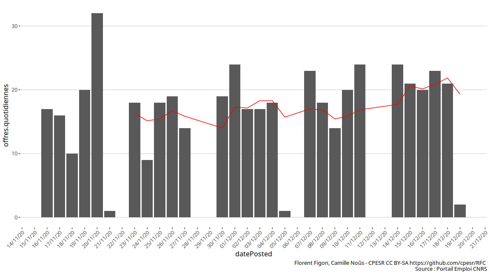
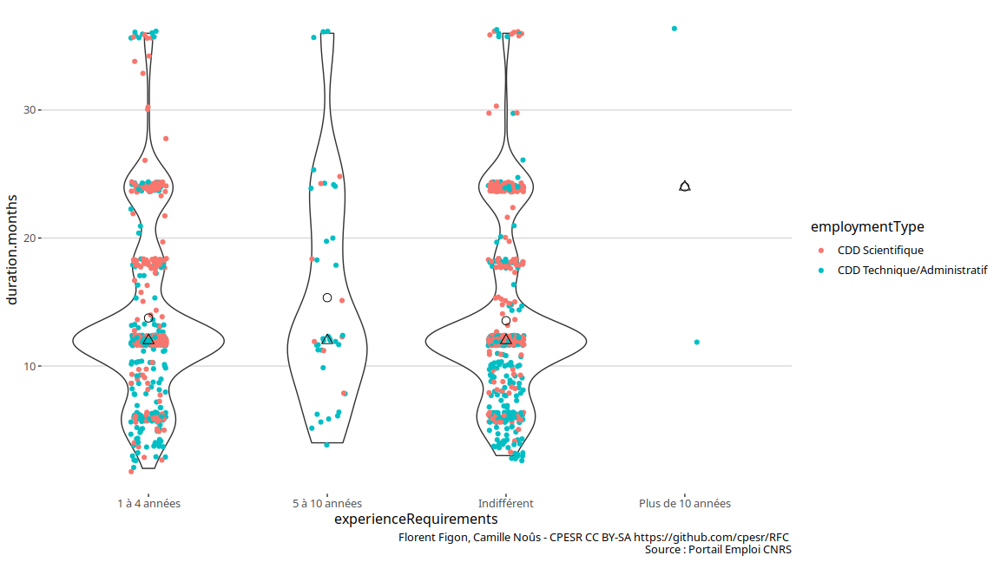
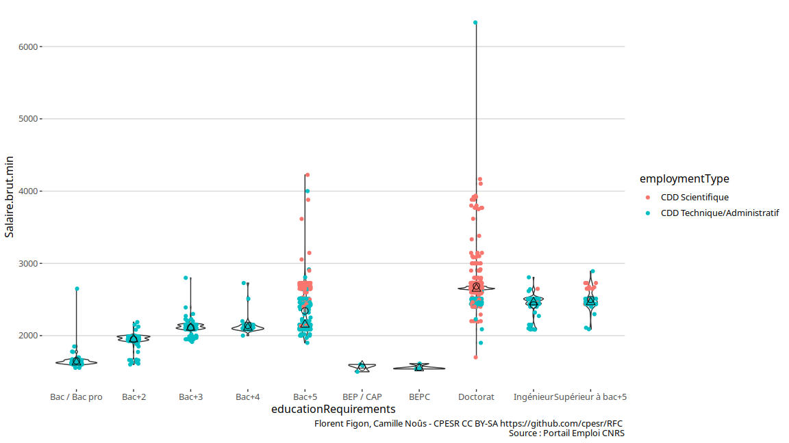
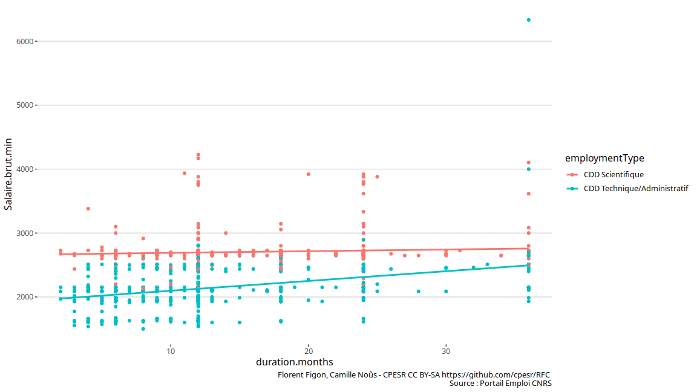
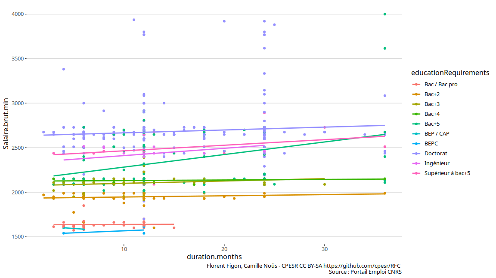

Emplois CDD CNRS
================

*Ce document est un brouillon de différentes visualisations. Il a
seulement vocation à permettre la discussion. Les observations et
propositions peuvent être ajoutées [en
issues](https://github.com/cpesr/RFC/issues).*

## Description des données

  - Source : <https://emploi.cnrs.fr/Offres.aspx>
  - Nombre d’observations : 1199
  - Variables :

<!-- end list -->

    ##  [1] "link"                   "reference"              "title"                 
    ##  [4] "jobLocation"            "datePosted"             "employmentType"        
    ##  [7] "duration.months"        "workHours"              "baseSalary"            
    ## [10] "Salaire.brut.min"       "Salaire.brut.max"       "educationRequirements" 
    ## [13] "experienceRequirements"

## Evolution du nombre d’offres de CDD

### Evolution quotidienne

    ## `summarise()` ungrouping output (override with `.groups` argument)

<!-- -->

## Durée des CDD

### Durée en fonction du niveau d’étude requis

<!-- -->

### Durée en fonction de l’expérience requise

<!-- -->

## Salaire brut des CDD

### Salaire brut minimal en fonction de l’expérience requise

<!-- -->

### Salaire brut minimal en fonction du niveau d’étude requis

<!-- -->

### Salaire brut minimal en fonction de la durée du contrat

    ## `geom_smooth()` using formula 'y ~ x'

<!-- -->

    ## `geom_smooth()` using formula 'y ~ x'

<!-- -->
