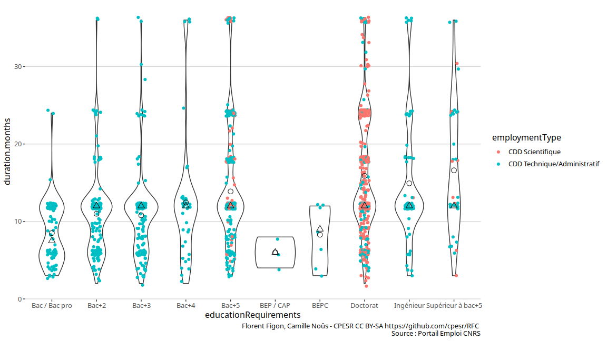

Emplois CDD CNRS
================

*Ce document est un brouillon de différentes visualisations. Il a
seulement vocation à permettre la discussion. Les observations et
propositions peuvent être ajoutées [en
issues](https://github.com/cpesr/RFC/issues).*

## Description des données

  - Source : <https://emploi.cnrs.fr/Offres.aspx>
  - Nombre d’observations : 273
  - Variables :

<!-- end list -->

    ##  [1] "link"                   "reference"              "title"                 
    ##  [4] "jobLocation"            "datePosted"             "employmentType"        
    ##  [7] "duration.months"        "workHours"              "baseSalary"            
    ## [10] "educationRequirements"  "experienceRequirements"

## Durée des CDD

### Durée en fonction du niveau d’étude requis

<!-- -->
