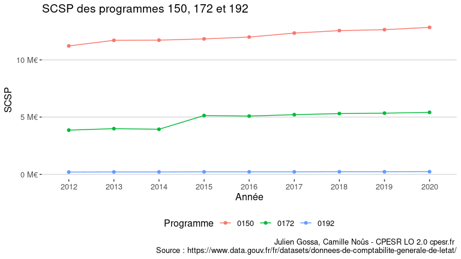
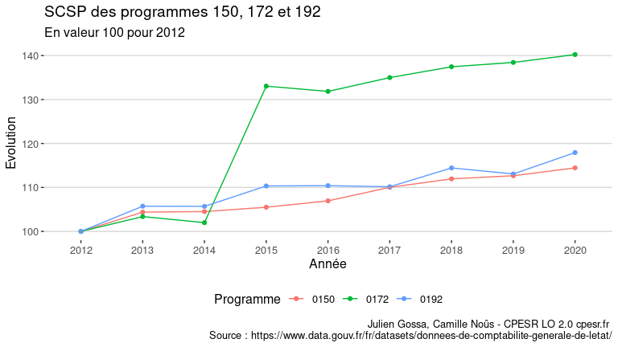

Compte de l’Etat
================

Source :
<https://www.data.gouv.fr/fr/datasets/donnees-de-comptabilite-generale-de-letat/>

-   `2012-2020-balances-des-comptes-de-letat.csv`

<!-- -->

    ## `summarise()` has grouped output by 'Année'. You can override using the `.groups` argument.

## Données

-   variables :

<!-- -->

    ##  [1] "Postes"                  "Sous.postes"            
    ##  [3] "Indicateurs.de.synthèse" "Indicateurs.de.détail"  
    ##  [5] "Compte"                  "Nature.Budgétaire"      
    ##  [7] "Programme"               "Libellé.Ministère"      
    ##  [9] "Année"                   "Balance.Sortie"

-   Postes :

<!-- -->

    ##  [1] " Ecarts de réévaluation et d'intégration "
    ##  [2] " Report des exercices antérieurs "        
    ##  [3] " Solde des opérations de l'exercice "     
    ##  [4] " Provisions "                             
    ##  [5] " Dettes financières "                     
    ##  [6] " Dettes non financières "                 
    ##  [7] " Charges constatées d'avance "            
    ##  [8] " Comptes de régularisation - Actif "      
    ##  [9] " Comptes de régularisation - Passif "     
    ## [10] " Immobilisations incorporelles "          
    ## [11] " Immobilisations corporelles "            
    ## [12] " Immobilisations financières "            
    ## [13] " Stocks "                                 
    ## [14] " Créances "                               
    ## [15] " Trésorerie active "                      
    ## [16] " Trésorerie passive "                     
    ## [17] " Autres passifs (hors trésorerie) "       
    ## [18] " Charges de fonctionnement direct "       
    ## [19] " Charges de fonctionnement indirect "     
    ## [20] " Charges d'intervention "                 
    ## [21] " Produits régaliens nets "                
    ## [22] " Charges financières "                    
    ## [23] " Produits de fonctionnement "             
    ## [24] " Produits d'intervention "                
    ## [25] " Produits financiers "                    
    ## [26] " Engagements hors bilan "

-   Sous.postes :

<!-- -->

    ##  [1] "  "                                                                 
    ##  [2] " Provisions pour risques "                                          
    ##  [3] " Provisions pour charges "                                          
    ##  [4] " Titres négociables "                                               
    ##  [5] " Produits constatés d'avance "                                      
    ##  [6] ""                                                                   
    ##  [7] " Autres emprunts "                                                  
    ##  [8] " Titres non négociables "                                           
    ##  [9] " Coût de développement "                                            
    ## [10] " Logiciels, concessions, brevets "                                  
    ## [11] " Autres immobilisations incorporelles "                             
    ## [12] " Terrains, sites naturels et cimetières "                           
    ## [13] " Constructions "                                                    
    ## [14] " Matériel technique "                                               
    ## [15] " Matériel militaire "                                               
    ## [16] " Autres immobilisations corporelles "                               
    ## [17] " Concessions "                                                      
    ## [18] " Immobilisations en cours "                                         
    ## [19] " Participations contrôlées "                                        
    ## [20] " Fonds sans personnalité juridique "                                
    ## [21] " Participations non contrôlées "                                    
    ## [22] " Créances rattachées à des participations "                         
    ## [23] " Autres dettes non financières "                                    
    ## [24] " Autres immobilisations financières "                               
    ## [25] " Prêts et avances "                                                 
    ## [26] "   "                                                                
    ## [27] " Dettes de fonctionnement "                                         
    ## [28] " Dettes d'intervention "                                            
    ## [29] " Dettes à ventiler "                                                
    ## [30] " Autres créances "                                                  
    ## [31] " Redevables "                                                       
    ## [32] " Clients "                                                          
    ## [33] " Créances à ventiler "                                              
    ## [34] " Autres composantes de trésorerie "                                 
    ## [35] " Correspondants du Trésor et personnes habilitées "                 
    ## [36] " Autres "                                                           
    ## [37] " Monnaies métalliques en circulation "                              
    ## [38] " BT émis au profit des org. internat. "                             
    ## [39] " Investissements d'avenir (consommables) "                          
    ## [40] " Valeurs mobilières de placement "                                  
    ## [41] " Valeurs escomptées en cours d'encaissement et de décaissement "    
    ## [42] " Fonds bancaires et fonds en caisse "                               
    ## [43] " Achats, variations de stocks et prestations externes "             
    ## [44] " Autres charges de fonctionnement "                                 
    ## [45] " Subventions pour charges de service public "                       
    ## [46] " Transferts aux autres collectivités "                              
    ## [47] " Charges de personnel "                                             
    ## [48] " Autres charges de fonctionnement indirect "                        
    ## [49] " Transferts aux ménages "                                           
    ## [50] " Transferts aux entreprises "                                       
    ## [51] " Transferts aux collectivités territoriales "                       
    ## [52] " Ressources propres du budget de l'Union européenne "               
    ## [53] " Charges résultant de la mise en jeu de garanties "                 
    ## [54] " Intérêts "                                                         
    ## [55] " Autres charges financières "                                       
    ## [56] " Pertes de change liées aux opérations financières "                
    ## [57] " Dotations aux amortissements, aux provisions et aux dépréciations "
    ## [58] " Dotations aux provisions et aux dépréciations "                    
    ## [59] " Dotations aux amortissements, provisions et dépréciations "        
    ## [60] " Ventes de produits et prestations de service "                     
    ## [61] " Autres produits de fonctionnement "                                
    ## [62] " Production stockée et immobilisée "                                
    ## [63] " Contributions reçues de tiers "                                    
    ## [64] " Produits des immobilisations financières "                         
    ## [65] " Autres intérêts et produits assimilés "                            
    ## [66] " Gains de change liés aux opérations financières "                  
    ## [67] " Impôt sur le revenu "                                              
    ## [68] " Impôt sur les sociétés "                                           
    ## [69] " TICPE "                                                            
    ## [70] " Taxe sur la valeur ajoutée "                                       
    ## [71] " Enregistrement, timbre, autres contributions et taxes indirectes " 
    ## [72] " Autres produits de nature fiscale et assimilés "                   
    ## [73] " Amendes, prélèvements divers et autres pénalités "                 
    ## [74] " Reprises sur provisions et dépréciations "                         
    ## [75] " Dette garantie par l'Etat "                                        
    ## [76] " Garanties liées à des missions d'int gén "                         
    ## [77] " Garanties de passif "                                              
    ## [78] " Engagements financiers de l'Etat "                                 
    ## [79] " Dispositifs d'intervention "                                       
    ## [80] " Engagements reçus "                                                
    ## [81] " Contrepartie des engagements "                                     
    ## [82] " Mise en jeu de la responsabilité de l'État "                       
    ## [83] " Engagements de retraite "

## SCSP ESR

[SCSP pour l’ESR](scsp-esr.csv)

<table>
<thead>
<tr>
<th style="text-align:left;">
Année
</th>
<th style="text-align:left;">
Programme
</th>
<th style="text-align:right;">
SCSP
</th>
<th style="text-align:right;">
Evolution
</th>
</tr>
</thead>
<tbody>
<tr>
<td style="text-align:left;">
2012
</td>
<td style="text-align:left;">
0150
</td>
<td style="text-align:right;">
11217030076
</td>
<td style="text-align:right;">
100.0000
</td>
</tr>
<tr>
<td style="text-align:left;">
2012
</td>
<td style="text-align:left;">
0172
</td>
<td style="text-align:right;">
3860901411
</td>
<td style="text-align:right;">
100.0000
</td>
</tr>
<tr>
<td style="text-align:left;">
2012
</td>
<td style="text-align:left;">
0192
</td>
<td style="text-align:right;">
196728961
</td>
<td style="text-align:right;">
100.0000
</td>
</tr>
<tr>
<td style="text-align:left;">
2013
</td>
<td style="text-align:left;">
0150
</td>
<td style="text-align:right;">
11707783983
</td>
<td style="text-align:right;">
104.3751
</td>
</tr>
<tr>
<td style="text-align:left;">
2013
</td>
<td style="text-align:left;">
0172
</td>
<td style="text-align:right;">
3990818358
</td>
<td style="text-align:right;">
103.3649
</td>
</tr>
<tr>
<td style="text-align:left;">
2013
</td>
<td style="text-align:left;">
0192
</td>
<td style="text-align:right;">
207997586
</td>
<td style="text-align:right;">
105.7280
</td>
</tr>
<tr>
<td style="text-align:left;">
2014
</td>
<td style="text-align:left;">
0150
</td>
<td style="text-align:right;">
11722897616
</td>
<td style="text-align:right;">
104.5098
</td>
</tr>
<tr>
<td style="text-align:left;">
2014
</td>
<td style="text-align:left;">
0172
</td>
<td style="text-align:right;">
3937494594
</td>
<td style="text-align:right;">
101.9838
</td>
</tr>
<tr>
<td style="text-align:left;">
2014
</td>
<td style="text-align:left;">
0192
</td>
<td style="text-align:right;">
207929585
</td>
<td style="text-align:right;">
105.6934
</td>
</tr>
<tr>
<td style="text-align:left;">
2015
</td>
<td style="text-align:left;">
0150
</td>
<td style="text-align:right;">
11833318796
</td>
<td style="text-align:right;">
105.4942
</td>
</tr>
<tr>
<td style="text-align:left;">
2015
</td>
<td style="text-align:left;">
0172
</td>
<td style="text-align:right;">
5136731973
</td>
<td style="text-align:right;">
133.0449
</td>
</tr>
<tr>
<td style="text-align:left;">
2015
</td>
<td style="text-align:left;">
0192
</td>
<td style="text-align:right;">
217061272
</td>
<td style="text-align:right;">
110.3352
</td>
</tr>
<tr>
<td style="text-align:left;">
2016
</td>
<td style="text-align:left;">
0150
</td>
<td style="text-align:right;">
11996068278
</td>
<td style="text-align:right;">
106.9451
</td>
</tr>
<tr>
<td style="text-align:left;">
2016
</td>
<td style="text-align:left;">
0172
</td>
<td style="text-align:right;">
5090478449
</td>
<td style="text-align:right;">
131.8469
</td>
</tr>
<tr>
<td style="text-align:left;">
2016
</td>
<td style="text-align:left;">
0192
</td>
<td style="text-align:right;">
217197350
</td>
<td style="text-align:right;">
110.4044
</td>
</tr>
<tr>
<td style="text-align:left;">
2017
</td>
<td style="text-align:left;">
0150
</td>
<td style="text-align:right;">
12341594645
</td>
<td style="text-align:right;">
110.0255
</td>
</tr>
<tr>
<td style="text-align:left;">
2017
</td>
<td style="text-align:left;">
0172
</td>
<td style="text-align:right;">
5211993454
</td>
<td style="text-align:right;">
134.9942
</td>
</tr>
<tr>
<td style="text-align:left;">
2017
</td>
<td style="text-align:left;">
0192
</td>
<td style="text-align:right;">
216720529
</td>
<td style="text-align:right;">
110.1620
</td>
</tr>
<tr>
<td style="text-align:left;">
2018
</td>
<td style="text-align:left;">
0150
</td>
<td style="text-align:right;">
12558087607
</td>
<td style="text-align:right;">
111.9555
</td>
</tr>
<tr>
<td style="text-align:left;">
2018
</td>
<td style="text-align:left;">
0172
</td>
<td style="text-align:right;">
5307017347
</td>
<td style="text-align:right;">
137.4554
</td>
</tr>
<tr>
<td style="text-align:left;">
2018
</td>
<td style="text-align:left;">
0192
</td>
<td style="text-align:right;">
225124599
</td>
<td style="text-align:right;">
114.4339
</td>
</tr>
<tr>
<td style="text-align:left;">
2019
</td>
<td style="text-align:left;">
0150
</td>
<td style="text-align:right;">
12637309692
</td>
<td style="text-align:right;">
112.6618
</td>
</tr>
<tr>
<td style="text-align:left;">
2019
</td>
<td style="text-align:left;">
0172
</td>
<td style="text-align:right;">
5344988624
</td>
<td style="text-align:right;">
138.4389
</td>
</tr>
<tr>
<td style="text-align:left;">
2019
</td>
<td style="text-align:left;">
0192
</td>
<td style="text-align:right;">
222430854
</td>
<td style="text-align:right;">
113.0646
</td>
</tr>
<tr>
<td style="text-align:left;">
2020
</td>
<td style="text-align:left;">
0150
</td>
<td style="text-align:right;">
12838503579
</td>
<td style="text-align:right;">
114.4555
</td>
</tr>
<tr>
<td style="text-align:left;">
2020
</td>
<td style="text-align:left;">
0172
</td>
<td style="text-align:right;">
5414181439
</td>
<td style="text-align:right;">
140.2310
</td>
</tr>
<tr>
<td style="text-align:left;">
2020
</td>
<td style="text-align:left;">
0192
</td>
<td style="text-align:right;">
232010145
</td>
<td style="text-align:right;">
117.9339
</td>
</tr>
</tbody>
</table>

<!-- -->

<!-- -->
