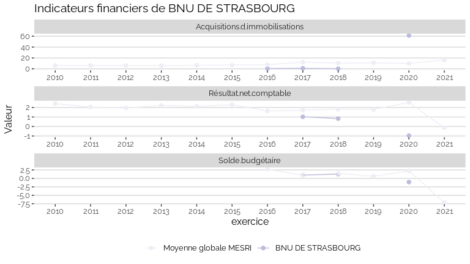
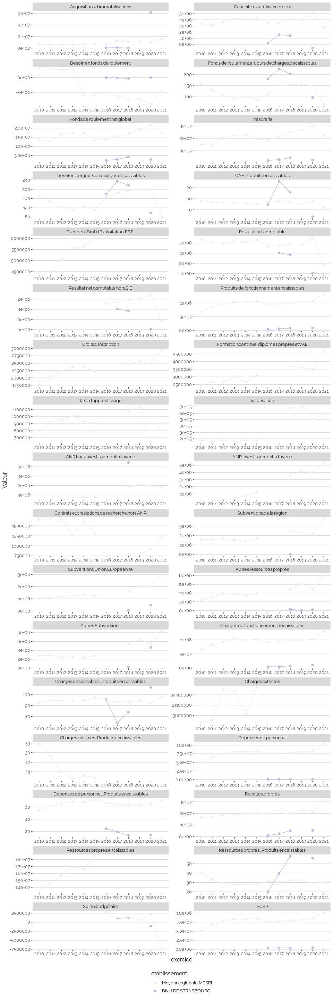

Indicateurs financiers d’établissement
================

# BNU DE STRASBOURG

## Focus Résultat et Solde

    ## Warning: Removed 11 rows containing missing values (geom_point).

<!-- -->

## Focus Masse salariale

    ## Warning: Removed 2 rows containing missing values (geom_point).

<!-- -->

    ## Warning: Removed 1 rows containing missing values (geom_point).

<!-- -->

## Tous les indicateurs

    ## Warning: Removed 152 rows containing missing values (geom_point).

<!-- -->
