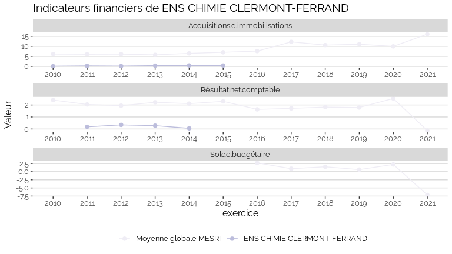
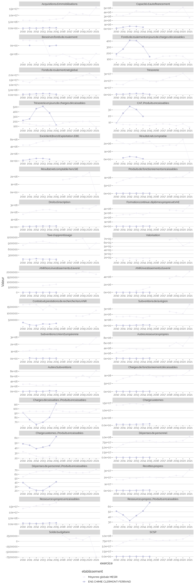

Indicateurs financiers d’établissement
================

# ENS CHIMIE CLERMONT-FERRAND

## Focus Résultat et Solde

    ## Warning: Removed 14 rows containing missing values (geom_point).

    ## Warning: Removed 7 row(s) containing missing values (geom_path).

<!-- -->

## Focus Masse salariale

<!-- -->

<!-- -->

## Tous les indicateurs

    ## Warning: Removed 91 rows containing missing values (geom_point).

<!-- -->
