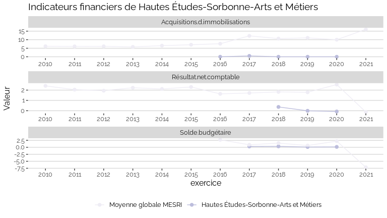

Indicateurs financiers d’établissement
================

# Hautes Études-Sorbonne-Arts et Métiers

## Focus Résultat et Solde

    ## Warning: Removed 9 rows containing missing values (geom_point).

<!-- -->

## Focus Masse salariale

<!-- -->

<!-- -->

## Tous les indicateurs

    ## Warning: Removed 139 rows containing missing values (geom_point).

<!-- -->
