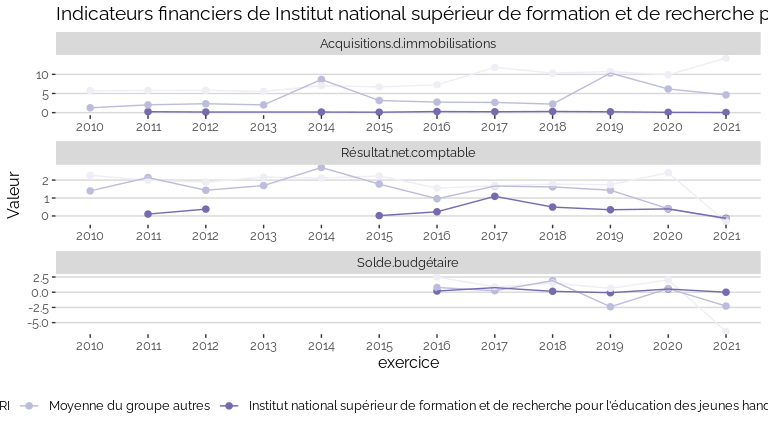

Indicateurs financiers d’établissement
================

# Institut national supérieur de formation et de recherche pour l’éducation des jeunes handicapés et les enseignements adaptés

## Focus Résultat et Solde

    ## Warning: Removed 20 rows containing missing values (geom_point).

    ## Warning: Removed 1 row(s) containing missing values (geom_path).

<!-- -->

## Tous les indicateurs

    ## Warning: Removed 247 rows containing missing values (geom_point).

    ## Warning: Removed 1 row(s) containing missing values (geom_path).

<!-- -->
