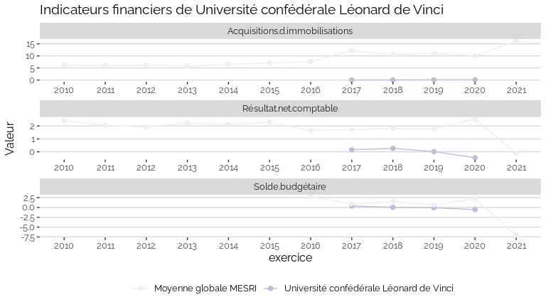
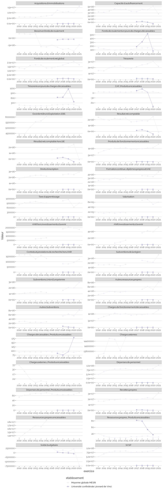

Indicateurs financiers d’établissement
================

# Université confédérale Léonard de Vinci

## Focus Résultat et Solde

    ## Warning: Removed 6 rows containing missing values (geom_point).

<!-- -->

## Focus Masse salariale

    ## Warning: Removed 4 rows containing missing values (geom_point).

    ## Warning: Removed 4 row(s) containing missing values (geom_path).

<!-- -->

<!-- -->

## Tous les indicateurs

    ## Warning: Removed 91 rows containing missing values (geom_point).

<!-- -->
