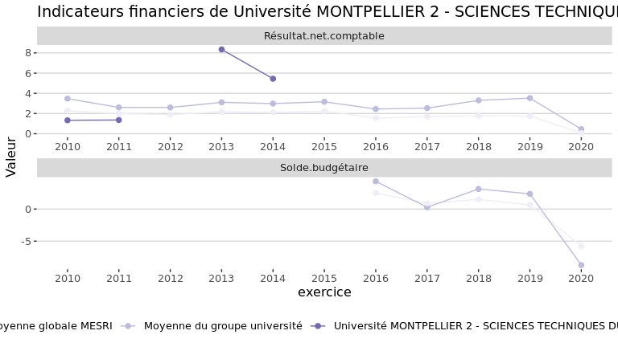
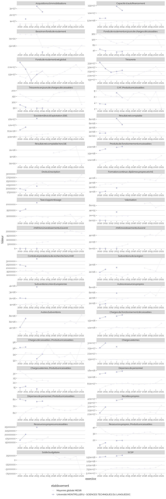

Indicateurs financiers d’établissement
================

# Université MONTPELLIER 2 - SCIENCES TECHNIQUES DU LANGUEDOC

## Focus Résultat et Solde

    ## Warning: Removed 20 rows containing missing values (geom_point).

    ## Warning: Removed 6 row(s) containing missing values (geom_path).

<!-- -->

## Tous les indicateurs

    ## Warning: Removed 167 rows containing missing values (geom_point).

    ## Warning: Removed 6 row(s) containing missing values (geom_path).

<!-- -->
