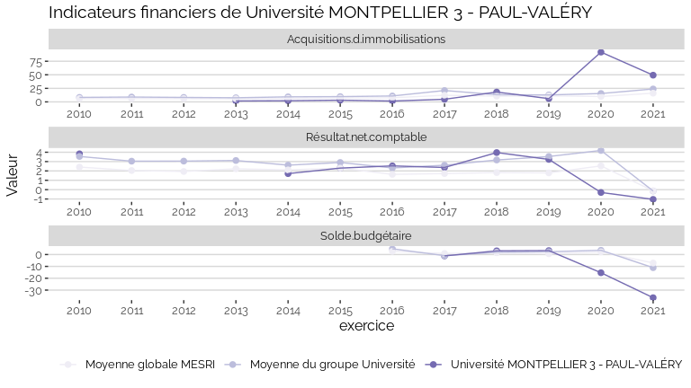
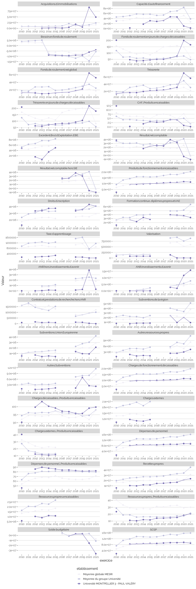

Indicateurs financiers d’établissement
================

# Université MONTPELLIER 3 - PAUL-VALÉRY

## Focus Résultat et Solde

    ## Warning: Removed 25 rows containing missing values (geom_point).

    ## Warning: Removed 3 row(s) containing missing values (geom_path).

<!-- -->

## Focus Masse salariale

    ## Warning: Removed 2 rows containing missing values (geom_point).

<!-- -->

    ## Warning: Removed 1 rows containing missing values (geom_point).

<!-- -->

## Tous les indicateurs

    ## Warning: Removed 226 rows containing missing values (geom_point).

    ## Warning: Removed 3 row(s) containing missing values (geom_path).

<!-- -->
