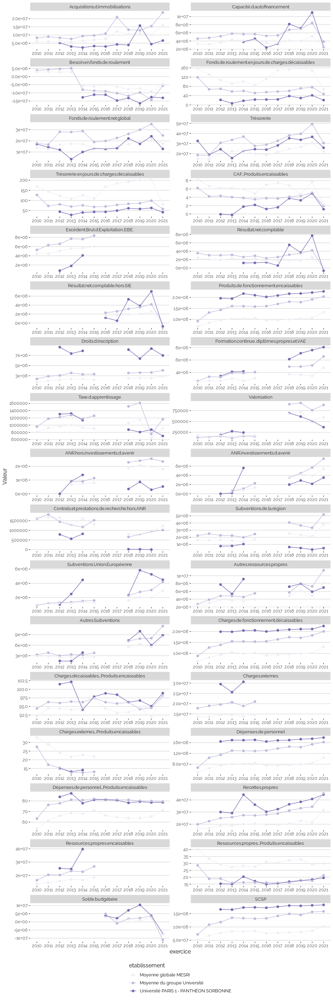

Indicateurs financiers d’établissement
================

# Université PARIS 1 - PANTHÉON SORBONNE

## Focus Résultat et Solde

    ## Warning: Removed 24 rows containing missing values (geom_point).

    ## Warning: Removed 2 row(s) containing missing values (geom_path).

<!-- -->

## Focus Masse salariale

    ## Warning: Removed 24 rows containing missing values (geom_point).

    ## Warning: Removed 24 row(s) containing missing values (geom_path).

<!-- -->

    ## Warning: Removed 2 row(s) containing missing values (geom_path).

    ## Warning: Removed 2 rows containing missing values (geom_point).

<!-- -->

## Tous les indicateurs

    ## Warning: Removed 268 rows containing missing values (geom_point).

    ## Warning: Removed 2 row(s) containing missing values (geom_path).

<!-- -->
