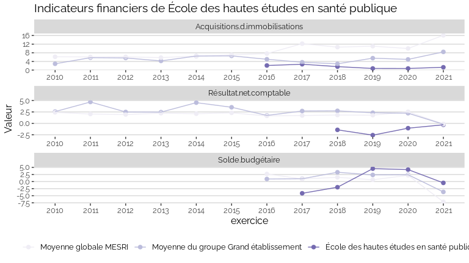
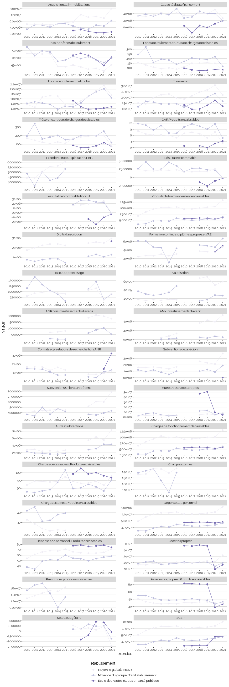

Indicateurs financiers d’établissement
================

# École des hautes études en santé publique

## Focus Résultat et Solde

    ## Warning: Removed 15 rows containing missing values (geom_point).

<!-- -->

## Focus Masse salariale

<!-- -->

<!-- -->

## Tous les indicateurs

    ## Warning: Removed 214 rows containing missing values (geom_point).

<!-- -->
