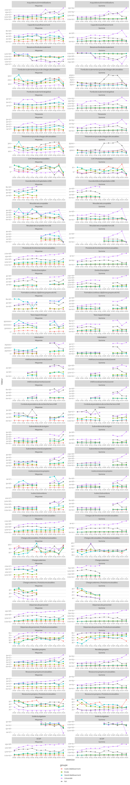
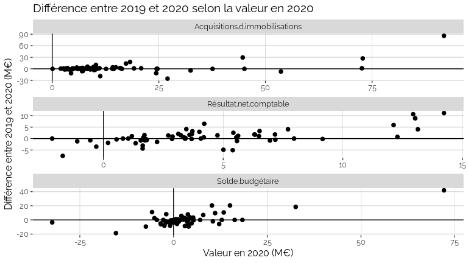

RFC Finances
================

Jeu de données :
<https://data.enseignementsup-recherche.gouv.fr/explore/dataset/fr-esr-operateurs-indicateurs-financiers/information/>

Problèmes détectés :

  - `CAF / Acquisitions d’immobilisations` dans le modèle mais absent
    des données
  - `Ressources.propres` dans les données, et `Ressources propres
    encaissables` dans le modèle
  - Nombreux `groupe` et `etablissement` vides

## Tous les indicateurs aggrégés

*Attention* :

  - Il s’agit d’un traitement global, et certaines aggrégation n’ont pas
    de sens. C’est le cas typiquement de la sommes de rapports (du type
    Ressources propres / Produits encaissable).
  - Il y a des changements de périmètre dans les données (des
    établissements entrant ou sortant du périmètre du MESRI, et des
    établissements changeant de groupe).

<!-- end list -->

    ## Warning: Removed 110 rows containing missing values (geom_point).

<!-- -->

## Tous les indicateurs aggrégés par groupe

    ## Warning: Removed 860 rows containing missing values (geom_point).

<!-- -->

## Focus Résultat et Solde

    ## Warning: Removed 36 rows containing missing values (geom_point).

<!-- -->

### Focus universités

<!-- -->

<!-- -->

<!-- -->

## Tous les indicateurs par établissement

### université

  - [Université de Caen
    Normandie](Etablissements/université_de_caen_normandie.md)
  - [Université de
    Franche-Comté](Etablissements/université_de_franche_comté.md)
  - [Université Toulouse 1 -
    Capitole](Etablissements/université_toulouse_1___capitole.md)
  - [Université d’Orléans](Etablissements/université_d_orléans.md)
  - [Université LILLE 1 - SCIENCES
    TECHNOLOGIES](Etablissements/université_lille_1___sciences_technologies.md)
  - [Université CLERMONT-FERRAND 1 -
    AUVERGNE](Etablissements/université_clermont_ferrand_1___auvergne.md)
  - [Université de Pau et des Pays de
    l’Adour](Etablissements/université_de_pau_et_des_pays_de_l_adour.md)
  - [Université Claude Bernard - Lyon
    1](Etablissements/université_claude_bernard___lyon_1.md)
  - [Université Jean Moulin - Lyon
    3](Etablissements/université_jean_moulin___lyon_3.md)
  - [Université
    Panthéon-Assas](Etablissements/université_panthéon_assas.md)
  - [Université PARIS 4 -
    SORBONNE](Etablissements/université_paris_4___sorbonne.md)
  - [Université PARIS 6 - PIERRE ET MARIE
    CURIE](Etablissements/université_paris_6___pierre_et_marie_curie.md)
  - [Université d’Évry-Val
    d’Essonne](Etablissements/université_d_évry_val_d_essonne.md)
  - [Université Nice -
    Sophia-Antipolis](Etablissements/université_nice___sophia_antipolis.md)
  - [Université de La
    Rochelle](Etablissements/université_de_la_rochelle.md)
  - [Université de Bourgogne](Etablissements/université_de_bourgogne.md)
  - [Université de Toulouse 3 - Paul
    Sabatier](Etablissements/université_de_toulouse_3___paul_sabatier.md)
  - [Université BORDEAUX 2 - VICTOR
    SEGALEN](Etablissements/université_bordeaux_2___victor_segalen.md)
  - [Université de
    Bretagne-Sud](Etablissements/université_de_bretagne_sud.md)
  - [Université LILLE 3 -
    CHARLES-DE-GAULLE](Etablissements/université_lille_3___charles_de_gaulle.md)
  - [Université Lumière - Lyon
    2](Etablissements/université_lumière___lyon_2.md)
  - [Université de Savoie](Etablissements/université_de_savoie.md)
  - [Université Paris
    Diderot](Etablissements/université_paris_diderot.md)
  - [Université Paris-Est Créteil
    Val-de-Marne](Etablissements/université_paris_est_créteil_val_de_marne.md)
  - [Aix-Marseille
    université](Etablissements/aix_marseille_université.md)
  - [Université Rennes 2](Etablissements/université_rennes_2.md)
  - [Université de Nantes](Etablissements/université_de_nantes.md)
  - [Université d’Angers](Etablissements/université_d_angers.md)
  - [Université de Valenciennes et du
    Hainaut-Cambrésis](Etablissements/université_de_valenciennes_et_du_hainaut_cambrésis.md)
  - [Université de
    Strasbourg](Etablissements/université_de_strasbourg.md)
  - [Université Paris
    Descartes](Etablissements/université_paris_descartes.md)
  - [Université du Havre](Etablissements/université_du_havre.md)
  - [Université de Toulon](Etablissements/université_de_toulon.md)
  - [Université d’Avignon et des Pays de
    Vaucluse](Etablissements/université_d_avignon_et_des_pays_de_vaucluse.md)
  - [Université des Antilles](Etablissements/université_des_antilles.md)
  - [Université de Bretagne
    Occidentale](Etablissements/université_de_bretagne_occidentale.md)
  - [Université MONTPELLIER
    1](Etablissements/université_montpellier_1.md)
  - [Université GRENOBLE 1 - JOSEPH
    FOURIER](Etablissements/université_grenoble_1___joseph_fourier.md)
  - [Université d’Artois](Etablissements/université_d_artois.md)
  - [Université de Perpignan - Via
    Domitia](Etablissements/université_de_perpignan___via_domitia.md)
  - [Université Paris 13 - Paris
    Nord](Etablissements/université_paris_13___paris_nord.md)
  - [Université de Corse Pasquale
    Paoli](Etablissements/université_de_corse_pasquale_paoli.md)
  - [Université GRENOBLE 3 -
    STENDHAL](Etablissements/université_grenoble_3___stendhal.md)
  - [Université de Reims
    Champagne-Ardenne](Etablissements/université_de_reims_champagne_ardenne.md)
  - [Université Paris 1 - Panthéon
    Sorbonne](Etablissements/université_paris_1___panthéon_sorbonne.md)
  - [Université de la
    Nouvelle-Calédonie](Etablissements/université_de_la_nouvelle_calédonie.md)
  - [Université Montpellier 3 -
    Paul-Valéry](Etablissements/université_montpellier_3___paul_valéry.md)
  - [Université Jean Monnet](Etablissements/université_jean_monnet.md)
  - [Université du Littoral Côte
    d’Opale](Etablissements/université_du_littoral_côte_d_opale.md)
  - [Université Sorbonne Nouvelle - Paris
    3](Etablissements/université_sorbonne_nouvelle___paris_3.md)
  - [Institut national universitaire Jean-François
    Champollion](Etablissements/institut_national_universitaire_jean_françois_champollion.md)
  - [Université de Limoges](Etablissements/université_de_limoges.md)
  - [Université de
    Cergy-Pontoise](Etablissements/université_de_cergy_pontoise.md)
  - [Université de La
    Réunion](Etablissements/université_de_la_réunion.md)
  - [Université de la Polynésie
    Française](Etablissements/université_de_la_polynésie_française.md)
  - [Université Toulouse - Jean
    Jaurès](Etablissements/université_toulouse___jean_jaurès.md)
  - [Université
    Bordeaux-Montaigne](Etablissements/université_bordeaux_montaigne.md)
  - [Université de Rouen](Etablissements/université_de_rouen.md)
  - [Université de
    Montpellier](Etablissements/université_de_montpellier.md)
  - [Le Mans Université](Etablissements/le_mans_université.md)
  - [Université Paris-Sud](Etablissements/université_paris_sud.md)
  - [Université
    François-Rabelais](Etablissements/université_françois_rabelais.md)
  - [Université Paris-Est
    Marne-la-Vallée](Etablissements/université_paris_est_marne_la_vallée.md)
  - [Université Paris
    Nanterre](Etablissements/université_paris_nanterre.md)
  - [Université de Lille](Etablissements/université_de_lille.md)
  - [Université Clermont
    Auvergne](Etablissements/université_clermont_auvergne.md)
  - [Université de Picardie
    Jules-Verne](Etablissements/université_de_picardie_jules_verne.md)
  - [Centre Universitaire de
    Mayotte](Etablissements/centre_universitaire_de_mayotte.md)
  - [Université de Nîmes](Etablissements/université_de_nîmes.md)
  - [Université MONTPELLIER 2 - SCIENCES TECHNIQUES DU
    LANGUEDOC](Etablissements/université_montpellier_2___sciences_techniques_du_languedoc.md)
  - [Université de
    Haute-Alsace](Etablissements/université_de_haute_alsace.md)
  - [Université de Versailles
    Saint-Quentin-en-Yvelines](Etablissements/université_de_versailles_saint_quentin_en_yvelines.md)
  - [Université BORDEAUX 4 -
    MONTESQUIEU](Etablissements/université_bordeaux_4___montesquieu.md)
  - [Université GRENOBLE 2 - PIERRE MENDÈS
    FRANCE](Etablissements/université_grenoble_2___pierre_mendès_france.md)
  - [Université CLERMONT-FERRAND 2 - BLAISE
    PASCAL](Etablissements/université_clermont_ferrand_2___blaise_pascal.md)
  - [Université de Poitiers](Etablissements/université_de_poitiers.md)
  - [Université Paris 8 - Vincennes -
    Saint-Denis](Etablissements/université_paris_8___vincennes___saint_denis.md)
  - [Université de Bordeaux](Etablissements/université_de_bordeaux.md)
  - [Université de Lorraine](Etablissements/université_de_lorraine.md)
  - [Université de Grenoble
    Alpes](Etablissements/université_de_grenoble_alpes.md)
  - [Université LILLE 2 - DROIT ET
    SANTÉ](Etablissements/université_lille_2___droit_et_santé.md)
  - [Sorbonne Université](Etablissements/sorbonne_université.md)
  - [Université de Guyane](Etablissements/université_de_guyane.md)
  - [Université de Rennes 1](Etablissements/université_de_rennes_1.md)
  - [Université BORDEAUX 1 - SCIENCES
    TECHNOLOGIES](Etablissements/université_bordeaux_1___sciences_technologies.md)

### écoles d’ingénieurs

  - [École nationale supérieure de mécanique et des
    microtechniques](Etablissements/école_nationale_supérieure_de_mécanique_et_des_microtechniques.md)
  - [École nationale d’ingénieurs de
    Brest](Etablissements/école_nationale_d_ingénieurs_de_brest.md)
  - [Grenoble INP](Etablissements/grenoble_inp.md)
  - [École nationale d’ingénieurs de
    Saint-Étienne](Etablissements/école_nationale_d_ingénieurs_de_saint_étienne.md)
  - [École nationale supérieure de chimie de
    Lille](Etablissements/école_nationale_supérieure_de_chimie_de_lille.md)
  - [École nationale supérieure des arts et industries
    textiles](Etablissements/école_nationale_supérieure_des_arts_et_industries_textiles.md)
  - [ENS CHIMIE
    CLERMONT-FERRAND](Etablissements/ens_chimie_clermont_ferrand.md)
  - [École nationale supérieure de mécanique et d’aérotechnique de
    Poitiers](Etablissements/école_nationale_supérieure_de_mécanique_et_d_aérotechnique_de_poitiers.md)
  - [École nationale supérieure de chimie de
    Montpellier](Etablissements/école_nationale_supérieure_de_chimie_de_montpellier.md)
  - [ENI METZ](Etablissements/eni_metz.md)
  - [École centrale de Lille](Etablissements/école_centrale_de_lille.md)
  - [Institut national des sciences appliquées de
    Strasbourg](Etablissements/institut_national_des_sciences_appliquées_de_strasbourg.md)
  - [École nationale supérieure de l’électronique et de ses applications
    de
    Cergy](Etablissements/école_nationale_supérieure_de_l_électronique_et_de_ses_applications_de_cergy.md)
  - [Université de technologie de
    Troyes](Etablissements/université_de_technologie_de_troyes.md)
  - [Institut polytechnique de
    Bordeaux](Etablissements/institut_polytechnique_de_bordeaux.md)
  - [Institut national des sciences appliquées de
    Rennes](Etablissements/institut_national_des_sciences_appliquées_de_rennes.md)
  - [ENSCI LIMOGES](Etablissements/ensci_limoges.md)
  - [Institut national des sciences appliquées de
    Toulouse](Etablissements/institut_national_des_sciences_appliquées_de_toulouse.md)
  - [IFMA CLERMONT FERRAND](Etablissements/ifma_clermont_ferrand.md)
  - [École centrale de Lyon](Etablissements/école_centrale_de_lyon.md)
  - [Institut national des sciences appliquées de
    Rouen](Etablissements/institut_national_des_sciences_appliquées_de_rouen.md)
  - [École nationale supérieure d’informatique pour l’industrie et
    l’entreprise](Etablissements/école_nationale_supérieure_d_informatique_pour_l_industrie_et_l_entreprise.md)
  - [Institut national des sciences appliquées Centre Val de
    Loire](Etablissements/institut_national_des_sciences_appliquées_centre_val_de_loire.md)
  - [Université de technologie de
    Compiègne](Etablissements/université_de_technologie_de_compiègne.md)
  - [Université de technologie de
    Belfort-Montbéliard](Etablissements/université_de_technologie_de_belfort_montbéliard.md)
  - [École nationale supérieure d’arts et
    métiers](Etablissements/école_nationale_supérieure_d_arts_et_métiers.md)
  - [École centrale de
    Nantes](Etablissements/école_centrale_de_nantes.md)
  - [École nationale d’ingénieurs de
    Tarbes](Etablissements/école_nationale_d_ingénieurs_de_tarbes.md)
  - [École centrale de
    Marseille](Etablissements/école_centrale_de_marseille.md)
  - [École nationale supérieure d’ingénieurs de
    Caen](Etablissements/école_nationale_supérieure_d_ingénieurs_de_caen.md)
  - [SIGMA Clermont](Etablissements/sigma_clermont.md)
  - [CentraleSupélec](Etablissements/centralesupélec.md)
  - [Institut supérieur de mécanique de
    Paris](Etablissements/institut_supérieur_de_mécanique_de_paris.md)
  - [École nationale supérieure de chimie de
    Rennes](Etablissements/école_nationale_supérieure_de_chimie_de_rennes.md)
  - [École nationale supérieure de chimie de
    Paris](Etablissements/école_nationale_supérieure_de_chimie_de_paris.md)
  - [Institut national des sciences appliquées de
    Lyon](Etablissements/institut_national_des_sciences_appliquées_de_lyon.md)
  - [Institut national polytechnique de
    Toulouse](Etablissements/institut_national_polytechnique_de_toulouse.md)
  - [École des hautes études en santé
    publique](Etablissements/école_des_hautes_études_en_santé_publique.md)

### instituts d’études politiques

  - [Institut d’études politiques de
    Bordeaux](Etablissements/institut_d_études_politiques_de_bordeaux.md)
  - [Institut d’études politiques
    d’Aix-en-Provence](Etablissements/institut_d_études_politiques_d_aix_en_provence.md)
  - [Institut d’études politiques de
    Rennes](Etablissements/institut_d_études_politiques_de_rennes.md)
  - [Institut d’études politiques de
    Lille](Etablissements/institut_d_études_politiques_de_lille.md)
  - [Institut d’études politiques de
    Lyon](Etablissements/institut_d_études_politiques_de_lyon.md)
  - [Institut d’études politiques de
    Grenoble](Etablissements/institut_d_études_politiques_de_grenoble.md)
  - [Institut d’études politiques de
    Toulouse](Etablissements/institut_d_études_politiques_de_toulouse.md)

### autres

  - [École nationale supérieure des sciences de l’information et des
    bibliothèques](Etablissements/école_nationale_supérieure_des_sciences_de_l_information_et_des_bibliothèques.md)
  - [Observatoire de Paris](Etablissements/observatoire_de_paris.md)
  - [Institut national d’histoire de
    l’art](Etablissements/institut_national_d_histoire_de_l_art.md)
  - [AMUE](Etablissements/amue.md)
  - [École des hautes études en sciences
    sociales](Etablissements/école_des_hautes_études_en_sciences_sociales.md)
  - [BNU DE STRASBOURG](Etablissements/bnu_de_strasbourg.md)
  - [Université
    Paris-Dauphine](Etablissements/université_paris_dauphine.md)
  - [École nationale des
    Chartes](Etablissements/école_nationale_des_chartes.md)
  - [Conservatoire national des arts et
    métiers](Etablissements/conservatoire_national_des_arts_et_métiers.md)
  - [Collège de France](Etablissements/collège_de_france.md)
  - [Institut national des langues et civilisations
    orientales](Etablissements/institut_national_des_langues_et_civilisations_orientales.md)
  - [Agence de développement universitaire Drôme-Ardèche
    (ADUDA)](Etablissements/agence_de_développement_universitaire_drôme_ardèche__aduda_.md)
  - [Agence Erasmus+ France/Education
    Formation](Etablissements/agence_erasmus__france_education_formation.md)
  - [ABES - Agence bibliographique de l’enseignement
    supérieur](Etablissements/abes___agence_bibliographique_de_l_enseignement_supérieur.md)
  - [CINES - Centre informatique national de l’enseignement
    supérieur](Etablissements/cines___centre_informatique_national_de_l_enseignement_supérieur.md)
  - [Institut de physique du
    globe](Etablissements/institut_de_physique_du_globe.md)
  - [EPAURIF - Etablissement public d’aménagement universitaire de la
    région
    Ile-de-France](Etablissements/epaurif___etablissement_public_d_aménagement_universitaire_de_la_région_ile_de_france.md)
  - [Académie des sciences
    d’outre-mer](Etablissements/académie_des_sciences_d_outre_mer.md)
  - [Muséum national d’histoire
    naturelle](Etablissements/muséum_national_d_histoire_naturelle.md)
  - [CTLES - Centre technique du livre de l’enseignement
    supérieur](Etablissements/ctles___centre_technique_du_livre_de_l_enseignement_supérieur.md)
  - [École nationale supérieure des arts et techniques du
    théâtre](Etablissements/école_nationale_supérieure_des_arts_et_techniques_du_théâtre.md)
  - [Institut d’administration des entreprises de
    Paris](Etablissements/institut_d_administration_des_entreprises_de_paris.md)
  - [École pratique des hautes
    études](Etablissements/école_pratique_des_hautes_études.md)
  - [075CAMPU](Etablissements/075campu.md)
  - [Institut national supérieur de formation et de recherche pour
    l’éducation des jeunes handicapés et les enseignements
    adaptés](Etablissements/institut_national_supérieur_de_formation_et_de_recherche_pour_l_éducation_des_jeunes_handicapés_et_les_enseignements_adaptés.md)
  - [École nationale supérieure Louis
    Lumière](Etablissements/école_nationale_supérieure_louis_lumière.md)
  - [0383546Y](Etablissements/0383546y.md)
  - [0597131F](Etablissements/0597131f.md)
  - [0597132G](Etablissements/0597132g.md)
  - [0597139P](Etablissements/0597139p.md)
  - [0912408Y](Etablissements/0912408y.md)
  - [Observatoire de la côte
    d’azur](Etablissements/observatoire_de_la_côte_d_azur.md)
  - [0932560C](Etablissements/0932560c.md)
  - [0952199Z](Etablissements/0952199z.md)
  - [RENATER - Réseau national de communications pour la technologie,
    l’enseignement et la
    recherche](Etablissements/renater___réseau_national_de_communications_pour_la_technologie__l_enseignement_et_la_recherche.md)
  - [0755976N](Etablissements/0755976n.md)
  - [Musée du quai Branly](Etablissements/musée_du_quai_branly.md)
  - [0062205P](Etablissements/0062205p.md)
  - [0772894C](Etablissements/0772894c.md)
  - [BULAC - Bibliothèque universitaire des langues et
    civilisations](Etablissements/bulac___bibliothèque_universitaire_des_langues_et_civilisations.md)
  - [0451761V](Etablissements/0451761v.md)
  - [0912330N](Etablissements/0912330n.md)
  - [0756036D](Etablissements/0756036d.md)
  - [0952259P](Etablissements/0952259p.md)

### écoles françaises à l’étranger

  - [Casa de Velázquez de
    Madrid](Etablissements/casa_de_velázquez_de_madrid.md)
  - [École française de Rome](Etablissements/école_française_de_rome.md)
  - [Institut français d’archéologie orientale du
    Caire](Etablissements/institut_français_d_archéologie_orientale_du_caire.md)
  - [École française
    d’Athènes](Etablissements/école_française_d_athènes.md)
  - [École française
    d’Extrême-Orient](Etablissements/école_française_d_extrême_orient.md)

### écoles normales supérieures

  - [École normale supérieure de
    Lyon](Etablissements/école_normale_supérieure_de_lyon.md)
  - [École normale supérieure de
    Rennes](Etablissements/école_normale_supérieure_de_rennes.md)
  - [École normale supérieure de
    Cachan](Etablissements/école_normale_supérieure_de_cachan.md)
  - [École normale supérieure de
    Paris](Etablissements/école_normale_supérieure_de_paris.md)

### COMUE

  - [Université Côte d’Azur](Etablissements/université_côte_d_azur.md)
  - [Université Bourgogne -
    Franche-Comté](Etablissements/université_bourgogne___franche_comté.md)
  - [Université Paris
    Lumières](Etablissements/université_paris_lumières.md)
  - [Université de recherche Paris sciences et lettres - PSL Research
    University](Etablissements/université_de_recherche_paris_sciences_et_lettres___psl_research_university.md)
  - [Institut polytechnique Grand
    Paris](Etablissements/institut_polytechnique_grand_paris.md)
  - [Languedoc-Roussillon
    Universités](Etablissements/languedoc_roussillon_universités.md)
  - [Université de Lyon](Etablissements/université_de_lyon.md)
  - [Hautes Études-Sorbonne-Arts et
    Métiers](Etablissements/hautes_études_sorbonne_arts_et_métiers.md)
  - [Université Lille Nord de
    France](Etablissements/université_lille_nord_de_france.md)
  - [Normandie Université](Etablissements/normandie_université.md)
  - [Université fédérale de Toulouse
    Midi-Pyrénées](Etablissements/université_fédérale_de_toulouse_midi_pyrénées.md)
  - [Université Bretagne
    Loire](Etablissements/université_bretagne_loire.md)
  - [Université Grenoble
    Alpes](Etablissements/université_grenoble_alpes.md)
  - [Université Sorbonne Paris
    Cité](Etablissements/université_sorbonne_paris_cité.md)
  - [Université confédérale Léonard de
    Vinci](Etablissements/université_confédérale_léonard_de_vinci.md)
  - [Université Paris-Est](Etablissements/université_paris_est.md)
  - [Communauté d’universités et établissements
    d’Aquitaine](Etablissements/communauté_d_universités_et_établissements_d_aquitaine.md)
  - [COMUE UNIVERSITÉ DE
    CHAMPAGNE](Etablissements/comue_université_de_champagne.md)
  - [Université Paris-Seine](Etablissements/université_paris_seine.md)
