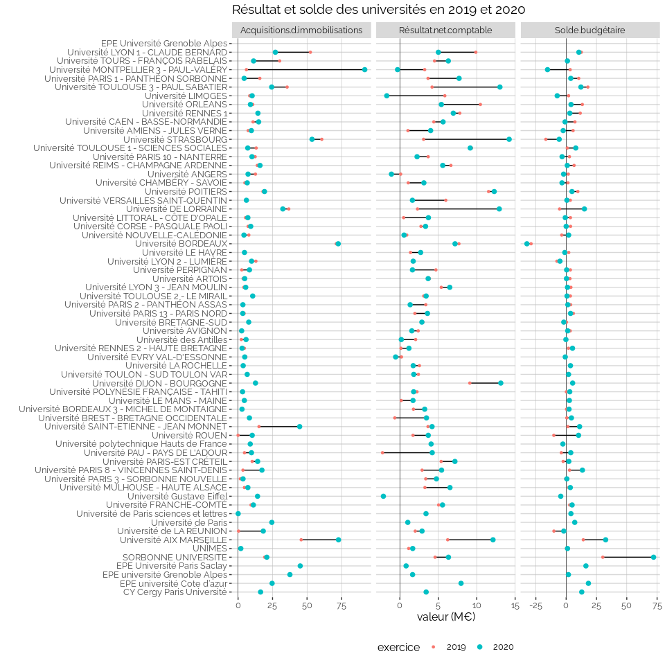
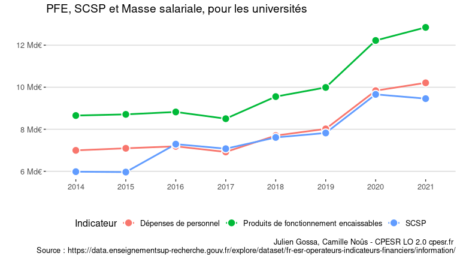
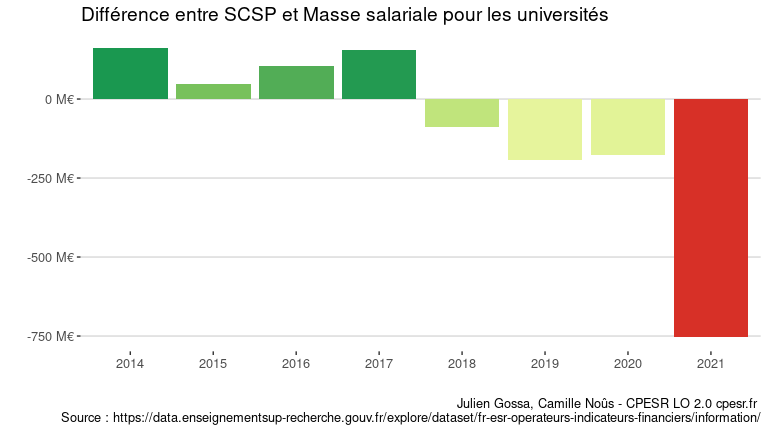
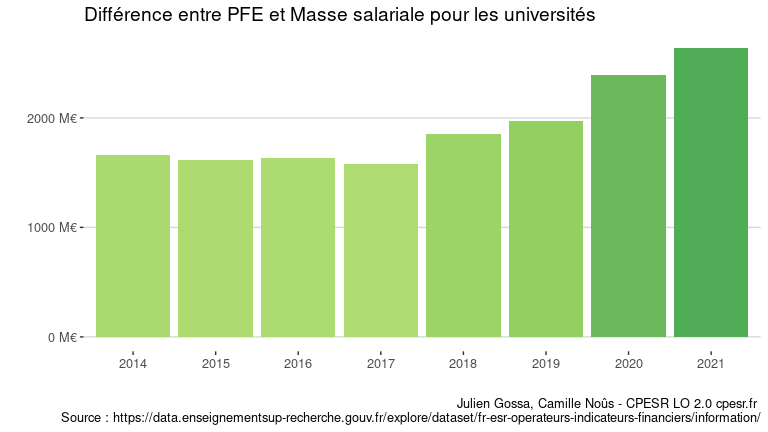
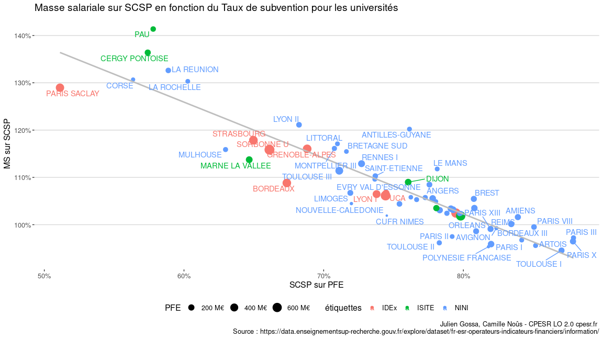

RFC Finances
================

Jeu de données :
<https://data.enseignementsup-recherche.gouv.fr/explore/dataset/fr-esr-operateurs-indicateurs-financiers/information/>

Problèmes détectés :

-   `CAF / Acquisitions d’immobilisations` dans le modèle mais absent
    des données
-   `Ressources.propres` dans les données, et
    `Ressources propres encaissables` dans le modèle
-   Nombreux `groupe` et `etablissement` vides

## Tous les indicateurs aggrégés

*Attention* :

-   Il s’agit d’un traitement global, et certaines aggrégation n’ont pas
    de sens. C’est le cas typiquement de la sommes de rapports (du type
    Ressources propres / Produits encaissable).
-   Il y a des changements de périmètre dans les données (des
    établissements entrant ou sortant du périmètre du MESRI, et des
    établissements changeant de groupe).

<!-- -->

    ## Warning: Removed 134 rows containing missing values (geom_point).

<!-- -->

## Tous les indicateurs aggrégés par groupe

    ## Warning: Removed 684 rows containing missing values (geom_point).

<!-- -->

## Focus Résultat et Solde

    ## Warning: Removed 30 rows containing missing values (geom_point).

<!-- -->

### Focus universités

<!-- -->

<!-- -->

<!-- -->

### Ressources vs. SCSP vs. Masse salariale

<!-- -->

<!-- -->

<!-- -->

<!-- -->
<!-- -->

    ## `geom_smooth()` using formula 'y ~ x'

    ## Warning: Removed 1 rows containing non-finite values (stat_smooth).

    ## Warning: Removed 1 rows containing missing values (geom_point).

    ## Warning: Removed 1 rows containing missing values (geom_text_repel).

    ## Warning: ggrepel: 19 unlabeled data points (too many overlaps). Consider
    ## increasing max.overlaps

<!-- -->

## Focus Ressources propres formation

    ## Joining, by = c("uai...identifiant", "exercice")

    ## `summarise()` has grouped output by 'exercice'. You can override using the `.groups` argument.

<!-- -->

<!-- -->

## Tous les indicateurs par établissement

    ## 
    ## 
    ## processing file: Etablissement.Rmd

    ##   |                                                                              |                                                                      |   0%  |                                                                              |......                                                                |   8%
    ##   ordinary text without R code
    ## 
    ##   |                                                                              |............                                                          |  17%
    ## label: setup.etab (with options) 
    ## List of 1
    ##  $ include: logi FALSE
    ## 
    ##   |                                                                              |..................                                                    |  25%
    ##    inline R code fragments
    ## 
    ##   |                                                                              |.......................                                               |  33%
    ## label: data
    ##   |                                                                              |.............................                                         |  42%
    ##   ordinary text without R code
    ## 
    ##   |                                                                              |...................................                                   |  50%
    ## label: etab.focus (with options) 
    ## List of 2
    ##  $ fig.width : num 8
    ##  $ fig.height: num 4.5

    ##   |                                                                              |.........................................                             |  58%
    ##   ordinary text without R code
    ## 
    ##   |                                                                              |...............................................                       |  67%
    ## label: etab.focus.ms.et.pfe (with options) 
    ## List of 2
    ##  $ fig.width : num 8
    ##  $ fig.height: num 4.5

    ##   |                                                                              |....................................................                  |  75%
    ##   ordinary text without R code
    ## 
    ##   |                                                                              |..........................................................            |  83%
    ## label: etab.focus.ms.vs.pfe (with options) 
    ## List of 2
    ##  $ fig.width : num 8
    ##  $ fig.height: num 4.5

    ##   |                                                                              |................................................................      |  92%
    ##   ordinary text without R code
    ## 
    ##   |                                                                              |......................................................................| 100%
    ## label: etab (with options) 
    ## List of 2
    ##  $ fig.width : num 10
    ##  $ fig.height: num 30

    ## output file: Etablissement.knit.md

    ## /usr/lib/rstudio/bin/pandoc/pandoc +RTS -K512m -RTS Etablissement.knit.md --to gfm --from markdown+autolink_bare_uris+tex_math_single_backslash --output observatoire_de_la_côte_d_azur.md --template /usr/lib/R/site-library/rmarkdown/rmarkdown/templates/github_document/resources/default.md 
    ## /usr/lib/rstudio/bin/pandoc/pandoc +RTS -K512m -RTS observatoire_de_la_côte_d_azur.md --to html4 --from gfm --output observatoire_de_la_côte_d_azur.html --standalone --self-contained --highlight-style pygments --template /usr/lib/R/site-library/rmarkdown/rmarkdown/templates/github_document/resources/preview.html --variable 'github-markdown-css:/usr/lib/R/site-library/rmarkdown/rmarkdown/templates/github_document/resources/github.css' --metadata pagetitle=PREVIEW

    ## 
    ## Preview created: /tmp/RtmpwEMJ2W/preview-82d63fce1fb5.html

    ## 
    ## Output created: observatoire_de_la_côte_d_azur.md

    ## Warning in file.remove(outmd(etab, ".html")): impossible d'effacer le fichier
    ## 'observatoire_de_la_côte_d_azur.html', à cause de 'Aucun fichier ou dossier de
    ## ce type'

    ## 
    ## 
    ## processing file: Etablissement.Rmd

    ##   |                                                                              |                                                                      |   0%  |                                                                              |......                                                                |   8%
    ##   ordinary text without R code
    ## 
    ##   |                                                                              |............                                                          |  17%
    ## label: setup.etab (with options) 
    ## List of 1
    ##  $ include: logi FALSE
    ## 
    ##   |                                                                              |..................                                                    |  25%
    ##    inline R code fragments
    ## 
    ##   |                                                                              |.......................                                               |  33%
    ## label: data
    ##   |                                                                              |.............................                                         |  42%
    ##   ordinary text without R code
    ## 
    ##   |                                                                              |...................................                                   |  50%
    ## label: etab.focus (with options) 
    ## List of 2
    ##  $ fig.width : num 8
    ##  $ fig.height: num 4.5

    ##   |                                                                              |.........................................                             |  58%
    ##   ordinary text without R code
    ## 
    ##   |                                                                              |...............................................                       |  67%
    ## label: etab.focus.ms.et.pfe (with options) 
    ## List of 2
    ##  $ fig.width : num 8
    ##  $ fig.height: num 4.5

    ##   |                                                                              |....................................................                  |  75%
    ##   ordinary text without R code
    ## 
    ##   |                                                                              |..........................................................            |  83%
    ## label: etab.focus.ms.vs.pfe (with options) 
    ## List of 2
    ##  $ fig.width : num 8
    ##  $ fig.height: num 4.5

    ##   |                                                                              |................................................................      |  92%
    ##   ordinary text without R code
    ## 
    ##   |                                                                              |......................................................................| 100%
    ## label: etab (with options) 
    ## List of 2
    ##  $ fig.width : num 10
    ##  $ fig.height: num 30

    ## output file: Etablissement.knit.md

    ## /usr/lib/rstudio/bin/pandoc/pandoc +RTS -K512m -RTS Etablissement.knit.md --to gfm --from markdown+autolink_bare_uris+tex_math_single_backslash --output université_nice___sophia_antipolis.md --template /usr/lib/R/site-library/rmarkdown/rmarkdown/templates/github_document/resources/default.md 
    ## /usr/lib/rstudio/bin/pandoc/pandoc +RTS -K512m -RTS université_nice___sophia_antipolis.md --to html4 --from gfm --output université_nice___sophia_antipolis.html --standalone --self-contained --highlight-style pygments --template /usr/lib/R/site-library/rmarkdown/rmarkdown/templates/github_document/resources/preview.html --variable 'github-markdown-css:/usr/lib/R/site-library/rmarkdown/rmarkdown/templates/github_document/resources/github.css' --metadata pagetitle=PREVIEW

    ## 
    ## Preview created: /tmp/RtmpwEMJ2W/preview-82d62cf8f018.html

    ## 
    ## Output created: université_nice___sophia_antipolis.md

    ## Warning in file.remove(outmd(etab, ".html")): impossible d'effacer le fichier
    ## 'université_nice___sophia_antipolis.html', à cause de 'Aucun fichier ou dossier
    ## de ce type'

    ## 
    ## 
    ## processing file: Etablissement.Rmd

    ##   |                                                                              |                                                                      |   0%  |                                                                              |......                                                                |   8%
    ##   ordinary text without R code
    ## 
    ##   |                                                                              |............                                                          |  17%
    ## label: setup.etab (with options) 
    ## List of 1
    ##  $ include: logi FALSE
    ## 
    ##   |                                                                              |..................                                                    |  25%
    ##    inline R code fragments
    ## 
    ##   |                                                                              |.......................                                               |  33%
    ## label: data
    ##   |                                                                              |.............................                                         |  42%
    ##   ordinary text without R code
    ## 
    ##   |                                                                              |...................................                                   |  50%
    ## label: etab.focus (with options) 
    ## List of 2
    ##  $ fig.width : num 8
    ##  $ fig.height: num 4.5

    ##   |                                                                              |.........................................                             |  58%
    ##   ordinary text without R code
    ## 
    ##   |                                                                              |...............................................                       |  67%
    ## label: etab.focus.ms.et.pfe (with options) 
    ## List of 2
    ##  $ fig.width : num 8
    ##  $ fig.height: num 4.5

    ##   |                                                                              |....................................................                  |  75%
    ##   ordinary text without R code
    ## 
    ##   |                                                                              |..........................................................            |  83%
    ## label: etab.focus.ms.vs.pfe (with options) 
    ## List of 2
    ##  $ fig.width : num 8
    ##  $ fig.height: num 4.5

    ##   |                                                                              |................................................................      |  92%
    ##   ordinary text without R code
    ## 
    ##   |                                                                              |......................................................................| 100%
    ## label: etab (with options) 
    ## List of 2
    ##  $ fig.width : num 10
    ##  $ fig.height: num 30

    ## output file: Etablissement.knit.md

    ## /usr/lib/rstudio/bin/pandoc/pandoc +RTS -K512m -RTS Etablissement.knit.md --to gfm --from markdown+autolink_bare_uris+tex_math_single_backslash --output comue_université_côte_d_azur.md --template /usr/lib/R/site-library/rmarkdown/rmarkdown/templates/github_document/resources/default.md 
    ## /usr/lib/rstudio/bin/pandoc/pandoc +RTS -K512m -RTS comue_université_côte_d_azur.md --to html4 --from gfm --output comue_université_côte_d_azur.html --standalone --self-contained --highlight-style pygments --template /usr/lib/R/site-library/rmarkdown/rmarkdown/templates/github_document/resources/preview.html --variable 'github-markdown-css:/usr/lib/R/site-library/rmarkdown/rmarkdown/templates/github_document/resources/github.css' --metadata pagetitle=PREVIEW

    ## 
    ## Preview created: /tmp/RtmpwEMJ2W/preview-82d665688513.html

    ## 
    ## Output created: comue_université_côte_d_azur.md

    ## Warning in file.remove(outmd(etab, ".html")): impossible d'effacer le fichier
    ## 'comue_université_côte_d_azur.html', à cause de 'Aucun fichier ou dossier de ce
    ## type'

    ## 
    ## 
    ## processing file: Etablissement.Rmd

    ##   |                                                                              |                                                                      |   0%  |                                                                              |......                                                                |   8%
    ##   ordinary text without R code
    ## 
    ##   |                                                                              |............                                                          |  17%
    ## label: setup.etab (with options) 
    ## List of 1
    ##  $ include: logi FALSE
    ## 
    ##   |                                                                              |..................                                                    |  25%
    ##    inline R code fragments
    ## 
    ##   |                                                                              |.......................                                               |  33%
    ## label: data
    ##   |                                                                              |.............................                                         |  42%
    ##   ordinary text without R code
    ## 
    ##   |                                                                              |...................................                                   |  50%
    ## label: etab.focus (with options) 
    ## List of 2
    ##  $ fig.width : num 8
    ##  $ fig.height: num 4.5

    ##   |                                                                              |.........................................                             |  58%
    ##   ordinary text without R code
    ## 
    ##   |                                                                              |...............................................                       |  67%
    ## label: etab.focus.ms.et.pfe (with options) 
    ## List of 2
    ##  $ fig.width : num 8
    ##  $ fig.height: num 4.5

    ##   |                                                                              |....................................................                  |  75%
    ##   ordinary text without R code
    ## 
    ##   |                                                                              |..........................................................            |  83%
    ## label: etab.focus.ms.vs.pfe (with options) 
    ## List of 2
    ##  $ fig.width : num 8
    ##  $ fig.height: num 4.5

    ##   |                                                                              |................................................................      |  92%
    ##   ordinary text without R code
    ## 
    ##   |                                                                              |......................................................................| 100%
    ## label: etab (with options) 
    ## List of 2
    ##  $ fig.width : num 10
    ##  $ fig.height: num 30

    ## output file: Etablissement.knit.md

    ## /usr/lib/rstudio/bin/pandoc/pandoc +RTS -K512m -RTS Etablissement.knit.md --to gfm --from markdown+autolink_bare_uris+tex_math_single_backslash --output epe_université_cote_d_azur.md --template /usr/lib/R/site-library/rmarkdown/rmarkdown/templates/github_document/resources/default.md 
    ## /usr/lib/rstudio/bin/pandoc/pandoc +RTS -K512m -RTS epe_université_cote_d_azur.md --to html4 --from gfm --output epe_université_cote_d_azur.html --standalone --self-contained --highlight-style pygments --template /usr/lib/R/site-library/rmarkdown/rmarkdown/templates/github_document/resources/preview.html --variable 'github-markdown-css:/usr/lib/R/site-library/rmarkdown/rmarkdown/templates/github_document/resources/github.css' --metadata pagetitle=PREVIEW

    ## 
    ## Preview created: /tmp/RtmpwEMJ2W/preview-82d69774c56.html

    ## 
    ## Output created: epe_université_cote_d_azur.md

    ## Warning in file.remove(outmd(etab, ".html")): impossible d'effacer le fichier
    ## 'epe_université_cote_d_azur.html', à cause de 'Aucun fichier ou dossier de ce
    ## type'

    ## 
    ## 
    ## processing file: Etablissement.Rmd

    ##   |                                                                              |                                                                      |   0%  |                                                                              |......                                                                |   8%
    ##   ordinary text without R code
    ## 
    ##   |                                                                              |............                                                          |  17%
    ## label: setup.etab (with options) 
    ## List of 1
    ##  $ include: logi FALSE
    ## 
    ##   |                                                                              |..................                                                    |  25%
    ##    inline R code fragments
    ## 
    ##   |                                                                              |.......................                                               |  33%
    ## label: data
    ##   |                                                                              |.............................                                         |  42%
    ##   ordinary text without R code
    ## 
    ##   |                                                                              |...................................                                   |  50%
    ## label: etab.focus (with options) 
    ## List of 2
    ##  $ fig.width : num 8
    ##  $ fig.height: num 4.5

    ##   |                                                                              |.........................................                             |  58%
    ##   ordinary text without R code
    ## 
    ##   |                                                                              |...............................................                       |  67%
    ## label: etab.focus.ms.et.pfe (with options) 
    ## List of 2
    ##  $ fig.width : num 8
    ##  $ fig.height: num 4.5

    ##   |                                                                              |....................................................                  |  75%
    ##   ordinary text without R code
    ## 
    ##   |                                                                              |..........................................................            |  83%
    ## label: etab.focus.ms.vs.pfe (with options) 
    ## List of 2
    ##  $ fig.width : num 8
    ##  $ fig.height: num 4.5

    ##   |                                                                              |................................................................      |  92%
    ##   ordinary text without R code
    ## 
    ##   |                                                                              |......................................................................| 100%
    ## label: etab (with options) 
    ## List of 2
    ##  $ fig.width : num 10
    ##  $ fig.height: num 30

    ## output file: Etablissement.knit.md

    ## /usr/lib/rstudio/bin/pandoc/pandoc +RTS -K512m -RTS Etablissement.knit.md --to gfm --from markdown+autolink_bare_uris+tex_math_single_backslash --output université_de_technologie_troyes.md --template /usr/lib/R/site-library/rmarkdown/rmarkdown/templates/github_document/resources/default.md 
    ## /usr/lib/rstudio/bin/pandoc/pandoc +RTS -K512m -RTS université_de_technologie_troyes.md --to html4 --from gfm --output université_de_technologie_troyes.html --standalone --self-contained --highlight-style pygments --template /usr/lib/R/site-library/rmarkdown/rmarkdown/templates/github_document/resources/preview.html --variable 'github-markdown-css:/usr/lib/R/site-library/rmarkdown/rmarkdown/templates/github_document/resources/github.css' --metadata pagetitle=PREVIEW

    ## 
    ## Preview created: /tmp/RtmpwEMJ2W/preview-82d67f4fc8a2.html

    ## 
    ## Output created: université_de_technologie_troyes.md

    ## Warning in file.remove(outmd(etab, ".html")): impossible d'effacer le fichier
    ## 'université_de_technologie_troyes.html', à cause de 'Aucun fichier ou dossier de
    ## ce type'

    ## 
    ## 
    ## processing file: Etablissement.Rmd

    ##   |                                                                              |                                                                      |   0%  |                                                                              |......                                                                |   8%
    ##   ordinary text without R code
    ## 
    ##   |                                                                              |............                                                          |  17%
    ## label: setup.etab (with options) 
    ## List of 1
    ##  $ include: logi FALSE
    ## 
    ##   |                                                                              |..................                                                    |  25%
    ##    inline R code fragments
    ## 
    ##   |                                                                              |.......................                                               |  33%
    ## label: data
    ##   |                                                                              |.............................                                         |  42%
    ##   ordinary text without R code
    ## 
    ##   |                                                                              |...................................                                   |  50%
    ## label: etab.focus (with options) 
    ## List of 2
    ##  $ fig.width : num 8
    ##  $ fig.height: num 4.5

    ##   |                                                                              |.........................................                             |  58%
    ##   ordinary text without R code
    ## 
    ##   |                                                                              |...............................................                       |  67%
    ## label: etab.focus.ms.et.pfe (with options) 
    ## List of 2
    ##  $ fig.width : num 8
    ##  $ fig.height: num 4.5

    ##   |                                                                              |....................................................                  |  75%
    ##   ordinary text without R code
    ## 
    ##   |                                                                              |..........................................................            |  83%
    ## label: etab.focus.ms.vs.pfe (with options) 
    ## List of 2
    ##  $ fig.width : num 8
    ##  $ fig.height: num 4.5

    ##   |                                                                              |................................................................      |  92%
    ##   ordinary text without R code
    ## 
    ##   |                                                                              |......................................................................| 100%
    ## label: etab (with options) 
    ## List of 2
    ##  $ fig.width : num 10
    ##  $ fig.height: num 30

    ## output file: Etablissement.knit.md

    ## /usr/lib/rstudio/bin/pandoc/pandoc +RTS -K512m -RTS Etablissement.knit.md --to gfm --from markdown+autolink_bare_uris+tex_math_single_backslash --output institut_d_études_politiques_aix_en_provence.md --template /usr/lib/R/site-library/rmarkdown/rmarkdown/templates/github_document/resources/default.md 
    ## /usr/lib/rstudio/bin/pandoc/pandoc +RTS -K512m -RTS institut_d_études_politiques_aix_en_provence.md --to html4 --from gfm --output institut_d_études_politiques_aix_en_provence.html --standalone --self-contained --highlight-style pygments --template /usr/lib/R/site-library/rmarkdown/rmarkdown/templates/github_document/resources/preview.html --variable 'github-markdown-css:/usr/lib/R/site-library/rmarkdown/rmarkdown/templates/github_document/resources/github.css' --metadata pagetitle=PREVIEW

    ## 
    ## Preview created: /tmp/RtmpwEMJ2W/preview-82d6305c8e75.html

    ## 
    ## Output created: institut_d_études_politiques_aix_en_provence.md

    ## Warning in file.remove(outmd(etab, ".html")): impossible d'effacer le fichier
    ## 'institut_d_études_politiques_aix_en_provence.html', à cause de 'Aucun fichier
    ## ou dossier de ce type'

    ## 
    ## 
    ## processing file: Etablissement.Rmd

    ##   |                                                                              |                                                                      |   0%  |                                                                              |......                                                                |   8%
    ##   ordinary text without R code
    ## 
    ##   |                                                                              |............                                                          |  17%
    ## label: setup.etab (with options) 
    ## List of 1
    ##  $ include: logi FALSE
    ## 
    ##   |                                                                              |..................                                                    |  25%
    ##    inline R code fragments
    ## 
    ##   |                                                                              |.......................                                               |  33%
    ## label: data
    ##   |                                                                              |.............................                                         |  42%
    ##   ordinary text without R code
    ## 
    ##   |                                                                              |...................................                                   |  50%
    ## label: etab.focus (with options) 
    ## List of 2
    ##  $ fig.width : num 8
    ##  $ fig.height: num 4.5

    ##   |                                                                              |.........................................                             |  58%
    ##   ordinary text without R code
    ## 
    ##   |                                                                              |...............................................                       |  67%
    ## label: etab.focus.ms.et.pfe (with options) 
    ## List of 2
    ##  $ fig.width : num 8
    ##  $ fig.height: num 4.5

    ##   |                                                                              |....................................................                  |  75%
    ##   ordinary text without R code
    ## 
    ##   |                                                                              |..........................................................            |  83%
    ## label: etab.focus.ms.vs.pfe (with options) 
    ## List of 2
    ##  $ fig.width : num 8
    ##  $ fig.height: num 4.5

    ##   |                                                                              |................................................................      |  92%
    ##   ordinary text without R code
    ## 
    ##   |                                                                              |......................................................................| 100%
    ## label: etab (with options) 
    ## List of 2
    ##  $ fig.width : num 10
    ##  $ fig.height: num 30

    ## output file: Etablissement.knit.md

    ## /usr/lib/rstudio/bin/pandoc/pandoc +RTS -K512m -RTS Etablissement.knit.md --to gfm --from markdown+autolink_bare_uris+tex_math_single_backslash --output ecole_centrale_de_marseille.md --template /usr/lib/R/site-library/rmarkdown/rmarkdown/templates/github_document/resources/default.md 
    ## /usr/lib/rstudio/bin/pandoc/pandoc +RTS -K512m -RTS ecole_centrale_de_marseille.md --to html4 --from gfm --output ecole_centrale_de_marseille.html --standalone --self-contained --highlight-style pygments --template /usr/lib/R/site-library/rmarkdown/rmarkdown/templates/github_document/resources/preview.html --variable 'github-markdown-css:/usr/lib/R/site-library/rmarkdown/rmarkdown/templates/github_document/resources/github.css' --metadata pagetitle=PREVIEW

    ## 
    ## Preview created: /tmp/RtmpwEMJ2W/preview-82d6307e11d1.html

    ## 
    ## Output created: ecole_centrale_de_marseille.md

    ## Warning in file.remove(outmd(etab, ".html")): impossible d'effacer le fichier
    ## 'ecole_centrale_de_marseille.html', à cause de 'Aucun fichier ou dossier de ce
    ## type'

    ## 
    ## 
    ## processing file: Etablissement.Rmd

    ##   |                                                                              |                                                                      |   0%  |                                                                              |......                                                                |   8%
    ##   ordinary text without R code
    ## 
    ##   |                                                                              |............                                                          |  17%
    ## label: setup.etab (with options) 
    ## List of 1
    ##  $ include: logi FALSE
    ## 
    ##   |                                                                              |..................                                                    |  25%
    ##    inline R code fragments
    ## 
    ##   |                                                                              |.......................                                               |  33%
    ## label: data
    ##   |                                                                              |.............................                                         |  42%
    ##   ordinary text without R code
    ## 
    ##   |                                                                              |...................................                                   |  50%
    ## label: etab.focus (with options) 
    ## List of 2
    ##  $ fig.width : num 8
    ##  $ fig.height: num 4.5

    ##   |                                                                              |.........................................                             |  58%
    ##   ordinary text without R code
    ## 
    ##   |                                                                              |...............................................                       |  67%
    ## label: etab.focus.ms.et.pfe (with options) 
    ## List of 2
    ##  $ fig.width : num 8
    ##  $ fig.height: num 4.5

    ##   |                                                                              |....................................................                  |  75%
    ##   ordinary text without R code
    ## 
    ##   |                                                                              |..........................................................            |  83%
    ## label: etab.focus.ms.vs.pfe (with options) 
    ## List of 2
    ##  $ fig.width : num 8
    ##  $ fig.height: num 4.5

    ##   |                                                                              |................................................................      |  92%
    ##   ordinary text without R code
    ## 
    ##   |                                                                              |......................................................................| 100%
    ## label: etab (with options) 
    ## List of 2
    ##  $ fig.width : num 10
    ##  $ fig.height: num 30

    ## output file: Etablissement.knit.md

    ## /usr/lib/rstudio/bin/pandoc/pandoc +RTS -K512m -RTS Etablissement.knit.md --to gfm --from markdown+autolink_bare_uris+tex_math_single_backslash --output université_caen___basse_normandie.md --template /usr/lib/R/site-library/rmarkdown/rmarkdown/templates/github_document/resources/default.md 
    ## /usr/lib/rstudio/bin/pandoc/pandoc +RTS -K512m -RTS université_caen___basse_normandie.md --to html4 --from gfm --output université_caen___basse_normandie.html --standalone --self-contained --highlight-style pygments --template /usr/lib/R/site-library/rmarkdown/rmarkdown/templates/github_document/resources/preview.html --variable 'github-markdown-css:/usr/lib/R/site-library/rmarkdown/rmarkdown/templates/github_document/resources/github.css' --metadata pagetitle=PREVIEW

    ## 
    ## Preview created: /tmp/RtmpwEMJ2W/preview-82d661b92606.html

    ## 
    ## Output created: université_caen___basse_normandie.md

    ## Warning in file.remove(outmd(etab, ".html")): impossible d'effacer le fichier
    ## 'université_caen___basse_normandie.html', à cause de 'Aucun fichier ou dossier
    ## de ce type'

    ## 
    ## 
    ## processing file: Etablissement.Rmd

    ##   |                                                                              |                                                                      |   0%  |                                                                              |......                                                                |   8%
    ##   ordinary text without R code
    ## 
    ##   |                                                                              |............                                                          |  17%
    ## label: setup.etab (with options) 
    ## List of 1
    ##  $ include: logi FALSE
    ## 
    ##   |                                                                              |..................                                                    |  25%
    ##    inline R code fragments
    ## 
    ##   |                                                                              |.......................                                               |  33%
    ## label: data
    ##   |                                                                              |.............................                                         |  42%
    ##   ordinary text without R code
    ## 
    ##   |                                                                              |...................................                                   |  50%
    ## label: etab.focus (with options) 
    ## List of 2
    ##  $ fig.width : num 8
    ##  $ fig.height: num 4.5

    ##   |                                                                              |.........................................                             |  58%
    ##   ordinary text without R code
    ## 
    ##   |                                                                              |...............................................                       |  67%
    ## label: etab.focus.ms.et.pfe (with options) 
    ## List of 2
    ##  $ fig.width : num 8
    ##  $ fig.height: num 4.5

    ##   |                                                                              |....................................................                  |  75%
    ##   ordinary text without R code
    ## 
    ##   |                                                                              |..........................................................            |  83%
    ## label: etab.focus.ms.vs.pfe (with options) 
    ## List of 2
    ##  $ fig.width : num 8
    ##  $ fig.height: num 4.5

    ##   |                                                                              |................................................................      |  92%
    ##   ordinary text without R code
    ## 
    ##   |                                                                              |......................................................................| 100%
    ## label: etab (with options) 
    ## List of 2
    ##  $ fig.width : num 10
    ##  $ fig.height: num 30

    ## output file: Etablissement.knit.md

    ## /usr/lib/rstudio/bin/pandoc/pandoc +RTS -K512m -RTS Etablissement.knit.md --to gfm --from markdown+autolink_bare_uris+tex_math_single_backslash --output ensi_caen.md --template /usr/lib/R/site-library/rmarkdown/rmarkdown/templates/github_document/resources/default.md 
    ## /usr/lib/rstudio/bin/pandoc/pandoc +RTS -K512m -RTS ensi_caen.md --to html4 --from gfm --output ensi_caen.html --standalone --self-contained --highlight-style pygments --template /usr/lib/R/site-library/rmarkdown/rmarkdown/templates/github_document/resources/preview.html --variable 'github-markdown-css:/usr/lib/R/site-library/rmarkdown/rmarkdown/templates/github_document/resources/github.css' --metadata pagetitle=PREVIEW

    ## 
    ## Preview created: /tmp/RtmpwEMJ2W/preview-82d62ac18c7c.html

    ## 
    ## Output created: ensi_caen.md

    ## Warning in file.remove(outmd(etab, ".html")): impossible d'effacer le fichier
    ## 'ensi_caen.html', à cause de 'Aucun fichier ou dossier de ce type'

    ## 
    ## 
    ## processing file: Etablissement.Rmd

    ##   |                                                                              |                                                                      |   0%  |                                                                              |......                                                                |   8%
    ##   ordinary text without R code
    ## 
    ##   |                                                                              |............                                                          |  17%
    ## label: setup.etab (with options) 
    ## List of 1
    ##  $ include: logi FALSE
    ## 
    ##   |                                                                              |..................                                                    |  25%
    ##    inline R code fragments
    ## 
    ##   |                                                                              |.......................                                               |  33%
    ## label: data
    ##   |                                                                              |.............................                                         |  42%
    ##   ordinary text without R code
    ## 
    ##   |                                                                              |...................................                                   |  50%
    ## label: etab.focus (with options) 
    ## List of 2
    ##  $ fig.width : num 8
    ##  $ fig.height: num 4.5

    ##   |                                                                              |.........................................                             |  58%
    ##   ordinary text without R code
    ## 
    ##   |                                                                              |...............................................                       |  67%
    ## label: etab.focus.ms.et.pfe (with options) 
    ## List of 2
    ##  $ fig.width : num 8
    ##  $ fig.height: num 4.5

    ##   |                                                                              |....................................................                  |  75%
    ##   ordinary text without R code
    ## 
    ##   |                                                                              |..........................................................            |  83%
    ## label: etab.focus.ms.vs.pfe (with options) 
    ## List of 2
    ##  $ fig.width : num 8
    ##  $ fig.height: num 4.5

    ##   |                                                                              |................................................................      |  92%
    ##   ordinary text without R code
    ## 
    ##   |                                                                              |......................................................................| 100%
    ## label: etab (with options) 
    ## List of 2
    ##  $ fig.width : num 10
    ##  $ fig.height: num 30

    ## output file: Etablissement.knit.md

    ## /usr/lib/rstudio/bin/pandoc/pandoc +RTS -K512m -RTS Etablissement.knit.md --to gfm --from markdown+autolink_bare_uris+tex_math_single_backslash --output normandie_université.md --template /usr/lib/R/site-library/rmarkdown/rmarkdown/templates/github_document/resources/default.md 
    ## /usr/lib/rstudio/bin/pandoc/pandoc +RTS -K512m -RTS normandie_université.md --to html4 --from gfm --output normandie_université.html --standalone --self-contained --highlight-style pygments --template /usr/lib/R/site-library/rmarkdown/rmarkdown/templates/github_document/resources/preview.html --variable 'github-markdown-css:/usr/lib/R/site-library/rmarkdown/rmarkdown/templates/github_document/resources/github.css' --metadata pagetitle=PREVIEW

    ## 
    ## Preview created: /tmp/RtmpwEMJ2W/preview-82d657f418b6.html

    ## 
    ## Output created: normandie_université.md

    ## Warning in file.remove(outmd(etab, ".html")): impossible d'effacer le fichier
    ## 'normandie_université.html', à cause de 'Aucun fichier ou dossier de ce type'

    ## 
    ## 
    ## processing file: Etablissement.Rmd

    ##   |                                                                              |                                                                      |   0%  |                                                                              |......                                                                |   8%
    ##   ordinary text without R code
    ## 
    ##   |                                                                              |............                                                          |  17%
    ## label: setup.etab (with options) 
    ## List of 1
    ##  $ include: logi FALSE
    ## 
    ##   |                                                                              |..................                                                    |  25%
    ##    inline R code fragments
    ## 
    ##   |                                                                              |.......................                                               |  33%
    ## label: data
    ##   |                                                                              |.............................                                         |  42%
    ##   ordinary text without R code
    ## 
    ##   |                                                                              |...................................                                   |  50%
    ## label: etab.focus (with options) 
    ## List of 2
    ##  $ fig.width : num 8
    ##  $ fig.height: num 4.5

    ##   |                                                                              |.........................................                             |  58%
    ##   ordinary text without R code
    ## 
    ##   |                                                                              |...............................................                       |  67%
    ## label: etab.focus.ms.et.pfe (with options) 
    ## List of 2
    ##  $ fig.width : num 8
    ##  $ fig.height: num 4.5

    ##   |                                                                              |....................................................                  |  75%
    ##   ordinary text without R code
    ## 
    ##   |                                                                              |..........................................................            |  83%
    ## label: etab.focus.ms.vs.pfe (with options) 
    ## List of 2
    ##  $ fig.width : num 8
    ##  $ fig.height: num 4.5

    ##   |                                                                              |................................................................      |  92%
    ##   ordinary text without R code
    ## 
    ##   |                                                                              |......................................................................| 100%
    ## label: etab (with options) 
    ## List of 2
    ##  $ fig.width : num 10
    ##  $ fig.height: num 30

    ## output file: Etablissement.knit.md

    ## /usr/lib/rstudio/bin/pandoc/pandoc +RTS -K512m -RTS Etablissement.knit.md --to gfm --from markdown+autolink_bare_uris+tex_math_single_backslash --output université_la_rochelle.md --template /usr/lib/R/site-library/rmarkdown/rmarkdown/templates/github_document/resources/default.md 
    ## /usr/lib/rstudio/bin/pandoc/pandoc +RTS -K512m -RTS université_la_rochelle.md --to html4 --from gfm --output université_la_rochelle.html --standalone --self-contained --highlight-style pygments --template /usr/lib/R/site-library/rmarkdown/rmarkdown/templates/github_document/resources/preview.html --variable 'github-markdown-css:/usr/lib/R/site-library/rmarkdown/rmarkdown/templates/github_document/resources/github.css' --metadata pagetitle=PREVIEW

    ## 
    ## Preview created: /tmp/RtmpwEMJ2W/preview-82d6358c81a.html

    ## 
    ## Output created: université_la_rochelle.md

    ## Warning in file.remove(outmd(etab, ".html")): impossible d'effacer le fichier
    ## 'université_la_rochelle.html', à cause de 'Aucun fichier ou dossier de ce type'

    ## 
    ## 
    ## processing file: Etablissement.Rmd

    ##   |                                                                              |                                                                      |   0%  |                                                                              |......                                                                |   8%
    ##   ordinary text without R code
    ## 
    ##   |                                                                              |............                                                          |  17%
    ## label: setup.etab (with options) 
    ## List of 1
    ##  $ include: logi FALSE
    ## 
    ##   |                                                                              |..................                                                    |  25%
    ##    inline R code fragments
    ## 
    ##   |                                                                              |.......................                                               |  33%
    ## label: data
    ##   |                                                                              |.............................                                         |  42%
    ##   ordinary text without R code
    ## 
    ##   |                                                                              |...................................                                   |  50%
    ## label: etab.focus (with options) 
    ## List of 2
    ##  $ fig.width : num 8
    ##  $ fig.height: num 4.5

    ##   |                                                                              |.........................................                             |  58%
    ##   ordinary text without R code
    ## 
    ##   |                                                                              |...............................................                       |  67%
    ## label: etab.focus.ms.et.pfe (with options) 
    ## List of 2
    ##  $ fig.width : num 8
    ##  $ fig.height: num 4.5

    ##   |                                                                              |....................................................                  |  75%
    ##   ordinary text without R code
    ## 
    ##   |                                                                              |..........................................................            |  83%
    ## label: etab.focus.ms.vs.pfe (with options) 
    ## List of 2
    ##  $ fig.width : num 8
    ##  $ fig.height: num 4.5

    ##   |                                                                              |................................................................      |  92%
    ##   ordinary text without R code
    ## 
    ##   |                                                                              |......................................................................| 100%
    ## label: etab (with options) 
    ## List of 2
    ##  $ fig.width : num 10
    ##  $ fig.height: num 30

    ## output file: Etablissement.knit.md

    ## /usr/lib/rstudio/bin/pandoc/pandoc +RTS -K512m -RTS Etablissement.knit.md --to gfm --from markdown+autolink_bare_uris+tex_math_single_backslash --output insa_val_de_loire.md --template /usr/lib/R/site-library/rmarkdown/rmarkdown/templates/github_document/resources/default.md 
    ## /usr/lib/rstudio/bin/pandoc/pandoc +RTS -K512m -RTS insa_val_de_loire.md --to html4 --from gfm --output insa_val_de_loire.html --standalone --self-contained --highlight-style pygments --template /usr/lib/R/site-library/rmarkdown/rmarkdown/templates/github_document/resources/preview.html --variable 'github-markdown-css:/usr/lib/R/site-library/rmarkdown/rmarkdown/templates/github_document/resources/github.css' --metadata pagetitle=PREVIEW

    ## 
    ## Preview created: /tmp/RtmpwEMJ2W/preview-82d667395983.html

    ## 
    ## Output created: insa_val_de_loire.md

    ## Warning in file.remove(outmd(etab, ".html")): impossible d'effacer le fichier
    ## 'insa_val_de_loire.html', à cause de 'Aucun fichier ou dossier de ce type'

    ## 
    ## 
    ## processing file: Etablissement.Rmd

    ##   |                                                                              |                                                                      |   0%  |                                                                              |......                                                                |   8%
    ##   ordinary text without R code
    ## 
    ##   |                                                                              |............                                                          |  17%
    ## label: setup.etab (with options) 
    ## List of 1
    ##  $ include: logi FALSE
    ## 
    ##   |                                                                              |..................                                                    |  25%
    ##    inline R code fragments
    ## 
    ##   |                                                                              |.......................                                               |  33%
    ## label: data
    ##   |                                                                              |.............................                                         |  42%
    ##   ordinary text without R code
    ## 
    ##   |                                                                              |...................................                                   |  50%
    ## label: etab.focus (with options) 
    ## List of 2
    ##  $ fig.width : num 8
    ##  $ fig.height: num 4.5

    ##   |                                                                              |.........................................                             |  58%
    ##   ordinary text without R code
    ## 
    ##   |                                                                              |...............................................                       |  67%
    ## label: etab.focus.ms.et.pfe (with options) 
    ## List of 2
    ##  $ fig.width : num 8
    ##  $ fig.height: num 4.5

    ##   |                                                                              |....................................................                  |  75%
    ##   ordinary text without R code
    ## 
    ##   |                                                                              |..........................................................            |  83%
    ## label: etab.focus.ms.vs.pfe (with options) 
    ## List of 2
    ##  $ fig.width : num 8
    ##  $ fig.height: num 4.5

    ##   |                                                                              |................................................................      |  92%
    ##   ordinary text without R code
    ## 
    ##   |                                                                              |......................................................................| 100%
    ## label: etab (with options) 
    ## List of 2
    ##  $ fig.width : num 10
    ##  $ fig.height: num 30

    ## output file: Etablissement.knit.md

    ## /usr/lib/rstudio/bin/pandoc/pandoc +RTS -K512m -RTS Etablissement.knit.md --to gfm --from markdown+autolink_bare_uris+tex_math_single_backslash --output université_dijon___bourgogne.md --template /usr/lib/R/site-library/rmarkdown/rmarkdown/templates/github_document/resources/default.md 
    ## /usr/lib/rstudio/bin/pandoc/pandoc +RTS -K512m -RTS université_dijon___bourgogne.md --to html4 --from gfm --output université_dijon___bourgogne.html --standalone --self-contained --highlight-style pygments --template /usr/lib/R/site-library/rmarkdown/rmarkdown/templates/github_document/resources/preview.html --variable 'github-markdown-css:/usr/lib/R/site-library/rmarkdown/rmarkdown/templates/github_document/resources/github.css' --metadata pagetitle=PREVIEW

    ## 
    ## Preview created: /tmp/RtmpwEMJ2W/preview-82d66cbc9107.html

    ## 
    ## Output created: université_dijon___bourgogne.md

    ## Warning in file.remove(outmd(etab, ".html")): impossible d'effacer le fichier
    ## 'université_dijon___bourgogne.html', à cause de 'Aucun fichier ou dossier de ce
    ## type'

    ## 
    ## 
    ## processing file: Etablissement.Rmd

    ##   |                                                                              |                                                                      |   0%  |                                                                              |......                                                                |   8%
    ##   ordinary text without R code
    ## 
    ##   |                                                                              |............                                                          |  17%
    ## label: setup.etab (with options) 
    ## List of 1
    ##  $ include: logi FALSE
    ## 
    ##   |                                                                              |..................                                                    |  25%
    ##    inline R code fragments
    ## 
    ##   |                                                                              |.......................                                               |  33%
    ## label: data
    ##   |                                                                              |.............................                                         |  42%
    ##   ordinary text without R code
    ## 
    ##   |                                                                              |...................................                                   |  50%
    ## label: etab.focus (with options) 
    ## List of 2
    ##  $ fig.width : num 8
    ##  $ fig.height: num 4.5

    ##   |                                                                              |.........................................                             |  58%
    ##   ordinary text without R code
    ## 
    ##   |                                                                              |...............................................                       |  67%
    ## label: etab.focus.ms.et.pfe (with options) 
    ## List of 2
    ##  $ fig.width : num 8
    ##  $ fig.height: num 4.5

    ##   |                                                                              |....................................................                  |  75%
    ##   ordinary text without R code
    ## 
    ##   |                                                                              |..........................................................            |  83%
    ## label: etab.focus.ms.vs.pfe (with options) 
    ## List of 2
    ##  $ fig.width : num 8
    ##  $ fig.height: num 4.5

    ##   |                                                                              |................................................................      |  92%
    ##   ordinary text without R code
    ## 
    ##   |                                                                              |......................................................................| 100%
    ## label: etab (with options) 
    ## List of 2
    ##  $ fig.width : num 10
    ##  $ fig.height: num 30

    ## output file: Etablissement.knit.md

    ## /usr/lib/rstudio/bin/pandoc/pandoc +RTS -K512m -RTS Etablissement.knit.md --to gfm --from markdown+autolink_bare_uris+tex_math_single_backslash --output ens2m_besançon.md --template /usr/lib/R/site-library/rmarkdown/rmarkdown/templates/github_document/resources/default.md 
    ## /usr/lib/rstudio/bin/pandoc/pandoc +RTS -K512m -RTS ens2m_besançon.md --to html4 --from gfm --output ens2m_besançon.html --standalone --self-contained --highlight-style pygments --template /usr/lib/R/site-library/rmarkdown/rmarkdown/templates/github_document/resources/preview.html --variable 'github-markdown-css:/usr/lib/R/site-library/rmarkdown/rmarkdown/templates/github_document/resources/github.css' --metadata pagetitle=PREVIEW

    ## 
    ## Preview created: /tmp/RtmpwEMJ2W/preview-82d6b2607b9.html

    ## 
    ## Output created: ens2m_besançon.md

    ## Warning in file.remove(outmd(etab, ".html")): impossible d'effacer le fichier
    ## 'ens2m_besançon.html', à cause de 'Aucun fichier ou dossier de ce type'

    ## 
    ## 
    ## processing file: Etablissement.Rmd

    ##   |                                                                              |                                                                      |   0%  |                                                                              |......                                                                |   8%
    ##   ordinary text without R code
    ## 
    ##   |                                                                              |............                                                          |  17%
    ## label: setup.etab (with options) 
    ## List of 1
    ##  $ include: logi FALSE
    ## 
    ##   |                                                                              |..................                                                    |  25%
    ##    inline R code fragments
    ## 
    ##   |                                                                              |.......................                                               |  33%
    ## label: data
    ##   |                                                                              |.............................                                         |  42%
    ##   ordinary text without R code
    ## 
    ##   |                                                                              |...................................                                   |  50%
    ## label: etab.focus (with options) 
    ## List of 2
    ##  $ fig.width : num 8
    ##  $ fig.height: num 4.5

    ##   |                                                                              |.........................................                             |  58%
    ##   ordinary text without R code
    ## 
    ##   |                                                                              |...............................................                       |  67%
    ## label: etab.focus.ms.et.pfe (with options) 
    ## List of 2
    ##  $ fig.width : num 8
    ##  $ fig.height: num 4.5

    ##   |                                                                              |....................................................                  |  75%
    ##   ordinary text without R code
    ## 
    ##   |                                                                              |..........................................................            |  83%
    ## label: etab.focus.ms.vs.pfe (with options) 
    ## List of 2
    ##  $ fig.width : num 8
    ##  $ fig.height: num 4.5

    ##   |                                                                              |................................................................      |  92%
    ##   ordinary text without R code
    ## 
    ##   |                                                                              |......................................................................| 100%
    ## label: etab (with options) 
    ## List of 2
    ##  $ fig.width : num 10
    ##  $ fig.height: num 30

    ## output file: Etablissement.knit.md

    ## /usr/lib/rstudio/bin/pandoc/pandoc +RTS -K512m -RTS Etablissement.knit.md --to gfm --from markdown+autolink_bare_uris+tex_math_single_backslash --output université_franche_comté.md --template /usr/lib/R/site-library/rmarkdown/rmarkdown/templates/github_document/resources/default.md 
    ## /usr/lib/rstudio/bin/pandoc/pandoc +RTS -K512m -RTS université_franche_comté.md --to html4 --from gfm --output université_franche_comté.html --standalone --self-contained --highlight-style pygments --template /usr/lib/R/site-library/rmarkdown/rmarkdown/templates/github_document/resources/preview.html --variable 'github-markdown-css:/usr/lib/R/site-library/rmarkdown/rmarkdown/templates/github_document/resources/github.css' --metadata pagetitle=PREVIEW

    ## 
    ## Preview created: /tmp/RtmpwEMJ2W/preview-82d67ecc56fd.html

    ## 
    ## Output created: université_franche_comté.md

    ## Warning in file.remove(outmd(etab, ".html")): impossible d'effacer le fichier
    ## 'université_franche_comté.html', à cause de 'Aucun fichier ou dossier de ce
    ## type'

    ## 
    ## 
    ## processing file: Etablissement.Rmd

    ##   |                                                                              |                                                                      |   0%  |                                                                              |......                                                                |   8%
    ##   ordinary text without R code
    ## 
    ##   |                                                                              |............                                                          |  17%
    ## label: setup.etab (with options) 
    ## List of 1
    ##  $ include: logi FALSE
    ## 
    ##   |                                                                              |..................                                                    |  25%
    ##    inline R code fragments
    ## 
    ##   |                                                                              |.......................                                               |  33%
    ## label: data
    ##   |                                                                              |.............................                                         |  42%
    ##   ordinary text without R code
    ## 
    ##   |                                                                              |...................................                                   |  50%
    ## label: etab.focus (with options) 
    ## List of 2
    ##  $ fig.width : num 8
    ##  $ fig.height: num 4.5

    ##   |                                                                              |.........................................                             |  58%
    ##   ordinary text without R code
    ## 
    ##   |                                                                              |...............................................                       |  67%
    ## label: etab.focus.ms.et.pfe (with options) 
    ## List of 2
    ##  $ fig.width : num 8
    ##  $ fig.height: num 4.5

    ##   |                                                                              |....................................................                  |  75%
    ##   ordinary text without R code
    ## 
    ##   |                                                                              |..........................................................            |  83%
    ## label: etab.focus.ms.vs.pfe (with options) 
    ## List of 2
    ##  $ fig.width : num 8
    ##  $ fig.height: num 4.5

    ##   |                                                                              |................................................................      |  92%
    ##   ordinary text without R code
    ## 
    ##   |                                                                              |......................................................................| 100%
    ## label: etab (with options) 
    ## List of 2
    ##  $ fig.width : num 10
    ##  $ fig.height: num 30

    ## output file: Etablissement.knit.md

    ## /usr/lib/rstudio/bin/pandoc/pandoc +RTS -K512m -RTS Etablissement.knit.md --to gfm --from markdown+autolink_bare_uris+tex_math_single_backslash --output université_bourgogne_franche_comté.md --template /usr/lib/R/site-library/rmarkdown/rmarkdown/templates/github_document/resources/default.md 
    ## /usr/lib/rstudio/bin/pandoc/pandoc +RTS -K512m -RTS université_bourgogne_franche_comté.md --to html4 --from gfm --output université_bourgogne_franche_comté.html --standalone --self-contained --highlight-style pygments --template /usr/lib/R/site-library/rmarkdown/rmarkdown/templates/github_document/resources/preview.html --variable 'github-markdown-css:/usr/lib/R/site-library/rmarkdown/rmarkdown/templates/github_document/resources/github.css' --metadata pagetitle=PREVIEW

    ## 
    ## Preview created: /tmp/RtmpwEMJ2W/preview-82d6169c1ff7.html

    ## 
    ## Output created: université_bourgogne_franche_comté.md

    ## Warning in file.remove(outmd(etab, ".html")): impossible d'effacer le fichier
    ## 'université_bourgogne_franche_comté.html', à cause de 'Aucun fichier ou dossier
    ## de ce type'

    ## 
    ## 
    ## processing file: Etablissement.Rmd

    ##   |                                                                              |                                                                      |   0%  |                                                                              |......                                                                |   8%
    ##   ordinary text without R code
    ## 
    ##   |                                                                              |............                                                          |  17%
    ## label: setup.etab (with options) 
    ## List of 1
    ##  $ include: logi FALSE
    ## 
    ##   |                                                                              |..................                                                    |  25%
    ##    inline R code fragments
    ## 
    ##   |                                                                              |.......................                                               |  33%
    ## label: data
    ##   |                                                                              |.............................                                         |  42%
    ##   ordinary text without R code
    ## 
    ##   |                                                                              |...................................                                   |  50%
    ## label: etab.focus (with options) 
    ## List of 2
    ##  $ fig.width : num 8
    ##  $ fig.height: num 4.5

    ##   |                                                                              |.........................................                             |  58%
    ##   ordinary text without R code
    ## 
    ##   |                                                                              |...............................................                       |  67%
    ## label: etab.focus.ms.et.pfe (with options) 
    ## List of 2
    ##  $ fig.width : num 8
    ##  $ fig.height: num 4.5

    ##   |                                                                              |....................................................                  |  75%
    ##   ordinary text without R code
    ## 
    ##   |                                                                              |..........................................................            |  83%
    ## label: etab.focus.ms.vs.pfe (with options) 
    ## List of 2
    ##  $ fig.width : num 8
    ##  $ fig.height: num 4.5

    ##   |                                                                              |................................................................      |  92%
    ##   ordinary text without R code
    ## 
    ##   |                                                                              |......................................................................| 100%
    ## label: etab (with options) 
    ## List of 2
    ##  $ fig.width : num 10
    ##  $ fig.height: num 30

    ## output file: Etablissement.knit.md

    ## /usr/lib/rstudio/bin/pandoc/pandoc +RTS -K512m -RTS Etablissement.knit.md --to gfm --from markdown+autolink_bare_uris+tex_math_single_backslash --output école_nationale_d_ingénieurs_de_brest.md --template /usr/lib/R/site-library/rmarkdown/rmarkdown/templates/github_document/resources/default.md 
    ## /usr/lib/rstudio/bin/pandoc/pandoc +RTS -K512m -RTS école_nationale_d_ingénieurs_de_brest.md --to html4 --from gfm --output école_nationale_d_ingénieurs_de_brest.html --standalone --self-contained --highlight-style pygments --template /usr/lib/R/site-library/rmarkdown/rmarkdown/templates/github_document/resources/preview.html --variable 'github-markdown-css:/usr/lib/R/site-library/rmarkdown/rmarkdown/templates/github_document/resources/github.css' --metadata pagetitle=PREVIEW

    ## 
    ## Preview created: /tmp/RtmpwEMJ2W/preview-82d65e86b34e.html

    ## 
    ## Output created: école_nationale_d_ingénieurs_de_brest.md

    ## Warning in file.remove(outmd(etab, ".html")): impossible d'effacer le fichier
    ## 'école_nationale_d_ingénieurs_de_brest.html', à cause de 'Aucun fichier ou
    ## dossier de ce type'

    ## 
    ## 
    ## processing file: Etablissement.Rmd

    ##   |                                                                              |                                                                      |   0%  |                                                                              |......                                                                |   8%
    ##   ordinary text without R code
    ## 
    ##   |                                                                              |............                                                          |  17%
    ## label: setup.etab (with options) 
    ## List of 1
    ##  $ include: logi FALSE
    ## 
    ##   |                                                                              |..................                                                    |  25%
    ##    inline R code fragments
    ## 
    ##   |                                                                              |.......................                                               |  33%
    ## label: data
    ##   |                                                                              |.............................                                         |  42%
    ##   ordinary text without R code
    ## 
    ##   |                                                                              |...................................                                   |  50%
    ## label: etab.focus (with options) 
    ## List of 2
    ##  $ fig.width : num 8
    ##  $ fig.height: num 4.5

    ##   |                                                                              |.........................................                             |  58%
    ##   ordinary text without R code
    ## 
    ##   |                                                                              |...............................................                       |  67%
    ## label: etab.focus.ms.et.pfe (with options) 
    ## List of 2
    ##  $ fig.width : num 8
    ##  $ fig.height: num 4.5

    ##   |                                                                              |....................................................                  |  75%
    ##   ordinary text without R code
    ## 
    ##   |                                                                              |..........................................................            |  83%
    ## label: etab.focus.ms.vs.pfe (with options) 
    ## List of 2
    ##  $ fig.width : num 8
    ##  $ fig.height: num 4.5

    ##   |                                                                              |................................................................      |  92%
    ##   ordinary text without R code
    ## 
    ##   |                                                                              |......................................................................| 100%
    ## label: etab (with options) 
    ## List of 2
    ##  $ fig.width : num 10
    ##  $ fig.height: num 30

    ## output file: Etablissement.knit.md

    ## /usr/lib/rstudio/bin/pandoc/pandoc +RTS -K512m -RTS Etablissement.knit.md --to gfm --from markdown+autolink_bare_uris+tex_math_single_backslash --output université_brest___bretagne_occidentale.md --template /usr/lib/R/site-library/rmarkdown/rmarkdown/templates/github_document/resources/default.md 
    ## /usr/lib/rstudio/bin/pandoc/pandoc +RTS -K512m -RTS université_brest___bretagne_occidentale.md --to html4 --from gfm --output université_brest___bretagne_occidentale.html --standalone --self-contained --highlight-style pygments --template /usr/lib/R/site-library/rmarkdown/rmarkdown/templates/github_document/resources/preview.html --variable 'github-markdown-css:/usr/lib/R/site-library/rmarkdown/rmarkdown/templates/github_document/resources/github.css' --metadata pagetitle=PREVIEW

    ## 
    ## Preview created: /tmp/RtmpwEMJ2W/preview-82d67620b66c.html

    ## 
    ## Output created: université_brest___bretagne_occidentale.md

    ## Warning in file.remove(outmd(etab, ".html")): impossible d'effacer le fichier
    ## 'université_brest___bretagne_occidentale.html', à cause de 'Aucun fichier ou
    ## dossier de ce type'

    ## 
    ## 
    ## processing file: Etablissement.Rmd

    ##   |                                                                              |                                                                      |   0%  |                                                                              |......                                                                |   8%
    ##   ordinary text without R code
    ## 
    ##   |                                                                              |............                                                          |  17%
    ## label: setup.etab (with options) 
    ## List of 1
    ##  $ include: logi FALSE
    ## 
    ##   |                                                                              |..................                                                    |  25%
    ##    inline R code fragments
    ## 
    ##   |                                                                              |.......................                                               |  33%
    ## label: data
    ##   |                                                                              |.............................                                         |  42%
    ##   ordinary text without R code
    ## 
    ##   |                                                                              |...................................                                   |  50%
    ## label: etab.focus (with options) 
    ## List of 2
    ##  $ fig.width : num 8
    ##  $ fig.height: num 4.5

    ##   |                                                                              |.........................................                             |  58%
    ##   ordinary text without R code
    ## 
    ##   |                                                                              |...............................................                       |  67%
    ## label: etab.focus.ms.et.pfe (with options) 
    ## List of 2
    ##  $ fig.width : num 8
    ##  $ fig.height: num 4.5

    ##   |                                                                              |....................................................                  |  75%
    ##   ordinary text without R code
    ## 
    ##   |                                                                              |..........................................................            |  83%
    ## label: etab.focus.ms.vs.pfe (with options) 
    ## List of 2
    ##  $ fig.width : num 8
    ##  $ fig.height: num 4.5

    ##   |                                                                              |................................................................      |  92%
    ##   ordinary text without R code
    ## 
    ##   |                                                                              |......................................................................| 100%
    ## label: etab (with options) 
    ## List of 2
    ##  $ fig.width : num 10
    ##  $ fig.height: num 30

    ## output file: Etablissement.knit.md

    ## /usr/lib/rstudio/bin/pandoc/pandoc +RTS -K512m -RTS Etablissement.knit.md --to gfm --from markdown+autolink_bare_uris+tex_math_single_backslash --output institut_d_études_politiques_toulouse.md --template /usr/lib/R/site-library/rmarkdown/rmarkdown/templates/github_document/resources/default.md 
    ## /usr/lib/rstudio/bin/pandoc/pandoc +RTS -K512m -RTS institut_d_études_politiques_toulouse.md --to html4 --from gfm --output institut_d_études_politiques_toulouse.html --standalone --self-contained --highlight-style pygments --template /usr/lib/R/site-library/rmarkdown/rmarkdown/templates/github_document/resources/preview.html --variable 'github-markdown-css:/usr/lib/R/site-library/rmarkdown/rmarkdown/templates/github_document/resources/github.css' --metadata pagetitle=PREVIEW

    ## 
    ## Preview created: /tmp/RtmpwEMJ2W/preview-82d665d35f57.html

    ## 
    ## Output created: institut_d_études_politiques_toulouse.md

    ## Warning in file.remove(outmd(etab, ".html")): impossible d'effacer le fichier
    ## 'institut_d_études_politiques_toulouse.html', à cause de 'Aucun fichier ou
    ## dossier de ce type'

    ## 
    ## 
    ## processing file: Etablissement.Rmd

    ##   |                                                                              |                                                                      |   0%  |                                                                              |......                                                                |   8%
    ##   ordinary text without R code
    ## 
    ##   |                                                                              |............                                                          |  17%
    ## label: setup.etab (with options) 
    ## List of 1
    ##  $ include: logi FALSE
    ## 
    ##   |                                                                              |..................                                                    |  25%
    ##    inline R code fragments
    ## 
    ##   |                                                                              |.......................                                               |  33%
    ## label: data
    ##   |                                                                              |.............................                                         |  42%
    ##   ordinary text without R code
    ## 
    ##   |                                                                              |...................................                                   |  50%
    ## label: etab.focus (with options) 
    ## List of 2
    ##  $ fig.width : num 8
    ##  $ fig.height: num 4.5

    ##   |                                                                              |.........................................                             |  58%
    ##   ordinary text without R code
    ## 
    ##   |                                                                              |...............................................                       |  67%
    ## label: etab.focus.ms.et.pfe (with options) 
    ## List of 2
    ##  $ fig.width : num 8
    ##  $ fig.height: num 4.5

    ##   |                                                                              |....................................................                  |  75%
    ##   ordinary text without R code
    ## 
    ##   |                                                                              |..........................................................            |  83%
    ## label: etab.focus.ms.vs.pfe (with options) 
    ## List of 2
    ##  $ fig.width : num 8
    ##  $ fig.height: num 4.5

    ##   |                                                                              |................................................................      |  92%
    ##   ordinary text without R code
    ## 
    ##   |                                                                              |......................................................................| 100%
    ## label: etab (with options) 
    ## List of 2
    ##  $ fig.width : num 10
    ##  $ fig.height: num 30

    ## output file: Etablissement.knit.md

    ## /usr/lib/rstudio/bin/pandoc/pandoc +RTS -K512m -RTS Etablissement.knit.md --to gfm --from markdown+autolink_bare_uris+tex_math_single_backslash --output insa_toulouse.md --template /usr/lib/R/site-library/rmarkdown/rmarkdown/templates/github_document/resources/default.md 
    ## /usr/lib/rstudio/bin/pandoc/pandoc +RTS -K512m -RTS insa_toulouse.md --to html4 --from gfm --output insa_toulouse.html --standalone --self-contained --highlight-style pygments --template /usr/lib/R/site-library/rmarkdown/rmarkdown/templates/github_document/resources/preview.html --variable 'github-markdown-css:/usr/lib/R/site-library/rmarkdown/rmarkdown/templates/github_document/resources/github.css' --metadata pagetitle=PREVIEW

    ## 
    ## Preview created: /tmp/RtmpwEMJ2W/preview-82d61538b30d.html

    ## 
    ## Output created: insa_toulouse.md

    ## Warning in file.remove(outmd(etab, ".html")): impossible d'effacer le fichier
    ## 'insa_toulouse.html', à cause de 'Aucun fichier ou dossier de ce type'

    ## 
    ## 
    ## processing file: Etablissement.Rmd

    ##   |                                                                              |                                                                      |   0%  |                                                                              |......                                                                |   8%
    ##   ordinary text without R code
    ## 
    ##   |                                                                              |............                                                          |  17%
    ## label: setup.etab (with options) 
    ## List of 1
    ##  $ include: logi FALSE
    ## 
    ##   |                                                                              |..................                                                    |  25%
    ##    inline R code fragments
    ## 
    ##   |                                                                              |.......................                                               |  33%
    ## label: data
    ##   |                                                                              |.............................                                         |  42%
    ##   ordinary text without R code
    ## 
    ##   |                                                                              |...................................                                   |  50%
    ## label: etab.focus (with options) 
    ## List of 2
    ##  $ fig.width : num 8
    ##  $ fig.height: num 4.5

    ##   |                                                                              |.........................................                             |  58%
    ##   ordinary text without R code
    ## 
    ##   |                                                                              |...............................................                       |  67%
    ## label: etab.focus.ms.et.pfe (with options) 
    ## List of 2
    ##  $ fig.width : num 8
    ##  $ fig.height: num 4.5

    ##   |                                                                              |....................................................                  |  75%
    ##   ordinary text without R code
    ## 
    ##   |                                                                              |..........................................................            |  83%
    ## label: etab.focus.ms.vs.pfe (with options) 
    ## List of 2
    ##  $ fig.width : num 8
    ##  $ fig.height: num 4.5

    ##   |                                                                              |................................................................      |  92%
    ##   ordinary text without R code
    ## 
    ##   |                                                                              |......................................................................| 100%
    ## label: etab (with options) 
    ## List of 2
    ##  $ fig.width : num 10
    ##  $ fig.height: num 30

    ## output file: Etablissement.knit.md

    ## /usr/lib/rstudio/bin/pandoc/pandoc +RTS -K512m -RTS Etablissement.knit.md --to gfm --from markdown+autolink_bare_uris+tex_math_single_backslash --output inp_toulouse.md --template /usr/lib/R/site-library/rmarkdown/rmarkdown/templates/github_document/resources/default.md 
    ## /usr/lib/rstudio/bin/pandoc/pandoc +RTS -K512m -RTS inp_toulouse.md --to html4 --from gfm --output inp_toulouse.html --standalone --self-contained --highlight-style pygments --template /usr/lib/R/site-library/rmarkdown/rmarkdown/templates/github_document/resources/preview.html --variable 'github-markdown-css:/usr/lib/R/site-library/rmarkdown/rmarkdown/templates/github_document/resources/github.css' --metadata pagetitle=PREVIEW

    ## 
    ## Preview created: /tmp/RtmpwEMJ2W/preview-82d6681303cb.html

    ## 
    ## Output created: inp_toulouse.md

    ## Warning in file.remove(outmd(etab, ".html")): impossible d'effacer le fichier
    ## 'inp_toulouse.html', à cause de 'Aucun fichier ou dossier de ce type'

    ## 
    ## 
    ## processing file: Etablissement.Rmd

    ##   |                                                                              |                                                                      |   0%  |                                                                              |......                                                                |   8%
    ##   ordinary text without R code
    ## 
    ##   |                                                                              |............                                                          |  17%
    ## label: setup.etab (with options) 
    ## List of 1
    ##  $ include: logi FALSE
    ## 
    ##   |                                                                              |..................                                                    |  25%
    ##    inline R code fragments
    ## 
    ##   |                                                                              |.......................                                               |  33%
    ## label: data
    ##   |                                                                              |.............................                                         |  42%
    ##   ordinary text without R code
    ## 
    ##   |                                                                              |...................................                                   |  50%
    ## label: etab.focus (with options) 
    ## List of 2
    ##  $ fig.width : num 8
    ##  $ fig.height: num 4.5

    ##   |                                                                              |.........................................                             |  58%
    ##   ordinary text without R code
    ## 
    ##   |                                                                              |...............................................                       |  67%
    ## label: etab.focus.ms.et.pfe (with options) 
    ## List of 2
    ##  $ fig.width : num 8
    ##  $ fig.height: num 4.5

    ##   |                                                                              |....................................................                  |  75%
    ##   ordinary text without R code
    ## 
    ##   |                                                                              |..........................................................            |  83%
    ## label: etab.focus.ms.vs.pfe (with options) 
    ## List of 2
    ##  $ fig.width : num 8
    ##  $ fig.height: num 4.5

    ##   |                                                                              |................................................................      |  92%
    ##   ordinary text without R code
    ## 
    ##   |                                                                              |......................................................................| 100%
    ## label: etab (with options) 
    ## List of 2
    ##  $ fig.width : num 10
    ##  $ fig.height: num 30

    ## output file: Etablissement.knit.md

    ## /usr/lib/rstudio/bin/pandoc/pandoc +RTS -K512m -RTS Etablissement.knit.md --to gfm --from markdown+autolink_bare_uris+tex_math_single_backslash --output université_toulouse_1___sciences_sociales.md --template /usr/lib/R/site-library/rmarkdown/rmarkdown/templates/github_document/resources/default.md 
    ## /usr/lib/rstudio/bin/pandoc/pandoc +RTS -K512m -RTS université_toulouse_1___sciences_sociales.md --to html4 --from gfm --output université_toulouse_1___sciences_sociales.html --standalone --self-contained --highlight-style pygments --template /usr/lib/R/site-library/rmarkdown/rmarkdown/templates/github_document/resources/preview.html --variable 'github-markdown-css:/usr/lib/R/site-library/rmarkdown/rmarkdown/templates/github_document/resources/github.css' --metadata pagetitle=PREVIEW

    ## 
    ## Preview created: /tmp/RtmpwEMJ2W/preview-82d65cd0cb69.html

    ## 
    ## Output created: université_toulouse_1___sciences_sociales.md

    ## Warning in file.remove(outmd(etab, ".html")): impossible d'effacer le fichier
    ## 'université_toulouse_1___sciences_sociales.html', à cause de 'Aucun fichier ou
    ## dossier de ce type'

    ## 
    ## 
    ## processing file: Etablissement.Rmd

    ##   |                                                                              |                                                                      |   0%  |                                                                              |......                                                                |   8%
    ##   ordinary text without R code
    ## 
    ##   |                                                                              |............                                                          |  17%
    ## label: setup.etab (with options) 
    ## List of 1
    ##  $ include: logi FALSE
    ## 
    ##   |                                                                              |..................                                                    |  25%
    ##    inline R code fragments
    ## 
    ##   |                                                                              |.......................                                               |  33%
    ## label: data
    ##   |                                                                              |.............................                                         |  42%
    ##   ordinary text without R code
    ## 
    ##   |                                                                              |...................................                                   |  50%
    ## label: etab.focus (with options) 
    ## List of 2
    ##  $ fig.width : num 8
    ##  $ fig.height: num 4.5

    ##   |                                                                              |.........................................                             |  58%
    ##   ordinary text without R code
    ## 
    ##   |                                                                              |...............................................                       |  67%
    ## label: etab.focus.ms.et.pfe (with options) 
    ## List of 2
    ##  $ fig.width : num 8
    ##  $ fig.height: num 4.5

    ##   |                                                                              |....................................................                  |  75%
    ##   ordinary text without R code
    ## 
    ##   |                                                                              |..........................................................            |  83%
    ## label: etab.focus.ms.vs.pfe (with options) 
    ## List of 2
    ##  $ fig.width : num 8
    ##  $ fig.height: num 4.5

    ##   |                                                                              |................................................................      |  92%
    ##   ordinary text without R code
    ## 
    ##   |                                                                              |......................................................................| 100%
    ## label: etab (with options) 
    ## List of 2
    ##  $ fig.width : num 10
    ##  $ fig.height: num 30

    ## output file: Etablissement.knit.md

    ## /usr/lib/rstudio/bin/pandoc/pandoc +RTS -K512m -RTS Etablissement.knit.md --to gfm --from markdown+autolink_bare_uris+tex_math_single_backslash --output université_toulouse_2___le_mirail.md --template /usr/lib/R/site-library/rmarkdown/rmarkdown/templates/github_document/resources/default.md 
    ## /usr/lib/rstudio/bin/pandoc/pandoc +RTS -K512m -RTS université_toulouse_2___le_mirail.md --to html4 --from gfm --output université_toulouse_2___le_mirail.html --standalone --self-contained --highlight-style pygments --template /usr/lib/R/site-library/rmarkdown/rmarkdown/templates/github_document/resources/preview.html --variable 'github-markdown-css:/usr/lib/R/site-library/rmarkdown/rmarkdown/templates/github_document/resources/github.css' --metadata pagetitle=PREVIEW

    ## 
    ## Preview created: /tmp/RtmpwEMJ2W/preview-82d659806659.html

    ## 
    ## Output created: université_toulouse_2___le_mirail.md

    ## Warning in file.remove(outmd(etab, ".html")): impossible d'effacer le fichier
    ## 'université_toulouse_2___le_mirail.html', à cause de 'Aucun fichier ou dossier
    ## de ce type'

    ## 
    ## 
    ## processing file: Etablissement.Rmd

    ##   |                                                                              |                                                                      |   0%  |                                                                              |......                                                                |   8%
    ##   ordinary text without R code
    ## 
    ##   |                                                                              |............                                                          |  17%
    ## label: setup.etab (with options) 
    ## List of 1
    ##  $ include: logi FALSE
    ## 
    ##   |                                                                              |..................                                                    |  25%
    ##    inline R code fragments
    ## 
    ##   |                                                                              |.......................                                               |  33%
    ## label: data
    ##   |                                                                              |.............................                                         |  42%
    ##   ordinary text without R code
    ## 
    ##   |                                                                              |...................................                                   |  50%
    ## label: etab.focus (with options) 
    ## List of 2
    ##  $ fig.width : num 8
    ##  $ fig.height: num 4.5

    ##   |                                                                              |.........................................                             |  58%
    ##   ordinary text without R code
    ## 
    ##   |                                                                              |...............................................                       |  67%
    ## label: etab.focus.ms.et.pfe (with options) 
    ## List of 2
    ##  $ fig.width : num 8
    ##  $ fig.height: num 4.5

    ##   |                                                                              |....................................................                  |  75%
    ##   ordinary text without R code
    ## 
    ##   |                                                                              |..........................................................            |  83%
    ## label: etab.focus.ms.vs.pfe (with options) 
    ## List of 2
    ##  $ fig.width : num 8
    ##  $ fig.height: num 4.5

    ##   |                                                                              |................................................................      |  92%
    ##   ordinary text without R code
    ## 
    ##   |                                                                              |......................................................................| 100%
    ## label: etab (with options) 
    ## List of 2
    ##  $ fig.width : num 10
    ##  $ fig.height: num 30

    ## output file: Etablissement.knit.md

    ## /usr/lib/rstudio/bin/pandoc/pandoc +RTS -K512m -RTS Etablissement.knit.md --to gfm --from markdown+autolink_bare_uris+tex_math_single_backslash --output université_toulouse_3___paul_sabatier.md --template /usr/lib/R/site-library/rmarkdown/rmarkdown/templates/github_document/resources/default.md 
    ## /usr/lib/rstudio/bin/pandoc/pandoc +RTS -K512m -RTS université_toulouse_3___paul_sabatier.md --to html4 --from gfm --output université_toulouse_3___paul_sabatier.html --standalone --self-contained --highlight-style pygments --template /usr/lib/R/site-library/rmarkdown/rmarkdown/templates/github_document/resources/preview.html --variable 'github-markdown-css:/usr/lib/R/site-library/rmarkdown/rmarkdown/templates/github_document/resources/github.css' --metadata pagetitle=PREVIEW

    ## 
    ## Preview created: /tmp/RtmpwEMJ2W/preview-82d63c843dec.html

    ## 
    ## Output created: université_toulouse_3___paul_sabatier.md

    ## Warning in file.remove(outmd(etab, ".html")): impossible d'effacer le fichier
    ## 'université_toulouse_3___paul_sabatier.html', à cause de 'Aucun fichier ou
    ## dossier de ce type'

    ## 
    ## 
    ## processing file: Etablissement.Rmd

    ##   |                                                                              |                                                                      |   0%  |                                                                              |......                                                                |   8%
    ##   ordinary text without R code
    ## 
    ##   |                                                                              |............                                                          |  17%
    ## label: setup.etab (with options) 
    ## List of 1
    ##  $ include: logi FALSE
    ## 
    ##   |                                                                              |..................                                                    |  25%
    ##    inline R code fragments
    ## 
    ##   |                                                                              |.......................                                               |  33%
    ## label: data
    ##   |                                                                              |.............................                                         |  42%
    ##   ordinary text without R code
    ## 
    ##   |                                                                              |...................................                                   |  50%
    ## label: etab.focus (with options) 
    ## List of 2
    ##  $ fig.width : num 8
    ##  $ fig.height: num 4.5

    ##   |                                                                              |.........................................                             |  58%
    ##   ordinary text without R code
    ## 
    ##   |                                                                              |...............................................                       |  67%
    ## label: etab.focus.ms.et.pfe (with options) 
    ## List of 2
    ##  $ fig.width : num 8
    ##  $ fig.height: num 4.5

    ##   |                                                                              |....................................................                  |  75%
    ##   ordinary text without R code
    ## 
    ##   |                                                                              |..........................................................            |  83%
    ## label: etab.focus.ms.vs.pfe (with options) 
    ## List of 2
    ##  $ fig.width : num 8
    ##  $ fig.height: num 4.5

    ##   |                                                                              |................................................................      |  92%
    ##   ordinary text without R code
    ## 
    ##   |                                                                              |......................................................................| 100%
    ## label: etab (with options) 
    ## List of 2
    ##  $ fig.width : num 10
    ##  $ fig.height: num 30

    ## output file: Etablissement.knit.md

    ## /usr/lib/rstudio/bin/pandoc/pandoc +RTS -K512m -RTS Etablissement.knit.md --to gfm --from markdown+autolink_bare_uris+tex_math_single_backslash --output université_fédérale_de_toulouse_midi_pyrenees.md --template /usr/lib/R/site-library/rmarkdown/rmarkdown/templates/github_document/resources/default.md 
    ## /usr/lib/rstudio/bin/pandoc/pandoc +RTS -K512m -RTS université_fédérale_de_toulouse_midi_pyrenees.md --to html4 --from gfm --output université_fédérale_de_toulouse_midi_pyrenees.html --standalone --self-contained --highlight-style pygments --template /usr/lib/R/site-library/rmarkdown/rmarkdown/templates/github_document/resources/preview.html --variable 'github-markdown-css:/usr/lib/R/site-library/rmarkdown/rmarkdown/templates/github_document/resources/github.css' --metadata pagetitle=PREVIEW

    ## 
    ## Preview created: /tmp/RtmpwEMJ2W/preview-82d6c5562c.html

    ## 
    ## Output created: université_fédérale_de_toulouse_midi_pyrenees.md

    ## Warning in file.remove(outmd(etab, ".html")): impossible d'effacer le fichier
    ## 'université_fédérale_de_toulouse_midi_pyrenees.html', à cause de 'Aucun fichier
    ## ou dossier de ce type'

    ## 
    ## 
    ## processing file: Etablissement.Rmd

    ##   |                                                                              |                                                                      |   0%  |                                                                              |......                                                                |   8%
    ##   ordinary text without R code
    ## 
    ##   |                                                                              |............                                                          |  17%
    ## label: setup.etab (with options) 
    ## List of 1
    ##  $ include: logi FALSE
    ## 
    ##   |                                                                              |..................                                                    |  25%
    ##    inline R code fragments
    ## 
    ##   |                                                                              |.......................                                               |  33%
    ## label: data
    ##   |                                                                              |.............................                                         |  42%
    ##   ordinary text without R code
    ## 
    ##   |                                                                              |...................................                                   |  50%
    ## label: etab.focus (with options) 
    ## List of 2
    ##  $ fig.width : num 8
    ##  $ fig.height: num 4.5

    ##   |                                                                              |.........................................                             |  58%
    ##   ordinary text without R code
    ## 
    ##   |                                                                              |...............................................                       |  67%
    ## label: etab.focus.ms.et.pfe (with options) 
    ## List of 2
    ##  $ fig.width : num 8
    ##  $ fig.height: num 4.5

    ##   |                                                                              |....................................................                  |  75%
    ##   ordinary text without R code
    ## 
    ##   |                                                                              |..........................................................            |  83%
    ## label: etab.focus.ms.vs.pfe (with options) 
    ## List of 2
    ##  $ fig.width : num 8
    ##  $ fig.height: num 4.5

    ##   |                                                                              |................................................................      |  92%
    ##   ordinary text without R code
    ## 
    ##   |                                                                              |......................................................................| 100%
    ## label: etab (with options) 
    ## List of 2
    ##  $ fig.width : num 10
    ##  $ fig.height: num 30

    ## output file: Etablissement.knit.md

    ## /usr/lib/rstudio/bin/pandoc/pandoc +RTS -K512m -RTS Etablissement.knit.md --to gfm --from markdown+autolink_bare_uris+tex_math_single_backslash --output institut_d_études_politiques_bordeaux.md --template /usr/lib/R/site-library/rmarkdown/rmarkdown/templates/github_document/resources/default.md 
    ## /usr/lib/rstudio/bin/pandoc/pandoc +RTS -K512m -RTS institut_d_études_politiques_bordeaux.md --to html4 --from gfm --output institut_d_études_politiques_bordeaux.html --standalone --self-contained --highlight-style pygments --template /usr/lib/R/site-library/rmarkdown/rmarkdown/templates/github_document/resources/preview.html --variable 'github-markdown-css:/usr/lib/R/site-library/rmarkdown/rmarkdown/templates/github_document/resources/github.css' --metadata pagetitle=PREVIEW

    ## 
    ## Preview created: /tmp/RtmpwEMJ2W/preview-82d612b5f39a.html

    ## 
    ## Output created: institut_d_études_politiques_bordeaux.md

    ## Warning in file.remove(outmd(etab, ".html")): impossible d'effacer le fichier
    ## 'institut_d_études_politiques_bordeaux.html', à cause de 'Aucun fichier ou
    ## dossier de ce type'

    ## 
    ## 
    ## processing file: Etablissement.Rmd

    ##   |                                                                              |                                                                      |   0%  |                                                                              |......                                                                |   8%
    ##   ordinary text without R code
    ## 
    ##   |                                                                              |............                                                          |  17%
    ## label: setup.etab (with options) 
    ## List of 1
    ##  $ include: logi FALSE
    ## 
    ##   |                                                                              |..................                                                    |  25%
    ##    inline R code fragments
    ## 
    ##   |                                                                              |.......................                                               |  33%
    ## label: data
    ##   |                                                                              |.............................                                         |  42%
    ##   ordinary text without R code
    ## 
    ##   |                                                                              |...................................                                   |  50%
    ## label: etab.focus (with options) 
    ## List of 2
    ##  $ fig.width : num 8
    ##  $ fig.height: num 4.5

    ##   |                                                                              |.........................................                             |  58%
    ##   ordinary text without R code
    ## 
    ##   |                                                                              |...............................................                       |  67%
    ## label: etab.focus.ms.et.pfe (with options) 
    ## List of 2
    ##  $ fig.width : num 8
    ##  $ fig.height: num 4.5

    ##   |                                                                              |....................................................                  |  75%
    ##   ordinary text without R code
    ## 
    ##   |                                                                              |..........................................................            |  83%
    ## label: etab.focus.ms.vs.pfe (with options) 
    ## List of 2
    ##  $ fig.width : num 8
    ##  $ fig.height: num 4.5

    ##   |                                                                              |................................................................      |  92%
    ##   ordinary text without R code
    ## 
    ##   |                                                                              |......................................................................| 100%
    ## label: etab (with options) 
    ## List of 2
    ##  $ fig.width : num 10
    ##  $ fig.height: num 30

    ## output file: Etablissement.knit.md

    ## /usr/lib/rstudio/bin/pandoc/pandoc +RTS -K512m -RTS Etablissement.knit.md --to gfm --from markdown+autolink_bare_uris+tex_math_single_backslash --output université_bordeaux_1___sciences_technologies.md --template /usr/lib/R/site-library/rmarkdown/rmarkdown/templates/github_document/resources/default.md 
    ## /usr/lib/rstudio/bin/pandoc/pandoc +RTS -K512m -RTS université_bordeaux_1___sciences_technologies.md --to html4 --from gfm --output université_bordeaux_1___sciences_technologies.html --standalone --self-contained --highlight-style pygments --template /usr/lib/R/site-library/rmarkdown/rmarkdown/templates/github_document/resources/preview.html --variable 'github-markdown-css:/usr/lib/R/site-library/rmarkdown/rmarkdown/templates/github_document/resources/github.css' --metadata pagetitle=PREVIEW

    ## 
    ## Preview created: /tmp/RtmpwEMJ2W/preview-82d62cc86c51.html

    ## 
    ## Output created: université_bordeaux_1___sciences_technologies.md

    ## Warning in file.remove(outmd(etab, ".html")): impossible d'effacer le fichier
    ## 'université_bordeaux_1___sciences_technologies.html', à cause de 'Aucun fichier
    ## ou dossier de ce type'

    ## 
    ## 
    ## processing file: Etablissement.Rmd

    ##   |                                                                              |                                                                      |   0%  |                                                                              |......                                                                |   8%
    ##   ordinary text without R code
    ## 
    ##   |                                                                              |............                                                          |  17%
    ## label: setup.etab (with options) 
    ## List of 1
    ##  $ include: logi FALSE
    ## 
    ##   |                                                                              |..................                                                    |  25%
    ##    inline R code fragments
    ## 
    ##   |                                                                              |.......................                                               |  33%
    ## label: data
    ##   |                                                                              |.............................                                         |  42%
    ##   ordinary text without R code
    ## 
    ##   |                                                                              |...................................                                   |  50%
    ## label: etab.focus (with options) 
    ## List of 2
    ##  $ fig.width : num 8
    ##  $ fig.height: num 4.5

    ##   |                                                                              |.........................................                             |  58%
    ##   ordinary text without R code
    ## 
    ##   |                                                                              |...............................................                       |  67%
    ## label: etab.focus.ms.et.pfe (with options) 
    ## List of 2
    ##  $ fig.width : num 8
    ##  $ fig.height: num 4.5

    ##   |                                                                              |....................................................                  |  75%
    ##   ordinary text without R code
    ## 
    ##   |                                                                              |..........................................................            |  83%
    ## label: etab.focus.ms.vs.pfe (with options) 
    ## List of 2
    ##  $ fig.width : num 8
    ##  $ fig.height: num 4.5

    ##   |                                                                              |................................................................      |  92%
    ##   ordinary text without R code
    ## 
    ##   |                                                                              |......................................................................| 100%
    ## label: etab (with options) 
    ## List of 2
    ##  $ fig.width : num 10
    ##  $ fig.height: num 30

    ## output file: Etablissement.knit.md

    ## /usr/lib/rstudio/bin/pandoc/pandoc +RTS -K512m -RTS Etablissement.knit.md --to gfm --from markdown+autolink_bare_uris+tex_math_single_backslash --output université_bordeaux_2___victor_segalen.md --template /usr/lib/R/site-library/rmarkdown/rmarkdown/templates/github_document/resources/default.md 
    ## /usr/lib/rstudio/bin/pandoc/pandoc +RTS -K512m -RTS université_bordeaux_2___victor_segalen.md --to html4 --from gfm --output université_bordeaux_2___victor_segalen.html --standalone --self-contained --highlight-style pygments --template /usr/lib/R/site-library/rmarkdown/rmarkdown/templates/github_document/resources/preview.html --variable 'github-markdown-css:/usr/lib/R/site-library/rmarkdown/rmarkdown/templates/github_document/resources/github.css' --metadata pagetitle=PREVIEW

    ## 
    ## Preview created: /tmp/RtmpwEMJ2W/preview-82d648f2b242.html

    ## 
    ## Output created: université_bordeaux_2___victor_segalen.md

    ## Warning in file.remove(outmd(etab, ".html")): impossible d'effacer le fichier
    ## 'université_bordeaux_2___victor_segalen.html', à cause de 'Aucun fichier ou
    ## dossier de ce type'

    ## 
    ## 
    ## processing file: Etablissement.Rmd

    ##   |                                                                              |                                                                      |   0%  |                                                                              |......                                                                |   8%
    ##   ordinary text without R code
    ## 
    ##   |                                                                              |............                                                          |  17%
    ## label: setup.etab (with options) 
    ## List of 1
    ##  $ include: logi FALSE
    ## 
    ##   |                                                                              |..................                                                    |  25%
    ##    inline R code fragments
    ## 
    ##   |                                                                              |.......................                                               |  33%
    ## label: data
    ##   |                                                                              |.............................                                         |  42%
    ##   ordinary text without R code
    ## 
    ##   |                                                                              |...................................                                   |  50%
    ## label: etab.focus (with options) 
    ## List of 2
    ##  $ fig.width : num 8
    ##  $ fig.height: num 4.5

    ##   |                                                                              |.........................................                             |  58%
    ##   ordinary text without R code
    ## 
    ##   |                                                                              |...............................................                       |  67%
    ## label: etab.focus.ms.et.pfe (with options) 
    ## List of 2
    ##  $ fig.width : num 8
    ##  $ fig.height: num 4.5

    ##   |                                                                              |....................................................                  |  75%
    ##   ordinary text without R code
    ## 
    ##   |                                                                              |..........................................................            |  83%
    ## label: etab.focus.ms.vs.pfe (with options) 
    ## List of 2
    ##  $ fig.width : num 8
    ##  $ fig.height: num 4.5

    ##   |                                                                              |................................................................      |  92%
    ##   ordinary text without R code
    ## 
    ##   |                                                                              |......................................................................| 100%
    ## label: etab (with options) 
    ## List of 2
    ##  $ fig.width : num 10
    ##  $ fig.height: num 30

    ## output file: Etablissement.knit.md

    ## /usr/lib/rstudio/bin/pandoc/pandoc +RTS -K512m -RTS Etablissement.knit.md --to gfm --from markdown+autolink_bare_uris+tex_math_single_backslash --output université_bordeaux_3___michel_de_montaigne.md --template /usr/lib/R/site-library/rmarkdown/rmarkdown/templates/github_document/resources/default.md 
    ## /usr/lib/rstudio/bin/pandoc/pandoc +RTS -K512m -RTS université_bordeaux_3___michel_de_montaigne.md --to html4 --from gfm --output université_bordeaux_3___michel_de_montaigne.html --standalone --self-contained --highlight-style pygments --template /usr/lib/R/site-library/rmarkdown/rmarkdown/templates/github_document/resources/preview.html --variable 'github-markdown-css:/usr/lib/R/site-library/rmarkdown/rmarkdown/templates/github_document/resources/github.css' --metadata pagetitle=PREVIEW

    ## 
    ## Preview created: /tmp/RtmpwEMJ2W/preview-82d61c444149.html

    ## 
    ## Output created: université_bordeaux_3___michel_de_montaigne.md

    ## Warning in file.remove(outmd(etab, ".html")): impossible d'effacer le fichier
    ## 'université_bordeaux_3___michel_de_montaigne.html', à cause de 'Aucun fichier ou
    ## dossier de ce type'

    ## 
    ## 
    ## processing file: Etablissement.Rmd

    ##   |                                                                              |                                                                      |   0%  |                                                                              |......                                                                |   8%
    ##   ordinary text without R code
    ## 
    ##   |                                                                              |............                                                          |  17%
    ## label: setup.etab (with options) 
    ## List of 1
    ##  $ include: logi FALSE
    ## 
    ##   |                                                                              |..................                                                    |  25%
    ##    inline R code fragments
    ## 
    ##   |                                                                              |.......................                                               |  33%
    ## label: data
    ##   |                                                                              |.............................                                         |  42%
    ##   ordinary text without R code
    ## 
    ##   |                                                                              |...................................                                   |  50%
    ## label: etab.focus (with options) 
    ## List of 2
    ##  $ fig.width : num 8
    ##  $ fig.height: num 4.5

    ##   |                                                                              |.........................................                             |  58%
    ##   ordinary text without R code
    ## 
    ##   |                                                                              |...............................................                       |  67%
    ## label: etab.focus.ms.et.pfe (with options) 
    ## List of 2
    ##  $ fig.width : num 8
    ##  $ fig.height: num 4.5

    ##   |                                                                              |....................................................                  |  75%
    ##   ordinary text without R code
    ## 
    ##   |                                                                              |..........................................................            |  83%
    ## label: etab.focus.ms.vs.pfe (with options) 
    ## List of 2
    ##  $ fig.width : num 8
    ##  $ fig.height: num 4.5

    ##   |                                                                              |................................................................      |  92%
    ##   ordinary text without R code
    ## 
    ##   |                                                                              |......................................................................| 100%
    ## label: etab (with options) 
    ## List of 2
    ##  $ fig.width : num 10
    ##  $ fig.height: num 30

    ## output file: Etablissement.knit.md

    ## /usr/lib/rstudio/bin/pandoc/pandoc +RTS -K512m -RTS Etablissement.knit.md --to gfm --from markdown+autolink_bare_uris+tex_math_single_backslash --output institut_polytechnique_de_bordeaux.md --template /usr/lib/R/site-library/rmarkdown/rmarkdown/templates/github_document/resources/default.md 
    ## /usr/lib/rstudio/bin/pandoc/pandoc +RTS -K512m -RTS institut_polytechnique_de_bordeaux.md --to html4 --from gfm --output institut_polytechnique_de_bordeaux.html --standalone --self-contained --highlight-style pygments --template /usr/lib/R/site-library/rmarkdown/rmarkdown/templates/github_document/resources/preview.html --variable 'github-markdown-css:/usr/lib/R/site-library/rmarkdown/rmarkdown/templates/github_document/resources/github.css' --metadata pagetitle=PREVIEW

    ## 
    ## Preview created: /tmp/RtmpwEMJ2W/preview-82d6fec20d5.html

    ## 
    ## Output created: institut_polytechnique_de_bordeaux.md

    ## Warning in file.remove(outmd(etab, ".html")): impossible d'effacer le fichier
    ## 'institut_polytechnique_de_bordeaux.html', à cause de 'Aucun fichier ou dossier
    ## de ce type'

    ## 
    ## 
    ## processing file: Etablissement.Rmd

    ##   |                                                                              |                                                                      |   0%  |                                                                              |......                                                                |   8%
    ##   ordinary text without R code
    ## 
    ##   |                                                                              |............                                                          |  17%
    ## label: setup.etab (with options) 
    ## List of 1
    ##  $ include: logi FALSE
    ## 
    ##   |                                                                              |..................                                                    |  25%
    ##    inline R code fragments
    ## 
    ##   |                                                                              |.......................                                               |  33%
    ## label: data
    ##   |                                                                              |.............................                                         |  42%
    ##   ordinary text without R code
    ## 
    ##   |                                                                              |...................................                                   |  50%
    ## label: etab.focus (with options) 
    ## List of 2
    ##  $ fig.width : num 8
    ##  $ fig.height: num 4.5

    ##   |                                                                              |.........................................                             |  58%
    ##   ordinary text without R code
    ## 
    ##   |                                                                              |...............................................                       |  67%
    ## label: etab.focus.ms.et.pfe (with options) 
    ## List of 2
    ##  $ fig.width : num 8
    ##  $ fig.height: num 4.5

    ##   |                                                                              |....................................................                  |  75%
    ##   ordinary text without R code
    ## 
    ##   |                                                                              |..........................................................            |  83%
    ## label: etab.focus.ms.vs.pfe (with options) 
    ## List of 2
    ##  $ fig.width : num 8
    ##  $ fig.height: num 4.5

    ##   |                                                                              |................................................................      |  92%
    ##   ordinary text without R code
    ## 
    ##   |                                                                              |......................................................................| 100%
    ## label: etab (with options) 
    ## List of 2
    ##  $ fig.width : num 10
    ##  $ fig.height: num 30

    ## output file: Etablissement.knit.md

    ## /usr/lib/rstudio/bin/pandoc/pandoc +RTS -K512m -RTS Etablissement.knit.md --to gfm --from markdown+autolink_bare_uris+tex_math_single_backslash --output université_bordeaux.md --template /usr/lib/R/site-library/rmarkdown/rmarkdown/templates/github_document/resources/default.md 
    ## /usr/lib/rstudio/bin/pandoc/pandoc +RTS -K512m -RTS université_bordeaux.md --to html4 --from gfm --output université_bordeaux.html --standalone --self-contained --highlight-style pygments --template /usr/lib/R/site-library/rmarkdown/rmarkdown/templates/github_document/resources/preview.html --variable 'github-markdown-css:/usr/lib/R/site-library/rmarkdown/rmarkdown/templates/github_document/resources/github.css' --metadata pagetitle=PREVIEW

    ## 
    ## Preview created: /tmp/RtmpwEMJ2W/preview-82d67cdfa73f.html

    ## 
    ## Output created: université_bordeaux.md

    ## Warning in file.remove(outmd(etab, ".html")): impossible d'effacer le fichier
    ## 'université_bordeaux.html', à cause de 'Aucun fichier ou dossier de ce type'

    ## 
    ## 
    ## processing file: Etablissement.Rmd

    ##   |                                                                              |                                                                      |   0%  |                                                                              |......                                                                |   8%
    ##   ordinary text without R code
    ## 
    ##   |                                                                              |............                                                          |  17%
    ## label: setup.etab (with options) 
    ## List of 1
    ##  $ include: logi FALSE
    ## 
    ##   |                                                                              |..................                                                    |  25%
    ##    inline R code fragments
    ## 
    ##   |                                                                              |.......................                                               |  33%
    ## label: data
    ##   |                                                                              |.............................                                         |  42%
    ##   ordinary text without R code
    ## 
    ##   |                                                                              |...................................                                   |  50%
    ## label: etab.focus (with options) 
    ## List of 2
    ##  $ fig.width : num 8
    ##  $ fig.height: num 4.5

    ##   |                                                                              |.........................................                             |  58%
    ##   ordinary text without R code
    ## 
    ##   |                                                                              |...............................................                       |  67%
    ## label: etab.focus.ms.et.pfe (with options) 
    ## List of 2
    ##  $ fig.width : num 8
    ##  $ fig.height: num 4.5

    ##   |                                                                              |....................................................                  |  75%
    ##   ordinary text without R code
    ## 
    ##   |                                                                              |..........................................................            |  83%
    ## label: etab.focus.ms.vs.pfe (with options) 
    ## List of 2
    ##  $ fig.width : num 8
    ##  $ fig.height: num 4.5

    ##   |                                                                              |................................................................      |  92%
    ##   ordinary text without R code
    ## 
    ##   |                                                                              |......................................................................| 100%
    ## label: etab (with options) 
    ## List of 2
    ##  $ fig.width : num 10
    ##  $ fig.height: num 30

    ## output file: Etablissement.knit.md

    ## /usr/lib/rstudio/bin/pandoc/pandoc +RTS -K512m -RTS Etablissement.knit.md --to gfm --from markdown+autolink_bare_uris+tex_math_single_backslash --output ens_chimie_montpellier.md --template /usr/lib/R/site-library/rmarkdown/rmarkdown/templates/github_document/resources/default.md 
    ## /usr/lib/rstudio/bin/pandoc/pandoc +RTS -K512m -RTS ens_chimie_montpellier.md --to html4 --from gfm --output ens_chimie_montpellier.html --standalone --self-contained --highlight-style pygments --template /usr/lib/R/site-library/rmarkdown/rmarkdown/templates/github_document/resources/preview.html --variable 'github-markdown-css:/usr/lib/R/site-library/rmarkdown/rmarkdown/templates/github_document/resources/github.css' --metadata pagetitle=PREVIEW

    ## 
    ## Preview created: /tmp/RtmpwEMJ2W/preview-82d632486640.html

    ## 
    ## Output created: ens_chimie_montpellier.md

    ## Warning in file.remove(outmd(etab, ".html")): impossible d'effacer le fichier
    ## 'ens_chimie_montpellier.html', à cause de 'Aucun fichier ou dossier de ce type'

    ## 
    ## 
    ## processing file: Etablissement.Rmd

    ##   |                                                                              |                                                                      |   0%  |                                                                              |......                                                                |   8%
    ##   ordinary text without R code
    ## 
    ##   |                                                                              |............                                                          |  17%
    ## label: setup.etab (with options) 
    ## List of 1
    ##  $ include: logi FALSE
    ## 
    ##   |                                                                              |..................                                                    |  25%
    ##    inline R code fragments
    ## 
    ##   |                                                                              |.......................                                               |  33%
    ## label: data
    ##   |                                                                              |.............................                                         |  42%
    ##   ordinary text without R code
    ## 
    ##   |                                                                              |...................................                                   |  50%
    ## label: etab.focus (with options) 
    ## List of 2
    ##  $ fig.width : num 8
    ##  $ fig.height: num 4.5

    ##   |                                                                              |.........................................                             |  58%
    ##   ordinary text without R code
    ## 
    ##   |                                                                              |...............................................                       |  67%
    ## label: etab.focus.ms.et.pfe (with options) 
    ## List of 2
    ##  $ fig.width : num 8
    ##  $ fig.height: num 4.5

    ##   |                                                                              |....................................................                  |  75%
    ##   ordinary text without R code
    ## 
    ##   |                                                                              |..........................................................            |  83%
    ## label: etab.focus.ms.vs.pfe (with options) 
    ## List of 2
    ##  $ fig.width : num 8
    ##  $ fig.height: num 4.5

    ##   |                                                                              |................................................................      |  92%
    ##   ordinary text without R code
    ## 
    ##   |                                                                              |......................................................................| 100%
    ## label: etab (with options) 
    ## List of 2
    ##  $ fig.width : num 10
    ##  $ fig.height: num 30

    ## output file: Etablissement.knit.md

    ## /usr/lib/rstudio/bin/pandoc/pandoc +RTS -K512m -RTS Etablissement.knit.md --to gfm --from markdown+autolink_bare_uris+tex_math_single_backslash --output université_montpellier_1.md --template /usr/lib/R/site-library/rmarkdown/rmarkdown/templates/github_document/resources/default.md 
    ## /usr/lib/rstudio/bin/pandoc/pandoc +RTS -K512m -RTS université_montpellier_1.md --to html4 --from gfm --output université_montpellier_1.html --standalone --self-contained --highlight-style pygments --template /usr/lib/R/site-library/rmarkdown/rmarkdown/templates/github_document/resources/preview.html --variable 'github-markdown-css:/usr/lib/R/site-library/rmarkdown/rmarkdown/templates/github_document/resources/github.css' --metadata pagetitle=PREVIEW

    ## 
    ## Preview created: /tmp/RtmpwEMJ2W/preview-82d613395522.html

    ## 
    ## Output created: université_montpellier_1.md

    ## Warning in file.remove(outmd(etab, ".html")): impossible d'effacer le fichier
    ## 'université_montpellier_1.html', à cause de 'Aucun fichier ou dossier de ce
    ## type'

    ## 
    ## 
    ## processing file: Etablissement.Rmd

    ##   |                                                                              |                                                                      |   0%  |                                                                              |......                                                                |   8%
    ##   ordinary text without R code
    ## 
    ##   |                                                                              |............                                                          |  17%
    ## label: setup.etab (with options) 
    ## List of 1
    ##  $ include: logi FALSE
    ## 
    ##   |                                                                              |..................                                                    |  25%
    ##    inline R code fragments
    ## 
    ##   |                                                                              |.......................                                               |  33%
    ## label: data
    ##   |                                                                              |.............................                                         |  42%
    ##   ordinary text without R code
    ## 
    ##   |                                                                              |...................................                                   |  50%
    ## label: etab.focus (with options) 
    ## List of 2
    ##  $ fig.width : num 8
    ##  $ fig.height: num 4.5

    ##   |                                                                              |.........................................                             |  58%
    ##   ordinary text without R code
    ## 
    ##   |                                                                              |...............................................                       |  67%
    ## label: etab.focus.ms.et.pfe (with options) 
    ## List of 2
    ##  $ fig.width : num 8
    ##  $ fig.height: num 4.5

    ##   |                                                                              |....................................................                  |  75%
    ##   ordinary text without R code
    ## 
    ##   |                                                                              |..........................................................            |  83%
    ## label: etab.focus.ms.vs.pfe (with options) 
    ## List of 2
    ##  $ fig.width : num 8
    ##  $ fig.height: num 4.5

    ##   |                                                                              |................................................................      |  92%
    ##   ordinary text without R code
    ## 
    ##   |                                                                              |......................................................................| 100%
    ## label: etab (with options) 
    ## List of 2
    ##  $ fig.width : num 10
    ##  $ fig.height: num 30

    ## output file: Etablissement.knit.md

    ## /usr/lib/rstudio/bin/pandoc/pandoc +RTS -K512m -RTS Etablissement.knit.md --to gfm --from markdown+autolink_bare_uris+tex_math_single_backslash --output université_montpellier_2___sciences_techniques_du_languedoc.md --template /usr/lib/R/site-library/rmarkdown/rmarkdown/templates/github_document/resources/default.md 
    ## /usr/lib/rstudio/bin/pandoc/pandoc +RTS -K512m -RTS université_montpellier_2___sciences_techniques_du_languedoc.md --to html4 --from gfm --output université_montpellier_2___sciences_techniques_du_languedoc.html --standalone --self-contained --highlight-style pygments --template /usr/lib/R/site-library/rmarkdown/rmarkdown/templates/github_document/resources/preview.html --variable 'github-markdown-css:/usr/lib/R/site-library/rmarkdown/rmarkdown/templates/github_document/resources/github.css' --metadata pagetitle=PREVIEW

    ## 
    ## Preview created: /tmp/RtmpwEMJ2W/preview-82d64edc5c2f.html

    ## 
    ## Output created: université_montpellier_2___sciences_techniques_du_languedoc.md

    ## Warning in file.remove(outmd(etab, ".html")): impossible d'effacer le fichier
    ## 'université_montpellier_2___sciences_techniques_du_languedoc.html', à cause de
    ## 'Aucun fichier ou dossier de ce type'

    ## 
    ## 
    ## processing file: Etablissement.Rmd

    ##   |                                                                              |                                                                      |   0%  |                                                                              |......                                                                |   8%
    ##   ordinary text without R code
    ## 
    ##   |                                                                              |............                                                          |  17%
    ## label: setup.etab (with options) 
    ## List of 1
    ##  $ include: logi FALSE
    ## 
    ##   |                                                                              |..................                                                    |  25%
    ##    inline R code fragments
    ## 
    ##   |                                                                              |.......................                                               |  33%
    ## label: data
    ##   |                                                                              |.............................                                         |  42%
    ##   ordinary text without R code
    ## 
    ##   |                                                                              |...................................                                   |  50%
    ## label: etab.focus (with options) 
    ## List of 2
    ##  $ fig.width : num 8
    ##  $ fig.height: num 4.5

    ##   |                                                                              |.........................................                             |  58%
    ##   ordinary text without R code
    ## 
    ##   |                                                                              |...............................................                       |  67%
    ## label: etab.focus.ms.et.pfe (with options) 
    ## List of 2
    ##  $ fig.width : num 8
    ##  $ fig.height: num 4.5

    ##   |                                                                              |....................................................                  |  75%
    ##   ordinary text without R code
    ## 
    ##   |                                                                              |..........................................................            |  83%
    ## label: etab.focus.ms.vs.pfe (with options) 
    ## List of 2
    ##  $ fig.width : num 8
    ##  $ fig.height: num 4.5

    ##   |                                                                              |................................................................      |  92%
    ##   ordinary text without R code
    ## 
    ##   |                                                                              |......................................................................| 100%
    ## label: etab (with options) 
    ## List of 2
    ##  $ fig.width : num 10
    ##  $ fig.height: num 30

    ## output file: Etablissement.knit.md

    ## /usr/lib/rstudio/bin/pandoc/pandoc +RTS -K512m -RTS Etablissement.knit.md --to gfm --from markdown+autolink_bare_uris+tex_math_single_backslash --output université_montpellier_3___paul_valéry.md --template /usr/lib/R/site-library/rmarkdown/rmarkdown/templates/github_document/resources/default.md 
    ## /usr/lib/rstudio/bin/pandoc/pandoc +RTS -K512m -RTS université_montpellier_3___paul_valéry.md --to html4 --from gfm --output université_montpellier_3___paul_valéry.html --standalone --self-contained --highlight-style pygments --template /usr/lib/R/site-library/rmarkdown/rmarkdown/templates/github_document/resources/preview.html --variable 'github-markdown-css:/usr/lib/R/site-library/rmarkdown/rmarkdown/templates/github_document/resources/github.css' --metadata pagetitle=PREVIEW

    ## 
    ## Preview created: /tmp/RtmpwEMJ2W/preview-82d65318e271.html

    ## 
    ## Output created: université_montpellier_3___paul_valéry.md

    ## Warning in file.remove(outmd(etab, ".html")): impossible d'effacer le fichier
    ## 'université_montpellier_3___paul_valéry.html', à cause de 'Aucun fichier ou
    ## dossier de ce type'

    ## 
    ## 
    ## processing file: Etablissement.Rmd

    ##   |                                                                              |                                                                      |   0%  |                                                                              |......                                                                |   8%
    ##   ordinary text without R code
    ## 
    ##   |                                                                              |............                                                          |  17%
    ## label: setup.etab (with options) 
    ## List of 1
    ##  $ include: logi FALSE
    ## 
    ##   |                                                                              |..................                                                    |  25%
    ##    inline R code fragments
    ## 
    ##   |                                                                              |.......................                                               |  33%
    ## label: data
    ##   |                                                                              |.............................                                         |  42%
    ##   ordinary text without R code
    ## 
    ##   |                                                                              |...................................                                   |  50%
    ## label: etab.focus (with options) 
    ## List of 2
    ##  $ fig.width : num 8
    ##  $ fig.height: num 4.5

    ##   |                                                                              |.........................................                             |  58%
    ##   ordinary text without R code
    ## 
    ##   |                                                                              |...............................................                       |  67%
    ## label: etab.focus.ms.et.pfe (with options) 
    ## List of 2
    ##  $ fig.width : num 8
    ##  $ fig.height: num 4.5

    ##   |                                                                              |....................................................                  |  75%
    ##   ordinary text without R code
    ## 
    ##   |                                                                              |..........................................................            |  83%
    ## label: etab.focus.ms.vs.pfe (with options) 
    ## List of 2
    ##  $ fig.width : num 8
    ##  $ fig.height: num 4.5

    ##   |                                                                              |................................................................      |  92%
    ##   ordinary text without R code
    ## 
    ##   |                                                                              |......................................................................| 100%
    ## label: etab (with options) 
    ## List of 2
    ##  $ fig.width : num 10
    ##  $ fig.height: num 30

    ## output file: Etablissement.knit.md

    ## /usr/lib/rstudio/bin/pandoc/pandoc +RTS -K512m -RTS Etablissement.knit.md --to gfm --from markdown+autolink_bare_uris+tex_math_single_backslash --output abes___agence_bibliographique_de_l_enseignement_supérieur.md --template /usr/lib/R/site-library/rmarkdown/rmarkdown/templates/github_document/resources/default.md 
    ## /usr/lib/rstudio/bin/pandoc/pandoc +RTS -K512m -RTS abes___agence_bibliographique_de_l_enseignement_supérieur.md --to html4 --from gfm --output abes___agence_bibliographique_de_l_enseignement_supérieur.html --standalone --self-contained --highlight-style pygments --template /usr/lib/R/site-library/rmarkdown/rmarkdown/templates/github_document/resources/preview.html --variable 'github-markdown-css:/usr/lib/R/site-library/rmarkdown/rmarkdown/templates/github_document/resources/github.css' --metadata pagetitle=PREVIEW

    ## 
    ## Preview created: /tmp/RtmpwEMJ2W/preview-82d6265dbdf6.html

    ## 
    ## Output created: abes___agence_bibliographique_de_l_enseignement_supérieur.md

    ## Warning in file.remove(outmd(etab, ".html")): impossible d'effacer le fichier
    ## 'abes___agence_bibliographique_de_l_enseignement_supérieur.html', à cause de
    ## 'Aucun fichier ou dossier de ce type'

    ## 
    ## 
    ## processing file: Etablissement.Rmd

    ##   |                                                                              |                                                                      |   0%  |                                                                              |......                                                                |   8%
    ##   ordinary text without R code
    ## 
    ##   |                                                                              |............                                                          |  17%
    ## label: setup.etab (with options) 
    ## List of 1
    ##  $ include: logi FALSE
    ## 
    ##   |                                                                              |..................                                                    |  25%
    ##    inline R code fragments
    ## 
    ##   |                                                                              |.......................                                               |  33%
    ## label: data
    ##   |                                                                              |.............................                                         |  42%
    ##   ordinary text without R code
    ## 
    ##   |                                                                              |...................................                                   |  50%
    ## label: etab.focus (with options) 
    ## List of 2
    ##  $ fig.width : num 8
    ##  $ fig.height: num 4.5

    ##   |                                                                              |.........................................                             |  58%
    ##   ordinary text without R code
    ## 
    ##   |                                                                              |...............................................                       |  67%
    ## label: etab.focus.ms.et.pfe (with options) 
    ## List of 2
    ##  $ fig.width : num 8
    ##  $ fig.height: num 4.5

    ##   |                                                                              |....................................................                  |  75%
    ##   ordinary text without R code
    ## 
    ##   |                                                                              |..........................................................            |  83%
    ## label: etab.focus.ms.vs.pfe (with options) 
    ## List of 2
    ##  $ fig.width : num 8
    ##  $ fig.height: num 4.5

    ##   |                                                                              |................................................................      |  92%
    ##   ordinary text without R code
    ## 
    ##   |                                                                              |......................................................................| 100%
    ## label: etab (with options) 
    ## List of 2
    ##  $ fig.width : num 10
    ##  $ fig.height: num 30

    ## output file: Etablissement.knit.md

    ## /usr/lib/rstudio/bin/pandoc/pandoc +RTS -K512m -RTS Etablissement.knit.md --to gfm --from markdown+autolink_bare_uris+tex_math_single_backslash --output cines___centre_informatique_national_de_l_enseignement_supérieur.md --template /usr/lib/R/site-library/rmarkdown/rmarkdown/templates/github_document/resources/default.md 
    ## /usr/lib/rstudio/bin/pandoc/pandoc +RTS -K512m -RTS cines___centre_informatique_national_de_l_enseignement_supérieur.md --to html4 --from gfm --output cines___centre_informatique_national_de_l_enseignement_supérieur.html --standalone --self-contained --highlight-style pygments --template /usr/lib/R/site-library/rmarkdown/rmarkdown/templates/github_document/resources/preview.html --variable 'github-markdown-css:/usr/lib/R/site-library/rmarkdown/rmarkdown/templates/github_document/resources/github.css' --metadata pagetitle=PREVIEW

    ## 
    ## Preview created: /tmp/RtmpwEMJ2W/preview-82d6206adb8c.html

    ## 
    ## Output created: cines___centre_informatique_national_de_l_enseignement_supérieur.md

    ## Warning in file.remove(outmd(etab, ".html")): impossible d'effacer le fichier
    ## 'cines___centre_informatique_national_de_l_enseignement_supérieur.html', à cause
    ## de 'Aucun fichier ou dossier de ce type'

    ## 
    ## 
    ## processing file: Etablissement.Rmd

    ##   |                                                                              |                                                                      |   0%  |                                                                              |......                                                                |   8%
    ##   ordinary text without R code
    ## 
    ##   |                                                                              |............                                                          |  17%
    ## label: setup.etab (with options) 
    ## List of 1
    ##  $ include: logi FALSE
    ## 
    ##   |                                                                              |..................                                                    |  25%
    ##    inline R code fragments
    ## 
    ##   |                                                                              |.......................                                               |  33%
    ## label: data
    ##   |                                                                              |.............................                                         |  42%
    ##   ordinary text without R code
    ## 
    ##   |                                                                              |...................................                                   |  50%
    ## label: etab.focus (with options) 
    ## List of 2
    ##  $ fig.width : num 8
    ##  $ fig.height: num 4.5

    ##   |                                                                              |.........................................                             |  58%
    ##   ordinary text without R code
    ## 
    ##   |                                                                              |...............................................                       |  67%
    ## label: etab.focus.ms.et.pfe (with options) 
    ## List of 2
    ##  $ fig.width : num 8
    ##  $ fig.height: num 4.5

    ##   |                                                                              |....................................................                  |  75%
    ##   ordinary text without R code
    ## 
    ##   |                                                                              |..........................................................            |  83%
    ## label: etab.focus.ms.vs.pfe (with options) 
    ## List of 2
    ##  $ fig.width : num 8
    ##  $ fig.height: num 4.5

    ##   |                                                                              |................................................................      |  92%
    ##   ordinary text without R code
    ## 
    ##   |                                                                              |......................................................................| 100%
    ## label: etab (with options) 
    ## List of 2
    ##  $ fig.width : num 10
    ##  $ fig.height: num 30

    ## output file: Etablissement.knit.md

    ## /usr/lib/rstudio/bin/pandoc/pandoc +RTS -K512m -RTS Etablissement.knit.md --to gfm --from markdown+autolink_bare_uris+tex_math_single_backslash --output université_de_montpellier.md --template /usr/lib/R/site-library/rmarkdown/rmarkdown/templates/github_document/resources/default.md 
    ## /usr/lib/rstudio/bin/pandoc/pandoc +RTS -K512m -RTS université_de_montpellier.md --to html4 --from gfm --output université_de_montpellier.html --standalone --self-contained --highlight-style pygments --template /usr/lib/R/site-library/rmarkdown/rmarkdown/templates/github_document/resources/preview.html --variable 'github-markdown-css:/usr/lib/R/site-library/rmarkdown/rmarkdown/templates/github_document/resources/github.css' --metadata pagetitle=PREVIEW

    ## 
    ## Preview created: /tmp/RtmpwEMJ2W/preview-82d640ca0c2b.html

    ## 
    ## Output created: université_de_montpellier.md

    ## Warning in file.remove(outmd(etab, ".html")): impossible d'effacer le fichier
    ## 'université_de_montpellier.html', à cause de 'Aucun fichier ou dossier de ce
    ## type'

    ## 
    ## 
    ## processing file: Etablissement.Rmd

    ##   |                                                                              |                                                                      |   0%  |                                                                              |......                                                                |   8%
    ##   ordinary text without R code
    ## 
    ##   |                                                                              |............                                                          |  17%
    ## label: setup.etab (with options) 
    ## List of 1
    ##  $ include: logi FALSE
    ## 
    ##   |                                                                              |..................                                                    |  25%
    ##    inline R code fragments
    ## 
    ##   |                                                                              |.......................                                               |  33%
    ## label: data
    ##   |                                                                              |.............................                                         |  42%
    ##   ordinary text without R code
    ## 
    ##   |                                                                              |...................................                                   |  50%
    ## label: etab.focus (with options) 
    ## List of 2
    ##  $ fig.width : num 8
    ##  $ fig.height: num 4.5

    ##   |                                                                              |.........................................                             |  58%
    ##   ordinary text without R code
    ## 
    ##   |                                                                              |...............................................                       |  67%
    ## label: etab.focus.ms.et.pfe (with options) 
    ## List of 2
    ##  $ fig.width : num 8
    ##  $ fig.height: num 4.5

    ##   |                                                                              |....................................................                  |  75%
    ##   ordinary text without R code
    ## 
    ##   |                                                                              |..........................................................            |  83%
    ## label: etab.focus.ms.vs.pfe (with options) 
    ## List of 2
    ##  $ fig.width : num 8
    ##  $ fig.height: num 4.5

    ##   |                                                                              |................................................................      |  92%
    ##   ordinary text without R code
    ## 
    ##   |                                                                              |......................................................................| 100%
    ## label: etab (with options) 
    ## List of 2
    ##  $ fig.width : num 10
    ##  $ fig.height: num 30

    ## output file: Etablissement.knit.md

    ## /usr/lib/rstudio/bin/pandoc/pandoc +RTS -K512m -RTS Etablissement.knit.md --to gfm --from markdown+autolink_bare_uris+tex_math_single_backslash --output ens_chimie_rennes.md --template /usr/lib/R/site-library/rmarkdown/rmarkdown/templates/github_document/resources/default.md 
    ## /usr/lib/rstudio/bin/pandoc/pandoc +RTS -K512m -RTS ens_chimie_rennes.md --to html4 --from gfm --output ens_chimie_rennes.html --standalone --self-contained --highlight-style pygments --template /usr/lib/R/site-library/rmarkdown/rmarkdown/templates/github_document/resources/preview.html --variable 'github-markdown-css:/usr/lib/R/site-library/rmarkdown/rmarkdown/templates/github_document/resources/github.css' --metadata pagetitle=PREVIEW

    ## 
    ## Preview created: /tmp/RtmpwEMJ2W/preview-82d63e2f533e.html

    ## 
    ## Output created: ens_chimie_rennes.md

    ## Warning in file.remove(outmd(etab, ".html")): impossible d'effacer le fichier
    ## 'ens_chimie_rennes.html', à cause de 'Aucun fichier ou dossier de ce type'

    ## 
    ## 
    ## processing file: Etablissement.Rmd

    ##   |                                                                              |                                                                      |   0%  |                                                                              |......                                                                |   8%
    ##   ordinary text without R code
    ## 
    ##   |                                                                              |............                                                          |  17%
    ## label: setup.etab (with options) 
    ## List of 1
    ##  $ include: logi FALSE
    ## 
    ##   |                                                                              |..................                                                    |  25%
    ##    inline R code fragments
    ## 
    ##   |                                                                              |.......................                                               |  33%
    ## label: data
    ##   |                                                                              |.............................                                         |  42%
    ##   ordinary text without R code
    ## 
    ##   |                                                                              |...................................                                   |  50%
    ## label: etab.focus (with options) 
    ## List of 2
    ##  $ fig.width : num 8
    ##  $ fig.height: num 4.5

    ##   |                                                                              |.........................................                             |  58%
    ##   ordinary text without R code
    ## 
    ##   |                                                                              |...............................................                       |  67%
    ## label: etab.focus.ms.et.pfe (with options) 
    ## List of 2
    ##  $ fig.width : num 8
    ##  $ fig.height: num 4.5

    ##   |                                                                              |....................................................                  |  75%
    ##   ordinary text without R code
    ## 
    ##   |                                                                              |..........................................................            |  83%
    ## label: etab.focus.ms.vs.pfe (with options) 
    ## List of 2
    ##  $ fig.width : num 8
    ##  $ fig.height: num 4.5

    ##   |                                                                              |................................................................      |  92%
    ##   ordinary text without R code
    ## 
    ##   |                                                                              |......................................................................| 100%
    ## label: etab (with options) 
    ## List of 2
    ##  $ fig.width : num 10
    ##  $ fig.height: num 30

    ## output file: Etablissement.knit.md

    ## /usr/lib/rstudio/bin/pandoc/pandoc +RTS -K512m -RTS Etablissement.knit.md --to gfm --from markdown+autolink_bare_uris+tex_math_single_backslash --output école_des_hautes_études_en_santé_publique.md --template /usr/lib/R/site-library/rmarkdown/rmarkdown/templates/github_document/resources/default.md 
    ## /usr/lib/rstudio/bin/pandoc/pandoc +RTS -K512m -RTS école_des_hautes_études_en_santé_publique.md --to html4 --from gfm --output école_des_hautes_études_en_santé_publique.html --standalone --self-contained --highlight-style pygments --template /usr/lib/R/site-library/rmarkdown/rmarkdown/templates/github_document/resources/preview.html --variable 'github-markdown-css:/usr/lib/R/site-library/rmarkdown/rmarkdown/templates/github_document/resources/github.css' --metadata pagetitle=PREVIEW

    ## 
    ## Preview created: /tmp/RtmpwEMJ2W/preview-82d633201088.html

    ## 
    ## Output created: école_des_hautes_études_en_santé_publique.md

    ## Warning in file.remove(outmd(etab, ".html")): impossible d'effacer le fichier
    ## 'école_des_hautes_études_en_santé_publique.html', à cause de 'Aucun fichier ou
    ## dossier de ce type'

    ## 
    ## 
    ## processing file: Etablissement.Rmd

    ##   |                                                                              |                                                                      |   0%  |                                                                              |......                                                                |   8%
    ##   ordinary text without R code
    ## 
    ##   |                                                                              |............                                                          |  17%
    ## label: setup.etab (with options) 
    ## List of 1
    ##  $ include: logi FALSE
    ## 
    ##   |                                                                              |..................                                                    |  25%
    ##    inline R code fragments
    ## 
    ##   |                                                                              |.......................                                               |  33%
    ## label: data
    ##   |                                                                              |.............................                                         |  42%
    ##   ordinary text without R code
    ## 
    ##   |                                                                              |...................................                                   |  50%
    ## label: etab.focus (with options) 
    ## List of 2
    ##  $ fig.width : num 8
    ##  $ fig.height: num 4.5

    ##   |                                                                              |.........................................                             |  58%
    ##   ordinary text without R code
    ## 
    ##   |                                                                              |...............................................                       |  67%
    ## label: etab.focus.ms.et.pfe (with options) 
    ## List of 2
    ##  $ fig.width : num 8
    ##  $ fig.height: num 4.5

    ##   |                                                                              |....................................................                  |  75%
    ##   ordinary text without R code
    ## 
    ##   |                                                                              |..........................................................            |  83%
    ## label: etab.focus.ms.vs.pfe (with options) 
    ## List of 2
    ##  $ fig.width : num 8
    ##  $ fig.height: num 4.5

    ##   |                                                                              |................................................................      |  92%
    ##   ordinary text without R code
    ## 
    ##   |                                                                              |......................................................................| 100%
    ## label: etab (with options) 
    ## List of 2
    ##  $ fig.width : num 10
    ##  $ fig.height: num 30

    ## output file: Etablissement.knit.md

    ## /usr/lib/rstudio/bin/pandoc/pandoc +RTS -K512m -RTS Etablissement.knit.md --to gfm --from markdown+autolink_bare_uris+tex_math_single_backslash --output insa_rennes.md --template /usr/lib/R/site-library/rmarkdown/rmarkdown/templates/github_document/resources/default.md 
    ## /usr/lib/rstudio/bin/pandoc/pandoc +RTS -K512m -RTS insa_rennes.md --to html4 --from gfm --output insa_rennes.html --standalone --self-contained --highlight-style pygments --template /usr/lib/R/site-library/rmarkdown/rmarkdown/templates/github_document/resources/preview.html --variable 'github-markdown-css:/usr/lib/R/site-library/rmarkdown/rmarkdown/templates/github_document/resources/github.css' --metadata pagetitle=PREVIEW

    ## 
    ## Preview created: /tmp/RtmpwEMJ2W/preview-82d64d48a622.html

    ## 
    ## Output created: insa_rennes.md

    ## Warning in file.remove(outmd(etab, ".html")): impossible d'effacer le fichier
    ## 'insa_rennes.html', à cause de 'Aucun fichier ou dossier de ce type'

    ## 
    ## 
    ## processing file: Etablissement.Rmd

    ##   |                                                                              |                                                                      |   0%  |                                                                              |......                                                                |   8%
    ##   ordinary text without R code
    ## 
    ##   |                                                                              |............                                                          |  17%
    ## label: setup.etab (with options) 
    ## List of 1
    ##  $ include: logi FALSE
    ## 
    ##   |                                                                              |..................                                                    |  25%
    ##    inline R code fragments
    ## 
    ##   |                                                                              |.......................                                               |  33%
    ## label: data
    ##   |                                                                              |.............................                                         |  42%
    ##   ordinary text without R code
    ## 
    ##   |                                                                              |...................................                                   |  50%
    ## label: etab.focus (with options) 
    ## List of 2
    ##  $ fig.width : num 8
    ##  $ fig.height: num 4.5

    ##   |                                                                              |.........................................                             |  58%
    ##   ordinary text without R code
    ## 
    ##   |                                                                              |...............................................                       |  67%
    ## label: etab.focus.ms.et.pfe (with options) 
    ## List of 2
    ##  $ fig.width : num 8
    ##  $ fig.height: num 4.5

    ##   |                                                                              |....................................................                  |  75%
    ##   ordinary text without R code
    ## 
    ##   |                                                                              |..........................................................            |  83%
    ## label: etab.focus.ms.vs.pfe (with options) 
    ## List of 2
    ##  $ fig.width : num 8
    ##  $ fig.height: num 4.5

    ##   |                                                                              |................................................................      |  92%
    ##   ordinary text without R code
    ## 
    ##   |                                                                              |......................................................................| 100%
    ## label: etab (with options) 
    ## List of 2
    ##  $ fig.width : num 10
    ##  $ fig.height: num 30

    ## output file: Etablissement.knit.md

    ## /usr/lib/rstudio/bin/pandoc/pandoc +RTS -K512m -RTS Etablissement.knit.md --to gfm --from markdown+autolink_bare_uris+tex_math_single_backslash --output université_rennes_1.md --template /usr/lib/R/site-library/rmarkdown/rmarkdown/templates/github_document/resources/default.md 
    ## /usr/lib/rstudio/bin/pandoc/pandoc +RTS -K512m -RTS université_rennes_1.md --to html4 --from gfm --output université_rennes_1.html --standalone --self-contained --highlight-style pygments --template /usr/lib/R/site-library/rmarkdown/rmarkdown/templates/github_document/resources/preview.html --variable 'github-markdown-css:/usr/lib/R/site-library/rmarkdown/rmarkdown/templates/github_document/resources/github.css' --metadata pagetitle=PREVIEW

    ## 
    ## Preview created: /tmp/RtmpwEMJ2W/preview-82d6737104f4.html

    ## 
    ## Output created: université_rennes_1.md

    ## Warning in file.remove(outmd(etab, ".html")): impossible d'effacer le fichier
    ## 'université_rennes_1.html', à cause de 'Aucun fichier ou dossier de ce type'

    ## 
    ## 
    ## processing file: Etablissement.Rmd

    ##   |                                                                              |                                                                      |   0%  |                                                                              |......                                                                |   8%
    ##   ordinary text without R code
    ## 
    ##   |                                                                              |............                                                          |  17%
    ## label: setup.etab (with options) 
    ## List of 1
    ##  $ include: logi FALSE
    ## 
    ##   |                                                                              |..................                                                    |  25%
    ##    inline R code fragments
    ## 
    ##   |                                                                              |.......................                                               |  33%
    ## label: data
    ##   |                                                                              |.............................                                         |  42%
    ##   ordinary text without R code
    ## 
    ##   |                                                                              |...................................                                   |  50%
    ## label: etab.focus (with options) 
    ## List of 2
    ##  $ fig.width : num 8
    ##  $ fig.height: num 4.5

    ##   |                                                                              |.........................................                             |  58%
    ##   ordinary text without R code
    ## 
    ##   |                                                                              |...............................................                       |  67%
    ## label: etab.focus.ms.et.pfe (with options) 
    ## List of 2
    ##  $ fig.width : num 8
    ##  $ fig.height: num 4.5

    ##   |                                                                              |....................................................                  |  75%
    ##   ordinary text without R code
    ## 
    ##   |                                                                              |..........................................................            |  83%
    ## label: etab.focus.ms.vs.pfe (with options) 
    ## List of 2
    ##  $ fig.width : num 8
    ##  $ fig.height: num 4.5

    ##   |                                                                              |................................................................      |  92%
    ##   ordinary text without R code
    ## 
    ##   |                                                                              |......................................................................| 100%
    ## label: etab (with options) 
    ## List of 2
    ##  $ fig.width : num 10
    ##  $ fig.height: num 30

    ## output file: Etablissement.knit.md

    ## /usr/lib/rstudio/bin/pandoc/pandoc +RTS -K512m -RTS Etablissement.knit.md --to gfm --from markdown+autolink_bare_uris+tex_math_single_backslash --output université_rennes_2___haute_bretagne.md --template /usr/lib/R/site-library/rmarkdown/rmarkdown/templates/github_document/resources/default.md 
    ## /usr/lib/rstudio/bin/pandoc/pandoc +RTS -K512m -RTS université_rennes_2___haute_bretagne.md --to html4 --from gfm --output université_rennes_2___haute_bretagne.html --standalone --self-contained --highlight-style pygments --template /usr/lib/R/site-library/rmarkdown/rmarkdown/templates/github_document/resources/preview.html --variable 'github-markdown-css:/usr/lib/R/site-library/rmarkdown/rmarkdown/templates/github_document/resources/github.css' --metadata pagetitle=PREVIEW

    ## 
    ## Preview created: /tmp/RtmpwEMJ2W/preview-82d66208654b.html

    ## 
    ## Output created: université_rennes_2___haute_bretagne.md

    ## Warning in file.remove(outmd(etab, ".html")): impossible d'effacer le fichier
    ## 'université_rennes_2___haute_bretagne.html', à cause de 'Aucun fichier ou
    ## dossier de ce type'

    ## 
    ## 
    ## processing file: Etablissement.Rmd

    ##   |                                                                              |                                                                      |   0%  |                                                                              |......                                                                |   8%
    ##   ordinary text without R code
    ## 
    ##   |                                                                              |............                                                          |  17%
    ## label: setup.etab (with options) 
    ## List of 1
    ##  $ include: logi FALSE
    ## 
    ##   |                                                                              |..................                                                    |  25%
    ##    inline R code fragments
    ## 
    ##   |                                                                              |.......................                                               |  33%
    ## label: data
    ##   |                                                                              |.............................                                         |  42%
    ##   ordinary text without R code
    ## 
    ##   |                                                                              |...................................                                   |  50%
    ## label: etab.focus (with options) 
    ## List of 2
    ##  $ fig.width : num 8
    ##  $ fig.height: num 4.5

    ##   |                                                                              |.........................................                             |  58%
    ##   ordinary text without R code
    ## 
    ##   |                                                                              |...............................................                       |  67%
    ## label: etab.focus.ms.et.pfe (with options) 
    ## List of 2
    ##  $ fig.width : num 8
    ##  $ fig.height: num 4.5

    ##   |                                                                              |....................................................                  |  75%
    ##   ordinary text without R code
    ## 
    ##   |                                                                              |..........................................................            |  83%
    ## label: etab.focus.ms.vs.pfe (with options) 
    ## List of 2
    ##  $ fig.width : num 8
    ##  $ fig.height: num 4.5

    ##   |                                                                              |................................................................      |  92%
    ##   ordinary text without R code
    ## 
    ##   |                                                                              |......................................................................| 100%
    ## label: etab (with options) 
    ## List of 2
    ##  $ fig.width : num 10
    ##  $ fig.height: num 30

    ## output file: Etablissement.knit.md

    ## /usr/lib/rstudio/bin/pandoc/pandoc +RTS -K512m -RTS Etablissement.knit.md --to gfm --from markdown+autolink_bare_uris+tex_math_single_backslash --output institut_d_études_politiques_rennes.md --template /usr/lib/R/site-library/rmarkdown/rmarkdown/templates/github_document/resources/default.md 
    ## /usr/lib/rstudio/bin/pandoc/pandoc +RTS -K512m -RTS institut_d_études_politiques_rennes.md --to html4 --from gfm --output institut_d_études_politiques_rennes.html --standalone --self-contained --highlight-style pygments --template /usr/lib/R/site-library/rmarkdown/rmarkdown/templates/github_document/resources/preview.html --variable 'github-markdown-css:/usr/lib/R/site-library/rmarkdown/rmarkdown/templates/github_document/resources/github.css' --metadata pagetitle=PREVIEW

    ## 
    ## Preview created: /tmp/RtmpwEMJ2W/preview-82d648331fc3.html

    ## 
    ## Output created: institut_d_études_politiques_rennes.md

    ## Warning in file.remove(outmd(etab, ".html")): impossible d'effacer le fichier
    ## 'institut_d_études_politiques_rennes.html', à cause de 'Aucun fichier ou dossier
    ## de ce type'

    ## 
    ## 
    ## processing file: Etablissement.Rmd

    ##   |                                                                              |                                                                      |   0%  |                                                                              |......                                                                |   8%
    ##   ordinary text without R code
    ## 
    ##   |                                                                              |............                                                          |  17%
    ## label: setup.etab (with options) 
    ## List of 1
    ##  $ include: logi FALSE
    ## 
    ##   |                                                                              |..................                                                    |  25%
    ##    inline R code fragments
    ## 
    ##   |                                                                              |.......................                                               |  33%
    ## label: data
    ##   |                                                                              |.............................                                         |  42%
    ##   ordinary text without R code
    ## 
    ##   |                                                                              |...................................                                   |  50%
    ## label: etab.focus (with options) 
    ## List of 2
    ##  $ fig.width : num 8
    ##  $ fig.height: num 4.5

    ##   |                                                                              |.........................................                             |  58%
    ##   ordinary text without R code
    ## 
    ##   |                                                                              |...............................................                       |  67%
    ## label: etab.focus.ms.et.pfe (with options) 
    ## List of 2
    ##  $ fig.width : num 8
    ##  $ fig.height: num 4.5

    ##   |                                                                              |....................................................                  |  75%
    ##   ordinary text without R code
    ## 
    ##   |                                                                              |..........................................................            |  83%
    ## label: etab.focus.ms.vs.pfe (with options) 
    ## List of 2
    ##  $ fig.width : num 8
    ##  $ fig.height: num 4.5

    ##   |                                                                              |................................................................      |  92%
    ##   ordinary text without R code
    ## 
    ##   |                                                                              |......................................................................| 100%
    ## label: etab (with options) 
    ## List of 2
    ##  $ fig.width : num 10
    ##  $ fig.height: num 30

    ## output file: Etablissement.knit.md

    ## /usr/lib/rstudio/bin/pandoc/pandoc +RTS -K512m -RTS Etablissement.knit.md --to gfm --from markdown+autolink_bare_uris+tex_math_single_backslash --output ecole_normale_supérieure_rennes.md --template /usr/lib/R/site-library/rmarkdown/rmarkdown/templates/github_document/resources/default.md 
    ## /usr/lib/rstudio/bin/pandoc/pandoc +RTS -K512m -RTS ecole_normale_supérieure_rennes.md --to html4 --from gfm --output ecole_normale_supérieure_rennes.html --standalone --self-contained --highlight-style pygments --template /usr/lib/R/site-library/rmarkdown/rmarkdown/templates/github_document/resources/preview.html --variable 'github-markdown-css:/usr/lib/R/site-library/rmarkdown/rmarkdown/templates/github_document/resources/github.css' --metadata pagetitle=PREVIEW

    ## 
    ## Preview created: /tmp/RtmpwEMJ2W/preview-82d6505f699d.html

    ## 
    ## Output created: ecole_normale_supérieure_rennes.md

    ## Warning in file.remove(outmd(etab, ".html")): impossible d'effacer le fichier
    ## 'ecole_normale_supérieure_rennes.html', à cause de 'Aucun fichier ou dossier de
    ## ce type'

    ## 
    ## 
    ## processing file: Etablissement.Rmd

    ##   |                                                                              |                                                                      |   0%  |                                                                              |......                                                                |   8%
    ##   ordinary text without R code
    ## 
    ##   |                                                                              |............                                                          |  17%
    ## label: setup.etab (with options) 
    ## List of 1
    ##  $ include: logi FALSE
    ## 
    ##   |                                                                              |..................                                                    |  25%
    ##    inline R code fragments
    ## 
    ##   |                                                                              |.......................                                               |  33%
    ## label: data
    ##   |                                                                              |.............................                                         |  42%
    ##   ordinary text without R code
    ## 
    ##   |                                                                              |...................................                                   |  50%
    ## label: etab.focus (with options) 
    ## List of 2
    ##  $ fig.width : num 8
    ##  $ fig.height: num 4.5

    ##   |                                                                              |.........................................                             |  58%
    ##   ordinary text without R code
    ## 
    ##   |                                                                              |...............................................                       |  67%
    ## label: etab.focus.ms.et.pfe (with options) 
    ## List of 2
    ##  $ fig.width : num 8
    ##  $ fig.height: num 4.5

    ##   |                                                                              |....................................................                  |  75%
    ##   ordinary text without R code
    ## 
    ##   |                                                                              |..........................................................            |  83%
    ## label: etab.focus.ms.vs.pfe (with options) 
    ## List of 2
    ##  $ fig.width : num 8
    ##  $ fig.height: num 4.5

    ##   |                                                                              |................................................................      |  92%
    ##   ordinary text without R code
    ## 
    ##   |                                                                              |......................................................................| 100%
    ## label: etab (with options) 
    ## List of 2
    ##  $ fig.width : num 10
    ##  $ fig.height: num 30

    ## output file: Etablissement.knit.md

    ## /usr/lib/rstudio/bin/pandoc/pandoc +RTS -K512m -RTS Etablissement.knit.md --to gfm --from markdown+autolink_bare_uris+tex_math_single_backslash --output université_bretagne_loire.md --template /usr/lib/R/site-library/rmarkdown/rmarkdown/templates/github_document/resources/default.md 
    ## /usr/lib/rstudio/bin/pandoc/pandoc +RTS -K512m -RTS université_bretagne_loire.md --to html4 --from gfm --output université_bretagne_loire.html --standalone --self-contained --highlight-style pygments --template /usr/lib/R/site-library/rmarkdown/rmarkdown/templates/github_document/resources/preview.html --variable 'github-markdown-css:/usr/lib/R/site-library/rmarkdown/rmarkdown/templates/github_document/resources/github.css' --metadata pagetitle=PREVIEW

    ## 
    ## Preview created: /tmp/RtmpwEMJ2W/preview-82d6377543b9.html

    ## 
    ## Output created: université_bretagne_loire.md

    ## Warning in file.remove(outmd(etab, ".html")): impossible d'effacer le fichier
    ## 'université_bretagne_loire.html', à cause de 'Aucun fichier ou dossier de ce
    ## type'

    ## 
    ## 
    ## processing file: Etablissement.Rmd

    ##   |                                                                              |                                                                      |   0%  |                                                                              |......                                                                |   8%
    ##   ordinary text without R code
    ## 
    ##   |                                                                              |............                                                          |  17%
    ## label: setup.etab (with options) 
    ## List of 1
    ##  $ include: logi FALSE
    ## 
    ##   |                                                                              |..................                                                    |  25%
    ##    inline R code fragments
    ## 
    ##   |                                                                              |.......................                                               |  33%
    ## label: data
    ##   |                                                                              |.............................                                         |  42%
    ##   ordinary text without R code
    ## 
    ##   |                                                                              |...................................                                   |  50%
    ## label: etab.focus (with options) 
    ## List of 2
    ##  $ fig.width : num 8
    ##  $ fig.height: num 4.5

    ##   |                                                                              |.........................................                             |  58%
    ##   ordinary text without R code
    ## 
    ##   |                                                                              |...............................................                       |  67%
    ## label: etab.focus.ms.et.pfe (with options) 
    ## List of 2
    ##  $ fig.width : num 8
    ##  $ fig.height: num 4.5

    ##   |                                                                              |....................................................                  |  75%
    ##   ordinary text without R code
    ## 
    ##   |                                                                              |..........................................................            |  83%
    ## label: etab.focus.ms.vs.pfe (with options) 
    ## List of 2
    ##  $ fig.width : num 8
    ##  $ fig.height: num 4.5

    ##   |                                                                              |................................................................      |  92%
    ##   ordinary text without R code
    ## 
    ##   |                                                                              |......................................................................| 100%
    ## label: etab (with options) 
    ## List of 2
    ##  $ fig.width : num 10
    ##  $ fig.height: num 30

    ## output file: Etablissement.knit.md

    ## /usr/lib/rstudio/bin/pandoc/pandoc +RTS -K512m -RTS Etablissement.knit.md --to gfm --from markdown+autolink_bare_uris+tex_math_single_backslash --output université_tours___françois_rabelais.md --template /usr/lib/R/site-library/rmarkdown/rmarkdown/templates/github_document/resources/default.md 
    ## /usr/lib/rstudio/bin/pandoc/pandoc +RTS -K512m -RTS université_tours___françois_rabelais.md --to html4 --from gfm --output université_tours___françois_rabelais.html --standalone --self-contained --highlight-style pygments --template /usr/lib/R/site-library/rmarkdown/rmarkdown/templates/github_document/resources/preview.html --variable 'github-markdown-css:/usr/lib/R/site-library/rmarkdown/rmarkdown/templates/github_document/resources/github.css' --metadata pagetitle=PREVIEW

    ## 
    ## Preview created: /tmp/RtmpwEMJ2W/preview-82d64eda9c3d.html

    ## 
    ## Output created: université_tours___françois_rabelais.md

    ## Warning in file.remove(outmd(etab, ".html")): impossible d'effacer le fichier
    ## 'université_tours___françois_rabelais.html', à cause de 'Aucun fichier ou
    ## dossier de ce type'

    ## 
    ## 
    ## processing file: Etablissement.Rmd

    ##   |                                                                              |                                                                      |   0%  |                                                                              |......                                                                |   8%
    ##   ordinary text without R code
    ## 
    ##   |                                                                              |............                                                          |  17%
    ## label: setup.etab (with options) 
    ## List of 1
    ##  $ include: logi FALSE
    ## 
    ##   |                                                                              |..................                                                    |  25%
    ##    inline R code fragments
    ## 
    ##   |                                                                              |.......................                                               |  33%
    ## label: data
    ##   |                                                                              |.............................                                         |  42%
    ##   ordinary text without R code
    ## 
    ##   |                                                                              |...................................                                   |  50%
    ## label: etab.focus (with options) 
    ## List of 2
    ##  $ fig.width : num 8
    ##  $ fig.height: num 4.5

    ##   |                                                                              |.........................................                             |  58%
    ##   ordinary text without R code
    ## 
    ##   |                                                                              |...............................................                       |  67%
    ## label: etab.focus.ms.et.pfe (with options) 
    ## List of 2
    ##  $ fig.width : num 8
    ##  $ fig.height: num 4.5

    ##   |                                                                              |....................................................                  |  75%
    ##   ordinary text without R code
    ## 
    ##   |                                                                              |..........................................................            |  83%
    ## label: etab.focus.ms.vs.pfe (with options) 
    ## List of 2
    ##  $ fig.width : num 8
    ##  $ fig.height: num 4.5

    ##   |                                                                              |................................................................      |  92%
    ##   ordinary text without R code
    ## 
    ##   |                                                                              |......................................................................| 100%
    ## label: etab (with options) 
    ## List of 2
    ##  $ fig.width : num 10
    ##  $ fig.height: num 30

    ## output file: Etablissement.knit.md

    ## /usr/lib/rstudio/bin/pandoc/pandoc +RTS -K512m -RTS Etablissement.knit.md --to gfm --from markdown+autolink_bare_uris+tex_math_single_backslash --output institut_d_études_politiques_grenoble.md --template /usr/lib/R/site-library/rmarkdown/rmarkdown/templates/github_document/resources/default.md 
    ## /usr/lib/rstudio/bin/pandoc/pandoc +RTS -K512m -RTS institut_d_études_politiques_grenoble.md --to html4 --from gfm --output institut_d_études_politiques_grenoble.html --standalone --self-contained --highlight-style pygments --template /usr/lib/R/site-library/rmarkdown/rmarkdown/templates/github_document/resources/preview.html --variable 'github-markdown-css:/usr/lib/R/site-library/rmarkdown/rmarkdown/templates/github_document/resources/github.css' --metadata pagetitle=PREVIEW

    ## 
    ## Preview created: /tmp/RtmpwEMJ2W/preview-82d65b87674a.html

    ## 
    ## Output created: institut_d_études_politiques_grenoble.md

    ## Warning in file.remove(outmd(etab, ".html")): impossible d'effacer le fichier
    ## 'institut_d_études_politiques_grenoble.html', à cause de 'Aucun fichier ou
    ## dossier de ce type'

    ## 
    ## 
    ## processing file: Etablissement.Rmd

    ##   |                                                                              |                                                                      |   0%  |                                                                              |......                                                                |   8%
    ##   ordinary text without R code
    ## 
    ##   |                                                                              |............                                                          |  17%
    ## label: setup.etab (with options) 
    ## List of 1
    ##  $ include: logi FALSE
    ## 
    ##   |                                                                              |..................                                                    |  25%
    ##    inline R code fragments
    ## 
    ##   |                                                                              |.......................                                               |  33%
    ## label: data
    ##   |                                                                              |.............................                                         |  42%
    ##   ordinary text without R code
    ## 
    ##   |                                                                              |...................................                                   |  50%
    ## label: etab.focus (with options) 
    ## List of 2
    ##  $ fig.width : num 8
    ##  $ fig.height: num 4.5

    ##   |                                                                              |.........................................                             |  58%
    ##   ordinary text without R code
    ## 
    ##   |                                                                              |...............................................                       |  67%
    ## label: etab.focus.ms.et.pfe (with options) 
    ## List of 2
    ##  $ fig.width : num 8
    ##  $ fig.height: num 4.5

    ##   |                                                                              |....................................................                  |  75%
    ##   ordinary text without R code
    ## 
    ##   |                                                                              |..........................................................            |  83%
    ## label: etab.focus.ms.vs.pfe (with options) 
    ## List of 2
    ##  $ fig.width : num 8
    ##  $ fig.height: num 4.5

    ##   |                                                                              |................................................................      |  92%
    ##   ordinary text without R code
    ## 
    ##   |                                                                              |......................................................................| 100%
    ## label: etab (with options) 
    ## List of 2
    ##  $ fig.width : num 10
    ##  $ fig.height: num 30

    ## output file: Etablissement.knit.md

    ## /usr/lib/rstudio/bin/pandoc/pandoc +RTS -K512m -RTS Etablissement.knit.md --to gfm --from markdown+autolink_bare_uris+tex_math_single_backslash --output université_grenoble_2___pierre_mendès_france.md --template /usr/lib/R/site-library/rmarkdown/rmarkdown/templates/github_document/resources/default.md 
    ## /usr/lib/rstudio/bin/pandoc/pandoc +RTS -K512m -RTS université_grenoble_2___pierre_mendès_france.md --to html4 --from gfm --output université_grenoble_2___pierre_mendès_france.html --standalone --self-contained --highlight-style pygments --template /usr/lib/R/site-library/rmarkdown/rmarkdown/templates/github_document/resources/preview.html --variable 'github-markdown-css:/usr/lib/R/site-library/rmarkdown/rmarkdown/templates/github_document/resources/github.css' --metadata pagetitle=PREVIEW

    ## 
    ## Preview created: /tmp/RtmpwEMJ2W/preview-82d62e4bbf8c.html

    ## 
    ## Output created: université_grenoble_2___pierre_mendès_france.md

    ## Warning in file.remove(outmd(etab, ".html")): impossible d'effacer le fichier
    ## 'université_grenoble_2___pierre_mendès_france.html', à cause de 'Aucun fichier
    ## ou dossier de ce type'

    ## 
    ## 
    ## processing file: Etablissement.Rmd

    ##   |                                                                              |                                                                      |   0%  |                                                                              |......                                                                |   8%
    ##   ordinary text without R code
    ## 
    ##   |                                                                              |............                                                          |  17%
    ## label: setup.etab (with options) 
    ## List of 1
    ##  $ include: logi FALSE
    ## 
    ##   |                                                                              |..................                                                    |  25%
    ##    inline R code fragments
    ## 
    ##   |                                                                              |.......................                                               |  33%
    ## label: data
    ##   |                                                                              |.............................                                         |  42%
    ##   ordinary text without R code
    ## 
    ##   |                                                                              |...................................                                   |  50%
    ## label: etab.focus (with options) 
    ## List of 2
    ##  $ fig.width : num 8
    ##  $ fig.height: num 4.5

    ##   |                                                                              |.........................................                             |  58%
    ##   ordinary text without R code
    ## 
    ##   |                                                                              |...............................................                       |  67%
    ## label: etab.focus.ms.et.pfe (with options) 
    ## List of 2
    ##  $ fig.width : num 8
    ##  $ fig.height: num 4.5

    ##   |                                                                              |....................................................                  |  75%
    ##   ordinary text without R code
    ## 
    ##   |                                                                              |..........................................................            |  83%
    ## label: etab.focus.ms.vs.pfe (with options) 
    ## List of 2
    ##  $ fig.width : num 8
    ##  $ fig.height: num 4.5

    ##   |                                                                              |................................................................      |  92%
    ##   ordinary text without R code
    ## 
    ##   |                                                                              |......................................................................| 100%
    ## label: etab (with options) 
    ## List of 2
    ##  $ fig.width : num 10
    ##  $ fig.height: num 30

    ## output file: Etablissement.knit.md

    ## /usr/lib/rstudio/bin/pandoc/pandoc +RTS -K512m -RTS Etablissement.knit.md --to gfm --from markdown+autolink_bare_uris+tex_math_single_backslash --output université_grenoble_3___stendhal.md --template /usr/lib/R/site-library/rmarkdown/rmarkdown/templates/github_document/resources/default.md 
    ## /usr/lib/rstudio/bin/pandoc/pandoc +RTS -K512m -RTS université_grenoble_3___stendhal.md --to html4 --from gfm --output université_grenoble_3___stendhal.html --standalone --self-contained --highlight-style pygments --template /usr/lib/R/site-library/rmarkdown/rmarkdown/templates/github_document/resources/preview.html --variable 'github-markdown-css:/usr/lib/R/site-library/rmarkdown/rmarkdown/templates/github_document/resources/github.css' --metadata pagetitle=PREVIEW

    ## 
    ## Preview created: /tmp/RtmpwEMJ2W/preview-82d6ab91702.html

    ## 
    ## Output created: université_grenoble_3___stendhal.md

    ## Warning in file.remove(outmd(etab, ".html")): impossible d'effacer le fichier
    ## 'université_grenoble_3___stendhal.html', à cause de 'Aucun fichier ou dossier de
    ## ce type'

    ## 
    ## 
    ## processing file: Etablissement.Rmd

    ##   |                                                                              |                                                                      |   0%  |                                                                              |......                                                                |   8%
    ##   ordinary text without R code
    ## 
    ##   |                                                                              |............                                                          |  17%
    ## label: setup.etab (with options) 
    ## List of 1
    ##  $ include: logi FALSE
    ## 
    ##   |                                                                              |..................                                                    |  25%
    ##    inline R code fragments
    ## 
    ##   |                                                                              |.......................                                               |  33%
    ## label: data
    ##   |                                                                              |.............................                                         |  42%
    ##   ordinary text without R code
    ## 
    ##   |                                                                              |...................................                                   |  50%
    ## label: etab.focus (with options) 
    ## List of 2
    ##  $ fig.width : num 8
    ##  $ fig.height: num 4.5

    ##   |                                                                              |.........................................                             |  58%
    ##   ordinary text without R code
    ## 
    ##   |                                                                              |...............................................                       |  67%
    ## label: etab.focus.ms.et.pfe (with options) 
    ## List of 2
    ##  $ fig.width : num 8
    ##  $ fig.height: num 4.5

    ##   |                                                                              |....................................................                  |  75%
    ##   ordinary text without R code
    ## 
    ##   |                                                                              |..........................................................            |  83%
    ## label: etab.focus.ms.vs.pfe (with options) 
    ## List of 2
    ##  $ fig.width : num 8
    ##  $ fig.height: num 4.5

    ##   |                                                                              |................................................................      |  92%
    ##   ordinary text without R code
    ## 
    ##   |                                                                              |......................................................................| 100%
    ## label: etab (with options) 
    ## List of 2
    ##  $ fig.width : num 10
    ##  $ fig.height: num 30

    ## output file: Etablissement.knit.md

    ## /usr/lib/rstudio/bin/pandoc/pandoc +RTS -K512m -RTS Etablissement.knit.md --to gfm --from markdown+autolink_bare_uris+tex_math_single_backslash --output institut_polytechnique_de_grenoble.md --template /usr/lib/R/site-library/rmarkdown/rmarkdown/templates/github_document/resources/default.md 
    ## /usr/lib/rstudio/bin/pandoc/pandoc +RTS -K512m -RTS institut_polytechnique_de_grenoble.md --to html4 --from gfm --output institut_polytechnique_de_grenoble.html --standalone --self-contained --highlight-style pygments --template /usr/lib/R/site-library/rmarkdown/rmarkdown/templates/github_document/resources/preview.html --variable 'github-markdown-css:/usr/lib/R/site-library/rmarkdown/rmarkdown/templates/github_document/resources/github.css' --metadata pagetitle=PREVIEW

    ## 
    ## Preview created: /tmp/RtmpwEMJ2W/preview-82d65e04982d.html

    ## 
    ## Output created: institut_polytechnique_de_grenoble.md

    ## Warning in file.remove(outmd(etab, ".html")): impossible d'effacer le fichier
    ## 'institut_polytechnique_de_grenoble.html', à cause de 'Aucun fichier ou dossier
    ## de ce type'

    ## 
    ## 
    ## processing file: Etablissement.Rmd

    ##   |                                                                              |                                                                      |   0%  |                                                                              |......                                                                |   8%
    ##   ordinary text without R code
    ## 
    ##   |                                                                              |............                                                          |  17%
    ## label: setup.etab (with options) 
    ## List of 1
    ##  $ include: logi FALSE
    ## 
    ##   |                                                                              |..................                                                    |  25%
    ##    inline R code fragments
    ## 
    ##   |                                                                              |.......................                                               |  33%
    ## label: data
    ##   |                                                                              |.............................                                         |  42%
    ##   ordinary text without R code
    ## 
    ##   |                                                                              |...................................                                   |  50%
    ## label: etab.focus (with options) 
    ## List of 2
    ##  $ fig.width : num 8
    ##  $ fig.height: num 4.5

    ##   |                                                                              |.........................................                             |  58%
    ##   ordinary text without R code
    ## 
    ##   |                                                                              |...............................................                       |  67%
    ## label: etab.focus.ms.et.pfe (with options) 
    ## List of 2
    ##  $ fig.width : num 8
    ##  $ fig.height: num 4.5

    ##   |                                                                              |....................................................                  |  75%
    ##   ordinary text without R code
    ## 
    ##   |                                                                              |..........................................................            |  83%
    ## label: etab.focus.ms.vs.pfe (with options) 
    ## List of 2
    ##  $ fig.width : num 8
    ##  $ fig.height: num 4.5

    ##   |                                                                              |................................................................      |  92%
    ##   ordinary text without R code
    ## 
    ##   |                                                                              |......................................................................| 100%
    ## label: etab (with options) 
    ## List of 2
    ##  $ fig.width : num 10
    ##  $ fig.height: num 30

    ## output file: Etablissement.knit.md

    ## /usr/lib/rstudio/bin/pandoc/pandoc +RTS -K512m -RTS Etablissement.knit.md --to gfm --from markdown+autolink_bare_uris+tex_math_single_backslash --output université_grenoble_alpes.md --template /usr/lib/R/site-library/rmarkdown/rmarkdown/templates/github_document/resources/default.md 
    ## /usr/lib/rstudio/bin/pandoc/pandoc +RTS -K512m -RTS université_grenoble_alpes.md --to html4 --from gfm --output université_grenoble_alpes.html --standalone --self-contained --highlight-style pygments --template /usr/lib/R/site-library/rmarkdown/rmarkdown/templates/github_document/resources/preview.html --variable 'github-markdown-css:/usr/lib/R/site-library/rmarkdown/rmarkdown/templates/github_document/resources/github.css' --metadata pagetitle=PREVIEW

    ## 
    ## Preview created: /tmp/RtmpwEMJ2W/preview-82d6661a58b.html

    ## 
    ## Output created: université_grenoble_alpes.md

    ## Warning in file.remove(outmd(etab, ".html")): impossible d'effacer le fichier
    ## 'université_grenoble_alpes.html', à cause de 'Aucun fichier ou dossier de ce
    ## type'

    ## 
    ## 
    ## processing file: Etablissement.Rmd

    ##   |                                                                              |                                                                      |   0%  |                                                                              |......                                                                |   8%
    ##   ordinary text without R code
    ## 
    ##   |                                                                              |............                                                          |  17%
    ## label: setup.etab (with options) 
    ## List of 1
    ##  $ include: logi FALSE
    ## 
    ##   |                                                                              |..................                                                    |  25%
    ##    inline R code fragments
    ## 
    ##   |                                                                              |.......................                                               |  33%
    ## label: data
    ##   |                                                                              |.............................                                         |  42%
    ##   ordinary text without R code
    ## 
    ##   |                                                                              |...................................                                   |  50%
    ## label: etab.focus (with options) 
    ## List of 2
    ##  $ fig.width : num 8
    ##  $ fig.height: num 4.5

    ##   |                                                                              |.........................................                             |  58%
    ##   ordinary text without R code
    ## 
    ##   |                                                                              |...............................................                       |  67%
    ## label: etab.focus.ms.et.pfe (with options) 
    ## List of 2
    ##  $ fig.width : num 8
    ##  $ fig.height: num 4.5

    ##   |                                                                              |....................................................                  |  75%
    ##   ordinary text without R code
    ## 
    ##   |                                                                              |..........................................................            |  83%
    ## label: etab.focus.ms.vs.pfe (with options) 
    ## List of 2
    ##  $ fig.width : num 8
    ##  $ fig.height: num 4.5

    ##   |                                                                              |................................................................      |  92%
    ##   ordinary text without R code
    ## 
    ##   |                                                                              |......................................................................| 100%
    ## label: etab (with options) 
    ## List of 2
    ##  $ fig.width : num 10
    ##  $ fig.height: num 30

    ## output file: Etablissement.knit.md

    ## /usr/lib/rstudio/bin/pandoc/pandoc +RTS -K512m -RTS Etablissement.knit.md --to gfm --from markdown+autolink_bare_uris+tex_math_single_backslash --output epe_université_grenoble_alpes.md --template /usr/lib/R/site-library/rmarkdown/rmarkdown/templates/github_document/resources/default.md 
    ## /usr/lib/rstudio/bin/pandoc/pandoc +RTS -K512m -RTS epe_université_grenoble_alpes.md --to html4 --from gfm --output epe_université_grenoble_alpes.html --standalone --self-contained --highlight-style pygments --template /usr/lib/R/site-library/rmarkdown/rmarkdown/templates/github_document/resources/preview.html --variable 'github-markdown-css:/usr/lib/R/site-library/rmarkdown/rmarkdown/templates/github_document/resources/github.css' --metadata pagetitle=PREVIEW

    ## 
    ## Preview created: /tmp/RtmpwEMJ2W/preview-82d6591cc39e.html

    ## 
    ## Output created: epe_université_grenoble_alpes.md

    ## Warning in file.remove(outmd(etab, ".html")): impossible d'effacer le fichier
    ## 'epe_université_grenoble_alpes.html', à cause de 'Aucun fichier ou dossier de ce
    ## type'

    ## 
    ## 
    ## processing file: Etablissement.Rmd

    ##   |                                                                              |                                                                      |   0%  |                                                                              |......                                                                |   8%
    ##   ordinary text without R code
    ## 
    ##   |                                                                              |............                                                          |  17%
    ## label: setup.etab (with options) 
    ## List of 1
    ##  $ include: logi FALSE
    ## 
    ##   |                                                                              |..................                                                    |  25%
    ##    inline R code fragments
    ## 
    ##   |                                                                              |.......................                                               |  33%
    ## label: data
    ##   |                                                                              |.............................                                         |  42%
    ##   ordinary text without R code
    ## 
    ##   |                                                                              |...................................                                   |  50%
    ## label: etab.focus (with options) 
    ## List of 2
    ##  $ fig.width : num 8
    ##  $ fig.height: num 4.5

    ##   |                                                                              |.........................................                             |  58%
    ##   ordinary text without R code
    ## 
    ##   |                                                                              |...............................................                       |  67%
    ## label: etab.focus.ms.et.pfe (with options) 
    ## List of 2
    ##  $ fig.width : num 8
    ##  $ fig.height: num 4.5

    ##   |                                                                              |....................................................                  |  75%
    ##   ordinary text without R code
    ## 
    ##   |                                                                              |..........................................................            |  83%
    ## label: etab.focus.ms.vs.pfe (with options) 
    ## List of 2
    ##  $ fig.width : num 8
    ##  $ fig.height: num 4.5

    ##   |                                                                              |................................................................      |  92%
    ##   ordinary text without R code
    ## 
    ##   |                                                                              |......................................................................| 100%
    ## label: etab (with options) 
    ## List of 2
    ##  $ fig.width : num 10
    ##  $ fig.height: num 30

    ## output file: Etablissement.knit.md

    ## /usr/lib/rstudio/bin/pandoc/pandoc +RTS -K512m -RTS Etablissement.knit.md --to gfm --from markdown+autolink_bare_uris+tex_math_single_backslash --output eni_saint_etienne.md --template /usr/lib/R/site-library/rmarkdown/rmarkdown/templates/github_document/resources/default.md 
    ## /usr/lib/rstudio/bin/pandoc/pandoc +RTS -K512m -RTS eni_saint_etienne.md --to html4 --from gfm --output eni_saint_etienne.html --standalone --self-contained --highlight-style pygments --template /usr/lib/R/site-library/rmarkdown/rmarkdown/templates/github_document/resources/preview.html --variable 'github-markdown-css:/usr/lib/R/site-library/rmarkdown/rmarkdown/templates/github_document/resources/github.css' --metadata pagetitle=PREVIEW

    ## 
    ## Preview created: /tmp/RtmpwEMJ2W/preview-82d63ee298d1.html

    ## 
    ## Output created: eni_saint_etienne.md

    ## Warning in file.remove(outmd(etab, ".html")): impossible d'effacer le fichier
    ## 'eni_saint_etienne.html', à cause de 'Aucun fichier ou dossier de ce type'

    ## 
    ## 
    ## processing file: Etablissement.Rmd

    ##   |                                                                              |                                                                      |   0%  |                                                                              |......                                                                |   8%
    ##   ordinary text without R code
    ## 
    ##   |                                                                              |............                                                          |  17%
    ## label: setup.etab (with options) 
    ## List of 1
    ##  $ include: logi FALSE
    ## 
    ##   |                                                                              |..................                                                    |  25%
    ##    inline R code fragments
    ## 
    ##   |                                                                              |.......................                                               |  33%
    ## label: data
    ##   |                                                                              |.............................                                         |  42%
    ##   ordinary text without R code
    ## 
    ##   |                                                                              |...................................                                   |  50%
    ## label: etab.focus (with options) 
    ## List of 2
    ##  $ fig.width : num 8
    ##  $ fig.height: num 4.5

    ##   |                                                                              |.........................................                             |  58%
    ##   ordinary text without R code
    ## 
    ##   |                                                                              |...............................................                       |  67%
    ## label: etab.focus.ms.et.pfe (with options) 
    ## List of 2
    ##  $ fig.width : num 8
    ##  $ fig.height: num 4.5

    ##   |                                                                              |....................................................                  |  75%
    ##   ordinary text without R code
    ## 
    ##   |                                                                              |..........................................................            |  83%
    ## label: etab.focus.ms.vs.pfe (with options) 
    ## List of 2
    ##  $ fig.width : num 8
    ##  $ fig.height: num 4.5

    ##   |                                                                              |................................................................      |  92%
    ##   ordinary text without R code
    ## 
    ##   |                                                                              |......................................................................| 100%
    ## label: etab (with options) 
    ## List of 2
    ##  $ fig.width : num 10
    ##  $ fig.height: num 30

    ## output file: Etablissement.knit.md

    ## /usr/lib/rstudio/bin/pandoc/pandoc +RTS -K512m -RTS Etablissement.knit.md --to gfm --from markdown+autolink_bare_uris+tex_math_single_backslash --output université_saint_etienne___jean_monnet.md --template /usr/lib/R/site-library/rmarkdown/rmarkdown/templates/github_document/resources/default.md 
    ## /usr/lib/rstudio/bin/pandoc/pandoc +RTS -K512m -RTS université_saint_etienne___jean_monnet.md --to html4 --from gfm --output université_saint_etienne___jean_monnet.html --standalone --self-contained --highlight-style pygments --template /usr/lib/R/site-library/rmarkdown/rmarkdown/templates/github_document/resources/preview.html --variable 'github-markdown-css:/usr/lib/R/site-library/rmarkdown/rmarkdown/templates/github_document/resources/github.css' --metadata pagetitle=PREVIEW

    ## 
    ## Preview created: /tmp/RtmpwEMJ2W/preview-82d6a91cfd9.html

    ## 
    ## Output created: université_saint_etienne___jean_monnet.md

    ## Warning in file.remove(outmd(etab, ".html")): impossible d'effacer le fichier
    ## 'université_saint_etienne___jean_monnet.html', à cause de 'Aucun fichier ou
    ## dossier de ce type'

    ## 
    ## 
    ## processing file: Etablissement.Rmd

    ##   |                                                                              |                                                                      |   0%  |                                                                              |......                                                                |   8%
    ##   ordinary text without R code
    ## 
    ##   |                                                                              |............                                                          |  17%
    ## label: setup.etab (with options) 
    ## List of 1
    ##  $ include: logi FALSE
    ## 
    ##   |                                                                              |..................                                                    |  25%
    ##    inline R code fragments
    ## 
    ##   |                                                                              |.......................                                               |  33%
    ## label: data
    ##   |                                                                              |.............................                                         |  42%
    ##   ordinary text without R code
    ## 
    ##   |                                                                              |...................................                                   |  50%
    ## label: etab.focus (with options) 
    ## List of 2
    ##  $ fig.width : num 8
    ##  $ fig.height: num 4.5

    ##   |                                                                              |.........................................                             |  58%
    ##   ordinary text without R code
    ## 
    ##   |                                                                              |...............................................                       |  67%
    ## label: etab.focus.ms.et.pfe (with options) 
    ## List of 2
    ##  $ fig.width : num 8
    ##  $ fig.height: num 4.5

    ##   |                                                                              |....................................................                  |  75%
    ##   ordinary text without R code
    ## 
    ##   |                                                                              |..........................................................            |  83%
    ## label: etab.focus.ms.vs.pfe (with options) 
    ## List of 2
    ##  $ fig.width : num 8
    ##  $ fig.height: num 4.5

    ##   |                                                                              |................................................................      |  92%
    ##   ordinary text without R code
    ## 
    ##   |                                                                              |......................................................................| 100%
    ## label: etab (with options) 
    ## List of 2
    ##  $ fig.width : num 10
    ##  $ fig.height: num 30

    ## output file: Etablissement.knit.md

    ## /usr/lib/rstudio/bin/pandoc/pandoc +RTS -K512m -RTS Etablissement.knit.md --to gfm --from markdown+autolink_bare_uris+tex_math_single_backslash --output ecole_centrale_de_nantes.md --template /usr/lib/R/site-library/rmarkdown/rmarkdown/templates/github_document/resources/default.md 
    ## /usr/lib/rstudio/bin/pandoc/pandoc +RTS -K512m -RTS ecole_centrale_de_nantes.md --to html4 --from gfm --output ecole_centrale_de_nantes.html --standalone --self-contained --highlight-style pygments --template /usr/lib/R/site-library/rmarkdown/rmarkdown/templates/github_document/resources/preview.html --variable 'github-markdown-css:/usr/lib/R/site-library/rmarkdown/rmarkdown/templates/github_document/resources/github.css' --metadata pagetitle=PREVIEW

    ## 
    ## Preview created: /tmp/RtmpwEMJ2W/preview-82d6ee48035.html

    ## 
    ## Output created: ecole_centrale_de_nantes.md

    ## Warning in file.remove(outmd(etab, ".html")): impossible d'effacer le fichier
    ## 'ecole_centrale_de_nantes.html', à cause de 'Aucun fichier ou dossier de ce
    ## type'

    ## 
    ## 
    ## processing file: Etablissement.Rmd

    ##   |                                                                              |                                                                      |   0%  |                                                                              |......                                                                |   8%
    ##   ordinary text without R code
    ## 
    ##   |                                                                              |............                                                          |  17%
    ## label: setup.etab (with options) 
    ## List of 1
    ##  $ include: logi FALSE
    ## 
    ##   |                                                                              |..................                                                    |  25%
    ##    inline R code fragments
    ## 
    ##   |                                                                              |.......................                                               |  33%
    ## label: data
    ##   |                                                                              |.............................                                         |  42%
    ##   ordinary text without R code
    ## 
    ##   |                                                                              |...................................                                   |  50%
    ## label: etab.focus (with options) 
    ## List of 2
    ##  $ fig.width : num 8
    ##  $ fig.height: num 4.5

    ##   |                                                                              |.........................................                             |  58%
    ##   ordinary text without R code
    ## 
    ##   |                                                                              |...............................................                       |  67%
    ## label: etab.focus.ms.et.pfe (with options) 
    ## List of 2
    ##  $ fig.width : num 8
    ##  $ fig.height: num 4.5

    ##   |                                                                              |....................................................                  |  75%
    ##   ordinary text without R code
    ## 
    ##   |                                                                              |..........................................................            |  83%
    ## label: etab.focus.ms.vs.pfe (with options) 
    ## List of 2
    ##  $ fig.width : num 8
    ##  $ fig.height: num 4.5

    ##   |                                                                              |................................................................      |  92%
    ##   ordinary text without R code
    ## 
    ##   |                                                                              |......................................................................| 100%
    ## label: etab (with options) 
    ## List of 2
    ##  $ fig.width : num 10
    ##  $ fig.height: num 30

    ## output file: Etablissement.knit.md

    ## /usr/lib/rstudio/bin/pandoc/pandoc +RTS -K512m -RTS Etablissement.knit.md --to gfm --from markdown+autolink_bare_uris+tex_math_single_backslash --output université_nantes.md --template /usr/lib/R/site-library/rmarkdown/rmarkdown/templates/github_document/resources/default.md 
    ## /usr/lib/rstudio/bin/pandoc/pandoc +RTS -K512m -RTS université_nantes.md --to html4 --from gfm --output université_nantes.html --standalone --self-contained --highlight-style pygments --template /usr/lib/R/site-library/rmarkdown/rmarkdown/templates/github_document/resources/preview.html --variable 'github-markdown-css:/usr/lib/R/site-library/rmarkdown/rmarkdown/templates/github_document/resources/github.css' --metadata pagetitle=PREVIEW

    ## 
    ## Preview created: /tmp/RtmpwEMJ2W/preview-82d634e288b1.html

    ## 
    ## Output created: université_nantes.md

    ## Warning in file.remove(outmd(etab, ".html")): impossible d'effacer le fichier
    ## 'université_nantes.html', à cause de 'Aucun fichier ou dossier de ce type'

    ## 
    ## 
    ## processing file: Etablissement.Rmd

    ##   |                                                                              |                                                                      |   0%  |                                                                              |......                                                                |   8%
    ##   ordinary text without R code
    ## 
    ##   |                                                                              |............                                                          |  17%
    ## label: setup.etab (with options) 
    ## List of 1
    ##  $ include: logi FALSE
    ## 
    ##   |                                                                              |..................                                                    |  25%
    ##    inline R code fragments
    ## 
    ##   |                                                                              |.......................                                               |  33%
    ## label: data
    ##   |                                                                              |.............................                                         |  42%
    ##   ordinary text without R code
    ## 
    ##   |                                                                              |...................................                                   |  50%
    ## label: etab.focus (with options) 
    ## List of 2
    ##  $ fig.width : num 8
    ##  $ fig.height: num 4.5

    ##   |                                                                              |.........................................                             |  58%
    ##   ordinary text without R code
    ## 
    ##   |                                                                              |...............................................                       |  67%
    ## label: etab.focus.ms.et.pfe (with options) 
    ## List of 2
    ##  $ fig.width : num 8
    ##  $ fig.height: num 4.5

    ##   |                                                                              |....................................................                  |  75%
    ##   ordinary text without R code
    ## 
    ##   |                                                                              |..........................................................            |  83%
    ## label: etab.focus.ms.vs.pfe (with options) 
    ## List of 2
    ##  $ fig.width : num 8
    ##  $ fig.height: num 4.5

    ##   |                                                                              |................................................................      |  92%
    ##   ordinary text without R code
    ## 
    ##   |                                                                              |......................................................................| 100%
    ## label: etab (with options) 
    ## List of 2
    ##  $ fig.width : num 10
    ##  $ fig.height: num 30

    ## output file: Etablissement.knit.md

    ## /usr/lib/rstudio/bin/pandoc/pandoc +RTS -K512m -RTS Etablissement.knit.md --to gfm --from markdown+autolink_bare_uris+tex_math_single_backslash --output université_orléans.md --template /usr/lib/R/site-library/rmarkdown/rmarkdown/templates/github_document/resources/default.md 
    ## /usr/lib/rstudio/bin/pandoc/pandoc +RTS -K512m -RTS université_orléans.md --to html4 --from gfm --output université_orléans.html --standalone --self-contained --highlight-style pygments --template /usr/lib/R/site-library/rmarkdown/rmarkdown/templates/github_document/resources/preview.html --variable 'github-markdown-css:/usr/lib/R/site-library/rmarkdown/rmarkdown/templates/github_document/resources/github.css' --metadata pagetitle=PREVIEW

    ## 
    ## Preview created: /tmp/RtmpwEMJ2W/preview-82d6642f9749.html

    ## 
    ## Output created: université_orléans.md

    ## Warning in file.remove(outmd(etab, ".html")): impossible d'effacer le fichier
    ## 'université_orléans.html', à cause de 'Aucun fichier ou dossier de ce type'

    ## 
    ## 
    ## processing file: Etablissement.Rmd

    ##   |                                                                              |                                                                      |   0%  |                                                                              |......                                                                |   8%
    ##   ordinary text without R code
    ## 
    ##   |                                                                              |............                                                          |  17%
    ## label: setup.etab (with options) 
    ## List of 1
    ##  $ include: logi FALSE
    ## 
    ##   |                                                                              |..................                                                    |  25%
    ##    inline R code fragments
    ## 
    ##   |                                                                              |.......................                                               |  33%
    ## label: data
    ##   |                                                                              |.............................                                         |  42%
    ##   ordinary text without R code
    ## 
    ##   |                                                                              |...................................                                   |  50%
    ## label: etab.focus (with options) 
    ## List of 2
    ##  $ fig.width : num 8
    ##  $ fig.height: num 4.5

    ##   |                                                                              |.........................................                             |  58%
    ##   ordinary text without R code
    ## 
    ##   |                                                                              |...............................................                       |  67%
    ## label: etab.focus.ms.et.pfe (with options) 
    ## List of 2
    ##  $ fig.width : num 8
    ##  $ fig.height: num 4.5

    ##   |                                                                              |....................................................                  |  75%
    ##   ordinary text without R code
    ## 
    ##   |                                                                              |..........................................................            |  83%
    ## label: etab.focus.ms.vs.pfe (with options) 
    ## List of 2
    ##  $ fig.width : num 8
    ##  $ fig.height: num 4.5

    ##   |                                                                              |................................................................      |  92%
    ##   ordinary text without R code
    ## 
    ##   |                                                                              |......................................................................| 100%
    ## label: etab (with options) 
    ## List of 2
    ##  $ fig.width : num 10
    ##  $ fig.height: num 30

    ## output file: Etablissement.knit.md

    ## /usr/lib/rstudio/bin/pandoc/pandoc +RTS -K512m -RTS Etablissement.knit.md --to gfm --from markdown+autolink_bare_uris+tex_math_single_backslash --output université_angers.md --template /usr/lib/R/site-library/rmarkdown/rmarkdown/templates/github_document/resources/default.md 
    ## /usr/lib/rstudio/bin/pandoc/pandoc +RTS -K512m -RTS université_angers.md --to html4 --from gfm --output université_angers.html --standalone --self-contained --highlight-style pygments --template /usr/lib/R/site-library/rmarkdown/rmarkdown/templates/github_document/resources/preview.html --variable 'github-markdown-css:/usr/lib/R/site-library/rmarkdown/rmarkdown/templates/github_document/resources/github.css' --metadata pagetitle=PREVIEW

    ## 
    ## Preview created: /tmp/RtmpwEMJ2W/preview-82d668a92d9a.html

    ## 
    ## Output created: université_angers.md

    ## Warning in file.remove(outmd(etab, ".html")): impossible d'effacer le fichier
    ## 'université_angers.html', à cause de 'Aucun fichier ou dossier de ce type'

    ## 
    ## 
    ## processing file: Etablissement.Rmd

    ##   |                                                                              |                                                                      |   0%  |                                                                              |......                                                                |   8%
    ##   ordinary text without R code
    ## 
    ##   |                                                                              |............                                                          |  17%
    ## label: setup.etab (with options) 
    ## List of 1
    ##  $ include: logi FALSE
    ## 
    ##   |                                                                              |..................                                                    |  25%
    ##    inline R code fragments
    ## 
    ##   |                                                                              |.......................                                               |  33%
    ## label: data
    ##   |                                                                              |.............................                                         |  42%
    ##   ordinary text without R code
    ## 
    ##   |                                                                              |...................................                                   |  50%
    ## label: etab.focus (with options) 
    ## List of 2
    ##  $ fig.width : num 8
    ##  $ fig.height: num 4.5

    ##   |                                                                              |.........................................                             |  58%
    ##   ordinary text without R code
    ## 
    ##   |                                                                              |...............................................                       |  67%
    ## label: etab.focus.ms.et.pfe (with options) 
    ## List of 2
    ##  $ fig.width : num 8
    ##  $ fig.height: num 4.5

    ##   |                                                                              |....................................................                  |  75%
    ##   ordinary text without R code
    ## 
    ##   |                                                                              |..........................................................            |  83%
    ## label: etab.focus.ms.vs.pfe (with options) 
    ## List of 2
    ##  $ fig.width : num 8
    ##  $ fig.height: num 4.5

    ##   |                                                                              |................................................................      |  92%
    ##   ordinary text without R code
    ## 
    ##   |                                                                              |......................................................................| 100%
    ## label: etab (with options) 
    ## List of 2
    ##  $ fig.width : num 10
    ##  $ fig.height: num 30

    ## output file: Etablissement.knit.md

    ## /usr/lib/rstudio/bin/pandoc/pandoc +RTS -K512m -RTS Etablissement.knit.md --to gfm --from markdown+autolink_bare_uris+tex_math_single_backslash --output université_reims___champagne_ardenne.md --template /usr/lib/R/site-library/rmarkdown/rmarkdown/templates/github_document/resources/default.md 
    ## /usr/lib/rstudio/bin/pandoc/pandoc +RTS -K512m -RTS université_reims___champagne_ardenne.md --to html4 --from gfm --output université_reims___champagne_ardenne.html --standalone --self-contained --highlight-style pygments --template /usr/lib/R/site-library/rmarkdown/rmarkdown/templates/github_document/resources/preview.html --variable 'github-markdown-css:/usr/lib/R/site-library/rmarkdown/rmarkdown/templates/github_document/resources/github.css' --metadata pagetitle=PREVIEW

    ## 
    ## Preview created: /tmp/RtmpwEMJ2W/preview-82d64a765776.html

    ## 
    ## Output created: université_reims___champagne_ardenne.md

    ## Warning in file.remove(outmd(etab, ".html")): impossible d'effacer le fichier
    ## 'université_reims___champagne_ardenne.html', à cause de 'Aucun fichier ou
    ## dossier de ce type'

    ## 
    ## 
    ## processing file: Etablissement.Rmd

    ##   |                                                                              |                                                                      |   0%  |                                                                              |......                                                                |   8%
    ##   ordinary text without R code
    ## 
    ##   |                                                                              |............                                                          |  17%
    ## label: setup.etab (with options) 
    ## List of 1
    ##  $ include: logi FALSE
    ## 
    ##   |                                                                              |..................                                                    |  25%
    ##    inline R code fragments
    ## 
    ##   |                                                                              |.......................                                               |  33%
    ## label: data
    ##   |                                                                              |.............................                                         |  42%
    ##   ordinary text without R code
    ## 
    ##   |                                                                              |...................................                                   |  50%
    ## label: etab.focus (with options) 
    ## List of 2
    ##  $ fig.width : num 8
    ##  $ fig.height: num 4.5

    ##   |                                                                              |.........................................                             |  58%
    ##   ordinary text without R code
    ## 
    ##   |                                                                              |...............................................                       |  67%
    ## label: etab.focus.ms.et.pfe (with options) 
    ## List of 2
    ##  $ fig.width : num 8
    ##  $ fig.height: num 4.5

    ##   |                                                                              |....................................................                  |  75%
    ##   ordinary text without R code
    ## 
    ##   |                                                                              |..........................................................            |  83%
    ## label: etab.focus.ms.vs.pfe (with options) 
    ## List of 2
    ##  $ fig.width : num 8
    ##  $ fig.height: num 4.5

    ##   |                                                                              |................................................................      |  92%
    ##   ordinary text without R code
    ## 
    ##   |                                                                              |......................................................................| 100%
    ## label: etab (with options) 
    ## List of 2
    ##  $ fig.width : num 10
    ##  $ fig.height: num 30

    ## output file: Etablissement.knit.md

    ## /usr/lib/rstudio/bin/pandoc/pandoc +RTS -K512m -RTS Etablissement.knit.md --to gfm --from markdown+autolink_bare_uris+tex_math_single_backslash --output université_de_lorraine.md --template /usr/lib/R/site-library/rmarkdown/rmarkdown/templates/github_document/resources/default.md 
    ## /usr/lib/rstudio/bin/pandoc/pandoc +RTS -K512m -RTS université_de_lorraine.md --to html4 --from gfm --output université_de_lorraine.html --standalone --self-contained --highlight-style pygments --template /usr/lib/R/site-library/rmarkdown/rmarkdown/templates/github_document/resources/preview.html --variable 'github-markdown-css:/usr/lib/R/site-library/rmarkdown/rmarkdown/templates/github_document/resources/github.css' --metadata pagetitle=PREVIEW

    ## 
    ## Preview created: /tmp/RtmpwEMJ2W/preview-82d663923d93.html

    ## 
    ## Output created: université_de_lorraine.md

    ## Warning in file.remove(outmd(etab, ".html")): impossible d'effacer le fichier
    ## 'université_de_lorraine.html', à cause de 'Aucun fichier ou dossier de ce type'

    ## 
    ## 
    ## processing file: Etablissement.Rmd

    ##   |                                                                              |                                                                      |   0%  |                                                                              |......                                                                |   8%
    ##   ordinary text without R code
    ## 
    ##   |                                                                              |............                                                          |  17%
    ## label: setup.etab (with options) 
    ## List of 1
    ##  $ include: logi FALSE
    ## 
    ##   |                                                                              |..................                                                    |  25%
    ##    inline R code fragments
    ## 
    ##   |                                                                              |.......................                                               |  33%
    ## label: data
    ##   |                                                                              |.............................                                         |  42%
    ##   ordinary text without R code
    ## 
    ##   |                                                                              |...................................                                   |  50%
    ## label: etab.focus (with options) 
    ## List of 2
    ##  $ fig.width : num 8
    ##  $ fig.height: num 4.5

    ##   |                                                                              |.........................................                             |  58%
    ##   ordinary text without R code
    ## 
    ##   |                                                                              |...............................................                       |  67%
    ## label: etab.focus.ms.et.pfe (with options) 
    ## List of 2
    ##  $ fig.width : num 8
    ##  $ fig.height: num 4.5

    ##   |                                                                              |....................................................                  |  75%
    ##   ordinary text without R code
    ## 
    ##   |                                                                              |..........................................................            |  83%
    ## label: etab.focus.ms.vs.pfe (with options) 
    ## List of 2
    ##  $ fig.width : num 8
    ##  $ fig.height: num 4.5

    ##   |                                                                              |................................................................      |  92%
    ##   ordinary text without R code
    ## 
    ##   |                                                                              |......................................................................| 100%
    ## label: etab (with options) 
    ## List of 2
    ##  $ fig.width : num 10
    ##  $ fig.height: num 30

    ## output file: Etablissement.knit.md

    ## /usr/lib/rstudio/bin/pandoc/pandoc +RTS -K512m -RTS Etablissement.knit.md --to gfm --from markdown+autolink_bare_uris+tex_math_single_backslash --output eni_metz.md --template /usr/lib/R/site-library/rmarkdown/rmarkdown/templates/github_document/resources/default.md 
    ## /usr/lib/rstudio/bin/pandoc/pandoc +RTS -K512m -RTS eni_metz.md --to html4 --from gfm --output eni_metz.html --standalone --self-contained --highlight-style pygments --template /usr/lib/R/site-library/rmarkdown/rmarkdown/templates/github_document/resources/preview.html --variable 'github-markdown-css:/usr/lib/R/site-library/rmarkdown/rmarkdown/templates/github_document/resources/github.css' --metadata pagetitle=PREVIEW

    ## 
    ## Preview created: /tmp/RtmpwEMJ2W/preview-82d6747f3a69.html

    ## 
    ## Output created: eni_metz.md

    ## Warning in file.remove(outmd(etab, ".html")): impossible d'effacer le fichier
    ## 'eni_metz.html', à cause de 'Aucun fichier ou dossier de ce type'

    ## 
    ## 
    ## processing file: Etablissement.Rmd

    ##   |                                                                              |                                                                      |   0%  |                                                                              |......                                                                |   8%
    ##   ordinary text without R code
    ## 
    ##   |                                                                              |............                                                          |  17%
    ## label: setup.etab (with options) 
    ## List of 1
    ##  $ include: logi FALSE
    ## 
    ##   |                                                                              |..................                                                    |  25%
    ##    inline R code fragments
    ## 
    ##   |                                                                              |.......................                                               |  33%
    ## label: data
    ##   |                                                                              |.............................                                         |  42%
    ##   ordinary text without R code
    ## 
    ##   |                                                                              |...................................                                   |  50%
    ## label: etab.focus (with options) 
    ## List of 2
    ##  $ fig.width : num 8
    ##  $ fig.height: num 4.5

    ##   |                                                                              |.........................................                             |  58%
    ##   ordinary text without R code
    ## 
    ##   |                                                                              |...............................................                       |  67%
    ## label: etab.focus.ms.et.pfe (with options) 
    ## List of 2
    ##  $ fig.width : num 8
    ##  $ fig.height: num 4.5

    ##   |                                                                              |....................................................                  |  75%
    ##   ordinary text without R code
    ## 
    ##   |                                                                              |..........................................................            |  83%
    ## label: etab.focus.ms.vs.pfe (with options) 
    ## List of 2
    ##  $ fig.width : num 8
    ##  $ fig.height: num 4.5

    ##   |                                                                              |................................................................      |  92%
    ##   ordinary text without R code
    ## 
    ##   |                                                                              |......................................................................| 100%
    ## label: etab (with options) 
    ## List of 2
    ##  $ fig.width : num 10
    ##  $ fig.height: num 30

    ## output file: Etablissement.knit.md

    ## /usr/lib/rstudio/bin/pandoc/pandoc +RTS -K512m -RTS Etablissement.knit.md --to gfm --from markdown+autolink_bare_uris+tex_math_single_backslash --output ens_chimie_lille.md --template /usr/lib/R/site-library/rmarkdown/rmarkdown/templates/github_document/resources/default.md 
    ## /usr/lib/rstudio/bin/pandoc/pandoc +RTS -K512m -RTS ens_chimie_lille.md --to html4 --from gfm --output ens_chimie_lille.html --standalone --self-contained --highlight-style pygments --template /usr/lib/R/site-library/rmarkdown/rmarkdown/templates/github_document/resources/preview.html --variable 'github-markdown-css:/usr/lib/R/site-library/rmarkdown/rmarkdown/templates/github_document/resources/github.css' --metadata pagetitle=PREVIEW

    ## 
    ## Preview created: /tmp/RtmpwEMJ2W/preview-82d6bb2d74e.html

    ## 
    ## Output created: ens_chimie_lille.md

    ## Warning in file.remove(outmd(etab, ".html")): impossible d'effacer le fichier
    ## 'ens_chimie_lille.html', à cause de 'Aucun fichier ou dossier de ce type'

    ## 
    ## 
    ## processing file: Etablissement.Rmd

    ##   |                                                                              |                                                                      |   0%  |                                                                              |......                                                                |   8%
    ##   ordinary text without R code
    ## 
    ##   |                                                                              |............                                                          |  17%
    ## label: setup.etab (with options) 
    ## List of 1
    ##  $ include: logi FALSE
    ## 
    ##   |                                                                              |..................                                                    |  25%
    ##    inline R code fragments
    ## 
    ##   |                                                                              |.......................                                               |  33%
    ## label: data
    ##   |                                                                              |.............................                                         |  42%
    ##   ordinary text without R code
    ## 
    ##   |                                                                              |...................................                                   |  50%
    ## label: etab.focus (with options) 
    ## List of 2
    ##  $ fig.width : num 8
    ##  $ fig.height: num 4.5

    ##   |                                                                              |.........................................                             |  58%
    ##   ordinary text without R code
    ## 
    ##   |                                                                              |...............................................                       |  67%
    ## label: etab.focus.ms.et.pfe (with options) 
    ## List of 2
    ##  $ fig.width : num 8
    ##  $ fig.height: num 4.5

    ##   |                                                                              |....................................................                  |  75%
    ##   ordinary text without R code
    ## 
    ##   |                                                                              |..........................................................            |  83%
    ## label: etab.focus.ms.vs.pfe (with options) 
    ## List of 2
    ##  $ fig.width : num 8
    ##  $ fig.height: num 4.5

    ##   |                                                                              |................................................................      |  92%
    ##   ordinary text without R code
    ## 
    ##   |                                                                              |......................................................................| 100%
    ## label: etab (with options) 
    ## List of 2
    ##  $ fig.width : num 10
    ##  $ fig.height: num 30

    ## output file: Etablissement.knit.md

    ## /usr/lib/rstudio/bin/pandoc/pandoc +RTS -K512m -RTS Etablissement.knit.md --to gfm --from markdown+autolink_bare_uris+tex_math_single_backslash --output ensait_roubaix.md --template /usr/lib/R/site-library/rmarkdown/rmarkdown/templates/github_document/resources/default.md 
    ## /usr/lib/rstudio/bin/pandoc/pandoc +RTS -K512m -RTS ensait_roubaix.md --to html4 --from gfm --output ensait_roubaix.html --standalone --self-contained --highlight-style pygments --template /usr/lib/R/site-library/rmarkdown/rmarkdown/templates/github_document/resources/preview.html --variable 'github-markdown-css:/usr/lib/R/site-library/rmarkdown/rmarkdown/templates/github_document/resources/github.css' --metadata pagetitle=PREVIEW

    ## 
    ## Preview created: /tmp/RtmpwEMJ2W/preview-82d643a19de1.html

    ## 
    ## Output created: ensait_roubaix.md

    ## Warning in file.remove(outmd(etab, ".html")): impossible d'effacer le fichier
    ## 'ensait_roubaix.html', à cause de 'Aucun fichier ou dossier de ce type'

    ## 
    ## 
    ## processing file: Etablissement.Rmd

    ##   |                                                                              |                                                                      |   0%  |                                                                              |......                                                                |   8%
    ##   ordinary text without R code
    ## 
    ##   |                                                                              |............                                                          |  17%
    ## label: setup.etab (with options) 
    ## List of 1
    ##  $ include: logi FALSE
    ## 
    ##   |                                                                              |..................                                                    |  25%
    ##    inline R code fragments
    ## 
    ##   |                                                                              |.......................                                               |  33%
    ## label: data
    ##   |                                                                              |.............................                                         |  42%
    ##   ordinary text without R code
    ## 
    ##   |                                                                              |...................................                                   |  50%
    ## label: etab.focus (with options) 
    ## List of 2
    ##  $ fig.width : num 8
    ##  $ fig.height: num 4.5

    ##   |                                                                              |.........................................                             |  58%
    ##   ordinary text without R code
    ## 
    ##   |                                                                              |...............................................                       |  67%
    ## label: etab.focus.ms.et.pfe (with options) 
    ## List of 2
    ##  $ fig.width : num 8
    ##  $ fig.height: num 4.5

    ##   |                                                                              |....................................................                  |  75%
    ##   ordinary text without R code
    ## 
    ##   |                                                                              |..........................................................            |  83%
    ## label: etab.focus.ms.vs.pfe (with options) 
    ## List of 2
    ##  $ fig.width : num 8
    ##  $ fig.height: num 4.5

    ##   |                                                                              |................................................................      |  92%
    ##   ordinary text without R code
    ## 
    ##   |                                                                              |......................................................................| 100%
    ## label: etab (with options) 
    ## List of 2
    ##  $ fig.width : num 10
    ##  $ fig.height: num 30

    ## output file: Etablissement.knit.md

    ## /usr/lib/rstudio/bin/pandoc/pandoc +RTS -K512m -RTS Etablissement.knit.md --to gfm --from markdown+autolink_bare_uris+tex_math_single_backslash --output ecole_centrale_de_lille.md --template /usr/lib/R/site-library/rmarkdown/rmarkdown/templates/github_document/resources/default.md 
    ## /usr/lib/rstudio/bin/pandoc/pandoc +RTS -K512m -RTS ecole_centrale_de_lille.md --to html4 --from gfm --output ecole_centrale_de_lille.html --standalone --self-contained --highlight-style pygments --template /usr/lib/R/site-library/rmarkdown/rmarkdown/templates/github_document/resources/preview.html --variable 'github-markdown-css:/usr/lib/R/site-library/rmarkdown/rmarkdown/templates/github_document/resources/github.css' --metadata pagetitle=PREVIEW

    ## 
    ## Preview created: /tmp/RtmpwEMJ2W/preview-82d673616796.html

    ## 
    ## Output created: ecole_centrale_de_lille.md

    ## Warning in file.remove(outmd(etab, ".html")): impossible d'effacer le fichier
    ## 'ecole_centrale_de_lille.html', à cause de 'Aucun fichier ou dossier de ce type'

    ## 
    ## 
    ## processing file: Etablissement.Rmd

    ##   |                                                                              |                                                                      |   0%  |                                                                              |......                                                                |   8%
    ##   ordinary text without R code
    ## 
    ##   |                                                                              |............                                                          |  17%
    ## label: setup.etab (with options) 
    ## List of 1
    ##  $ include: logi FALSE
    ## 
    ##   |                                                                              |..................                                                    |  25%
    ##    inline R code fragments
    ## 
    ##   |                                                                              |.......................                                               |  33%
    ## label: data
    ##   |                                                                              |.............................                                         |  42%
    ##   ordinary text without R code
    ## 
    ##   |                                                                              |...................................                                   |  50%
    ## label: etab.focus (with options) 
    ## List of 2
    ##  $ fig.width : num 8
    ##  $ fig.height: num 4.5

    ##   |                                                                              |.........................................                             |  58%
    ##   ordinary text without R code
    ## 
    ##   |                                                                              |...............................................                       |  67%
    ## label: etab.focus.ms.et.pfe (with options) 
    ## List of 2
    ##  $ fig.width : num 8
    ##  $ fig.height: num 4.5

    ##   |                                                                              |....................................................                  |  75%
    ##   ordinary text without R code
    ## 
    ##   |                                                                              |..........................................................            |  83%
    ## label: etab.focus.ms.vs.pfe (with options) 
    ## List of 2
    ##  $ fig.width : num 8
    ##  $ fig.height: num 4.5

    ##   |                                                                              |................................................................      |  92%
    ##   ordinary text without R code
    ## 
    ##   |                                                                              |......................................................................| 100%
    ## label: etab (with options) 
    ## List of 2
    ##  $ fig.width : num 10
    ##  $ fig.height: num 30

    ## output file: Etablissement.knit.md

    ## /usr/lib/rstudio/bin/pandoc/pandoc +RTS -K512m -RTS Etablissement.knit.md --to gfm --from markdown+autolink_bare_uris+tex_math_single_backslash --output université_valenciennes___hainaut_cambrésis.md --template /usr/lib/R/site-library/rmarkdown/rmarkdown/templates/github_document/resources/default.md 
    ## /usr/lib/rstudio/bin/pandoc/pandoc +RTS -K512m -RTS université_valenciennes___hainaut_cambrésis.md --to html4 --from gfm --output université_valenciennes___hainaut_cambrésis.html --standalone --self-contained --highlight-style pygments --template /usr/lib/R/site-library/rmarkdown/rmarkdown/templates/github_document/resources/preview.html --variable 'github-markdown-css:/usr/lib/R/site-library/rmarkdown/rmarkdown/templates/github_document/resources/github.css' --metadata pagetitle=PREVIEW

    ## 
    ## Preview created: /tmp/RtmpwEMJ2W/preview-82d679e1c644.html

    ## 
    ## Output created: université_valenciennes___hainaut_cambrésis.md

    ## Warning in file.remove(outmd(etab, ".html")): impossible d'effacer le fichier
    ## 'université_valenciennes___hainaut_cambrésis.html', à cause de 'Aucun fichier ou
    ## dossier de ce type'

    ## 
    ## 
    ## processing file: Etablissement.Rmd

    ##   |                                                                              |                                                                      |   0%  |                                                                              |......                                                                |   8%
    ##   ordinary text without R code
    ## 
    ##   |                                                                              |............                                                          |  17%
    ## label: setup.etab (with options) 
    ## List of 1
    ##  $ include: logi FALSE
    ## 
    ##   |                                                                              |..................                                                    |  25%
    ##    inline R code fragments
    ## 
    ##   |                                                                              |.......................                                               |  33%
    ## label: data
    ##   |                                                                              |.............................                                         |  42%
    ##   ordinary text without R code
    ## 
    ##   |                                                                              |...................................                                   |  50%
    ## label: etab.focus (with options) 
    ## List of 2
    ##  $ fig.width : num 8
    ##  $ fig.height: num 4.5

    ##   |                                                                              |.........................................                             |  58%
    ##   ordinary text without R code
    ## 
    ##   |                                                                              |...............................................                       |  67%
    ## label: etab.focus.ms.et.pfe (with options) 
    ## List of 2
    ##  $ fig.width : num 8
    ##  $ fig.height: num 4.5

    ##   |                                                                              |....................................................                  |  75%
    ##   ordinary text without R code
    ## 
    ##   |                                                                              |..........................................................            |  83%
    ## label: etab.focus.ms.vs.pfe (with options) 
    ## List of 2
    ##  $ fig.width : num 8
    ##  $ fig.height: num 4.5

    ##   |                                                                              |................................................................      |  92%
    ##   ordinary text without R code
    ## 
    ##   |                                                                              |......................................................................| 100%
    ## label: etab (with options) 
    ## List of 2
    ##  $ fig.width : num 10
    ##  $ fig.height: num 30

    ## output file: Etablissement.knit.md

    ## /usr/lib/rstudio/bin/pandoc/pandoc +RTS -K512m -RTS Etablissement.knit.md --to gfm --from markdown+autolink_bare_uris+tex_math_single_backslash --output université_lille_1___sciences_technologies.md --template /usr/lib/R/site-library/rmarkdown/rmarkdown/templates/github_document/resources/default.md 
    ## /usr/lib/rstudio/bin/pandoc/pandoc +RTS -K512m -RTS université_lille_1___sciences_technologies.md --to html4 --from gfm --output université_lille_1___sciences_technologies.html --standalone --self-contained --highlight-style pygments --template /usr/lib/R/site-library/rmarkdown/rmarkdown/templates/github_document/resources/preview.html --variable 'github-markdown-css:/usr/lib/R/site-library/rmarkdown/rmarkdown/templates/github_document/resources/github.css' --metadata pagetitle=PREVIEW

    ## 
    ## Preview created: /tmp/RtmpwEMJ2W/preview-82d660e91455.html

    ## 
    ## Output created: université_lille_1___sciences_technologies.md

    ## Warning in file.remove(outmd(etab, ".html")): impossible d'effacer le fichier
    ## 'université_lille_1___sciences_technologies.html', à cause de 'Aucun fichier ou
    ## dossier de ce type'

    ## 
    ## 
    ## processing file: Etablissement.Rmd

    ##   |                                                                              |                                                                      |   0%  |                                                                              |......                                                                |   8%
    ##   ordinary text without R code
    ## 
    ##   |                                                                              |............                                                          |  17%
    ## label: setup.etab (with options) 
    ## List of 1
    ##  $ include: logi FALSE
    ## 
    ##   |                                                                              |..................                                                    |  25%
    ##    inline R code fragments
    ## 
    ##   |                                                                              |.......................                                               |  33%
    ## label: data
    ##   |                                                                              |.............................                                         |  42%
    ##   ordinary text without R code
    ## 
    ##   |                                                                              |...................................                                   |  50%
    ## label: etab.focus (with options) 
    ## List of 2
    ##  $ fig.width : num 8
    ##  $ fig.height: num 4.5

    ##   |                                                                              |.........................................                             |  58%
    ##   ordinary text without R code
    ## 
    ##   |                                                                              |...............................................                       |  67%
    ## label: etab.focus.ms.et.pfe (with options) 
    ## List of 2
    ##  $ fig.width : num 8
    ##  $ fig.height: num 4.5

    ##   |                                                                              |....................................................                  |  75%
    ##   ordinary text without R code
    ## 
    ##   |                                                                              |..........................................................            |  83%
    ## label: etab.focus.ms.vs.pfe (with options) 
    ## List of 2
    ##  $ fig.width : num 8
    ##  $ fig.height: num 4.5

    ##   |                                                                              |................................................................      |  92%
    ##   ordinary text without R code
    ## 
    ##   |                                                                              |......................................................................| 100%
    ## label: etab (with options) 
    ## List of 2
    ##  $ fig.width : num 10
    ##  $ fig.height: num 30

    ## output file: Etablissement.knit.md

    ## /usr/lib/rstudio/bin/pandoc/pandoc +RTS -K512m -RTS Etablissement.knit.md --to gfm --from markdown+autolink_bare_uris+tex_math_single_backslash --output université_lille_2___droit_et_santé.md --template /usr/lib/R/site-library/rmarkdown/rmarkdown/templates/github_document/resources/default.md 
    ## /usr/lib/rstudio/bin/pandoc/pandoc +RTS -K512m -RTS université_lille_2___droit_et_santé.md --to html4 --from gfm --output université_lille_2___droit_et_santé.html --standalone --self-contained --highlight-style pygments --template /usr/lib/R/site-library/rmarkdown/rmarkdown/templates/github_document/resources/preview.html --variable 'github-markdown-css:/usr/lib/R/site-library/rmarkdown/rmarkdown/templates/github_document/resources/github.css' --metadata pagetitle=PREVIEW

    ## 
    ## Preview created: /tmp/RtmpwEMJ2W/preview-82d65b7b4c56.html

    ## 
    ## Output created: université_lille_2___droit_et_santé.md

    ## Warning in file.remove(outmd(etab, ".html")): impossible d'effacer le fichier
    ## 'université_lille_2___droit_et_santé.html', à cause de 'Aucun fichier ou dossier
    ## de ce type'

    ## 
    ## 
    ## processing file: Etablissement.Rmd

    ##   |                                                                              |                                                                      |   0%  |                                                                              |......                                                                |   8%
    ##   ordinary text without R code
    ## 
    ##   |                                                                              |............                                                          |  17%
    ## label: setup.etab (with options) 
    ## List of 1
    ##  $ include: logi FALSE
    ## 
    ##   |                                                                              |..................                                                    |  25%
    ##    inline R code fragments
    ## 
    ##   |                                                                              |.......................                                               |  33%
    ## label: data
    ##   |                                                                              |.............................                                         |  42%
    ##   ordinary text without R code
    ## 
    ##   |                                                                              |...................................                                   |  50%
    ## label: etab.focus (with options) 
    ## List of 2
    ##  $ fig.width : num 8
    ##  $ fig.height: num 4.5

    ##   |                                                                              |.........................................                             |  58%
    ##   ordinary text without R code
    ## 
    ##   |                                                                              |...............................................                       |  67%
    ## label: etab.focus.ms.et.pfe (with options) 
    ## List of 2
    ##  $ fig.width : num 8
    ##  $ fig.height: num 4.5

    ##   |                                                                              |....................................................                  |  75%
    ##   ordinary text without R code
    ## 
    ##   |                                                                              |..........................................................            |  83%
    ## label: etab.focus.ms.vs.pfe (with options) 
    ## List of 2
    ##  $ fig.width : num 8
    ##  $ fig.height: num 4.5

    ##   |                                                                              |................................................................      |  92%
    ##   ordinary text without R code
    ## 
    ##   |                                                                              |......................................................................| 100%
    ## label: etab (with options) 
    ## List of 2
    ##  $ fig.width : num 10
    ##  $ fig.height: num 30

    ## output file: Etablissement.knit.md

    ## /usr/lib/rstudio/bin/pandoc/pandoc +RTS -K512m -RTS Etablissement.knit.md --to gfm --from markdown+autolink_bare_uris+tex_math_single_backslash --output université_lille_3___charles_de_gaulle.md --template /usr/lib/R/site-library/rmarkdown/rmarkdown/templates/github_document/resources/default.md 
    ## /usr/lib/rstudio/bin/pandoc/pandoc +RTS -K512m -RTS université_lille_3___charles_de_gaulle.md --to html4 --from gfm --output université_lille_3___charles_de_gaulle.html --standalone --self-contained --highlight-style pygments --template /usr/lib/R/site-library/rmarkdown/rmarkdown/templates/github_document/resources/preview.html --variable 'github-markdown-css:/usr/lib/R/site-library/rmarkdown/rmarkdown/templates/github_document/resources/github.css' --metadata pagetitle=PREVIEW

    ## 
    ## Preview created: /tmp/RtmpwEMJ2W/preview-82d6670c8f12.html

    ## 
    ## Output created: université_lille_3___charles_de_gaulle.md

    ## Warning in file.remove(outmd(etab, ".html")): impossible d'effacer le fichier
    ## 'université_lille_3___charles_de_gaulle.html', à cause de 'Aucun fichier ou
    ## dossier de ce type'

    ## 
    ## 
    ## processing file: Etablissement.Rmd

    ##   |                                                                              |                                                                      |   0%  |                                                                              |......                                                                |   8%
    ##   ordinary text without R code
    ## 
    ##   |                                                                              |............                                                          |  17%
    ## label: setup.etab (with options) 
    ## List of 1
    ##  $ include: logi FALSE
    ## 
    ##   |                                                                              |..................                                                    |  25%
    ##    inline R code fragments
    ## 
    ##   |                                                                              |.......................                                               |  33%
    ## label: data
    ##   |                                                                              |.............................                                         |  42%
    ##   ordinary text without R code
    ## 
    ##   |                                                                              |...................................                                   |  50%
    ## label: etab.focus (with options) 
    ## List of 2
    ##  $ fig.width : num 8
    ##  $ fig.height: num 4.5

    ##   |                                                                              |.........................................                             |  58%
    ##   ordinary text without R code
    ## 
    ##   |                                                                              |...............................................                       |  67%
    ## label: etab.focus.ms.et.pfe (with options) 
    ## List of 2
    ##  $ fig.width : num 8
    ##  $ fig.height: num 4.5

    ##   |                                                                              |....................................................                  |  75%
    ##   ordinary text without R code
    ## 
    ##   |                                                                              |..........................................................            |  83%
    ## label: etab.focus.ms.vs.pfe (with options) 
    ## List of 2
    ##  $ fig.width : num 8
    ##  $ fig.height: num 4.5

    ##   |                                                                              |................................................................      |  92%
    ##   ordinary text without R code
    ## 
    ##   |                                                                              |......................................................................| 100%
    ## label: etab (with options) 
    ## List of 2
    ##  $ fig.width : num 10
    ##  $ fig.height: num 30

    ## output file: Etablissement.knit.md

    ## /usr/lib/rstudio/bin/pandoc/pandoc +RTS -K512m -RTS Etablissement.knit.md --to gfm --from markdown+autolink_bare_uris+tex_math_single_backslash --output institut_d_études_politiques_lille.md --template /usr/lib/R/site-library/rmarkdown/rmarkdown/templates/github_document/resources/default.md 
    ## /usr/lib/rstudio/bin/pandoc/pandoc +RTS -K512m -RTS institut_d_études_politiques_lille.md --to html4 --from gfm --output institut_d_études_politiques_lille.html --standalone --self-contained --highlight-style pygments --template /usr/lib/R/site-library/rmarkdown/rmarkdown/templates/github_document/resources/preview.html --variable 'github-markdown-css:/usr/lib/R/site-library/rmarkdown/rmarkdown/templates/github_document/resources/github.css' --metadata pagetitle=PREVIEW

    ## 
    ## Preview created: /tmp/RtmpwEMJ2W/preview-82d67996d765.html

    ## 
    ## Output created: institut_d_études_politiques_lille.md

    ## Warning in file.remove(outmd(etab, ".html")): impossible d'effacer le fichier
    ## 'institut_d_études_politiques_lille.html', à cause de 'Aucun fichier ou dossier
    ## de ce type'

    ## 
    ## 
    ## processing file: Etablissement.Rmd

    ##   |                                                                              |                                                                      |   0%  |                                                                              |......                                                                |   8%
    ##   ordinary text without R code
    ## 
    ##   |                                                                              |............                                                          |  17%
    ## label: setup.etab (with options) 
    ## List of 1
    ##  $ include: logi FALSE
    ## 
    ##   |                                                                              |..................                                                    |  25%
    ##    inline R code fragments
    ## 
    ##   |                                                                              |.......................                                               |  33%
    ## label: data
    ##   |                                                                              |.............................                                         |  42%
    ##   ordinary text without R code
    ## 
    ##   |                                                                              |...................................                                   |  50%
    ## label: etab.focus (with options) 
    ## List of 2
    ##  $ fig.width : num 8
    ##  $ fig.height: num 4.5

    ##   |                                                                              |.........................................                             |  58%
    ##   ordinary text without R code
    ## 
    ##   |                                                                              |...............................................                       |  67%
    ## label: etab.focus.ms.et.pfe (with options) 
    ## List of 2
    ##  $ fig.width : num 8
    ##  $ fig.height: num 4.5

    ##   |                                                                              |....................................................                  |  75%
    ##   ordinary text without R code
    ## 
    ##   |                                                                              |..........................................................            |  83%
    ## label: etab.focus.ms.vs.pfe (with options) 
    ## List of 2
    ##  $ fig.width : num 8
    ##  $ fig.height: num 4.5

    ##   |                                                                              |................................................................      |  92%
    ##   ordinary text without R code
    ## 
    ##   |                                                                              |......................................................................| 100%
    ## label: etab (with options) 
    ## List of 2
    ##  $ fig.width : num 10
    ##  $ fig.height: num 30

    ## output file: Etablissement.knit.md

    ## /usr/lib/rstudio/bin/pandoc/pandoc +RTS -K512m -RTS Etablissement.knit.md --to gfm --from markdown+autolink_bare_uris+tex_math_single_backslash --output université_lille_nord_de_france.md --template /usr/lib/R/site-library/rmarkdown/rmarkdown/templates/github_document/resources/default.md 
    ## /usr/lib/rstudio/bin/pandoc/pandoc +RTS -K512m -RTS université_lille_nord_de_france.md --to html4 --from gfm --output université_lille_nord_de_france.html --standalone --self-contained --highlight-style pygments --template /usr/lib/R/site-library/rmarkdown/rmarkdown/templates/github_document/resources/preview.html --variable 'github-markdown-css:/usr/lib/R/site-library/rmarkdown/rmarkdown/templates/github_document/resources/github.css' --metadata pagetitle=PREVIEW

    ## 
    ## Preview created: /tmp/RtmpwEMJ2W/preview-82d667d45b72.html

    ## 
    ## Output created: université_lille_nord_de_france.md

    ## Warning in file.remove(outmd(etab, ".html")): impossible d'effacer le fichier
    ## 'université_lille_nord_de_france.html', à cause de 'Aucun fichier ou dossier de
    ## ce type'

    ## 
    ## 
    ## processing file: Etablissement.Rmd

    ##   |                                                                              |                                                                      |   0%  |                                                                              |......                                                                |   8%
    ##   ordinary text without R code
    ## 
    ##   |                                                                              |............                                                          |  17%
    ## label: setup.etab (with options) 
    ## List of 1
    ##  $ include: logi FALSE
    ## 
    ##   |                                                                              |..................                                                    |  25%
    ##    inline R code fragments
    ## 
    ##   |                                                                              |.......................                                               |  33%
    ## label: data
    ##   |                                                                              |.............................                                         |  42%
    ##   ordinary text without R code
    ## 
    ##   |                                                                              |...................................                                   |  50%
    ## label: etab.focus (with options) 
    ## List of 2
    ##  $ fig.width : num 8
    ##  $ fig.height: num 4.5

    ##   |                                                                              |.........................................                             |  58%
    ##   ordinary text without R code
    ## 
    ##   |                                                                              |...............................................                       |  67%
    ## label: etab.focus.ms.et.pfe (with options) 
    ## List of 2
    ##  $ fig.width : num 8
    ##  $ fig.height: num 4.5

    ##   |                                                                              |....................................................                  |  75%
    ##   ordinary text without R code
    ## 
    ##   |                                                                              |..........................................................            |  83%
    ## label: etab.focus.ms.vs.pfe (with options) 
    ## List of 2
    ##  $ fig.width : num 8
    ##  $ fig.height: num 4.5

    ##   |                                                                              |................................................................      |  92%
    ##   ordinary text without R code
    ## 
    ##   |                                                                              |......................................................................| 100%
    ## label: etab (with options) 
    ## List of 2
    ##  $ fig.width : num 10
    ##  $ fig.height: num 30

    ## output file: Etablissement.knit.md

    ## /usr/lib/rstudio/bin/pandoc/pandoc +RTS -K512m -RTS Etablissement.knit.md --to gfm --from markdown+autolink_bare_uris+tex_math_single_backslash --output université_de_lille.md --template /usr/lib/R/site-library/rmarkdown/rmarkdown/templates/github_document/resources/default.md 
    ## /usr/lib/rstudio/bin/pandoc/pandoc +RTS -K512m -RTS université_de_lille.md --to html4 --from gfm --output université_de_lille.html --standalone --self-contained --highlight-style pygments --template /usr/lib/R/site-library/rmarkdown/rmarkdown/templates/github_document/resources/preview.html --variable 'github-markdown-css:/usr/lib/R/site-library/rmarkdown/rmarkdown/templates/github_document/resources/github.css' --metadata pagetitle=PREVIEW

    ## 
    ## Preview created: /tmp/RtmpwEMJ2W/preview-82d66fb82003.html

    ## 
    ## Output created: université_de_lille.md

    ## Warning in file.remove(outmd(etab, ".html")): impossible d'effacer le fichier
    ## 'université_de_lille.html', à cause de 'Aucun fichier ou dossier de ce type'

    ## 
    ## 
    ## processing file: Etablissement.Rmd

    ##   |                                                                              |                                                                      |   0%  |                                                                              |......                                                                |   8%
    ##   ordinary text without R code
    ## 
    ##   |                                                                              |............                                                          |  17%
    ## label: setup.etab (with options) 
    ## List of 1
    ##  $ include: logi FALSE
    ## 
    ##   |                                                                              |..................                                                    |  25%
    ##    inline R code fragments
    ## 
    ##   |                                                                              |.......................                                               |  33%
    ## label: data
    ##   |                                                                              |.............................                                         |  42%
    ##   ordinary text without R code
    ## 
    ##   |                                                                              |...................................                                   |  50%
    ## label: etab.focus (with options) 
    ## List of 2
    ##  $ fig.width : num 8
    ##  $ fig.height: num 4.5

    ##   |                                                                              |.........................................                             |  58%
    ##   ordinary text without R code
    ## 
    ##   |                                                                              |...............................................                       |  67%
    ## label: etab.focus.ms.et.pfe (with options) 
    ## List of 2
    ##  $ fig.width : num 8
    ##  $ fig.height: num 4.5

    ##   |                                                                              |....................................................                  |  75%
    ##   ordinary text without R code
    ## 
    ##   |                                                                              |..........................................................            |  83%
    ## label: etab.focus.ms.vs.pfe (with options) 
    ## List of 2
    ##  $ fig.width : num 8
    ##  $ fig.height: num 4.5

    ##   |                                                                              |................................................................      |  92%
    ##   ordinary text without R code
    ## 
    ##   |                                                                              |......................................................................| 100%
    ## label: etab (with options) 
    ## List of 2
    ##  $ fig.width : num 10
    ##  $ fig.height: num 30

    ## output file: Etablissement.knit.md

    ## /usr/lib/rstudio/bin/pandoc/pandoc +RTS -K512m -RTS Etablissement.knit.md --to gfm --from markdown+autolink_bare_uris+tex_math_single_backslash --output université_polytechnique_hauts_de_france.md --template /usr/lib/R/site-library/rmarkdown/rmarkdown/templates/github_document/resources/default.md 
    ## /usr/lib/rstudio/bin/pandoc/pandoc +RTS -K512m -RTS université_polytechnique_hauts_de_france.md --to html4 --from gfm --output université_polytechnique_hauts_de_france.html --standalone --self-contained --highlight-style pygments --template /usr/lib/R/site-library/rmarkdown/rmarkdown/templates/github_document/resources/preview.html --variable 'github-markdown-css:/usr/lib/R/site-library/rmarkdown/rmarkdown/templates/github_document/resources/github.css' --metadata pagetitle=PREVIEW

    ## 
    ## Preview created: /tmp/RtmpwEMJ2W/preview-82d618463ae.html

    ## 
    ## Output created: université_polytechnique_hauts_de_france.md

    ## Warning in file.remove(outmd(etab, ".html")): impossible d'effacer le fichier
    ## 'université_polytechnique_hauts_de_france.html', à cause de 'Aucun fichier ou
    ## dossier de ce type'

    ## 
    ## 
    ## processing file: Etablissement.Rmd

    ##   |                                                                              |                                                                      |   0%  |                                                                              |......                                                                |   8%
    ##   ordinary text without R code
    ## 
    ##   |                                                                              |............                                                          |  17%
    ## label: setup.etab (with options) 
    ## List of 1
    ##  $ include: logi FALSE
    ## 
    ##   |                                                                              |..................                                                    |  25%
    ##    inline R code fragments
    ## 
    ##   |                                                                              |.......................                                               |  33%
    ## label: data
    ##   |                                                                              |.............................                                         |  42%
    ##   ordinary text without R code
    ## 
    ##   |                                                                              |...................................                                   |  50%
    ## label: etab.focus (with options) 
    ## List of 2
    ##  $ fig.width : num 8
    ##  $ fig.height: num 4.5

    ##   |                                                                              |.........................................                             |  58%
    ##   ordinary text without R code
    ## 
    ##   |                                                                              |...............................................                       |  67%
    ## label: etab.focus.ms.et.pfe (with options) 
    ## List of 2
    ##  $ fig.width : num 8
    ##  $ fig.height: num 4.5

    ##   |                                                                              |....................................................                  |  75%
    ##   ordinary text without R code
    ## 
    ##   |                                                                              |..........................................................            |  83%
    ## label: etab.focus.ms.vs.pfe (with options) 
    ## List of 2
    ##  $ fig.width : num 8
    ##  $ fig.height: num 4.5

    ##   |                                                                              |................................................................      |  92%
    ##   ordinary text without R code
    ## 
    ##   |                                                                              |......................................................................| 100%
    ## label: etab (with options) 
    ## List of 2
    ##  $ fig.width : num 10
    ##  $ fig.height: num 30

    ## output file: Etablissement.knit.md

    ## /usr/lib/rstudio/bin/pandoc/pandoc +RTS -K512m -RTS Etablissement.knit.md --to gfm --from markdown+autolink_bare_uris+tex_math_single_backslash --output centrale_lille_institut.md --template /usr/lib/R/site-library/rmarkdown/rmarkdown/templates/github_document/resources/default.md 
    ## /usr/lib/rstudio/bin/pandoc/pandoc +RTS -K512m -RTS centrale_lille_institut.md --to html4 --from gfm --output centrale_lille_institut.html --standalone --self-contained --highlight-style pygments --template /usr/lib/R/site-library/rmarkdown/rmarkdown/templates/github_document/resources/preview.html --variable 'github-markdown-css:/usr/lib/R/site-library/rmarkdown/rmarkdown/templates/github_document/resources/github.css' --metadata pagetitle=PREVIEW

    ## 
    ## Preview created: /tmp/RtmpwEMJ2W/preview-82d655360c0.html

    ## 
    ## Output created: centrale_lille_institut.md

    ## Warning in file.remove(outmd(etab, ".html")): impossible d'effacer le fichier
    ## 'centrale_lille_institut.html', à cause de 'Aucun fichier ou dossier de ce type'

    ## 
    ## 
    ## processing file: Etablissement.Rmd

    ##   |                                                                              |                                                                      |   0%  |                                                                              |......                                                                |   8%
    ##   ordinary text without R code
    ## 
    ##   |                                                                              |............                                                          |  17%
    ## label: setup.etab (with options) 
    ## List of 1
    ##  $ include: logi FALSE
    ## 
    ##   |                                                                              |..................                                                    |  25%
    ##    inline R code fragments
    ## 
    ##   |                                                                              |.......................                                               |  33%
    ## label: data
    ##   |                                                                              |.............................                                         |  42%
    ##   ordinary text without R code
    ## 
    ##   |                                                                              |...................................                                   |  50%
    ## label: etab.focus (with options) 
    ## List of 2
    ##  $ fig.width : num 8
    ##  $ fig.height: num 4.5

    ##   |                                                                              |.........................................                             |  58%
    ##   ordinary text without R code
    ## 
    ##   |                                                                              |...............................................                       |  67%
    ## label: etab.focus.ms.et.pfe (with options) 
    ## List of 2
    ##  $ fig.width : num 8
    ##  $ fig.height: num 4.5

    ##   |                                                                              |....................................................                  |  75%
    ##   ordinary text without R code
    ## 
    ##   |                                                                              |..........................................................            |  83%
    ## label: etab.focus.ms.vs.pfe (with options) 
    ## List of 2
    ##  $ fig.width : num 8
    ##  $ fig.height: num 4.5

    ##   |                                                                              |................................................................      |  92%
    ##   ordinary text without R code
    ## 
    ##   |                                                                              |......................................................................| 100%
    ## label: etab (with options) 
    ## List of 2
    ##  $ fig.width : num 10
    ##  $ fig.height: num 30

    ## output file: Etablissement.knit.md

    ## /usr/lib/rstudio/bin/pandoc/pandoc +RTS -K512m -RTS Etablissement.knit.md --to gfm --from markdown+autolink_bare_uris+tex_math_single_backslash --output université_de_technologie_compiègne.md --template /usr/lib/R/site-library/rmarkdown/rmarkdown/templates/github_document/resources/default.md 
    ## /usr/lib/rstudio/bin/pandoc/pandoc +RTS -K512m -RTS université_de_technologie_compiègne.md --to html4 --from gfm --output université_de_technologie_compiègne.html --standalone --self-contained --highlight-style pygments --template /usr/lib/R/site-library/rmarkdown/rmarkdown/templates/github_document/resources/preview.html --variable 'github-markdown-css:/usr/lib/R/site-library/rmarkdown/rmarkdown/templates/github_document/resources/github.css' --metadata pagetitle=PREVIEW

    ## 
    ## Preview created: /tmp/RtmpwEMJ2W/preview-82d62ae2d7f.html

    ## 
    ## Output created: université_de_technologie_compiègne.md

    ## Warning in file.remove(outmd(etab, ".html")): impossible d'effacer le fichier
    ## 'université_de_technologie_compiègne.html', à cause de 'Aucun fichier ou dossier
    ## de ce type'

    ## 
    ## 
    ## processing file: Etablissement.Rmd

    ##   |                                                                              |                                                                      |   0%  |                                                                              |......                                                                |   8%
    ##   ordinary text without R code
    ## 
    ##   |                                                                              |............                                                          |  17%
    ## label: setup.etab (with options) 
    ## List of 1
    ##  $ include: logi FALSE
    ## 
    ##   |                                                                              |..................                                                    |  25%
    ##    inline R code fragments
    ## 
    ##   |                                                                              |.......................                                               |  33%
    ## label: data
    ##   |                                                                              |.............................                                         |  42%
    ##   ordinary text without R code
    ## 
    ##   |                                                                              |...................................                                   |  50%
    ## label: etab.focus (with options) 
    ## List of 2
    ##  $ fig.width : num 8
    ##  $ fig.height: num 4.5

    ##   |                                                                              |.........................................                             |  58%
    ##   ordinary text without R code
    ## 
    ##   |                                                                              |...............................................                       |  67%
    ## label: etab.focus.ms.et.pfe (with options) 
    ## List of 2
    ##  $ fig.width : num 8
    ##  $ fig.height: num 4.5

    ##   |                                                                              |....................................................                  |  75%
    ##   ordinary text without R code
    ## 
    ##   |                                                                              |..........................................................            |  83%
    ## label: etab.focus.ms.vs.pfe (with options) 
    ## List of 2
    ##  $ fig.width : num 8
    ##  $ fig.height: num 4.5

    ##   |                                                                              |................................................................      |  92%
    ##   ordinary text without R code
    ## 
    ##   |                                                                              |......................................................................| 100%
    ## label: etab (with options) 
    ## List of 2
    ##  $ fig.width : num 10
    ##  $ fig.height: num 30

    ## output file: Etablissement.knit.md

    ## /usr/lib/rstudio/bin/pandoc/pandoc +RTS -K512m -RTS Etablissement.knit.md --to gfm --from markdown+autolink_bare_uris+tex_math_single_backslash --output ens_chimie_clermont_ferrand.md --template /usr/lib/R/site-library/rmarkdown/rmarkdown/templates/github_document/resources/default.md 
    ## /usr/lib/rstudio/bin/pandoc/pandoc +RTS -K512m -RTS ens_chimie_clermont_ferrand.md --to html4 --from gfm --output ens_chimie_clermont_ferrand.html --standalone --self-contained --highlight-style pygments --template /usr/lib/R/site-library/rmarkdown/rmarkdown/templates/github_document/resources/preview.html --variable 'github-markdown-css:/usr/lib/R/site-library/rmarkdown/rmarkdown/templates/github_document/resources/github.css' --metadata pagetitle=PREVIEW

    ## 
    ## Preview created: /tmp/RtmpwEMJ2W/preview-82d659e9a3f.html

    ## 
    ## Output created: ens_chimie_clermont_ferrand.md

    ## Warning in file.remove(outmd(etab, ".html")): impossible d'effacer le fichier
    ## 'ens_chimie_clermont_ferrand.html', à cause de 'Aucun fichier ou dossier de ce
    ## type'

    ## 
    ## 
    ## processing file: Etablissement.Rmd

    ##   |                                                                              |                                                                      |   0%  |                                                                              |......                                                                |   8%
    ##   ordinary text without R code
    ## 
    ##   |                                                                              |............                                                          |  17%
    ## label: setup.etab (with options) 
    ## List of 1
    ##  $ include: logi FALSE
    ## 
    ##   |                                                                              |..................                                                    |  25%
    ##    inline R code fragments
    ## 
    ##   |                                                                              |.......................                                               |  33%
    ## label: data
    ##   |                                                                              |.............................                                         |  42%
    ##   ordinary text without R code
    ## 
    ##   |                                                                              |...................................                                   |  50%
    ## label: etab.focus (with options) 
    ## List of 2
    ##  $ fig.width : num 8
    ##  $ fig.height: num 4.5

    ##   |                                                                              |.........................................                             |  58%
    ##   ordinary text without R code
    ## 
    ##   |                                                                              |...............................................                       |  67%
    ## label: etab.focus.ms.et.pfe (with options) 
    ## List of 2
    ##  $ fig.width : num 8
    ##  $ fig.height: num 4.5

    ##   |                                                                              |....................................................                  |  75%
    ##   ordinary text without R code
    ## 
    ##   |                                                                              |..........................................................            |  83%
    ## label: etab.focus.ms.vs.pfe (with options) 
    ## List of 2
    ##  $ fig.width : num 8
    ##  $ fig.height: num 4.5

    ##   |                                                                              |................................................................      |  92%
    ##   ordinary text without R code
    ## 
    ##   |                                                                              |......................................................................| 100%
    ## label: etab (with options) 
    ## List of 2
    ##  $ fig.width : num 10
    ##  $ fig.height: num 30

    ## output file: Etablissement.knit.md

    ## /usr/lib/rstudio/bin/pandoc/pandoc +RTS -K512m -RTS Etablissement.knit.md --to gfm --from markdown+autolink_bare_uris+tex_math_single_backslash --output université_clermont_ferrand_1___auvergne.md --template /usr/lib/R/site-library/rmarkdown/rmarkdown/templates/github_document/resources/default.md 
    ## /usr/lib/rstudio/bin/pandoc/pandoc +RTS -K512m -RTS université_clermont_ferrand_1___auvergne.md --to html4 --from gfm --output université_clermont_ferrand_1___auvergne.html --standalone --self-contained --highlight-style pygments --template /usr/lib/R/site-library/rmarkdown/rmarkdown/templates/github_document/resources/preview.html --variable 'github-markdown-css:/usr/lib/R/site-library/rmarkdown/rmarkdown/templates/github_document/resources/github.css' --metadata pagetitle=PREVIEW

    ## 
    ## Preview created: /tmp/RtmpwEMJ2W/preview-82d622faa16b.html

    ## 
    ## Output created: université_clermont_ferrand_1___auvergne.md

    ## Warning in file.remove(outmd(etab, ".html")): impossible d'effacer le fichier
    ## 'université_clermont_ferrand_1___auvergne.html', à cause de 'Aucun fichier ou
    ## dossier de ce type'

    ## 
    ## 
    ## processing file: Etablissement.Rmd

    ##   |                                                                              |                                                                      |   0%  |                                                                              |......                                                                |   8%
    ##   ordinary text without R code
    ## 
    ##   |                                                                              |............                                                          |  17%
    ## label: setup.etab (with options) 
    ## List of 1
    ##  $ include: logi FALSE
    ## 
    ##   |                                                                              |..................                                                    |  25%
    ##    inline R code fragments
    ## 
    ##   |                                                                              |.......................                                               |  33%
    ## label: data
    ##   |                                                                              |.............................                                         |  42%
    ##   ordinary text without R code
    ## 
    ##   |                                                                              |...................................                                   |  50%
    ## label: etab.focus (with options) 
    ## List of 2
    ##  $ fig.width : num 8
    ##  $ fig.height: num 4.5

    ##   |                                                                              |.........................................                             |  58%
    ##   ordinary text without R code
    ## 
    ##   |                                                                              |...............................................                       |  67%
    ## label: etab.focus.ms.et.pfe (with options) 
    ## List of 2
    ##  $ fig.width : num 8
    ##  $ fig.height: num 4.5

    ##   |                                                                              |....................................................                  |  75%
    ##   ordinary text without R code
    ## 
    ##   |                                                                              |..........................................................            |  83%
    ## label: etab.focus.ms.vs.pfe (with options) 
    ## List of 2
    ##  $ fig.width : num 8
    ##  $ fig.height: num 4.5

    ##   |                                                                              |................................................................      |  92%
    ##   ordinary text without R code
    ## 
    ##   |                                                                              |......................................................................| 100%
    ## label: etab (with options) 
    ## List of 2
    ##  $ fig.width : num 10
    ##  $ fig.height: num 30

    ## output file: Etablissement.knit.md

    ## /usr/lib/rstudio/bin/pandoc/pandoc +RTS -K512m -RTS Etablissement.knit.md --to gfm --from markdown+autolink_bare_uris+tex_math_single_backslash --output université_clermont_ferrand_2___blaise_pascal.md --template /usr/lib/R/site-library/rmarkdown/rmarkdown/templates/github_document/resources/default.md 
    ## /usr/lib/rstudio/bin/pandoc/pandoc +RTS -K512m -RTS université_clermont_ferrand_2___blaise_pascal.md --to html4 --from gfm --output université_clermont_ferrand_2___blaise_pascal.html --standalone --self-contained --highlight-style pygments --template /usr/lib/R/site-library/rmarkdown/rmarkdown/templates/github_document/resources/preview.html --variable 'github-markdown-css:/usr/lib/R/site-library/rmarkdown/rmarkdown/templates/github_document/resources/github.css' --metadata pagetitle=PREVIEW

    ## 
    ## Preview created: /tmp/RtmpwEMJ2W/preview-82d67420d6cf.html

    ## 
    ## Output created: université_clermont_ferrand_2___blaise_pascal.md

    ## Warning in file.remove(outmd(etab, ".html")): impossible d'effacer le fichier
    ## 'université_clermont_ferrand_2___blaise_pascal.html', à cause de 'Aucun fichier
    ## ou dossier de ce type'

    ## 
    ## 
    ## processing file: Etablissement.Rmd

    ##   |                                                                              |                                                                      |   0%  |                                                                              |......                                                                |   8%
    ##   ordinary text without R code
    ## 
    ##   |                                                                              |............                                                          |  17%
    ## label: setup.etab (with options) 
    ## List of 1
    ##  $ include: logi FALSE
    ## 
    ##   |                                                                              |..................                                                    |  25%
    ##    inline R code fragments
    ## 
    ##   |                                                                              |.......................                                               |  33%
    ## label: data
    ##   |                                                                              |.............................                                         |  42%
    ##   ordinary text without R code
    ## 
    ##   |                                                                              |...................................                                   |  50%
    ## label: etab.focus (with options) 
    ## List of 2
    ##  $ fig.width : num 8
    ##  $ fig.height: num 4.5

    ##   |                                                                              |.........................................                             |  58%
    ##   ordinary text without R code
    ## 
    ##   |                                                                              |...............................................                       |  67%
    ## label: etab.focus.ms.et.pfe (with options) 
    ## List of 2
    ##  $ fig.width : num 8
    ##  $ fig.height: num 4.5

    ##   |                                                                              |....................................................                  |  75%
    ##   ordinary text without R code
    ## 
    ##   |                                                                              |..........................................................            |  83%
    ## label: etab.focus.ms.vs.pfe (with options) 
    ## List of 2
    ##  $ fig.width : num 8
    ##  $ fig.height: num 4.5

    ##   |                                                                              |................................................................      |  92%
    ##   ordinary text without R code
    ## 
    ##   |                                                                              |......................................................................| 100%
    ## label: etab (with options) 
    ## List of 2
    ##  $ fig.width : num 10
    ##  $ fig.height: num 30

    ## output file: Etablissement.knit.md

    ## /usr/lib/rstudio/bin/pandoc/pandoc +RTS -K512m -RTS Etablissement.knit.md --to gfm --from markdown+autolink_bare_uris+tex_math_single_backslash --output ifma_clermont_ferrand.md --template /usr/lib/R/site-library/rmarkdown/rmarkdown/templates/github_document/resources/default.md 
    ## /usr/lib/rstudio/bin/pandoc/pandoc +RTS -K512m -RTS ifma_clermont_ferrand.md --to html4 --from gfm --output ifma_clermont_ferrand.html --standalone --self-contained --highlight-style pygments --template /usr/lib/R/site-library/rmarkdown/rmarkdown/templates/github_document/resources/preview.html --variable 'github-markdown-css:/usr/lib/R/site-library/rmarkdown/rmarkdown/templates/github_document/resources/github.css' --metadata pagetitle=PREVIEW

    ## 
    ## Preview created: /tmp/RtmpwEMJ2W/preview-82d642fcbad3.html

    ## 
    ## Output created: ifma_clermont_ferrand.md

    ## Warning in file.remove(outmd(etab, ".html")): impossible d'effacer le fichier
    ## 'ifma_clermont_ferrand.html', à cause de 'Aucun fichier ou dossier de ce type'

    ## 
    ## 
    ## processing file: Etablissement.Rmd

    ##   |                                                                              |                                                                      |   0%  |                                                                              |......                                                                |   8%
    ##   ordinary text without R code
    ## 
    ##   |                                                                              |............                                                          |  17%
    ## label: setup.etab (with options) 
    ## List of 1
    ##  $ include: logi FALSE
    ## 
    ##   |                                                                              |..................                                                    |  25%
    ##    inline R code fragments
    ## 
    ##   |                                                                              |.......................                                               |  33%
    ## label: data
    ##   |                                                                              |.............................                                         |  42%
    ##   ordinary text without R code
    ## 
    ##   |                                                                              |...................................                                   |  50%
    ## label: etab.focus (with options) 
    ## List of 2
    ##  $ fig.width : num 8
    ##  $ fig.height: num 4.5

    ##   |                                                                              |.........................................                             |  58%
    ##   ordinary text without R code
    ## 
    ##   |                                                                              |...............................................                       |  67%
    ## label: etab.focus.ms.et.pfe (with options) 
    ## List of 2
    ##  $ fig.width : num 8
    ##  $ fig.height: num 4.5

    ##   |                                                                              |....................................................                  |  75%
    ##   ordinary text without R code
    ## 
    ##   |                                                                              |..........................................................            |  83%
    ## label: etab.focus.ms.vs.pfe (with options) 
    ## List of 2
    ##  $ fig.width : num 8
    ##  $ fig.height: num 4.5

    ##   |                                                                              |................................................................      |  92%
    ##   ordinary text without R code
    ## 
    ##   |                                                                              |......................................................................| 100%
    ## label: etab (with options) 
    ## List of 2
    ##  $ fig.width : num 10
    ##  $ fig.height: num 30

    ## output file: Etablissement.knit.md

    ## /usr/lib/rstudio/bin/pandoc/pandoc +RTS -K512m -RTS Etablissement.knit.md --to gfm --from markdown+autolink_bare_uris+tex_math_single_backslash --output université_pau___pays_de_l_adour.md --template /usr/lib/R/site-library/rmarkdown/rmarkdown/templates/github_document/resources/default.md 
    ## /usr/lib/rstudio/bin/pandoc/pandoc +RTS -K512m -RTS université_pau___pays_de_l_adour.md --to html4 --from gfm --output université_pau___pays_de_l_adour.html --standalone --self-contained --highlight-style pygments --template /usr/lib/R/site-library/rmarkdown/rmarkdown/templates/github_document/resources/preview.html --variable 'github-markdown-css:/usr/lib/R/site-library/rmarkdown/rmarkdown/templates/github_document/resources/github.css' --metadata pagetitle=PREVIEW

    ## 
    ## Preview created: /tmp/RtmpwEMJ2W/preview-82d6799afbc2.html

    ## 
    ## Output created: université_pau___pays_de_l_adour.md

    ## Warning in file.remove(outmd(etab, ".html")): impossible d'effacer le fichier
    ## 'université_pau___pays_de_l_adour.html', à cause de 'Aucun fichier ou dossier de
    ## ce type'

    ## 
    ## 
    ## processing file: Etablissement.Rmd

    ##   |                                                                              |                                                                      |   0%  |                                                                              |......                                                                |   8%
    ##   ordinary text without R code
    ## 
    ##   |                                                                              |............                                                          |  17%
    ## label: setup.etab (with options) 
    ## List of 1
    ##  $ include: logi FALSE
    ## 
    ##   |                                                                              |..................                                                    |  25%
    ##    inline R code fragments
    ## 
    ##   |                                                                              |.......................                                               |  33%
    ## label: data
    ##   |                                                                              |.............................                                         |  42%
    ##   ordinary text without R code
    ## 
    ##   |                                                                              |...................................                                   |  50%
    ## label: etab.focus (with options) 
    ## List of 2
    ##  $ fig.width : num 8
    ##  $ fig.height: num 4.5

    ##   |                                                                              |.........................................                             |  58%
    ##   ordinary text without R code
    ## 
    ##   |                                                                              |...............................................                       |  67%
    ## label: etab.focus.ms.et.pfe (with options) 
    ## List of 2
    ##  $ fig.width : num 8
    ##  $ fig.height: num 4.5

    ##   |                                                                              |....................................................                  |  75%
    ##   ordinary text without R code
    ## 
    ##   |                                                                              |..........................................................            |  83%
    ## label: etab.focus.ms.vs.pfe (with options) 
    ## List of 2
    ##  $ fig.width : num 8
    ##  $ fig.height: num 4.5

    ##   |                                                                              |................................................................      |  92%
    ##   ordinary text without R code
    ## 
    ##   |                                                                              |......................................................................| 100%
    ## label: etab (with options) 
    ## List of 2
    ##  $ fig.width : num 10
    ##  $ fig.height: num 30

    ## output file: Etablissement.knit.md

    ## /usr/lib/rstudio/bin/pandoc/pandoc +RTS -K512m -RTS Etablissement.knit.md --to gfm --from markdown+autolink_bare_uris+tex_math_single_backslash --output eni_tarbes.md --template /usr/lib/R/site-library/rmarkdown/rmarkdown/templates/github_document/resources/default.md 
    ## /usr/lib/rstudio/bin/pandoc/pandoc +RTS -K512m -RTS eni_tarbes.md --to html4 --from gfm --output eni_tarbes.html --standalone --self-contained --highlight-style pygments --template /usr/lib/R/site-library/rmarkdown/rmarkdown/templates/github_document/resources/preview.html --variable 'github-markdown-css:/usr/lib/R/site-library/rmarkdown/rmarkdown/templates/github_document/resources/github.css' --metadata pagetitle=PREVIEW

    ## 
    ## Preview created: /tmp/RtmpwEMJ2W/preview-82d624ddecc3.html

    ## 
    ## Output created: eni_tarbes.md

    ## Warning in file.remove(outmd(etab, ".html")): impossible d'effacer le fichier
    ## 'eni_tarbes.html', à cause de 'Aucun fichier ou dossier de ce type'

    ## 
    ## 
    ## processing file: Etablissement.Rmd

    ##   |                                                                              |                                                                      |   0%  |                                                                              |......                                                                |   8%
    ##   ordinary text without R code
    ## 
    ##   |                                                                              |............                                                          |  17%
    ## label: setup.etab (with options) 
    ## List of 1
    ##  $ include: logi FALSE
    ## 
    ##   |                                                                              |..................                                                    |  25%
    ##    inline R code fragments
    ## 
    ##   |                                                                              |.......................                                               |  33%
    ## label: data
    ##   |                                                                              |.............................                                         |  42%
    ##   ordinary text without R code
    ## 
    ##   |                                                                              |...................................                                   |  50%
    ## label: etab.focus (with options) 
    ## List of 2
    ##  $ fig.width : num 8
    ##  $ fig.height: num 4.5

    ##   |                                                                              |.........................................                             |  58%
    ##   ordinary text without R code
    ## 
    ##   |                                                                              |...............................................                       |  67%
    ## label: etab.focus.ms.et.pfe (with options) 
    ## List of 2
    ##  $ fig.width : num 8
    ##  $ fig.height: num 4.5

    ##   |                                                                              |....................................................                  |  75%
    ##   ordinary text without R code
    ## 
    ##   |                                                                              |..........................................................            |  83%
    ## label: etab.focus.ms.vs.pfe (with options) 
    ## List of 2
    ##  $ fig.width : num 8
    ##  $ fig.height: num 4.5

    ##   |                                                                              |................................................................      |  92%
    ##   ordinary text without R code
    ## 
    ##   |                                                                              |......................................................................| 100%
    ## label: etab (with options) 
    ## List of 2
    ##  $ fig.width : num 10
    ##  $ fig.height: num 30

    ## output file: Etablissement.knit.md

    ## /usr/lib/rstudio/bin/pandoc/pandoc +RTS -K512m -RTS Etablissement.knit.md --to gfm --from markdown+autolink_bare_uris+tex_math_single_backslash --output université_perpignan.md --template /usr/lib/R/site-library/rmarkdown/rmarkdown/templates/github_document/resources/default.md 
    ## /usr/lib/rstudio/bin/pandoc/pandoc +RTS -K512m -RTS université_perpignan.md --to html4 --from gfm --output université_perpignan.html --standalone --self-contained --highlight-style pygments --template /usr/lib/R/site-library/rmarkdown/rmarkdown/templates/github_document/resources/preview.html --variable 'github-markdown-css:/usr/lib/R/site-library/rmarkdown/rmarkdown/templates/github_document/resources/github.css' --metadata pagetitle=PREVIEW

    ## 
    ## Preview created: /tmp/RtmpwEMJ2W/preview-82d6715eb5ec.html

    ## 
    ## Output created: université_perpignan.md

    ## Warning in file.remove(outmd(etab, ".html")): impossible d'effacer le fichier
    ## 'université_perpignan.html', à cause de 'Aucun fichier ou dossier de ce type'

    ## 
    ## 
    ## processing file: Etablissement.Rmd

    ##   |                                                                              |                                                                      |   0%  |                                                                              |......                                                                |   8%
    ##   ordinary text without R code
    ## 
    ##   |                                                                              |............                                                          |  17%
    ## label: setup.etab (with options) 
    ## List of 1
    ##  $ include: logi FALSE
    ## 
    ##   |                                                                              |..................                                                    |  25%
    ##    inline R code fragments
    ## 
    ##   |                                                                              |.......................                                               |  33%
    ## label: data
    ##   |                                                                              |.............................                                         |  42%
    ##   ordinary text without R code
    ## 
    ##   |                                                                              |...................................                                   |  50%
    ## label: etab.focus (with options) 
    ## List of 2
    ##  $ fig.width : num 8
    ##  $ fig.height: num 4.5

    ##   |                                                                              |.........................................                             |  58%
    ##   ordinary text without R code
    ## 
    ##   |                                                                              |...............................................                       |  67%
    ## label: etab.focus.ms.et.pfe (with options) 
    ## List of 2
    ##  $ fig.width : num 8
    ##  $ fig.height: num 4.5

    ##   |                                                                              |....................................................                  |  75%
    ##   ordinary text without R code
    ## 
    ##   |                                                                              |..........................................................            |  83%
    ## label: etab.focus.ms.vs.pfe (with options) 
    ## List of 2
    ##  $ fig.width : num 8
    ##  $ fig.height: num 4.5

    ##   |                                                                              |................................................................      |  92%
    ##   ordinary text without R code
    ## 
    ##   |                                                                              |......................................................................| 100%
    ## label: etab (with options) 
    ## List of 2
    ##  $ fig.width : num 10
    ##  $ fig.height: num 30

    ## output file: Etablissement.knit.md

    ## /usr/lib/rstudio/bin/pandoc/pandoc +RTS -K512m -RTS Etablissement.knit.md --to gfm --from markdown+autolink_bare_uris+tex_math_single_backslash --output insa_strasbourg.md --template /usr/lib/R/site-library/rmarkdown/rmarkdown/templates/github_document/resources/default.md 
    ## /usr/lib/rstudio/bin/pandoc/pandoc +RTS -K512m -RTS insa_strasbourg.md --to html4 --from gfm --output insa_strasbourg.html --standalone --self-contained --highlight-style pygments --template /usr/lib/R/site-library/rmarkdown/rmarkdown/templates/github_document/resources/preview.html --variable 'github-markdown-css:/usr/lib/R/site-library/rmarkdown/rmarkdown/templates/github_document/resources/github.css' --metadata pagetitle=PREVIEW

    ## 
    ## Preview created: /tmp/RtmpwEMJ2W/preview-82d616562d00.html

    ## 
    ## Output created: insa_strasbourg.md

    ## Warning in file.remove(outmd(etab, ".html")): impossible d'effacer le fichier
    ## 'insa_strasbourg.html', à cause de 'Aucun fichier ou dossier de ce type'

    ## 
    ## 
    ## processing file: Etablissement.Rmd

    ##   |                                                                              |                                                                      |   0%  |                                                                              |......                                                                |   8%
    ##   ordinary text without R code
    ## 
    ##   |                                                                              |............                                                          |  17%
    ## label: setup.etab (with options) 
    ## List of 1
    ##  $ include: logi FALSE
    ## 
    ##   |                                                                              |..................                                                    |  25%
    ##    inline R code fragments
    ## 
    ##   |                                                                              |.......................                                               |  33%
    ## label: data
    ##   |                                                                              |.............................                                         |  42%
    ##   ordinary text without R code
    ## 
    ##   |                                                                              |...................................                                   |  50%
    ## label: etab.focus (with options) 
    ## List of 2
    ##  $ fig.width : num 8
    ##  $ fig.height: num 4.5

    ##   |                                                                              |.........................................                             |  58%
    ##   ordinary text without R code
    ## 
    ##   |                                                                              |...............................................                       |  67%
    ## label: etab.focus.ms.et.pfe (with options) 
    ## List of 2
    ##  $ fig.width : num 8
    ##  $ fig.height: num 4.5

    ##   |                                                                              |....................................................                  |  75%
    ##   ordinary text without R code
    ## 
    ##   |                                                                              |..........................................................            |  83%
    ## label: etab.focus.ms.vs.pfe (with options) 
    ## List of 2
    ##  $ fig.width : num 8
    ##  $ fig.height: num 4.5

    ##   |                                                                              |................................................................      |  92%
    ##   ordinary text without R code
    ## 
    ##   |                                                                              |......................................................................| 100%
    ## label: etab (with options) 
    ## List of 2
    ##  $ fig.width : num 10
    ##  $ fig.height: num 30

    ## output file: Etablissement.knit.md

    ## /usr/lib/rstudio/bin/pandoc/pandoc +RTS -K512m -RTS Etablissement.knit.md --to gfm --from markdown+autolink_bare_uris+tex_math_single_backslash --output bnu_de_strasbourg.md --template /usr/lib/R/site-library/rmarkdown/rmarkdown/templates/github_document/resources/default.md 
    ## /usr/lib/rstudio/bin/pandoc/pandoc +RTS -K512m -RTS bnu_de_strasbourg.md --to html4 --from gfm --output bnu_de_strasbourg.html --standalone --self-contained --highlight-style pygments --template /usr/lib/R/site-library/rmarkdown/rmarkdown/templates/github_document/resources/preview.html --variable 'github-markdown-css:/usr/lib/R/site-library/rmarkdown/rmarkdown/templates/github_document/resources/github.css' --metadata pagetitle=PREVIEW

    ## 
    ## Preview created: /tmp/RtmpwEMJ2W/preview-82d6ceaca99.html

    ## 
    ## Output created: bnu_de_strasbourg.md

    ## Warning in file.remove(outmd(etab, ".html")): impossible d'effacer le fichier
    ## 'bnu_de_strasbourg.html', à cause de 'Aucun fichier ou dossier de ce type'

    ## 
    ## 
    ## processing file: Etablissement.Rmd

    ##   |                                                                              |                                                                      |   0%  |                                                                              |......                                                                |   8%
    ##   ordinary text without R code
    ## 
    ##   |                                                                              |............                                                          |  17%
    ## label: setup.etab (with options) 
    ## List of 1
    ##  $ include: logi FALSE
    ## 
    ##   |                                                                              |..................                                                    |  25%
    ##    inline R code fragments
    ## 
    ##   |                                                                              |.......................                                               |  33%
    ## label: data
    ##   |                                                                              |.............................                                         |  42%
    ##   ordinary text without R code
    ## 
    ##   |                                                                              |...................................                                   |  50%
    ## label: etab.focus (with options) 
    ## List of 2
    ##  $ fig.width : num 8
    ##  $ fig.height: num 4.5

    ##   |                                                                              |.........................................                             |  58%
    ##   ordinary text without R code
    ## 
    ##   |                                                                              |...............................................                       |  67%
    ## label: etab.focus.ms.et.pfe (with options) 
    ## List of 2
    ##  $ fig.width : num 8
    ##  $ fig.height: num 4.5

    ##   |                                                                              |....................................................                  |  75%
    ##   ordinary text without R code
    ## 
    ##   |                                                                              |..........................................................            |  83%
    ## label: etab.focus.ms.vs.pfe (with options) 
    ## List of 2
    ##  $ fig.width : num 8
    ##  $ fig.height: num 4.5

    ##   |                                                                              |................................................................      |  92%
    ##   ordinary text without R code
    ## 
    ##   |                                                                              |......................................................................| 100%
    ## label: etab (with options) 
    ## List of 2
    ##  $ fig.width : num 10
    ##  $ fig.height: num 30

    ## output file: Etablissement.knit.md

    ## /usr/lib/rstudio/bin/pandoc/pandoc +RTS -K512m -RTS Etablissement.knit.md --to gfm --from markdown+autolink_bare_uris+tex_math_single_backslash --output université_strasbourg.md --template /usr/lib/R/site-library/rmarkdown/rmarkdown/templates/github_document/resources/default.md 
    ## /usr/lib/rstudio/bin/pandoc/pandoc +RTS -K512m -RTS université_strasbourg.md --to html4 --from gfm --output université_strasbourg.html --standalone --self-contained --highlight-style pygments --template /usr/lib/R/site-library/rmarkdown/rmarkdown/templates/github_document/resources/preview.html --variable 'github-markdown-css:/usr/lib/R/site-library/rmarkdown/rmarkdown/templates/github_document/resources/github.css' --metadata pagetitle=PREVIEW

    ## 
    ## Preview created: /tmp/RtmpwEMJ2W/preview-82d6623899ee.html

    ## 
    ## Output created: université_strasbourg.md

    ## Warning in file.remove(outmd(etab, ".html")): impossible d'effacer le fichier
    ## 'université_strasbourg.html', à cause de 'Aucun fichier ou dossier de ce type'

    ## 
    ## 
    ## processing file: Etablissement.Rmd

    ##   |                                                                              |                                                                      |   0%  |                                                                              |......                                                                |   8%
    ##   ordinary text without R code
    ## 
    ##   |                                                                              |............                                                          |  17%
    ## label: setup.etab (with options) 
    ## List of 1
    ##  $ include: logi FALSE
    ## 
    ##   |                                                                              |..................                                                    |  25%
    ##    inline R code fragments
    ## 
    ##   |                                                                              |.......................                                               |  33%
    ## label: data
    ##   |                                                                              |.............................                                         |  42%
    ##   ordinary text without R code
    ## 
    ##   |                                                                              |...................................                                   |  50%
    ## label: etab.focus (with options) 
    ## List of 2
    ##  $ fig.width : num 8
    ##  $ fig.height: num 4.5

    ##   |                                                                              |.........................................                             |  58%
    ##   ordinary text without R code
    ## 
    ##   |                                                                              |...............................................                       |  67%
    ## label: etab.focus.ms.et.pfe (with options) 
    ## List of 2
    ##  $ fig.width : num 8
    ##  $ fig.height: num 4.5

    ##   |                                                                              |....................................................                  |  75%
    ##   ordinary text without R code
    ## 
    ##   |                                                                              |..........................................................            |  83%
    ## label: etab.focus.ms.vs.pfe (with options) 
    ## List of 2
    ##  $ fig.width : num 8
    ##  $ fig.height: num 4.5

    ##   |                                                                              |................................................................      |  92%
    ##   ordinary text without R code
    ## 
    ##   |                                                                              |......................................................................| 100%
    ## label: etab (with options) 
    ## List of 2
    ##  $ fig.width : num 10
    ##  $ fig.height: num 30

    ## output file: Etablissement.knit.md

    ## /usr/lib/rstudio/bin/pandoc/pandoc +RTS -K512m -RTS Etablissement.knit.md --to gfm --from markdown+autolink_bare_uris+tex_math_single_backslash --output université_mulhouse___haute_alsace.md --template /usr/lib/R/site-library/rmarkdown/rmarkdown/templates/github_document/resources/default.md 
    ## /usr/lib/rstudio/bin/pandoc/pandoc +RTS -K512m -RTS université_mulhouse___haute_alsace.md --to html4 --from gfm --output université_mulhouse___haute_alsace.html --standalone --self-contained --highlight-style pygments --template /usr/lib/R/site-library/rmarkdown/rmarkdown/templates/github_document/resources/preview.html --variable 'github-markdown-css:/usr/lib/R/site-library/rmarkdown/rmarkdown/templates/github_document/resources/github.css' --metadata pagetitle=PREVIEW

    ## 
    ## Preview created: /tmp/RtmpwEMJ2W/preview-82d6724d0516.html

    ## 
    ## Output created: université_mulhouse___haute_alsace.md

    ## Warning in file.remove(outmd(etab, ".html")): impossible d'effacer le fichier
    ## 'université_mulhouse___haute_alsace.html', à cause de 'Aucun fichier ou dossier
    ## de ce type'

    ## 
    ## 
    ## processing file: Etablissement.Rmd

    ##   |                                                                              |                                                                      |   0%  |                                                                              |......                                                                |   8%
    ##   ordinary text without R code
    ## 
    ##   |                                                                              |............                                                          |  17%
    ## label: setup.etab (with options) 
    ## List of 1
    ##  $ include: logi FALSE
    ## 
    ##   |                                                                              |..................                                                    |  25%
    ##    inline R code fragments
    ## 
    ##   |                                                                              |.......................                                               |  33%
    ## label: data
    ##   |                                                                              |.............................                                         |  42%
    ##   ordinary text without R code
    ## 
    ##   |                                                                              |...................................                                   |  50%
    ## label: etab.focus (with options) 
    ## List of 2
    ##  $ fig.width : num 8
    ##  $ fig.height: num 4.5

    ##   |                                                                              |.........................................                             |  58%
    ##   ordinary text without R code
    ## 
    ##   |                                                                              |...............................................                       |  67%
    ## label: etab.focus.ms.et.pfe (with options) 
    ## List of 2
    ##  $ fig.width : num 8
    ##  $ fig.height: num 4.5

    ##   |                                                                              |....................................................                  |  75%
    ##   ordinary text without R code
    ## 
    ##   |                                                                              |..........................................................            |  83%
    ## label: etab.focus.ms.vs.pfe (with options) 
    ## List of 2
    ##  $ fig.width : num 8
    ##  $ fig.height: num 4.5

    ##   |                                                                              |................................................................      |  92%
    ##   ordinary text without R code
    ## 
    ##   |                                                                              |......................................................................| 100%
    ## label: etab (with options) 
    ## List of 2
    ##  $ fig.width : num 10
    ##  $ fig.height: num 30

    ## output file: Etablissement.knit.md

    ## /usr/lib/rstudio/bin/pandoc/pandoc +RTS -K512m -RTS Etablissement.knit.md --to gfm --from markdown+autolink_bare_uris+tex_math_single_backslash --output institut_d_études_politiques_lyon.md --template /usr/lib/R/site-library/rmarkdown/rmarkdown/templates/github_document/resources/default.md 
    ## /usr/lib/rstudio/bin/pandoc/pandoc +RTS -K512m -RTS institut_d_études_politiques_lyon.md --to html4 --from gfm --output institut_d_études_politiques_lyon.html --standalone --self-contained --highlight-style pygments --template /usr/lib/R/site-library/rmarkdown/rmarkdown/templates/github_document/resources/preview.html --variable 'github-markdown-css:/usr/lib/R/site-library/rmarkdown/rmarkdown/templates/github_document/resources/github.css' --metadata pagetitle=PREVIEW

    ## 
    ## Preview created: /tmp/RtmpwEMJ2W/preview-82d64294fc2c.html

    ## 
    ## Output created: institut_d_études_politiques_lyon.md

    ## Warning in file.remove(outmd(etab, ".html")): impossible d'effacer le fichier
    ## 'institut_d_études_politiques_lyon.html', à cause de 'Aucun fichier ou dossier
    ## de ce type'

    ## 
    ## 
    ## processing file: Etablissement.Rmd

    ##   |                                                                              |                                                                      |   0%  |                                                                              |......                                                                |   8%
    ##   ordinary text without R code
    ## 
    ##   |                                                                              |............                                                          |  17%
    ## label: setup.etab (with options) 
    ## List of 1
    ##  $ include: logi FALSE
    ## 
    ##   |                                                                              |..................                                                    |  25%
    ##    inline R code fragments
    ## 
    ##   |                                                                              |.......................                                               |  33%
    ## label: data
    ##   |                                                                              |.............................                                         |  42%
    ##   ordinary text without R code
    ## 
    ##   |                                                                              |...................................                                   |  50%
    ## label: etab.focus (with options) 
    ## List of 2
    ##  $ fig.width : num 8
    ##  $ fig.height: num 4.5

    ##   |                                                                              |.........................................                             |  58%
    ##   ordinary text without R code
    ## 
    ##   |                                                                              |...............................................                       |  67%
    ## label: etab.focus.ms.et.pfe (with options) 
    ## List of 2
    ##  $ fig.width : num 8
    ##  $ fig.height: num 4.5

    ##   |                                                                              |....................................................                  |  75%
    ##   ordinary text without R code
    ## 
    ##   |                                                                              |..........................................................            |  83%
    ## label: etab.focus.ms.vs.pfe (with options) 
    ## List of 2
    ##  $ fig.width : num 8
    ##  $ fig.height: num 4.5

    ##   |                                                                              |................................................................      |  92%
    ##   ordinary text without R code
    ## 
    ##   |                                                                              |......................................................................| 100%
    ## label: etab (with options) 
    ## List of 2
    ##  $ fig.width : num 10
    ##  $ fig.height: num 30

    ## output file: Etablissement.knit.md

    ## /usr/lib/rstudio/bin/pandoc/pandoc +RTS -K512m -RTS Etablissement.knit.md --to gfm --from markdown+autolink_bare_uris+tex_math_single_backslash --output ecole_centrale_de_lyon.md --template /usr/lib/R/site-library/rmarkdown/rmarkdown/templates/github_document/resources/default.md 
    ## /usr/lib/rstudio/bin/pandoc/pandoc +RTS -K512m -RTS ecole_centrale_de_lyon.md --to html4 --from gfm --output ecole_centrale_de_lyon.html --standalone --self-contained --highlight-style pygments --template /usr/lib/R/site-library/rmarkdown/rmarkdown/templates/github_document/resources/preview.html --variable 'github-markdown-css:/usr/lib/R/site-library/rmarkdown/rmarkdown/templates/github_document/resources/github.css' --metadata pagetitle=PREVIEW

    ## 
    ## Preview created: /tmp/RtmpwEMJ2W/preview-82d6738a3878.html

    ## 
    ## Output created: ecole_centrale_de_lyon.md

    ## Warning in file.remove(outmd(etab, ".html")): impossible d'effacer le fichier
    ## 'ecole_centrale_de_lyon.html', à cause de 'Aucun fichier ou dossier de ce type'

    ## 
    ## 
    ## processing file: Etablissement.Rmd

    ##   |                                                                              |                                                                      |   0%  |                                                                              |......                                                                |   8%
    ##   ordinary text without R code
    ## 
    ##   |                                                                              |............                                                          |  17%
    ## label: setup.etab (with options) 
    ## List of 1
    ##  $ include: logi FALSE
    ## 
    ##   |                                                                              |..................                                                    |  25%
    ##    inline R code fragments
    ## 
    ##   |                                                                              |.......................                                               |  33%
    ## label: data
    ##   |                                                                              |.............................                                         |  42%
    ##   ordinary text without R code
    ## 
    ##   |                                                                              |...................................                                   |  50%
    ## label: etab.focus (with options) 
    ## List of 2
    ##  $ fig.width : num 8
    ##  $ fig.height: num 4.5

    ##   |                                                                              |.........................................                             |  58%
    ##   ordinary text without R code
    ## 
    ##   |                                                                              |...............................................                       |  67%
    ## label: etab.focus.ms.et.pfe (with options) 
    ## List of 2
    ##  $ fig.width : num 8
    ##  $ fig.height: num 4.5

    ##   |                                                                              |....................................................                  |  75%
    ##   ordinary text without R code
    ## 
    ##   |                                                                              |..........................................................            |  83%
    ## label: etab.focus.ms.vs.pfe (with options) 
    ## List of 2
    ##  $ fig.width : num 8
    ##  $ fig.height: num 4.5

    ##   |                                                                              |................................................................      |  92%
    ##   ordinary text without R code
    ## 
    ##   |                                                                              |......................................................................| 100%
    ## label: etab (with options) 
    ## List of 2
    ##  $ fig.width : num 10
    ##  $ fig.height: num 30

    ## output file: Etablissement.knit.md

    ## /usr/lib/rstudio/bin/pandoc/pandoc +RTS -K512m -RTS Etablissement.knit.md --to gfm --from markdown+autolink_bare_uris+tex_math_single_backslash --output insa_lyon.md --template /usr/lib/R/site-library/rmarkdown/rmarkdown/templates/github_document/resources/default.md 
    ## /usr/lib/rstudio/bin/pandoc/pandoc +RTS -K512m -RTS insa_lyon.md --to html4 --from gfm --output insa_lyon.html --standalone --self-contained --highlight-style pygments --template /usr/lib/R/site-library/rmarkdown/rmarkdown/templates/github_document/resources/preview.html --variable 'github-markdown-css:/usr/lib/R/site-library/rmarkdown/rmarkdown/templates/github_document/resources/github.css' --metadata pagetitle=PREVIEW

    ## 
    ## Preview created: /tmp/RtmpwEMJ2W/preview-82d67fcabe6c.html

    ## 
    ## Output created: insa_lyon.md

    ## Warning in file.remove(outmd(etab, ".html")): impossible d'effacer le fichier
    ## 'insa_lyon.html', à cause de 'Aucun fichier ou dossier de ce type'

    ## 
    ## 
    ## processing file: Etablissement.Rmd

    ##   |                                                                              |                                                                      |   0%  |                                                                              |......                                                                |   8%
    ##   ordinary text without R code
    ## 
    ##   |                                                                              |............                                                          |  17%
    ## label: setup.etab (with options) 
    ## List of 1
    ##  $ include: logi FALSE
    ## 
    ##   |                                                                              |..................                                                    |  25%
    ##    inline R code fragments
    ## 
    ##   |                                                                              |.......................                                               |  33%
    ## label: data
    ##   |                                                                              |.............................                                         |  42%
    ##   ordinary text without R code
    ## 
    ##   |                                                                              |...................................                                   |  50%
    ## label: etab.focus (with options) 
    ## List of 2
    ##  $ fig.width : num 8
    ##  $ fig.height: num 4.5

    ##   |                                                                              |.........................................                             |  58%
    ##   ordinary text without R code
    ## 
    ##   |                                                                              |...............................................                       |  67%
    ## label: etab.focus.ms.et.pfe (with options) 
    ## List of 2
    ##  $ fig.width : num 8
    ##  $ fig.height: num 4.5

    ##   |                                                                              |....................................................                  |  75%
    ##   ordinary text without R code
    ## 
    ##   |                                                                              |..........................................................            |  83%
    ## label: etab.focus.ms.vs.pfe (with options) 
    ## List of 2
    ##  $ fig.width : num 8
    ##  $ fig.height: num 4.5

    ##   |                                                                              |................................................................      |  92%
    ##   ordinary text without R code
    ## 
    ##   |                                                                              |......................................................................| 100%
    ## label: etab (with options) 
    ## List of 2
    ##  $ fig.width : num 10
    ##  $ fig.height: num 30

    ## output file: Etablissement.knit.md

    ## /usr/lib/rstudio/bin/pandoc/pandoc +RTS -K512m -RTS Etablissement.knit.md --to gfm --from markdown+autolink_bare_uris+tex_math_single_backslash --output université_lyon_1___claude_bernard.md --template /usr/lib/R/site-library/rmarkdown/rmarkdown/templates/github_document/resources/default.md 
    ## /usr/lib/rstudio/bin/pandoc/pandoc +RTS -K512m -RTS université_lyon_1___claude_bernard.md --to html4 --from gfm --output université_lyon_1___claude_bernard.html --standalone --self-contained --highlight-style pygments --template /usr/lib/R/site-library/rmarkdown/rmarkdown/templates/github_document/resources/preview.html --variable 'github-markdown-css:/usr/lib/R/site-library/rmarkdown/rmarkdown/templates/github_document/resources/github.css' --metadata pagetitle=PREVIEW

    ## 
    ## Preview created: /tmp/RtmpwEMJ2W/preview-82d61b2fff54.html

    ## 
    ## Output created: université_lyon_1___claude_bernard.md

    ## Warning in file.remove(outmd(etab, ".html")): impossible d'effacer le fichier
    ## 'université_lyon_1___claude_bernard.html', à cause de 'Aucun fichier ou dossier
    ## de ce type'

    ## 
    ## 
    ## processing file: Etablissement.Rmd

    ##   |                                                                              |                                                                      |   0%  |                                                                              |......                                                                |   8%
    ##   ordinary text without R code
    ## 
    ##   |                                                                              |............                                                          |  17%
    ## label: setup.etab (with options) 
    ## List of 1
    ##  $ include: logi FALSE
    ## 
    ##   |                                                                              |..................                                                    |  25%
    ##    inline R code fragments
    ## 
    ##   |                                                                              |.......................                                               |  33%
    ## label: data
    ##   |                                                                              |.............................                                         |  42%
    ##   ordinary text without R code
    ## 
    ##   |                                                                              |...................................                                   |  50%
    ## label: etab.focus (with options) 
    ## List of 2
    ##  $ fig.width : num 8
    ##  $ fig.height: num 4.5

    ##   |                                                                              |.........................................                             |  58%
    ##   ordinary text without R code
    ## 
    ##   |                                                                              |...............................................                       |  67%
    ## label: etab.focus.ms.et.pfe (with options) 
    ## List of 2
    ##  $ fig.width : num 8
    ##  $ fig.height: num 4.5

    ##   |                                                                              |....................................................                  |  75%
    ##   ordinary text without R code
    ## 
    ##   |                                                                              |..........................................................            |  83%
    ## label: etab.focus.ms.vs.pfe (with options) 
    ## List of 2
    ##  $ fig.width : num 8
    ##  $ fig.height: num 4.5

    ##   |                                                                              |................................................................      |  92%
    ##   ordinary text without R code
    ## 
    ##   |                                                                              |......................................................................| 100%
    ## label: etab (with options) 
    ## List of 2
    ##  $ fig.width : num 10
    ##  $ fig.height: num 30

    ## output file: Etablissement.knit.md

    ## /usr/lib/rstudio/bin/pandoc/pandoc +RTS -K512m -RTS Etablissement.knit.md --to gfm --from markdown+autolink_bare_uris+tex_math_single_backslash --output université_lyon_2___lumière.md --template /usr/lib/R/site-library/rmarkdown/rmarkdown/templates/github_document/resources/default.md 
    ## /usr/lib/rstudio/bin/pandoc/pandoc +RTS -K512m -RTS université_lyon_2___lumière.md --to html4 --from gfm --output université_lyon_2___lumière.html --standalone --self-contained --highlight-style pygments --template /usr/lib/R/site-library/rmarkdown/rmarkdown/templates/github_document/resources/preview.html --variable 'github-markdown-css:/usr/lib/R/site-library/rmarkdown/rmarkdown/templates/github_document/resources/github.css' --metadata pagetitle=PREVIEW

    ## 
    ## Preview created: /tmp/RtmpwEMJ2W/preview-82d67786cc46.html

    ## 
    ## Output created: université_lyon_2___lumière.md

    ## Warning in file.remove(outmd(etab, ".html")): impossible d'effacer le fichier
    ## 'université_lyon_2___lumière.html', à cause de 'Aucun fichier ou dossier de ce
    ## type'

    ## 
    ## 
    ## processing file: Etablissement.Rmd

    ##   |                                                                              |                                                                      |   0%  |                                                                              |......                                                                |   8%
    ##   ordinary text without R code
    ## 
    ##   |                                                                              |............                                                          |  17%
    ## label: setup.etab (with options) 
    ## List of 1
    ##  $ include: logi FALSE
    ## 
    ##   |                                                                              |..................                                                    |  25%
    ##    inline R code fragments
    ## 
    ##   |                                                                              |.......................                                               |  33%
    ## label: data
    ##   |                                                                              |.............................                                         |  42%
    ##   ordinary text without R code
    ## 
    ##   |                                                                              |...................................                                   |  50%
    ## label: etab.focus (with options) 
    ## List of 2
    ##  $ fig.width : num 8
    ##  $ fig.height: num 4.5

    ##   |                                                                              |.........................................                             |  58%
    ##   ordinary text without R code
    ## 
    ##   |                                                                              |...............................................                       |  67%
    ## label: etab.focus.ms.et.pfe (with options) 
    ## List of 2
    ##  $ fig.width : num 8
    ##  $ fig.height: num 4.5

    ##   |                                                                              |....................................................                  |  75%
    ##   ordinary text without R code
    ## 
    ##   |                                                                              |..........................................................            |  83%
    ## label: etab.focus.ms.vs.pfe (with options) 
    ## List of 2
    ##  $ fig.width : num 8
    ##  $ fig.height: num 4.5

    ##   |                                                                              |................................................................      |  92%
    ##   ordinary text without R code
    ## 
    ##   |                                                                              |......................................................................| 100%
    ## label: etab (with options) 
    ## List of 2
    ##  $ fig.width : num 10
    ##  $ fig.height: num 30

    ## output file: Etablissement.knit.md

    ## /usr/lib/rstudio/bin/pandoc/pandoc +RTS -K512m -RTS Etablissement.knit.md --to gfm --from markdown+autolink_bare_uris+tex_math_single_backslash --output université_lyon_3___jean_moulin.md --template /usr/lib/R/site-library/rmarkdown/rmarkdown/templates/github_document/resources/default.md 
    ## /usr/lib/rstudio/bin/pandoc/pandoc +RTS -K512m -RTS université_lyon_3___jean_moulin.md --to html4 --from gfm --output université_lyon_3___jean_moulin.html --standalone --self-contained --highlight-style pygments --template /usr/lib/R/site-library/rmarkdown/rmarkdown/templates/github_document/resources/preview.html --variable 'github-markdown-css:/usr/lib/R/site-library/rmarkdown/rmarkdown/templates/github_document/resources/github.css' --metadata pagetitle=PREVIEW

    ## 
    ## Preview created: /tmp/RtmpwEMJ2W/preview-82d6322ce1ad.html

    ## 
    ## Output created: université_lyon_3___jean_moulin.md

    ## Warning in file.remove(outmd(etab, ".html")): impossible d'effacer le fichier
    ## 'université_lyon_3___jean_moulin.html', à cause de 'Aucun fichier ou dossier de
    ## ce type'

    ## 
    ## 
    ## processing file: Etablissement.Rmd

    ##   |                                                                              |                                                                      |   0%  |                                                                              |......                                                                |   8%
    ##   ordinary text without R code
    ## 
    ##   |                                                                              |............                                                          |  17%
    ## label: setup.etab (with options) 
    ## List of 1
    ##  $ include: logi FALSE
    ## 
    ##   |                                                                              |..................                                                    |  25%
    ##    inline R code fragments
    ## 
    ##   |                                                                              |.......................                                               |  33%
    ## label: data
    ##   |                                                                              |.............................                                         |  42%
    ##   ordinary text without R code
    ## 
    ##   |                                                                              |...................................                                   |  50%
    ## label: etab.focus (with options) 
    ## List of 2
    ##  $ fig.width : num 8
    ##  $ fig.height: num 4.5

    ##   |                                                                              |.........................................                             |  58%
    ##   ordinary text without R code
    ## 
    ##   |                                                                              |...............................................                       |  67%
    ## label: etab.focus.ms.et.pfe (with options) 
    ## List of 2
    ##  $ fig.width : num 8
    ##  $ fig.height: num 4.5

    ##   |                                                                              |....................................................                  |  75%
    ##   ordinary text without R code
    ## 
    ##   |                                                                              |..........................................................            |  83%
    ## label: etab.focus.ms.vs.pfe (with options) 
    ## List of 2
    ##  $ fig.width : num 8
    ##  $ fig.height: num 4.5

    ##   |                                                                              |................................................................      |  92%
    ##   ordinary text without R code
    ## 
    ##   |                                                                              |......................................................................| 100%
    ## label: etab (with options) 
    ## List of 2
    ##  $ fig.width : num 10
    ##  $ fig.height: num 30

    ## output file: Etablissement.knit.md

    ## /usr/lib/rstudio/bin/pandoc/pandoc +RTS -K512m -RTS Etablissement.knit.md --to gfm --from markdown+autolink_bare_uris+tex_math_single_backslash --output enssib.md --template /usr/lib/R/site-library/rmarkdown/rmarkdown/templates/github_document/resources/default.md 
    ## /usr/lib/rstudio/bin/pandoc/pandoc +RTS -K512m -RTS enssib.md --to html4 --from gfm --output enssib.html --standalone --self-contained --highlight-style pygments --template /usr/lib/R/site-library/rmarkdown/rmarkdown/templates/github_document/resources/preview.html --variable 'github-markdown-css:/usr/lib/R/site-library/rmarkdown/rmarkdown/templates/github_document/resources/github.css' --metadata pagetitle=PREVIEW

    ## 
    ## Preview created: /tmp/RtmpwEMJ2W/preview-82d665fef988.html

    ## 
    ## Output created: enssib.md

    ## Warning in file.remove(outmd(etab, ".html")): impossible d'effacer le fichier
    ## 'enssib.html', à cause de 'Aucun fichier ou dossier de ce type'

    ## 
    ## 
    ## processing file: Etablissement.Rmd

    ##   |                                                                              |                                                                      |   0%  |                                                                              |......                                                                |   8%
    ##   ordinary text without R code
    ## 
    ##   |                                                                              |............                                                          |  17%
    ## label: setup.etab (with options) 
    ## List of 1
    ##  $ include: logi FALSE
    ## 
    ##   |                                                                              |..................                                                    |  25%
    ##    inline R code fragments
    ## 
    ##   |                                                                              |.......................                                               |  33%
    ## label: data
    ##   |                                                                              |.............................                                         |  42%
    ##   ordinary text without R code
    ## 
    ##   |                                                                              |...................................                                   |  50%
    ## label: etab.focus (with options) 
    ## List of 2
    ##  $ fig.width : num 8
    ##  $ fig.height: num 4.5

    ##   |                                                                              |.........................................                             |  58%
    ##   ordinary text without R code
    ## 
    ##   |                                                                              |...............................................                       |  67%
    ## label: etab.focus.ms.et.pfe (with options) 
    ## List of 2
    ##  $ fig.width : num 8
    ##  $ fig.height: num 4.5

    ##   |                                                                              |....................................................                  |  75%
    ##   ordinary text without R code
    ## 
    ##   |                                                                              |..........................................................            |  83%
    ## label: etab.focus.ms.vs.pfe (with options) 
    ## List of 2
    ##  $ fig.width : num 8
    ##  $ fig.height: num 4.5

    ##   |                                                                              |................................................................      |  92%
    ##   ordinary text without R code
    ## 
    ##   |                                                                              |......................................................................| 100%
    ## label: etab (with options) 
    ## List of 2
    ##  $ fig.width : num 10
    ##  $ fig.height: num 30

    ## output file: Etablissement.knit.md

    ## /usr/lib/rstudio/bin/pandoc/pandoc +RTS -K512m -RTS Etablissement.knit.md --to gfm --from markdown+autolink_bare_uris+tex_math_single_backslash --output ensatt_lyon.md --template /usr/lib/R/site-library/rmarkdown/rmarkdown/templates/github_document/resources/default.md 
    ## /usr/lib/rstudio/bin/pandoc/pandoc +RTS -K512m -RTS ensatt_lyon.md --to html4 --from gfm --output ensatt_lyon.html --standalone --self-contained --highlight-style pygments --template /usr/lib/R/site-library/rmarkdown/rmarkdown/templates/github_document/resources/preview.html --variable 'github-markdown-css:/usr/lib/R/site-library/rmarkdown/rmarkdown/templates/github_document/resources/github.css' --metadata pagetitle=PREVIEW

    ## 
    ## Preview created: /tmp/RtmpwEMJ2W/preview-82d65b870bcb.html

    ## 
    ## Output created: ensatt_lyon.md

    ## Warning in file.remove(outmd(etab, ".html")): impossible d'effacer le fichier
    ## 'ensatt_lyon.html', à cause de 'Aucun fichier ou dossier de ce type'

    ## 
    ## 
    ## processing file: Etablissement.Rmd

    ##   |                                                                              |                                                                      |   0%  |                                                                              |......                                                                |   8%
    ##   ordinary text without R code
    ## 
    ##   |                                                                              |............                                                          |  17%
    ## label: setup.etab (with options) 
    ## List of 1
    ##  $ include: logi FALSE
    ## 
    ##   |                                                                              |..................                                                    |  25%
    ##    inline R code fragments
    ## 
    ##   |                                                                              |.......................                                               |  33%
    ## label: data
    ##   |                                                                              |.............................                                         |  42%
    ##   ordinary text without R code
    ## 
    ##   |                                                                              |...................................                                   |  50%
    ## label: etab.focus (with options) 
    ## List of 2
    ##  $ fig.width : num 8
    ##  $ fig.height: num 4.5

    ##   |                                                                              |.........................................                             |  58%
    ##   ordinary text without R code
    ## 
    ##   |                                                                              |...............................................                       |  67%
    ## label: etab.focus.ms.et.pfe (with options) 
    ## List of 2
    ##  $ fig.width : num 8
    ##  $ fig.height: num 4.5

    ##   |                                                                              |....................................................                  |  75%
    ##   ordinary text without R code
    ## 
    ##   |                                                                              |..........................................................            |  83%
    ## label: etab.focus.ms.vs.pfe (with options) 
    ## List of 2
    ##  $ fig.width : num 8
    ##  $ fig.height: num 4.5

    ##   |                                                                              |................................................................      |  92%
    ##   ordinary text without R code
    ## 
    ##   |                                                                              |......................................................................| 100%
    ## label: etab (with options) 
    ## List of 2
    ##  $ fig.width : num 10
    ##  $ fig.height: num 30

    ## output file: Etablissement.knit.md

    ## /usr/lib/rstudio/bin/pandoc/pandoc +RTS -K512m -RTS Etablissement.knit.md --to gfm --from markdown+autolink_bare_uris+tex_math_single_backslash --output université_de_lyon.md --template /usr/lib/R/site-library/rmarkdown/rmarkdown/templates/github_document/resources/default.md 
    ## /usr/lib/rstudio/bin/pandoc/pandoc +RTS -K512m -RTS université_de_lyon.md --to html4 --from gfm --output université_de_lyon.html --standalone --self-contained --highlight-style pygments --template /usr/lib/R/site-library/rmarkdown/rmarkdown/templates/github_document/resources/preview.html --variable 'github-markdown-css:/usr/lib/R/site-library/rmarkdown/rmarkdown/templates/github_document/resources/github.css' --metadata pagetitle=PREVIEW

    ## 
    ## Preview created: /tmp/RtmpwEMJ2W/preview-82d63d31e223.html

    ## 
    ## Output created: université_de_lyon.md

    ## Warning in file.remove(outmd(etab, ".html")): impossible d'effacer le fichier
    ## 'université_de_lyon.html', à cause de 'Aucun fichier ou dossier de ce type'

    ## 
    ## 
    ## processing file: Etablissement.Rmd

    ##   |                                                                              |                                                                      |   0%  |                                                                              |......                                                                |   8%
    ##   ordinary text without R code
    ## 
    ##   |                                                                              |............                                                          |  17%
    ## label: setup.etab (with options) 
    ## List of 1
    ##  $ include: logi FALSE
    ## 
    ##   |                                                                              |..................                                                    |  25%
    ##    inline R code fragments
    ## 
    ##   |                                                                              |.......................                                               |  33%
    ## label: data
    ##   |                                                                              |.............................                                         |  42%
    ##   ordinary text without R code
    ## 
    ##   |                                                                              |...................................                                   |  50%
    ## label: etab.focus (with options) 
    ## List of 2
    ##  $ fig.width : num 8
    ##  $ fig.height: num 4.5

    ##   |                                                                              |.........................................                             |  58%
    ##   ordinary text without R code
    ## 
    ##   |                                                                              |...............................................                       |  67%
    ## label: etab.focus.ms.et.pfe (with options) 
    ## List of 2
    ##  $ fig.width : num 8
    ##  $ fig.height: num 4.5

    ##   |                                                                              |....................................................                  |  75%
    ##   ordinary text without R code
    ## 
    ##   |                                                                              |..........................................................            |  83%
    ## label: etab.focus.ms.vs.pfe (with options) 
    ## List of 2
    ##  $ fig.width : num 8
    ##  $ fig.height: num 4.5

    ##   |                                                                              |................................................................      |  92%
    ##   ordinary text without R code
    ## 
    ##   |                                                                              |......................................................................| 100%
    ## label: etab (with options) 
    ## List of 2
    ##  $ fig.width : num 10
    ##  $ fig.height: num 30

    ## output file: Etablissement.knit.md

    ## /usr/lib/rstudio/bin/pandoc/pandoc +RTS -K512m -RTS Etablissement.knit.md --to gfm --from markdown+autolink_bare_uris+tex_math_single_backslash --output ecole_normale_supérieure_lyon.md --template /usr/lib/R/site-library/rmarkdown/rmarkdown/templates/github_document/resources/default.md 
    ## /usr/lib/rstudio/bin/pandoc/pandoc +RTS -K512m -RTS ecole_normale_supérieure_lyon.md --to html4 --from gfm --output ecole_normale_supérieure_lyon.html --standalone --self-contained --highlight-style pygments --template /usr/lib/R/site-library/rmarkdown/rmarkdown/templates/github_document/resources/preview.html --variable 'github-markdown-css:/usr/lib/R/site-library/rmarkdown/rmarkdown/templates/github_document/resources/github.css' --metadata pagetitle=PREVIEW

    ## 
    ## Preview created: /tmp/RtmpwEMJ2W/preview-82d62a5fbddb.html

    ## 
    ## Output created: ecole_normale_supérieure_lyon.md

    ## Warning in file.remove(outmd(etab, ".html")): impossible d'effacer le fichier
    ## 'ecole_normale_supérieure_lyon.html', à cause de 'Aucun fichier ou dossier de ce
    ## type'

    ## 
    ## 
    ## processing file: Etablissement.Rmd

    ##   |                                                                              |                                                                      |   0%  |                                                                              |......                                                                |   8%
    ##   ordinary text without R code
    ## 
    ##   |                                                                              |............                                                          |  17%
    ## label: setup.etab (with options) 
    ## List of 1
    ##  $ include: logi FALSE
    ## 
    ##   |                                                                              |..................                                                    |  25%
    ##    inline R code fragments
    ## 
    ##   |                                                                              |.......................                                               |  33%
    ## label: data
    ##   |                                                                              |.............................                                         |  42%
    ##   ordinary text without R code
    ## 
    ##   |                                                                              |...................................                                   |  50%
    ## label: etab.focus (with options) 
    ## List of 2
    ##  $ fig.width : num 8
    ##  $ fig.height: num 4.5

    ##   |                                                                              |.........................................                             |  58%
    ##   ordinary text without R code
    ## 
    ##   |                                                                              |...............................................                       |  67%
    ## label: etab.focus.ms.et.pfe (with options) 
    ## List of 2
    ##  $ fig.width : num 8
    ##  $ fig.height: num 4.5

    ##   |                                                                              |....................................................                  |  75%
    ##   ordinary text without R code
    ## 
    ##   |                                                                              |..........................................................            |  83%
    ## label: etab.focus.ms.vs.pfe (with options) 
    ## List of 2
    ##  $ fig.width : num 8
    ##  $ fig.height: num 4.5

    ##   |                                                                              |................................................................      |  92%
    ##   ordinary text without R code
    ## 
    ##   |                                                                              |......................................................................| 100%
    ## label: etab (with options) 
    ## List of 2
    ##  $ fig.width : num 10
    ##  $ fig.height: num 30

    ## output file: Etablissement.knit.md

    ## /usr/lib/rstudio/bin/pandoc/pandoc +RTS -K512m -RTS Etablissement.knit.md --to gfm --from markdown+autolink_bare_uris+tex_math_single_backslash --output université_le_mans___maine.md --template /usr/lib/R/site-library/rmarkdown/rmarkdown/templates/github_document/resources/default.md 
    ## /usr/lib/rstudio/bin/pandoc/pandoc +RTS -K512m -RTS université_le_mans___maine.md --to html4 --from gfm --output université_le_mans___maine.html --standalone --self-contained --highlight-style pygments --template /usr/lib/R/site-library/rmarkdown/rmarkdown/templates/github_document/resources/preview.html --variable 'github-markdown-css:/usr/lib/R/site-library/rmarkdown/rmarkdown/templates/github_document/resources/github.css' --metadata pagetitle=PREVIEW

    ## 
    ## Preview created: /tmp/RtmpwEMJ2W/preview-82d61771495c.html

    ## 
    ## Output created: université_le_mans___maine.md

    ## Warning in file.remove(outmd(etab, ".html")): impossible d'effacer le fichier
    ## 'université_le_mans___maine.html', à cause de 'Aucun fichier ou dossier de ce
    ## type'

    ## 
    ## 
    ## processing file: Etablissement.Rmd

    ##   |                                                                              |                                                                      |   0%  |                                                                              |......                                                                |   8%
    ##   ordinary text without R code
    ## 
    ##   |                                                                              |............                                                          |  17%
    ## label: setup.etab (with options) 
    ## List of 1
    ##  $ include: logi FALSE
    ## 
    ##   |                                                                              |..................                                                    |  25%
    ##    inline R code fragments
    ## 
    ##   |                                                                              |.......................                                               |  33%
    ## label: data
    ##   |                                                                              |.............................                                         |  42%
    ##   ordinary text without R code
    ## 
    ##   |                                                                              |...................................                                   |  50%
    ## label: etab.focus (with options) 
    ## List of 2
    ##  $ fig.width : num 8
    ##  $ fig.height: num 4.5

    ##   |                                                                              |.........................................                             |  58%
    ##   ordinary text without R code
    ## 
    ##   |                                                                              |...............................................                       |  67%
    ## label: etab.focus.ms.et.pfe (with options) 
    ## List of 2
    ##  $ fig.width : num 8
    ##  $ fig.height: num 4.5

    ##   |                                                                              |....................................................                  |  75%
    ##   ordinary text without R code
    ## 
    ##   |                                                                              |..........................................................            |  83%
    ## label: etab.focus.ms.vs.pfe (with options) 
    ## List of 2
    ##  $ fig.width : num 8
    ##  $ fig.height: num 4.5

    ##   |                                                                              |................................................................      |  92%
    ##   ordinary text without R code
    ## 
    ##   |                                                                              |......................................................................| 100%
    ## label: etab (with options) 
    ## List of 2
    ##  $ fig.width : num 10
    ##  $ fig.height: num 30

    ## output file: Etablissement.knit.md

    ## /usr/lib/rstudio/bin/pandoc/pandoc +RTS -K512m -RTS Etablissement.knit.md --to gfm --from markdown+autolink_bare_uris+tex_math_single_backslash --output université_chambéry___savoie.md --template /usr/lib/R/site-library/rmarkdown/rmarkdown/templates/github_document/resources/default.md 
    ## /usr/lib/rstudio/bin/pandoc/pandoc +RTS -K512m -RTS université_chambéry___savoie.md --to html4 --from gfm --output université_chambéry___savoie.html --standalone --self-contained --highlight-style pygments --template /usr/lib/R/site-library/rmarkdown/rmarkdown/templates/github_document/resources/preview.html --variable 'github-markdown-css:/usr/lib/R/site-library/rmarkdown/rmarkdown/templates/github_document/resources/github.css' --metadata pagetitle=PREVIEW

    ## 
    ## Preview created: /tmp/RtmpwEMJ2W/preview-82d61e71296e.html

    ## 
    ## Output created: université_chambéry___savoie.md

    ## Warning in file.remove(outmd(etab, ".html")): impossible d'effacer le fichier
    ## 'université_chambéry___savoie.html', à cause de 'Aucun fichier ou dossier de ce
    ## type'

    ## 
    ## 
    ## processing file: Etablissement.Rmd

    ##   |                                                                              |                                                                      |   0%  |                                                                              |......                                                                |   8%
    ##   ordinary text without R code
    ## 
    ##   |                                                                              |............                                                          |  17%
    ## label: setup.etab (with options) 
    ## List of 1
    ##  $ include: logi FALSE
    ## 
    ##   |                                                                              |..................                                                    |  25%
    ##    inline R code fragments
    ## 
    ##   |                                                                              |.......................                                               |  33%
    ## label: data
    ##   |                                                                              |.............................                                         |  42%
    ##   ordinary text without R code
    ## 
    ##   |                                                                              |...................................                                   |  50%
    ## label: etab.focus (with options) 
    ## List of 2
    ##  $ fig.width : num 8
    ##  $ fig.height: num 4.5

    ##   |                                                                              |.........................................                             |  58%
    ##   ordinary text without R code
    ## 
    ##   |                                                                              |...............................................                       |  67%
    ## label: etab.focus.ms.et.pfe (with options) 
    ## List of 2
    ##  $ fig.width : num 8
    ##  $ fig.height: num 4.5

    ##   |                                                                              |....................................................                  |  75%
    ##   ordinary text without R code
    ## 
    ##   |                                                                              |..........................................................            |  83%
    ## label: etab.focus.ms.vs.pfe (with options) 
    ## List of 2
    ##  $ fig.width : num 8
    ##  $ fig.height: num 4.5

    ##   |                                                                              |................................................................      |  92%
    ##   ordinary text without R code
    ## 
    ##   |                                                                              |......................................................................| 100%
    ## label: etab (with options) 
    ## List of 2
    ##  $ fig.width : num 10
    ##  $ fig.height: num 30

    ## output file: Etablissement.knit.md

    ## /usr/lib/rstudio/bin/pandoc/pandoc +RTS -K512m -RTS Etablissement.knit.md --to gfm --from markdown+autolink_bare_uris+tex_math_single_backslash --output université_paris_dauphine.md --template /usr/lib/R/site-library/rmarkdown/rmarkdown/templates/github_document/resources/default.md 
    ## /usr/lib/rstudio/bin/pandoc/pandoc +RTS -K512m -RTS université_paris_dauphine.md --to html4 --from gfm --output université_paris_dauphine.html --standalone --self-contained --highlight-style pygments --template /usr/lib/R/site-library/rmarkdown/rmarkdown/templates/github_document/resources/preview.html --variable 'github-markdown-css:/usr/lib/R/site-library/rmarkdown/rmarkdown/templates/github_document/resources/github.css' --metadata pagetitle=PREVIEW

    ## 
    ## Preview created: /tmp/RtmpwEMJ2W/preview-82d647c17d80.html

    ## 
    ## Output created: université_paris_dauphine.md

    ## Warning in file.remove(outmd(etab, ".html")): impossible d'effacer le fichier
    ## 'université_paris_dauphine.html', à cause de 'Aucun fichier ou dossier de ce
    ## type'

    ## 
    ## 
    ## processing file: Etablissement.Rmd

    ##   |                                                                              |                                                                      |   0%  |                                                                              |......                                                                |   8%
    ##   ordinary text without R code
    ## 
    ##   |                                                                              |............                                                          |  17%
    ## label: setup.etab (with options) 
    ## List of 1
    ##  $ include: logi FALSE
    ## 
    ##   |                                                                              |..................                                                    |  25%
    ##    inline R code fragments
    ## 
    ##   |                                                                              |.......................                                               |  33%
    ## label: data
    ##   |                                                                              |.............................                                         |  42%
    ##   ordinary text without R code
    ## 
    ##   |                                                                              |...................................                                   |  50%
    ## label: etab.focus (with options) 
    ## List of 2
    ##  $ fig.width : num 8
    ##  $ fig.height: num 4.5

    ##   |                                                                              |.........................................                             |  58%
    ##   ordinary text without R code
    ## 
    ##   |                                                                              |...............................................                       |  67%
    ## label: etab.focus.ms.et.pfe (with options) 
    ## List of 2
    ##  $ fig.width : num 8
    ##  $ fig.height: num 4.5

    ##   |                                                                              |....................................................                  |  75%
    ##   ordinary text without R code
    ## 
    ##   |                                                                              |..........................................................            |  83%
    ## label: etab.focus.ms.vs.pfe (with options) 
    ## List of 2
    ##  $ fig.width : num 8
    ##  $ fig.height: num 4.5

    ##   |                                                                              |................................................................      |  92%
    ##   ordinary text without R code
    ## 
    ##   |                                                                              |......................................................................| 100%
    ## label: etab (with options) 
    ## List of 2
    ##  $ fig.width : num 10
    ##  $ fig.height: num 30

    ## output file: Etablissement.knit.md

    ## /usr/lib/rstudio/bin/pandoc/pandoc +RTS -K512m -RTS Etablissement.knit.md --to gfm --from markdown+autolink_bare_uris+tex_math_single_backslash --output université_paris_1___panthéon_sorbonne.md --template /usr/lib/R/site-library/rmarkdown/rmarkdown/templates/github_document/resources/default.md 
    ## /usr/lib/rstudio/bin/pandoc/pandoc +RTS -K512m -RTS université_paris_1___panthéon_sorbonne.md --to html4 --from gfm --output université_paris_1___panthéon_sorbonne.html --standalone --self-contained --highlight-style pygments --template /usr/lib/R/site-library/rmarkdown/rmarkdown/templates/github_document/resources/preview.html --variable 'github-markdown-css:/usr/lib/R/site-library/rmarkdown/rmarkdown/templates/github_document/resources/github.css' --metadata pagetitle=PREVIEW

    ## 
    ## Preview created: /tmp/RtmpwEMJ2W/preview-82d6255aabfa.html

    ## 
    ## Output created: université_paris_1___panthéon_sorbonne.md

    ## Warning in file.remove(outmd(etab, ".html")): impossible d'effacer le fichier
    ## 'université_paris_1___panthéon_sorbonne.html', à cause de 'Aucun fichier ou
    ## dossier de ce type'

    ## 
    ## 
    ## processing file: Etablissement.Rmd

    ##   |                                                                              |                                                                      |   0%  |                                                                              |......                                                                |   8%
    ##   ordinary text without R code
    ## 
    ##   |                                                                              |............                                                          |  17%
    ## label: setup.etab (with options) 
    ## List of 1
    ##  $ include: logi FALSE
    ## 
    ##   |                                                                              |..................                                                    |  25%
    ##    inline R code fragments
    ## 
    ##   |                                                                              |.......................                                               |  33%
    ## label: data
    ##   |                                                                              |.............................                                         |  42%
    ##   ordinary text without R code
    ## 
    ##   |                                                                              |...................................                                   |  50%
    ## label: etab.focus (with options) 
    ## List of 2
    ##  $ fig.width : num 8
    ##  $ fig.height: num 4.5

    ##   |                                                                              |.........................................                             |  58%
    ##   ordinary text without R code
    ## 
    ##   |                                                                              |...............................................                       |  67%
    ## label: etab.focus.ms.et.pfe (with options) 
    ## List of 2
    ##  $ fig.width : num 8
    ##  $ fig.height: num 4.5

    ##   |                                                                              |....................................................                  |  75%
    ##   ordinary text without R code
    ## 
    ##   |                                                                              |..........................................................            |  83%
    ## label: etab.focus.ms.vs.pfe (with options) 
    ## List of 2
    ##  $ fig.width : num 8
    ##  $ fig.height: num 4.5

    ##   |                                                                              |................................................................      |  92%
    ##   ordinary text without R code
    ## 
    ##   |                                                                              |......................................................................| 100%
    ## label: etab (with options) 
    ## List of 2
    ##  $ fig.width : num 10
    ##  $ fig.height: num 30

    ## output file: Etablissement.knit.md

    ## /usr/lib/rstudio/bin/pandoc/pandoc +RTS -K512m -RTS Etablissement.knit.md --to gfm --from markdown+autolink_bare_uris+tex_math_single_backslash --output université_paris_2___panthéon_assas.md --template /usr/lib/R/site-library/rmarkdown/rmarkdown/templates/github_document/resources/default.md 
    ## /usr/lib/rstudio/bin/pandoc/pandoc +RTS -K512m -RTS université_paris_2___panthéon_assas.md --to html4 --from gfm --output université_paris_2___panthéon_assas.html --standalone --self-contained --highlight-style pygments --template /usr/lib/R/site-library/rmarkdown/rmarkdown/templates/github_document/resources/preview.html --variable 'github-markdown-css:/usr/lib/R/site-library/rmarkdown/rmarkdown/templates/github_document/resources/github.css' --metadata pagetitle=PREVIEW

    ## 
    ## Preview created: /tmp/RtmpwEMJ2W/preview-82d6201d1ade.html

    ## 
    ## Output created: université_paris_2___panthéon_assas.md

    ## Warning in file.remove(outmd(etab, ".html")): impossible d'effacer le fichier
    ## 'université_paris_2___panthéon_assas.html', à cause de 'Aucun fichier ou dossier
    ## de ce type'

    ## 
    ## 
    ## processing file: Etablissement.Rmd

    ##   |                                                                              |                                                                      |   0%  |                                                                              |......                                                                |   8%
    ##   ordinary text without R code
    ## 
    ##   |                                                                              |............                                                          |  17%
    ## label: setup.etab (with options) 
    ## List of 1
    ##  $ include: logi FALSE
    ## 
    ##   |                                                                              |..................                                                    |  25%
    ##    inline R code fragments
    ## 
    ##   |                                                                              |.......................                                               |  33%
    ## label: data
    ##   |                                                                              |.............................                                         |  42%
    ##   ordinary text without R code
    ## 
    ##   |                                                                              |...................................                                   |  50%
    ## label: etab.focus (with options) 
    ## List of 2
    ##  $ fig.width : num 8
    ##  $ fig.height: num 4.5

    ##   |                                                                              |.........................................                             |  58%
    ##   ordinary text without R code
    ## 
    ##   |                                                                              |...............................................                       |  67%
    ## label: etab.focus.ms.et.pfe (with options) 
    ## List of 2
    ##  $ fig.width : num 8
    ##  $ fig.height: num 4.5

    ##   |                                                                              |....................................................                  |  75%
    ##   ordinary text without R code
    ## 
    ##   |                                                                              |..........................................................            |  83%
    ## label: etab.focus.ms.vs.pfe (with options) 
    ## List of 2
    ##  $ fig.width : num 8
    ##  $ fig.height: num 4.5

    ##   |                                                                              |................................................................      |  92%
    ##   ordinary text without R code
    ## 
    ##   |                                                                              |......................................................................| 100%
    ## label: etab (with options) 
    ## List of 2
    ##  $ fig.width : num 10
    ##  $ fig.height: num 30

    ## output file: Etablissement.knit.md

    ## /usr/lib/rstudio/bin/pandoc/pandoc +RTS -K512m -RTS Etablissement.knit.md --to gfm --from markdown+autolink_bare_uris+tex_math_single_backslash --output université_paris_4___sorbonne.md --template /usr/lib/R/site-library/rmarkdown/rmarkdown/templates/github_document/resources/default.md 
    ## /usr/lib/rstudio/bin/pandoc/pandoc +RTS -K512m -RTS université_paris_4___sorbonne.md --to html4 --from gfm --output université_paris_4___sorbonne.html --standalone --self-contained --highlight-style pygments --template /usr/lib/R/site-library/rmarkdown/rmarkdown/templates/github_document/resources/preview.html --variable 'github-markdown-css:/usr/lib/R/site-library/rmarkdown/rmarkdown/templates/github_document/resources/github.css' --metadata pagetitle=PREVIEW

    ## 
    ## Preview created: /tmp/RtmpwEMJ2W/preview-82d663a6fc75.html

    ## 
    ## Output created: université_paris_4___sorbonne.md

    ## Warning in file.remove(outmd(etab, ".html")): impossible d'effacer le fichier
    ## 'université_paris_4___sorbonne.html', à cause de 'Aucun fichier ou dossier de ce
    ## type'

    ## 
    ## 
    ## processing file: Etablissement.Rmd

    ##   |                                                                              |                                                                      |   0%  |                                                                              |......                                                                |   8%
    ##   ordinary text without R code
    ## 
    ##   |                                                                              |............                                                          |  17%
    ## label: setup.etab (with options) 
    ## List of 1
    ##  $ include: logi FALSE
    ## 
    ##   |                                                                              |..................                                                    |  25%
    ##    inline R code fragments
    ## 
    ##   |                                                                              |.......................                                               |  33%
    ## label: data
    ##   |                                                                              |.............................                                         |  42%
    ##   ordinary text without R code
    ## 
    ##   |                                                                              |...................................                                   |  50%
    ## label: etab.focus (with options) 
    ## List of 2
    ##  $ fig.width : num 8
    ##  $ fig.height: num 4.5

    ##   |                                                                              |.........................................                             |  58%
    ##   ordinary text without R code
    ## 
    ##   |                                                                              |...............................................                       |  67%
    ## label: etab.focus.ms.et.pfe (with options) 
    ## List of 2
    ##  $ fig.width : num 8
    ##  $ fig.height: num 4.5

    ##   |                                                                              |....................................................                  |  75%
    ##   ordinary text without R code
    ## 
    ##   |                                                                              |..........................................................            |  83%
    ## label: etab.focus.ms.vs.pfe (with options) 
    ## List of 2
    ##  $ fig.width : num 8
    ##  $ fig.height: num 4.5

    ##   |                                                                              |................................................................      |  92%
    ##   ordinary text without R code
    ## 
    ##   |                                                                              |......................................................................| 100%
    ## label: etab (with options) 
    ## List of 2
    ##  $ fig.width : num 10
    ##  $ fig.height: num 30

    ## output file: Etablissement.knit.md

    ## /usr/lib/rstudio/bin/pandoc/pandoc +RTS -K512m -RTS Etablissement.knit.md --to gfm --from markdown+autolink_bare_uris+tex_math_single_backslash --output université_paris_6___pierre_et_marie_curie.md --template /usr/lib/R/site-library/rmarkdown/rmarkdown/templates/github_document/resources/default.md 
    ## /usr/lib/rstudio/bin/pandoc/pandoc +RTS -K512m -RTS université_paris_6___pierre_et_marie_curie.md --to html4 --from gfm --output université_paris_6___pierre_et_marie_curie.html --standalone --self-contained --highlight-style pygments --template /usr/lib/R/site-library/rmarkdown/rmarkdown/templates/github_document/resources/preview.html --variable 'github-markdown-css:/usr/lib/R/site-library/rmarkdown/rmarkdown/templates/github_document/resources/github.css' --metadata pagetitle=PREVIEW

    ## 
    ## Preview created: /tmp/RtmpwEMJ2W/preview-82d6c6bca36.html

    ## 
    ## Output created: université_paris_6___pierre_et_marie_curie.md

    ## Warning in file.remove(outmd(etab, ".html")): impossible d'effacer le fichier
    ## 'université_paris_6___pierre_et_marie_curie.html', à cause de 'Aucun fichier ou
    ## dossier de ce type'

    ## 
    ## 
    ## processing file: Etablissement.Rmd

    ##   |                                                                              |                                                                      |   0%  |                                                                              |......                                                                |   8%
    ##   ordinary text without R code
    ## 
    ##   |                                                                              |............                                                          |  17%
    ## label: setup.etab (with options) 
    ## List of 1
    ##  $ include: logi FALSE
    ## 
    ##   |                                                                              |..................                                                    |  25%
    ##    inline R code fragments
    ## 
    ##   |                                                                              |.......................                                               |  33%
    ## label: data
    ##   |                                                                              |.............................                                         |  42%
    ##   ordinary text without R code
    ## 
    ##   |                                                                              |...................................                                   |  50%
    ## label: etab.focus (with options) 
    ## List of 2
    ##  $ fig.width : num 8
    ##  $ fig.height: num 4.5

    ##   |                                                                              |.........................................                             |  58%
    ##   ordinary text without R code
    ## 
    ##   |                                                                              |...............................................                       |  67%
    ## label: etab.focus.ms.et.pfe (with options) 
    ## List of 2
    ##  $ fig.width : num 8
    ##  $ fig.height: num 4.5

    ##   |                                                                              |....................................................                  |  75%
    ##   ordinary text without R code
    ## 
    ##   |                                                                              |..........................................................            |  83%
    ## label: etab.focus.ms.vs.pfe (with options) 
    ## List of 2
    ##  $ fig.width : num 8
    ##  $ fig.height: num 4.5

    ##   |                                                                              |................................................................      |  92%
    ##   ordinary text without R code
    ## 
    ##   |                                                                              |......................................................................| 100%
    ## label: etab (with options) 
    ## List of 2
    ##  $ fig.width : num 10
    ##  $ fig.height: num 30

    ## output file: Etablissement.knit.md

    ## /usr/lib/rstudio/bin/pandoc/pandoc +RTS -K512m -RTS Etablissement.knit.md --to gfm --from markdown+autolink_bare_uris+tex_math_single_backslash --output université_paris_7___denis_diderot.md --template /usr/lib/R/site-library/rmarkdown/rmarkdown/templates/github_document/resources/default.md 
    ## /usr/lib/rstudio/bin/pandoc/pandoc +RTS -K512m -RTS université_paris_7___denis_diderot.md --to html4 --from gfm --output université_paris_7___denis_diderot.html --standalone --self-contained --highlight-style pygments --template /usr/lib/R/site-library/rmarkdown/rmarkdown/templates/github_document/resources/preview.html --variable 'github-markdown-css:/usr/lib/R/site-library/rmarkdown/rmarkdown/templates/github_document/resources/github.css' --metadata pagetitle=PREVIEW

    ## 
    ## Preview created: /tmp/RtmpwEMJ2W/preview-82d6528e2b1.html

    ## 
    ## Output created: université_paris_7___denis_diderot.md

    ## Warning in file.remove(outmd(etab, ".html")): impossible d'effacer le fichier
    ## 'université_paris_7___denis_diderot.html', à cause de 'Aucun fichier ou dossier
    ## de ce type'

    ## 
    ## 
    ## processing file: Etablissement.Rmd

    ##   |                                                                              |                                                                      |   0%  |                                                                              |......                                                                |   8%
    ##   ordinary text without R code
    ## 
    ##   |                                                                              |............                                                          |  17%
    ## label: setup.etab (with options) 
    ## List of 1
    ##  $ include: logi FALSE
    ## 
    ##   |                                                                              |..................                                                    |  25%
    ##    inline R code fragments
    ## 
    ##   |                                                                              |.......................                                               |  33%
    ## label: data
    ##   |                                                                              |.............................                                         |  42%
    ##   ordinary text without R code
    ## 
    ##   |                                                                              |...................................                                   |  50%
    ## label: etab.focus (with options) 
    ## List of 2
    ##  $ fig.width : num 8
    ##  $ fig.height: num 4.5

    ##   |                                                                              |.........................................                             |  58%
    ##   ordinary text without R code
    ## 
    ##   |                                                                              |...............................................                       |  67%
    ## label: etab.focus.ms.et.pfe (with options) 
    ## List of 2
    ##  $ fig.width : num 8
    ##  $ fig.height: num 4.5

    ##   |                                                                              |....................................................                  |  75%
    ##   ordinary text without R code
    ## 
    ##   |                                                                              |..........................................................            |  83%
    ## label: etab.focus.ms.vs.pfe (with options) 
    ## List of 2
    ##  $ fig.width : num 8
    ##  $ fig.height: num 4.5

    ##   |                                                                              |................................................................      |  92%
    ##   ordinary text without R code
    ## 
    ##   |                                                                              |......................................................................| 100%
    ## label: etab (with options) 
    ## List of 2
    ##  $ fig.width : num 10
    ##  $ fig.height: num 30

    ## output file: Etablissement.knit.md

    ## /usr/lib/rstudio/bin/pandoc/pandoc +RTS -K512m -RTS Etablissement.knit.md --to gfm --from markdown+autolink_bare_uris+tex_math_single_backslash --output ecole_française_d_extrême_orient.md --template /usr/lib/R/site-library/rmarkdown/rmarkdown/templates/github_document/resources/default.md 
    ## /usr/lib/rstudio/bin/pandoc/pandoc +RTS -K512m -RTS ecole_française_d_extrême_orient.md --to html4 --from gfm --output ecole_française_d_extrême_orient.html --standalone --self-contained --highlight-style pygments --template /usr/lib/R/site-library/rmarkdown/rmarkdown/templates/github_document/resources/preview.html --variable 'github-markdown-css:/usr/lib/R/site-library/rmarkdown/rmarkdown/templates/github_document/resources/github.css' --metadata pagetitle=PREVIEW

    ## 
    ## Preview created: /tmp/RtmpwEMJ2W/preview-82d611e8dd7a.html

    ## 
    ## Output created: ecole_française_d_extrême_orient.md

    ## Warning in file.remove(outmd(etab, ".html")): impossible d'effacer le fichier
    ## 'ecole_française_d_extrême_orient.html', à cause de 'Aucun fichier ou dossier de
    ## ce type'

    ## 
    ## 
    ## processing file: Etablissement.Rmd

    ##   |                                                                              |                                                                      |   0%  |                                                                              |......                                                                |   8%
    ##   ordinary text without R code
    ## 
    ##   |                                                                              |............                                                          |  17%
    ## label: setup.etab (with options) 
    ## List of 1
    ##  $ include: logi FALSE
    ## 
    ##   |                                                                              |..................                                                    |  25%
    ##    inline R code fragments
    ## 
    ##   |                                                                              |.......................                                               |  33%
    ## label: data
    ##   |                                                                              |.............................                                         |  42%
    ##   ordinary text without R code
    ## 
    ##   |                                                                              |...................................                                   |  50%
    ## label: etab.focus (with options) 
    ## List of 2
    ##  $ fig.width : num 8
    ##  $ fig.height: num 4.5

    ##   |                                                                              |.........................................                             |  58%
    ##   ordinary text without R code
    ## 
    ##   |                                                                              |...............................................                       |  67%
    ## label: etab.focus.ms.et.pfe (with options) 
    ## List of 2
    ##  $ fig.width : num 8
    ##  $ fig.height: num 4.5

    ##   |                                                                              |....................................................                  |  75%
    ##   ordinary text without R code
    ## 
    ##   |                                                                              |..........................................................            |  83%
    ## label: etab.focus.ms.vs.pfe (with options) 
    ## List of 2
    ##  $ fig.width : num 8
    ##  $ fig.height: num 4.5

    ##   |                                                                              |................................................................      |  92%
    ##   ordinary text without R code
    ## 
    ##   |                                                                              |......................................................................| 100%
    ## label: etab (with options) 
    ## List of 2
    ##  $ fig.width : num 10
    ##  $ fig.height: num 30

    ## output file: Etablissement.knit.md

    ## /usr/lib/rstudio/bin/pandoc/pandoc +RTS -K512m -RTS Etablissement.knit.md --to gfm --from markdown+autolink_bare_uris+tex_math_single_backslash --output académie_des_sciences_d_outre_mer.md --template /usr/lib/R/site-library/rmarkdown/rmarkdown/templates/github_document/resources/default.md 
    ## /usr/lib/rstudio/bin/pandoc/pandoc +RTS -K512m -RTS académie_des_sciences_d_outre_mer.md --to html4 --from gfm --output académie_des_sciences_d_outre_mer.html --standalone --self-contained --highlight-style pygments --template /usr/lib/R/site-library/rmarkdown/rmarkdown/templates/github_document/resources/preview.html --variable 'github-markdown-css:/usr/lib/R/site-library/rmarkdown/rmarkdown/templates/github_document/resources/github.css' --metadata pagetitle=PREVIEW

    ## 
    ## Preview created: /tmp/RtmpwEMJ2W/preview-82d626432770.html

    ## 
    ## Output created: académie_des_sciences_d_outre_mer.md

    ## Warning in file.remove(outmd(etab, ".html")): impossible d'effacer le fichier
    ## 'académie_des_sciences_d_outre_mer.html', à cause de 'Aucun fichier ou dossier
    ## de ce type'

    ## 
    ## 
    ## processing file: Etablissement.Rmd

    ##   |                                                                              |                                                                      |   0%  |                                                                              |......                                                                |   8%
    ##   ordinary text without R code
    ## 
    ##   |                                                                              |............                                                          |  17%
    ## label: setup.etab (with options) 
    ## List of 1
    ##  $ include: logi FALSE
    ## 
    ##   |                                                                              |..................                                                    |  25%
    ##    inline R code fragments
    ## 
    ##   |                                                                              |.......................                                               |  33%
    ## label: data
    ##   |                                                                              |.............................                                         |  42%
    ##   ordinary text without R code
    ## 
    ##   |                                                                              |...................................                                   |  50%
    ## label: etab.focus (with options) 
    ## List of 2
    ##  $ fig.width : num 8
    ##  $ fig.height: num 4.5

    ##   |                                                                              |.........................................                             |  58%
    ##   ordinary text without R code
    ## 
    ##   |                                                                              |...............................................                       |  67%
    ## label: etab.focus.ms.et.pfe (with options) 
    ## List of 2
    ##  $ fig.width : num 8
    ##  $ fig.height: num 4.5

    ##   |                                                                              |....................................................                  |  75%
    ##   ordinary text without R code
    ## 
    ##   |                                                                              |..........................................................            |  83%
    ## label: etab.focus.ms.vs.pfe (with options) 
    ## List of 2
    ##  $ fig.width : num 8
    ##  $ fig.height: num 4.5

    ##   |                                                                              |................................................................      |  92%
    ##   ordinary text without R code
    ## 
    ##   |                                                                              |......................................................................| 100%
    ## label: etab (with options) 
    ## List of 2
    ##  $ fig.width : num 10
    ##  $ fig.height: num 30

    ## output file: Etablissement.knit.md

    ## /usr/lib/rstudio/bin/pandoc/pandoc +RTS -K512m -RTS Etablissement.knit.md --to gfm --from markdown+autolink_bare_uris+tex_math_single_backslash --output ens_arts_et_métiers.md --template /usr/lib/R/site-library/rmarkdown/rmarkdown/templates/github_document/resources/default.md 
    ## /usr/lib/rstudio/bin/pandoc/pandoc +RTS -K512m -RTS ens_arts_et_métiers.md --to html4 --from gfm --output ens_arts_et_métiers.html --standalone --self-contained --highlight-style pygments --template /usr/lib/R/site-library/rmarkdown/rmarkdown/templates/github_document/resources/preview.html --variable 'github-markdown-css:/usr/lib/R/site-library/rmarkdown/rmarkdown/templates/github_document/resources/github.css' --metadata pagetitle=PREVIEW

    ## 
    ## Preview created: /tmp/RtmpwEMJ2W/preview-82d614a4d7c6.html

    ## 
    ## Output created: ens_arts_et_métiers.md

    ## Warning in file.remove(outmd(etab, ".html")): impossible d'effacer le fichier
    ## 'ens_arts_et_métiers.html', à cause de 'Aucun fichier ou dossier de ce type'

    ## 
    ## 
    ## processing file: Etablissement.Rmd

    ##   |                                                                              |                                                                      |   0%  |                                                                              |......                                                                |   8%
    ##   ordinary text without R code
    ## 
    ##   |                                                                              |............                                                          |  17%
    ## label: setup.etab (with options) 
    ## List of 1
    ##  $ include: logi FALSE
    ## 
    ##   |                                                                              |..................                                                    |  25%
    ##    inline R code fragments
    ## 
    ##   |                                                                              |.......................                                               |  33%
    ## label: data
    ##   |                                                                              |.............................                                         |  42%
    ##   ordinary text without R code
    ## 
    ##   |                                                                              |...................................                                   |  50%
    ## label: etab.focus (with options) 
    ## List of 2
    ##  $ fig.width : num 8
    ##  $ fig.height: num 4.5

    ##   |                                                                              |.........................................                             |  58%
    ##   ordinary text without R code
    ## 
    ##   |                                                                              |...............................................                       |  67%
    ## label: etab.focus.ms.et.pfe (with options) 
    ## List of 2
    ##  $ fig.width : num 8
    ##  $ fig.height: num 4.5

    ##   |                                                                              |....................................................                  |  75%
    ##   ordinary text without R code
    ## 
    ##   |                                                                              |..........................................................            |  83%
    ## label: etab.focus.ms.vs.pfe (with options) 
    ## List of 2
    ##  $ fig.width : num 8
    ##  $ fig.height: num 4.5

    ##   |                                                                              |................................................................      |  92%
    ##   ordinary text without R code
    ## 
    ##   |                                                                              |......................................................................| 100%
    ## label: etab (with options) 
    ## List of 2
    ##  $ fig.width : num 10
    ##  $ fig.height: num 30

    ## output file: Etablissement.knit.md

    ## /usr/lib/rstudio/bin/pandoc/pandoc +RTS -K512m -RTS Etablissement.knit.md --to gfm --from markdown+autolink_bare_uris+tex_math_single_backslash --output iae_paris.md --template /usr/lib/R/site-library/rmarkdown/rmarkdown/templates/github_document/resources/default.md 
    ## /usr/lib/rstudio/bin/pandoc/pandoc +RTS -K512m -RTS iae_paris.md --to html4 --from gfm --output iae_paris.html --standalone --self-contained --highlight-style pygments --template /usr/lib/R/site-library/rmarkdown/rmarkdown/templates/github_document/resources/preview.html --variable 'github-markdown-css:/usr/lib/R/site-library/rmarkdown/rmarkdown/templates/github_document/resources/github.css' --metadata pagetitle=PREVIEW

    ## 
    ## Preview created: /tmp/RtmpwEMJ2W/preview-82d67d447ff6.html

    ## 
    ## Output created: iae_paris.md

    ## Warning in file.remove(outmd(etab, ".html")): impossible d'effacer le fichier
    ## 'iae_paris.html', à cause de 'Aucun fichier ou dossier de ce type'

    ## 
    ## 
    ## processing file: Etablissement.Rmd

    ##   |                                                                              |                                                                      |   0%  |                                                                              |......                                                                |   8%
    ##   ordinary text without R code
    ## 
    ##   |                                                                              |............                                                          |  17%
    ## label: setup.etab (with options) 
    ## List of 1
    ##  $ include: logi FALSE
    ## 
    ##   |                                                                              |..................                                                    |  25%
    ##    inline R code fragments
    ## 
    ##   |                                                                              |.......................                                               |  33%
    ## label: data
    ##   |                                                                              |.............................                                         |  42%
    ##   ordinary text without R code
    ## 
    ##   |                                                                              |...................................                                   |  50%
    ## label: etab.focus (with options) 
    ## List of 2
    ##  $ fig.width : num 8
    ##  $ fig.height: num 4.5

    ##   |                                                                              |.........................................                             |  58%
    ##   ordinary text without R code
    ## 
    ##   |                                                                              |...............................................                       |  67%
    ## label: etab.focus.ms.et.pfe (with options) 
    ## List of 2
    ##  $ fig.width : num 8
    ##  $ fig.height: num 4.5

    ##   |                                                                              |....................................................                  |  75%
    ##   ordinary text without R code
    ## 
    ##   |                                                                              |..........................................................            |  83%
    ## label: etab.focus.ms.vs.pfe (with options) 
    ## List of 2
    ##  $ fig.width : num 8
    ##  $ fig.height: num 4.5

    ##   |                                                                              |................................................................      |  92%
    ##   ordinary text without R code
    ## 
    ##   |                                                                              |......................................................................| 100%
    ## label: etab (with options) 
    ## List of 2
    ##  $ fig.width : num 10
    ##  $ fig.height: num 30

    ## output file: Etablissement.knit.md

    ## /usr/lib/rstudio/bin/pandoc/pandoc +RTS -K512m -RTS Etablissement.knit.md --to gfm --from markdown+autolink_bare_uris+tex_math_single_backslash --output ens_chimie_paris.md --template /usr/lib/R/site-library/rmarkdown/rmarkdown/templates/github_document/resources/default.md 
    ## /usr/lib/rstudio/bin/pandoc/pandoc +RTS -K512m -RTS ens_chimie_paris.md --to html4 --from gfm --output ens_chimie_paris.html --standalone --self-contained --highlight-style pygments --template /usr/lib/R/site-library/rmarkdown/rmarkdown/templates/github_document/resources/preview.html --variable 'github-markdown-css:/usr/lib/R/site-library/rmarkdown/rmarkdown/templates/github_document/resources/github.css' --metadata pagetitle=PREVIEW

    ## 
    ## Preview created: /tmp/RtmpwEMJ2W/preview-82d682c3513.html

    ## 
    ## Output created: ens_chimie_paris.md

    ## Warning in file.remove(outmd(etab, ".html")): impossible d'effacer le fichier
    ## 'ens_chimie_paris.html', à cause de 'Aucun fichier ou dossier de ce type'

    ## 
    ## 
    ## processing file: Etablissement.Rmd

    ##   |                                                                              |                                                                      |   0%  |                                                                              |......                                                                |   8%
    ##   ordinary text without R code
    ## 
    ##   |                                                                              |............                                                          |  17%
    ## label: setup.etab (with options) 
    ## List of 1
    ##  $ include: logi FALSE
    ## 
    ##   |                                                                              |..................                                                    |  25%
    ##    inline R code fragments
    ## 
    ##   |                                                                              |.......................                                               |  33%
    ## label: data
    ##   |                                                                              |.............................                                         |  42%
    ##   ordinary text without R code
    ## 
    ##   |                                                                              |...................................                                   |  50%
    ## label: etab.focus (with options) 
    ## List of 2
    ##  $ fig.width : num 8
    ##  $ fig.height: num 4.5

    ##   |                                                                              |.........................................                             |  58%
    ##   ordinary text without R code
    ## 
    ##   |                                                                              |...............................................                       |  67%
    ## label: etab.focus.ms.et.pfe (with options) 
    ## List of 2
    ##  $ fig.width : num 8
    ##  $ fig.height: num 4.5

    ##   |                                                                              |....................................................                  |  75%
    ##   ordinary text without R code
    ## 
    ##   |                                                                              |..........................................................            |  83%
    ## label: etab.focus.ms.vs.pfe (with options) 
    ## List of 2
    ##  $ fig.width : num 8
    ##  $ fig.height: num 4.5

    ##   |                                                                              |................................................................      |  92%
    ##   ordinary text without R code
    ## 
    ##   |                                                                              |......................................................................| 100%
    ## label: etab (with options) 
    ## List of 2
    ##  $ fig.width : num 10
    ##  $ fig.height: num 30

    ## output file: Etablissement.knit.md

    ## /usr/lib/rstudio/bin/pandoc/pandoc +RTS -K512m -RTS Etablissement.knit.md --to gfm --from markdown+autolink_bare_uris+tex_math_single_backslash --output institut_de_physique_du_globe_paris.md --template /usr/lib/R/site-library/rmarkdown/rmarkdown/templates/github_document/resources/default.md 
    ## /usr/lib/rstudio/bin/pandoc/pandoc +RTS -K512m -RTS institut_de_physique_du_globe_paris.md --to html4 --from gfm --output institut_de_physique_du_globe_paris.html --standalone --self-contained --highlight-style pygments --template /usr/lib/R/site-library/rmarkdown/rmarkdown/templates/github_document/resources/preview.html --variable 'github-markdown-css:/usr/lib/R/site-library/rmarkdown/rmarkdown/templates/github_document/resources/github.css' --metadata pagetitle=PREVIEW

    ## 
    ## Preview created: /tmp/RtmpwEMJ2W/preview-82d65947288e.html

    ## 
    ## Output created: institut_de_physique_du_globe_paris.md

    ## Warning in file.remove(outmd(etab, ".html")): impossible d'effacer le fichier
    ## 'institut_de_physique_du_globe_paris.html', à cause de 'Aucun fichier ou dossier
    ## de ce type'

    ## 
    ## 
    ## processing file: Etablissement.Rmd

    ##   |                                                                              |                                                                      |   0%  |                                                                              |......                                                                |   8%
    ##   ordinary text without R code
    ## 
    ##   |                                                                              |............                                                          |  17%
    ## label: setup.etab (with options) 
    ## List of 1
    ##  $ include: logi FALSE
    ## 
    ##   |                                                                              |..................                                                    |  25%
    ##    inline R code fragments
    ## 
    ##   |                                                                              |.......................                                               |  33%
    ## label: data
    ##   |                                                                              |.............................                                         |  42%
    ##   ordinary text without R code
    ## 
    ##   |                                                                              |...................................                                   |  50%
    ## label: etab.focus (with options) 
    ## List of 2
    ##  $ fig.width : num 8
    ##  $ fig.height: num 4.5

    ##   |                                                                              |.........................................                             |  58%
    ##   ordinary text without R code
    ## 
    ##   |                                                                              |...............................................                       |  67%
    ## label: etab.focus.ms.et.pfe (with options) 
    ## List of 2
    ##  $ fig.width : num 8
    ##  $ fig.height: num 4.5

    ##   |                                                                              |....................................................                  |  75%
    ##   ordinary text without R code
    ## 
    ##   |                                                                              |..........................................................            |  83%
    ## label: etab.focus.ms.vs.pfe (with options) 
    ## List of 2
    ##  $ fig.width : num 8
    ##  $ fig.height: num 4.5

    ##   |                                                                              |................................................................      |  92%
    ##   ordinary text without R code
    ## 
    ##   |                                                                              |......................................................................| 100%
    ## label: etab (with options) 
    ## List of 2
    ##  $ fig.width : num 10
    ##  $ fig.height: num 30

    ## output file: Etablissement.knit.md

    ## /usr/lib/rstudio/bin/pandoc/pandoc +RTS -K512m -RTS Etablissement.knit.md --to gfm --from markdown+autolink_bare_uris+tex_math_single_backslash --output ecole_normale_supérieure_paris.md --template /usr/lib/R/site-library/rmarkdown/rmarkdown/templates/github_document/resources/default.md 
    ## /usr/lib/rstudio/bin/pandoc/pandoc +RTS -K512m -RTS ecole_normale_supérieure_paris.md --to html4 --from gfm --output ecole_normale_supérieure_paris.html --standalone --self-contained --highlight-style pygments --template /usr/lib/R/site-library/rmarkdown/rmarkdown/templates/github_document/resources/preview.html --variable 'github-markdown-css:/usr/lib/R/site-library/rmarkdown/rmarkdown/templates/github_document/resources/github.css' --metadata pagetitle=PREVIEW

    ## 
    ## Preview created: /tmp/RtmpwEMJ2W/preview-82d62769c5d6.html

    ## 
    ## Output created: ecole_normale_supérieure_paris.md

    ## Warning in file.remove(outmd(etab, ".html")): impossible d'effacer le fichier
    ## 'ecole_normale_supérieure_paris.html', à cause de 'Aucun fichier ou dossier de
    ## ce type'

    ## 
    ## 
    ## processing file: Etablissement.Rmd

    ##   |                                                                              |                                                                      |   0%  |                                                                              |......                                                                |   8%
    ##   ordinary text without R code
    ## 
    ##   |                                                                              |............                                                          |  17%
    ## label: setup.etab (with options) 
    ## List of 1
    ##  $ include: logi FALSE
    ## 
    ##   |                                                                              |..................                                                    |  25%
    ##    inline R code fragments
    ## 
    ##   |                                                                              |.......................                                               |  33%
    ## label: data
    ##   |                                                                              |.............................                                         |  42%
    ##   ordinary text without R code
    ## 
    ##   |                                                                              |...................................                                   |  50%
    ## label: etab.focus (with options) 
    ## List of 2
    ##  $ fig.width : num 8
    ##  $ fig.height: num 4.5

    ##   |                                                                              |.........................................                             |  58%
    ##   ordinary text without R code
    ## 
    ##   |                                                                              |...............................................                       |  67%
    ## label: etab.focus.ms.et.pfe (with options) 
    ## List of 2
    ##  $ fig.width : num 8
    ##  $ fig.height: num 4.5

    ##   |                                                                              |....................................................                  |  75%
    ##   ordinary text without R code
    ## 
    ##   |                                                                              |..........................................................            |  83%
    ## label: etab.focus.ms.vs.pfe (with options) 
    ## List of 2
    ##  $ fig.width : num 8
    ##  $ fig.height: num 4.5

    ##   |                                                                              |................................................................      |  92%
    ##   ordinary text without R code
    ## 
    ##   |                                                                              |......................................................................| 100%
    ## label: etab (with options) 
    ## List of 2
    ##  $ fig.width : num 10
    ##  $ fig.height: num 30

    ## output file: Etablissement.knit.md

    ## /usr/lib/rstudio/bin/pandoc/pandoc +RTS -K512m -RTS Etablissement.knit.md --to gfm --from markdown+autolink_bare_uris+tex_math_single_backslash --output cnam.md --template /usr/lib/R/site-library/rmarkdown/rmarkdown/templates/github_document/resources/default.md 
    ## /usr/lib/rstudio/bin/pandoc/pandoc +RTS -K512m -RTS cnam.md --to html4 --from gfm --output cnam.html --standalone --self-contained --highlight-style pygments --template /usr/lib/R/site-library/rmarkdown/rmarkdown/templates/github_document/resources/preview.html --variable 'github-markdown-css:/usr/lib/R/site-library/rmarkdown/rmarkdown/templates/github_document/resources/github.css' --metadata pagetitle=PREVIEW

    ## 
    ## Preview created: /tmp/RtmpwEMJ2W/preview-82d61e525e1e.html

    ## 
    ## Output created: cnam.md

    ## Warning in file.remove(outmd(etab, ".html")): impossible d'effacer le fichier
    ## 'cnam.html', à cause de 'Aucun fichier ou dossier de ce type'

    ## 
    ## 
    ## processing file: Etablissement.Rmd

    ##   |                                                                              |                                                                      |   0%  |                                                                              |......                                                                |   8%
    ##   ordinary text without R code
    ## 
    ##   |                                                                              |............                                                          |  17%
    ## label: setup.etab (with options) 
    ## List of 1
    ##  $ include: logi FALSE
    ## 
    ##   |                                                                              |..................                                                    |  25%
    ##    inline R code fragments
    ## 
    ##   |                                                                              |.......................                                               |  33%
    ## label: data
    ##   |                                                                              |.............................                                         |  42%
    ##   ordinary text without R code
    ## 
    ##   |                                                                              |...................................                                   |  50%
    ## label: etab.focus (with options) 
    ## List of 2
    ##  $ fig.width : num 8
    ##  $ fig.height: num 4.5

    ##   |                                                                              |.........................................                             |  58%
    ##   ordinary text without R code
    ## 
    ##   |                                                                              |...............................................                       |  67%
    ## label: etab.focus.ms.et.pfe (with options) 
    ## List of 2
    ##  $ fig.width : num 8
    ##  $ fig.height: num 4.5

    ##   |                                                                              |....................................................                  |  75%
    ##   ordinary text without R code
    ## 
    ##   |                                                                              |..........................................................            |  83%
    ## label: etab.focus.ms.vs.pfe (with options) 
    ## List of 2
    ##  $ fig.width : num 8
    ##  $ fig.height: num 4.5

    ##   |                                                                              |................................................................      |  92%
    ##   ordinary text without R code
    ## 
    ##   |                                                                              |......................................................................| 100%
    ## label: etab (with options) 
    ## List of 2
    ##  $ fig.width : num 10
    ##  $ fig.height: num 30

    ## output file: Etablissement.knit.md

    ## /usr/lib/rstudio/bin/pandoc/pandoc +RTS -K512m -RTS Etablissement.knit.md --to gfm --from markdown+autolink_bare_uris+tex_math_single_backslash --output ecole_nationale_des_chartes.md --template /usr/lib/R/site-library/rmarkdown/rmarkdown/templates/github_document/resources/default.md 
    ## /usr/lib/rstudio/bin/pandoc/pandoc +RTS -K512m -RTS ecole_nationale_des_chartes.md --to html4 --from gfm --output ecole_nationale_des_chartes.html --standalone --self-contained --highlight-style pygments --template /usr/lib/R/site-library/rmarkdown/rmarkdown/templates/github_document/resources/preview.html --variable 'github-markdown-css:/usr/lib/R/site-library/rmarkdown/rmarkdown/templates/github_document/resources/github.css' --metadata pagetitle=PREVIEW

    ## 
    ## Preview created: /tmp/RtmpwEMJ2W/preview-82d6b290488.html

    ## 
    ## Output created: ecole_nationale_des_chartes.md

    ## Warning in file.remove(outmd(etab, ".html")): impossible d'effacer le fichier
    ## 'ecole_nationale_des_chartes.html', à cause de 'Aucun fichier ou dossier de ce
    ## type'

    ## 
    ## 
    ## processing file: Etablissement.Rmd

    ##   |                                                                              |                                                                      |   0%  |                                                                              |......                                                                |   8%
    ##   ordinary text without R code
    ## 
    ##   |                                                                              |............                                                          |  17%
    ## label: setup.etab (with options) 
    ## List of 1
    ##  $ include: logi FALSE
    ## 
    ##   |                                                                              |..................                                                    |  25%
    ##    inline R code fragments
    ## 
    ##   |                                                                              |.......................                                               |  33%
    ## label: data
    ##   |                                                                              |.............................                                         |  42%
    ##   ordinary text without R code
    ## 
    ##   |                                                                              |...................................                                   |  50%
    ## label: etab.focus (with options) 
    ## List of 2
    ##  $ fig.width : num 8
    ##  $ fig.height: num 4.5

    ##   |                                                                              |.........................................                             |  58%
    ##   ordinary text without R code
    ## 
    ##   |                                                                              |...............................................                       |  67%
    ## label: etab.focus.ms.et.pfe (with options) 
    ## List of 2
    ##  $ fig.width : num 8
    ##  $ fig.height: num 4.5

    ##   |                                                                              |....................................................                  |  75%
    ##   ordinary text without R code
    ## 
    ##   |                                                                              |..........................................................            |  83%
    ## label: etab.focus.ms.vs.pfe (with options) 
    ## List of 2
    ##  $ fig.width : num 8
    ##  $ fig.height: num 4.5

    ##   |                                                                              |................................................................      |  92%
    ##   ordinary text without R code
    ## 
    ##   |                                                                              |......................................................................| 100%
    ## label: etab (with options) 
    ## List of 2
    ##  $ fig.width : num 10
    ##  $ fig.height: num 30

    ## output file: Etablissement.knit.md

    ## /usr/lib/rstudio/bin/pandoc/pandoc +RTS -K512m -RTS Etablissement.knit.md --to gfm --from markdown+autolink_bare_uris+tex_math_single_backslash --output collège_de_france.md --template /usr/lib/R/site-library/rmarkdown/rmarkdown/templates/github_document/resources/default.md 
    ## /usr/lib/rstudio/bin/pandoc/pandoc +RTS -K512m -RTS collège_de_france.md --to html4 --from gfm --output collège_de_france.html --standalone --self-contained --highlight-style pygments --template /usr/lib/R/site-library/rmarkdown/rmarkdown/templates/github_document/resources/preview.html --variable 'github-markdown-css:/usr/lib/R/site-library/rmarkdown/rmarkdown/templates/github_document/resources/github.css' --metadata pagetitle=PREVIEW

    ## 
    ## Preview created: /tmp/RtmpwEMJ2W/preview-82d6208129f7.html

    ## 
    ## Output created: collège_de_france.md

    ## Warning in file.remove(outmd(etab, ".html")): impossible d'effacer le fichier
    ## 'collège_de_france.html', à cause de 'Aucun fichier ou dossier de ce type'

    ## 
    ## 
    ## processing file: Etablissement.Rmd

    ##   |                                                                              |                                                                      |   0%  |                                                                              |......                                                                |   8%
    ##   ordinary text without R code
    ## 
    ##   |                                                                              |............                                                          |  17%
    ## label: setup.etab (with options) 
    ## List of 1
    ##  $ include: logi FALSE
    ## 
    ##   |                                                                              |..................                                                    |  25%
    ##    inline R code fragments
    ## 
    ##   |                                                                              |.......................                                               |  33%
    ## label: data
    ##   |                                                                              |.............................                                         |  42%
    ##   ordinary text without R code
    ## 
    ##   |                                                                              |...................................                                   |  50%
    ## label: etab.focus (with options) 
    ## List of 2
    ##  $ fig.width : num 8
    ##  $ fig.height: num 4.5

    ##   |                                                                              |.........................................                             |  58%
    ##   ordinary text without R code
    ## 
    ##   |                                                                              |...............................................                       |  67%
    ## label: etab.focus.ms.et.pfe (with options) 
    ## List of 2
    ##  $ fig.width : num 8
    ##  $ fig.height: num 4.5

    ##   |                                                                              |....................................................                  |  75%
    ##   ordinary text without R code
    ## 
    ##   |                                                                              |..........................................................            |  83%
    ## label: etab.focus.ms.vs.pfe (with options) 
    ## List of 2
    ##  $ fig.width : num 8
    ##  $ fig.height: num 4.5

    ##   |                                                                              |................................................................      |  92%
    ##   ordinary text without R code
    ## 
    ##   |                                                                              |......................................................................| 100%
    ## label: etab (with options) 
    ## List of 2
    ##  $ fig.width : num 10
    ##  $ fig.height: num 30

    ## output file: Etablissement.knit.md

    ## /usr/lib/rstudio/bin/pandoc/pandoc +RTS -K512m -RTS Etablissement.knit.md --to gfm --from markdown+autolink_bare_uris+tex_math_single_backslash --output ephe_ecole_pratique_des_hautes_etudes.md --template /usr/lib/R/site-library/rmarkdown/rmarkdown/templates/github_document/resources/default.md 
    ## /usr/lib/rstudio/bin/pandoc/pandoc +RTS -K512m -RTS ephe_ecole_pratique_des_hautes_etudes.md --to html4 --from gfm --output ephe_ecole_pratique_des_hautes_etudes.html --standalone --self-contained --highlight-style pygments --template /usr/lib/R/site-library/rmarkdown/rmarkdown/templates/github_document/resources/preview.html --variable 'github-markdown-css:/usr/lib/R/site-library/rmarkdown/rmarkdown/templates/github_document/resources/github.css' --metadata pagetitle=PREVIEW

    ## 
    ## Preview created: /tmp/RtmpwEMJ2W/preview-82d63169c7b4.html

    ## 
    ## Output created: ephe_ecole_pratique_des_hautes_etudes.md

    ## Warning in file.remove(outmd(etab, ".html")): impossible d'effacer le fichier
    ## 'ephe_ecole_pratique_des_hautes_etudes.html', à cause de 'Aucun fichier ou
    ## dossier de ce type'

    ## 
    ## 
    ## processing file: Etablissement.Rmd

    ##   |                                                                              |                                                                      |   0%  |                                                                              |......                                                                |   8%
    ##   ordinary text without R code
    ## 
    ##   |                                                                              |............                                                          |  17%
    ## label: setup.etab (with options) 
    ## List of 1
    ##  $ include: logi FALSE
    ## 
    ##   |                                                                              |..................                                                    |  25%
    ##    inline R code fragments
    ## 
    ##   |                                                                              |.......................                                               |  33%
    ## label: data
    ##   |                                                                              |.............................                                         |  42%
    ##   ordinary text without R code
    ## 
    ##   |                                                                              |...................................                                   |  50%
    ## label: etab.focus (with options) 
    ## List of 2
    ##  $ fig.width : num 8
    ##  $ fig.height: num 4.5

    ##   |                                                                              |.........................................                             |  58%
    ##   ordinary text without R code
    ## 
    ##   |                                                                              |...............................................                       |  67%
    ## label: etab.focus.ms.et.pfe (with options) 
    ## List of 2
    ##  $ fig.width : num 8
    ##  $ fig.height: num 4.5

    ##   |                                                                              |....................................................                  |  75%
    ##   ordinary text without R code
    ## 
    ##   |                                                                              |..........................................................            |  83%
    ## label: etab.focus.ms.vs.pfe (with options) 
    ## List of 2
    ##  $ fig.width : num 8
    ##  $ fig.height: num 4.5

    ##   |                                                                              |................................................................      |  92%
    ##   ordinary text without R code
    ## 
    ##   |                                                                              |......................................................................| 100%
    ## label: etab (with options) 
    ## List of 2
    ##  $ fig.width : num 10
    ##  $ fig.height: num 30

    ## output file: Etablissement.knit.md

    ## /usr/lib/rstudio/bin/pandoc/pandoc +RTS -K512m -RTS Etablissement.knit.md --to gfm --from markdown+autolink_bare_uris+tex_math_single_backslash --output inalco.md --template /usr/lib/R/site-library/rmarkdown/rmarkdown/templates/github_document/resources/default.md 
    ## /usr/lib/rstudio/bin/pandoc/pandoc +RTS -K512m -RTS inalco.md --to html4 --from gfm --output inalco.html --standalone --self-contained --highlight-style pygments --template /usr/lib/R/site-library/rmarkdown/rmarkdown/templates/github_document/resources/preview.html --variable 'github-markdown-css:/usr/lib/R/site-library/rmarkdown/rmarkdown/templates/github_document/resources/github.css' --metadata pagetitle=PREVIEW

    ## 
    ## Preview created: /tmp/RtmpwEMJ2W/preview-82d6139e9e2a.html

    ## 
    ## Output created: inalco.md

    ## Warning in file.remove(outmd(etab, ".html")): impossible d'effacer le fichier
    ## 'inalco.html', à cause de 'Aucun fichier ou dossier de ce type'

    ## 
    ## 
    ## processing file: Etablissement.Rmd

    ##   |                                                                              |                                                                      |   0%  |                                                                              |......                                                                |   8%
    ##   ordinary text without R code
    ## 
    ##   |                                                                              |............                                                          |  17%
    ## label: setup.etab (with options) 
    ## List of 1
    ##  $ include: logi FALSE
    ## 
    ##   |                                                                              |..................                                                    |  25%
    ##    inline R code fragments
    ## 
    ##   |                                                                              |.......................                                               |  33%
    ## label: data
    ##   |                                                                              |.............................                                         |  42%
    ##   ordinary text without R code
    ## 
    ##   |                                                                              |...................................                                   |  50%
    ## label: etab.focus (with options) 
    ## List of 2
    ##  $ fig.width : num 8
    ##  $ fig.height: num 4.5

    ##   |                                                                              |.........................................                             |  58%
    ##   ordinary text without R code
    ## 
    ##   |                                                                              |...............................................                       |  67%
    ## label: etab.focus.ms.et.pfe (with options) 
    ## List of 2
    ##  $ fig.width : num 8
    ##  $ fig.height: num 4.5

    ##   |                                                                              |....................................................                  |  75%
    ##   ordinary text without R code
    ## 
    ##   |                                                                              |..........................................................            |  83%
    ## label: etab.focus.ms.vs.pfe (with options) 
    ## List of 2
    ##  $ fig.width : num 8
    ##  $ fig.height: num 4.5

    ##   |                                                                              |................................................................      |  92%
    ##   ordinary text without R code
    ## 
    ##   |                                                                              |......................................................................| 100%
    ## label: etab (with options) 
    ## List of 2
    ##  $ fig.width : num 10
    ##  $ fig.height: num 30

    ## output file: Etablissement.knit.md

    ## /usr/lib/rstudio/bin/pandoc/pandoc +RTS -K512m -RTS Etablissement.knit.md --to gfm --from markdown+autolink_bare_uris+tex_math_single_backslash --output muséum_national_d_histoire_naturelle.md --template /usr/lib/R/site-library/rmarkdown/rmarkdown/templates/github_document/resources/default.md 
    ## /usr/lib/rstudio/bin/pandoc/pandoc +RTS -K512m -RTS muséum_national_d_histoire_naturelle.md --to html4 --from gfm --output muséum_national_d_histoire_naturelle.html --standalone --self-contained --highlight-style pygments --template /usr/lib/R/site-library/rmarkdown/rmarkdown/templates/github_document/resources/preview.html --variable 'github-markdown-css:/usr/lib/R/site-library/rmarkdown/rmarkdown/templates/github_document/resources/github.css' --metadata pagetitle=PREVIEW

    ## 
    ## Preview created: /tmp/RtmpwEMJ2W/preview-82d630f3a830.html

    ## 
    ## Output created: muséum_national_d_histoire_naturelle.md

    ## Warning in file.remove(outmd(etab, ".html")): impossible d'effacer le fichier
    ## 'muséum_national_d_histoire_naturelle.html', à cause de 'Aucun fichier ou
    ## dossier de ce type'

    ## 
    ## 
    ## processing file: Etablissement.Rmd

    ##   |                                                                              |                                                                      |   0%  |                                                                              |......                                                                |   8%
    ##   ordinary text without R code
    ## 
    ##   |                                                                              |............                                                          |  17%
    ## label: setup.etab (with options) 
    ## List of 1
    ##  $ include: logi FALSE
    ## 
    ##   |                                                                              |..................                                                    |  25%
    ##    inline R code fragments
    ## 
    ##   |                                                                              |.......................                                               |  33%
    ## label: data
    ##   |                                                                              |.............................                                         |  42%
    ##   ordinary text without R code
    ## 
    ##   |                                                                              |...................................                                   |  50%
    ## label: etab.focus (with options) 
    ## List of 2
    ##  $ fig.width : num 8
    ##  $ fig.height: num 4.5

    ##   |                                                                              |.........................................                             |  58%
    ##   ordinary text without R code
    ## 
    ##   |                                                                              |...............................................                       |  67%
    ## label: etab.focus.ms.et.pfe (with options) 
    ## List of 2
    ##  $ fig.width : num 8
    ##  $ fig.height: num 4.5

    ##   |                                                                              |....................................................                  |  75%
    ##   ordinary text without R code
    ## 
    ##   |                                                                              |..........................................................            |  83%
    ## label: etab.focus.ms.vs.pfe (with options) 
    ## List of 2
    ##  $ fig.width : num 8
    ##  $ fig.height: num 4.5

    ##   |                                                                              |................................................................      |  92%
    ##   ordinary text without R code
    ## 
    ##   |                                                                              |......................................................................| 100%
    ## label: etab (with options) 
    ## List of 2
    ##  $ fig.width : num 10
    ##  $ fig.height: num 30

    ## output file: Etablissement.knit.md

    ## /usr/lib/rstudio/bin/pandoc/pandoc +RTS -K512m -RTS Etablissement.knit.md --to gfm --from markdown+autolink_bare_uris+tex_math_single_backslash --output observatoire_de_paris.md --template /usr/lib/R/site-library/rmarkdown/rmarkdown/templates/github_document/resources/default.md 
    ## /usr/lib/rstudio/bin/pandoc/pandoc +RTS -K512m -RTS observatoire_de_paris.md --to html4 --from gfm --output observatoire_de_paris.html --standalone --self-contained --highlight-style pygments --template /usr/lib/R/site-library/rmarkdown/rmarkdown/templates/github_document/resources/preview.html --variable 'github-markdown-css:/usr/lib/R/site-library/rmarkdown/rmarkdown/templates/github_document/resources/github.css' --metadata pagetitle=PREVIEW

    ## 
    ## Preview created: /tmp/RtmpwEMJ2W/preview-82d6560d0c3.html

    ## 
    ## Output created: observatoire_de_paris.md

    ## Warning in file.remove(outmd(etab, ".html")): impossible d'effacer le fichier
    ## 'observatoire_de_paris.html', à cause de 'Aucun fichier ou dossier de ce type'

    ## 
    ## 
    ## processing file: Etablissement.Rmd

    ##   |                                                                              |                                                                      |   0%  |                                                                              |......                                                                |   8%
    ##   ordinary text without R code
    ## 
    ##   |                                                                              |............                                                          |  17%
    ## label: setup.etab (with options) 
    ## List of 1
    ##  $ include: logi FALSE
    ## 
    ##   |                                                                              |..................                                                    |  25%
    ##    inline R code fragments
    ## 
    ##   |                                                                              |.......................                                               |  33%
    ## label: data
    ##   |                                                                              |.............................                                         |  42%
    ##   ordinary text without R code
    ## 
    ##   |                                                                              |...................................                                   |  50%
    ## label: etab.focus (with options) 
    ## List of 2
    ##  $ fig.width : num 8
    ##  $ fig.height: num 4.5

    ##   |                                                                              |.........................................                             |  58%
    ##   ordinary text without R code
    ## 
    ##   |                                                                              |...............................................                       |  67%
    ## label: etab.focus.ms.et.pfe (with options) 
    ## List of 2
    ##  $ fig.width : num 8
    ##  $ fig.height: num 4.5

    ##   |                                                                              |....................................................                  |  75%
    ##   ordinary text without R code
    ## 
    ##   |                                                                              |..........................................................            |  83%
    ## label: etab.focus.ms.vs.pfe (with options) 
    ## List of 2
    ##  $ fig.width : num 8
    ##  $ fig.height: num 4.5

    ##   |                                                                              |................................................................      |  92%
    ##   ordinary text without R code
    ## 
    ##   |                                                                              |......................................................................| 100%
    ## label: etab (with options) 
    ## List of 2
    ##  $ fig.width : num 10
    ##  $ fig.height: num 30

    ## output file: Etablissement.knit.md

    ## /usr/lib/rstudio/bin/pandoc/pandoc +RTS -K512m -RTS Etablissement.knit.md --to gfm --from markdown+autolink_bare_uris+tex_math_single_backslash --output ehess.md --template /usr/lib/R/site-library/rmarkdown/rmarkdown/templates/github_document/resources/default.md 
    ## /usr/lib/rstudio/bin/pandoc/pandoc +RTS -K512m -RTS ehess.md --to html4 --from gfm --output ehess.html --standalone --self-contained --highlight-style pygments --template /usr/lib/R/site-library/rmarkdown/rmarkdown/templates/github_document/resources/preview.html --variable 'github-markdown-css:/usr/lib/R/site-library/rmarkdown/rmarkdown/templates/github_document/resources/github.css' --metadata pagetitle=PREVIEW

    ## 
    ## Preview created: /tmp/RtmpwEMJ2W/preview-82d64b1928d2.html

    ## 
    ## Output created: ehess.md

    ## Warning in file.remove(outmd(etab, ".html")): impossible d'effacer le fichier
    ## 'ehess.html', à cause de 'Aucun fichier ou dossier de ce type'

    ## 
    ## 
    ## processing file: Etablissement.Rmd

    ##   |                                                                              |                                                                      |   0%  |                                                                              |......                                                                |   8%
    ##   ordinary text without R code
    ## 
    ##   |                                                                              |............                                                          |  17%
    ## label: setup.etab (with options) 
    ## List of 1
    ##  $ include: logi FALSE
    ## 
    ##   |                                                                              |..................                                                    |  25%
    ##    inline R code fragments
    ## 
    ##   |                                                                              |.......................                                               |  33%
    ## label: data
    ##   |                                                                              |.............................                                         |  42%
    ##   ordinary text without R code
    ## 
    ##   |                                                                              |...................................                                   |  50%
    ## label: etab.focus (with options) 
    ## List of 2
    ##  $ fig.width : num 8
    ##  $ fig.height: num 4.5

    ##   |                                                                              |.........................................                             |  58%
    ##   ordinary text without R code
    ## 
    ##   |                                                                              |...............................................                       |  67%
    ## label: etab.focus.ms.et.pfe (with options) 
    ## List of 2
    ##  $ fig.width : num 8
    ##  $ fig.height: num 4.5

    ##   |                                                                              |....................................................                  |  75%
    ##   ordinary text without R code
    ## 
    ##   |                                                                              |..........................................................            |  83%
    ## label: etab.focus.ms.vs.pfe (with options) 
    ## List of 2
    ##  $ fig.width : num 8
    ##  $ fig.height: num 4.5

    ##   |                                                                              |................................................................      |  92%
    ##   ordinary text without R code
    ## 
    ##   |                                                                              |......................................................................| 100%
    ## label: etab (with options) 
    ## List of 2
    ##  $ fig.width : num 10
    ##  $ fig.height: num 30

    ## output file: Etablissement.knit.md

    ## /usr/lib/rstudio/bin/pandoc/pandoc +RTS -K512m -RTS Etablissement.knit.md --to gfm --from markdown+autolink_bare_uris+tex_math_single_backslash --output institut_national_d_histoire_de_l_art.md --template /usr/lib/R/site-library/rmarkdown/rmarkdown/templates/github_document/resources/default.md 
    ## /usr/lib/rstudio/bin/pandoc/pandoc +RTS -K512m -RTS institut_national_d_histoire_de_l_art.md --to html4 --from gfm --output institut_national_d_histoire_de_l_art.html --standalone --self-contained --highlight-style pygments --template /usr/lib/R/site-library/rmarkdown/rmarkdown/templates/github_document/resources/preview.html --variable 'github-markdown-css:/usr/lib/R/site-library/rmarkdown/rmarkdown/templates/github_document/resources/github.css' --metadata pagetitle=PREVIEW

    ## 
    ## Preview created: /tmp/RtmpwEMJ2W/preview-82d63792ac48.html

    ## 
    ## Output created: institut_national_d_histoire_de_l_art.md

    ## Warning in file.remove(outmd(etab, ".html")): impossible d'effacer le fichier
    ## 'institut_national_d_histoire_de_l_art.html', à cause de 'Aucun fichier ou
    ## dossier de ce type'

    ## 
    ## 
    ## processing file: Etablissement.Rmd

    ##   |                                                                              |                                                                      |   0%  |                                                                              |......                                                                |   8%
    ##   ordinary text without R code
    ## 
    ##   |                                                                              |............                                                          |  17%
    ## label: setup.etab (with options) 
    ## List of 1
    ##  $ include: logi FALSE
    ## 
    ##   |                                                                              |..................                                                    |  25%
    ##    inline R code fragments
    ## 
    ##   |                                                                              |.......................                                               |  33%
    ## label: data
    ##   |                                                                              |.............................                                         |  42%
    ##   ordinary text without R code
    ## 
    ##   |                                                                              |...................................                                   |  50%
    ## label: etab.focus (with options) 
    ## List of 2
    ##  $ fig.width : num 8
    ##  $ fig.height: num 4.5

    ##   |                                                                              |.........................................                             |  58%
    ##   ordinary text without R code
    ## 
    ##   |                                                                              |...............................................                       |  67%
    ## label: etab.focus.ms.et.pfe (with options) 
    ## List of 2
    ##  $ fig.width : num 8
    ##  $ fig.height: num 4.5

    ##   |                                                                              |....................................................                  |  75%
    ##   ordinary text without R code
    ## 
    ##   |                                                                              |..........................................................            |  83%
    ## label: etab.focus.ms.vs.pfe (with options) 
    ## List of 2
    ##  $ fig.width : num 8
    ##  $ fig.height: num 4.5

    ##   |                                                                              |................................................................      |  92%
    ##   ordinary text without R code
    ## 
    ##   |                                                                              |......................................................................| 100%
    ## label: etab (with options) 
    ## List of 2
    ##  $ fig.width : num 10
    ##  $ fig.height: num 30

    ## output file: Etablissement.knit.md

    ## /usr/lib/rstudio/bin/pandoc/pandoc +RTS -K512m -RTS Etablissement.knit.md --to gfm --from markdown+autolink_bare_uris+tex_math_single_backslash --output hautes_études_sorbonne_arts_et_métiers.md --template /usr/lib/R/site-library/rmarkdown/rmarkdown/templates/github_document/resources/default.md 
    ## /usr/lib/rstudio/bin/pandoc/pandoc +RTS -K512m -RTS hautes_études_sorbonne_arts_et_métiers.md --to html4 --from gfm --output hautes_études_sorbonne_arts_et_métiers.html --standalone --self-contained --highlight-style pygments --template /usr/lib/R/site-library/rmarkdown/rmarkdown/templates/github_document/resources/preview.html --variable 'github-markdown-css:/usr/lib/R/site-library/rmarkdown/rmarkdown/templates/github_document/resources/github.css' --metadata pagetitle=PREVIEW

    ## 
    ## Preview created: /tmp/RtmpwEMJ2W/preview-82d631ebea6e.html

    ## 
    ## Output created: hautes_études_sorbonne_arts_et_métiers.md

    ## Warning in file.remove(outmd(etab, ".html")): impossible d'effacer le fichier
    ## 'hautes_études_sorbonne_arts_et_métiers.html', à cause de 'Aucun fichier ou
    ## dossier de ce type'

    ## 
    ## 
    ## processing file: Etablissement.Rmd

    ##   |                                                                              |                                                                      |   0%  |                                                                              |......                                                                |   8%
    ##   ordinary text without R code
    ## 
    ##   |                                                                              |............                                                          |  17%
    ## label: setup.etab (with options) 
    ## List of 1
    ##  $ include: logi FALSE
    ## 
    ##   |                                                                              |..................                                                    |  25%
    ##    inline R code fragments
    ## 
    ##   |                                                                              |.......................                                               |  33%
    ## label: data
    ##   |                                                                              |.............................                                         |  42%
    ##   ordinary text without R code
    ## 
    ##   |                                                                              |...................................                                   |  50%
    ## label: etab.focus (with options) 
    ## List of 2
    ##  $ fig.width : num 8
    ##  $ fig.height: num 4.5

    ##   |                                                                              |.........................................                             |  58%
    ##   ordinary text without R code
    ## 
    ##   |                                                                              |...............................................                       |  67%
    ## label: etab.focus.ms.et.pfe (with options) 
    ## List of 2
    ##  $ fig.width : num 8
    ##  $ fig.height: num 4.5

    ##   |                                                                              |....................................................                  |  75%
    ##   ordinary text without R code
    ## 
    ##   |                                                                              |..........................................................            |  83%
    ## label: etab.focus.ms.vs.pfe (with options) 
    ## List of 2
    ##  $ fig.width : num 8
    ##  $ fig.height: num 4.5

    ##   |                                                                              |................................................................      |  92%
    ##   ordinary text without R code
    ## 
    ##   |                                                                              |......................................................................| 100%
    ## label: etab (with options) 
    ## List of 2
    ##  $ fig.width : num 10
    ##  $ fig.height: num 30

    ## output file: Etablissement.knit.md

    ## /usr/lib/rstudio/bin/pandoc/pandoc +RTS -K512m -RTS Etablissement.knit.md --to gfm --from markdown+autolink_bare_uris+tex_math_single_backslash --output université_de_recherche_paris_sciences_et_lettres___psl_research_university.md --template /usr/lib/R/site-library/rmarkdown/rmarkdown/templates/github_document/resources/default.md 
    ## /usr/lib/rstudio/bin/pandoc/pandoc +RTS -K512m -RTS université_de_recherche_paris_sciences_et_lettres___psl_research_university.md --to html4 --from gfm --output université_de_recherche_paris_sciences_et_lettres___psl_research_university.html --standalone --self-contained --highlight-style pygments --template /usr/lib/R/site-library/rmarkdown/rmarkdown/templates/github_document/resources/preview.html --variable 'github-markdown-css:/usr/lib/R/site-library/rmarkdown/rmarkdown/templates/github_document/resources/github.css' --metadata pagetitle=PREVIEW

    ## 
    ## Preview created: /tmp/RtmpwEMJ2W/preview-82d66cb445ac.html

    ## 
    ## Output created: université_de_recherche_paris_sciences_et_lettres___psl_research_university.md

    ## Warning in file.remove(outmd(etab, ".html")): impossible d'effacer le fichier
    ## 'université_de_recherche_paris_sciences_et_lettres___psl_research_university.html',
    ## à cause de 'Aucun fichier ou dossier de ce type'

    ## 
    ## 
    ## processing file: Etablissement.Rmd

    ##   |                                                                              |                                                                      |   0%  |                                                                              |......                                                                |   8%
    ##   ordinary text without R code
    ## 
    ##   |                                                                              |............                                                          |  17%
    ## label: setup.etab (with options) 
    ## List of 1
    ##  $ include: logi FALSE
    ## 
    ##   |                                                                              |..................                                                    |  25%
    ##    inline R code fragments
    ## 
    ##   |                                                                              |.......................                                               |  33%
    ## label: data
    ##   |                                                                              |.............................                                         |  42%
    ##   ordinary text without R code
    ## 
    ##   |                                                                              |...................................                                   |  50%
    ## label: etab.focus (with options) 
    ## List of 2
    ##  $ fig.width : num 8
    ##  $ fig.height: num 4.5

    ##   |                                                                              |.........................................                             |  58%
    ##   ordinary text without R code
    ## 
    ##   |                                                                              |...............................................                       |  67%
    ## label: etab.focus.ms.et.pfe (with options) 
    ## List of 2
    ##  $ fig.width : num 8
    ##  $ fig.height: num 4.5

    ##   |                                                                              |....................................................                  |  75%
    ##   ordinary text without R code
    ## 
    ##   |                                                                              |..........................................................            |  83%
    ## label: etab.focus.ms.vs.pfe (with options) 
    ## List of 2
    ##  $ fig.width : num 8
    ##  $ fig.height: num 4.5

    ##   |                                                                              |................................................................      |  92%
    ##   ordinary text without R code
    ## 
    ##   |                                                                              |......................................................................| 100%
    ## label: etab (with options) 
    ## List of 2
    ##  $ fig.width : num 10
    ##  $ fig.height: num 30

    ## output file: Etablissement.knit.md

    ## /usr/lib/rstudio/bin/pandoc/pandoc +RTS -K512m -RTS Etablissement.knit.md --to gfm --from markdown+autolink_bare_uris+tex_math_single_backslash --output sorbonne_universite.md --template /usr/lib/R/site-library/rmarkdown/rmarkdown/templates/github_document/resources/default.md 
    ## /usr/lib/rstudio/bin/pandoc/pandoc +RTS -K512m -RTS sorbonne_universite.md --to html4 --from gfm --output sorbonne_universite.html --standalone --self-contained --highlight-style pygments --template /usr/lib/R/site-library/rmarkdown/rmarkdown/templates/github_document/resources/preview.html --variable 'github-markdown-css:/usr/lib/R/site-library/rmarkdown/rmarkdown/templates/github_document/resources/github.css' --metadata pagetitle=PREVIEW

    ## 
    ## Preview created: /tmp/RtmpwEMJ2W/preview-82d67dda62f7.html

    ## 
    ## Output created: sorbonne_universite.md

    ## Warning in file.remove(outmd(etab, ".html")): impossible d'effacer le fichier
    ## 'sorbonne_universite.html', à cause de 'Aucun fichier ou dossier de ce type'

    ## 
    ## 
    ## processing file: Etablissement.Rmd

    ##   |                                                                              |                                                                      |   0%  |                                                                              |......                                                                |   8%
    ##   ordinary text without R code
    ## 
    ##   |                                                                              |............                                                          |  17%
    ## label: setup.etab (with options) 
    ## List of 1
    ##  $ include: logi FALSE
    ## 
    ##   |                                                                              |..................                                                    |  25%
    ##    inline R code fragments
    ## 
    ##   |                                                                              |.......................                                               |  33%
    ## label: data
    ##   |                                                                              |.............................                                         |  42%
    ##   ordinary text without R code
    ## 
    ##   |                                                                              |...................................                                   |  50%
    ## label: etab.focus (with options) 
    ## List of 2
    ##  $ fig.width : num 8
    ##  $ fig.height: num 4.5

    ##   |                                                                              |.........................................                             |  58%
    ##   ordinary text without R code
    ## 
    ##   |                                                                              |...............................................                       |  67%
    ## label: etab.focus.ms.et.pfe (with options) 
    ## List of 2
    ##  $ fig.width : num 8
    ##  $ fig.height: num 4.5

    ##   |                                                                              |....................................................                  |  75%
    ##   ordinary text without R code
    ## 
    ##   |                                                                              |..........................................................            |  83%
    ## label: etab.focus.ms.vs.pfe (with options) 
    ## List of 2
    ##  $ fig.width : num 8
    ##  $ fig.height: num 4.5

    ##   |                                                                              |................................................................      |  92%
    ##   ordinary text without R code
    ## 
    ##   |                                                                              |......................................................................| 100%
    ## label: etab (with options) 
    ## List of 2
    ##  $ fig.width : num 10
    ##  $ fig.height: num 30

    ## output file: Etablissement.knit.md

    ## /usr/lib/rstudio/bin/pandoc/pandoc +RTS -K512m -RTS Etablissement.knit.md --to gfm --from markdown+autolink_bare_uris+tex_math_single_backslash --output insa_rouen.md --template /usr/lib/R/site-library/rmarkdown/rmarkdown/templates/github_document/resources/default.md 
    ## /usr/lib/rstudio/bin/pandoc/pandoc +RTS -K512m -RTS insa_rouen.md --to html4 --from gfm --output insa_rouen.html --standalone --self-contained --highlight-style pygments --template /usr/lib/R/site-library/rmarkdown/rmarkdown/templates/github_document/resources/preview.html --variable 'github-markdown-css:/usr/lib/R/site-library/rmarkdown/rmarkdown/templates/github_document/resources/github.css' --metadata pagetitle=PREVIEW

    ## 
    ## Preview created: /tmp/RtmpwEMJ2W/preview-82d6304f9b88.html

    ## 
    ## Output created: insa_rouen.md

    ## Warning in file.remove(outmd(etab, ".html")): impossible d'effacer le fichier
    ## 'insa_rouen.html', à cause de 'Aucun fichier ou dossier de ce type'

    ## 
    ## 
    ## processing file: Etablissement.Rmd

    ##   |                                                                              |                                                                      |   0%  |                                                                              |......                                                                |   8%
    ##   ordinary text without R code
    ## 
    ##   |                                                                              |............                                                          |  17%
    ## label: setup.etab (with options) 
    ## List of 1
    ##  $ include: logi FALSE
    ## 
    ##   |                                                                              |..................                                                    |  25%
    ##    inline R code fragments
    ## 
    ##   |                                                                              |.......................                                               |  33%
    ## label: data
    ##   |                                                                              |.............................                                         |  42%
    ##   ordinary text without R code
    ## 
    ##   |                                                                              |...................................                                   |  50%
    ## label: etab.focus (with options) 
    ## List of 2
    ##  $ fig.width : num 8
    ##  $ fig.height: num 4.5

    ##   |                                                                              |.........................................                             |  58%
    ##   ordinary text without R code
    ## 
    ##   |                                                                              |...............................................                       |  67%
    ## label: etab.focus.ms.et.pfe (with options) 
    ## List of 2
    ##  $ fig.width : num 8
    ##  $ fig.height: num 4.5

    ##   |                                                                              |....................................................                  |  75%
    ##   ordinary text without R code
    ## 
    ##   |                                                                              |..........................................................            |  83%
    ## label: etab.focus.ms.vs.pfe (with options) 
    ## List of 2
    ##  $ fig.width : num 8
    ##  $ fig.height: num 4.5

    ##   |                                                                              |................................................................      |  92%
    ##   ordinary text without R code
    ## 
    ##   |                                                                              |......................................................................| 100%
    ## label: etab (with options) 
    ## List of 2
    ##  $ fig.width : num 10
    ##  $ fig.height: num 30

    ## output file: Etablissement.knit.md

    ## /usr/lib/rstudio/bin/pandoc/pandoc +RTS -K512m -RTS Etablissement.knit.md --to gfm --from markdown+autolink_bare_uris+tex_math_single_backslash --output université_rouen.md --template /usr/lib/R/site-library/rmarkdown/rmarkdown/templates/github_document/resources/default.md 
    ## /usr/lib/rstudio/bin/pandoc/pandoc +RTS -K512m -RTS université_rouen.md --to html4 --from gfm --output université_rouen.html --standalone --self-contained --highlight-style pygments --template /usr/lib/R/site-library/rmarkdown/rmarkdown/templates/github_document/resources/preview.html --variable 'github-markdown-css:/usr/lib/R/site-library/rmarkdown/rmarkdown/templates/github_document/resources/github.css' --metadata pagetitle=PREVIEW

    ## 
    ## Preview created: /tmp/RtmpwEMJ2W/preview-82d6a2d3f72.html

    ## 
    ## Output created: université_rouen.md

    ## Warning in file.remove(outmd(etab, ".html")): impossible d'effacer le fichier
    ## 'université_rouen.html', à cause de 'Aucun fichier ou dossier de ce type'

    ## 
    ## 
    ## processing file: Etablissement.Rmd

    ##   |                                                                              |                                                                      |   0%  |                                                                              |......                                                                |   8%
    ##   ordinary text without R code
    ## 
    ##   |                                                                              |............                                                          |  17%
    ## label: setup.etab (with options) 
    ## List of 1
    ##  $ include: logi FALSE
    ## 
    ##   |                                                                              |..................                                                    |  25%
    ##    inline R code fragments
    ## 
    ##   |                                                                              |.......................                                               |  33%
    ## label: data
    ##   |                                                                              |.............................                                         |  42%
    ##   ordinary text without R code
    ## 
    ##   |                                                                              |...................................                                   |  50%
    ## label: etab.focus (with options) 
    ## List of 2
    ##  $ fig.width : num 8
    ##  $ fig.height: num 4.5

    ##   |                                                                              |.........................................                             |  58%
    ##   ordinary text without R code
    ## 
    ##   |                                                                              |...............................................                       |  67%
    ## label: etab.focus.ms.et.pfe (with options) 
    ## List of 2
    ##  $ fig.width : num 8
    ##  $ fig.height: num 4.5

    ##   |                                                                              |....................................................                  |  75%
    ##   ordinary text without R code
    ## 
    ##   |                                                                              |..........................................................            |  83%
    ## label: etab.focus.ms.vs.pfe (with options) 
    ## List of 2
    ##  $ fig.width : num 8
    ##  $ fig.height: num 4.5

    ##   |                                                                              |................................................................      |  92%
    ##   ordinary text without R code
    ## 
    ##   |                                                                              |......................................................................| 100%
    ## label: etab (with options) 
    ## List of 2
    ##  $ fig.width : num 10
    ##  $ fig.height: num 30

    ## output file: Etablissement.knit.md

    ## /usr/lib/rstudio/bin/pandoc/pandoc +RTS -K512m -RTS Etablissement.knit.md --to gfm --from markdown+autolink_bare_uris+tex_math_single_backslash --output université_le_havre.md --template /usr/lib/R/site-library/rmarkdown/rmarkdown/templates/github_document/resources/default.md 
    ## /usr/lib/rstudio/bin/pandoc/pandoc +RTS -K512m -RTS université_le_havre.md --to html4 --from gfm --output université_le_havre.html --standalone --self-contained --highlight-style pygments --template /usr/lib/R/site-library/rmarkdown/rmarkdown/templates/github_document/resources/preview.html --variable 'github-markdown-css:/usr/lib/R/site-library/rmarkdown/rmarkdown/templates/github_document/resources/github.css' --metadata pagetitle=PREVIEW

    ## 
    ## Preview created: /tmp/RtmpwEMJ2W/preview-82d678b5616.html

    ## 
    ## Output created: université_le_havre.md

    ## Warning in file.remove(outmd(etab, ".html")): impossible d'effacer le fichier
    ## 'université_le_havre.html', à cause de 'Aucun fichier ou dossier de ce type'

    ## 
    ## 
    ## processing file: Etablissement.Rmd

    ##   |                                                                              |                                                                      |   0%  |                                                                              |......                                                                |   8%
    ##   ordinary text without R code
    ## 
    ##   |                                                                              |............                                                          |  17%
    ## label: setup.etab (with options) 
    ## List of 1
    ##  $ include: logi FALSE
    ## 
    ##   |                                                                              |..................                                                    |  25%
    ##    inline R code fragments
    ## 
    ##   |                                                                              |.......................                                               |  33%
    ## label: data
    ##   |                                                                              |.............................                                         |  42%
    ##   ordinary text without R code
    ## 
    ##   |                                                                              |...................................                                   |  50%
    ## label: etab.focus (with options) 
    ## List of 2
    ##  $ fig.width : num 8
    ##  $ fig.height: num 4.5

    ##   |                                                                              |.........................................                             |  58%
    ##   ordinary text without R code
    ## 
    ##   |                                                                              |...............................................                       |  67%
    ## label: etab.focus.ms.et.pfe (with options) 
    ## List of 2
    ##  $ fig.width : num 8
    ##  $ fig.height: num 4.5

    ##   |                                                                              |....................................................                  |  75%
    ##   ordinary text without R code
    ## 
    ##   |                                                                              |..........................................................            |  83%
    ## label: etab.focus.ms.vs.pfe (with options) 
    ## List of 2
    ##  $ fig.width : num 8
    ##  $ fig.height: num 4.5

    ##   |                                                                              |................................................................      |  92%
    ##   ordinary text without R code
    ## 
    ##   |                                                                              |......................................................................| 100%
    ## label: etab (with options) 
    ## List of 2
    ##  $ fig.width : num 10
    ##  $ fig.height: num 30

    ## output file: Etablissement.knit.md

    ## /usr/lib/rstudio/bin/pandoc/pandoc +RTS -K512m -RTS Etablissement.knit.md --to gfm --from markdown+autolink_bare_uris+tex_math_single_backslash --output université_marne_la_vallée.md --template /usr/lib/R/site-library/rmarkdown/rmarkdown/templates/github_document/resources/default.md 
    ## /usr/lib/rstudio/bin/pandoc/pandoc +RTS -K512m -RTS université_marne_la_vallée.md --to html4 --from gfm --output université_marne_la_vallée.html --standalone --self-contained --highlight-style pygments --template /usr/lib/R/site-library/rmarkdown/rmarkdown/templates/github_document/resources/preview.html --variable 'github-markdown-css:/usr/lib/R/site-library/rmarkdown/rmarkdown/templates/github_document/resources/github.css' --metadata pagetitle=PREVIEW

    ## 
    ## Preview created: /tmp/RtmpwEMJ2W/preview-82d6332ab1f6.html

    ## 
    ## Output created: université_marne_la_vallée.md

    ## Warning in file.remove(outmd(etab, ".html")): impossible d'effacer le fichier
    ## 'université_marne_la_vallée.html', à cause de 'Aucun fichier ou dossier de ce
    ## type'

    ## 
    ## 
    ## processing file: Etablissement.Rmd

    ##   |                                                                              |                                                                      |   0%  |                                                                              |......                                                                |   8%
    ##   ordinary text without R code
    ## 
    ##   |                                                                              |............                                                          |  17%
    ## label: setup.etab (with options) 
    ## List of 1
    ##  $ include: logi FALSE
    ## 
    ##   |                                                                              |..................                                                    |  25%
    ##    inline R code fragments
    ## 
    ##   |                                                                              |.......................                                               |  33%
    ## label: data
    ##   |                                                                              |.............................                                         |  42%
    ##   ordinary text without R code
    ## 
    ##   |                                                                              |...................................                                   |  50%
    ## label: etab.focus (with options) 
    ## List of 2
    ##  $ fig.width : num 8
    ##  $ fig.height: num 4.5

    ##   |                                                                              |.........................................                             |  58%
    ##   ordinary text without R code
    ## 
    ##   |                                                                              |...............................................                       |  67%
    ## label: etab.focus.ms.et.pfe (with options) 
    ## List of 2
    ##  $ fig.width : num 8
    ##  $ fig.height: num 4.5

    ##   |                                                                              |....................................................                  |  75%
    ##   ordinary text without R code
    ## 
    ##   |                                                                              |..........................................................            |  83%
    ## label: etab.focus.ms.vs.pfe (with options) 
    ## List of 2
    ##  $ fig.width : num 8
    ##  $ fig.height: num 4.5

    ##   |                                                                              |................................................................      |  92%
    ##   ordinary text without R code
    ## 
    ##   |                                                                              |......................................................................| 100%
    ## label: etab (with options) 
    ## List of 2
    ##  $ fig.width : num 10
    ##  $ fig.height: num 30

    ## output file: Etablissement.knit.md

    ## /usr/lib/rstudio/bin/pandoc/pandoc +RTS -K512m -RTS Etablissement.knit.md --to gfm --from markdown+autolink_bare_uris+tex_math_single_backslash --output université_paris_est.md --template /usr/lib/R/site-library/rmarkdown/rmarkdown/templates/github_document/resources/default.md 
    ## /usr/lib/rstudio/bin/pandoc/pandoc +RTS -K512m -RTS université_paris_est.md --to html4 --from gfm --output université_paris_est.html --standalone --self-contained --highlight-style pygments --template /usr/lib/R/site-library/rmarkdown/rmarkdown/templates/github_document/resources/preview.html --variable 'github-markdown-css:/usr/lib/R/site-library/rmarkdown/rmarkdown/templates/github_document/resources/github.css' --metadata pagetitle=PREVIEW

    ## 
    ## Preview created: /tmp/RtmpwEMJ2W/preview-82d69b8525.html

    ## 
    ## Output created: université_paris_est.md

    ## Warning in file.remove(outmd(etab, ".html")): impossible d'effacer le fichier
    ## 'université_paris_est.html', à cause de 'Aucun fichier ou dossier de ce type'

    ## 
    ## 
    ## processing file: Etablissement.Rmd

    ##   |                                                                              |                                                                      |   0%  |                                                                              |......                                                                |   8%
    ##   ordinary text without R code
    ## 
    ##   |                                                                              |............                                                          |  17%
    ## label: setup.etab (with options) 
    ## List of 1
    ##  $ include: logi FALSE
    ## 
    ##   |                                                                              |..................                                                    |  25%
    ##    inline R code fragments
    ## 
    ##   |                                                                              |.......................                                               |  33%
    ## label: data
    ##   |                                                                              |.............................                                         |  42%
    ##   ordinary text without R code
    ## 
    ##   |                                                                              |...................................                                   |  50%
    ## label: etab.focus (with options) 
    ## List of 2
    ##  $ fig.width : num 8
    ##  $ fig.height: num 4.5

    ##   |                                                                              |.........................................                             |  58%
    ##   ordinary text without R code
    ## 
    ##   |                                                                              |...............................................                       |  67%
    ## label: etab.focus.ms.et.pfe (with options) 
    ## List of 2
    ##  $ fig.width : num 8
    ##  $ fig.height: num 4.5

    ##   |                                                                              |....................................................                  |  75%
    ##   ordinary text without R code
    ## 
    ##   |                                                                              |..........................................................            |  83%
    ## label: etab.focus.ms.vs.pfe (with options) 
    ## List of 2
    ##  $ fig.width : num 8
    ##  $ fig.height: num 4.5

    ##   |                                                                              |................................................................      |  92%
    ##   ordinary text without R code
    ## 
    ##   |                                                                              |......................................................................| 100%
    ## label: etab (with options) 
    ## List of 2
    ##  $ fig.width : num 10
    ##  $ fig.height: num 30

    ## output file: Etablissement.knit.md

    ## /usr/lib/rstudio/bin/pandoc/pandoc +RTS -K512m -RTS Etablissement.knit.md --to gfm --from markdown+autolink_bare_uris+tex_math_single_backslash --output université_versailles_saint_quentin.md --template /usr/lib/R/site-library/rmarkdown/rmarkdown/templates/github_document/resources/default.md 
    ## /usr/lib/rstudio/bin/pandoc/pandoc +RTS -K512m -RTS université_versailles_saint_quentin.md --to html4 --from gfm --output université_versailles_saint_quentin.html --standalone --self-contained --highlight-style pygments --template /usr/lib/R/site-library/rmarkdown/rmarkdown/templates/github_document/resources/preview.html --variable 'github-markdown-css:/usr/lib/R/site-library/rmarkdown/rmarkdown/templates/github_document/resources/github.css' --metadata pagetitle=PREVIEW

    ## 
    ## Preview created: /tmp/RtmpwEMJ2W/preview-82d61351f2db.html

    ## 
    ## Output created: université_versailles_saint_quentin.md

    ## Warning in file.remove(outmd(etab, ".html")): impossible d'effacer le fichier
    ## 'université_versailles_saint_quentin.html', à cause de 'Aucun fichier ou dossier
    ## de ce type'

    ## 
    ## 
    ## processing file: Etablissement.Rmd

    ##   |                                                                              |                                                                      |   0%  |                                                                              |......                                                                |   8%
    ##   ordinary text without R code
    ## 
    ##   |                                                                              |............                                                          |  17%
    ## label: setup.etab (with options) 
    ## List of 1
    ##  $ include: logi FALSE
    ## 
    ##   |                                                                              |..................                                                    |  25%
    ##    inline R code fragments
    ## 
    ##   |                                                                              |.......................                                               |  33%
    ## label: data
    ##   |                                                                              |.............................                                         |  42%
    ##   ordinary text without R code
    ## 
    ##   |                                                                              |...................................                                   |  50%
    ## label: etab.focus (with options) 
    ## List of 2
    ##  $ fig.width : num 8
    ##  $ fig.height: num 4.5

    ##   |                                                                              |.........................................                             |  58%
    ##   ordinary text without R code
    ## 
    ##   |                                                                              |...............................................                       |  67%
    ## label: etab.focus.ms.et.pfe (with options) 
    ## List of 2
    ##  $ fig.width : num 8
    ##  $ fig.height: num 4.5

    ##   |                                                                              |....................................................                  |  75%
    ##   ordinary text without R code
    ## 
    ##   |                                                                              |..........................................................            |  83%
    ## label: etab.focus.ms.vs.pfe (with options) 
    ## List of 2
    ##  $ fig.width : num 8
    ##  $ fig.height: num 4.5

    ##   |                                                                              |................................................................      |  92%
    ##   ordinary text without R code
    ## 
    ##   |                                                                              |......................................................................| 100%
    ## label: etab (with options) 
    ## List of 2
    ##  $ fig.width : num 10
    ##  $ fig.height: num 30

    ## output file: Etablissement.knit.md

    ## /usr/lib/rstudio/bin/pandoc/pandoc +RTS -K512m -RTS Etablissement.knit.md --to gfm --from markdown+autolink_bare_uris+tex_math_single_backslash --output université_amiens___jules_verne.md --template /usr/lib/R/site-library/rmarkdown/rmarkdown/templates/github_document/resources/default.md 
    ## /usr/lib/rstudio/bin/pandoc/pandoc +RTS -K512m -RTS université_amiens___jules_verne.md --to html4 --from gfm --output université_amiens___jules_verne.html --standalone --self-contained --highlight-style pygments --template /usr/lib/R/site-library/rmarkdown/rmarkdown/templates/github_document/resources/preview.html --variable 'github-markdown-css:/usr/lib/R/site-library/rmarkdown/rmarkdown/templates/github_document/resources/github.css' --metadata pagetitle=PREVIEW

    ## 
    ## Preview created: /tmp/RtmpwEMJ2W/preview-82d64259d238.html

    ## 
    ## Output created: université_amiens___jules_verne.md

    ## Warning in file.remove(outmd(etab, ".html")): impossible d'effacer le fichier
    ## 'université_amiens___jules_verne.html', à cause de 'Aucun fichier ou dossier de
    ## ce type'

    ## 
    ## 
    ## processing file: Etablissement.Rmd

    ##   |                                                                              |                                                                      |   0%  |                                                                              |......                                                                |   8%
    ##   ordinary text without R code
    ## 
    ##   |                                                                              |............                                                          |  17%
    ## label: setup.etab (with options) 
    ## List of 1
    ##  $ include: logi FALSE
    ## 
    ##   |                                                                              |..................                                                    |  25%
    ##    inline R code fragments
    ## 
    ##   |                                                                              |.......................                                               |  33%
    ## label: data
    ##   |                                                                              |.............................                                         |  42%
    ##   ordinary text without R code
    ## 
    ##   |                                                                              |...................................                                   |  50%
    ## label: etab.focus (with options) 
    ## List of 2
    ##  $ fig.width : num 8
    ##  $ fig.height: num 4.5

    ##   |                                                                              |.........................................                             |  58%
    ##   ordinary text without R code
    ## 
    ##   |                                                                              |...............................................                       |  67%
    ## label: etab.focus.ms.et.pfe (with options) 
    ## List of 2
    ##  $ fig.width : num 8
    ##  $ fig.height: num 4.5

    ##   |                                                                              |....................................................                  |  75%
    ##   ordinary text without R code
    ## 
    ##   |                                                                              |..........................................................            |  83%
    ## label: etab.focus.ms.vs.pfe (with options) 
    ## List of 2
    ##  $ fig.width : num 8
    ##  $ fig.height: num 4.5

    ##   |                                                                              |................................................................      |  92%
    ##   ordinary text without R code
    ## 
    ##   |                                                                              |......................................................................| 100%
    ## label: etab (with options) 
    ## List of 2
    ##  $ fig.width : num 10
    ##  $ fig.height: num 30

    ## output file: Etablissement.knit.md

    ## /usr/lib/rstudio/bin/pandoc/pandoc +RTS -K512m -RTS Etablissement.knit.md --to gfm --from markdown+autolink_bare_uris+tex_math_single_backslash --output université_cufr_albi___jean_françois_champollion.md --template /usr/lib/R/site-library/rmarkdown/rmarkdown/templates/github_document/resources/default.md 
    ## /usr/lib/rstudio/bin/pandoc/pandoc +RTS -K512m -RTS université_cufr_albi___jean_françois_champollion.md --to html4 --from gfm --output université_cufr_albi___jean_françois_champollion.html --standalone --self-contained --highlight-style pygments --template /usr/lib/R/site-library/rmarkdown/rmarkdown/templates/github_document/resources/preview.html --variable 'github-markdown-css:/usr/lib/R/site-library/rmarkdown/rmarkdown/templates/github_document/resources/github.css' --metadata pagetitle=PREVIEW

    ## 
    ## Preview created: /tmp/RtmpwEMJ2W/preview-82d645dac3bc.html

    ## 
    ## Output created: université_cufr_albi___jean_françois_champollion.md

    ## Warning in file.remove(outmd(etab, ".html")): impossible d'effacer le fichier
    ## 'université_cufr_albi___jean_françois_champollion.html', à cause de 'Aucun
    ## fichier ou dossier de ce type'

    ## 
    ## 
    ## processing file: Etablissement.Rmd

    ##   |                                                                              |                                                                      |   0%  |                                                                              |......                                                                |   8%
    ##   ordinary text without R code
    ## 
    ##   |                                                                              |............                                                          |  17%
    ## label: setup.etab (with options) 
    ## List of 1
    ##  $ include: logi FALSE
    ## 
    ##   |                                                                              |..................                                                    |  25%
    ##    inline R code fragments
    ## 
    ##   |                                                                              |.......................                                               |  33%
    ## label: data
    ##   |                                                                              |.............................                                         |  42%
    ##   ordinary text without R code
    ## 
    ##   |                                                                              |...................................                                   |  50%
    ## label: etab.focus (with options) 
    ## List of 2
    ##  $ fig.width : num 8
    ##  $ fig.height: num 4.5

    ##   |                                                                              |.........................................                             |  58%
    ##   ordinary text without R code
    ## 
    ##   |                                                                              |...............................................                       |  67%
    ## label: etab.focus.ms.et.pfe (with options) 
    ## List of 2
    ##  $ fig.width : num 8
    ##  $ fig.height: num 4.5

    ##   |                                                                              |....................................................                  |  75%
    ##   ordinary text without R code
    ## 
    ##   |                                                                              |..........................................................            |  83%
    ## label: etab.focus.ms.vs.pfe (with options) 
    ## List of 2
    ##  $ fig.width : num 8
    ##  $ fig.height: num 4.5

    ##   |                                                                              |................................................................      |  92%
    ##   ordinary text without R code
    ## 
    ##   |                                                                              |......................................................................| 100%
    ## label: etab (with options) 
    ## List of 2
    ##  $ fig.width : num 10
    ##  $ fig.height: num 30

    ## output file: Etablissement.knit.md

    ## /usr/lib/rstudio/bin/pandoc/pandoc +RTS -K512m -RTS Etablissement.knit.md --to gfm --from markdown+autolink_bare_uris+tex_math_single_backslash --output université_toulon___sud_toulon_var.md --template /usr/lib/R/site-library/rmarkdown/rmarkdown/templates/github_document/resources/default.md 
    ## /usr/lib/rstudio/bin/pandoc/pandoc +RTS -K512m -RTS université_toulon___sud_toulon_var.md --to html4 --from gfm --output université_toulon___sud_toulon_var.html --standalone --self-contained --highlight-style pygments --template /usr/lib/R/site-library/rmarkdown/rmarkdown/templates/github_document/resources/preview.html --variable 'github-markdown-css:/usr/lib/R/site-library/rmarkdown/rmarkdown/templates/github_document/resources/github.css' --metadata pagetitle=PREVIEW

    ## 
    ## Preview created: /tmp/RtmpwEMJ2W/preview-82d673f00b10.html

    ## 
    ## Output created: université_toulon___sud_toulon_var.md

    ## Warning in file.remove(outmd(etab, ".html")): impossible d'effacer le fichier
    ## 'université_toulon___sud_toulon_var.html', à cause de 'Aucun fichier ou dossier
    ## de ce type'

    ## 
    ## 
    ## processing file: Etablissement.Rmd

    ##   |                                                                              |                                                                      |   0%  |                                                                              |......                                                                |   8%
    ##   ordinary text without R code
    ## 
    ##   |                                                                              |............                                                          |  17%
    ## label: setup.etab (with options) 
    ## List of 1
    ##  $ include: logi FALSE
    ## 
    ##   |                                                                              |..................                                                    |  25%
    ##    inline R code fragments
    ## 
    ##   |                                                                              |.......................                                               |  33%
    ## label: data
    ##   |                                                                              |.............................                                         |  42%
    ##   ordinary text without R code
    ## 
    ##   |                                                                              |...................................                                   |  50%
    ## label: etab.focus (with options) 
    ## List of 2
    ##  $ fig.width : num 8
    ##  $ fig.height: num 4.5

    ##   |                                                                              |.........................................                             |  58%
    ##   ordinary text without R code
    ## 
    ##   |                                                                              |...............................................                       |  67%
    ## label: etab.focus.ms.et.pfe (with options) 
    ## List of 2
    ##  $ fig.width : num 8
    ##  $ fig.height: num 4.5

    ##   |                                                                              |....................................................                  |  75%
    ##   ordinary text without R code
    ## 
    ##   |                                                                              |..........................................................            |  83%
    ## label: etab.focus.ms.vs.pfe (with options) 
    ## List of 2
    ##  $ fig.width : num 8
    ##  $ fig.height: num 4.5

    ##   |                                                                              |................................................................      |  92%
    ##   ordinary text without R code
    ## 
    ##   |                                                                              |......................................................................| 100%
    ## label: etab (with options) 
    ## List of 2
    ##  $ fig.width : num 10
    ##  $ fig.height: num 30

    ## output file: Etablissement.knit.md

    ## /usr/lib/rstudio/bin/pandoc/pandoc +RTS -K512m -RTS Etablissement.knit.md --to gfm --from markdown+autolink_bare_uris+tex_math_single_backslash --output université_avignon.md --template /usr/lib/R/site-library/rmarkdown/rmarkdown/templates/github_document/resources/default.md 
    ## /usr/lib/rstudio/bin/pandoc/pandoc +RTS -K512m -RTS université_avignon.md --to html4 --from gfm --output université_avignon.html --standalone --self-contained --highlight-style pygments --template /usr/lib/R/site-library/rmarkdown/rmarkdown/templates/github_document/resources/preview.html --variable 'github-markdown-css:/usr/lib/R/site-library/rmarkdown/rmarkdown/templates/github_document/resources/github.css' --metadata pagetitle=PREVIEW

    ## 
    ## Preview created: /tmp/RtmpwEMJ2W/preview-82d6522b8f99.html

    ## 
    ## Output created: université_avignon.md

    ## Warning in file.remove(outmd(etab, ".html")): impossible d'effacer le fichier
    ## 'université_avignon.html', à cause de 'Aucun fichier ou dossier de ce type'

    ## 
    ## 
    ## processing file: Etablissement.Rmd

    ##   |                                                                              |                                                                      |   0%  |                                                                              |......                                                                |   8%
    ##   ordinary text without R code
    ## 
    ##   |                                                                              |............                                                          |  17%
    ## label: setup.etab (with options) 
    ## List of 1
    ##  $ include: logi FALSE
    ## 
    ##   |                                                                              |..................                                                    |  25%
    ##    inline R code fragments
    ## 
    ##   |                                                                              |.......................                                               |  33%
    ## label: data
    ##   |                                                                              |.............................                                         |  42%
    ##   ordinary text without R code
    ## 
    ##   |                                                                              |...................................                                   |  50%
    ## label: etab.focus (with options) 
    ## List of 2
    ##  $ fig.width : num 8
    ##  $ fig.height: num 4.5

    ##   |                                                                              |.........................................                             |  58%
    ##   ordinary text without R code
    ## 
    ##   |                                                                              |...............................................                       |  67%
    ## label: etab.focus.ms.et.pfe (with options) 
    ## List of 2
    ##  $ fig.width : num 8
    ##  $ fig.height: num 4.5

    ##   |                                                                              |....................................................                  |  75%
    ##   ordinary text without R code
    ## 
    ##   |                                                                              |..........................................................            |  83%
    ## label: etab.focus.ms.vs.pfe (with options) 
    ## List of 2
    ##  $ fig.width : num 8
    ##  $ fig.height: num 4.5

    ##   |                                                                              |................................................................      |  92%
    ##   ordinary text without R code
    ## 
    ##   |                                                                              |......................................................................| 100%
    ## label: etab (with options) 
    ## List of 2
    ##  $ fig.width : num 10
    ##  $ fig.height: num 30

    ## output file: Etablissement.knit.md

    ## /usr/lib/rstudio/bin/pandoc/pandoc +RTS -K512m -RTS Etablissement.knit.md --to gfm --from markdown+autolink_bare_uris+tex_math_single_backslash --output ensma_poitiers.md --template /usr/lib/R/site-library/rmarkdown/rmarkdown/templates/github_document/resources/default.md 
    ## /usr/lib/rstudio/bin/pandoc/pandoc +RTS -K512m -RTS ensma_poitiers.md --to html4 --from gfm --output ensma_poitiers.html --standalone --self-contained --highlight-style pygments --template /usr/lib/R/site-library/rmarkdown/rmarkdown/templates/github_document/resources/preview.html --variable 'github-markdown-css:/usr/lib/R/site-library/rmarkdown/rmarkdown/templates/github_document/resources/github.css' --metadata pagetitle=PREVIEW

    ## 
    ## Preview created: /tmp/RtmpwEMJ2W/preview-82d65d718d5c.html

    ## 
    ## Output created: ensma_poitiers.md

    ## Warning in file.remove(outmd(etab, ".html")): impossible d'effacer le fichier
    ## 'ensma_poitiers.html', à cause de 'Aucun fichier ou dossier de ce type'

    ## 
    ## 
    ## processing file: Etablissement.Rmd

    ##   |                                                                              |                                                                      |   0%  |                                                                              |......                                                                |   8%
    ##   ordinary text without R code
    ## 
    ##   |                                                                              |............                                                          |  17%
    ## label: setup.etab (with options) 
    ## List of 1
    ##  $ include: logi FALSE
    ## 
    ##   |                                                                              |..................                                                    |  25%
    ##    inline R code fragments
    ## 
    ##   |                                                                              |.......................                                               |  33%
    ## label: data
    ##   |                                                                              |.............................                                         |  42%
    ##   ordinary text without R code
    ## 
    ##   |                                                                              |...................................                                   |  50%
    ## label: etab.focus (with options) 
    ## List of 2
    ##  $ fig.width : num 8
    ##  $ fig.height: num 4.5

    ##   |                                                                              |.........................................                             |  58%
    ##   ordinary text without R code
    ## 
    ##   |                                                                              |...............................................                       |  67%
    ## label: etab.focus.ms.et.pfe (with options) 
    ## List of 2
    ##  $ fig.width : num 8
    ##  $ fig.height: num 4.5

    ##   |                                                                              |....................................................                  |  75%
    ##   ordinary text without R code
    ## 
    ##   |                                                                              |..........................................................            |  83%
    ## label: etab.focus.ms.vs.pfe (with options) 
    ## List of 2
    ##  $ fig.width : num 8
    ##  $ fig.height: num 4.5

    ##   |                                                                              |................................................................      |  92%
    ##   ordinary text without R code
    ## 
    ##   |                                                                              |......................................................................| 100%
    ## label: etab (with options) 
    ## List of 2
    ##  $ fig.width : num 10
    ##  $ fig.height: num 30

    ## output file: Etablissement.knit.md

    ## /usr/lib/rstudio/bin/pandoc/pandoc +RTS -K512m -RTS Etablissement.knit.md --to gfm --from markdown+autolink_bare_uris+tex_math_single_backslash --output université_poitiers.md --template /usr/lib/R/site-library/rmarkdown/rmarkdown/templates/github_document/resources/default.md 
    ## /usr/lib/rstudio/bin/pandoc/pandoc +RTS -K512m -RTS université_poitiers.md --to html4 --from gfm --output université_poitiers.html --standalone --self-contained --highlight-style pygments --template /usr/lib/R/site-library/rmarkdown/rmarkdown/templates/github_document/resources/preview.html --variable 'github-markdown-css:/usr/lib/R/site-library/rmarkdown/rmarkdown/templates/github_document/resources/github.css' --metadata pagetitle=PREVIEW

    ## 
    ## Preview created: /tmp/RtmpwEMJ2W/preview-82d6253fb9e0.html

    ## 
    ## Output created: université_poitiers.md

    ## Warning in file.remove(outmd(etab, ".html")): impossible d'effacer le fichier
    ## 'université_poitiers.html', à cause de 'Aucun fichier ou dossier de ce type'

    ## 
    ## 
    ## processing file: Etablissement.Rmd

    ##   |                                                                              |                                                                      |   0%  |                                                                              |......                                                                |   8%
    ##   ordinary text without R code
    ## 
    ##   |                                                                              |............                                                          |  17%
    ## label: setup.etab (with options) 
    ## List of 1
    ##  $ include: logi FALSE
    ## 
    ##   |                                                                              |..................                                                    |  25%
    ##    inline R code fragments
    ## 
    ##   |                                                                              |.......................                                               |  33%
    ## label: data
    ##   |                                                                              |.............................                                         |  42%
    ##   ordinary text without R code
    ## 
    ##   |                                                                              |...................................                                   |  50%
    ## label: etab.focus (with options) 
    ## List of 2
    ##  $ fig.width : num 8
    ##  $ fig.height: num 4.5

    ##   |                                                                              |.........................................                             |  58%
    ##   ordinary text without R code
    ## 
    ##   |                                                                              |...............................................                       |  67%
    ## label: etab.focus.ms.et.pfe (with options) 
    ## List of 2
    ##  $ fig.width : num 8
    ##  $ fig.height: num 4.5

    ##   |                                                                              |....................................................                  |  75%
    ##   ordinary text without R code
    ## 
    ##   |                                                                              |..........................................................            |  83%
    ## label: etab.focus.ms.vs.pfe (with options) 
    ## List of 2
    ##  $ fig.width : num 8
    ##  $ fig.height: num 4.5

    ##   |                                                                              |................................................................      |  92%
    ##   ordinary text without R code
    ## 
    ##   |                                                                              |......................................................................| 100%
    ## label: etab (with options) 
    ## List of 2
    ##  $ fig.width : num 10
    ##  $ fig.height: num 30

    ## output file: Etablissement.knit.md

    ## /usr/lib/rstudio/bin/pandoc/pandoc +RTS -K512m -RTS Etablissement.knit.md --to gfm --from markdown+autolink_bare_uris+tex_math_single_backslash --output université_limoges.md --template /usr/lib/R/site-library/rmarkdown/rmarkdown/templates/github_document/resources/default.md 
    ## /usr/lib/rstudio/bin/pandoc/pandoc +RTS -K512m -RTS université_limoges.md --to html4 --from gfm --output université_limoges.html --standalone --self-contained --highlight-style pygments --template /usr/lib/R/site-library/rmarkdown/rmarkdown/templates/github_document/resources/preview.html --variable 'github-markdown-css:/usr/lib/R/site-library/rmarkdown/rmarkdown/templates/github_document/resources/github.css' --metadata pagetitle=PREVIEW

    ## 
    ## Preview created: /tmp/RtmpwEMJ2W/preview-82d6692c23d7.html

    ## 
    ## Output created: université_limoges.md

    ## Warning in file.remove(outmd(etab, ".html")): impossible d'effacer le fichier
    ## 'université_limoges.html', à cause de 'Aucun fichier ou dossier de ce type'

    ## 
    ## 
    ## processing file: Etablissement.Rmd

    ##   |                                                                              |                                                                      |   0%  |                                                                              |......                                                                |   8%
    ##   ordinary text without R code
    ## 
    ##   |                                                                              |............                                                          |  17%
    ## label: setup.etab (with options) 
    ## List of 1
    ##  $ include: logi FALSE
    ## 
    ##   |                                                                              |..................                                                    |  25%
    ##    inline R code fragments
    ## 
    ##   |                                                                              |.......................                                               |  33%
    ## label: data
    ##   |                                                                              |.............................                                         |  42%
    ##   ordinary text without R code
    ## 
    ##   |                                                                              |...................................                                   |  50%
    ## label: etab.focus (with options) 
    ## List of 2
    ##  $ fig.width : num 8
    ##  $ fig.height: num 4.5

    ##   |                                                                              |.........................................                             |  58%
    ##   ordinary text without R code
    ## 
    ##   |                                                                              |...............................................                       |  67%
    ## label: etab.focus.ms.et.pfe (with options) 
    ## List of 2
    ##  $ fig.width : num 8
    ##  $ fig.height: num 4.5

    ##   |                                                                              |....................................................                  |  75%
    ##   ordinary text without R code
    ## 
    ##   |                                                                              |..........................................................            |  83%
    ## label: etab.focus.ms.vs.pfe (with options) 
    ## List of 2
    ##  $ fig.width : num 8
    ##  $ fig.height: num 4.5

    ##   |                                                                              |................................................................      |  92%
    ##   ordinary text without R code
    ## 
    ##   |                                                                              |......................................................................| 100%
    ## label: etab (with options) 
    ## List of 2
    ##  $ fig.width : num 10
    ##  $ fig.height: num 30

    ## output file: Etablissement.knit.md

    ## /usr/lib/rstudio/bin/pandoc/pandoc +RTS -K512m -RTS Etablissement.knit.md --to gfm --from markdown+autolink_bare_uris+tex_math_single_backslash --output ensci_limoges.md --template /usr/lib/R/site-library/rmarkdown/rmarkdown/templates/github_document/resources/default.md 
    ## /usr/lib/rstudio/bin/pandoc/pandoc +RTS -K512m -RTS ensci_limoges.md --to html4 --from gfm --output ensci_limoges.html --standalone --self-contained --highlight-style pygments --template /usr/lib/R/site-library/rmarkdown/rmarkdown/templates/github_document/resources/preview.html --variable 'github-markdown-css:/usr/lib/R/site-library/rmarkdown/rmarkdown/templates/github_document/resources/github.css' --metadata pagetitle=PREVIEW

    ## 
    ## Preview created: /tmp/RtmpwEMJ2W/preview-82d627042282.html

    ## 
    ## Output created: ensci_limoges.md

    ## Warning in file.remove(outmd(etab, ".html")): impossible d'effacer le fichier
    ## 'ensci_limoges.html', à cause de 'Aucun fichier ou dossier de ce type'

    ## 
    ## 
    ## processing file: Etablissement.Rmd

    ##   |                                                                              |                                                                      |   0%  |                                                                              |......                                                                |   8%
    ##   ordinary text without R code
    ## 
    ##   |                                                                              |............                                                          |  17%
    ## label: setup.etab (with options) 
    ## List of 1
    ##  $ include: logi FALSE
    ## 
    ##   |                                                                              |..................                                                    |  25%
    ##    inline R code fragments
    ## 
    ##   |                                                                              |.......................                                               |  33%
    ## label: data
    ##   |                                                                              |.............................                                         |  42%
    ##   ordinary text without R code
    ## 
    ##   |                                                                              |...................................                                   |  50%
    ## label: etab.focus (with options) 
    ## List of 2
    ##  $ fig.width : num 8
    ##  $ fig.height: num 4.5

    ##   |                                                                              |.........................................                             |  58%
    ##   ordinary text without R code
    ## 
    ##   |                                                                              |...............................................                       |  67%
    ## label: etab.focus.ms.et.pfe (with options) 
    ## List of 2
    ##  $ fig.width : num 8
    ##  $ fig.height: num 4.5

    ##   |                                                                              |....................................................                  |  75%
    ##   ordinary text without R code
    ## 
    ##   |                                                                              |..........................................................            |  83%
    ## label: etab.focus.ms.vs.pfe (with options) 
    ## List of 2
    ##  $ fig.width : num 8
    ##  $ fig.height: num 4.5

    ##   |                                                                              |................................................................      |  92%
    ##   ordinary text without R code
    ## 
    ##   |                                                                              |......................................................................| 100%
    ## label: etab (with options) 
    ## List of 2
    ##  $ fig.width : num 10
    ##  $ fig.height: num 30

    ## output file: Etablissement.knit.md

    ## /usr/lib/rstudio/bin/pandoc/pandoc +RTS -K512m -RTS Etablissement.knit.md --to gfm --from markdown+autolink_bare_uris+tex_math_single_backslash --output université_de_technologie_belfort_montbéliard.md --template /usr/lib/R/site-library/rmarkdown/rmarkdown/templates/github_document/resources/default.md 
    ## /usr/lib/rstudio/bin/pandoc/pandoc +RTS -K512m -RTS université_de_technologie_belfort_montbéliard.md --to html4 --from gfm --output université_de_technologie_belfort_montbéliard.html --standalone --self-contained --highlight-style pygments --template /usr/lib/R/site-library/rmarkdown/rmarkdown/templates/github_document/resources/preview.html --variable 'github-markdown-css:/usr/lib/R/site-library/rmarkdown/rmarkdown/templates/github_document/resources/github.css' --metadata pagetitle=PREVIEW

    ## 
    ## Preview created: /tmp/RtmpwEMJ2W/preview-82d6703e6c2a.html

    ## 
    ## Output created: université_de_technologie_belfort_montbéliard.md

    ## Warning in file.remove(outmd(etab, ".html")): impossible d'effacer le fichier
    ## 'université_de_technologie_belfort_montbéliard.html', à cause de 'Aucun fichier
    ## ou dossier de ce type'

    ## 
    ## 
    ## processing file: Etablissement.Rmd

    ##   |                                                                              |                                                                      |   0%  |                                                                              |......                                                                |   8%
    ##   ordinary text without R code
    ## 
    ##   |                                                                              |............                                                          |  17%
    ## label: setup.etab (with options) 
    ## List of 1
    ##  $ include: logi FALSE
    ## 
    ##   |                                                                              |..................                                                    |  25%
    ##    inline R code fragments
    ## 
    ##   |                                                                              |.......................                                               |  33%
    ## label: data
    ##   |                                                                              |.............................                                         |  42%
    ##   ordinary text without R code
    ## 
    ##   |                                                                              |...................................                                   |  50%
    ## label: etab.focus (with options) 
    ## List of 2
    ##  $ fig.width : num 8
    ##  $ fig.height: num 4.5

    ##   |                                                                              |.........................................                             |  58%
    ##   ordinary text without R code
    ## 
    ##   |                                                                              |...............................................                       |  67%
    ## label: etab.focus.ms.et.pfe (with options) 
    ## List of 2
    ##  $ fig.width : num 8
    ##  $ fig.height: num 4.5

    ##   |                                                                              |....................................................                  |  75%
    ##   ordinary text without R code
    ## 
    ##   |                                                                              |..........................................................            |  83%
    ## label: etab.focus.ms.vs.pfe (with options) 
    ## List of 2
    ##  $ fig.width : num 8
    ##  $ fig.height: num 4.5

    ##   |                                                                              |................................................................      |  92%
    ##   ordinary text without R code
    ## 
    ##   |                                                                              |......................................................................| 100%
    ## label: etab (with options) 
    ## List of 2
    ##  $ fig.width : num 10
    ##  $ fig.height: num 30

    ## output file: Etablissement.knit.md

    ## /usr/lib/rstudio/bin/pandoc/pandoc +RTS -K512m -RTS Etablissement.knit.md --to gfm --from markdown+autolink_bare_uris+tex_math_single_backslash --output université_paris_11___paris_sud.md --template /usr/lib/R/site-library/rmarkdown/rmarkdown/templates/github_document/resources/default.md 
    ## /usr/lib/rstudio/bin/pandoc/pandoc +RTS -K512m -RTS université_paris_11___paris_sud.md --to html4 --from gfm --output université_paris_11___paris_sud.html --standalone --self-contained --highlight-style pygments --template /usr/lib/R/site-library/rmarkdown/rmarkdown/templates/github_document/resources/preview.html --variable 'github-markdown-css:/usr/lib/R/site-library/rmarkdown/rmarkdown/templates/github_document/resources/github.css' --metadata pagetitle=PREVIEW

    ## 
    ## Preview created: /tmp/RtmpwEMJ2W/preview-82d642f63b2b.html

    ## 
    ## Output created: université_paris_11___paris_sud.md

    ## Warning in file.remove(outmd(etab, ".html")): impossible d'effacer le fichier
    ## 'université_paris_11___paris_sud.html', à cause de 'Aucun fichier ou dossier de
    ## ce type'

    ## 
    ## 
    ## processing file: Etablissement.Rmd

    ##   |                                                                              |                                                                      |   0%  |                                                                              |......                                                                |   8%
    ##   ordinary text without R code
    ## 
    ##   |                                                                              |............                                                          |  17%
    ## label: setup.etab (with options) 
    ## List of 1
    ##  $ include: logi FALSE
    ## 
    ##   |                                                                              |..................                                                    |  25%
    ##    inline R code fragments
    ## 
    ##   |                                                                              |.......................                                               |  33%
    ## label: data
    ##   |                                                                              |.............................                                         |  42%
    ##   ordinary text without R code
    ## 
    ##   |                                                                              |...................................                                   |  50%
    ## label: etab.focus (with options) 
    ## List of 2
    ##  $ fig.width : num 8
    ##  $ fig.height: num 4.5

    ##   |                                                                              |.........................................                             |  58%
    ##   ordinary text without R code
    ## 
    ##   |                                                                              |...............................................                       |  67%
    ## label: etab.focus.ms.et.pfe (with options) 
    ## List of 2
    ##  $ fig.width : num 8
    ##  $ fig.height: num 4.5

    ##   |                                                                              |....................................................                  |  75%
    ##   ordinary text without R code
    ## 
    ##   |                                                                              |..........................................................            |  83%
    ## label: etab.focus.ms.vs.pfe (with options) 
    ## List of 2
    ##  $ fig.width : num 8
    ##  $ fig.height: num 4.5

    ##   |                                                                              |................................................................      |  92%
    ##   ordinary text without R code
    ## 
    ##   |                                                                              |......................................................................| 100%
    ## label: etab (with options) 
    ## List of 2
    ##  $ fig.width : num 10
    ##  $ fig.height: num 30

    ## output file: Etablissement.knit.md

    ## /usr/lib/rstudio/bin/pandoc/pandoc +RTS -K512m -RTS Etablissement.knit.md --to gfm --from markdown+autolink_bare_uris+tex_math_single_backslash --output université_evry_val_d_essonne.md --template /usr/lib/R/site-library/rmarkdown/rmarkdown/templates/github_document/resources/default.md 
    ## /usr/lib/rstudio/bin/pandoc/pandoc +RTS -K512m -RTS université_evry_val_d_essonne.md --to html4 --from gfm --output université_evry_val_d_essonne.html --standalone --self-contained --highlight-style pygments --template /usr/lib/R/site-library/rmarkdown/rmarkdown/templates/github_document/resources/preview.html --variable 'github-markdown-css:/usr/lib/R/site-library/rmarkdown/rmarkdown/templates/github_document/resources/github.css' --metadata pagetitle=PREVIEW

    ## 
    ## Preview created: /tmp/RtmpwEMJ2W/preview-82d6da6d620.html

    ## 
    ## Output created: université_evry_val_d_essonne.md

    ## Warning in file.remove(outmd(etab, ".html")): impossible d'effacer le fichier
    ## 'université_evry_val_d_essonne.html', à cause de 'Aucun fichier ou dossier de ce
    ## type'

    ## 
    ## 
    ## processing file: Etablissement.Rmd

    ##   |                                                                              |                                                                      |   0%  |                                                                              |......                                                                |   8%
    ##   ordinary text without R code
    ## 
    ##   |                                                                              |............                                                          |  17%
    ## label: setup.etab (with options) 
    ## List of 1
    ##  $ include: logi FALSE
    ## 
    ##   |                                                                              |..................                                                    |  25%
    ##    inline R code fragments
    ## 
    ##   |                                                                              |.......................                                               |  33%
    ## label: data
    ##   |                                                                              |.............................                                         |  42%
    ##   ordinary text without R code
    ## 
    ##   |                                                                              |...................................                                   |  50%
    ## label: etab.focus (with options) 
    ## List of 2
    ##  $ fig.width : num 8
    ##  $ fig.height: num 4.5

    ##   |                                                                              |.........................................                             |  58%
    ##   ordinary text without R code
    ## 
    ##   |                                                                              |...............................................                       |  67%
    ## label: etab.focus.ms.et.pfe (with options) 
    ## List of 2
    ##  $ fig.width : num 8
    ##  $ fig.height: num 4.5

    ##   |                                                                              |....................................................                  |  75%
    ##   ordinary text without R code
    ## 
    ##   |                                                                              |..........................................................            |  83%
    ## label: etab.focus.ms.vs.pfe (with options) 
    ## List of 2
    ##  $ fig.width : num 8
    ##  $ fig.height: num 4.5

    ##   |                                                                              |................................................................      |  92%
    ##   ordinary text without R code
    ## 
    ##   |                                                                              |......................................................................| 100%
    ## label: etab (with options) 
    ## List of 2
    ##  $ fig.width : num 10
    ##  $ fig.height: num 30

    ## output file: Etablissement.knit.md

    ## /usr/lib/rstudio/bin/pandoc/pandoc +RTS -K512m -RTS Etablissement.knit.md --to gfm --from markdown+autolink_bare_uris+tex_math_single_backslash --output ensiie.md --template /usr/lib/R/site-library/rmarkdown/rmarkdown/templates/github_document/resources/default.md 
    ## /usr/lib/rstudio/bin/pandoc/pandoc +RTS -K512m -RTS ensiie.md --to html4 --from gfm --output ensiie.html --standalone --self-contained --highlight-style pygments --template /usr/lib/R/site-library/rmarkdown/rmarkdown/templates/github_document/resources/preview.html --variable 'github-markdown-css:/usr/lib/R/site-library/rmarkdown/rmarkdown/templates/github_document/resources/github.css' --metadata pagetitle=PREVIEW

    ## 
    ## Preview created: /tmp/RtmpwEMJ2W/preview-82d622a422b.html

    ## 
    ## Output created: ensiie.md

    ## Warning in file.remove(outmd(etab, ".html")): impossible d'effacer le fichier
    ## 'ensiie.html', à cause de 'Aucun fichier ou dossier de ce type'

    ## 
    ## 
    ## processing file: Etablissement.Rmd

    ##   |                                                                              |                                                                      |   0%  |                                                                              |......                                                                |   8%
    ##   ordinary text without R code
    ## 
    ##   |                                                                              |............                                                          |  17%
    ## label: setup.etab (with options) 
    ## List of 1
    ##  $ include: logi FALSE
    ## 
    ##   |                                                                              |..................                                                    |  25%
    ##    inline R code fragments
    ## 
    ##   |                                                                              |.......................                                               |  33%
    ## label: data
    ##   |                                                                              |.............................                                         |  42%
    ##   ordinary text without R code
    ## 
    ##   |                                                                              |...................................                                   |  50%
    ## label: etab.focus (with options) 
    ## List of 2
    ##  $ fig.width : num 8
    ##  $ fig.height: num 4.5

    ##   |                                                                              |.........................................                             |  58%
    ##   ordinary text without R code
    ## 
    ##   |                                                                              |...............................................                       |  67%
    ## label: etab.focus.ms.et.pfe (with options) 
    ## List of 2
    ##  $ fig.width : num 8
    ##  $ fig.height: num 4.5

    ##   |                                                                              |....................................................                  |  75%
    ##   ordinary text without R code
    ## 
    ##   |                                                                              |..........................................................            |  83%
    ## label: etab.focus.ms.vs.pfe (with options) 
    ## List of 2
    ##  $ fig.width : num 8
    ##  $ fig.height: num 4.5

    ##   |                                                                              |................................................................      |  92%
    ##   ordinary text without R code
    ## 
    ##   |                                                                              |......................................................................| 100%
    ## label: etab (with options) 
    ## List of 2
    ##  $ fig.width : num 10
    ##  $ fig.height: num 30

    ## output file: Etablissement.knit.md

    ## /usr/lib/rstudio/bin/pandoc/pandoc +RTS -K512m -RTS Etablissement.knit.md --to gfm --from markdown+autolink_bare_uris+tex_math_single_backslash --output école_normale_supérieure_paris_saclay.md --template /usr/lib/R/site-library/rmarkdown/rmarkdown/templates/github_document/resources/default.md 
    ## /usr/lib/rstudio/bin/pandoc/pandoc +RTS -K512m -RTS école_normale_supérieure_paris_saclay.md --to html4 --from gfm --output école_normale_supérieure_paris_saclay.html --standalone --self-contained --highlight-style pygments --template /usr/lib/R/site-library/rmarkdown/rmarkdown/templates/github_document/resources/preview.html --variable 'github-markdown-css:/usr/lib/R/site-library/rmarkdown/rmarkdown/templates/github_document/resources/github.css' --metadata pagetitle=PREVIEW

    ## 
    ## Preview created: /tmp/RtmpwEMJ2W/preview-82d660b6d030.html

    ## 
    ## Output created: école_normale_supérieure_paris_saclay.md

    ## Warning in file.remove(outmd(etab, ".html")): impossible d'effacer le fichier
    ## 'école_normale_supérieure_paris_saclay.html', à cause de 'Aucun fichier ou
    ## dossier de ce type'

    ## 
    ## 
    ## processing file: Etablissement.Rmd

    ##   |                                                                              |                                                                      |   0%  |                                                                              |......                                                                |   8%
    ##   ordinary text without R code
    ## 
    ##   |                                                                              |............                                                          |  17%
    ## label: setup.etab (with options) 
    ## List of 1
    ##  $ include: logi FALSE
    ## 
    ##   |                                                                              |..................                                                    |  25%
    ##    inline R code fragments
    ## 
    ##   |                                                                              |.......................                                               |  33%
    ## label: data
    ##   |                                                                              |.............................                                         |  42%
    ##   ordinary text without R code
    ## 
    ##   |                                                                              |...................................                                   |  50%
    ## label: etab.focus (with options) 
    ## List of 2
    ##  $ fig.width : num 8
    ##  $ fig.height: num 4.5

    ##   |                                                                              |.........................................                             |  58%
    ##   ordinary text without R code
    ## 
    ##   |                                                                              |...............................................                       |  67%
    ## label: etab.focus.ms.et.pfe (with options) 
    ## List of 2
    ##  $ fig.width : num 8
    ##  $ fig.height: num 4.5

    ##   |                                                                              |....................................................                  |  75%
    ##   ordinary text without R code
    ## 
    ##   |                                                                              |..........................................................            |  83%
    ## label: etab.focus.ms.vs.pfe (with options) 
    ## List of 2
    ##  $ fig.width : num 8
    ##  $ fig.height: num 4.5

    ##   |                                                                              |................................................................      |  92%
    ##   ordinary text without R code
    ## 
    ##   |                                                                              |......................................................................| 100%
    ## label: etab (with options) 
    ## List of 2
    ##  $ fig.width : num 10
    ##  $ fig.height: num 30

    ## output file: Etablissement.knit.md

    ## /usr/lib/rstudio/bin/pandoc/pandoc +RTS -K512m -RTS Etablissement.knit.md --to gfm --from markdown+autolink_bare_uris+tex_math_single_backslash --output université_paris_10___nanterre.md --template /usr/lib/R/site-library/rmarkdown/rmarkdown/templates/github_document/resources/default.md 
    ## /usr/lib/rstudio/bin/pandoc/pandoc +RTS -K512m -RTS université_paris_10___nanterre.md --to html4 --from gfm --output université_paris_10___nanterre.html --standalone --self-contained --highlight-style pygments --template /usr/lib/R/site-library/rmarkdown/rmarkdown/templates/github_document/resources/preview.html --variable 'github-markdown-css:/usr/lib/R/site-library/rmarkdown/rmarkdown/templates/github_document/resources/github.css' --metadata pagetitle=PREVIEW

    ## 
    ## Preview created: /tmp/RtmpwEMJ2W/preview-82d657630451.html

    ## 
    ## Output created: université_paris_10___nanterre.md

    ## Warning in file.remove(outmd(etab, ".html")): impossible d'effacer le fichier
    ## 'université_paris_10___nanterre.html', à cause de 'Aucun fichier ou dossier de
    ## ce type'

    ## 
    ## 
    ## processing file: Etablissement.Rmd

    ##   |                                                                              |                                                                      |   0%  |                                                                              |......                                                                |   8%
    ##   ordinary text without R code
    ## 
    ##   |                                                                              |............                                                          |  17%
    ## label: setup.etab (with options) 
    ## List of 1
    ##  $ include: logi FALSE
    ## 
    ##   |                                                                              |..................                                                    |  25%
    ##    inline R code fragments
    ## 
    ##   |                                                                              |.......................                                               |  33%
    ## label: data
    ##   |                                                                              |.............................                                         |  42%
    ##   ordinary text without R code
    ## 
    ##   |                                                                              |...................................                                   |  50%
    ## label: etab.focus (with options) 
    ## List of 2
    ##  $ fig.width : num 8
    ##  $ fig.height: num 4.5

    ##   |                                                                              |.........................................                             |  58%
    ##   ordinary text without R code
    ## 
    ##   |                                                                              |...............................................                       |  67%
    ## label: etab.focus.ms.et.pfe (with options) 
    ## List of 2
    ##  $ fig.width : num 8
    ##  $ fig.height: num 4.5

    ##   |                                                                              |....................................................                  |  75%
    ##   ordinary text without R code
    ## 
    ##   |                                                                              |..........................................................            |  83%
    ## label: etab.focus.ms.vs.pfe (with options) 
    ## List of 2
    ##  $ fig.width : num 8
    ##  $ fig.height: num 4.5

    ##   |                                                                              |................................................................      |  92%
    ##   ordinary text without R code
    ## 
    ##   |                                                                              |......................................................................| 100%
    ## label: etab (with options) 
    ## List of 2
    ##  $ fig.width : num 10
    ##  $ fig.height: num 30

    ## output file: Etablissement.knit.md

    ## /usr/lib/rstudio/bin/pandoc/pandoc +RTS -K512m -RTS Etablissement.knit.md --to gfm --from markdown+autolink_bare_uris+tex_math_single_backslash --output ins_hea.md --template /usr/lib/R/site-library/rmarkdown/rmarkdown/templates/github_document/resources/default.md 
    ## /usr/lib/rstudio/bin/pandoc/pandoc +RTS -K512m -RTS ins_hea.md --to html4 --from gfm --output ins_hea.html --standalone --self-contained --highlight-style pygments --template /usr/lib/R/site-library/rmarkdown/rmarkdown/templates/github_document/resources/preview.html --variable 'github-markdown-css:/usr/lib/R/site-library/rmarkdown/rmarkdown/templates/github_document/resources/github.css' --metadata pagetitle=PREVIEW

    ## 
    ## Preview created: /tmp/RtmpwEMJ2W/preview-82d6536ab4bd.html

    ## 
    ## Output created: ins_hea.md

    ## Warning in file.remove(outmd(etab, ".html")): impossible d'effacer le fichier
    ## 'ins_hea.html', à cause de 'Aucun fichier ou dossier de ce type'

    ## 
    ## 
    ## processing file: Etablissement.Rmd

    ##   |                                                                              |                                                                      |   0%  |                                                                              |......                                                                |   8%
    ##   ordinary text without R code
    ## 
    ##   |                                                                              |............                                                          |  17%
    ## label: setup.etab (with options) 
    ## List of 1
    ##  $ include: logi FALSE
    ## 
    ##   |                                                                              |..................                                                    |  25%
    ##    inline R code fragments
    ## 
    ##   |                                                                              |.......................                                               |  33%
    ## label: data
    ##   |                                                                              |.............................                                         |  42%
    ##   ordinary text without R code
    ## 
    ##   |                                                                              |...................................                                   |  50%
    ## label: etab.focus (with options) 
    ## List of 2
    ##  $ fig.width : num 8
    ##  $ fig.height: num 4.5

    ##   |                                                                              |.........................................                             |  58%
    ##   ordinary text without R code
    ## 
    ##   |                                                                              |...............................................                       |  67%
    ## label: etab.focus.ms.et.pfe (with options) 
    ## List of 2
    ##  $ fig.width : num 8
    ##  $ fig.height: num 4.5

    ##   |                                                                              |....................................................                  |  75%
    ##   ordinary text without R code
    ## 
    ##   |                                                                              |..........................................................            |  83%
    ## label: etab.focus.ms.vs.pfe (with options) 
    ## List of 2
    ##  $ fig.width : num 8
    ##  $ fig.height: num 4.5

    ##   |                                                                              |................................................................      |  92%
    ##   ordinary text without R code
    ## 
    ##   |                                                                              |......................................................................| 100%
    ## label: etab (with options) 
    ## List of 2
    ##  $ fig.width : num 10
    ##  $ fig.height: num 30

    ## output file: Etablissement.knit.md

    ## /usr/lib/rstudio/bin/pandoc/pandoc +RTS -K512m -RTS Etablissement.knit.md --to gfm --from markdown+autolink_bare_uris+tex_math_single_backslash --output supméca_paris.md --template /usr/lib/R/site-library/rmarkdown/rmarkdown/templates/github_document/resources/default.md 
    ## /usr/lib/rstudio/bin/pandoc/pandoc +RTS -K512m -RTS supméca_paris.md --to html4 --from gfm --output supméca_paris.html --standalone --self-contained --highlight-style pygments --template /usr/lib/R/site-library/rmarkdown/rmarkdown/templates/github_document/resources/preview.html --variable 'github-markdown-css:/usr/lib/R/site-library/rmarkdown/rmarkdown/templates/github_document/resources/github.css' --metadata pagetitle=PREVIEW

    ## 
    ## Preview created: /tmp/RtmpwEMJ2W/preview-82d668017710.html

    ## 
    ## Output created: supméca_paris.md

    ## Warning in file.remove(outmd(etab, ".html")): impossible d'effacer le fichier
    ## 'supméca_paris.html', à cause de 'Aucun fichier ou dossier de ce type'

    ## 
    ## 
    ## processing file: Etablissement.Rmd

    ##   |                                                                              |                                                                      |   0%  |                                                                              |......                                                                |   8%
    ##   ordinary text without R code
    ## 
    ##   |                                                                              |............                                                          |  17%
    ## label: setup.etab (with options) 
    ## List of 1
    ##  $ include: logi FALSE
    ## 
    ##   |                                                                              |..................                                                    |  25%
    ##    inline R code fragments
    ## 
    ##   |                                                                              |.......................                                               |  33%
    ## label: data
    ##   |                                                                              |.............................                                         |  42%
    ##   ordinary text without R code
    ## 
    ##   |                                                                              |...................................                                   |  50%
    ## label: etab.focus (with options) 
    ## List of 2
    ##  $ fig.width : num 8
    ##  $ fig.height: num 4.5

    ##   |                                                                              |.........................................                             |  58%
    ##   ordinary text without R code
    ## 
    ##   |                                                                              |...............................................                       |  67%
    ## label: etab.focus.ms.et.pfe (with options) 
    ## List of 2
    ##  $ fig.width : num 8
    ##  $ fig.height: num 4.5

    ##   |                                                                              |....................................................                  |  75%
    ##   ordinary text without R code
    ## 
    ##   |                                                                              |..........................................................            |  83%
    ## label: etab.focus.ms.vs.pfe (with options) 
    ## List of 2
    ##  $ fig.width : num 8
    ##  $ fig.height: num 4.5

    ##   |                                                                              |................................................................      |  92%
    ##   ordinary text without R code
    ## 
    ##   |                                                                              |......................................................................| 100%
    ## label: etab (with options) 
    ## List of 2
    ##  $ fig.width : num 10
    ##  $ fig.height: num 30

    ## output file: Etablissement.knit.md

    ## /usr/lib/rstudio/bin/pandoc/pandoc +RTS -K512m -RTS Etablissement.knit.md --to gfm --from markdown+autolink_bare_uris+tex_math_single_backslash --output université_paris_13___paris_nord.md --template /usr/lib/R/site-library/rmarkdown/rmarkdown/templates/github_document/resources/default.md 
    ## /usr/lib/rstudio/bin/pandoc/pandoc +RTS -K512m -RTS université_paris_13___paris_nord.md --to html4 --from gfm --output université_paris_13___paris_nord.html --standalone --self-contained --highlight-style pygments --template /usr/lib/R/site-library/rmarkdown/rmarkdown/templates/github_document/resources/preview.html --variable 'github-markdown-css:/usr/lib/R/site-library/rmarkdown/rmarkdown/templates/github_document/resources/github.css' --metadata pagetitle=PREVIEW

    ## 
    ## Preview created: /tmp/RtmpwEMJ2W/preview-82d6581bfcff.html

    ## 
    ## Output created: université_paris_13___paris_nord.md

    ## Warning in file.remove(outmd(etab, ".html")): impossible d'effacer le fichier
    ## 'université_paris_13___paris_nord.html', à cause de 'Aucun fichier ou dossier de
    ## ce type'

    ## 
    ## 
    ## processing file: Etablissement.Rmd

    ##   |                                                                              |                                                                      |   0%  |                                                                              |......                                                                |   8%
    ##   ordinary text without R code
    ## 
    ##   |                                                                              |............                                                          |  17%
    ## label: setup.etab (with options) 
    ## List of 1
    ##  $ include: logi FALSE
    ## 
    ##   |                                                                              |..................                                                    |  25%
    ##    inline R code fragments
    ## 
    ##   |                                                                              |.......................                                               |  33%
    ## label: data
    ##   |                                                                              |.............................                                         |  42%
    ##   ordinary text without R code
    ## 
    ##   |                                                                              |...................................                                   |  50%
    ## label: etab.focus (with options) 
    ## List of 2
    ##  $ fig.width : num 8
    ##  $ fig.height: num 4.5

    ##   |                                                                              |.........................................                             |  58%
    ##   ordinary text without R code
    ## 
    ##   |                                                                              |...............................................                       |  67%
    ## label: etab.focus.ms.et.pfe (with options) 
    ## List of 2
    ##  $ fig.width : num 8
    ##  $ fig.height: num 4.5

    ##   |                                                                              |....................................................                  |  75%
    ##   ordinary text without R code
    ## 
    ##   |                                                                              |..........................................................            |  83%
    ## label: etab.focus.ms.vs.pfe (with options) 
    ## List of 2
    ##  $ fig.width : num 8
    ##  $ fig.height: num 4.5

    ##   |                                                                              |................................................................      |  92%
    ##   ordinary text without R code
    ## 
    ##   |                                                                              |......................................................................| 100%
    ## label: etab (with options) 
    ## List of 2
    ##  $ fig.width : num 10
    ##  $ fig.height: num 30

    ## output file: Etablissement.knit.md

    ## /usr/lib/rstudio/bin/pandoc/pandoc +RTS -K512m -RTS Etablissement.knit.md --to gfm --from markdown+autolink_bare_uris+tex_math_single_backslash --output université_paris_8___vincennes_saint_denis.md --template /usr/lib/R/site-library/rmarkdown/rmarkdown/templates/github_document/resources/default.md 
    ## /usr/lib/rstudio/bin/pandoc/pandoc +RTS -K512m -RTS université_paris_8___vincennes_saint_denis.md --to html4 --from gfm --output université_paris_8___vincennes_saint_denis.html --standalone --self-contained --highlight-style pygments --template /usr/lib/R/site-library/rmarkdown/rmarkdown/templates/github_document/resources/preview.html --variable 'github-markdown-css:/usr/lib/R/site-library/rmarkdown/rmarkdown/templates/github_document/resources/github.css' --metadata pagetitle=PREVIEW

    ## 
    ## Preview created: /tmp/RtmpwEMJ2W/preview-82d651d74df3.html

    ## 
    ## Output created: université_paris_8___vincennes_saint_denis.md

    ## Warning in file.remove(outmd(etab, ".html")): impossible d'effacer le fichier
    ## 'université_paris_8___vincennes_saint_denis.html', à cause de 'Aucun fichier ou
    ## dossier de ce type'

    ## 
    ## 
    ## processing file: Etablissement.Rmd

    ##   |                                                                              |                                                                      |   0%  |                                                                              |......                                                                |   8%
    ##   ordinary text without R code
    ## 
    ##   |                                                                              |............                                                          |  17%
    ## label: setup.etab (with options) 
    ## List of 1
    ##  $ include: logi FALSE
    ## 
    ##   |                                                                              |..................                                                    |  25%
    ##    inline R code fragments
    ## 
    ##   |                                                                              |.......................                                               |  33%
    ## label: data
    ##   |                                                                              |.............................                                         |  42%
    ##   ordinary text without R code
    ## 
    ##   |                                                                              |...................................                                   |  50%
    ## label: etab.focus (with options) 
    ## List of 2
    ##  $ fig.width : num 8
    ##  $ fig.height: num 4.5

    ##   |                                                                              |.........................................                             |  58%
    ##   ordinary text without R code
    ## 
    ##   |                                                                              |...............................................                       |  67%
    ## label: etab.focus.ms.et.pfe (with options) 
    ## List of 2
    ##  $ fig.width : num 8
    ##  $ fig.height: num 4.5

    ##   |                                                                              |....................................................                  |  75%
    ##   ordinary text without R code
    ## 
    ##   |                                                                              |..........................................................            |  83%
    ## label: etab.focus.ms.vs.pfe (with options) 
    ## List of 2
    ##  $ fig.width : num 8
    ##  $ fig.height: num 4.5

    ##   |                                                                              |................................................................      |  92%
    ##   ordinary text without R code
    ## 
    ##   |                                                                              |......................................................................| 100%
    ## label: etab (with options) 
    ## List of 2
    ##  $ fig.width : num 10
    ##  $ fig.height: num 30

    ## output file: Etablissement.knit.md

    ## /usr/lib/rstudio/bin/pandoc/pandoc +RTS -K512m -RTS Etablissement.knit.md --to gfm --from markdown+autolink_bare_uris+tex_math_single_backslash --output ecole_nationale_supérieure_louis_lumière.md --template /usr/lib/R/site-library/rmarkdown/rmarkdown/templates/github_document/resources/default.md 
    ## /usr/lib/rstudio/bin/pandoc/pandoc +RTS -K512m -RTS ecole_nationale_supérieure_louis_lumière.md --to html4 --from gfm --output ecole_nationale_supérieure_louis_lumière.html --standalone --self-contained --highlight-style pygments --template /usr/lib/R/site-library/rmarkdown/rmarkdown/templates/github_document/resources/preview.html --variable 'github-markdown-css:/usr/lib/R/site-library/rmarkdown/rmarkdown/templates/github_document/resources/github.css' --metadata pagetitle=PREVIEW

    ## 
    ## Preview created: /tmp/RtmpwEMJ2W/preview-82d66ec63661.html

    ## 
    ## Output created: ecole_nationale_supérieure_louis_lumière.md

    ## Warning in file.remove(outmd(etab, ".html")): impossible d'effacer le fichier
    ## 'ecole_nationale_supérieure_louis_lumière.html', à cause de 'Aucun fichier ou
    ## dossier de ce type'

    ## 
    ## 
    ## processing file: Etablissement.Rmd

    ##   |                                                                              |                                                                      |   0%  |                                                                              |......                                                                |   8%
    ##   ordinary text without R code
    ## 
    ##   |                                                                              |............                                                          |  17%
    ## label: setup.etab (with options) 
    ## List of 1
    ##  $ include: logi FALSE
    ## 
    ##   |                                                                              |..................                                                    |  25%
    ##    inline R code fragments
    ## 
    ##   |                                                                              |.......................                                               |  33%
    ## label: data
    ##   |                                                                              |.............................                                         |  42%
    ##   ordinary text without R code
    ## 
    ##   |                                                                              |...................................                                   |  50%
    ## label: etab.focus (with options) 
    ## List of 2
    ##  $ fig.width : num 8
    ##  $ fig.height: num 4.5

    ##   |                                                                              |.........................................                             |  58%
    ##   ordinary text without R code
    ## 
    ##   |                                                                              |...............................................                       |  67%
    ## label: etab.focus.ms.et.pfe (with options) 
    ## List of 2
    ##  $ fig.width : num 8
    ##  $ fig.height: num 4.5

    ##   |                                                                              |....................................................                  |  75%
    ##   ordinary text without R code
    ## 
    ##   |                                                                              |..........................................................            |  83%
    ## label: etab.focus.ms.vs.pfe (with options) 
    ## List of 2
    ##  $ fig.width : num 8
    ##  $ fig.height: num 4.5

    ##   |                                                                              |................................................................      |  92%
    ##   ordinary text without R code
    ## 
    ##   |                                                                              |......................................................................| 100%
    ## label: etab (with options) 
    ## List of 2
    ##  $ fig.width : num 10
    ##  $ fig.height: num 30

    ## output file: Etablissement.knit.md

    ## /usr/lib/rstudio/bin/pandoc/pandoc +RTS -K512m -RTS Etablissement.knit.md --to gfm --from markdown+autolink_bare_uris+tex_math_single_backslash --output etablissement_public_campus_condorcet.md --template /usr/lib/R/site-library/rmarkdown/rmarkdown/templates/github_document/resources/default.md 
    ## /usr/lib/rstudio/bin/pandoc/pandoc +RTS -K512m -RTS etablissement_public_campus_condorcet.md --to html4 --from gfm --output etablissement_public_campus_condorcet.html --standalone --self-contained --highlight-style pygments --template /usr/lib/R/site-library/rmarkdown/rmarkdown/templates/github_document/resources/preview.html --variable 'github-markdown-css:/usr/lib/R/site-library/rmarkdown/rmarkdown/templates/github_document/resources/github.css' --metadata pagetitle=PREVIEW

    ## 
    ## Preview created: /tmp/RtmpwEMJ2W/preview-82d627c56765.html

    ## 
    ## Output created: etablissement_public_campus_condorcet.md

    ## Warning in file.remove(outmd(etab, ".html")): impossible d'effacer le fichier
    ## 'etablissement_public_campus_condorcet.html', à cause de 'Aucun fichier ou
    ## dossier de ce type'

    ## 
    ## 
    ## processing file: Etablissement.Rmd

    ##   |                                                                              |                                                                      |   0%  |                                                                              |......                                                                |   8%
    ##   ordinary text without R code
    ## 
    ##   |                                                                              |............                                                          |  17%
    ## label: setup.etab (with options) 
    ## List of 1
    ##  $ include: logi FALSE
    ## 
    ##   |                                                                              |..................                                                    |  25%
    ##    inline R code fragments
    ## 
    ##   |                                                                              |.......................                                               |  33%
    ## label: data
    ##   |                                                                              |.............................                                         |  42%
    ##   ordinary text without R code
    ## 
    ##   |                                                                              |...................................                                   |  50%
    ## label: etab.focus (with options) 
    ## List of 2
    ##  $ fig.width : num 8
    ##  $ fig.height: num 4.5

    ##   |                                                                              |.........................................                             |  58%
    ##   ordinary text without R code
    ## 
    ##   |                                                                              |...............................................                       |  67%
    ## label: etab.focus.ms.et.pfe (with options) 
    ## List of 2
    ##  $ fig.width : num 8
    ##  $ fig.height: num 4.5

    ##   |                                                                              |....................................................                  |  75%
    ##   ordinary text without R code
    ## 
    ##   |                                                                              |..........................................................            |  83%
    ## label: etab.focus.ms.vs.pfe (with options) 
    ## List of 2
    ##  $ fig.width : num 8
    ##  $ fig.height: num 4.5

    ##   |                                                                              |................................................................      |  92%
    ##   ordinary text without R code
    ## 
    ##   |                                                                              |......................................................................| 100%
    ## label: etab (with options) 
    ## List of 2
    ##  $ fig.width : num 10
    ##  $ fig.height: num 30

    ## output file: Etablissement.knit.md

    ## /usr/lib/rstudio/bin/pandoc/pandoc +RTS -K512m -RTS Etablissement.knit.md --to gfm --from markdown+autolink_bare_uris+tex_math_single_backslash --output ecole_normale_supérieure_cachan.md --template /usr/lib/R/site-library/rmarkdown/rmarkdown/templates/github_document/resources/default.md 
    ## /usr/lib/rstudio/bin/pandoc/pandoc +RTS -K512m -RTS ecole_normale_supérieure_cachan.md --to html4 --from gfm --output ecole_normale_supérieure_cachan.html --standalone --self-contained --highlight-style pygments --template /usr/lib/R/site-library/rmarkdown/rmarkdown/templates/github_document/resources/preview.html --variable 'github-markdown-css:/usr/lib/R/site-library/rmarkdown/rmarkdown/templates/github_document/resources/github.css' --metadata pagetitle=PREVIEW

    ## 
    ## Preview created: /tmp/RtmpwEMJ2W/preview-82d646f0e9df.html

    ## 
    ## Output created: ecole_normale_supérieure_cachan.md

    ## Warning in file.remove(outmd(etab, ".html")): impossible d'effacer le fichier
    ## 'ecole_normale_supérieure_cachan.html', à cause de 'Aucun fichier ou dossier de
    ## ce type'

    ## 
    ## 
    ## processing file: Etablissement.Rmd

    ##   |                                                                              |                                                                      |   0%  |                                                                              |......                                                                |   8%
    ##   ordinary text without R code
    ## 
    ##   |                                                                              |............                                                          |  17%
    ## label: setup.etab (with options) 
    ## List of 1
    ##  $ include: logi FALSE
    ## 
    ##   |                                                                              |..................                                                    |  25%
    ##    inline R code fragments
    ## 
    ##   |                                                                              |.......................                                               |  33%
    ## label: data
    ##   |                                                                              |.............................                                         |  42%
    ##   ordinary text without R code
    ## 
    ##   |                                                                              |...................................                                   |  50%
    ## label: etab.focus (with options) 
    ## List of 2
    ##  $ fig.width : num 8
    ##  $ fig.height: num 4.5

    ##   |                                                                              |.........................................                             |  58%
    ##   ordinary text without R code
    ## 
    ##   |                                                                              |...............................................                       |  67%
    ## label: etab.focus.ms.et.pfe (with options) 
    ## List of 2
    ##  $ fig.width : num 8
    ##  $ fig.height: num 4.5

    ##   |                                                                              |....................................................                  |  75%
    ##   ordinary text without R code
    ## 
    ##   |                                                                              |..........................................................            |  83%
    ## label: etab.focus.ms.vs.pfe (with options) 
    ## List of 2
    ##  $ fig.width : num 8
    ##  $ fig.height: num 4.5

    ##   |                                                                              |................................................................      |  92%
    ##   ordinary text without R code
    ## 
    ##   |                                                                              |......................................................................| 100%
    ## label: etab (with options) 
    ## List of 2
    ##  $ fig.width : num 10
    ##  $ fig.height: num 30

    ## output file: Etablissement.knit.md

    ## /usr/lib/rstudio/bin/pandoc/pandoc +RTS -K512m -RTS Etablissement.knit.md --to gfm --from markdown+autolink_bare_uris+tex_math_single_backslash --output université_paris_est_créteil.md --template /usr/lib/R/site-library/rmarkdown/rmarkdown/templates/github_document/resources/default.md 
    ## /usr/lib/rstudio/bin/pandoc/pandoc +RTS -K512m -RTS université_paris_est_créteil.md --to html4 --from gfm --output université_paris_est_créteil.html --standalone --self-contained --highlight-style pygments --template /usr/lib/R/site-library/rmarkdown/rmarkdown/templates/github_document/resources/preview.html --variable 'github-markdown-css:/usr/lib/R/site-library/rmarkdown/rmarkdown/templates/github_document/resources/github.css' --metadata pagetitle=PREVIEW

    ## 
    ## Preview created: /tmp/RtmpwEMJ2W/preview-82d626bcfaf1.html

    ## 
    ## Output created: université_paris_est_créteil.md

    ## Warning in file.remove(outmd(etab, ".html")): impossible d'effacer le fichier
    ## 'université_paris_est_créteil.html', à cause de 'Aucun fichier ou dossier de ce
    ## type'

    ## 
    ## 
    ## processing file: Etablissement.Rmd

    ##   |                                                                              |                                                                      |   0%  |                                                                              |......                                                                |   8%
    ##   ordinary text without R code
    ## 
    ##   |                                                                              |............                                                          |  17%
    ## label: setup.etab (with options) 
    ## List of 1
    ##  $ include: logi FALSE
    ## 
    ##   |                                                                              |..................                                                    |  25%
    ##    inline R code fragments
    ## 
    ##   |                                                                              |.......................                                               |  33%
    ## label: data
    ##   |                                                                              |.............................                                         |  42%
    ##   ordinary text without R code
    ## 
    ##   |                                                                              |...................................                                   |  50%
    ## label: etab.focus (with options) 
    ## List of 2
    ##  $ fig.width : num 8
    ##  $ fig.height: num 4.5

    ##   |                                                                              |.........................................                             |  58%
    ##   ordinary text without R code
    ## 
    ##   |                                                                              |...............................................                       |  67%
    ## label: etab.focus.ms.et.pfe (with options) 
    ## List of 2
    ##  $ fig.width : num 8
    ##  $ fig.height: num 4.5

    ##   |                                                                              |....................................................                  |  75%
    ##   ordinary text without R code
    ## 
    ##   |                                                                              |..........................................................            |  83%
    ## label: etab.focus.ms.vs.pfe (with options) 
    ## List of 2
    ##  $ fig.width : num 8
    ##  $ fig.height: num 4.5

    ##   |                                                                              |................................................................      |  92%
    ##   ordinary text without R code
    ## 
    ##   |                                                                              |......................................................................| 100%
    ## label: etab (with options) 
    ## List of 2
    ##  $ fig.width : num 10
    ##  $ fig.height: num 30

    ## output file: Etablissement.knit.md

    ## /usr/lib/rstudio/bin/pandoc/pandoc +RTS -K512m -RTS Etablissement.knit.md --to gfm --from markdown+autolink_bare_uris+tex_math_single_backslash --output ensea_cergy.md --template /usr/lib/R/site-library/rmarkdown/rmarkdown/templates/github_document/resources/default.md 
    ## /usr/lib/rstudio/bin/pandoc/pandoc +RTS -K512m -RTS ensea_cergy.md --to html4 --from gfm --output ensea_cergy.html --standalone --self-contained --highlight-style pygments --template /usr/lib/R/site-library/rmarkdown/rmarkdown/templates/github_document/resources/preview.html --variable 'github-markdown-css:/usr/lib/R/site-library/rmarkdown/rmarkdown/templates/github_document/resources/github.css' --metadata pagetitle=PREVIEW

    ## 
    ## Preview created: /tmp/RtmpwEMJ2W/preview-82d64dae02b0.html

    ## 
    ## Output created: ensea_cergy.md

    ## Warning in file.remove(outmd(etab, ".html")): impossible d'effacer le fichier
    ## 'ensea_cergy.html', à cause de 'Aucun fichier ou dossier de ce type'

    ## 
    ## 
    ## processing file: Etablissement.Rmd

    ##   |                                                                              |                                                                      |   0%  |                                                                              |......                                                                |   8%
    ##   ordinary text without R code
    ## 
    ##   |                                                                              |............                                                          |  17%
    ## label: setup.etab (with options) 
    ## List of 1
    ##  $ include: logi FALSE
    ## 
    ##   |                                                                              |..................                                                    |  25%
    ##    inline R code fragments
    ## 
    ##   |                                                                              |.......................                                               |  33%
    ## label: data
    ##   |                                                                              |.............................                                         |  42%
    ##   ordinary text without R code
    ## 
    ##   |                                                                              |...................................                                   |  50%
    ## label: etab.focus (with options) 
    ## List of 2
    ##  $ fig.width : num 8
    ##  $ fig.height: num 4.5

    ##   |                                                                              |.........................................                             |  58%
    ##   ordinary text without R code
    ## 
    ##   |                                                                              |...............................................                       |  67%
    ## label: etab.focus.ms.et.pfe (with options) 
    ## List of 2
    ##  $ fig.width : num 8
    ##  $ fig.height: num 4.5

    ##   |                                                                              |....................................................                  |  75%
    ##   ordinary text without R code
    ## 
    ##   |                                                                              |..........................................................            |  83%
    ## label: etab.focus.ms.vs.pfe (with options) 
    ## List of 2
    ##  $ fig.width : num 8
    ##  $ fig.height: num 4.5

    ##   |                                                                              |................................................................      |  92%
    ##   ordinary text without R code
    ## 
    ##   |                                                                              |......................................................................| 100%
    ## label: etab (with options) 
    ## List of 2
    ##  $ fig.width : num 10
    ##  $ fig.height: num 30

    ## output file: Etablissement.knit.md

    ## /usr/lib/rstudio/bin/pandoc/pandoc +RTS -K512m -RTS Etablissement.knit.md --to gfm --from markdown+autolink_bare_uris+tex_math_single_backslash --output université_cergy_pontoise.md --template /usr/lib/R/site-library/rmarkdown/rmarkdown/templates/github_document/resources/default.md 
    ## /usr/lib/rstudio/bin/pandoc/pandoc +RTS -K512m -RTS université_cergy_pontoise.md --to html4 --from gfm --output université_cergy_pontoise.html --standalone --self-contained --highlight-style pygments --template /usr/lib/R/site-library/rmarkdown/rmarkdown/templates/github_document/resources/preview.html --variable 'github-markdown-css:/usr/lib/R/site-library/rmarkdown/rmarkdown/templates/github_document/resources/github.css' --metadata pagetitle=PREVIEW

    ## 
    ## Preview created: /tmp/RtmpwEMJ2W/preview-82d650a4e514.html

    ## 
    ## Output created: université_cergy_pontoise.md

    ## Warning in file.remove(outmd(etab, ".html")): impossible d'effacer le fichier
    ## 'université_cergy_pontoise.html', à cause de 'Aucun fichier ou dossier de ce
    ## type'

    ## 
    ## 
    ## processing file: Etablissement.Rmd

    ##   |                                                                              |                                                                      |   0%  |                                                                              |......                                                                |   8%
    ##   ordinary text without R code
    ## 
    ##   |                                                                              |............                                                          |  17%
    ## label: setup.etab (with options) 
    ## List of 1
    ##  $ include: logi FALSE
    ## 
    ##   |                                                                              |..................                                                    |  25%
    ##    inline R code fragments
    ## 
    ##   |                                                                              |.......................                                               |  33%
    ## label: data
    ##   |                                                                              |.............................                                         |  42%
    ##   ordinary text without R code
    ## 
    ##   |                                                                              |...................................                                   |  50%
    ## label: etab.focus (with options) 
    ## List of 2
    ##  $ fig.width : num 8
    ##  $ fig.height: num 4.5

    ##   |                                                                              |.........................................                             |  58%
    ##   ordinary text without R code
    ## 
    ##   |                                                                              |...............................................                       |  67%
    ## label: etab.focus.ms.et.pfe (with options) 
    ## List of 2
    ##  $ fig.width : num 8
    ##  $ fig.height: num 4.5

    ##   |                                                                              |....................................................                  |  75%
    ##   ordinary text without R code
    ## 
    ##   |                                                                              |..........................................................            |  83%
    ## label: etab.focus.ms.vs.pfe (with options) 
    ## List of 2
    ##  $ fig.width : num 8
    ##  $ fig.height: num 4.5

    ##   |                                                                              |................................................................      |  92%
    ##   ordinary text without R code
    ## 
    ##   |                                                                              |......................................................................| 100%
    ## label: etab (with options) 
    ## List of 2
    ##  $ fig.width : num 10
    ##  $ fig.height: num 30

    ## output file: Etablissement.knit.md

    ## /usr/lib/rstudio/bin/pandoc/pandoc +RTS -K512m -RTS Etablissement.knit.md --to gfm --from markdown+autolink_bare_uris+tex_math_single_backslash --output cy_cergy_paris_université.md --template /usr/lib/R/site-library/rmarkdown/rmarkdown/templates/github_document/resources/default.md 
    ## /usr/lib/rstudio/bin/pandoc/pandoc +RTS -K512m -RTS cy_cergy_paris_université.md --to html4 --from gfm --output cy_cergy_paris_université.html --standalone --self-contained --highlight-style pygments --template /usr/lib/R/site-library/rmarkdown/rmarkdown/templates/github_document/resources/preview.html --variable 'github-markdown-css:/usr/lib/R/site-library/rmarkdown/rmarkdown/templates/github_document/resources/github.css' --metadata pagetitle=PREVIEW

    ## 
    ## Preview created: /tmp/RtmpwEMJ2W/preview-82d66d1746fc.html

    ## 
    ## Output created: cy_cergy_paris_université.md

    ## Warning in file.remove(outmd(etab, ".html")): impossible d'effacer le fichier
    ## 'cy_cergy_paris_université.html', à cause de 'Aucun fichier ou dossier de ce
    ## type'

    ## 
    ## 
    ## processing file: Etablissement.Rmd

    ##   |                                                                              |                                                                      |   0%  |                                                                              |......                                                                |   8%
    ##   ordinary text without R code
    ## 
    ##   |                                                                              |............                                                          |  17%
    ## label: setup.etab (with options) 
    ## List of 1
    ##  $ include: logi FALSE
    ## 
    ##   |                                                                              |..................                                                    |  25%
    ##    inline R code fragments
    ## 
    ##   |                                                                              |.......................                                               |  33%
    ## label: data
    ##   |                                                                              |.............................                                         |  42%
    ##   ordinary text without R code
    ## 
    ##   |                                                                              |...................................                                   |  50%
    ## label: etab.focus (with options) 
    ## List of 2
    ##  $ fig.width : num 8
    ##  $ fig.height: num 4.5

    ##   |                                                                              |.........................................                             |  58%
    ##   ordinary text without R code
    ## 
    ##   |                                                                              |...............................................                       |  67%
    ## label: etab.focus.ms.et.pfe (with options) 
    ## List of 2
    ##  $ fig.width : num 8
    ##  $ fig.height: num 4.5

    ##   |                                                                              |....................................................                  |  75%
    ##   ordinary text without R code
    ## 
    ##   |                                                                              |..........................................................            |  83%
    ## label: etab.focus.ms.vs.pfe (with options) 
    ## List of 2
    ##  $ fig.width : num 8
    ##  $ fig.height: num 4.5

    ##   |                                                                              |................................................................      |  92%
    ##   ordinary text without R code
    ## 
    ##   |                                                                              |......................................................................| 100%
    ## label: etab (with options) 
    ## List of 2
    ##  $ fig.width : num 10
    ##  $ fig.height: num 30

    ## output file: Etablissement.knit.md

    ## /usr/lib/rstudio/bin/pandoc/pandoc +RTS -K512m -RTS Etablissement.knit.md --to gfm --from markdown+autolink_bare_uris+tex_math_single_backslash --output ecole_française_d_athènes.md --template /usr/lib/R/site-library/rmarkdown/rmarkdown/templates/github_document/resources/default.md 
    ## /usr/lib/rstudio/bin/pandoc/pandoc +RTS -K512m -RTS ecole_française_d_athènes.md --to html4 --from gfm --output ecole_française_d_athènes.html --standalone --self-contained --highlight-style pygments --template /usr/lib/R/site-library/rmarkdown/rmarkdown/templates/github_document/resources/preview.html --variable 'github-markdown-css:/usr/lib/R/site-library/rmarkdown/rmarkdown/templates/github_document/resources/github.css' --metadata pagetitle=PREVIEW

    ## 
    ## Preview created: /tmp/RtmpwEMJ2W/preview-82d622f3a798.html

    ## 
    ## Output created: ecole_française_d_athènes.md

    ## Warning in file.remove(outmd(etab, ".html")): impossible d'effacer le fichier
    ## 'ecole_française_d_athènes.html', à cause de 'Aucun fichier ou dossier de ce
    ## type'

    ## 
    ## 
    ## processing file: Etablissement.Rmd

    ##   |                                                                              |                                                                      |   0%  |                                                                              |......                                                                |   8%
    ##   ordinary text without R code
    ## 
    ##   |                                                                              |............                                                          |  17%
    ## label: setup.etab (with options) 
    ## List of 1
    ##  $ include: logi FALSE
    ## 
    ##   |                                                                              |..................                                                    |  25%
    ##    inline R code fragments
    ## 
    ##   |                                                                              |.......................                                               |  33%
    ## label: data
    ##   |                                                                              |.............................                                         |  42%
    ##   ordinary text without R code
    ## 
    ##   |                                                                              |...................................                                   |  50%
    ## label: etab.focus (with options) 
    ## List of 2
    ##  $ fig.width : num 8
    ##  $ fig.height: num 4.5

    ##   |                                                                              |.........................................                             |  58%
    ##   ordinary text without R code
    ## 
    ##   |                                                                              |...............................................                       |  67%
    ## label: etab.focus.ms.et.pfe (with options) 
    ## List of 2
    ##  $ fig.width : num 8
    ##  $ fig.height: num 4.5

    ##   |                                                                              |....................................................                  |  75%
    ##   ordinary text without R code
    ## 
    ##   |                                                                              |..........................................................            |  83%
    ## label: etab.focus.ms.vs.pfe (with options) 
    ## List of 2
    ##  $ fig.width : num 8
    ##  $ fig.height: num 4.5

    ##   |                                                                              |................................................................      |  92%
    ##   ordinary text without R code
    ## 
    ##   |                                                                              |......................................................................| 100%
    ## label: etab (with options) 
    ## List of 2
    ##  $ fig.width : num 10
    ##  $ fig.height: num 30

    ## output file: Etablissement.knit.md

    ## /usr/lib/rstudio/bin/pandoc/pandoc +RTS -K512m -RTS Etablissement.knit.md --to gfm --from markdown+autolink_bare_uris+tex_math_single_backslash --output ecole_française_de_rome.md --template /usr/lib/R/site-library/rmarkdown/rmarkdown/templates/github_document/resources/default.md 
    ## /usr/lib/rstudio/bin/pandoc/pandoc +RTS -K512m -RTS ecole_française_de_rome.md --to html4 --from gfm --output ecole_française_de_rome.html --standalone --self-contained --highlight-style pygments --template /usr/lib/R/site-library/rmarkdown/rmarkdown/templates/github_document/resources/preview.html --variable 'github-markdown-css:/usr/lib/R/site-library/rmarkdown/rmarkdown/templates/github_document/resources/github.css' --metadata pagetitle=PREVIEW

    ## 
    ## Preview created: /tmp/RtmpwEMJ2W/preview-82d65f7eebf7.html

    ## 
    ## Output created: ecole_française_de_rome.md

    ## Warning in file.remove(outmd(etab, ".html")): impossible d'effacer le fichier
    ## 'ecole_française_de_rome.html', à cause de 'Aucun fichier ou dossier de ce type'

    ## 
    ## 
    ## processing file: Etablissement.Rmd

    ##   |                                                                              |                                                                      |   0%  |                                                                              |......                                                                |   8%
    ##   ordinary text without R code
    ## 
    ##   |                                                                              |............                                                          |  17%
    ## label: setup.etab (with options) 
    ## List of 1
    ##  $ include: logi FALSE
    ## 
    ##   |                                                                              |..................                                                    |  25%
    ##    inline R code fragments
    ## 
    ##   |                                                                              |.......................                                               |  33%
    ## label: data
    ##   |                                                                              |.............................                                         |  42%
    ##   ordinary text without R code
    ## 
    ##   |                                                                              |...................................                                   |  50%
    ## label: etab.focus (with options) 
    ## List of 2
    ##  $ fig.width : num 8
    ##  $ fig.height: num 4.5

    ##   |                                                                              |.........................................                             |  58%
    ##   ordinary text without R code
    ## 
    ##   |                                                                              |...............................................                       |  67%
    ## label: etab.focus.ms.et.pfe (with options) 
    ## List of 2
    ##  $ fig.width : num 8
    ##  $ fig.height: num 4.5

    ##   |                                                                              |....................................................                  |  75%
    ##   ordinary text without R code
    ## 
    ##   |                                                                              |..........................................................            |  83%
    ## label: etab.focus.ms.vs.pfe (with options) 
    ## List of 2
    ##  $ fig.width : num 8
    ##  $ fig.height: num 4.5

    ##   |                                                                              |................................................................      |  92%
    ##   ordinary text without R code
    ## 
    ##   |                                                                              |......................................................................| 100%
    ## label: etab (with options) 
    ## List of 2
    ##  $ fig.width : num 10
    ##  $ fig.height: num 30

    ## output file: Etablissement.knit.md

    ## /usr/lib/rstudio/bin/pandoc/pandoc +RTS -K512m -RTS Etablissement.knit.md --to gfm --from markdown+autolink_bare_uris+tex_math_single_backslash --output casa_velasquez.md --template /usr/lib/R/site-library/rmarkdown/rmarkdown/templates/github_document/resources/default.md 
    ## /usr/lib/rstudio/bin/pandoc/pandoc +RTS -K512m -RTS casa_velasquez.md --to html4 --from gfm --output casa_velasquez.html --standalone --self-contained --highlight-style pygments --template /usr/lib/R/site-library/rmarkdown/rmarkdown/templates/github_document/resources/preview.html --variable 'github-markdown-css:/usr/lib/R/site-library/rmarkdown/rmarkdown/templates/github_document/resources/github.css' --metadata pagetitle=PREVIEW

    ## 
    ## Preview created: /tmp/RtmpwEMJ2W/preview-82d62bd15b86.html

    ## 
    ## Output created: casa_velasquez.md

    ## Warning in file.remove(outmd(etab, ".html")): impossible d'effacer le fichier
    ## 'casa_velasquez.html', à cause de 'Aucun fichier ou dossier de ce type'

    ## 
    ## 
    ## processing file: Etablissement.Rmd

    ##   |                                                                              |                                                                      |   0%  |                                                                              |......                                                                |   8%
    ##   ordinary text without R code
    ## 
    ##   |                                                                              |............                                                          |  17%
    ## label: setup.etab (with options) 
    ## List of 1
    ##  $ include: logi FALSE
    ## 
    ##   |                                                                              |..................                                                    |  25%
    ##    inline R code fragments
    ## 
    ##   |                                                                              |.......................                                               |  33%
    ## label: data
    ##   |                                                                              |.............................                                         |  42%
    ##   ordinary text without R code
    ## 
    ##   |                                                                              |...................................                                   |  50%
    ## label: etab.focus (with options) 
    ## List of 2
    ##  $ fig.width : num 8
    ##  $ fig.height: num 4.5

    ##   |                                                                              |.........................................                             |  58%
    ##   ordinary text without R code
    ## 
    ##   |                                                                              |...............................................                       |  67%
    ## label: etab.focus.ms.et.pfe (with options) 
    ## List of 2
    ##  $ fig.width : num 8
    ##  $ fig.height: num 4.5

    ##   |                                                                              |....................................................                  |  75%
    ##   ordinary text without R code
    ## 
    ##   |                                                                              |..........................................................            |  83%
    ## label: etab.focus.ms.vs.pfe (with options) 
    ## List of 2
    ##  $ fig.width : num 8
    ##  $ fig.height: num 4.5

    ##   |                                                                              |................................................................      |  92%
    ##   ordinary text without R code
    ## 
    ##   |                                                                              |......................................................................| 100%
    ## label: etab (with options) 
    ## List of 2
    ##  $ fig.width : num 10
    ##  $ fig.height: num 30

    ## output file: Etablissement.knit.md

    ## /usr/lib/rstudio/bin/pandoc/pandoc +RTS -K512m -RTS Etablissement.knit.md --to gfm --from markdown+autolink_bare_uris+tex_math_single_backslash --output ifao___institut_français_d_archéologie_orientale.md --template /usr/lib/R/site-library/rmarkdown/rmarkdown/templates/github_document/resources/default.md 
    ## /usr/lib/rstudio/bin/pandoc/pandoc +RTS -K512m -RTS ifao___institut_français_d_archéologie_orientale.md --to html4 --from gfm --output ifao___institut_français_d_archéologie_orientale.html --standalone --self-contained --highlight-style pygments --template /usr/lib/R/site-library/rmarkdown/rmarkdown/templates/github_document/resources/preview.html --variable 'github-markdown-css:/usr/lib/R/site-library/rmarkdown/rmarkdown/templates/github_document/resources/github.css' --metadata pagetitle=PREVIEW

    ## 
    ## Preview created: /tmp/RtmpwEMJ2W/preview-82d62d5be2bd.html

    ## 
    ## Output created: ifao___institut_français_d_archéologie_orientale.md

    ## Warning in file.remove(outmd(etab, ".html")): impossible d'effacer le fichier
    ## 'ifao___institut_français_d_archéologie_orientale.html', à cause de 'Aucun
    ## fichier ou dossier de ce type'

    ## 
    ## 
    ## processing file: Etablissement.Rmd

    ##   |                                                                              |                                                                      |   0%  |                                                                              |......                                                                |   8%
    ##   ordinary text without R code
    ## 
    ##   |                                                                              |............                                                          |  17%
    ## label: setup.etab (with options) 
    ## List of 1
    ##  $ include: logi FALSE
    ## 
    ##   |                                                                              |..................                                                    |  25%
    ##    inline R code fragments
    ## 
    ##   |                                                                              |.......................                                               |  33%
    ## label: data
    ##   |                                                                              |.............................                                         |  42%
    ##   ordinary text without R code
    ## 
    ##   |                                                                              |...................................                                   |  50%
    ## label: etab.focus (with options) 
    ## List of 2
    ##  $ fig.width : num 8
    ##  $ fig.height: num 4.5

    ##   |                                                                              |.........................................                             |  58%
    ##   ordinary text without R code
    ## 
    ##   |                                                                              |...............................................                       |  67%
    ## label: etab.focus.ms.et.pfe (with options) 
    ## List of 2
    ##  $ fig.width : num 8
    ##  $ fig.height: num 4.5

    ##   |                                                                              |....................................................                  |  75%
    ##   ordinary text without R code
    ## 
    ##   |                                                                              |..........................................................            |  83%
    ## label: etab.focus.ms.vs.pfe (with options) 
    ## List of 2
    ##  $ fig.width : num 8
    ##  $ fig.height: num 4.5

    ##   |                                                                              |................................................................      |  92%
    ##   ordinary text without R code
    ## 
    ##   |                                                                              |......................................................................| 100%
    ## label: etab (with options) 
    ## List of 2
    ##  $ fig.width : num 10
    ##  $ fig.height: num 30

    ## output file: Etablissement.knit.md

    ## /usr/lib/rstudio/bin/pandoc/pandoc +RTS -K512m -RTS Etablissement.knit.md --to gfm --from markdown+autolink_bare_uris+tex_math_single_backslash --output université_corse___pasquale_paoli.md --template /usr/lib/R/site-library/rmarkdown/rmarkdown/templates/github_document/resources/default.md 
    ## /usr/lib/rstudio/bin/pandoc/pandoc +RTS -K512m -RTS université_corse___pasquale_paoli.md --to html4 --from gfm --output université_corse___pasquale_paoli.html --standalone --self-contained --highlight-style pygments --template /usr/lib/R/site-library/rmarkdown/rmarkdown/templates/github_document/resources/preview.html --variable 'github-markdown-css:/usr/lib/R/site-library/rmarkdown/rmarkdown/templates/github_document/resources/github.css' --metadata pagetitle=PREVIEW

    ## 
    ## Preview created: /tmp/RtmpwEMJ2W/preview-82d627b43444.html

    ## 
    ## Output created: université_corse___pasquale_paoli.md

    ## Warning in file.remove(outmd(etab, ".html")): impossible d'effacer le fichier
    ## 'université_corse___pasquale_paoli.html', à cause de 'Aucun fichier ou dossier
    ## de ce type'

    ## 
    ## 
    ## processing file: Etablissement.Rmd

    ##   |                                                                              |                                                                      |   0%  |                                                                              |......                                                                |   8%
    ##   ordinary text without R code
    ## 
    ##   |                                                                              |............                                                          |  17%
    ## label: setup.etab (with options) 
    ## List of 1
    ##  $ include: logi FALSE
    ## 
    ##   |                                                                              |..................                                                    |  25%
    ##    inline R code fragments
    ## 
    ##   |                                                                              |.......................                                               |  33%
    ## label: data
    ##   |                                                                              |.............................                                         |  42%
    ##   ordinary text without R code
    ## 
    ##   |                                                                              |...................................                                   |  50%
    ## label: etab.focus (with options) 
    ## List of 2
    ##  $ fig.width : num 8
    ##  $ fig.height: num 4.5

    ##   |                                                                              |.........................................                             |  58%
    ##   ordinary text without R code
    ## 
    ##   |                                                                              |...............................................                       |  67%
    ## label: etab.focus.ms.et.pfe (with options) 
    ## List of 2
    ##  $ fig.width : num 8
    ##  $ fig.height: num 4.5

    ##   |                                                                              |....................................................                  |  75%
    ##   ordinary text without R code
    ## 
    ##   |                                                                              |..........................................................            |  83%
    ## label: etab.focus.ms.vs.pfe (with options) 
    ## List of 2
    ##  $ fig.width : num 8
    ##  $ fig.height: num 4.5

    ##   |                                                                              |................................................................      |  92%
    ##   ordinary text without R code
    ## 
    ##   |                                                                              |......................................................................| 100%
    ## label: etab (with options) 
    ## List of 2
    ##  $ fig.width : num 10
    ##  $ fig.height: num 30

    ## output file: Etablissement.knit.md

    ## /usr/lib/rstudio/bin/pandoc/pandoc +RTS -K512m -RTS Etablissement.knit.md --to gfm --from markdown+autolink_bare_uris+tex_math_single_backslash --output université_de_la_réunion.md --template /usr/lib/R/site-library/rmarkdown/rmarkdown/templates/github_document/resources/default.md 
    ## /usr/lib/rstudio/bin/pandoc/pandoc +RTS -K512m -RTS université_de_la_réunion.md --to html4 --from gfm --output université_de_la_réunion.html --standalone --self-contained --highlight-style pygments --template /usr/lib/R/site-library/rmarkdown/rmarkdown/templates/github_document/resources/preview.html --variable 'github-markdown-css:/usr/lib/R/site-library/rmarkdown/rmarkdown/templates/github_document/resources/github.css' --metadata pagetitle=PREVIEW

    ## 
    ## Preview created: /tmp/RtmpwEMJ2W/preview-82d62d59224e.html

    ## 
    ## Output created: université_de_la_réunion.md

    ## Warning in file.remove(outmd(etab, ".html")): impossible d'effacer le fichier
    ## 'université_de_la_réunion.html', à cause de 'Aucun fichier ou dossier de ce
    ## type'

    ## 
    ## 
    ## processing file: Etablissement.Rmd

    ##   |                                                                              |                                                                      |   0%  |                                                                              |......                                                                |   8%
    ##   ordinary text without R code
    ## 
    ##   |                                                                              |............                                                          |  17%
    ## label: setup.etab (with options) 
    ## List of 1
    ##  $ include: logi FALSE
    ## 
    ##   |                                                                              |..................                                                    |  25%
    ##    inline R code fragments
    ## 
    ##   |                                                                              |.......................                                               |  33%
    ## label: data
    ##   |                                                                              |.............................                                         |  42%
    ##   ordinary text without R code
    ## 
    ##   |                                                                              |...................................                                   |  50%
    ## label: etab.focus (with options) 
    ## List of 2
    ##  $ fig.width : num 8
    ##  $ fig.height: num 4.5

    ##   |                                                                              |.........................................                             |  58%
    ##   ordinary text without R code
    ## 
    ##   |                                                                              |...............................................                       |  67%
    ## label: etab.focus.ms.et.pfe (with options) 
    ## List of 2
    ##  $ fig.width : num 8
    ##  $ fig.height: num 4.5

    ##   |                                                                              |....................................................                  |  75%
    ##   ordinary text without R code
    ## 
    ##   |                                                                              |..........................................................            |  83%
    ## label: etab.focus.ms.vs.pfe (with options) 
    ## List of 2
    ##  $ fig.width : num 8
    ##  $ fig.height: num 4.5

    ##   |                                                                              |................................................................      |  92%
    ##   ordinary text without R code
    ## 
    ##   |                                                                              |......................................................................| 100%
    ## label: etab (with options) 
    ## List of 2
    ##  $ fig.width : num 10
    ##  $ fig.height: num 30

    ## output file: Etablissement.knit.md

    ## /usr/lib/rstudio/bin/pandoc/pandoc +RTS -K512m -RTS Etablissement.knit.md --to gfm --from markdown+autolink_bare_uris+tex_math_single_backslash --output centre_universitaire_de_mayotte.md --template /usr/lib/R/site-library/rmarkdown/rmarkdown/templates/github_document/resources/default.md 
    ## /usr/lib/rstudio/bin/pandoc/pandoc +RTS -K512m -RTS centre_universitaire_de_mayotte.md --to html4 --from gfm --output centre_universitaire_de_mayotte.html --standalone --self-contained --highlight-style pygments --template /usr/lib/R/site-library/rmarkdown/rmarkdown/templates/github_document/resources/preview.html --variable 'github-markdown-css:/usr/lib/R/site-library/rmarkdown/rmarkdown/templates/github_document/resources/github.css' --metadata pagetitle=PREVIEW

    ## 
    ## Preview created: /tmp/RtmpwEMJ2W/preview-82d645279f8f.html

    ## 
    ## Output created: centre_universitaire_de_mayotte.md

    ## Warning in file.remove(outmd(etab, ".html")): impossible d'effacer le fichier
    ## 'centre_universitaire_de_mayotte.html', à cause de 'Aucun fichier ou dossier de
    ## ce type'

    ## 
    ## 
    ## processing file: Etablissement.Rmd

    ##   |                                                                              |                                                                      |   0%  |                                                                              |......                                                                |   8%
    ##   ordinary text without R code
    ## 
    ##   |                                                                              |............                                                          |  17%
    ## label: setup.etab (with options) 
    ## List of 1
    ##  $ include: logi FALSE
    ## 
    ##   |                                                                              |..................                                                    |  25%
    ##    inline R code fragments
    ## 
    ##   |                                                                              |.......................                                               |  33%
    ## label: data
    ##   |                                                                              |.............................                                         |  42%
    ##   ordinary text without R code
    ## 
    ##   |                                                                              |...................................                                   |  50%
    ## label: etab.focus (with options) 
    ## List of 2
    ##  $ fig.width : num 8
    ##  $ fig.height: num 4.5

    ##   |                                                                              |.........................................                             |  58%
    ##   ordinary text without R code
    ## 
    ##   |                                                                              |...............................................                       |  67%
    ## label: etab.focus.ms.et.pfe (with options) 
    ## List of 2
    ##  $ fig.width : num 8
    ##  $ fig.height: num 4.5

    ##   |                                                                              |....................................................                  |  75%
    ##   ordinary text without R code
    ## 
    ##   |                                                                              |..........................................................            |  83%
    ## label: etab.focus.ms.vs.pfe (with options) 
    ## List of 2
    ##  $ fig.width : num 8
    ##  $ fig.height: num 4.5

    ##   |                                                                              |................................................................      |  92%
    ##   ordinary text without R code
    ## 
    ##   |                                                                              |......................................................................| 100%
    ## label: etab (with options) 
    ## List of 2
    ##  $ fig.width : num 10
    ##  $ fig.height: num 30

    ## output file: Etablissement.knit.md

    ## /usr/lib/rstudio/bin/pandoc/pandoc +RTS -K512m -RTS Etablissement.knit.md --to gfm --from markdown+autolink_bare_uris+tex_math_single_backslash --output université_nouvelle_calédonie.md --template /usr/lib/R/site-library/rmarkdown/rmarkdown/templates/github_document/resources/default.md 
    ## /usr/lib/rstudio/bin/pandoc/pandoc +RTS -K512m -RTS université_nouvelle_calédonie.md --to html4 --from gfm --output université_nouvelle_calédonie.html --standalone --self-contained --highlight-style pygments --template /usr/lib/R/site-library/rmarkdown/rmarkdown/templates/github_document/resources/preview.html --variable 'github-markdown-css:/usr/lib/R/site-library/rmarkdown/rmarkdown/templates/github_document/resources/github.css' --metadata pagetitle=PREVIEW

    ## 
    ## Preview created: /tmp/RtmpwEMJ2W/preview-82d635a35218.html

    ## 
    ## Output created: université_nouvelle_calédonie.md

    ## Warning in file.remove(outmd(etab, ".html")): impossible d'effacer le fichier
    ## 'université_nouvelle_calédonie.html', à cause de 'Aucun fichier ou dossier de ce
    ## type'

    ## 
    ## 
    ## processing file: Etablissement.Rmd

    ##   |                                                                              |                                                                      |   0%  |                                                                              |......                                                                |   8%
    ##   ordinary text without R code
    ## 
    ##   |                                                                              |............                                                          |  17%
    ## label: setup.etab (with options) 
    ## List of 1
    ##  $ include: logi FALSE
    ## 
    ##   |                                                                              |..................                                                    |  25%
    ##    inline R code fragments
    ## 
    ##   |                                                                              |.......................                                               |  33%
    ## label: data
    ##   |                                                                              |.............................                                         |  42%
    ##   ordinary text without R code
    ## 
    ##   |                                                                              |...................................                                   |  50%
    ## label: etab.focus (with options) 
    ## List of 2
    ##  $ fig.width : num 8
    ##  $ fig.height: num 4.5

    ##   |                                                                              |.........................................                             |  58%
    ##   ordinary text without R code
    ## 
    ##   |                                                                              |...............................................                       |  67%
    ## label: etab.focus.ms.et.pfe (with options) 
    ## List of 2
    ##  $ fig.width : num 8
    ##  $ fig.height: num 4.5

    ##   |                                                                              |....................................................                  |  75%
    ##   ordinary text without R code
    ## 
    ##   |                                                                              |..........................................................            |  83%
    ## label: etab.focus.ms.vs.pfe (with options) 
    ## List of 2
    ##  $ fig.width : num 8
    ##  $ fig.height: num 4.5

    ##   |                                                                              |................................................................      |  92%
    ##   ordinary text without R code
    ## 
    ##   |                                                                              |......................................................................| 100%
    ## label: etab (with options) 
    ## List of 2
    ##  $ fig.width : num 10
    ##  $ fig.height: num 30

    ## output file: Etablissement.knit.md

    ## /usr/lib/rstudio/bin/pandoc/pandoc +RTS -K512m -RTS Etablissement.knit.md --to gfm --from markdown+autolink_bare_uris+tex_math_single_backslash --output université_polynésie_française___tahiti.md --template /usr/lib/R/site-library/rmarkdown/rmarkdown/templates/github_document/resources/default.md 
    ## /usr/lib/rstudio/bin/pandoc/pandoc +RTS -K512m -RTS université_polynésie_française___tahiti.md --to html4 --from gfm --output université_polynésie_française___tahiti.html --standalone --self-contained --highlight-style pygments --template /usr/lib/R/site-library/rmarkdown/rmarkdown/templates/github_document/resources/preview.html --variable 'github-markdown-css:/usr/lib/R/site-library/rmarkdown/rmarkdown/templates/github_document/resources/github.css' --metadata pagetitle=PREVIEW

    ## 
    ## Preview created: /tmp/RtmpwEMJ2W/preview-82d6289c8a43.html

    ## 
    ## Output created: université_polynésie_française___tahiti.md

    ## Warning in file.remove(outmd(etab, ".html")): impossible d'effacer le fichier
    ## 'université_polynésie_française___tahiti.html', à cause de 'Aucun fichier ou
    ## dossier de ce type'

    ## 
    ## 
    ## processing file: Etablissement.Rmd

    ##   |                                                                              |                                                                      |   0%  |                                                                              |......                                                                |   8%
    ##   ordinary text without R code
    ## 
    ##   |                                                                              |............                                                          |  17%
    ## label: setup.etab (with options) 
    ## List of 1
    ##  $ include: logi FALSE
    ## 
    ##   |                                                                              |..................                                                    |  25%
    ##    inline R code fragments
    ## 
    ##   |                                                                              |.......................                                               |  33%
    ## label: data
    ##   |                                                                              |.............................                                         |  42%
    ##   ordinary text without R code
    ## 
    ##   |                                                                              |...................................                                   |  50%
    ## label: etab.focus (with options) 
    ## List of 2
    ##  $ fig.width : num 8
    ##  $ fig.height: num 4.5

    ##   |                                                                              |.........................................                             |  58%
    ##   ordinary text without R code
    ## 
    ##   |                                                                              |...............................................                       |  67%
    ## label: etab.focus.ms.et.pfe (with options) 
    ## List of 2
    ##  $ fig.width : num 8
    ##  $ fig.height: num 4.5

    ##   |                                                                              |....................................................                  |  75%
    ##   ordinary text without R code
    ## 
    ##   |                                                                              |..........................................................            |  83%
    ## label: etab.focus.ms.vs.pfe (with options) 
    ## List of 2
    ##  $ fig.width : num 8
    ##  $ fig.height: num 4.5

    ##   |                                                                              |................................................................      |  92%
    ##   ordinary text without R code
    ## 
    ##   |                                                                              |......................................................................| 100%
    ## label: etab (with options) 
    ## List of 2
    ##  $ fig.width : num 10
    ##  $ fig.height: num 30

    ## output file: Etablissement.knit.md

    ## /usr/lib/rstudio/bin/pandoc/pandoc +RTS -K512m -RTS Etablissement.knit.md --to gfm --from markdown+autolink_bare_uris+tex_math_single_backslash --output unîmes.md --template /usr/lib/R/site-library/rmarkdown/rmarkdown/templates/github_document/resources/default.md 
    ## /usr/lib/rstudio/bin/pandoc/pandoc +RTS -K512m -RTS unîmes.md --to html4 --from gfm --output unîmes.html --standalone --self-contained --highlight-style pygments --template /usr/lib/R/site-library/rmarkdown/rmarkdown/templates/github_document/resources/preview.html --variable 'github-markdown-css:/usr/lib/R/site-library/rmarkdown/rmarkdown/templates/github_document/resources/github.css' --metadata pagetitle=PREVIEW

    ## 
    ## Preview created: /tmp/RtmpwEMJ2W/preview-82d64e5843ad.html

    ## 
    ## Output created: unîmes.md

    ## Warning in file.remove(outmd(etab, ".html")): impossible d'effacer le fichier
    ## 'unîmes.html', à cause de 'Aucun fichier ou dossier de ce type'

    ## 
    ## 
    ## processing file: Etablissement.Rmd

    ##   |                                                                              |                                                                      |   0%  |                                                                              |......                                                                |   8%
    ##   ordinary text without R code
    ## 
    ##   |                                                                              |............                                                          |  17%
    ## label: setup.etab (with options) 
    ## List of 1
    ##  $ include: logi FALSE
    ## 
    ##   |                                                                              |..................                                                    |  25%
    ##    inline R code fragments
    ## 
    ##   |                                                                              |.......................                                               |  33%
    ## label: data
    ##   |                                                                              |.............................                                         |  42%
    ##   ordinary text without R code
    ## 
    ##   |                                                                              |...................................                                   |  50%
    ## label: etab.focus (with options) 
    ## List of 2
    ##  $ fig.width : num 8
    ##  $ fig.height: num 4.5

    ##   |                                                                              |.........................................                             |  58%
    ##   ordinary text without R code
    ## 
    ##   |                                                                              |...............................................                       |  67%
    ## label: etab.focus.ms.et.pfe (with options) 
    ## List of 2
    ##  $ fig.width : num 8
    ##  $ fig.height: num 4.5

    ##   |                                                                              |....................................................                  |  75%
    ##   ordinary text without R code
    ## 
    ##   |                                                                              |..........................................................            |  83%
    ## label: etab.focus.ms.vs.pfe (with options) 
    ## List of 2
    ##  $ fig.width : num 8
    ##  $ fig.height: num 4.5

    ##   |                                                                              |................................................................      |  92%
    ##   ordinary text without R code
    ## 
    ##   |                                                                              |......................................................................| 100%
    ## label: etab (with options) 
    ## List of 2
    ##  $ fig.width : num 10
    ##  $ fig.height: num 30

    ## output file: Etablissement.knit.md

    ## /usr/lib/rstudio/bin/pandoc/pandoc +RTS -K512m -RTS Etablissement.knit.md --to gfm --from markdown+autolink_bare_uris+tex_math_single_backslash --output languedoc_roussillon_universités.md --template /usr/lib/R/site-library/rmarkdown/rmarkdown/templates/github_document/resources/default.md 
    ## /usr/lib/rstudio/bin/pandoc/pandoc +RTS -K512m -RTS languedoc_roussillon_universités.md --to html4 --from gfm --output languedoc_roussillon_universités.html --standalone --self-contained --highlight-style pygments --template /usr/lib/R/site-library/rmarkdown/rmarkdown/templates/github_document/resources/preview.html --variable 'github-markdown-css:/usr/lib/R/site-library/rmarkdown/rmarkdown/templates/github_document/resources/github.css' --metadata pagetitle=PREVIEW

    ## 
    ## Preview created: /tmp/RtmpwEMJ2W/preview-82d62f87ec9.html

    ## 
    ## Output created: languedoc_roussillon_universités.md

    ## Warning in file.remove(outmd(etab, ".html")): impossible d'effacer le fichier
    ## 'languedoc_roussillon_universités.html', à cause de 'Aucun fichier ou dossier de
    ## ce type'

    ## 
    ## 
    ## processing file: Etablissement.Rmd

    ##   |                                                                              |                                                                      |   0%  |                                                                              |......                                                                |   8%
    ##   ordinary text without R code
    ## 
    ##   |                                                                              |............                                                          |  17%
    ## label: setup.etab (with options) 
    ## List of 1
    ##  $ include: logi FALSE
    ## 
    ##   |                                                                              |..................                                                    |  25%
    ##    inline R code fragments
    ## 
    ##   |                                                                              |.......................                                               |  33%
    ## label: data
    ##   |                                                                              |.............................                                         |  42%
    ##   ordinary text without R code
    ## 
    ##   |                                                                              |...................................                                   |  50%
    ## label: etab.focus (with options) 
    ## List of 2
    ##  $ fig.width : num 8
    ##  $ fig.height: num 4.5

    ##   |                                                                              |.........................................                             |  58%
    ##   ordinary text without R code
    ## 
    ##   |                                                                              |...............................................                       |  67%
    ## label: etab.focus.ms.et.pfe (with options) 
    ## List of 2
    ##  $ fig.width : num 8
    ##  $ fig.height: num 4.5

    ##   |                                                                              |....................................................                  |  75%
    ##   ordinary text without R code
    ## 
    ##   |                                                                              |..........................................................            |  83%
    ## label: etab.focus.ms.vs.pfe (with options) 
    ## List of 2
    ##  $ fig.width : num 8
    ##  $ fig.height: num 4.5

    ##   |                                                                              |................................................................      |  92%
    ##   ordinary text without R code
    ## 
    ##   |                                                                              |......................................................................| 100%
    ## label: etab (with options) 
    ## List of 2
    ##  $ fig.width : num 10
    ##  $ fig.height: num 30

    ## output file: Etablissement.knit.md

    ## /usr/lib/rstudio/bin/pandoc/pandoc +RTS -K512m -RTS Etablissement.knit.md --to gfm --from markdown+autolink_bare_uris+tex_math_single_backslash --output université_grenoble_1___joseph_fourier.md --template /usr/lib/R/site-library/rmarkdown/rmarkdown/templates/github_document/resources/default.md 
    ## /usr/lib/rstudio/bin/pandoc/pandoc +RTS -K512m -RTS université_grenoble_1___joseph_fourier.md --to html4 --from gfm --output université_grenoble_1___joseph_fourier.html --standalone --self-contained --highlight-style pygments --template /usr/lib/R/site-library/rmarkdown/rmarkdown/templates/github_document/resources/preview.html --variable 'github-markdown-css:/usr/lib/R/site-library/rmarkdown/rmarkdown/templates/github_document/resources/github.css' --metadata pagetitle=PREVIEW

    ## 
    ## Preview created: /tmp/RtmpwEMJ2W/preview-82d63de761a6.html

    ## 
    ## Output created: université_grenoble_1___joseph_fourier.md

    ## Warning in file.remove(outmd(etab, ".html")): impossible d'effacer le fichier
    ## 'université_grenoble_1___joseph_fourier.html', à cause de 'Aucun fichier ou
    ## dossier de ce type'

    ## 
    ## 
    ## processing file: Etablissement.Rmd

    ##   |                                                                              |                                                                      |   0%  |                                                                              |......                                                                |   8%
    ##   ordinary text without R code
    ## 
    ##   |                                                                              |............                                                          |  17%
    ## label: setup.etab (with options) 
    ## List of 1
    ##  $ include: logi FALSE
    ## 
    ##   |                                                                              |..................                                                    |  25%
    ##    inline R code fragments
    ## 
    ##   |                                                                              |.......................                                               |  33%
    ## label: data
    ##   |                                                                              |.............................                                         |  42%
    ##   ordinary text without R code
    ## 
    ##   |                                                                              |...................................                                   |  50%
    ## label: etab.focus (with options) 
    ## List of 2
    ##  $ fig.width : num 8
    ##  $ fig.height: num 4.5

    ##   |                                                                              |.........................................                             |  58%
    ##   ordinary text without R code
    ## 
    ##   |                                                                              |...............................................                       |  67%
    ## label: etab.focus.ms.et.pfe (with options) 
    ## List of 2
    ##  $ fig.width : num 8
    ##  $ fig.height: num 4.5

    ##   |                                                                              |....................................................                  |  75%
    ##   ordinary text without R code
    ## 
    ##   |                                                                              |..........................................................            |  83%
    ## label: etab.focus.ms.vs.pfe (with options) 
    ## List of 2
    ##  $ fig.width : num 8
    ##  $ fig.height: num 4.5

    ##   |                                                                              |................................................................      |  92%
    ##   ordinary text without R code
    ## 
    ##   |                                                                              |......................................................................| 100%
    ## label: etab (with options) 
    ## List of 2
    ##  $ fig.width : num 10
    ##  $ fig.height: num 30

    ## output file: Etablissement.knit.md

    ## /usr/lib/rstudio/bin/pandoc/pandoc +RTS -K512m -RTS Etablissement.knit.md --to gfm --from markdown+autolink_bare_uris+tex_math_single_backslash --output université_littoral___côte_d_opale.md --template /usr/lib/R/site-library/rmarkdown/rmarkdown/templates/github_document/resources/default.md 
    ## /usr/lib/rstudio/bin/pandoc/pandoc +RTS -K512m -RTS université_littoral___côte_d_opale.md --to html4 --from gfm --output université_littoral___côte_d_opale.html --standalone --self-contained --highlight-style pygments --template /usr/lib/R/site-library/rmarkdown/rmarkdown/templates/github_document/resources/preview.html --variable 'github-markdown-css:/usr/lib/R/site-library/rmarkdown/rmarkdown/templates/github_document/resources/github.css' --metadata pagetitle=PREVIEW

    ## 
    ## Preview created: /tmp/RtmpwEMJ2W/preview-82d645922eb9.html

    ## 
    ## Output created: université_littoral___côte_d_opale.md

    ## Warning in file.remove(outmd(etab, ".html")): impossible d'effacer le fichier
    ## 'université_littoral___côte_d_opale.html', à cause de 'Aucun fichier ou dossier
    ## de ce type'

    ## 
    ## 
    ## processing file: Etablissement.Rmd

    ##   |                                                                              |                                                                      |   0%  |                                                                              |......                                                                |   8%
    ##   ordinary text without R code
    ## 
    ##   |                                                                              |............                                                          |  17%
    ## label: setup.etab (with options) 
    ## List of 1
    ##  $ include: logi FALSE
    ## 
    ##   |                                                                              |..................                                                    |  25%
    ##    inline R code fragments
    ## 
    ##   |                                                                              |.......................                                               |  33%
    ## label: data
    ##   |                                                                              |.............................                                         |  42%
    ##   ordinary text without R code
    ## 
    ##   |                                                                              |...................................                                   |  50%
    ## label: etab.focus (with options) 
    ## List of 2
    ##  $ fig.width : num 8
    ##  $ fig.height: num 4.5

    ##   |                                                                              |.........................................                             |  58%
    ##   ordinary text without R code
    ## 
    ##   |                                                                              |...............................................                       |  67%
    ## label: etab.focus.ms.et.pfe (with options) 
    ## List of 2
    ##  $ fig.width : num 8
    ##  $ fig.height: num 4.5

    ##   |                                                                              |....................................................                  |  75%
    ##   ordinary text without R code
    ## 
    ##   |                                                                              |..........................................................            |  83%
    ## label: etab.focus.ms.vs.pfe (with options) 
    ## List of 2
    ##  $ fig.width : num 8
    ##  $ fig.height: num 4.5

    ##   |                                                                              |................................................................      |  92%
    ##   ordinary text without R code
    ## 
    ##   |                                                                              |......................................................................| 100%
    ## label: etab (with options) 
    ## List of 2
    ##  $ fig.width : num 10
    ##  $ fig.height: num 30

    ## output file: Etablissement.knit.md

    ## /usr/lib/rstudio/bin/pandoc/pandoc +RTS -K512m -RTS Etablissement.knit.md --to gfm --from markdown+autolink_bare_uris+tex_math_single_backslash --output insa_hauts_de_france.md --template /usr/lib/R/site-library/rmarkdown/rmarkdown/templates/github_document/resources/default.md 
    ## /usr/lib/rstudio/bin/pandoc/pandoc +RTS -K512m -RTS insa_hauts_de_france.md --to html4 --from gfm --output insa_hauts_de_france.html --standalone --self-contained --highlight-style pygments --template /usr/lib/R/site-library/rmarkdown/rmarkdown/templates/github_document/resources/preview.html --variable 'github-markdown-css:/usr/lib/R/site-library/rmarkdown/rmarkdown/templates/github_document/resources/github.css' --metadata pagetitle=PREVIEW

    ## 
    ## Preview created: /tmp/RtmpwEMJ2W/preview-82d6340d8853.html

    ## 
    ## Output created: insa_hauts_de_france.md

    ## Warning in file.remove(outmd(etab, ".html")): impossible d'effacer le fichier
    ## 'insa_hauts_de_france.html', à cause de 'Aucun fichier ou dossier de ce type'

    ## 
    ## 
    ## processing file: Etablissement.Rmd

    ##   |                                                                              |                                                                      |   0%  |                                                                              |......                                                                |   8%
    ##   ordinary text without R code
    ## 
    ##   |                                                                              |............                                                          |  17%
    ## label: setup.etab (with options) 
    ## List of 1
    ##  $ include: logi FALSE
    ## 
    ##   |                                                                              |..................                                                    |  25%
    ##    inline R code fragments
    ## 
    ##   |                                                                              |.......................                                               |  33%
    ## label: data
    ##   |                                                                              |.............................                                         |  42%
    ##   ordinary text without R code
    ## 
    ##   |                                                                              |...................................                                   |  50%
    ## label: etab.focus (with options) 
    ## List of 2
    ##  $ fig.width : num 8
    ##  $ fig.height: num 4.5

    ##   |                                                                              |.........................................                             |  58%
    ##   ordinary text without R code
    ## 
    ##   |                                                                              |...............................................                       |  67%
    ## label: etab.focus.ms.et.pfe (with options) 
    ## List of 2
    ##  $ fig.width : num 8
    ##  $ fig.height: num 4.5

    ##   |                                                                              |....................................................                  |  75%
    ##   ordinary text without R code
    ## 
    ##   |                                                                              |..........................................................            |  83%
    ## label: etab.focus.ms.vs.pfe (with options) 
    ## List of 2
    ##  $ fig.width : num 8
    ##  $ fig.height: num 4.5

    ##   |                                                                              |................................................................      |  92%
    ##   ordinary text without R code
    ## 
    ##   |                                                                              |......................................................................| 100%
    ## label: etab (with options) 
    ## List of 2
    ##  $ fig.width : num 10
    ##  $ fig.height: num 30

    ## output file: Etablissement.knit.md

    ## /usr/lib/rstudio/bin/pandoc/pandoc +RTS -K512m -RTS Etablissement.knit.md --to gfm --from markdown+autolink_bare_uris+tex_math_single_backslash --output université_artois.md --template /usr/lib/R/site-library/rmarkdown/rmarkdown/templates/github_document/resources/default.md 
    ## /usr/lib/rstudio/bin/pandoc/pandoc +RTS -K512m -RTS université_artois.md --to html4 --from gfm --output université_artois.html --standalone --self-contained --highlight-style pygments --template /usr/lib/R/site-library/rmarkdown/rmarkdown/templates/github_document/resources/preview.html --variable 'github-markdown-css:/usr/lib/R/site-library/rmarkdown/rmarkdown/templates/github_document/resources/github.css' --metadata pagetitle=PREVIEW

    ## 
    ## Preview created: /tmp/RtmpwEMJ2W/preview-82d65a90c641.html

    ## 
    ## Output created: université_artois.md

    ## Warning in file.remove(outmd(etab, ".html")): impossible d'effacer le fichier
    ## 'université_artois.html', à cause de 'Aucun fichier ou dossier de ce type'

    ## 
    ## 
    ## processing file: Etablissement.Rmd

    ##   |                                                                              |                                                                      |   0%  |                                                                              |......                                                                |   8%
    ##   ordinary text without R code
    ## 
    ##   |                                                                              |............                                                          |  17%
    ## label: setup.etab (with options) 
    ## List of 1
    ##  $ include: logi FALSE
    ## 
    ##   |                                                                              |..................                                                    |  25%
    ##    inline R code fragments
    ## 
    ##   |                                                                              |.......................                                               |  33%
    ## label: data
    ##   |                                                                              |.............................                                         |  42%
    ##   ordinary text without R code
    ## 
    ##   |                                                                              |...................................                                   |  50%
    ## label: etab.focus (with options) 
    ## List of 2
    ##  $ fig.width : num 8
    ##  $ fig.height: num 4.5

    ##   |                                                                              |.........................................                             |  58%
    ##   ordinary text without R code
    ## 
    ##   |                                                                              |...............................................                       |  67%
    ## label: etab.focus.ms.et.pfe (with options) 
    ## List of 2
    ##  $ fig.width : num 8
    ##  $ fig.height: num 4.5

    ##   |                                                                              |....................................................                  |  75%
    ##   ordinary text without R code
    ## 
    ##   |                                                                              |..........................................................            |  83%
    ## label: etab.focus.ms.vs.pfe (with options) 
    ## List of 2
    ##  $ fig.width : num 8
    ##  $ fig.height: num 4.5

    ##   |                                                                              |................................................................      |  92%
    ##   ordinary text without R code
    ## 
    ##   |                                                                              |......................................................................| 100%
    ## label: etab (with options) 
    ## List of 2
    ##  $ fig.width : num 10
    ##  $ fig.height: num 30

    ## output file: Etablissement.knit.md

    ## /usr/lib/rstudio/bin/pandoc/pandoc +RTS -K512m -RTS Etablissement.knit.md --to gfm --from markdown+autolink_bare_uris+tex_math_single_backslash --output sigma_clermont.md --template /usr/lib/R/site-library/rmarkdown/rmarkdown/templates/github_document/resources/default.md 
    ## /usr/lib/rstudio/bin/pandoc/pandoc +RTS -K512m -RTS sigma_clermont.md --to html4 --from gfm --output sigma_clermont.html --standalone --self-contained --highlight-style pygments --template /usr/lib/R/site-library/rmarkdown/rmarkdown/templates/github_document/resources/preview.html --variable 'github-markdown-css:/usr/lib/R/site-library/rmarkdown/rmarkdown/templates/github_document/resources/github.css' --metadata pagetitle=PREVIEW

    ## 
    ## Preview created: /tmp/RtmpwEMJ2W/preview-82d6141d374e.html

    ## 
    ## Output created: sigma_clermont.md

    ## Warning in file.remove(outmd(etab, ".html")): impossible d'effacer le fichier
    ## 'sigma_clermont.html', à cause de 'Aucun fichier ou dossier de ce type'

    ## 
    ## 
    ## processing file: Etablissement.Rmd

    ##   |                                                                              |                                                                      |   0%  |                                                                              |......                                                                |   8%
    ##   ordinary text without R code
    ## 
    ##   |                                                                              |............                                                          |  17%
    ## label: setup.etab (with options) 
    ## List of 1
    ##  $ include: logi FALSE
    ## 
    ##   |                                                                              |..................                                                    |  25%
    ##    inline R code fragments
    ## 
    ##   |                                                                              |.......................                                               |  33%
    ## label: data
    ##   |                                                                              |.............................                                         |  42%
    ##   ordinary text without R code
    ## 
    ##   |                                                                              |...................................                                   |  50%
    ## label: etab.focus (with options) 
    ## List of 2
    ##  $ fig.width : num 8
    ##  $ fig.height: num 4.5

    ##   |                                                                              |.........................................                             |  58%
    ##   ordinary text without R code
    ## 
    ##   |                                                                              |...............................................                       |  67%
    ## label: etab.focus.ms.et.pfe (with options) 
    ## List of 2
    ##  $ fig.width : num 8
    ##  $ fig.height: num 4.5

    ##   |                                                                              |....................................................                  |  75%
    ##   ordinary text without R code
    ## 
    ##   |                                                                              |..........................................................            |  83%
    ## label: etab.focus.ms.vs.pfe (with options) 
    ## List of 2
    ##  $ fig.width : num 8
    ##  $ fig.height: num 4.5

    ##   |                                                                              |................................................................      |  92%
    ##   ordinary text without R code
    ## 
    ##   |                                                                              |......................................................................| 100%
    ## label: etab (with options) 
    ## List of 2
    ##  $ fig.width : num 10
    ##  $ fig.height: num 30

    ## output file: Etablissement.knit.md

    ## /usr/lib/rstudio/bin/pandoc/pandoc +RTS -K512m -RTS Etablissement.knit.md --to gfm --from markdown+autolink_bare_uris+tex_math_single_backslash --output université_clermont_auvergne.md --template /usr/lib/R/site-library/rmarkdown/rmarkdown/templates/github_document/resources/default.md 
    ## /usr/lib/rstudio/bin/pandoc/pandoc +RTS -K512m -RTS université_clermont_auvergne.md --to html4 --from gfm --output université_clermont_auvergne.html --standalone --self-contained --highlight-style pygments --template /usr/lib/R/site-library/rmarkdown/rmarkdown/templates/github_document/resources/preview.html --variable 'github-markdown-css:/usr/lib/R/site-library/rmarkdown/rmarkdown/templates/github_document/resources/github.css' --metadata pagetitle=PREVIEW

    ## 
    ## Preview created: /tmp/RtmpwEMJ2W/preview-82d629c010a5.html

    ## 
    ## Output created: université_clermont_auvergne.md

    ## Warning in file.remove(outmd(etab, ".html")): impossible d'effacer le fichier
    ## 'université_clermont_auvergne.html', à cause de 'Aucun fichier ou dossier de ce
    ## type'

    ## 
    ## 
    ## processing file: Etablissement.Rmd

    ##   |                                                                              |                                                                      |   0%  |                                                                              |......                                                                |   8%
    ##   ordinary text without R code
    ## 
    ##   |                                                                              |............                                                          |  17%
    ## label: setup.etab (with options) 
    ## List of 1
    ##  $ include: logi FALSE
    ## 
    ##   |                                                                              |..................                                                    |  25%
    ##    inline R code fragments
    ## 
    ##   |                                                                              |.......................                                               |  33%
    ## label: data
    ##   |                                                                              |.............................                                         |  42%
    ##   ordinary text without R code
    ## 
    ##   |                                                                              |...................................                                   |  50%
    ## label: etab.focus (with options) 
    ## List of 2
    ##  $ fig.width : num 8
    ##  $ fig.height: num 4.5

    ##   |                                                                              |.........................................                             |  58%
    ##   ordinary text without R code
    ## 
    ##   |                                                                              |...............................................                       |  67%
    ## label: etab.focus.ms.et.pfe (with options) 
    ## List of 2
    ##  $ fig.width : num 8
    ##  $ fig.height: num 4.5

    ##   |                                                                              |....................................................                  |  75%
    ##   ordinary text without R code
    ## 
    ##   |                                                                              |..........................................................            |  83%
    ## label: etab.focus.ms.vs.pfe (with options) 
    ## List of 2
    ##  $ fig.width : num 8
    ##  $ fig.height: num 4.5

    ##   |                                                                              |................................................................      |  92%
    ##   ordinary text without R code
    ## 
    ##   |                                                                              |......................................................................| 100%
    ## label: etab (with options) 
    ## List of 2
    ##  $ fig.width : num 10
    ##  $ fig.height: num 30

    ## output file: Etablissement.knit.md

    ## /usr/lib/rstudio/bin/pandoc/pandoc +RTS -K512m -RTS Etablissement.knit.md --to gfm --from markdown+autolink_bare_uris+tex_math_single_backslash --output université_paris_3___sorbonne_nouvelle.md --template /usr/lib/R/site-library/rmarkdown/rmarkdown/templates/github_document/resources/default.md 
    ## /usr/lib/rstudio/bin/pandoc/pandoc +RTS -K512m -RTS université_paris_3___sorbonne_nouvelle.md --to html4 --from gfm --output université_paris_3___sorbonne_nouvelle.html --standalone --self-contained --highlight-style pygments --template /usr/lib/R/site-library/rmarkdown/rmarkdown/templates/github_document/resources/preview.html --variable 'github-markdown-css:/usr/lib/R/site-library/rmarkdown/rmarkdown/templates/github_document/resources/github.css' --metadata pagetitle=PREVIEW

    ## 
    ## Preview created: /tmp/RtmpwEMJ2W/preview-82d63d2d2886.html

    ## 
    ## Output created: université_paris_3___sorbonne_nouvelle.md

    ## Warning in file.remove(outmd(etab, ".html")): impossible d'effacer le fichier
    ## 'université_paris_3___sorbonne_nouvelle.html', à cause de 'Aucun fichier ou
    ## dossier de ce type'

    ## 
    ## 
    ## processing file: Etablissement.Rmd

    ##   |                                                                              |                                                                      |   0%  |                                                                              |......                                                                |   8%
    ##   ordinary text without R code
    ## 
    ##   |                                                                              |............                                                          |  17%
    ## label: setup.etab (with options) 
    ## List of 1
    ##  $ include: logi FALSE
    ## 
    ##   |                                                                              |..................                                                    |  25%
    ##    inline R code fragments
    ## 
    ##   |                                                                              |.......................                                               |  33%
    ## label: data
    ##   |                                                                              |.............................                                         |  42%
    ##   ordinary text without R code
    ## 
    ##   |                                                                              |...................................                                   |  50%
    ## label: etab.focus (with options) 
    ## List of 2
    ##  $ fig.width : num 8
    ##  $ fig.height: num 4.5

    ##   |                                                                              |.........................................                             |  58%
    ##   ordinary text without R code
    ## 
    ##   |                                                                              |...............................................                       |  67%
    ## label: etab.focus.ms.et.pfe (with options) 
    ## List of 2
    ##  $ fig.width : num 8
    ##  $ fig.height: num 4.5

    ##   |                                                                              |....................................................                  |  75%
    ##   ordinary text without R code
    ## 
    ##   |                                                                              |..........................................................            |  83%
    ## label: etab.focus.ms.vs.pfe (with options) 
    ## List of 2
    ##  $ fig.width : num 8
    ##  $ fig.height: num 4.5

    ##   |                                                                              |................................................................      |  92%
    ##   ordinary text without R code
    ## 
    ##   |                                                                              |......................................................................| 100%
    ## label: etab (with options) 
    ## List of 2
    ##  $ fig.width : num 10
    ##  $ fig.height: num 30

    ## output file: Etablissement.knit.md

    ## /usr/lib/rstudio/bin/pandoc/pandoc +RTS -K512m -RTS Etablissement.knit.md --to gfm --from markdown+autolink_bare_uris+tex_math_single_backslash --output université_paris_5___rené_descartes.md --template /usr/lib/R/site-library/rmarkdown/rmarkdown/templates/github_document/resources/default.md 
    ## /usr/lib/rstudio/bin/pandoc/pandoc +RTS -K512m -RTS université_paris_5___rené_descartes.md --to html4 --from gfm --output université_paris_5___rené_descartes.html --standalone --self-contained --highlight-style pygments --template /usr/lib/R/site-library/rmarkdown/rmarkdown/templates/github_document/resources/preview.html --variable 'github-markdown-css:/usr/lib/R/site-library/rmarkdown/rmarkdown/templates/github_document/resources/github.css' --metadata pagetitle=PREVIEW

    ## 
    ## Preview created: /tmp/RtmpwEMJ2W/preview-82d664d33db2.html

    ## 
    ## Output created: université_paris_5___rené_descartes.md

    ## Warning in file.remove(outmd(etab, ".html")): impossible d'effacer le fichier
    ## 'université_paris_5___rené_descartes.html', à cause de 'Aucun fichier ou dossier
    ## de ce type'

    ## 
    ## 
    ## processing file: Etablissement.Rmd

    ##   |                                                                              |                                                                      |   0%  |                                                                              |......                                                                |   8%
    ##   ordinary text without R code
    ## 
    ##   |                                                                              |............                                                          |  17%
    ## label: setup.etab (with options) 
    ## List of 1
    ##  $ include: logi FALSE
    ## 
    ##   |                                                                              |..................                                                    |  25%
    ##    inline R code fragments
    ## 
    ##   |                                                                              |.......................                                               |  33%
    ## label: data
    ##   |                                                                              |.............................                                         |  42%
    ##   ordinary text without R code
    ## 
    ##   |                                                                              |...................................                                   |  50%
    ## label: etab.focus (with options) 
    ## List of 2
    ##  $ fig.width : num 8
    ##  $ fig.height: num 4.5

    ##   |                                                                              |.........................................                             |  58%
    ##   ordinary text without R code
    ## 
    ##   |                                                                              |...............................................                       |  67%
    ## label: etab.focus.ms.et.pfe (with options) 
    ## List of 2
    ##  $ fig.width : num 8
    ##  $ fig.height: num 4.5

    ##   |                                                                              |....................................................                  |  75%
    ##   ordinary text without R code
    ## 
    ##   |                                                                              |..........................................................            |  83%
    ## label: etab.focus.ms.vs.pfe (with options) 
    ## List of 2
    ##  $ fig.width : num 8
    ##  $ fig.height: num 4.5

    ##   |                                                                              |................................................................      |  92%
    ##   ordinary text without R code
    ## 
    ##   |                                                                              |......................................................................| 100%
    ## label: etab (with options) 
    ## List of 2
    ##  $ fig.width : num 10
    ##  $ fig.height: num 30

    ## output file: Etablissement.knit.md

    ## /usr/lib/rstudio/bin/pandoc/pandoc +RTS -K512m -RTS Etablissement.knit.md --to gfm --from markdown+autolink_bare_uris+tex_math_single_backslash --output université_de_paris_sciences_et_lettres.md --template /usr/lib/R/site-library/rmarkdown/rmarkdown/templates/github_document/resources/default.md 
    ## /usr/lib/rstudio/bin/pandoc/pandoc +RTS -K512m -RTS université_de_paris_sciences_et_lettres.md --to html4 --from gfm --output université_de_paris_sciences_et_lettres.html --standalone --self-contained --highlight-style pygments --template /usr/lib/R/site-library/rmarkdown/rmarkdown/templates/github_document/resources/preview.html --variable 'github-markdown-css:/usr/lib/R/site-library/rmarkdown/rmarkdown/templates/github_document/resources/github.css' --metadata pagetitle=PREVIEW

    ## 
    ## Preview created: /tmp/RtmpwEMJ2W/preview-82d65c507a14.html

    ## 
    ## Output created: université_de_paris_sciences_et_lettres.md

    ## Warning in file.remove(outmd(etab, ".html")): impossible d'effacer le fichier
    ## 'université_de_paris_sciences_et_lettres.html', à cause de 'Aucun fichier ou
    ## dossier de ce type'

    ## 
    ## 
    ## processing file: Etablissement.Rmd

    ##   |                                                                              |                                                                      |   0%  |                                                                              |......                                                                |   8%
    ##   ordinary text without R code
    ## 
    ##   |                                                                              |............                                                          |  17%
    ## label: setup.etab (with options) 
    ## List of 1
    ##  $ include: logi FALSE
    ## 
    ##   |                                                                              |..................                                                    |  25%
    ##    inline R code fragments
    ## 
    ##   |                                                                              |.......................                                               |  33%
    ## label: data
    ##   |                                                                              |.............................                                         |  42%
    ##   ordinary text without R code
    ## 
    ##   |                                                                              |...................................                                   |  50%
    ## label: etab.focus (with options) 
    ## List of 2
    ##  $ fig.width : num 8
    ##  $ fig.height: num 4.5

    ##   |                                                                              |.........................................                             |  58%
    ##   ordinary text without R code
    ## 
    ##   |                                                                              |...............................................                       |  67%
    ## label: etab.focus.ms.et.pfe (with options) 
    ## List of 2
    ##  $ fig.width : num 8
    ##  $ fig.height: num 4.5

    ##   |                                                                              |....................................................                  |  75%
    ##   ordinary text without R code
    ## 
    ##   |                                                                              |..........................................................            |  83%
    ## label: etab.focus.ms.vs.pfe (with options) 
    ## List of 2
    ##  $ fig.width : num 8
    ##  $ fig.height: num 4.5

    ##   |                                                                              |................................................................      |  92%
    ##   ordinary text without R code
    ## 
    ##   |                                                                              |......................................................................| 100%
    ## label: etab (with options) 
    ## List of 2
    ##  $ fig.width : num 10
    ##  $ fig.height: num 30

    ## output file: Etablissement.knit.md

    ## /usr/lib/rstudio/bin/pandoc/pandoc +RTS -K512m -RTS Etablissement.knit.md --to gfm --from markdown+autolink_bare_uris+tex_math_single_backslash --output université_gustave_eiffel.md --template /usr/lib/R/site-library/rmarkdown/rmarkdown/templates/github_document/resources/default.md 
    ## /usr/lib/rstudio/bin/pandoc/pandoc +RTS -K512m -RTS université_gustave_eiffel.md --to html4 --from gfm --output université_gustave_eiffel.html --standalone --self-contained --highlight-style pygments --template /usr/lib/R/site-library/rmarkdown/rmarkdown/templates/github_document/resources/preview.html --variable 'github-markdown-css:/usr/lib/R/site-library/rmarkdown/rmarkdown/templates/github_document/resources/github.css' --metadata pagetitle=PREVIEW

    ## 
    ## Preview created: /tmp/RtmpwEMJ2W/preview-82d6126fcd57.html

    ## 
    ## Output created: université_gustave_eiffel.md

    ## Warning in file.remove(outmd(etab, ".html")): impossible d'effacer le fichier
    ## 'université_gustave_eiffel.html', à cause de 'Aucun fichier ou dossier de ce
    ## type'

    ## 
    ## 
    ## processing file: Etablissement.Rmd

    ##   |                                                                              |                                                                      |   0%  |                                                                              |......                                                                |   8%
    ##   ordinary text without R code
    ## 
    ##   |                                                                              |............                                                          |  17%
    ## label: setup.etab (with options) 
    ## List of 1
    ##  $ include: logi FALSE
    ## 
    ##   |                                                                              |..................                                                    |  25%
    ##    inline R code fragments
    ## 
    ##   |                                                                              |.......................                                               |  33%
    ## label: data
    ##   |                                                                              |.............................                                         |  42%
    ##   ordinary text without R code
    ## 
    ##   |                                                                              |...................................                                   |  50%
    ## label: etab.focus (with options) 
    ## List of 2
    ##  $ fig.width : num 8
    ##  $ fig.height: num 4.5

    ##   |                                                                              |.........................................                             |  58%
    ##   ordinary text without R code
    ## 
    ##   |                                                                              |...............................................                       |  67%
    ## label: etab.focus.ms.et.pfe (with options) 
    ## List of 2
    ##  $ fig.width : num 8
    ##  $ fig.height: num 4.5

    ##   |                                                                              |....................................................                  |  75%
    ##   ordinary text without R code
    ## 
    ##   |                                                                              |..........................................................            |  83%
    ## label: etab.focus.ms.vs.pfe (with options) 
    ## List of 2
    ##  $ fig.width : num 8
    ##  $ fig.height: num 4.5

    ##   |                                                                              |................................................................      |  92%
    ##   ordinary text without R code
    ## 
    ##   |                                                                              |......................................................................| 100%
    ## label: etab (with options) 
    ## List of 2
    ##  $ fig.width : num 10
    ##  $ fig.height: num 30

    ## output file: Etablissement.knit.md

    ## /usr/lib/rstudio/bin/pandoc/pandoc +RTS -K512m -RTS Etablissement.knit.md --to gfm --from markdown+autolink_bare_uris+tex_math_single_backslash --output université_confédérale_léonard_de_vinci.md --template /usr/lib/R/site-library/rmarkdown/rmarkdown/templates/github_document/resources/default.md 
    ## /usr/lib/rstudio/bin/pandoc/pandoc +RTS -K512m -RTS université_confédérale_léonard_de_vinci.md --to html4 --from gfm --output université_confédérale_léonard_de_vinci.html --standalone --self-contained --highlight-style pygments --template /usr/lib/R/site-library/rmarkdown/rmarkdown/templates/github_document/resources/preview.html --variable 'github-markdown-css:/usr/lib/R/site-library/rmarkdown/rmarkdown/templates/github_document/resources/github.css' --metadata pagetitle=PREVIEW

    ## 
    ## Preview created: /tmp/RtmpwEMJ2W/preview-82d62b237969.html

    ## 
    ## Output created: université_confédérale_léonard_de_vinci.md

    ## Warning in file.remove(outmd(etab, ".html")): impossible d'effacer le fichier
    ## 'université_confédérale_léonard_de_vinci.html', à cause de 'Aucun fichier ou
    ## dossier de ce type'

    ## 
    ## 
    ## processing file: Etablissement.Rmd

    ##   |                                                                              |                                                                      |   0%  |                                                                              |......                                                                |   8%
    ##   ordinary text without R code
    ## 
    ##   |                                                                              |............                                                          |  17%
    ## label: setup.etab (with options) 
    ## List of 1
    ##  $ include: logi FALSE
    ## 
    ##   |                                                                              |..................                                                    |  25%
    ##    inline R code fragments
    ## 
    ##   |                                                                              |.......................                                               |  33%
    ## label: data
    ##   |                                                                              |.............................                                         |  42%
    ##   ordinary text without R code
    ## 
    ##   |                                                                              |...................................                                   |  50%
    ## label: etab.focus (with options) 
    ## List of 2
    ##  $ fig.width : num 8
    ##  $ fig.height: num 4.5

    ##   |                                                                              |.........................................                             |  58%
    ##   ordinary text without R code
    ## 
    ##   |                                                                              |...............................................                       |  67%
    ## label: etab.focus.ms.et.pfe (with options) 
    ## List of 2
    ##  $ fig.width : num 8
    ##  $ fig.height: num 4.5

    ##   |                                                                              |....................................................                  |  75%
    ##   ordinary text without R code
    ## 
    ##   |                                                                              |..........................................................            |  83%
    ## label: etab.focus.ms.vs.pfe (with options) 
    ## List of 2
    ##  $ fig.width : num 8
    ##  $ fig.height: num 4.5

    ##   |                                                                              |................................................................      |  92%
    ##   ordinary text without R code
    ## 
    ##   |                                                                              |......................................................................| 100%
    ## label: etab (with options) 
    ## List of 2
    ##  $ fig.width : num 10
    ##  $ fig.height: num 30

    ## output file: Etablissement.knit.md

    ## /usr/lib/rstudio/bin/pandoc/pandoc +RTS -K512m -RTS Etablissement.knit.md --to gfm --from markdown+autolink_bare_uris+tex_math_single_backslash --output centralesupélec.md --template /usr/lib/R/site-library/rmarkdown/rmarkdown/templates/github_document/resources/default.md 
    ## /usr/lib/rstudio/bin/pandoc/pandoc +RTS -K512m -RTS centralesupélec.md --to html4 --from gfm --output centralesupélec.html --standalone --self-contained --highlight-style pygments --template /usr/lib/R/site-library/rmarkdown/rmarkdown/templates/github_document/resources/preview.html --variable 'github-markdown-css:/usr/lib/R/site-library/rmarkdown/rmarkdown/templates/github_document/resources/github.css' --metadata pagetitle=PREVIEW

    ## 
    ## Preview created: /tmp/RtmpwEMJ2W/preview-82d641976dd7.html

    ## 
    ## Output created: centralesupélec.md

    ## Warning in file.remove(outmd(etab, ".html")): impossible d'effacer le fichier
    ## 'centralesupélec.html', à cause de 'Aucun fichier ou dossier de ce type'

    ## 
    ## 
    ## processing file: Etablissement.Rmd

    ##   |                                                                              |                                                                      |   0%  |                                                                              |......                                                                |   8%
    ##   ordinary text without R code
    ## 
    ##   |                                                                              |............                                                          |  17%
    ## label: setup.etab (with options) 
    ## List of 1
    ##  $ include: logi FALSE
    ## 
    ##   |                                                                              |..................                                                    |  25%
    ##    inline R code fragments
    ## 
    ##   |                                                                              |.......................                                               |  33%
    ## label: data
    ##   |                                                                              |.............................                                         |  42%
    ##   ordinary text without R code
    ## 
    ##   |                                                                              |...................................                                   |  50%
    ## label: etab.focus (with options) 
    ## List of 2
    ##  $ fig.width : num 8
    ##  $ fig.height: num 4.5

    ##   |                                                                              |.........................................                             |  58%
    ##   ordinary text without R code
    ## 
    ##   |                                                                              |...............................................                       |  67%
    ## label: etab.focus.ms.et.pfe (with options) 
    ## List of 2
    ##  $ fig.width : num 8
    ##  $ fig.height: num 4.5

    ##   |                                                                              |....................................................                  |  75%
    ##   ordinary text without R code
    ## 
    ##   |                                                                              |..........................................................            |  83%
    ## label: etab.focus.ms.vs.pfe (with options) 
    ## List of 2
    ##  $ fig.width : num 8
    ##  $ fig.height: num 4.5

    ##   |                                                                              |................................................................      |  92%
    ##   ordinary text without R code
    ## 
    ##   |                                                                              |......................................................................| 100%
    ## label: etab (with options) 
    ## List of 2
    ##  $ fig.width : num 10
    ##  $ fig.height: num 30

    ## output file: Etablissement.knit.md

    ## /usr/lib/rstudio/bin/pandoc/pandoc +RTS -K512m -RTS Etablissement.knit.md --to gfm --from markdown+autolink_bare_uris+tex_math_single_backslash --output epe_université_paris_saclay.md --template /usr/lib/R/site-library/rmarkdown/rmarkdown/templates/github_document/resources/default.md 
    ## /usr/lib/rstudio/bin/pandoc/pandoc +RTS -K512m -RTS epe_université_paris_saclay.md --to html4 --from gfm --output epe_université_paris_saclay.html --standalone --self-contained --highlight-style pygments --template /usr/lib/R/site-library/rmarkdown/rmarkdown/templates/github_document/resources/preview.html --variable 'github-markdown-css:/usr/lib/R/site-library/rmarkdown/rmarkdown/templates/github_document/resources/github.css' --metadata pagetitle=PREVIEW

    ## 
    ## Preview created: /tmp/RtmpwEMJ2W/preview-82d625b70d90.html

    ## 
    ## Output created: epe_université_paris_saclay.md

    ## Warning in file.remove(outmd(etab, ".html")): impossible d'effacer le fichier
    ## 'epe_université_paris_saclay.html', à cause de 'Aucun fichier ou dossier de ce
    ## type'

    ## 
    ## 
    ## processing file: Etablissement.Rmd

    ##   |                                                                              |                                                                      |   0%  |                                                                              |......                                                                |   8%
    ##   ordinary text without R code
    ## 
    ##   |                                                                              |............                                                          |  17%
    ## label: setup.etab (with options) 
    ## List of 1
    ##  $ include: logi FALSE
    ## 
    ##   |                                                                              |..................                                                    |  25%
    ##    inline R code fragments
    ## 
    ##   |                                                                              |.......................                                               |  33%
    ## label: data
    ##   |                                                                              |.............................                                         |  42%
    ##   ordinary text without R code
    ## 
    ##   |                                                                              |...................................                                   |  50%
    ## label: etab.focus (with options) 
    ## List of 2
    ##  $ fig.width : num 8
    ##  $ fig.height: num 4.5

    ##   |                                                                              |.........................................                             |  58%
    ##   ordinary text without R code
    ## 
    ##   |                                                                              |...............................................                       |  67%
    ## label: etab.focus.ms.et.pfe (with options) 
    ## List of 2
    ##  $ fig.width : num 8
    ##  $ fig.height: num 4.5

    ##   |                                                                              |....................................................                  |  75%
    ##   ordinary text without R code
    ## 
    ##   |                                                                              |..........................................................            |  83%
    ## label: etab.focus.ms.vs.pfe (with options) 
    ## List of 2
    ##  $ fig.width : num 8
    ##  $ fig.height: num 4.5

    ##   |                                                                              |................................................................      |  92%
    ##   ordinary text without R code
    ## 
    ##   |                                                                              |......................................................................| 100%
    ## label: etab (with options) 
    ## List of 2
    ##  $ fig.width : num 10
    ##  $ fig.height: num 30

    ## output file: Etablissement.knit.md

    ## /usr/lib/rstudio/bin/pandoc/pandoc +RTS -K512m -RTS Etablissement.knit.md --to gfm --from markdown+autolink_bare_uris+tex_math_single_backslash --output université_des_antilles.md --template /usr/lib/R/site-library/rmarkdown/rmarkdown/templates/github_document/resources/default.md 
    ## /usr/lib/rstudio/bin/pandoc/pandoc +RTS -K512m -RTS université_des_antilles.md --to html4 --from gfm --output université_des_antilles.html --standalone --self-contained --highlight-style pygments --template /usr/lib/R/site-library/rmarkdown/rmarkdown/templates/github_document/resources/preview.html --variable 'github-markdown-css:/usr/lib/R/site-library/rmarkdown/rmarkdown/templates/github_document/resources/github.css' --metadata pagetitle=PREVIEW

    ## 
    ## Preview created: /tmp/RtmpwEMJ2W/preview-82d669ae59bc.html

    ## 
    ## Output created: université_des_antilles.md

    ## Warning in file.remove(outmd(etab, ".html")): impossible d'effacer le fichier
    ## 'université_des_antilles.html', à cause de 'Aucun fichier ou dossier de ce type'

    ## 
    ## 
    ## processing file: Etablissement.Rmd

    ##   |                                                                              |                                                                      |   0%  |                                                                              |......                                                                |   8%
    ##   ordinary text without R code
    ## 
    ##   |                                                                              |............                                                          |  17%
    ## label: setup.etab (with options) 
    ## List of 1
    ##  $ include: logi FALSE
    ## 
    ##   |                                                                              |..................                                                    |  25%
    ##    inline R code fragments
    ## 
    ##   |                                                                              |.......................                                               |  33%
    ## label: data
    ##   |                                                                              |.............................                                         |  42%
    ##   ordinary text without R code
    ## 
    ##   |                                                                              |...................................                                   |  50%
    ## label: etab.focus (with options) 
    ## List of 2
    ##  $ fig.width : num 8
    ##  $ fig.height: num 4.5

    ##   |                                                                              |.........................................                             |  58%
    ##   ordinary text without R code
    ## 
    ##   |                                                                              |...............................................                       |  67%
    ## label: etab.focus.ms.et.pfe (with options) 
    ## List of 2
    ##  $ fig.width : num 8
    ##  $ fig.height: num 4.5

    ##   |                                                                              |....................................................                  |  75%
    ##   ordinary text without R code
    ## 
    ##   |                                                                              |..........................................................            |  83%
    ## label: etab.focus.ms.vs.pfe (with options) 
    ## List of 2
    ##  $ fig.width : num 8
    ##  $ fig.height: num 4.5

    ##   |                                                                              |................................................................      |  92%
    ##   ordinary text without R code
    ## 
    ##   |                                                                              |......................................................................| 100%
    ## label: etab (with options) 
    ## List of 2
    ##  $ fig.width : num 10
    ##  $ fig.height: num 30

    ## output file: Etablissement.knit.md

    ## /usr/lib/rstudio/bin/pandoc/pandoc +RTS -K512m -RTS Etablissement.knit.md --to gfm --from markdown+autolink_bare_uris+tex_math_single_backslash --output université_de_guyane.md --template /usr/lib/R/site-library/rmarkdown/rmarkdown/templates/github_document/resources/default.md 
    ## /usr/lib/rstudio/bin/pandoc/pandoc +RTS -K512m -RTS université_de_guyane.md --to html4 --from gfm --output université_de_guyane.html --standalone --self-contained --highlight-style pygments --template /usr/lib/R/site-library/rmarkdown/rmarkdown/templates/github_document/resources/preview.html --variable 'github-markdown-css:/usr/lib/R/site-library/rmarkdown/rmarkdown/templates/github_document/resources/github.css' --metadata pagetitle=PREVIEW

    ## 
    ## Preview created: /tmp/RtmpwEMJ2W/preview-82d64216b420.html

    ## 
    ## Output created: université_de_guyane.md

    ## Warning in file.remove(outmd(etab, ".html")): impossible d'effacer le fichier
    ## 'université_de_guyane.html', à cause de 'Aucun fichier ou dossier de ce type'

    ## 
    ## 
    ## processing file: Etablissement.Rmd

    ##   |                                                                              |                                                                      |   0%  |                                                                              |......                                                                |   8%
    ##   ordinary text without R code
    ## 
    ##   |                                                                              |............                                                          |  17%
    ## label: setup.etab (with options) 
    ## List of 1
    ##  $ include: logi FALSE
    ## 
    ##   |                                                                              |..................                                                    |  25%
    ##    inline R code fragments
    ## 
    ##   |                                                                              |.......................                                               |  33%
    ## label: data
    ##   |                                                                              |.............................                                         |  42%
    ##   ordinary text without R code
    ## 
    ##   |                                                                              |...................................                                   |  50%
    ## label: etab.focus (with options) 
    ## List of 2
    ##  $ fig.width : num 8
    ##  $ fig.height: num 4.5

    ##   |                                                                              |.........................................                             |  58%
    ##   ordinary text without R code
    ## 
    ##   |                                                                              |...............................................                       |  67%
    ## label: etab.focus.ms.et.pfe (with options) 
    ## List of 2
    ##  $ fig.width : num 8
    ##  $ fig.height: num 4.5

    ##   |                                                                              |....................................................                  |  75%
    ##   ordinary text without R code
    ## 
    ##   |                                                                              |..........................................................            |  83%
    ## label: etab.focus.ms.vs.pfe (with options) 
    ## List of 2
    ##  $ fig.width : num 8
    ##  $ fig.height: num 4.5

    ##   |                                                                              |................................................................      |  92%
    ##   ordinary text without R code
    ## 
    ##   |                                                                              |......................................................................| 100%
    ## label: etab (with options) 
    ## List of 2
    ##  $ fig.width : num 10
    ##  $ fig.height: num 30

    ## output file: Etablissement.knit.md

    ## /usr/lib/rstudio/bin/pandoc/pandoc +RTS -K512m -RTS Etablissement.knit.md --to gfm --from markdown+autolink_bare_uris+tex_math_single_backslash --output université_aix_marseille.md --template /usr/lib/R/site-library/rmarkdown/rmarkdown/templates/github_document/resources/default.md 
    ## /usr/lib/rstudio/bin/pandoc/pandoc +RTS -K512m -RTS université_aix_marseille.md --to html4 --from gfm --output université_aix_marseille.html --standalone --self-contained --highlight-style pygments --template /usr/lib/R/site-library/rmarkdown/rmarkdown/templates/github_document/resources/preview.html --variable 'github-markdown-css:/usr/lib/R/site-library/rmarkdown/rmarkdown/templates/github_document/resources/github.css' --metadata pagetitle=PREVIEW

    ## 
    ## Preview created: /tmp/RtmpwEMJ2W/preview-82d61963f4dc.html

    ## 
    ## Output created: université_aix_marseille.md

    ## Warning in file.remove(outmd(etab, ".html")): impossible d'effacer le fichier
    ## 'université_aix_marseille.html', à cause de 'Aucun fichier ou dossier de ce
    ## type'

    ## 
    ## 
    ## processing file: Etablissement.Rmd

    ##   |                                                                              |                                                                      |   0%  |                                                                              |......                                                                |   8%
    ##   ordinary text without R code
    ## 
    ##   |                                                                              |............                                                          |  17%
    ## label: setup.etab (with options) 
    ## List of 1
    ##  $ include: logi FALSE
    ## 
    ##   |                                                                              |..................                                                    |  25%
    ##    inline R code fragments
    ## 
    ##   |                                                                              |.......................                                               |  33%
    ## label: data
    ##   |                                                                              |.............................                                         |  42%
    ##   ordinary text without R code
    ## 
    ##   |                                                                              |...................................                                   |  50%
    ## label: etab.focus (with options) 
    ## List of 2
    ##  $ fig.width : num 8
    ##  $ fig.height: num 4.5

    ##   |                                                                              |.........................................                             |  58%
    ##   ordinary text without R code
    ## 
    ##   |                                                                              |...............................................                       |  67%
    ## label: etab.focus.ms.et.pfe (with options) 
    ## List of 2
    ##  $ fig.width : num 8
    ##  $ fig.height: num 4.5

    ##   |                                                                              |....................................................                  |  75%
    ##   ordinary text without R code
    ## 
    ##   |                                                                              |..........................................................            |  83%
    ## label: etab.focus.ms.vs.pfe (with options) 
    ## List of 2
    ##  $ fig.width : num 8
    ##  $ fig.height: num 4.5

    ##   |                                                                              |................................................................      |  92%
    ##   ordinary text without R code
    ## 
    ##   |                                                                              |......................................................................| 100%
    ## label: etab (with options) 
    ## List of 2
    ##  $ fig.width : num 10
    ##  $ fig.height: num 30

    ## output file: Etablissement.knit.md

    ## /usr/lib/rstudio/bin/pandoc/pandoc +RTS -K512m -RTS Etablissement.knit.md --to gfm --from markdown+autolink_bare_uris+tex_math_single_backslash --output université_bordeaux_4___montesquieu.md --template /usr/lib/R/site-library/rmarkdown/rmarkdown/templates/github_document/resources/default.md 
    ## /usr/lib/rstudio/bin/pandoc/pandoc +RTS -K512m -RTS université_bordeaux_4___montesquieu.md --to html4 --from gfm --output université_bordeaux_4___montesquieu.html --standalone --self-contained --highlight-style pygments --template /usr/lib/R/site-library/rmarkdown/rmarkdown/templates/github_document/resources/preview.html --variable 'github-markdown-css:/usr/lib/R/site-library/rmarkdown/rmarkdown/templates/github_document/resources/github.css' --metadata pagetitle=PREVIEW

    ## 
    ## Preview created: /tmp/RtmpwEMJ2W/preview-82d6451078e7.html

    ## 
    ## Output created: université_bordeaux_4___montesquieu.md

    ## Warning in file.remove(outmd(etab, ".html")): impossible d'effacer le fichier
    ## 'université_bordeaux_4___montesquieu.html', à cause de 'Aucun fichier ou dossier
    ## de ce type'

    ## 
    ## 
    ## processing file: Etablissement.Rmd

    ##   |                                                                              |                                                                      |   0%  |                                                                              |......                                                                |   8%
    ##   ordinary text without R code
    ## 
    ##   |                                                                              |............                                                          |  17%
    ## label: setup.etab (with options) 
    ## List of 1
    ##  $ include: logi FALSE
    ## 
    ##   |                                                                              |..................                                                    |  25%
    ##    inline R code fragments
    ## 
    ##   |                                                                              |.......................                                               |  33%
    ## label: data
    ##   |                                                                              |.............................                                         |  42%
    ##   ordinary text without R code
    ## 
    ##   |                                                                              |...................................                                   |  50%
    ## label: etab.focus (with options) 
    ## List of 2
    ##  $ fig.width : num 8
    ##  $ fig.height: num 4.5

    ##   |                                                                              |.........................................                             |  58%
    ##   ordinary text without R code
    ## 
    ##   |                                                                              |...............................................                       |  67%
    ## label: etab.focus.ms.et.pfe (with options) 
    ## List of 2
    ##  $ fig.width : num 8
    ##  $ fig.height: num 4.5

    ##   |                                                                              |....................................................                  |  75%
    ##   ordinary text without R code
    ## 
    ##   |                                                                              |..........................................................            |  83%
    ## label: etab.focus.ms.vs.pfe (with options) 
    ## List of 2
    ##  $ fig.width : num 8
    ##  $ fig.height: num 4.5

    ##   |                                                                              |................................................................      |  92%
    ##   ordinary text without R code
    ## 
    ##   |                                                                              |......................................................................| 100%
    ## label: etab (with options) 
    ## List of 2
    ##  $ fig.width : num 10
    ##  $ fig.height: num 30

    ## output file: Etablissement.knit.md

    ## /usr/lib/rstudio/bin/pandoc/pandoc +RTS -K512m -RTS Etablissement.knit.md --to gfm --from markdown+autolink_bare_uris+tex_math_single_backslash --output comue_université_grenoble_alpes.md --template /usr/lib/R/site-library/rmarkdown/rmarkdown/templates/github_document/resources/default.md 
    ## /usr/lib/rstudio/bin/pandoc/pandoc +RTS -K512m -RTS comue_université_grenoble_alpes.md --to html4 --from gfm --output comue_université_grenoble_alpes.html --standalone --self-contained --highlight-style pygments --template /usr/lib/R/site-library/rmarkdown/rmarkdown/templates/github_document/resources/preview.html --variable 'github-markdown-css:/usr/lib/R/site-library/rmarkdown/rmarkdown/templates/github_document/resources/github.css' --metadata pagetitle=PREVIEW

    ## 
    ## Preview created: /tmp/RtmpwEMJ2W/preview-82d66b2483e9.html

    ## 
    ## Output created: comue_université_grenoble_alpes.md

    ## Warning in file.remove(outmd(etab, ".html")): impossible d'effacer le fichier
    ## 'comue_université_grenoble_alpes.html', à cause de 'Aucun fichier ou dossier de
    ## ce type'

    ## 
    ## 
    ## processing file: Etablissement.Rmd

    ##   |                                                                              |                                                                      |   0%  |                                                                              |......                                                                |   8%
    ##   ordinary text without R code
    ## 
    ##   |                                                                              |............                                                          |  17%
    ## label: setup.etab (with options) 
    ## List of 1
    ##  $ include: logi FALSE
    ## 
    ##   |                                                                              |..................                                                    |  25%
    ##    inline R code fragments
    ## 
    ##   |                                                                              |.......................                                               |  33%
    ## label: data
    ##   |                                                                              |.............................                                         |  42%
    ##   ordinary text without R code
    ## 
    ##   |                                                                              |...................................                                   |  50%
    ## label: etab.focus (with options) 
    ## List of 2
    ##  $ fig.width : num 8
    ##  $ fig.height: num 4.5

    ##   |                                                                              |.........................................                             |  58%
    ##   ordinary text without R code
    ## 
    ##   |                                                                              |...............................................                       |  67%
    ## label: etab.focus.ms.et.pfe (with options) 
    ## List of 2
    ##  $ fig.width : num 8
    ##  $ fig.height: num 4.5

    ##   |                                                                              |....................................................                  |  75%
    ##   ordinary text without R code
    ## 
    ##   |                                                                              |..........................................................            |  83%
    ## label: etab.focus.ms.vs.pfe (with options) 
    ## List of 2
    ##  $ fig.width : num 8
    ##  $ fig.height: num 4.5

    ##   |                                                                              |................................................................      |  92%
    ##   ordinary text without R code
    ## 
    ##   |                                                                              |......................................................................| 100%
    ## label: etab (with options) 
    ## List of 2
    ##  $ fig.width : num 10
    ##  $ fig.height: num 30

    ## output file: Etablissement.knit.md

    ## /usr/lib/rstudio/bin/pandoc/pandoc +RTS -K512m -RTS Etablissement.knit.md --to gfm --from markdown+autolink_bare_uris+tex_math_single_backslash --output université_bretagne_sud.md --template /usr/lib/R/site-library/rmarkdown/rmarkdown/templates/github_document/resources/default.md 
    ## /usr/lib/rstudio/bin/pandoc/pandoc +RTS -K512m -RTS université_bretagne_sud.md --to html4 --from gfm --output université_bretagne_sud.html --standalone --self-contained --highlight-style pygments --template /usr/lib/R/site-library/rmarkdown/rmarkdown/templates/github_document/resources/preview.html --variable 'github-markdown-css:/usr/lib/R/site-library/rmarkdown/rmarkdown/templates/github_document/resources/github.css' --metadata pagetitle=PREVIEW

    ## 
    ## Preview created: /tmp/RtmpwEMJ2W/preview-82d6233ef24e.html

    ## 
    ## Output created: université_bretagne_sud.md

    ## Warning in file.remove(outmd(etab, ".html")): impossible d'effacer le fichier
    ## 'université_bretagne_sud.html', à cause de 'Aucun fichier ou dossier de ce type'

    ## 
    ## 
    ## processing file: Etablissement.Rmd

    ##   |                                                                              |                                                                      |   0%  |                                                                              |......                                                                |   8%
    ##   ordinary text without R code
    ## 
    ##   |                                                                              |............                                                          |  17%
    ## label: setup.etab (with options) 
    ## List of 1
    ##  $ include: logi FALSE
    ## 
    ##   |                                                                              |..................                                                    |  25%
    ##    inline R code fragments
    ## 
    ##   |                                                                              |.......................                                               |  33%
    ## label: data
    ##   |                                                                              |.............................                                         |  42%
    ##   ordinary text without R code
    ## 
    ##   |                                                                              |...................................                                   |  50%
    ## label: etab.focus (with options) 
    ## List of 2
    ##  $ fig.width : num 8
    ##  $ fig.height: num 4.5

    ##   |                                                                              |.........................................                             |  58%
    ##   ordinary text without R code
    ## 
    ##   |                                                                              |...............................................                       |  67%
    ## label: etab.focus.ms.et.pfe (with options) 
    ## List of 2
    ##  $ fig.width : num 8
    ##  $ fig.height: num 4.5

    ##   |                                                                              |....................................................                  |  75%
    ##   ordinary text without R code
    ## 
    ##   |                                                                              |..........................................................            |  83%
    ## label: etab.focus.ms.vs.pfe (with options) 
    ## List of 2
    ##  $ fig.width : num 8
    ##  $ fig.height: num 4.5

    ##   |                                                                              |................................................................      |  92%
    ##   ordinary text without R code
    ## 
    ##   |                                                                              |......................................................................| 100%
    ## label: etab (with options) 
    ## List of 2
    ##  $ fig.width : num 10
    ##  $ fig.height: num 30

    ## output file: Etablissement.knit.md

    ## /usr/lib/rstudio/bin/pandoc/pandoc +RTS -K512m -RTS Etablissement.knit.md --to gfm --from markdown+autolink_bare_uris+tex_math_single_backslash --output université_paris_lumières.md --template /usr/lib/R/site-library/rmarkdown/rmarkdown/templates/github_document/resources/default.md 
    ## /usr/lib/rstudio/bin/pandoc/pandoc +RTS -K512m -RTS université_paris_lumières.md --to html4 --from gfm --output université_paris_lumières.html --standalone --self-contained --highlight-style pygments --template /usr/lib/R/site-library/rmarkdown/rmarkdown/templates/github_document/resources/preview.html --variable 'github-markdown-css:/usr/lib/R/site-library/rmarkdown/rmarkdown/templates/github_document/resources/github.css' --metadata pagetitle=PREVIEW

    ## 
    ## Preview created: /tmp/RtmpwEMJ2W/preview-82d6274cfb1a.html

    ## 
    ## Output created: université_paris_lumières.md

    ## Warning in file.remove(outmd(etab, ".html")): impossible d'effacer le fichier
    ## 'université_paris_lumières.html', à cause de 'Aucun fichier ou dossier de ce
    ## type'

    ## 
    ## 
    ## processing file: Etablissement.Rmd

    ##   |                                                                              |                                                                      |   0%  |                                                                              |......                                                                |   8%
    ##   ordinary text without R code
    ## 
    ##   |                                                                              |............                                                          |  17%
    ## label: setup.etab (with options) 
    ## List of 1
    ##  $ include: logi FALSE
    ## 
    ##   |                                                                              |..................                                                    |  25%
    ##    inline R code fragments
    ## 
    ##   |                                                                              |.......................                                               |  33%
    ## label: data
    ##   |                                                                              |.............................                                         |  42%
    ##   ordinary text without R code
    ## 
    ##   |                                                                              |...................................                                   |  50%
    ## label: etab.focus (with options) 
    ## List of 2
    ##  $ fig.width : num 8
    ##  $ fig.height: num 4.5

    ##   |                                                                              |.........................................                             |  58%
    ##   ordinary text without R code
    ## 
    ##   |                                                                              |...............................................                       |  67%
    ## label: etab.focus.ms.et.pfe (with options) 
    ## List of 2
    ##  $ fig.width : num 8
    ##  $ fig.height: num 4.5

    ##   |                                                                              |....................................................                  |  75%
    ##   ordinary text without R code
    ## 
    ##   |                                                                              |..........................................................            |  83%
    ## label: etab.focus.ms.vs.pfe (with options) 
    ## List of 2
    ##  $ fig.width : num 8
    ##  $ fig.height: num 4.5

    ##   |                                                                              |................................................................      |  92%
    ##   ordinary text without R code
    ## 
    ##   |                                                                              |......................................................................| 100%
    ## label: etab (with options) 
    ## List of 2
    ##  $ fig.width : num 10
    ##  $ fig.height: num 30

    ## output file: Etablissement.knit.md

    ## /usr/lib/rstudio/bin/pandoc/pandoc +RTS -K512m -RTS Etablissement.knit.md --to gfm --from markdown+autolink_bare_uris+tex_math_single_backslash --output université_de_paris.md --template /usr/lib/R/site-library/rmarkdown/rmarkdown/templates/github_document/resources/default.md 
    ## /usr/lib/rstudio/bin/pandoc/pandoc +RTS -K512m -RTS université_de_paris.md --to html4 --from gfm --output université_de_paris.html --standalone --self-contained --highlight-style pygments --template /usr/lib/R/site-library/rmarkdown/rmarkdown/templates/github_document/resources/preview.html --variable 'github-markdown-css:/usr/lib/R/site-library/rmarkdown/rmarkdown/templates/github_document/resources/github.css' --metadata pagetitle=PREVIEW

    ## 
    ## Preview created: /tmp/RtmpwEMJ2W/preview-82d6180be72e.html

    ## 
    ## Output created: université_de_paris.md

    ## Warning in file.remove(outmd(etab, ".html")): impossible d'effacer le fichier
    ## 'université_de_paris.html', à cause de 'Aucun fichier ou dossier de ce type'

    ## 
    ## 
    ## processing file: Etablissement.Rmd

    ##   |                                                                              |                                                                      |   0%  |                                                                              |......                                                                |   8%
    ##   ordinary text without R code
    ## 
    ##   |                                                                              |............                                                          |  17%
    ## label: setup.etab (with options) 
    ## List of 1
    ##  $ include: logi FALSE
    ## 
    ##   |                                                                              |..................                                                    |  25%
    ##    inline R code fragments
    ## 
    ##   |                                                                              |.......................                                               |  33%
    ## label: data
    ##   |                                                                              |.............................                                         |  42%
    ##   ordinary text without R code
    ## 
    ##   |                                                                              |...................................                                   |  50%
    ## label: etab.focus (with options) 
    ## List of 2
    ##  $ fig.width : num 8
    ##  $ fig.height: num 4.5

    ##   |                                                                              |.........................................                             |  58%
    ##   ordinary text without R code
    ## 
    ##   |                                                                              |...............................................                       |  67%
    ## label: etab.focus.ms.et.pfe (with options) 
    ## List of 2
    ##  $ fig.width : num 8
    ##  $ fig.height: num 4.5

    ##   |                                                                              |....................................................                  |  75%
    ##   ordinary text without R code
    ## 
    ##   |                                                                              |..........................................................            |  83%
    ## label: etab.focus.ms.vs.pfe (with options) 
    ## List of 2
    ##  $ fig.width : num 8
    ##  $ fig.height: num 4.5

    ##   |                                                                              |................................................................      |  92%
    ##   ordinary text without R code
    ## 
    ##   |                                                                              |......................................................................| 100%
    ## label: etab (with options) 
    ## List of 2
    ##  $ fig.width : num 10
    ##  $ fig.height: num 30

    ## output file: Etablissement.knit.md

    ## /usr/lib/rstudio/bin/pandoc/pandoc +RTS -K512m -RTS Etablissement.knit.md --to gfm --from markdown+autolink_bare_uris+tex_math_single_backslash --output ctles___centre_technique_du_livre_de_l_enseignement_supérieur.md --template /usr/lib/R/site-library/rmarkdown/rmarkdown/templates/github_document/resources/default.md 
    ## /usr/lib/rstudio/bin/pandoc/pandoc +RTS -K512m -RTS ctles___centre_technique_du_livre_de_l_enseignement_supérieur.md --to html4 --from gfm --output ctles___centre_technique_du_livre_de_l_enseignement_supérieur.html --standalone --self-contained --highlight-style pygments --template /usr/lib/R/site-library/rmarkdown/rmarkdown/templates/github_document/resources/preview.html --variable 'github-markdown-css:/usr/lib/R/site-library/rmarkdown/rmarkdown/templates/github_document/resources/github.css' --metadata pagetitle=PREVIEW

    ## 
    ## Preview created: /tmp/RtmpwEMJ2W/preview-82d6f96bd5.html

    ## 
    ## Output created: ctles___centre_technique_du_livre_de_l_enseignement_supérieur.md

    ## Warning in file.remove(outmd(etab, ".html")): impossible d'effacer le fichier
    ## 'ctles___centre_technique_du_livre_de_l_enseignement_supérieur.html', à cause de
    ## 'Aucun fichier ou dossier de ce type'

    ## 
    ## 
    ## processing file: Etablissement.Rmd

    ##   |                                                                              |                                                                      |   0%  |                                                                              |......                                                                |   8%
    ##   ordinary text without R code
    ## 
    ##   |                                                                              |............                                                          |  17%
    ## label: setup.etab (with options) 
    ## List of 1
    ##  $ include: logi FALSE
    ## 
    ##   |                                                                              |..................                                                    |  25%
    ##    inline R code fragments
    ## 
    ##   |                                                                              |.......................                                               |  33%
    ## label: data
    ##   |                                                                              |.............................                                         |  42%
    ##   ordinary text without R code
    ## 
    ##   |                                                                              |...................................                                   |  50%
    ## label: etab.focus (with options) 
    ## List of 2
    ##  $ fig.width : num 8
    ##  $ fig.height: num 4.5

    ##   |                                                                              |.........................................                             |  58%
    ##   ordinary text without R code
    ## 
    ##   |                                                                              |...............................................                       |  67%
    ## label: etab.focus.ms.et.pfe (with options) 
    ## List of 2
    ##  $ fig.width : num 8
    ##  $ fig.height: num 4.5

    ##   |                                                                              |....................................................                  |  75%
    ##   ordinary text without R code
    ## 
    ##   |                                                                              |..........................................................            |  83%
    ## label: etab.focus.ms.vs.pfe (with options) 
    ## List of 2
    ##  $ fig.width : num 8
    ##  $ fig.height: num 4.5

    ##   |                                                                              |................................................................      |  92%
    ##   ordinary text without R code
    ## 
    ##   |                                                                              |......................................................................| 100%
    ## label: etab (with options) 
    ## List of 2
    ##  $ fig.width : num 10
    ##  $ fig.height: num 30

    ## output file: Etablissement.knit.md

    ## /usr/lib/rstudio/bin/pandoc/pandoc +RTS -K512m -RTS Etablissement.knit.md --to gfm --from markdown+autolink_bare_uris+tex_math_single_backslash --output université_paris_seine.md --template /usr/lib/R/site-library/rmarkdown/rmarkdown/templates/github_document/resources/default.md 
    ## /usr/lib/rstudio/bin/pandoc/pandoc +RTS -K512m -RTS université_paris_seine.md --to html4 --from gfm --output université_paris_seine.html --standalone --self-contained --highlight-style pygments --template /usr/lib/R/site-library/rmarkdown/rmarkdown/templates/github_document/resources/preview.html --variable 'github-markdown-css:/usr/lib/R/site-library/rmarkdown/rmarkdown/templates/github_document/resources/github.css' --metadata pagetitle=PREVIEW

    ## 
    ## Preview created: /tmp/RtmpwEMJ2W/preview-82d6336a5906.html

    ## 
    ## Output created: université_paris_seine.md

    ## Warning in file.remove(outmd(etab, ".html")): impossible d'effacer le fichier
    ## 'université_paris_seine.html', à cause de 'Aucun fichier ou dossier de ce type'

    ## 
    ## 
    ## processing file: Etablissement.Rmd

    ##   |                                                                              |                                                                      |   0%  |                                                                              |......                                                                |   8%
    ##   ordinary text without R code
    ## 
    ##   |                                                                              |............                                                          |  17%
    ## label: setup.etab (with options) 
    ## List of 1
    ##  $ include: logi FALSE
    ## 
    ##   |                                                                              |..................                                                    |  25%
    ##    inline R code fragments
    ## 
    ##   |                                                                              |.......................                                               |  33%
    ## label: data
    ##   |                                                                              |.............................                                         |  42%
    ##   ordinary text without R code
    ## 
    ##   |                                                                              |...................................                                   |  50%
    ## label: etab.focus (with options) 
    ## List of 2
    ##  $ fig.width : num 8
    ##  $ fig.height: num 4.5

    ##   |                                                                              |.........................................                             |  58%
    ##   ordinary text without R code
    ## 
    ##   |                                                                              |...............................................                       |  67%
    ## label: etab.focus.ms.et.pfe (with options) 
    ## List of 2
    ##  $ fig.width : num 8
    ##  $ fig.height: num 4.5

    ##   |                                                                              |....................................................                  |  75%
    ##   ordinary text without R code
    ## 
    ##   |                                                                              |..........................................................            |  83%
    ## label: etab.focus.ms.vs.pfe (with options) 
    ## List of 2
    ##  $ fig.width : num 8
    ##  $ fig.height: num 4.5

    ##   |                                                                              |................................................................      |  92%
    ##   ordinary text without R code
    ## 
    ##   |                                                                              |......................................................................| 100%
    ## label: etab (with options) 
    ## List of 2
    ##  $ fig.width : num 10
    ##  $ fig.height: num 30

    ## output file: Etablissement.knit.md

    ## /usr/lib/rstudio/bin/pandoc/pandoc +RTS -K512m -RTS Etablissement.knit.md --to gfm --from markdown+autolink_bare_uris+tex_math_single_backslash --output comue_université_paris_saclay.md --template /usr/lib/R/site-library/rmarkdown/rmarkdown/templates/github_document/resources/default.md 
    ## /usr/lib/rstudio/bin/pandoc/pandoc +RTS -K512m -RTS comue_université_paris_saclay.md --to html4 --from gfm --output comue_université_paris_saclay.html --standalone --self-contained --highlight-style pygments --template /usr/lib/R/site-library/rmarkdown/rmarkdown/templates/github_document/resources/preview.html --variable 'github-markdown-css:/usr/lib/R/site-library/rmarkdown/rmarkdown/templates/github_document/resources/github.css' --metadata pagetitle=PREVIEW

    ## 
    ## Preview created: /tmp/RtmpwEMJ2W/preview-82d62b50b6ea.html

    ## 
    ## Output created: comue_université_paris_saclay.md

    ## Warning in file.remove(outmd(etab, ".html")): impossible d'effacer le fichier
    ## 'comue_université_paris_saclay.html', à cause de 'Aucun fichier ou dossier de ce
    ## type'

### NA

### Université

-   [EPE université Cote
    d’azur](Etablissements/epe_université_cote_d_azur.md)
-   [Université CAEN -
    BASSE-NORMANDIE](Etablissements/université_caen___basse_normandie.md)
-   [Université LA ROCHELLE](Etablissements/université_la_rochelle.md)
-   [Université DIJON -
    BOURGOGNE](Etablissements/université_dijon___bourgogne.md)
-   [Université
    FRANCHE-COMTÉ](Etablissements/université_franche_comté.md)
-   [Université BREST - BRETAGNE
    OCCIDENTALE](Etablissements/université_brest___bretagne_occidentale.md)
-   [Université TOULOUSE 1 - SCIENCES
    SOCIALES](Etablissements/université_toulouse_1___sciences_sociales.md)
-   [Université TOULOUSE 2 - LE
    MIRAIL](Etablissements/université_toulouse_2___le_mirail.md)
-   [Université TOULOUSE 3 - PAUL
    SABATIER](Etablissements/université_toulouse_3___paul_sabatier.md)
-   [Université BORDEAUX 3 - MICHEL DE
    MONTAIGNE](Etablissements/université_bordeaux_3___michel_de_montaigne.md)
-   [Université BORDEAUX](Etablissements/université_bordeaux.md)
-   [Université MONTPELLIER 3 -
    PAUL-VALÉRY](Etablissements/université_montpellier_3___paul_valéry.md)
-   [Université RENNES 1](Etablissements/université_rennes_1.md)
-   [Université RENNES 2 - HAUTE
    BRETAGNE](Etablissements/université_rennes_2___haute_bretagne.md)
-   [Université TOURS - FRANÇOIS
    RABELAIS](Etablissements/université_tours___françois_rabelais.md)
-   [EPE université Grenoble
    Alpes](Etablissements/epe_université_grenoble_alpes.md)
-   [Université SAINT-ETIENNE - JEAN
    MONNET](Etablissements/université_saint_etienne___jean_monnet.md)
-   [Université ORLÉANS](Etablissements/université_orléans.md)
-   [Université ANGERS](Etablissements/université_angers.md)
-   [Université REIMS - CHAMPAGNE
    ARDENNE](Etablissements/université_reims___champagne_ardenne.md)
-   [Université DE LORRAINE](Etablissements/université_de_lorraine.md)
-   [Université polytechnique Hauts de
    France](Etablissements/université_polytechnique_hauts_de_france.md)
-   [Université PAU - PAYS DE
    L’ADOUR](Etablissements/université_pau___pays_de_l_adour.md)
-   [Université PERPIGNAN](Etablissements/université_perpignan.md)
-   [Université STRASBOURG](Etablissements/université_strasbourg.md)
-   [Université MULHOUSE - HAUTE
    ALSACE](Etablissements/université_mulhouse___haute_alsace.md)
-   [Université LYON 1 - CLAUDE
    BERNARD](Etablissements/université_lyon_1___claude_bernard.md)
-   [Université LYON 2 -
    LUMIÈRE](Etablissements/université_lyon_2___lumière.md)
-   [Université LYON 3 - JEAN
    MOULIN](Etablissements/université_lyon_3___jean_moulin.md)
-   [Université LE MANS -
    MAINE](Etablissements/université_le_mans___maine.md)
-   [Université CHAMBÉRY -
    SAVOIE](Etablissements/université_chambéry___savoie.md)
-   [Université PARIS 1 - PANTHÉON
    SORBONNE](Etablissements/université_paris_1___panthéon_sorbonne.md)
-   [Université PARIS 2 - PANTHÉON
    ASSAS](Etablissements/université_paris_2___panthéon_assas.md)
-   [SORBONNE UNIVERSITE](Etablissements/sorbonne_universite.md)
-   [Université ROUEN](Etablissements/université_rouen.md)
-   [Université LE HAVRE](Etablissements/université_le_havre.md)
-   [Université VERSAILLES
    SAINT-QUENTIN](Etablissements/université_versailles_saint_quentin.md)
-   [Université AMIENS - JULES
    VERNE](Etablissements/université_amiens___jules_verne.md)
-   [Université TOULON - SUD TOULON
    VAR](Etablissements/université_toulon___sud_toulon_var.md)
-   [Université AVIGNON](Etablissements/université_avignon.md)
-   [Université POITIERS](Etablissements/université_poitiers.md)
-   [Université LIMOGES](Etablissements/université_limoges.md)
-   [Université EVRY
    VAL-D’ESSONNE](Etablissements/université_evry_val_d_essonne.md)
-   [Université PARIS 10 -
    NANTERRE](Etablissements/université_paris_10___nanterre.md)
-   [Université PARIS 13 - PARIS
    NORD](Etablissements/université_paris_13___paris_nord.md)
-   [Université PARIS 8 - VINCENNES
    SAINT-DENIS](Etablissements/université_paris_8___vincennes_saint_denis.md)
-   [Université PARIS-EST
    CRÉTEIL](Etablissements/université_paris_est_créteil.md)
-   [CY Cergy Paris
    Université](Etablissements/cy_cergy_paris_université.md)
-   [Université CORSE - PASQUALE
    PAOLI](Etablissements/université_corse___pasquale_paoli.md)
-   [Université de LA
    RÉUNION](Etablissements/université_de_la_réunion.md)
-   [Université
    NOUVELLE-CALÉDONIE](Etablissements/université_nouvelle_calédonie.md)
-   [Université POLYNÉSIE FRANÇAISE -
    TAHITI](Etablissements/université_polynésie_française___tahiti.md)
-   [UNÎMES](Etablissements/unîmes.md)
-   [Université LITTORAL - CÔTE
    D’OPALE](Etablissements/université_littoral___côte_d_opale.md)
-   [Université ARTOIS](Etablissements/université_artois.md)
-   [Université PARIS 3 - SORBONNE
    NOUVELLE](Etablissements/université_paris_3___sorbonne_nouvelle.md)
-   [Université de Paris sciences et
    lettres](Etablissements/université_de_paris_sciences_et_lettres.md)
-   [Université Gustave
    Eiffel](Etablissements/université_gustave_eiffel.md)
-   [EPE Université Paris
    Saclay](Etablissements/epe_université_paris_saclay.md)
-   [Université des Antilles](Etablissements/université_des_antilles.md)
-   [Université de Guyane](Etablissements/université_de_guyane.md)
-   [Université AIX
    MARSEILLE](Etablissements/université_aix_marseille.md)
-   [Université BRETAGNE-SUD](Etablissements/université_bretagne_sud.md)
-   [Université de Paris](Etablissements/université_de_paris.md)

### École

-   [Université de technologie
    TROYES](Etablissements/université_de_technologie_troyes.md)
-   [Ecole centrale de
    Marseille](Etablissements/ecole_centrale_de_marseille.md)
-   [ENSI CAEN](Etablissements/ensi_caen.md)
-   [INSA Val de Loire](Etablissements/insa_val_de_loire.md)
-   [ENS2M BESANÇON](Etablissements/ens2m_besançon.md)
-   [École nationale d’ingénieurs de
    Brest](Etablissements/école_nationale_d_ingénieurs_de_brest.md)
-   [INSA TOULOUSE](Etablissements/insa_toulouse.md)
-   [INP TOULOUSE](Etablissements/inp_toulouse.md)
-   [ENS CHIMIE RENNES](Etablissements/ens_chimie_rennes.md)
-   [INSA RENNES](Etablissements/insa_rennes.md)
-   [Ecole normale supérieure
    RENNES](Etablissements/ecole_normale_supérieure_rennes.md)
-   [Centrale Lille Institut](Etablissements/centrale_lille_institut.md)
-   [Université de technologie
    COMPIÈGNE](Etablissements/université_de_technologie_compiègne.md)
-   [ENI TARBES](Etablissements/eni_tarbes.md)
-   [INSA STRASBOURG](Etablissements/insa_strasbourg.md)
-   [Ecole centrale de Lyon](Etablissements/ecole_centrale_de_lyon.md)
-   [INSA LYON](Etablissements/insa_lyon.md)
-   [ENSATT LYON](Etablissements/ensatt_lyon.md)
-   [Ecole normale supérieure
    LYON](Etablissements/ecole_normale_supérieure_lyon.md)
-   [IAE PARIS](Etablissements/iae_paris.md)
-   [INSA ROUEN](Etablissements/insa_rouen.md)
-   [ENSMA POITIERS](Etablissements/ensma_poitiers.md)
-   [Université de technologie
    BELFORT-MONTBÉLIARD](Etablissements/université_de_technologie_belfort_montbéliard.md)
-   [ENSIIE](Etablissements/ensiie.md)
-   [INS-HEA](Etablissements/ins_hea.md)
-   [SUPMÉCA PARIS](Etablissements/supméca_paris.md)
-   [Ecole Nationale Supérieure
    Louis-Lumière](Etablissements/ecole_nationale_supérieure_louis_lumière.md)
-   [ENSEA CERGY](Etablissements/ensea_cergy.md)

### Autre établissement

-   [Institut d’études politiques
    AIX-EN-PROVENCE](Etablissements/institut_d_études_politiques_aix_en_provence.md)
-   [Institut d’études politiques
    TOULOUSE](Etablissements/institut_d_études_politiques_toulouse.md)
-   [Institut d’études politiques
    BORDEAUX](Etablissements/institut_d_études_politiques_bordeaux.md)
-   [Institut d’études politiques
    RENNES](Etablissements/institut_d_études_politiques_rennes.md)
-   [Institut d’études politiques
    LYON](Etablissements/institut_d_études_politiques_lyon.md)
-   [ECOLE FRANÇAISE
    D’EXTRÊME-ORIENT](Etablissements/ecole_française_d_extrême_orient.md)
-   [Université CUFR ALBI - JEAN-FRANÇOIS
    CHAMPOLLION](Etablissements/université_cufr_albi___jean_françois_champollion.md)
-   [ECOLE FRANÇAISE
    D’ATHÈNES](Etablissements/ecole_française_d_athènes.md)
-   [ECOLE FRANÇAISE DE ROME](Etablissements/ecole_française_de_rome.md)
-   [CASA VELASQUEZ](Etablissements/casa_velasquez.md)
-   [IFAO - Institut Français d’Archéologie
    Orientale](Etablissements/ifao___institut_français_d_archéologie_orientale.md)
-   [Centre Universitaire de
    Mayotte](Etablissements/centre_universitaire_de_mayotte.md)

### Grand établissement

-   [Institut polytechnique de
    Bordeaux](Etablissements/institut_polytechnique_de_bordeaux.md)
-   [École des hautes études en santé
    publique](Etablissements/école_des_hautes_études_en_santé_publique.md)
-   [ENSSIB](Etablissements/enssib.md)
-   [ENS ARTS ET MÉTIERS](Etablissements/ens_arts_et_métiers.md)
-   [CNAM](Etablissements/cnam.md)
-   [COLLÈGE DE FRANCE](Etablissements/collège_de_france.md)
-   [INALCO](Etablissements/inalco.md)
-   [Muséum National d’Histoire
    Naturelle](Etablissements/muséum_national_d_histoire_naturelle.md)
-   [EHESS](Etablissements/ehess.md)
-   [INSTITUT NATIONAL D’HISTOIRE DE
    L’ART](Etablissements/institut_national_d_histoire_de_l_art.md)
