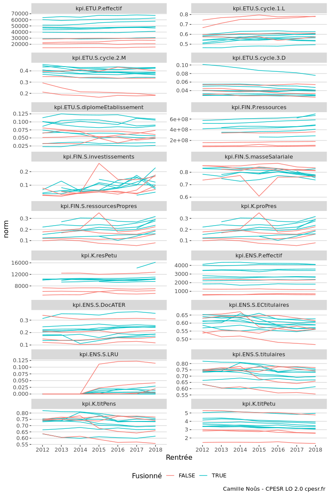
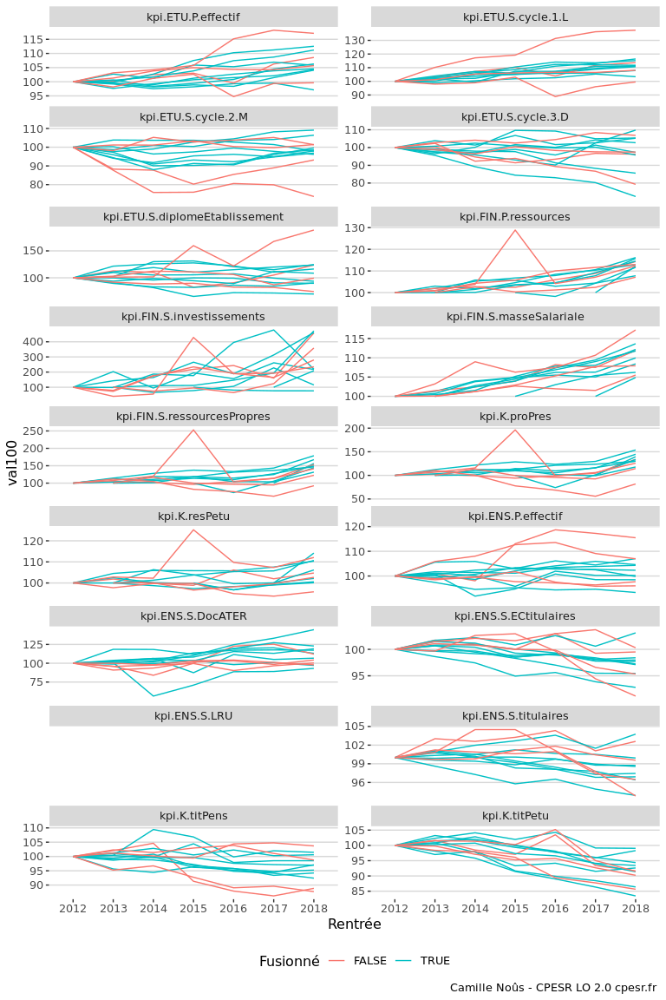
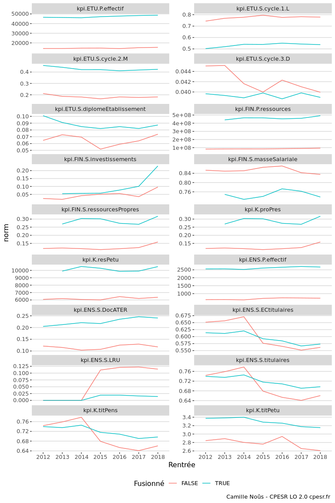
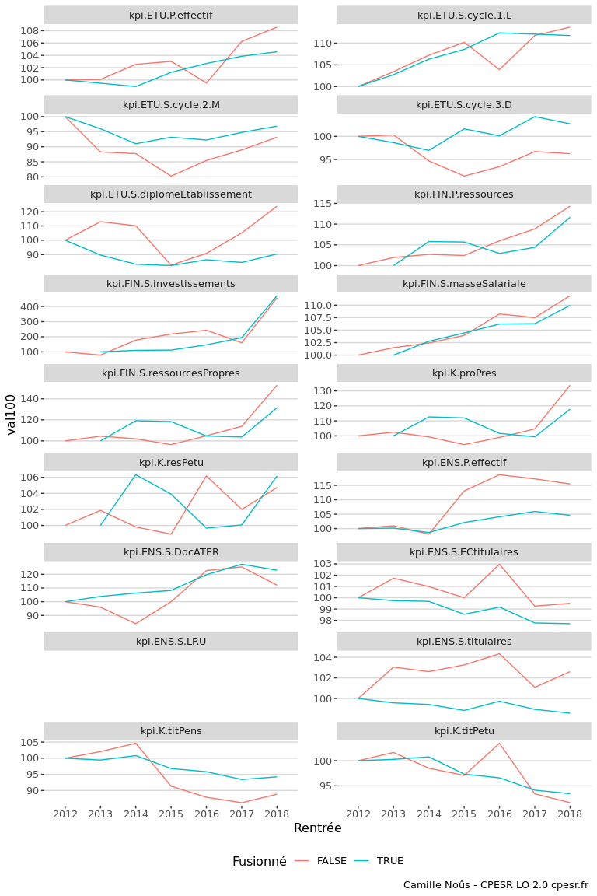

Untitled
================

Fusionné :

    ## [1] "Aix-Marseille Université"     "Université de Bordeaux"      
    ## [3] "Université de Montpellier"    "Université de Lorraine"      
    ## [5] "Université de Lille"          "Université Clermont Auvergne"
    ## [7] "Université de Strasbourg"     "Sorbonne Université"

Non fusionné :

    ## [1] "Université Toulouse 1 - Capitole"        
    ## [2] "Université Toulouse - Jean Jaurès"       
    ## [3] "Université de Toulouse 3 - Paul Sabatier"
    ## [4] "Université Bordeaux-Montaigne"

## Tous les indicateurs

<!-- -->

<!-- -->

## Juste Bordeaux

<!-- -->

<!-- -->
