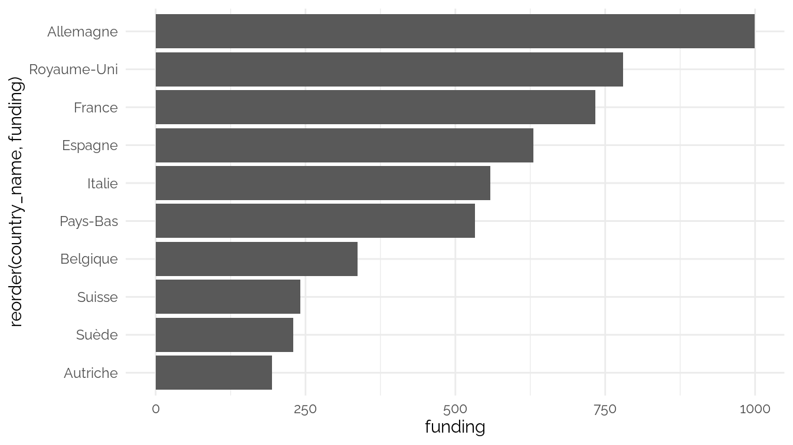
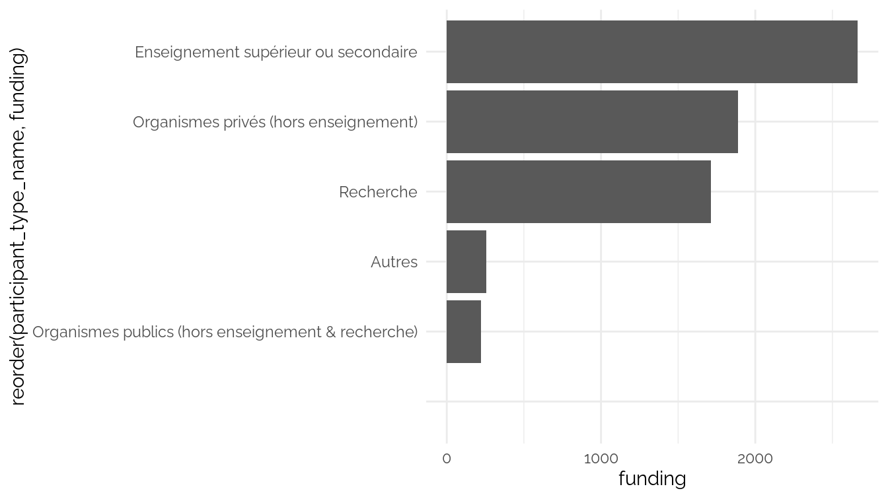
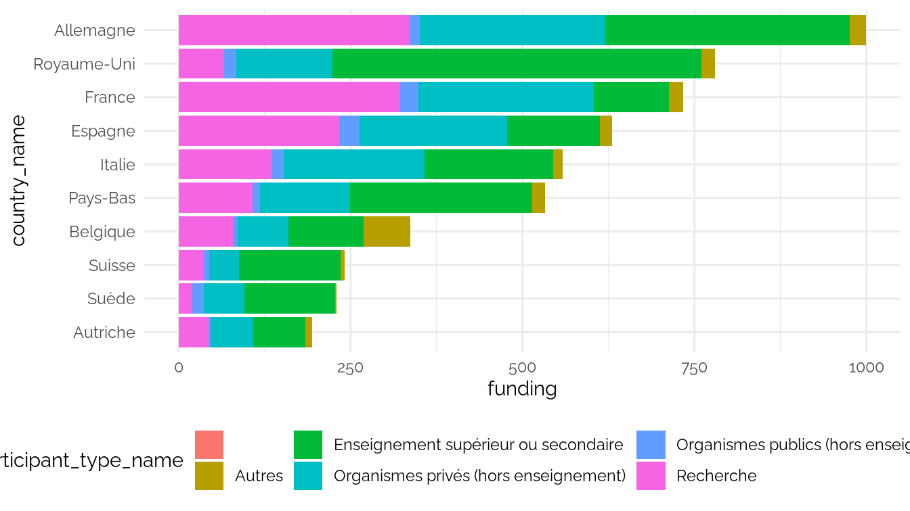
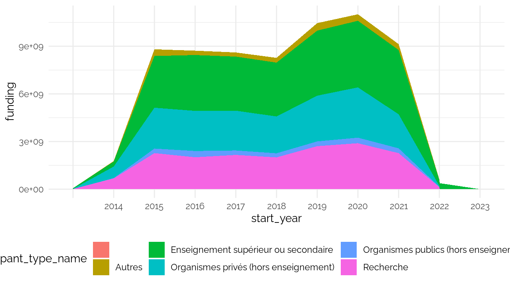
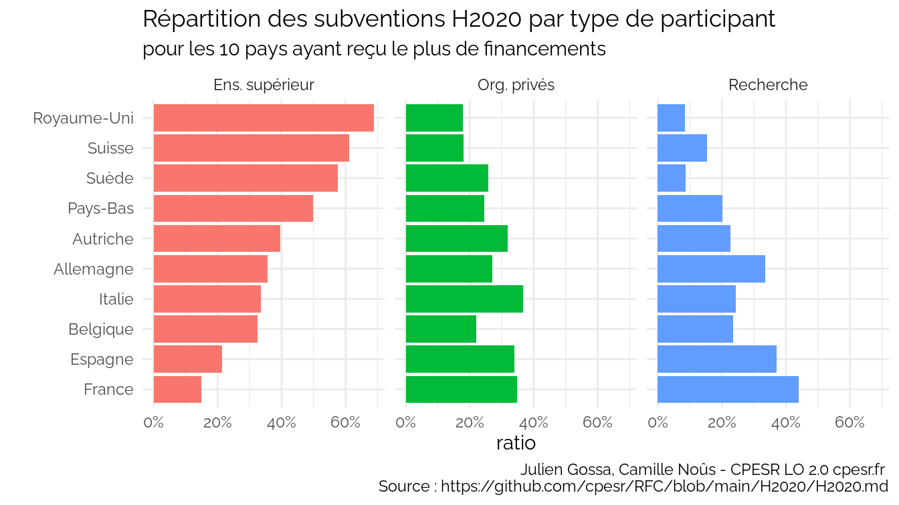
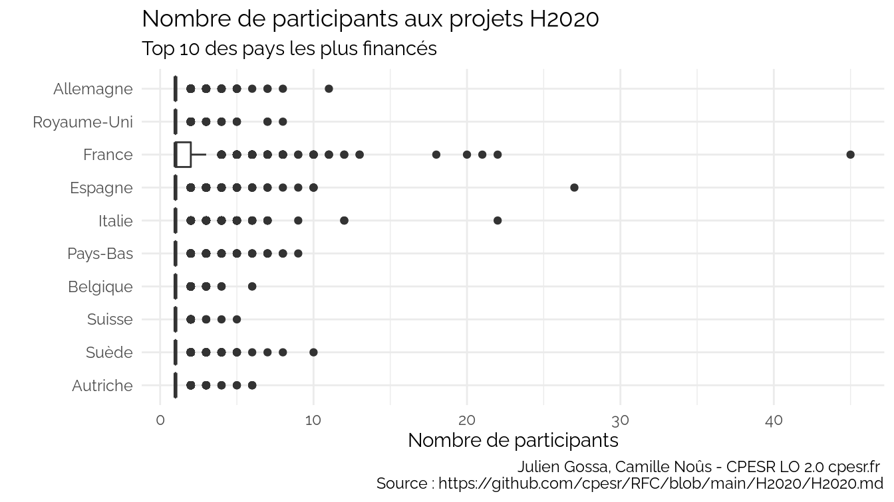
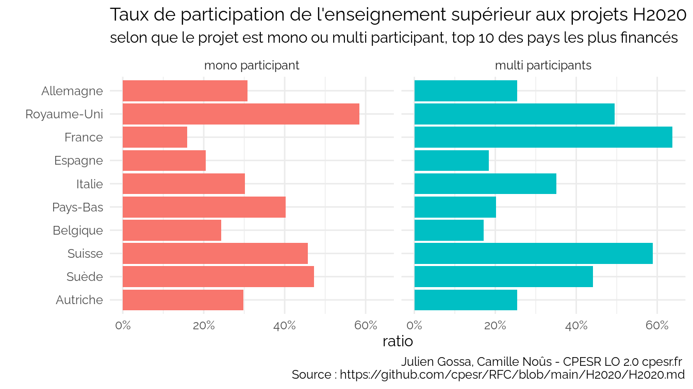
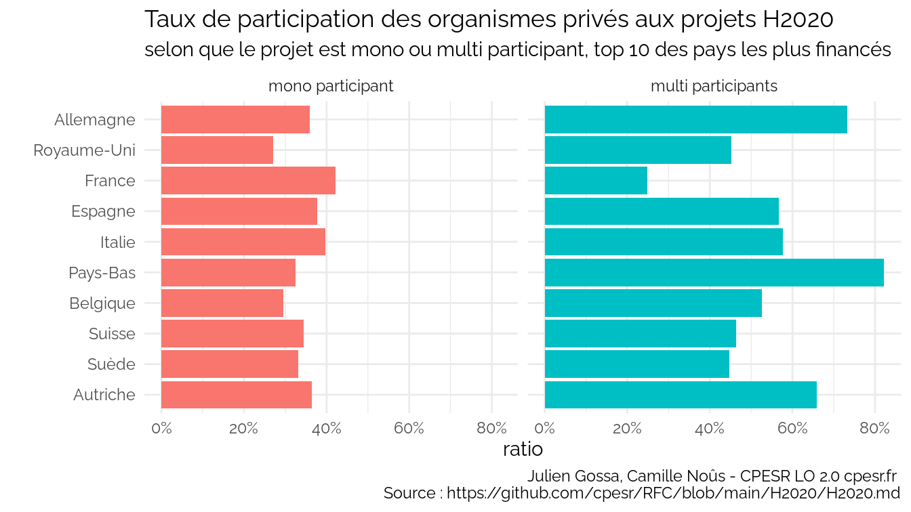
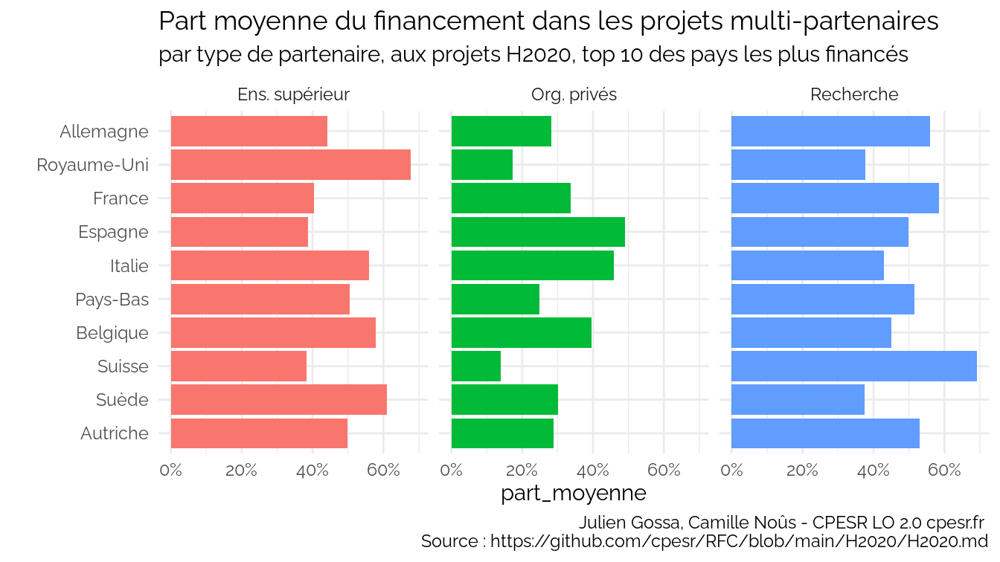

H2020
================

Source :
<https://data.enseignementsup-recherche.gouv.fr/explore/dataset/appels-a-projets-horizon-2020-projets-retenus-et-participants-identifies0/export/>

    ##  [1] "project_type"          "participation_id"      "participant_id"       
    ##  [4] "name"                  "acronym"               "role"                 
    ##  [7] "participates_as"       "co_participant"        "participant_type_code"
    ## [10] "participant_type_name" "funding"               "country_code"         
    ## [13] "country_name"          "country_level_1"       "com_code"             
    ## [16] "com_nom"               "uucr_id"               "uucr_nom"             
    ## [19] "dep_id"                "dep_nom"               "dep_num_nom"          
    ## [22] "aca_id"                "aca_nom"               "reg_id"               
    ## [25] "reg_nom"               "latitude"              "longitude"            
    ## [28] "participant_id_type"   "project_id"            "acronym_projet"       
    ## [31] "name_project"          "start_date"            "end_date"             
    ## [34] "budget_financed"       "duration"              "keywords_en"          
    ## [37] "source_url"            "call_code"             "topic_code"           
    ## [40] "programme_abbr"        "programme_lib"

## Total des financements par pays

Voir les données

| country_name               | funding |
|:---------------------------|--------:|
| Allemagne                  |  998.95 |
| Royaume-Uni                |  779.50 |
| France                     |  733.09 |
| Espagne                    |  630.06 |
| Italie                     |  558.16 |
| Pays-Bas                   |  532.54 |
| Belgique                   |  336.72 |
| Suisse                     |  241.63 |
| Suède                      |  229.75 |
| Autriche                   |  193.87 |
| Danemark                   |  172.69 |
| Norvège                    |  168.81 |
| Grèce                      |  167.61 |
| Finlande                   |  153.19 |
| Israël                     |  126.66 |
| Irlande                    |  117.30 |
| Portugal                   |  113.12 |
| Pologne                    |   73.76 |
| Rép. Tchèque               |   49.62 |
| Slovénie                   |   37.65 |
| Hongrie                    |   36.88 |
| Chypre                     |   31.55 |
| Roumanie                   |   29.93 |
| Turquie                    |   27.99 |
| Estonie                    |   27.04 |
| Luxembourg                 |   20.17 |
| Bulgarie                   |   15.96 |
| Islande                    |   14.40 |
| Croatie                    |   13.42 |
| Serbie                     |   13.15 |
| Etats-Unis                 |   12.95 |
| Slovaquie                  |   11.81 |
| Lettonie                   |   11.64 |
| Lituanie                   |    9.54 |
| Afrique du Sud             |    6.11 |
| Ukraine                    |    4.43 |
| Malte                      |    3.70 |
| Kenya                      |    3.01 |
| Sierra Leone               |    2.05 |
| Canada                     |    1.61 |
| Brésil                     |    1.59 |
| Macédoine                  |    1.45 |
| Russie                     |    1.40 |
| Ghana                      |    1.31 |
| Tunisie                    |    1.23 |
| Australie                  |    1.20 |
| Ouganda                    |    1.19 |
| Tanzanie                   |    1.04 |
| Chili                      |    0.97 |
| Argentine                  |    0.93 |
| Burkina Faso               |    0.90 |
| Colombie                   |    0.88 |
| Bosnie-Herzégovine         |    0.87 |
| Géorgie                    |    0.85 |
| Maroc                      |    0.83 |
| Rép. Moldave               |    0.74 |
| Sénégal                    |    0.66 |
| Éthiopie                   |    0.63 |
| Albanie                    |    0.58 |
| Jordanie                   |    0.58 |
| Japon                      |    0.57 |
| Chine                      |    0.56 |
| Namibie                    |    0.54 |
| Nigeria                    |    0.49 |
| Monténégro                 |    0.46 |
| Égypte                     |    0.44 |
| Liban                      |    0.43 |
| Inde                       |    0.42 |
| Arménie                    |    0.40 |
| Uruguay                    |    0.38 |
| Mozambique                 |    0.38 |
| Bangladesh                 |    0.36 |
| Équateur                   |    0.34 |
| Rép. démocratique du Congo |    0.31 |
| Malawi                     |    0.30 |
| Viêt Nam                   |    0.29 |
| Biélorussie                |    0.29 |
| Nouvelle-Zélande           |    0.26 |
| Kosovo                     |    0.26 |
| Thaïlande                  |    0.25 |
| Sri Lanka                  |    0.25 |
| Corée du Sud               |    0.24 |
| Botswana                   |    0.24 |
| Pérou                      |    0.23 |
| Indonésie                  |    0.23 |
| Madagascar                 |    0.22 |
| Pakistan                   |    0.21 |
| Zambie                     |    0.20 |
| Népal                      |    0.19 |
| Jamaïque                   |    0.18 |
| Niger                      |    0.17 |
| Côte d’Ivoire              |    0.17 |
| Rwanda                     |    0.16 |
| Malaisie                   |    0.15 |
| Philippines                |    0.14 |
| Cameroun                   |    0.14 |
| Bénin                      |    0.14 |
| Costa Rica                 |    0.13 |
| Algérie                    |    0.13 |
| Gabon                      |    0.12 |
| Mali                       |    0.12 |
| Mexique                    |    0.11 |
| Cuba                       |    0.10 |
| Iran                       |    0.09 |
| Taïwan                     |    0.09 |
| Maurice                    |    0.07 |
| Cambodge                   |    0.07 |
| Cap-Vert                   |    0.07 |
| Kirghizistan               |    0.07 |
| Irak                       |    0.06 |
| Azerbaïdjan                |    0.06 |
| Bolivie                    |    0.05 |
| Émirats arabes unis        |    0.05 |
| Tadjikistan                |    0.04 |
| Kazakhstan                 |    0.03 |
| Swaziland                  |    0.03 |
| Zimbabwe                   |    0.03 |
| Nicaragua                  |    0.03 |
| Ouzbékistan                |    0.03 |
| Palestine                  |    0.03 |
| Paraguay                   |    0.03 |
| Rép. Dominicaine           |    0.03 |
| Libéria                    |    0.03 |
| Soudan                     |    0.02 |
| Congo                      |    0.02 |
| Singapour                  |    0.02 |
| Suriname                   |    0.02 |
| Guatemala                  |    0.02 |
| Togo                       |    0.02 |
| Tchad                      |    0.02 |
| Angola                     |    0.01 |
| Panamá                     |    0.01 |
| Yémen                      |    0.01 |
| Afghanistan                |    0.01 |
| Honduras                   |    0.01 |
| Turkménistan               |    0.01 |
| Seychelles                 |    0.01 |
| Marshall                   |    0.01 |
| Mauritanie                 |    0.01 |
| Djibouti                   |    0.01 |
| Burundi                    |    0.01 |
| Birmanie                   |    0.00 |
| Maldives                   |    0.00 |
| Libye                      |    0.00 |
| Mongolie                   |    0.00 |
| Grenade                    |    0.00 |
| Lesotho                    |    0.00 |
| Belize                     |    0.00 |
| Arabie saoudite            |    0.00 |
| Bahreïn                    |    0.00 |
| Bhoutan                    |    0.00 |
| Laos                       |    0.00 |
| Liechtenstein              |    0.00 |
| Monaco                     |    0.00 |
| Oman                       |    0.00 |
| Papouasie-Nouv.-Guinée     |    0.00 |
| Qatar                      |    0.00 |
| Somalie                    |    0.00 |
| Vatican                    |    0.00 |
| Venezuela                  |    0.00 |

## Total des financements par type de participant

<table>
<thead>
<tr>
<th style="text-align:left;">
participant_type_name
</th>
<th style="text-align:right;">
funding
</th>
</tr>
</thead>
<tbody>
<tr>
<td style="text-align:left;">
Enseignement supérieur ou secondaire
</td>
<td style="text-align:right;">
2664.65
</td>
</tr>
<tr>
<td style="text-align:left;">
Organismes privés (hors enseignement)
</td>
<td style="text-align:right;">
1889.70
</td>
</tr>
<tr>
<td style="text-align:left;">
Recherche
</td>
<td style="text-align:right;">
1713.03
</td>
</tr>
<tr>
<td style="text-align:left;">
Autres
</td>
<td style="text-align:right;">
256.75
</td>
</tr>
<tr>
<td style="text-align:left;">
Organismes publics (hors enseignement & recherche)
</td>
<td style="text-align:right;">
220.71
</td>
</tr>
<tr>
<td style="text-align:left;">
</td>
<td style="text-align:right;">
0.00
</td>
</tr>
</tbody>
</table>

## Total des financements par type de participant et par pays.

Voir les données

    ## `summarise()` has grouped output by 'country_name'. You can override using the
    ## `.groups` argument.

| country_name               | participant_type_name                              | funding |
|:---------------------------|:---------------------------------------------------|--------:|
| Allemagne                  | Organismes publics (hors enseignement & recherche) |   14.92 |
| Allemagne                  | Autres                                             |   23.48 |
| Allemagne                  | Organismes privés (hors enseignement)              |  269.28 |
| Allemagne                  | Recherche                                          |  335.70 |
| Allemagne                  | Enseignement supérieur ou secondaire               |  355.57 |
| Royaume-Uni                | Organismes publics (hors enseignement & recherche) |   18.11 |
| Royaume-Uni                | Autres                                             |   19.42 |
| Royaume-Uni                | Recherche                                          |   65.69 |
| Royaume-Uni                | Organismes privés (hors enseignement)              |  139.74 |
| Royaume-Uni                | Enseignement supérieur ou secondaire               |  536.54 |
| France                     |                                                    |    0.00 |
| France                     | Autres                                             |   20.55 |
| France                     | Organismes publics (hors enseignement & recherche) |   26.35 |
| France                     | Enseignement supérieur ou secondaire               |  109.40 |
| France                     | Organismes privés (hors enseignement)              |  254.59 |
| France                     | Recherche                                          |  322.19 |
| Espagne                    | Autres                                             |   17.52 |
| Espagne                    | Organismes publics (hors enseignement & recherche) |   30.00 |
| Espagne                    | Enseignement supérieur ou secondaire               |  135.12 |
| Espagne                    | Organismes privés (hors enseignement)              |  214.15 |
| Espagne                    | Recherche                                          |  233.27 |
| Italie                     | Autres                                             |   13.60 |
| Italie                     | Organismes publics (hors enseignement & recherche) |   17.04 |
| Italie                     | Recherche                                          |  135.56 |
| Italie                     | Enseignement supérieur ou secondaire               |  186.81 |
| Italie                     | Organismes privés (hors enseignement)              |  205.14 |
| Pays-Bas                   | Organismes publics (hors enseignement & recherche) |   11.06 |
| Pays-Bas                   | Autres                                             |   18.29 |
| Pays-Bas                   | Recherche                                          |  107.36 |
| Pays-Bas                   | Organismes privés (hors enseignement)              |  130.79 |
| Pays-Bas                   | Enseignement supérieur ou secondaire               |  265.04 |
| Belgique                   | Organismes publics (hors enseignement & recherche) |    6.89 |
| Belgique                   | Autres                                             |   67.70 |
| Belgique                   | Organismes privés (hors enseignement)              |   74.24 |
| Belgique                   | Recherche                                          |   78.87 |
| Belgique                   | Enseignement supérieur ou secondaire               |  109.04 |
| Suisse                     | Autres                                             |    6.05 |
| Suisse                     | Organismes publics (hors enseignement & recherche) |    7.20 |
| Suisse                     | Recherche                                          |   37.04 |
| Suisse                     | Organismes privés (hors enseignement)              |   43.68 |
| Suisse                     | Enseignement supérieur ou secondaire               |  147.65 |
| Suède                      | Autres                                             |    2.22 |
| Suède                      | Organismes publics (hors enseignement & recherche) |   16.14 |
| Suède                      | Recherche                                          |   20.01 |
| Suède                      | Organismes privés (hors enseignement)              |   59.20 |
| Suède                      | Enseignement supérieur ou secondaire               |  132.19 |
| Autriche                   | Organismes publics (hors enseignement & recherche) |    2.52 |
| Autriche                   | Autres                                             |    9.18 |
| Autriche                   | Recherche                                          |   43.83 |
| Autriche                   | Organismes privés (hors enseignement)              |   61.65 |
| Autriche                   | Enseignement supérieur ou secondaire               |   76.69 |
| Danemark                   | Autres                                             |    5.71 |
| Danemark                   | Organismes publics (hors enseignement & recherche) |   10.44 |
| Danemark                   | Recherche                                          |   11.79 |
| Danemark                   | Organismes privés (hors enseignement)              |   40.92 |
| Danemark                   | Enseignement supérieur ou secondaire               |  103.83 |
| Norvège                    | Autres                                             |    3.81 |
| Norvège                    | Organismes publics (hors enseignement & recherche) |    7.23 |
| Norvège                    | Organismes privés (hors enseignement)              |   42.19 |
| Norvège                    | Enseignement supérieur ou secondaire               |   55.22 |
| Norvège                    | Recherche                                          |   60.35 |
| Grèce                      | Autres                                             |    3.35 |
| Grèce                      | Organismes publics (hors enseignement & recherche) |    3.56 |
| Grèce                      | Enseignement supérieur ou secondaire               |   46.67 |
| Grèce                      | Organismes privés (hors enseignement)              |   50.10 |
| Grèce                      | Recherche                                          |   63.93 |
| Finlande                   | Organismes publics (hors enseignement & recherche) |    4.05 |
| Finlande                   | Autres                                             |    5.18 |
| Finlande                   | Recherche                                          |   39.08 |
| Finlande                   | Organismes privés (hors enseignement)              |   40.04 |
| Finlande                   | Enseignement supérieur ou secondaire               |   64.84 |
| Israël                     | Autres                                             |    0.19 |
| Israël                     | Recherche                                          |    1.55 |
| Israël                     | Organismes publics (hors enseignement & recherche) |    2.61 |
| Israël                     | Organismes privés (hors enseignement)              |   42.41 |
| Israël                     | Enseignement supérieur ou secondaire               |   79.89 |
| Irlande                    | Autres                                             |    2.72 |
| Irlande                    | Recherche                                          |    3.09 |
| Irlande                    | Organismes publics (hors enseignement & recherche) |    4.65 |
| Irlande                    | Organismes privés (hors enseignement)              |   38.89 |
| Irlande                    | Enseignement supérieur ou secondaire               |   67.95 |
| Portugal                   | Autres                                             |    3.18 |
| Portugal                   | Organismes publics (hors enseignement & recherche) |    5.71 |
| Portugal                   | Enseignement supérieur ou secondaire               |   29.66 |
| Portugal                   | Organismes privés (hors enseignement)              |   31.20 |
| Portugal                   | Recherche                                          |   43.38 |
| Pologne                    | Organismes publics (hors enseignement & recherche) |    5.53 |
| Pologne                    | Autres                                             |    7.67 |
| Pologne                    | Organismes privés (hors enseignement)              |   18.64 |
| Pologne                    | Enseignement supérieur ou secondaire               |   20.35 |
| Pologne                    | Recherche                                          |   21.57 |
| Rép. Tchèque               | Autres                                             |    1.24 |
| Rép. Tchèque               | Organismes publics (hors enseignement & recherche) |    1.60 |
| Rép. Tchèque               | Recherche                                          |    9.89 |
| Rép. Tchèque               | Organismes privés (hors enseignement)              |   14.37 |
| Rép. Tchèque               | Enseignement supérieur ou secondaire               |   22.51 |
| Slovénie                   | Autres                                             |    0.77 |
| Slovénie                   | Organismes publics (hors enseignement & recherche) |    2.48 |
| Slovénie                   | Enseignement supérieur ou secondaire               |    7.04 |
| Slovénie                   | Organismes privés (hors enseignement)              |   13.49 |
| Slovénie                   | Recherche                                          |   13.87 |
| Hongrie                    | Organismes publics (hors enseignement & recherche) |    1.76 |
| Hongrie                    | Autres                                             |    3.35 |
| Hongrie                    | Recherche                                          |    9.78 |
| Hongrie                    | Enseignement supérieur ou secondaire               |    9.80 |
| Hongrie                    | Organismes privés (hors enseignement)              |   12.19 |
| Chypre                     | Organismes publics (hors enseignement & recherche) |    0.92 |
| Chypre                     | Recherche                                          |    1.79 |
| Chypre                     | Autres                                             |    2.17 |
| Chypre                     | Organismes privés (hors enseignement)              |   12.72 |
| Chypre                     | Enseignement supérieur ou secondaire               |   13.95 |
| Roumanie                   | Organismes publics (hors enseignement & recherche) |    2.09 |
| Roumanie                   | Autres                                             |    2.54 |
| Roumanie                   | Enseignement supérieur ou secondaire               |    6.10 |
| Roumanie                   | Recherche                                          |    8.12 |
| Roumanie                   | Organismes privés (hors enseignement)              |   11.08 |
| Turquie                    | Autres                                             |    0.42 |
| Turquie                    | Organismes publics (hors enseignement & recherche) |    3.23 |
| Turquie                    | Recherche                                          |    3.56 |
| Turquie                    | Enseignement supérieur ou secondaire               |    9.86 |
| Turquie                    | Organismes privés (hors enseignement)              |   10.92 |
| Estonie                    | Recherche                                          |    1.05 |
| Estonie                    | Organismes publics (hors enseignement & recherche) |    1.86 |
| Estonie                    | Autres                                             |    2.09 |
| Estonie                    | Organismes privés (hors enseignement)              |    8.93 |
| Estonie                    | Enseignement supérieur ou secondaire               |   13.11 |
| Luxembourg                 | Organismes publics (hors enseignement & recherche) |    0.65 |
| Luxembourg                 | Autres                                             |    1.37 |
| Luxembourg                 | Recherche                                          |    3.58 |
| Luxembourg                 | Enseignement supérieur ou secondaire               |    5.95 |
| Luxembourg                 | Organismes privés (hors enseignement)              |    8.62 |
| Bulgarie                   | Autres                                             |    0.90 |
| Bulgarie                   | Organismes publics (hors enseignement & recherche) |    1.13 |
| Bulgarie                   | Enseignement supérieur ou secondaire               |    4.02 |
| Bulgarie                   | Recherche                                          |    4.69 |
| Bulgarie                   | Organismes privés (hors enseignement)              |    5.22 |
| Islande                    | Autres                                             |    0.14 |
| Islande                    | Organismes publics (hors enseignement & recherche) |    0.60 |
| Islande                    | Recherche                                          |    3.34 |
| Islande                    | Enseignement supérieur ou secondaire               |    3.75 |
| Islande                    | Organismes privés (hors enseignement)              |    6.57 |
| Croatie                    | Autres                                             |    0.53 |
| Croatie                    | Organismes publics (hors enseignement & recherche) |    1.26 |
| Croatie                    | Recherche                                          |    3.53 |
| Croatie                    | Organismes privés (hors enseignement)              |    3.93 |
| Croatie                    | Enseignement supérieur ou secondaire               |    4.17 |
| Serbie                     | Organismes publics (hors enseignement & recherche) |    0.31 |
| Serbie                     | Autres                                             |    1.09 |
| Serbie                     | Enseignement supérieur ou secondaire               |    2.95 |
| Serbie                     | Organismes privés (hors enseignement)              |    3.91 |
| Serbie                     | Recherche                                          |    4.88 |
| Etats-Unis                 | Organismes publics (hors enseignement & recherche) |    0.05 |
| Etats-Unis                 | Autres                                             |    1.64 |
| Etats-Unis                 | Organismes privés (hors enseignement)              |    1.90 |
| Etats-Unis                 | Recherche                                          |    2.21 |
| Etats-Unis                 | Enseignement supérieur ou secondaire               |    7.15 |
| Slovaquie                  | Organismes publics (hors enseignement & recherche) |    0.65 |
| Slovaquie                  | Autres                                             |    0.76 |
| Slovaquie                  | Recherche                                          |    2.02 |
| Slovaquie                  | Organismes privés (hors enseignement)              |    3.65 |
| Slovaquie                  | Enseignement supérieur ou secondaire               |    4.73 |
| Lettonie                   | Autres                                             |    0.71 |
| Lettonie                   | Organismes publics (hors enseignement & recherche) |    1.32 |
| Lettonie                   | Recherche                                          |    1.65 |
| Lettonie                   | Organismes privés (hors enseignement)              |    3.23 |
| Lettonie                   | Enseignement supérieur ou secondaire               |    4.72 |
| Lituanie                   | Organismes publics (hors enseignement & recherche) |    1.07 |
| Lituanie                   | Autres                                             |    1.21 |
| Lituanie                   | Recherche                                          |    1.28 |
| Lituanie                   | Enseignement supérieur ou secondaire               |    2.81 |
| Lituanie                   | Organismes privés (hors enseignement)              |    3.16 |
| Afrique du Sud             | Autres                                             |    0.59 |
| Afrique du Sud             | Organismes publics (hors enseignement & recherche) |    0.70 |
| Afrique du Sud             | Organismes privés (hors enseignement)              |    1.05 |
| Afrique du Sud             | Recherche                                          |    1.59 |
| Afrique du Sud             | Enseignement supérieur ou secondaire               |    2.18 |
| Ukraine                    | Autres                                             |    0.17 |
| Ukraine                    | Organismes publics (hors enseignement & recherche) |    0.20 |
| Ukraine                    | Recherche                                          |    0.85 |
| Ukraine                    | Enseignement supérieur ou secondaire               |    0.89 |
| Ukraine                    | Organismes privés (hors enseignement)              |    2.31 |
| Malte                      | Autres                                             |    0.10 |
| Malte                      | Recherche                                          |    0.21 |
| Malte                      | Organismes publics (hors enseignement & recherche) |    0.69 |
| Malte                      | Organismes privés (hors enseignement)              |    0.95 |
| Malte                      | Enseignement supérieur ou secondaire               |    1.75 |
| Kenya                      | Organismes privés (hors enseignement)              |    0.22 |
| Kenya                      | Enseignement supérieur ou secondaire               |    0.36 |
| Kenya                      | Autres                                             |    0.42 |
| Kenya                      | Organismes publics (hors enseignement & recherche) |    0.98 |
| Kenya                      | Recherche                                          |    1.04 |
| Sierra Leone               | Organismes privés (hors enseignement)              |    0.02 |
| Sierra Leone               | Autres                                             |    0.62 |
| Sierra Leone               | Enseignement supérieur ou secondaire               |    1.41 |
| Canada                     | Organismes publics (hors enseignement & recherche) |    0.05 |
| Canada                     | Recherche                                          |    0.09 |
| Canada                     | Autres                                             |    0.23 |
| Canada                     | Organismes privés (hors enseignement)              |    0.31 |
| Canada                     | Enseignement supérieur ou secondaire               |    0.93 |
| Brésil                     | Organismes publics (hors enseignement & recherche) |    0.05 |
| Brésil                     | Organismes privés (hors enseignement)              |    0.06 |
| Brésil                     | Autres                                             |    0.21 |
| Brésil                     | Recherche                                          |    0.43 |
| Brésil                     | Enseignement supérieur ou secondaire               |    0.84 |
| Macédoine                  | Organismes publics (hors enseignement & recherche) |    0.10 |
| Macédoine                  | Autres                                             |    0.19 |
| Macédoine                  | Recherche                                          |    0.28 |
| Macédoine                  | Enseignement supérieur ou secondaire               |    0.39 |
| Macédoine                  | Organismes privés (hors enseignement)              |    0.49 |
| Russie                     | Organismes publics (hors enseignement & recherche) |    0.01 |
| Russie                     | Organismes privés (hors enseignement)              |    0.01 |
| Russie                     | Autres                                             |    0.17 |
| Russie                     | Enseignement supérieur ou secondaire               |    0.43 |
| Russie                     | Recherche                                          |    0.78 |
| Ghana                      | Organismes publics (hors enseignement & recherche) |    0.02 |
| Ghana                      | Organismes privés (hors enseignement)              |    0.17 |
| Ghana                      | Recherche                                          |    0.32 |
| Ghana                      | Autres                                             |    0.39 |
| Ghana                      | Enseignement supérieur ou secondaire               |    0.42 |
| Tunisie                    | Organismes privés (hors enseignement)              |    0.05 |
| Tunisie                    | Autres                                             |    0.12 |
| Tunisie                    | Organismes publics (hors enseignement & recherche) |    0.31 |
| Tunisie                    | Enseignement supérieur ou secondaire               |    0.32 |
| Tunisie                    | Recherche                                          |    0.43 |
| Australie                  | Organismes publics (hors enseignement & recherche) |    0.00 |
| Australie                  | Autres                                             |    0.02 |
| Australie                  | Recherche                                          |    0.26 |
| Australie                  | Organismes privés (hors enseignement)              |    0.31 |
| Australie                  | Enseignement supérieur ou secondaire               |    0.60 |
| Ouganda                    | Organismes publics (hors enseignement & recherche) |    0.07 |
| Ouganda                    | Recherche                                          |    0.10 |
| Ouganda                    | Organismes privés (hors enseignement)              |    0.12 |
| Ouganda                    | Autres                                             |    0.26 |
| Ouganda                    | Enseignement supérieur ou secondaire               |    0.66 |
| Tanzanie                   | Organismes privés (hors enseignement)              |    0.05 |
| Tanzanie                   | Autres                                             |    0.08 |
| Tanzanie                   | Organismes publics (hors enseignement & recherche) |    0.18 |
| Tanzanie                   | Enseignement supérieur ou secondaire               |    0.23 |
| Tanzanie                   | Recherche                                          |    0.50 |
| Chili                      | Autres                                             |    0.06 |
| Chili                      | Organismes privés (hors enseignement)              |    0.07 |
| Chili                      | Organismes publics (hors enseignement & recherche) |    0.12 |
| Chili                      | Recherche                                          |    0.12 |
| Chili                      | Enseignement supérieur ou secondaire               |    0.61 |
| Argentine                  | Autres                                             |    0.04 |
| Argentine                  | Organismes publics (hors enseignement & recherche) |    0.11 |
| Argentine                  | Organismes privés (hors enseignement)              |    0.13 |
| Argentine                  | Enseignement supérieur ou secondaire               |    0.24 |
| Argentine                  | Recherche                                          |    0.40 |
| Burkina Faso               | Organismes publics (hors enseignement & recherche) |    0.06 |
| Burkina Faso               | Organismes privés (hors enseignement)              |    0.10 |
| Burkina Faso               | Enseignement supérieur ou secondaire               |    0.24 |
| Burkina Faso               | Recherche                                          |    0.50 |
| Colombie                   | Organismes publics (hors enseignement & recherche) |    0.04 |
| Colombie                   | Organismes privés (hors enseignement)              |    0.06 |
| Colombie                   | Autres                                             |    0.10 |
| Colombie                   | Recherche                                          |    0.20 |
| Colombie                   | Enseignement supérieur ou secondaire               |    0.47 |
| Bosnie-Herzégovine         | Organismes publics (hors enseignement & recherche) |    0.04 |
| Bosnie-Herzégovine         | Organismes privés (hors enseignement)              |    0.18 |
| Bosnie-Herzégovine         | Recherche                                          |    0.19 |
| Bosnie-Herzégovine         | Enseignement supérieur ou secondaire               |    0.23 |
| Bosnie-Herzégovine         | Autres                                             |    0.23 |
| Géorgie                    | Organismes publics (hors enseignement & recherche) |    0.07 |
| Géorgie                    | Recherche                                          |    0.11 |
| Géorgie                    | Enseignement supérieur ou secondaire               |    0.14 |
| Géorgie                    | Organismes privés (hors enseignement)              |    0.26 |
| Géorgie                    | Autres                                             |    0.28 |
| Maroc                      | Organismes publics (hors enseignement & recherche) |    0.03 |
| Maroc                      | Autres                                             |    0.05 |
| Maroc                      | Organismes privés (hors enseignement)              |    0.17 |
| Maroc                      | Enseignement supérieur ou secondaire               |    0.21 |
| Maroc                      | Recherche                                          |    0.37 |
| Rép. Moldave               | Organismes publics (hors enseignement & recherche) |    0.06 |
| Rép. Moldave               | Organismes privés (hors enseignement)              |    0.07 |
| Rép. Moldave               | Enseignement supérieur ou secondaire               |    0.18 |
| Rép. Moldave               | Autres                                             |    0.20 |
| Rép. Moldave               | Recherche                                          |    0.24 |
| Sénégal                    | Organismes publics (hors enseignement & recherche) |    0.07 |
| Sénégal                    | Enseignement supérieur ou secondaire               |    0.10 |
| Sénégal                    | Organismes privés (hors enseignement)              |    0.10 |
| Sénégal                    | Autres                                             |    0.14 |
| Sénégal                    | Recherche                                          |    0.25 |
| Éthiopie                   | Recherche                                          |    0.05 |
| Éthiopie                   | Autres                                             |    0.06 |
| Éthiopie                   | Organismes privés (hors enseignement)              |    0.07 |
| Éthiopie                   | Organismes publics (hors enseignement & recherche) |    0.07 |
| Éthiopie                   | Enseignement supérieur ou secondaire               |    0.38 |
| Albanie                    | Organismes privés (hors enseignement)              |    0.08 |
| Albanie                    | Autres                                             |    0.08 |
| Albanie                    | Organismes publics (hors enseignement & recherche) |    0.10 |
| Albanie                    | Recherche                                          |    0.14 |
| Albanie                    | Enseignement supérieur ou secondaire               |    0.18 |
| Jordanie                   | Organismes privés (hors enseignement)              |    0.02 |
| Jordanie                   | Enseignement supérieur ou secondaire               |    0.07 |
| Jordanie                   | Organismes publics (hors enseignement & recherche) |    0.09 |
| Jordanie                   | Recherche                                          |    0.40 |
| Japon                      | Autres                                             |    0.00 |
| Japon                      | Organismes privés (hors enseignement)              |    0.00 |
| Japon                      | Organismes publics (hors enseignement & recherche) |    0.02 |
| Japon                      | Recherche                                          |    0.05 |
| Japon                      | Enseignement supérieur ou secondaire               |    0.51 |
| Chine                      | Autres                                             |    0.04 |
| Chine                      | Organismes privés (hors enseignement)              |    0.05 |
| Chine                      | Organismes publics (hors enseignement & recherche) |    0.08 |
| Chine                      | Recherche                                          |    0.14 |
| Chine                      | Enseignement supérieur ou secondaire               |    0.26 |
| Namibie                    | Organismes publics (hors enseignement & recherche) |    0.03 |
| Namibie                    | Autres                                             |    0.06 |
| Namibie                    | Organismes privés (hors enseignement)              |    0.14 |
| Namibie                    | Enseignement supérieur ou secondaire               |    0.15 |
| Namibie                    | Recherche                                          |    0.15 |
| Nigeria                    | Organismes publics (hors enseignement & recherche) |    0.01 |
| Nigeria                    | Enseignement supérieur ou secondaire               |    0.03 |
| Nigeria                    | Autres                                             |    0.04 |
| Nigeria                    | Organismes privés (hors enseignement)              |    0.07 |
| Nigeria                    | Recherche                                          |    0.34 |
| Monténégro                 | Autres                                             |    0.04 |
| Monténégro                 | Recherche                                          |    0.04 |
| Monténégro                 | Organismes privés (hors enseignement)              |    0.11 |
| Monténégro                 | Organismes publics (hors enseignement & recherche) |    0.13 |
| Monténégro                 | Enseignement supérieur ou secondaire               |    0.14 |
| Égypte                     | Autres                                             |    0.03 |
| Égypte                     | Organismes privés (hors enseignement)              |    0.07 |
| Égypte                     | Recherche                                          |    0.07 |
| Égypte                     | Organismes publics (hors enseignement & recherche) |    0.09 |
| Égypte                     | Enseignement supérieur ou secondaire               |    0.18 |
| Liban                      | Autres                                             |    0.02 |
| Liban                      | Organismes privés (hors enseignement)              |    0.05 |
| Liban                      | Enseignement supérieur ou secondaire               |    0.13 |
| Liban                      | Recherche                                          |    0.23 |
| Inde                       | Organismes publics (hors enseignement & recherche) |    0.03 |
| Inde                       | Enseignement supérieur ou secondaire               |    0.05 |
| Inde                       | Autres                                             |    0.09 |
| Inde                       | Organismes privés (hors enseignement)              |    0.11 |
| Inde                       | Recherche                                          |    0.15 |
| Arménie                    | Autres                                             |    0.00 |
| Arménie                    | Organismes publics (hors enseignement & recherche) |    0.02 |
| Arménie                    | Organismes privés (hors enseignement)              |    0.02 |
| Arménie                    | Recherche                                          |    0.09 |
| Arménie                    | Enseignement supérieur ou secondaire               |    0.26 |
| Uruguay                    | Organismes privés (hors enseignement)              |    0.00 |
| Uruguay                    | Recherche                                          |    0.05 |
| Uruguay                    | Organismes publics (hors enseignement & recherche) |    0.08 |
| Uruguay                    | Autres                                             |    0.11 |
| Uruguay                    | Enseignement supérieur ou secondaire               |    0.15 |
| Mozambique                 | Organismes privés (hors enseignement)              |    0.02 |
| Mozambique                 | Organismes publics (hors enseignement & recherche) |    0.03 |
| Mozambique                 | Enseignement supérieur ou secondaire               |    0.13 |
| Mozambique                 | Recherche                                          |    0.20 |
| Bangladesh                 | Organismes privés (hors enseignement)              |    0.03 |
| Bangladesh                 | Enseignement supérieur ou secondaire               |    0.05 |
| Bangladesh                 | Autres                                             |    0.07 |
| Bangladesh                 | Recherche                                          |    0.21 |
| Équateur                   | Autres                                             |    0.00 |
| Équateur                   | Recherche                                          |    0.03 |
| Équateur                   | Organismes publics (hors enseignement & recherche) |    0.06 |
| Équateur                   | Organismes privés (hors enseignement)              |    0.08 |
| Équateur                   | Enseignement supérieur ou secondaire               |    0.18 |
| Rép. démocratique du Congo | Organismes privés (hors enseignement)              |    0.00 |
| Rép. démocratique du Congo | Enseignement supérieur ou secondaire               |    0.31 |
| Malawi                     | Organismes privés (hors enseignement)              |    0.00 |
| Malawi                     | Organismes publics (hors enseignement & recherche) |    0.01 |
| Malawi                     | Autres                                             |    0.01 |
| Malawi                     | Recherche                                          |    0.10 |
| Malawi                     | Enseignement supérieur ou secondaire               |    0.18 |
| Viêt Nam                   | Autres                                             |    0.01 |
| Viêt Nam                   | Organismes privés (hors enseignement)              |    0.01 |
| Viêt Nam                   | Organismes publics (hors enseignement & recherche) |    0.02 |
| Viêt Nam                   | Recherche                                          |    0.03 |
| Viêt Nam                   | Enseignement supérieur ou secondaire               |    0.23 |
| Biélorussie                | Organismes publics (hors enseignement & recherche) |    0.02 |
| Biélorussie                | Autres                                             |    0.02 |
| Biélorussie                | Enseignement supérieur ou secondaire               |    0.04 |
| Biélorussie                | Organismes privés (hors enseignement)              |    0.08 |
| Biélorussie                | Recherche                                          |    0.13 |
| Nouvelle-Zélande           | Organismes privés (hors enseignement)              |    0.01 |
| Nouvelle-Zélande           | Organismes publics (hors enseignement & recherche) |    0.01 |
| Nouvelle-Zélande           | Recherche                                          |    0.08 |
| Nouvelle-Zélande           | Enseignement supérieur ou secondaire               |    0.17 |
| Kosovo                     | Organismes publics (hors enseignement & recherche) |    0.03 |
| Kosovo                     | Enseignement supérieur ou secondaire               |    0.03 |
| Kosovo                     | Autres                                             |    0.06 |
| Kosovo                     | Organismes privés (hors enseignement)              |    0.07 |
| Kosovo                     | Recherche                                          |    0.07 |
| Thaïlande                  | Organismes publics (hors enseignement & recherche) |    0.01 |
| Thaïlande                  | Organismes privés (hors enseignement)              |    0.03 |
| Thaïlande                  | Recherche                                          |    0.04 |
| Thaïlande                  | Autres                                             |    0.04 |
| Thaïlande                  | Enseignement supérieur ou secondaire               |    0.13 |
| Sri Lanka                  | Autres                                             |    0.03 |
| Sri Lanka                  | Enseignement supérieur ou secondaire               |    0.03 |
| Sri Lanka                  | Recherche                                          |    0.19 |
| Corée du Sud               | Organismes privés (hors enseignement)              |    0.00 |
| Corée du Sud               | Autres                                             |    0.01 |
| Corée du Sud               | Organismes publics (hors enseignement & recherche) |    0.04 |
| Corée du Sud               | Enseignement supérieur ou secondaire               |    0.05 |
| Corée du Sud               | Recherche                                          |    0.15 |
| Botswana                   | Organismes publics (hors enseignement & recherche) |    0.01 |
| Botswana                   | Enseignement supérieur ou secondaire               |    0.08 |
| Botswana                   | Recherche                                          |    0.16 |
| Pérou                      | Autres                                             |    0.00 |
| Pérou                      | Organismes privés (hors enseignement)              |    0.02 |
| Pérou                      | Recherche                                          |    0.03 |
| Pérou                      | Organismes publics (hors enseignement & recherche) |    0.04 |
| Pérou                      | Enseignement supérieur ou secondaire               |    0.14 |
| Indonésie                  | Autres                                             |    0.02 |
| Indonésie                  | Recherche                                          |    0.03 |
| Indonésie                  | Organismes privés (hors enseignement)              |    0.04 |
| Indonésie                  | Enseignement supérieur ou secondaire               |    0.13 |
| Madagascar                 | Organismes publics (hors enseignement & recherche) |    0.00 |
| Madagascar                 | Recherche                                          |    0.06 |
| Madagascar                 | Organismes privés (hors enseignement)              |    0.07 |
| Madagascar                 | Enseignement supérieur ou secondaire               |    0.10 |
| Pakistan                   | Autres                                             |    0.01 |
| Pakistan                   | Organismes privés (hors enseignement)              |    0.01 |
| Pakistan                   | Organismes publics (hors enseignement & recherche) |    0.04 |
| Pakistan                   | Enseignement supérieur ou secondaire               |    0.06 |
| Pakistan                   | Recherche                                          |    0.09 |
| Zambie                     | Organismes privés (hors enseignement)              |    0.00 |
| Zambie                     | Autres                                             |    0.03 |
| Zambie                     | Organismes publics (hors enseignement & recherche) |    0.04 |
| Zambie                     | Enseignement supérieur ou secondaire               |    0.12 |
| Népal                      | Enseignement supérieur ou secondaire               |    0.00 |
| Népal                      | Recherche                                          |    0.01 |
| Népal                      | Organismes privés (hors enseignement)              |    0.03 |
| Népal                      | Organismes publics (hors enseignement & recherche) |    0.05 |
| Népal                      | Autres                                             |    0.10 |
| Jamaïque                   | Organismes privés (hors enseignement)              |    0.02 |
| Jamaïque                   | Enseignement supérieur ou secondaire               |    0.15 |
| Niger                      | Recherche                                          |    0.04 |
| Niger                      | Enseignement supérieur ou secondaire               |    0.13 |
| Côte d’Ivoire              | Organismes privés (hors enseignement)              |    0.01 |
| Côte d’Ivoire              | Recherche                                          |    0.02 |
| Côte d’Ivoire              | Organismes publics (hors enseignement & recherche) |    0.03 |
| Côte d’Ivoire              | Autres                                             |    0.03 |
| Côte d’Ivoire              | Enseignement supérieur ou secondaire               |    0.07 |
| Rwanda                     | Autres                                             |    0.00 |
| Rwanda                     | Enseignement supérieur ou secondaire               |    0.04 |
| Rwanda                     | Organismes publics (hors enseignement & recherche) |    0.05 |
| Rwanda                     | Organismes privés (hors enseignement)              |    0.07 |
| Malaisie                   | Enseignement supérieur ou secondaire               |    0.05 |
| Malaisie                   | Organismes privés (hors enseignement)              |    0.05 |
| Malaisie                   | Recherche                                          |    0.05 |
| Philippines                | Enseignement supérieur ou secondaire               |    0.01 |
| Philippines                | Organismes publics (hors enseignement & recherche) |    0.01 |
| Philippines                | Organismes privés (hors enseignement)              |    0.01 |
| Philippines                | Recherche                                          |    0.05 |
| Philippines                | Autres                                             |    0.06 |
| Cameroun                   | Autres                                             |    0.00 |
| Cameroun                   | Recherche                                          |    0.01 |
| Cameroun                   | Organismes privés (hors enseignement)              |    0.01 |
| Cameroun                   | Enseignement supérieur ou secondaire               |    0.04 |
| Cameroun                   | Organismes publics (hors enseignement & recherche) |    0.08 |
| Bénin                      | Organismes publics (hors enseignement & recherche) |    0.01 |
| Bénin                      | Autres                                             |    0.02 |
| Bénin                      | Organismes privés (hors enseignement)              |    0.03 |
| Bénin                      | Enseignement supérieur ou secondaire               |    0.03 |
| Bénin                      | Recherche                                          |    0.06 |
| Costa Rica                 | Recherche                                          |    0.00 |
| Costa Rica                 | Organismes publics (hors enseignement & recherche) |    0.02 |
| Costa Rica                 | Autres                                             |    0.05 |
| Costa Rica                 | Enseignement supérieur ou secondaire               |    0.06 |
| Algérie                    | Organismes privés (hors enseignement)              |    0.02 |
| Algérie                    | Recherche                                          |    0.02 |
| Algérie                    | Enseignement supérieur ou secondaire               |    0.04 |
| Algérie                    | Organismes publics (hors enseignement & recherche) |    0.05 |
| Gabon                      | Recherche                                          |    0.12 |
| Mali                       | Autres                                             |    0.02 |
| Mali                       | Recherche                                          |    0.05 |
| Mali                       | Enseignement supérieur ou secondaire               |    0.05 |
| Mexique                    | Organismes privés (hors enseignement)              |    0.00 |
| Mexique                    | Autres                                             |    0.01 |
| Mexique                    | Organismes publics (hors enseignement & recherche) |    0.01 |
| Mexique                    | Recherche                                          |    0.03 |
| Mexique                    | Enseignement supérieur ou secondaire               |    0.05 |
| Cuba                       | Organismes privés (hors enseignement)              |    0.01 |
| Cuba                       | Recherche                                          |    0.02 |
| Cuba                       | Enseignement supérieur ou secondaire               |    0.03 |
| Cuba                       | Organismes publics (hors enseignement & recherche) |    0.04 |
| Iran                       | Recherche                                          |    0.00 |
| Iran                       | Organismes publics (hors enseignement & recherche) |    0.01 |
| Iran                       | Autres                                             |    0.02 |
| Iran                       | Enseignement supérieur ou secondaire               |    0.07 |
| Taïwan                     | Enseignement supérieur ou secondaire               |    0.00 |
| Taïwan                     | Organismes privés (hors enseignement)              |    0.00 |
| Taïwan                     | Organismes publics (hors enseignement & recherche) |    0.02 |
| Taïwan                     | Autres                                             |    0.02 |
| Taïwan                     | Recherche                                          |    0.04 |
| Maurice                    | Enseignement supérieur ou secondaire               |    0.00 |
| Maurice                    | Organismes publics (hors enseignement & recherche) |    0.00 |
| Maurice                    | Organismes privés (hors enseignement)              |    0.03 |
| Maurice                    | Autres                                             |    0.05 |
| Cambodge                   | Enseignement supérieur ou secondaire               |    0.00 |
| Cambodge                   | Recherche                                          |    0.01 |
| Cambodge                   | Organismes publics (hors enseignement & recherche) |    0.07 |
| Cap-Vert                   | Recherche                                          |    0.00 |
| Cap-Vert                   | Organismes privés (hors enseignement)              |    0.01 |
| Cap-Vert                   | Enseignement supérieur ou secondaire               |    0.02 |
| Cap-Vert                   | Organismes publics (hors enseignement & recherche) |    0.04 |
| Kirghizistan               | Organismes privés (hors enseignement)              |    0.00 |
| Kirghizistan               | Autres                                             |    0.00 |
| Kirghizistan               | Recherche                                          |    0.01 |
| Kirghizistan               | Organismes publics (hors enseignement & recherche) |    0.02 |
| Kirghizistan               | Enseignement supérieur ou secondaire               |    0.03 |
| Irak                       | Recherche                                          |    0.06 |
| Azerbaïdjan                | Organismes privés (hors enseignement)              |    0.00 |
| Azerbaïdjan                | Recherche                                          |    0.00 |
| Azerbaïdjan                | Organismes publics (hors enseignement & recherche) |    0.00 |
| Azerbaïdjan                | Autres                                             |    0.01 |
| Azerbaïdjan                | Enseignement supérieur ou secondaire               |    0.05 |
| Bolivie                    | Recherche                                          |    0.02 |
| Bolivie                    | Enseignement supérieur ou secondaire               |    0.03 |
| Émirats arabes unis        | Enseignement supérieur ou secondaire               |    0.00 |
| Émirats arabes unis        | Organismes privés (hors enseignement)              |    0.00 |
| Émirats arabes unis        | Organismes publics (hors enseignement & recherche) |    0.05 |
| Tadjikistan                | Recherche                                          |    0.01 |
| Tadjikistan                | Organismes privés (hors enseignement)              |    0.01 |
| Tadjikistan                | Enseignement supérieur ou secondaire               |    0.02 |
| Kazakhstan                 | Enseignement supérieur ou secondaire               |    0.01 |
| Kazakhstan                 | Organismes privés (hors enseignement)              |    0.02 |
| Swaziland                  | Organismes publics (hors enseignement & recherche) |    0.00 |
| Swaziland                  | Autres                                             |    0.01 |
| Swaziland                  | Enseignement supérieur ou secondaire               |    0.02 |
| Zimbabwe                   | Organismes privés (hors enseignement)              |    0.01 |
| Zimbabwe                   | Recherche                                          |    0.01 |
| Zimbabwe                   | Organismes publics (hors enseignement & recherche) |    0.02 |
| Nicaragua                  | Recherche                                          |    0.03 |
| Ouzbékistan                | Recherche                                          |    0.00 |
| Ouzbékistan                | Enseignement supérieur ou secondaire               |    0.03 |
| Palestine                  | Organismes privés (hors enseignement)              |    0.00 |
| Palestine                  | Recherche                                          |    0.00 |
| Palestine                  | Organismes publics (hors enseignement & recherche) |    0.01 |
| Palestine                  | Enseignement supérieur ou secondaire               |    0.01 |
| Palestine                  | Autres                                             |    0.01 |
| Paraguay                   | Organismes publics (hors enseignement & recherche) |    0.00 |
| Paraguay                   | Enseignement supérieur ou secondaire               |    0.00 |
| Paraguay                   | Organismes privés (hors enseignement)              |    0.02 |
| Rép. Dominicaine           | Enseignement supérieur ou secondaire               |    0.03 |
| Libéria                    | Organismes privés (hors enseignement)              |    0.03 |
| Soudan                     | Organismes publics (hors enseignement & recherche) |    0.02 |
| Congo                      | Autres                                             |    0.02 |
| Singapour                  | Organismes privés (hors enseignement)              |    0.00 |
| Singapour                  | Recherche                                          |    0.01 |
| Singapour                  | Enseignement supérieur ou secondaire               |    0.02 |
| Suriname                   | Recherche                                          |    0.02 |
| Guatemala                  | Organismes publics (hors enseignement & recherche) |    0.01 |
| Guatemala                  | Enseignement supérieur ou secondaire               |    0.01 |
| Togo                       | Enseignement supérieur ou secondaire               |    0.01 |
| Togo                       | Organismes publics (hors enseignement & recherche) |    0.01 |
| Tchad                      | Recherche                                          |    0.02 |
| Angola                     | Enseignement supérieur ou secondaire               |    0.00 |
| Angola                     | Recherche                                          |    0.01 |
| Panamá                     | Organismes publics (hors enseignement & recherche) |    0.00 |
| Panamá                     | Organismes privés (hors enseignement)              |    0.00 |
| Panamá                     | Recherche                                          |    0.01 |
| Yémen                      | Autres                                             |    0.01 |
| Afghanistan                | Organismes privés (hors enseignement)              |    0.01 |
| Honduras                   | Recherche                                          |    0.01 |
| Turkménistan               | Organismes privés (hors enseignement)              |    0.01 |
| Seychelles                 | Recherche                                          |    0.01 |
| Marshall                   | Organismes privés (hors enseignement)              |    0.01 |
| Mauritanie                 | Recherche                                          |    0.01 |
| Djibouti                   | Organismes publics (hors enseignement & recherche) |    0.01 |
| Burundi                    | Organismes publics (hors enseignement & recherche) |    0.01 |
| Birmanie                   | Autres                                             |    0.00 |
| Birmanie                   | Enseignement supérieur ou secondaire               |    0.00 |
| Maldives                   | Organismes privés (hors enseignement)              |    0.00 |
| Maldives                   | Organismes publics (hors enseignement & recherche) |    0.00 |
| Libye                      | Organismes privés (hors enseignement)              |    0.00 |
| Mongolie                   | Enseignement supérieur ou secondaire               |    0.00 |
| Grenade                    | Organismes privés (hors enseignement)              |    0.00 |
| Lesotho                    | Organismes publics (hors enseignement & recherche) |    0.00 |
| Belize                     | Organismes publics (hors enseignement & recherche) |    0.00 |
| Arabie saoudite            | Enseignement supérieur ou secondaire               |    0.00 |
| Bahreïn                    | Enseignement supérieur ou secondaire               |    0.00 |
| Bhoutan                    | Recherche                                          |    0.00 |
| Laos                       | Enseignement supérieur ou secondaire               |    0.00 |
| Laos                       | Organismes privés (hors enseignement)              |    0.00 |
| Laos                       | Organismes publics (hors enseignement & recherche) |    0.00 |
| Liechtenstein              | Enseignement supérieur ou secondaire               |    0.00 |
| Liechtenstein              | Organismes privés (hors enseignement)              |    0.00 |
| Liechtenstein              | Recherche                                          |    0.00 |
| Monaco                     | Organismes privés (hors enseignement)              |    0.00 |
| Oman                       | Organismes privés (hors enseignement)              |    0.00 |
| Papouasie-Nouv.-Guinée     | Enseignement supérieur ou secondaire               |    0.00 |
| Qatar                      | Enseignement supérieur ou secondaire               |    0.00 |
| Qatar                      | Organismes privés (hors enseignement)              |    0.00 |
| Somalie                    | Organismes privés (hors enseignement)              |    0.00 |
| Vatican                    | Enseignement supérieur ou secondaire               |    0.00 |
| Venezuela                  | Enseignement supérieur ou secondaire               |    0.00 |
| Venezuela                  | Organismes privés (hors enseignement)              |    0.00 |

    ## `summarise()` has grouped output by 'country_name'. You can override using the
    ## `.groups` argument.

## Total des financements par type de participant et par année

    ## `summarise()` has grouped output by 'start_year'. You can override using the
    ## `.groups` argument.

## Comparaisons

    ## `summarise()` has grouped output by 'country_name'. You can override using the
    ## `.groups` argument.

## Nombre de partenaires

    ## `summarise()` has grouped output by 'country_name'. You can override using the
    ## `.groups` argument.

<table>
<thead>
<tr>
<th style="text-align:left;">
country_name
</th>
<th style="text-align:right;">
moyenne
</th>
</tr>
</thead>
<tbody>
<tr>
<td style="text-align:left;">
France
</td>
<td style="text-align:right;">
1.557246
</td>
</tr>
<tr>
<td style="text-align:left;">
Espagne
</td>
<td style="text-align:right;">
1.079754
</td>
</tr>
<tr>
<td style="text-align:left;">
Italie
</td>
<td style="text-align:right;">
1.076721
</td>
</tr>
<tr>
<td style="text-align:left;">
Suède
</td>
<td style="text-align:right;">
1.052188
</td>
</tr>
<tr>
<td style="text-align:left;">
Pays-Bas
</td>
<td style="text-align:right;">
1.044253
</td>
</tr>
<tr>
<td style="text-align:left;">
Autriche
</td>
<td style="text-align:right;">
1.032960
</td>
</tr>
<tr>
<td style="text-align:left;">
Allemagne
</td>
<td style="text-align:right;">
1.025739
</td>
</tr>
<tr>
<td style="text-align:left;">
Belgique
</td>
<td style="text-align:right;">
1.023895
</td>
</tr>
<tr>
<td style="text-align:left;">
Royaume-Uni
</td>
<td style="text-align:right;">
1.013691
</td>
</tr>
<tr>
<td style="text-align:left;">
Suisse
</td>
<td style="text-align:right;">
1.012790
</td>
</tr>
</tbody>
</table>

## Participation univ

    ## `summarise()` has grouped output by 'country_name', 'participation_id',
    ## 'nb_participants'. You can override using the `.groups` argument.
    ## `summarise()` has grouped output by 'country_name', 'multi_participants'. You
    ## can override using the `.groups` argument.

<table>
<thead>
<tr>
<th style="text-align:left;">
country_name
</th>
<th style="text-align:left;">
multi_participants
</th>
<th style="text-align:right;">
nb_participations
</th>
<th style="text-align:right;">
ratio
</th>
</tr>
</thead>
<tbody>
<tr>
<td style="text-align:left;">
Autriche
</td>
<td style="text-align:left;">
mono participant
</td>
<td style="text-align:right;">
1401
</td>
<td style="text-align:right;">
0.2982120
</td>
</tr>
<tr>
<td style="text-align:left;">
Autriche
</td>
<td style="text-align:left;">
multi participants
</td>
<td style="text-align:right;">
32
</td>
<td style="text-align:right;">
0.2539683
</td>
</tr>
<tr>
<td style="text-align:left;">
Suède
</td>
<td style="text-align:left;">
mono participant
</td>
<td style="text-align:right;">
2224
</td>
<td style="text-align:right;">
0.4725882
</td>
</tr>
<tr>
<td style="text-align:left;">
Suède
</td>
<td style="text-align:left;">
multi participants
</td>
<td style="text-align:right;">
71
</td>
<td style="text-align:right;">
0.4409938
</td>
</tr>
<tr>
<td style="text-align:left;">
Suisse
</td>
<td style="text-align:left;">
mono participant
</td>
<td style="text-align:right;">
2261
</td>
<td style="text-align:right;">
0.4569523
</td>
</tr>
<tr>
<td style="text-align:left;">
Suisse
</td>
<td style="text-align:left;">
multi participants
</td>
<td style="text-align:right;">
33
</td>
<td style="text-align:right;">
0.5892857
</td>
</tr>
<tr>
<td style="text-align:left;">
Belgique
</td>
<td style="text-align:left;">
mono participant
</td>
<td style="text-align:right;">
1930
</td>
<td style="text-align:right;">
0.2437176
</td>
</tr>
<tr>
<td style="text-align:left;">
Belgique
</td>
<td style="text-align:left;">
multi participants
</td>
<td style="text-align:right;">
27
</td>
<td style="text-align:right;">
0.1708861
</td>
</tr>
<tr>
<td style="text-align:left;">
Pays-Bas
</td>
<td style="text-align:left;">
mono participant
</td>
<td style="text-align:right;">
4083
</td>
<td style="text-align:right;">
0.4023453
</td>
</tr>
<tr>
<td style="text-align:left;">
Pays-Bas
</td>
<td style="text-align:left;">
multi participants
</td>
<td style="text-align:right;">
59
</td>
<td style="text-align:right;">
0.2020548
</td>
</tr>
<tr>
<td style="text-align:left;">
Italie
</td>
<td style="text-align:left;">
mono participant
</td>
<td style="text-align:right;">
4460
</td>
<td style="text-align:right;">
0.3017387
</td>
</tr>
<tr>
<td style="text-align:left;">
Italie
</td>
<td style="text-align:left;">
multi participants
</td>
<td style="text-align:right;">
293
</td>
<td style="text-align:right;">
0.3513189
</td>
</tr>
<tr>
<td style="text-align:left;">
Espagne
</td>
<td style="text-align:left;">
mono participant
</td>
<td style="text-align:right;">
3314
</td>
<td style="text-align:right;">
0.2050108
</td>
</tr>
<tr>
<td style="text-align:left;">
Espagne
</td>
<td style="text-align:left;">
multi participants
</td>
<td style="text-align:right;">
191
</td>
<td style="text-align:right;">
0.1840077
</td>
</tr>
<tr>
<td style="text-align:left;">
France
</td>
<td style="text-align:left;">
mono participant
</td>
<td style="text-align:right;">
2092
</td>
<td style="text-align:right;">
0.1589424
</td>
</tr>
<tr>
<td style="text-align:left;">
France
</td>
<td style="text-align:left;">
multi participants
</td>
<td style="text-align:right;">
953
</td>
<td style="text-align:right;">
0.6378849
</td>
</tr>
<tr>
<td style="text-align:left;">
Royaume-Uni
</td>
<td style="text-align:left;">
mono participant
</td>
<td style="text-align:right;">
9748
</td>
<td style="text-align:right;">
0.5841673
</td>
</tr>
<tr>
<td style="text-align:left;">
Royaume-Uni
</td>
<td style="text-align:left;">
multi participants
</td>
<td style="text-align:right;">
92
</td>
<td style="text-align:right;">
0.4946237
</td>
</tr>
<tr>
<td style="text-align:left;">
Allemagne
</td>
<td style="text-align:left;">
mono participant
</td>
<td style="text-align:right;">
5995
</td>
<td style="text-align:right;">
0.3078780
</td>
</tr>
<tr>
<td style="text-align:left;">
Allemagne
</td>
<td style="text-align:left;">
multi participants
</td>
<td style="text-align:right;">
97
</td>
<td style="text-align:right;">
0.2545932
</td>
</tr>
</tbody>
</table>

## Participation privé

    ## `summarise()` has grouped output by 'country_name', 'multi_participants'. You
    ## can override using the `.groups` argument.

<table>
<thead>
<tr>
<th style="text-align:left;">
country_name
</th>
<th style="text-align:left;">
multi_participants
</th>
<th style="text-align:right;">
nb_participations
</th>
<th style="text-align:right;">
ratio
</th>
</tr>
</thead>
<tbody>
<tr>
<td style="text-align:left;">
Autriche
</td>
<td style="text-align:left;">
mono participant
</td>
<td style="text-align:right;">
1708
</td>
<td style="text-align:right;">
0.3635590
</td>
</tr>
<tr>
<td style="text-align:left;">
Autriche
</td>
<td style="text-align:left;">
multi participants
</td>
<td style="text-align:right;">
83
</td>
<td style="text-align:right;">
0.6587302
</td>
</tr>
<tr>
<td style="text-align:left;">
Suède
</td>
<td style="text-align:left;">
mono participant
</td>
<td style="text-align:right;">
1557
</td>
<td style="text-align:right;">
0.3308542
</td>
</tr>
<tr>
<td style="text-align:left;">
Suède
</td>
<td style="text-align:left;">
multi participants
</td>
<td style="text-align:right;">
72
</td>
<td style="text-align:right;">
0.4472050
</td>
</tr>
<tr>
<td style="text-align:left;">
Suisse
</td>
<td style="text-align:left;">
mono participant
</td>
<td style="text-align:right;">
1701
</td>
<td style="text-align:right;">
0.3437753
</td>
</tr>
<tr>
<td style="text-align:left;">
Suisse
</td>
<td style="text-align:left;">
multi participants
</td>
<td style="text-align:right;">
26
</td>
<td style="text-align:right;">
0.4642857
</td>
</tr>
<tr>
<td style="text-align:left;">
Belgique
</td>
<td style="text-align:left;">
mono participant
</td>
<td style="text-align:right;">
2341
</td>
<td style="text-align:right;">
0.2956181
</td>
</tr>
<tr>
<td style="text-align:left;">
Belgique
</td>
<td style="text-align:left;">
multi participants
</td>
<td style="text-align:right;">
83
</td>
<td style="text-align:right;">
0.5253165
</td>
</tr>
<tr>
<td style="text-align:left;">
Pays-Bas
</td>
<td style="text-align:left;">
mono participant
</td>
<td style="text-align:right;">
3294
</td>
<td style="text-align:right;">
0.3245960
</td>
</tr>
<tr>
<td style="text-align:left;">
Pays-Bas
</td>
<td style="text-align:left;">
multi participants
</td>
<td style="text-align:right;">
240
</td>
<td style="text-align:right;">
0.8219178
</td>
</tr>
<tr>
<td style="text-align:left;">
Italie
</td>
<td style="text-align:left;">
mono participant
</td>
<td style="text-align:right;">
5862
</td>
<td style="text-align:right;">
0.3965902
</td>
</tr>
<tr>
<td style="text-align:left;">
Italie
</td>
<td style="text-align:left;">
multi participants
</td>
<td style="text-align:right;">
481
</td>
<td style="text-align:right;">
0.5767386
</td>
</tr>
<tr>
<td style="text-align:left;">
Espagne
</td>
<td style="text-align:left;">
mono participant
</td>
<td style="text-align:right;">
6093
</td>
<td style="text-align:right;">
0.3769255
</td>
</tr>
<tr>
<td style="text-align:left;">
Espagne
</td>
<td style="text-align:left;">
multi participants
</td>
<td style="text-align:right;">
589
</td>
<td style="text-align:right;">
0.5674374
</td>
</tr>
<tr>
<td style="text-align:left;">
France
</td>
<td style="text-align:left;">
mono participant
</td>
<td style="text-align:right;">
5555
</td>
<td style="text-align:right;">
0.4220483
</td>
</tr>
<tr>
<td style="text-align:left;">
France
</td>
<td style="text-align:left;">
multi participants
</td>
<td style="text-align:right;">
372
</td>
<td style="text-align:right;">
0.2489960
</td>
</tr>
<tr>
<td style="text-align:left;">
Royaume-Uni
</td>
<td style="text-align:left;">
mono participant
</td>
<td style="text-align:right;">
4529
</td>
<td style="text-align:right;">
0.2714089
</td>
</tr>
<tr>
<td style="text-align:left;">
Royaume-Uni
</td>
<td style="text-align:left;">
multi participants
</td>
<td style="text-align:right;">
84
</td>
<td style="text-align:right;">
0.4516129
</td>
</tr>
<tr>
<td style="text-align:left;">
Allemagne
</td>
<td style="text-align:left;">
mono participant
</td>
<td style="text-align:right;">
6980
</td>
<td style="text-align:right;">
0.3584634
</td>
</tr>
<tr>
<td style="text-align:left;">
Allemagne
</td>
<td style="text-align:left;">
multi participants
</td>
<td style="text-align:right;">
279
</td>
<td style="text-align:right;">
0.7322835
</td>
</tr>
</tbody>
</table>

## Fundings

    ## `summarise()` has grouped output by 'country_name', 'participation_id'. You can
    ## override using the `.groups` argument.
    ## `summarise()` has grouped output by 'country_name'. You can override using the
    ## `.groups` argument.

<table>
<thead>
<tr>
<th style="text-align:left;">
country_name
</th>
<th style="text-align:left;">
participant_type_code
</th>
<th style="text-align:right;">
funding_moyen
</th>
<th style="text-align:left;">
part_moyenne
</th>
</tr>
</thead>
<tbody>
<tr>
<td style="text-align:left;">
Autriche
</td>
<td style="text-align:left;">
Autres
</td>
<td style="text-align:right;">
165770.68
</td>
<td style="text-align:left;">
50.38%
</td>
</tr>
<tr>
<td style="text-align:left;">
Autriche
</td>
<td style="text-align:left;">
Ens. supérieur
</td>
<td style="text-align:right;">
475573.04
</td>
<td style="text-align:left;">
49.82%
</td>
</tr>
<tr>
<td style="text-align:left;">
Autriche
</td>
<td style="text-align:left;">
Org. privés
</td>
<td style="text-align:right;">
111075.33
</td>
<td style="text-align:left;">
28.91%
</td>
</tr>
<tr>
<td style="text-align:left;">
Autriche
</td>
<td style="text-align:left;">
Org. publics
</td>
<td style="text-align:right;">
386079.01
</td>
<td style="text-align:left;">
37.15%
</td>
</tr>
<tr>
<td style="text-align:left;">
Autriche
</td>
<td style="text-align:left;">
Recherche
</td>
<td style="text-align:right;">
381855.07
</td>
<td style="text-align:left;">
53.01%
</td>
</tr>
<tr>
<td style="text-align:left;">
Suède
</td>
<td style="text-align:left;">
Autres
</td>
<td style="text-align:right;">
115619.54
</td>
<td style="text-align:left;">
32.6%
</td>
</tr>
<tr>
<td style="text-align:left;">
Suède
</td>
<td style="text-align:left;">
Ens. supérieur
</td>
<td style="text-align:right;">
721978.56
</td>
<td style="text-align:left;">
60.9%
</td>
</tr>
<tr>
<td style="text-align:left;">
Suède
</td>
<td style="text-align:left;">
Org. privés
</td>
<td style="text-align:right;">
135234.70
</td>
<td style="text-align:left;">
30.2%
</td>
</tr>
<tr>
<td style="text-align:left;">
Suède
</td>
<td style="text-align:left;">
Org. publics
</td>
<td style="text-align:right;">
324907.59
</td>
<td style="text-align:left;">
33.9%
</td>
</tr>
<tr>
<td style="text-align:left;">
Suède
</td>
<td style="text-align:left;">
Recherche
</td>
<td style="text-align:right;">
217321.11
</td>
<td style="text-align:left;">
37.6%
</td>
</tr>
<tr>
<td style="text-align:left;">
Suisse
</td>
<td style="text-align:left;">
Autres
</td>
<td style="text-align:right;">
73750.00
</td>
<td style="text-align:left;">
26.7%
</td>
</tr>
<tr>
<td style="text-align:left;">
Suisse
</td>
<td style="text-align:left;">
Ens. supérieur
</td>
<td style="text-align:right;">
1664121.16
</td>
<td style="text-align:left;">
38.4%
</td>
</tr>
<tr>
<td style="text-align:left;">
Suisse
</td>
<td style="text-align:left;">
Org. privés
</td>
<td style="text-align:right;">
197179.74
</td>
<td style="text-align:left;">
14.0%
</td>
</tr>
<tr>
<td style="text-align:left;">
Suisse
</td>
<td style="text-align:left;">
Org. publics
</td>
<td style="text-align:right;">
718181.93
</td>
<td style="text-align:left;">
73.8%
</td>
</tr>
<tr>
<td style="text-align:left;">
Suisse
</td>
<td style="text-align:left;">
Recherche
</td>
<td style="text-align:right;">
773299.13
</td>
<td style="text-align:left;">
69.2%
</td>
</tr>
<tr>
<td style="text-align:left;">
Belgique
</td>
<td style="text-align:left;">
Autres
</td>
<td style="text-align:right;">
187644.20
</td>
<td style="text-align:left;">
55.8%
</td>
</tr>
<tr>
<td style="text-align:left;">
Belgique
</td>
<td style="text-align:left;">
Ens. supérieur
</td>
<td style="text-align:right;">
1072064.41
</td>
<td style="text-align:left;">
57.8%
</td>
</tr>
<tr>
<td style="text-align:left;">
Belgique
</td>
<td style="text-align:left;">
Org. privés
</td>
<td style="text-align:right;">
203880.86
</td>
<td style="text-align:left;">
39.6%
</td>
</tr>
<tr>
<td style="text-align:left;">
Belgique
</td>
<td style="text-align:left;">
Org. publics
</td>
<td style="text-align:right;">
149381.15
</td>
<td style="text-align:left;">
37.4%
</td>
</tr>
<tr>
<td style="text-align:left;">
Belgique
</td>
<td style="text-align:left;">
Recherche
</td>
<td style="text-align:right;">
632218.58
</td>
<td style="text-align:left;">
45.0%
</td>
</tr>
<tr>
<td style="text-align:left;">
Pays-Bas
</td>
<td style="text-align:left;">
Autres
</td>
<td style="text-align:right;">
516995.66
</td>
<td style="text-align:left;">
42.1%
</td>
</tr>
<tr>
<td style="text-align:left;">
Pays-Bas
</td>
<td style="text-align:left;">
Ens. supérieur
</td>
<td style="text-align:right;">
391342.68
</td>
<td style="text-align:left;">
50.5%
</td>
</tr>
<tr>
<td style="text-align:left;">
Pays-Bas
</td>
<td style="text-align:left;">
Org. privés
</td>
<td style="text-align:right;">
164361.79
</td>
<td style="text-align:left;">
25.0%
</td>
</tr>
<tr>
<td style="text-align:left;">
Pays-Bas
</td>
<td style="text-align:left;">
Org. publics
</td>
<td style="text-align:right;">
329029.79
</td>
<td style="text-align:left;">
26.3%
</td>
</tr>
<tr>
<td style="text-align:left;">
Pays-Bas
</td>
<td style="text-align:left;">
Recherche
</td>
<td style="text-align:right;">
1029338.75
</td>
<td style="text-align:left;">
51.6%
</td>
</tr>
<tr>
<td style="text-align:left;">
Italie
</td>
<td style="text-align:left;">
Autres
</td>
<td style="text-align:right;">
126939.27
</td>
<td style="text-align:left;">
36.8%
</td>
</tr>
<tr>
<td style="text-align:left;">
Italie
</td>
<td style="text-align:left;">
Ens. supérieur
</td>
<td style="text-align:right;">
377847.93
</td>
<td style="text-align:left;">
55.8%
</td>
</tr>
<tr>
<td style="text-align:left;">
Italie
</td>
<td style="text-align:left;">
Org. privés
</td>
<td style="text-align:right;">
230750.72
</td>
<td style="text-align:left;">
45.8%
</td>
</tr>
<tr>
<td style="text-align:left;">
Italie
</td>
<td style="text-align:left;">
Org. publics
</td>
<td style="text-align:right;">
351925.20
</td>
<td style="text-align:left;">
47.8%
</td>
</tr>
<tr>
<td style="text-align:left;">
Italie
</td>
<td style="text-align:left;">
Recherche
</td>
<td style="text-align:right;">
592690.21
</td>
<td style="text-align:left;">
42.9%
</td>
</tr>
<tr>
<td style="text-align:left;">
Espagne
</td>
<td style="text-align:left;">
Autres
</td>
<td style="text-align:right;">
168890.75
</td>
<td style="text-align:left;">
39.01%
</td>
</tr>
<tr>
<td style="text-align:left;">
Espagne
</td>
<td style="text-align:left;">
Ens. supérieur
</td>
<td style="text-align:right;">
279078.69
</td>
<td style="text-align:left;">
38.78%
</td>
</tr>
<tr>
<td style="text-align:left;">
Espagne
</td>
<td style="text-align:left;">
Org. privés
</td>
<td style="text-align:right;">
275020.77
</td>
<td style="text-align:left;">
49.02%
</td>
</tr>
<tr>
<td style="text-align:left;">
Espagne
</td>
<td style="text-align:left;">
Org. publics
</td>
<td style="text-align:right;">
274740.74
</td>
<td style="text-align:left;">
46.69%
</td>
</tr>
<tr>
<td style="text-align:left;">
Espagne
</td>
<td style="text-align:left;">
Recherche
</td>
<td style="text-align:right;">
345086.06
</td>
<td style="text-align:left;">
49.83%
</td>
</tr>
<tr>
<td style="text-align:left;">
France
</td>
<td style="text-align:left;">
Autres
</td>
<td style="text-align:right;">
127129.17
</td>
<td style="text-align:left;">
37.5%
</td>
</tr>
<tr>
<td style="text-align:left;">
France
</td>
<td style="text-align:left;">
Ens. supérieur
</td>
<td style="text-align:right;">
331710.26
</td>
<td style="text-align:left;">
40.4%
</td>
</tr>
<tr>
<td style="text-align:left;">
France
</td>
<td style="text-align:left;">
Org. privés
</td>
<td style="text-align:right;">
156873.68
</td>
<td style="text-align:left;">
33.7%
</td>
</tr>
<tr>
<td style="text-align:left;">
France
</td>
<td style="text-align:left;">
Org. publics
</td>
<td style="text-align:right;">
363006.93
</td>
<td style="text-align:left;">
38.8%
</td>
</tr>
<tr>
<td style="text-align:left;">
France
</td>
<td style="text-align:left;">
Recherche
</td>
<td style="text-align:right;">
662152.61
</td>
<td style="text-align:left;">
58.5%
</td>
</tr>
<tr>
<td style="text-align:left;">
Royaume-Uni
</td>
<td style="text-align:left;">
Autres
</td>
<td style="text-align:right;">
494098.12
</td>
<td style="text-align:left;">
54.5%
</td>
</tr>
<tr>
<td style="text-align:left;">
Royaume-Uni
</td>
<td style="text-align:left;">
Ens. supérieur
</td>
<td style="text-align:right;">
634616.53
</td>
<td style="text-align:left;">
67.7%
</td>
</tr>
<tr>
<td style="text-align:left;">
Royaume-Uni
</td>
<td style="text-align:left;">
Org. privés
</td>
<td style="text-align:right;">
42827.16
</td>
<td style="text-align:left;">
17.2%
</td>
</tr>
<tr>
<td style="text-align:left;">
Royaume-Uni
</td>
<td style="text-align:left;">
Org. publics
</td>
<td style="text-align:right;">
164495.86
</td>
<td style="text-align:left;">
22.8%
</td>
</tr>
<tr>
<td style="text-align:left;">
Royaume-Uni
</td>
<td style="text-align:left;">
Recherche
</td>
<td style="text-align:right;">
315769.01
</td>
<td style="text-align:left;">
37.8%
</td>
</tr>
<tr>
<td style="text-align:left;">
Allemagne
</td>
<td style="text-align:left;">
Autres
</td>
<td style="text-align:right;">
231316.28
</td>
<td style="text-align:left;">
54.4%
</td>
</tr>
<tr>
<td style="text-align:left;">
Allemagne
</td>
<td style="text-align:left;">
Ens. supérieur
</td>
<td style="text-align:right;">
324296.69
</td>
<td style="text-align:left;">
44.1%
</td>
</tr>
<tr>
<td style="text-align:left;">
Allemagne
</td>
<td style="text-align:left;">
Org. privés
</td>
<td style="text-align:right;">
240125.09
</td>
<td style="text-align:left;">
28.3%
</td>
</tr>
<tr>
<td style="text-align:left;">
Allemagne
</td>
<td style="text-align:left;">
Org. publics
</td>
<td style="text-align:right;">
664272.99
</td>
<td style="text-align:left;">
49.0%
</td>
</tr>
<tr>
<td style="text-align:left;">
Allemagne
</td>
<td style="text-align:left;">
Recherche
</td>
<td style="text-align:right;">
2751331.14
</td>
<td style="text-align:left;">
56.0%
</td>
</tr>
</tbody>
</table>

