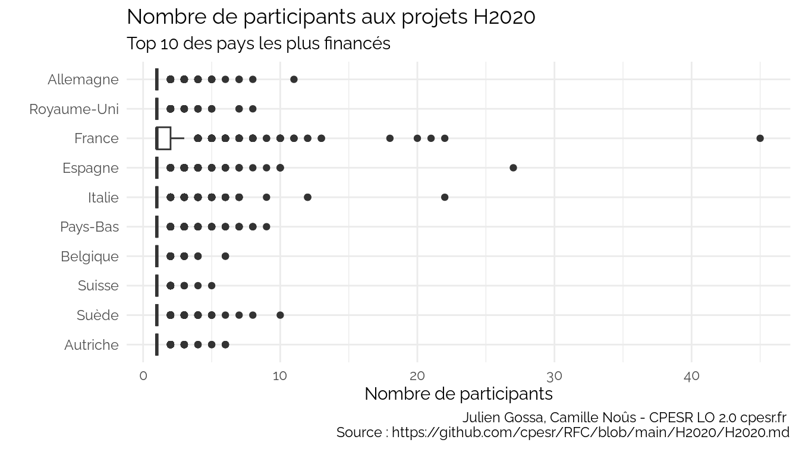

H2020
================

Source :
<https://data.enseignementsup-recherche.gouv.fr/explore/dataset/appels-a-projets-horizon-2020-projets-retenus-et-participants-identifies0/export/>

    ##  [1] "project_type"          "participation_id"      "participant_id"       
    ##  [4] "name"                  "acronym"               "role"                 
    ##  [7] "participates_as"       "co_participant"        "participant_type_code"
    ## [10] "participant_type_name" "funding"               "country_code"         
    ## [13] "country_name"          "country_level_1"       "com_code"             
    ## [16] "com_nom"               "uucr_id"               "uucr_nom"             
    ## [19] "dep_id"                "dep_nom"               "dep_num_nom"          
    ## [22] "aca_id"                "aca_nom"               "reg_id"               
    ## [25] "reg_nom"               "latitude"              "longitude"            
    ## [28] "participant_id_type"   "project_id"            "acronym_projet"       
    ## [31] "name_project"          "start_date"            "end_date"             
    ## [34] "budget_financed"       "duration"              "keywords_en"          
    ## [37] "source_url"            "call_code"             "topic_code"           
    ## [40] "programme_abbr"        "programme_lib"

## Total des financements par pays

Voir les données

| country_name | funding |
|:-------------|--------:|
| Allemagne    |  998.95 |
| Royaume-Uni  |  779.50 |
| France       |  733.09 |
| Espagne      |  630.06 |
| Italie       |  558.16 |
| Pays-Bas     |  532.54 |

## Total des financements par type de participant

<table>
<thead>
<tr>
<th style="text-align:left;">
participant_type_name
</th>
<th style="text-align:right;">
funding
</th>
</tr>
</thead>
<tbody>
<tr>
<td style="text-align:left;">
Enseignement supérieur ou secondaire
</td>
<td style="text-align:right;">
2664.65
</td>
</tr>
<tr>
<td style="text-align:left;">
Organismes privés (hors enseignement)
</td>
<td style="text-align:right;">
1889.70
</td>
</tr>
<tr>
<td style="text-align:left;">
Recherche
</td>
<td style="text-align:right;">
1713.03
</td>
</tr>
<tr>
<td style="text-align:left;">
Autres
</td>
<td style="text-align:right;">
256.75
</td>
</tr>
<tr>
<td style="text-align:left;">
Organismes publics (hors enseignement & recherche)
</td>
<td style="text-align:right;">
220.71
</td>
</tr>
<tr>
<td style="text-align:left;">
</td>
<td style="text-align:right;">
0.00
</td>
</tr>
</tbody>
</table>

## Total des financements par type de participant et par pays.

Voir les données

    ## `summarise()` has grouped output by 'country_name'. You can override using the
    ## `.groups` argument.

| country_name | participant_type_name                              | funding |
|:-------------|:---------------------------------------------------|--------:|
| Allemagne    | Organismes publics (hors enseignement & recherche) |   14.92 |
| Allemagne    | Autres                                             |   23.48 |
| Allemagne    | Organismes privés (hors enseignement)              |  269.28 |
| Allemagne    | Recherche                                          |  335.70 |
| Allemagne    | Enseignement supérieur ou secondaire               |  355.57 |
| Royaume-Uni  | Organismes publics (hors enseignement & recherche) |   18.11 |

    ## `summarise()` has grouped output by 'country_name'. You can override using the
    ## `.groups` argument.

## Total des financements par type de participant et par année

    ## `summarise()` has grouped output by 'start_year'. You can override using the
    ## `.groups` argument.

## Comparaisons

    ## `summarise()` has grouped output by 'country_name'. You can override using the
    ## `.groups` argument.

## Nombre de partenaires

    ## `summarise()` has grouped output by 'country_name'. You can override using the
    ## `.groups` argument.

<table>
<thead>
<tr>
<th style="text-align:left;">
country_name
</th>
<th style="text-align:right;">
moyenne
</th>
</tr>
</thead>
<tbody>
<tr>
<td style="text-align:left;">
France
</td>
<td style="text-align:right;">
1.557246
</td>
</tr>
<tr>
<td style="text-align:left;">
Espagne
</td>
<td style="text-align:right;">
1.079754
</td>
</tr>
<tr>
<td style="text-align:left;">
Italie
</td>
<td style="text-align:right;">
1.076721
</td>
</tr>
<tr>
<td style="text-align:left;">
Suède
</td>
<td style="text-align:right;">
1.052188
</td>
</tr>
<tr>
<td style="text-align:left;">
Pays-Bas
</td>
<td style="text-align:right;">
1.044253
</td>
</tr>
<tr>
<td style="text-align:left;">
Autriche
</td>
<td style="text-align:right;">
1.032960
</td>
</tr>
<tr>
<td style="text-align:left;">
Allemagne
</td>
<td style="text-align:right;">
1.025739
</td>
</tr>
<tr>
<td style="text-align:left;">
Belgique
</td>
<td style="text-align:right;">
1.023895
</td>
</tr>
<tr>
<td style="text-align:left;">
Royaume-Uni
</td>
<td style="text-align:right;">
1.013691
</td>
</tr>
<tr>
<td style="text-align:left;">
Suisse
</td>
<td style="text-align:right;">
1.012790
</td>
</tr>
</tbody>
</table>

## Participation univ

    ## `summarise()` has grouped output by 'country_name', 'participation_id',
    ## 'nb_participants'. You can override using the `.groups` argument.
    ## `summarise()` has grouped output by 'country_name', 'multi_participants'. You
    ## can override using the `.groups` argument.

<table>
<thead>
<tr>
<th style="text-align:left;">
country_name
</th>
<th style="text-align:left;">
multi_participants
</th>
<th style="text-align:right;">
nb_participations
</th>
<th style="text-align:right;">
ratio
</th>
</tr>
</thead>
<tbody>
<tr>
<td style="text-align:left;">
Autriche
</td>
<td style="text-align:left;">
mono participant
</td>
<td style="text-align:right;">
1401
</td>
<td style="text-align:right;">
0.2982120
</td>
</tr>
<tr>
<td style="text-align:left;">
Autriche
</td>
<td style="text-align:left;">
multi participants
</td>
<td style="text-align:right;">
32
</td>
<td style="text-align:right;">
0.2539683
</td>
</tr>
<tr>
<td style="text-align:left;">
Suède
</td>
<td style="text-align:left;">
mono participant
</td>
<td style="text-align:right;">
2224
</td>
<td style="text-align:right;">
0.4725882
</td>
</tr>
<tr>
<td style="text-align:left;">
Suède
</td>
<td style="text-align:left;">
multi participants
</td>
<td style="text-align:right;">
71
</td>
<td style="text-align:right;">
0.4409938
</td>
</tr>
<tr>
<td style="text-align:left;">
Suisse
</td>
<td style="text-align:left;">
mono participant
</td>
<td style="text-align:right;">
2261
</td>
<td style="text-align:right;">
0.4569523
</td>
</tr>
<tr>
<td style="text-align:left;">
Suisse
</td>
<td style="text-align:left;">
multi participants
</td>
<td style="text-align:right;">
33
</td>
<td style="text-align:right;">
0.5892857
</td>
</tr>
<tr>
<td style="text-align:left;">
Belgique
</td>
<td style="text-align:left;">
mono participant
</td>
<td style="text-align:right;">
1930
</td>
<td style="text-align:right;">
0.2437176
</td>
</tr>
<tr>
<td style="text-align:left;">
Belgique
</td>
<td style="text-align:left;">
multi participants
</td>
<td style="text-align:right;">
27
</td>
<td style="text-align:right;">
0.1708861
</td>
</tr>
<tr>
<td style="text-align:left;">
Pays-Bas
</td>
<td style="text-align:left;">
mono participant
</td>
<td style="text-align:right;">
4083
</td>
<td style="text-align:right;">
0.4023453
</td>
</tr>
<tr>
<td style="text-align:left;">
Pays-Bas
</td>
<td style="text-align:left;">
multi participants
</td>
<td style="text-align:right;">
59
</td>
<td style="text-align:right;">
0.2020548
</td>
</tr>
<tr>
<td style="text-align:left;">
Italie
</td>
<td style="text-align:left;">
mono participant
</td>
<td style="text-align:right;">
4460
</td>
<td style="text-align:right;">
0.3017387
</td>
</tr>
<tr>
<td style="text-align:left;">
Italie
</td>
<td style="text-align:left;">
multi participants
</td>
<td style="text-align:right;">
293
</td>
<td style="text-align:right;">
0.3513189
</td>
</tr>
<tr>
<td style="text-align:left;">
Espagne
</td>
<td style="text-align:left;">
mono participant
</td>
<td style="text-align:right;">
3314
</td>
<td style="text-align:right;">
0.2050108
</td>
</tr>
<tr>
<td style="text-align:left;">
Espagne
</td>
<td style="text-align:left;">
multi participants
</td>
<td style="text-align:right;">
191
</td>
<td style="text-align:right;">
0.1840077
</td>
</tr>
<tr>
<td style="text-align:left;">
France
</td>
<td style="text-align:left;">
mono participant
</td>
<td style="text-align:right;">
2092
</td>
<td style="text-align:right;">
0.1589424
</td>
</tr>
<tr>
<td style="text-align:left;">
France
</td>
<td style="text-align:left;">
multi participants
</td>
<td style="text-align:right;">
953
</td>
<td style="text-align:right;">
0.6378849
</td>
</tr>
<tr>
<td style="text-align:left;">
Royaume-Uni
</td>
<td style="text-align:left;">
mono participant
</td>
<td style="text-align:right;">
9748
</td>
<td style="text-align:right;">
0.5841673
</td>
</tr>
<tr>
<td style="text-align:left;">
Royaume-Uni
</td>
<td style="text-align:left;">
multi participants
</td>
<td style="text-align:right;">
92
</td>
<td style="text-align:right;">
0.4946237
</td>
</tr>
<tr>
<td style="text-align:left;">
Allemagne
</td>
<td style="text-align:left;">
mono participant
</td>
<td style="text-align:right;">
5995
</td>
<td style="text-align:right;">
0.3078780
</td>
</tr>
<tr>
<td style="text-align:left;">
Allemagne
</td>
<td style="text-align:left;">
multi participants
</td>
<td style="text-align:right;">
97
</td>
<td style="text-align:right;">
0.2545932
</td>
</tr>
</tbody>
</table>

## Participation privé

    ## `summarise()` has grouped output by 'country_name', 'multi_participants'. You
    ## can override using the `.groups` argument.

<table>
<thead>
<tr>
<th style="text-align:left;">
country_name
</th>
<th style="text-align:left;">
multi_participants
</th>
<th style="text-align:right;">
nb_participations
</th>
<th style="text-align:right;">
ratio
</th>
</tr>
</thead>
<tbody>
<tr>
<td style="text-align:left;">
Autriche
</td>
<td style="text-align:left;">
mono participant
</td>
<td style="text-align:right;">
1708
</td>
<td style="text-align:right;">
0.3635590
</td>
</tr>
<tr>
<td style="text-align:left;">
Autriche
</td>
<td style="text-align:left;">
multi participants
</td>
<td style="text-align:right;">
83
</td>
<td style="text-align:right;">
0.6587302
</td>
</tr>
<tr>
<td style="text-align:left;">
Suède
</td>
<td style="text-align:left;">
mono participant
</td>
<td style="text-align:right;">
1557
</td>
<td style="text-align:right;">
0.3308542
</td>
</tr>
<tr>
<td style="text-align:left;">
Suède
</td>
<td style="text-align:left;">
multi participants
</td>
<td style="text-align:right;">
72
</td>
<td style="text-align:right;">
0.4472050
</td>
</tr>
<tr>
<td style="text-align:left;">
Suisse
</td>
<td style="text-align:left;">
mono participant
</td>
<td style="text-align:right;">
1701
</td>
<td style="text-align:right;">
0.3437753
</td>
</tr>
<tr>
<td style="text-align:left;">
Suisse
</td>
<td style="text-align:left;">
multi participants
</td>
<td style="text-align:right;">
26
</td>
<td style="text-align:right;">
0.4642857
</td>
</tr>
<tr>
<td style="text-align:left;">
Belgique
</td>
<td style="text-align:left;">
mono participant
</td>
<td style="text-align:right;">
2341
</td>
<td style="text-align:right;">
0.2956181
</td>
</tr>
<tr>
<td style="text-align:left;">
Belgique
</td>
<td style="text-align:left;">
multi participants
</td>
<td style="text-align:right;">
83
</td>
<td style="text-align:right;">
0.5253165
</td>
</tr>
<tr>
<td style="text-align:left;">
Pays-Bas
</td>
<td style="text-align:left;">
mono participant
</td>
<td style="text-align:right;">
3294
</td>
<td style="text-align:right;">
0.3245960
</td>
</tr>
<tr>
<td style="text-align:left;">
Pays-Bas
</td>
<td style="text-align:left;">
multi participants
</td>
<td style="text-align:right;">
240
</td>
<td style="text-align:right;">
0.8219178
</td>
</tr>
<tr>
<td style="text-align:left;">
Italie
</td>
<td style="text-align:left;">
mono participant
</td>
<td style="text-align:right;">
5862
</td>
<td style="text-align:right;">
0.3965902
</td>
</tr>
<tr>
<td style="text-align:left;">
Italie
</td>
<td style="text-align:left;">
multi participants
</td>
<td style="text-align:right;">
481
</td>
<td style="text-align:right;">
0.5767386
</td>
</tr>
<tr>
<td style="text-align:left;">
Espagne
</td>
<td style="text-align:left;">
mono participant
</td>
<td style="text-align:right;">
6093
</td>
<td style="text-align:right;">
0.3769255
</td>
</tr>
<tr>
<td style="text-align:left;">
Espagne
</td>
<td style="text-align:left;">
multi participants
</td>
<td style="text-align:right;">
589
</td>
<td style="text-align:right;">
0.5674374
</td>
</tr>
<tr>
<td style="text-align:left;">
France
</td>
<td style="text-align:left;">
mono participant
</td>
<td style="text-align:right;">
5555
</td>
<td style="text-align:right;">
0.4220483
</td>
</tr>
<tr>
<td style="text-align:left;">
France
</td>
<td style="text-align:left;">
multi participants
</td>
<td style="text-align:right;">
372
</td>
<td style="text-align:right;">
0.2489960
</td>
</tr>
<tr>
<td style="text-align:left;">
Royaume-Uni
</td>
<td style="text-align:left;">
mono participant
</td>
<td style="text-align:right;">
4529
</td>
<td style="text-align:right;">
0.2714089
</td>
</tr>
<tr>
<td style="text-align:left;">
Royaume-Uni
</td>
<td style="text-align:left;">
multi participants
</td>
<td style="text-align:right;">
84
</td>
<td style="text-align:right;">
0.4516129
</td>
</tr>
<tr>
<td style="text-align:left;">
Allemagne
</td>
<td style="text-align:left;">
mono participant
</td>
<td style="text-align:right;">
6980
</td>
<td style="text-align:right;">
0.3584634
</td>
</tr>
<tr>
<td style="text-align:left;">
Allemagne
</td>
<td style="text-align:left;">
multi participants
</td>
<td style="text-align:right;">
279
</td>
<td style="text-align:right;">
0.7322835
</td>
</tr>
</tbody>
</table>

## Fundings

    ## `summarise()` has grouped output by 'country_name', 'participation_id'. You can
    ## override using the `.groups` argument.
    ## `summarise()` has grouped output by 'country_name'. You can override using the
    ## `.groups` argument.

<table>
<thead>
<tr>
<th style="text-align:left;">
country_name
</th>
<th style="text-align:left;">
participant_type_code
</th>
<th style="text-align:right;">
funding_moyen
</th>
<th style="text-align:left;">
part_moyenne
</th>
</tr>
</thead>
<tbody>
<tr>
<td style="text-align:left;">
Autriche
</td>
<td style="text-align:left;">
Autres
</td>
<td style="text-align:right;">
165770.68
</td>
<td style="text-align:left;">
50.38%
</td>
</tr>
<tr>
<td style="text-align:left;">
Autriche
</td>
<td style="text-align:left;">
Ens. supérieur
</td>
<td style="text-align:right;">
475573.04
</td>
<td style="text-align:left;">
49.82%
</td>
</tr>
<tr>
<td style="text-align:left;">
Autriche
</td>
<td style="text-align:left;">
Org. privés
</td>
<td style="text-align:right;">
111075.33
</td>
<td style="text-align:left;">
28.91%
</td>
</tr>
<tr>
<td style="text-align:left;">
Autriche
</td>
<td style="text-align:left;">
Org. publics
</td>
<td style="text-align:right;">
386079.01
</td>
<td style="text-align:left;">
37.15%
</td>
</tr>
<tr>
<td style="text-align:left;">
Autriche
</td>
<td style="text-align:left;">
Recherche
</td>
<td style="text-align:right;">
381855.07
</td>
<td style="text-align:left;">
53.01%
</td>
</tr>
<tr>
<td style="text-align:left;">
Suède
</td>
<td style="text-align:left;">
Autres
</td>
<td style="text-align:right;">
115619.54
</td>
<td style="text-align:left;">
32.6%
</td>
</tr>
<tr>
<td style="text-align:left;">
Suède
</td>
<td style="text-align:left;">
Ens. supérieur
</td>
<td style="text-align:right;">
721978.56
</td>
<td style="text-align:left;">
60.9%
</td>
</tr>
<tr>
<td style="text-align:left;">
Suède
</td>
<td style="text-align:left;">
Org. privés
</td>
<td style="text-align:right;">
135234.70
</td>
<td style="text-align:left;">
30.2%
</td>
</tr>
<tr>
<td style="text-align:left;">
Suède
</td>
<td style="text-align:left;">
Org. publics
</td>
<td style="text-align:right;">
324907.59
</td>
<td style="text-align:left;">
33.9%
</td>
</tr>
<tr>
<td style="text-align:left;">
Suède
</td>
<td style="text-align:left;">
Recherche
</td>
<td style="text-align:right;">
217321.11
</td>
<td style="text-align:left;">
37.6%
</td>
</tr>
<tr>
<td style="text-align:left;">
Suisse
</td>
<td style="text-align:left;">
Autres
</td>
<td style="text-align:right;">
73750.00
</td>
<td style="text-align:left;">
26.7%
</td>
</tr>
<tr>
<td style="text-align:left;">
Suisse
</td>
<td style="text-align:left;">
Ens. supérieur
</td>
<td style="text-align:right;">
1664121.16
</td>
<td style="text-align:left;">
38.4%
</td>
</tr>
<tr>
<td style="text-align:left;">
Suisse
</td>
<td style="text-align:left;">
Org. privés
</td>
<td style="text-align:right;">
197179.74
</td>
<td style="text-align:left;">
14.0%
</td>
</tr>
<tr>
<td style="text-align:left;">
Suisse
</td>
<td style="text-align:left;">
Org. publics
</td>
<td style="text-align:right;">
718181.93
</td>
<td style="text-align:left;">
73.8%
</td>
</tr>
<tr>
<td style="text-align:left;">
Suisse
</td>
<td style="text-align:left;">
Recherche
</td>
<td style="text-align:right;">
773299.13
</td>
<td style="text-align:left;">
69.2%
</td>
</tr>
<tr>
<td style="text-align:left;">
Belgique
</td>
<td style="text-align:left;">
Autres
</td>
<td style="text-align:right;">
187644.20
</td>
<td style="text-align:left;">
55.8%
</td>
</tr>
<tr>
<td style="text-align:left;">
Belgique
</td>
<td style="text-align:left;">
Ens. supérieur
</td>
<td style="text-align:right;">
1072064.41
</td>
<td style="text-align:left;">
57.8%
</td>
</tr>
<tr>
<td style="text-align:left;">
Belgique
</td>
<td style="text-align:left;">
Org. privés
</td>
<td style="text-align:right;">
203880.86
</td>
<td style="text-align:left;">
39.6%
</td>
</tr>
<tr>
<td style="text-align:left;">
Belgique
</td>
<td style="text-align:left;">
Org. publics
</td>
<td style="text-align:right;">
149381.15
</td>
<td style="text-align:left;">
37.4%
</td>
</tr>
<tr>
<td style="text-align:left;">
Belgique
</td>
<td style="text-align:left;">
Recherche
</td>
<td style="text-align:right;">
632218.58
</td>
<td style="text-align:left;">
45.0%
</td>
</tr>
<tr>
<td style="text-align:left;">
Pays-Bas
</td>
<td style="text-align:left;">
Autres
</td>
<td style="text-align:right;">
516995.66
</td>
<td style="text-align:left;">
42.1%
</td>
</tr>
<tr>
<td style="text-align:left;">
Pays-Bas
</td>
<td style="text-align:left;">
Ens. supérieur
</td>
<td style="text-align:right;">
391342.68
</td>
<td style="text-align:left;">
50.5%
</td>
</tr>
<tr>
<td style="text-align:left;">
Pays-Bas
</td>
<td style="text-align:left;">
Org. privés
</td>
<td style="text-align:right;">
164361.79
</td>
<td style="text-align:left;">
25.0%
</td>
</tr>
<tr>
<td style="text-align:left;">
Pays-Bas
</td>
<td style="text-align:left;">
Org. publics
</td>
<td style="text-align:right;">
329029.79
</td>
<td style="text-align:left;">
26.3%
</td>
</tr>
<tr>
<td style="text-align:left;">
Pays-Bas
</td>
<td style="text-align:left;">
Recherche
</td>
<td style="text-align:right;">
1029338.75
</td>
<td style="text-align:left;">
51.6%
</td>
</tr>
<tr>
<td style="text-align:left;">
Italie
</td>
<td style="text-align:left;">
Autres
</td>
<td style="text-align:right;">
126939.27
</td>
<td style="text-align:left;">
36.8%
</td>
</tr>
<tr>
<td style="text-align:left;">
Italie
</td>
<td style="text-align:left;">
Ens. supérieur
</td>
<td style="text-align:right;">
377847.93
</td>
<td style="text-align:left;">
55.8%
</td>
</tr>
<tr>
<td style="text-align:left;">
Italie
</td>
<td style="text-align:left;">
Org. privés
</td>
<td style="text-align:right;">
230750.72
</td>
<td style="text-align:left;">
45.8%
</td>
</tr>
<tr>
<td style="text-align:left;">
Italie
</td>
<td style="text-align:left;">
Org. publics
</td>
<td style="text-align:right;">
351925.20
</td>
<td style="text-align:left;">
47.8%
</td>
</tr>
<tr>
<td style="text-align:left;">
Italie
</td>
<td style="text-align:left;">
Recherche
</td>
<td style="text-align:right;">
592690.21
</td>
<td style="text-align:left;">
42.9%
</td>
</tr>
<tr>
<td style="text-align:left;">
Espagne
</td>
<td style="text-align:left;">
Autres
</td>
<td style="text-align:right;">
168890.75
</td>
<td style="text-align:left;">
39.01%
</td>
</tr>
<tr>
<td style="text-align:left;">
Espagne
</td>
<td style="text-align:left;">
Ens. supérieur
</td>
<td style="text-align:right;">
279078.69
</td>
<td style="text-align:left;">
38.78%
</td>
</tr>
<tr>
<td style="text-align:left;">
Espagne
</td>
<td style="text-align:left;">
Org. privés
</td>
<td style="text-align:right;">
275020.77
</td>
<td style="text-align:left;">
49.02%
</td>
</tr>
<tr>
<td style="text-align:left;">
Espagne
</td>
<td style="text-align:left;">
Org. publics
</td>
<td style="text-align:right;">
274740.74
</td>
<td style="text-align:left;">
46.69%
</td>
</tr>
<tr>
<td style="text-align:left;">
Espagne
</td>
<td style="text-align:left;">
Recherche
</td>
<td style="text-align:right;">
345086.06
</td>
<td style="text-align:left;">
49.83%
</td>
</tr>
<tr>
<td style="text-align:left;">
France
</td>
<td style="text-align:left;">
Autres
</td>
<td style="text-align:right;">
127129.17
</td>
<td style="text-align:left;">
37.5%
</td>
</tr>
<tr>
<td style="text-align:left;">
France
</td>
<td style="text-align:left;">
Ens. supérieur
</td>
<td style="text-align:right;">
331710.26
</td>
<td style="text-align:left;">
40.4%
</td>
</tr>
<tr>
<td style="text-align:left;">
France
</td>
<td style="text-align:left;">
Org. privés
</td>
<td style="text-align:right;">
156873.68
</td>
<td style="text-align:left;">
33.7%
</td>
</tr>
<tr>
<td style="text-align:left;">
France
</td>
<td style="text-align:left;">
Org. publics
</td>
<td style="text-align:right;">
363006.93
</td>
<td style="text-align:left;">
38.8%
</td>
</tr>
<tr>
<td style="text-align:left;">
France
</td>
<td style="text-align:left;">
Recherche
</td>
<td style="text-align:right;">
662152.61
</td>
<td style="text-align:left;">
58.5%
</td>
</tr>
<tr>
<td style="text-align:left;">
Royaume-Uni
</td>
<td style="text-align:left;">
Autres
</td>
<td style="text-align:right;">
494098.12
</td>
<td style="text-align:left;">
54.5%
</td>
</tr>
<tr>
<td style="text-align:left;">
Royaume-Uni
</td>
<td style="text-align:left;">
Ens. supérieur
</td>
<td style="text-align:right;">
634616.53
</td>
<td style="text-align:left;">
67.7%
</td>
</tr>
<tr>
<td style="text-align:left;">
Royaume-Uni
</td>
<td style="text-align:left;">
Org. privés
</td>
<td style="text-align:right;">
42827.16
</td>
<td style="text-align:left;">
17.2%
</td>
</tr>
<tr>
<td style="text-align:left;">
Royaume-Uni
</td>
<td style="text-align:left;">
Org. publics
</td>
<td style="text-align:right;">
164495.86
</td>
<td style="text-align:left;">
22.8%
</td>
</tr>
<tr>
<td style="text-align:left;">
Royaume-Uni
</td>
<td style="text-align:left;">
Recherche
</td>
<td style="text-align:right;">
315769.01
</td>
<td style="text-align:left;">
37.8%
</td>
</tr>
<tr>
<td style="text-align:left;">
Allemagne
</td>
<td style="text-align:left;">
Autres
</td>
<td style="text-align:right;">
231316.28
</td>
<td style="text-align:left;">
54.4%
</td>
</tr>
<tr>
<td style="text-align:left;">
Allemagne
</td>
<td style="text-align:left;">
Ens. supérieur
</td>
<td style="text-align:right;">
324296.69
</td>
<td style="text-align:left;">
44.1%
</td>
</tr>
<tr>
<td style="text-align:left;">
Allemagne
</td>
<td style="text-align:left;">
Org. privés
</td>
<td style="text-align:right;">
240125.09
</td>
<td style="text-align:left;">
28.3%
</td>
</tr>
<tr>
<td style="text-align:left;">
Allemagne
</td>
<td style="text-align:left;">
Org. publics
</td>
<td style="text-align:right;">
664272.99
</td>
<td style="text-align:left;">
49.0%
</td>
</tr>
<tr>
<td style="text-align:left;">
Allemagne
</td>
<td style="text-align:left;">
Recherche
</td>
<td style="text-align:right;">
2751331.14
</td>
<td style="text-align:left;">
56.0%
</td>
</tr>
</tbody>
</table>

## Retour sur investissement

<https://commission.europa.eu/strategy-and-policy/eu-budget/long-term-eu-budget/2014-2020/spending-and-revenue_en>

    ## New names:
    ## • `` -> `...2`

    ## Warning in lapply(val_cols, values_transform[[value]]): NAs introduits lors de
    ## la conversion automatique

    ## New names:
    ## • `` -> `...2`

    ## Warning in lapply(val_cols, values_transform[[value]]): NAs introduits lors de
    ## la conversion automatique

    ## New names:
    ## • `` -> `...2`

    ## Warning in lapply(val_cols, values_transform[[value]]): NAs introduits lors de
    ## la conversion automatique

    ## New names:
    ## • `` -> `...2`

    ## Warning in lapply(val_cols, values_transform[[value]]): NAs introduits lors de
    ## la conversion automatique

    ## New names:
    ## • `` -> `...2`

    ## Warning in lapply(val_cols, values_transform[[value]]): NAs introduits lors de
    ## la conversion automatique

    ## New names:
    ## • `` -> `...2`

    ## Warning in lapply(val_cols, values_transform[[value]]): NAs introduits lors de
    ## la conversion automatique

    ## New names:
    ## • `` -> `...2`

    ## Warning in lapply(val_cols, values_transform[[value]]): NAs introduits lors de
    ## la conversion automatique

    ## New names:
    ## • `` -> `...2`

    ## Warning in lapply(val_cols, values_transform[[value]]): NAs introduits lors de
    ## la conversion automatique

    ## Warning in lapply(val_cols, values_transform[[value]]): NAs introduits lors de
    ## la conversion automatique

    ## New names:
    ## • `` -> `...2`

    ## Warning in lapply(val_cols, values_transform[[value]]): NAs introduits lors de
    ## la conversion automatique

    ## Warning in lapply(val_cols, values_transform[[value]]): NAs introduits lors de
    ## la conversion automatique

    ## New names:
    ## • `` -> `...2`

    ## Warning in lapply(val_cols, values_transform[[value]]): NAs introduits lors de
    ## la conversion automatique

    ## Warning in lapply(val_cols, values_transform[[value]]): NAs introduits lors de
    ## la conversion automatique

    ## New names:
    ## • `` -> `...2`

    ## Warning in lapply(val_cols, values_transform[[value]]): NAs introduits lors de
    ## la conversion automatique

    ## Warning in lapply(val_cols, values_transform[[value]]): NAs introduits lors de
    ## la conversion automatique

    ## New names:
    ## • `` -> `...2`

    ## Warning in lapply(val_cols, values_transform[[value]]): NAs introduits lors de
    ## la conversion automatique

    ## Warning in lapply(val_cols, values_transform[[value]]): NAs introduits lors de
    ## la conversion automatique

    ## New names:
    ## • `` -> `...2`

    ## Warning in lapply(val_cols, values_transform[[value]]): NAs introduits lors de
    ## la conversion automatique

    ## Warning in lapply(val_cols, values_transform[[value]]): NAs introduits lors de
    ## la conversion automatique

    ## New names:
    ## • `` -> `...2`

    ## Warning in lapply(val_cols, values_transform[[value]]): NAs introduits lors de
    ## la conversion automatique

    ## Warning in lapply(val_cols, values_transform[[value]]): NAs introduits lors de
    ## la conversion automatique

    ## Joining with `by = join_by(Year, Country)`

    ## Warning: Using `size` aesthetic for lines was deprecated in ggplot2 3.4.0.
    ## ℹ Please use `linewidth` instead.
    ## This warning is displayed once every 8 hours.
    ## Call `lifecycle::last_lifecycle_warnings()` to see where this warning was
    ## generated.

