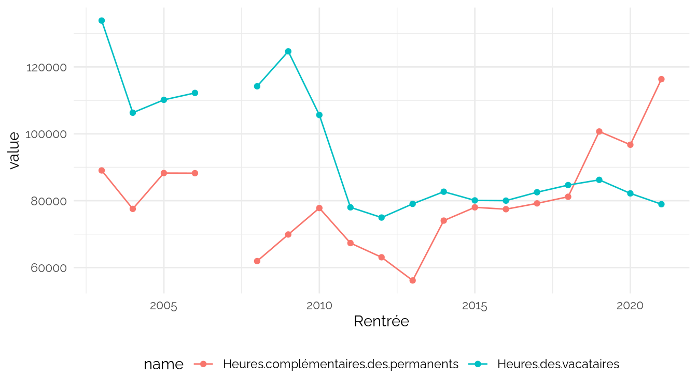
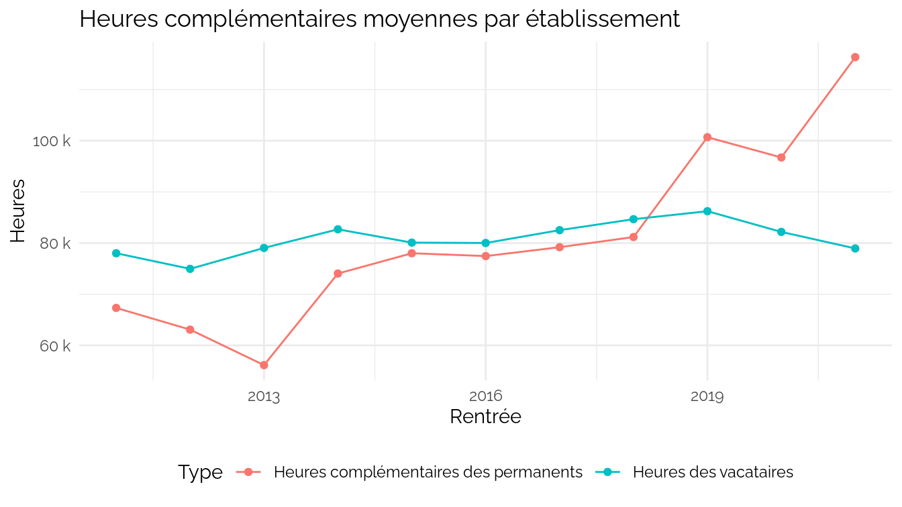
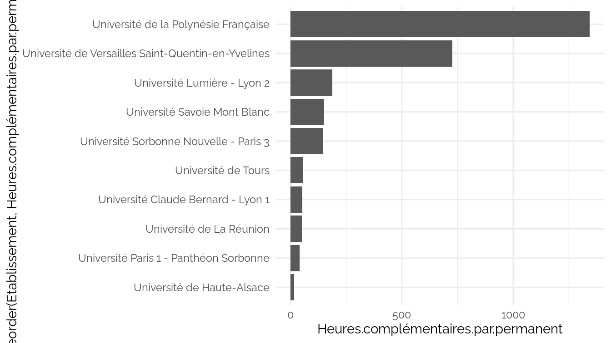
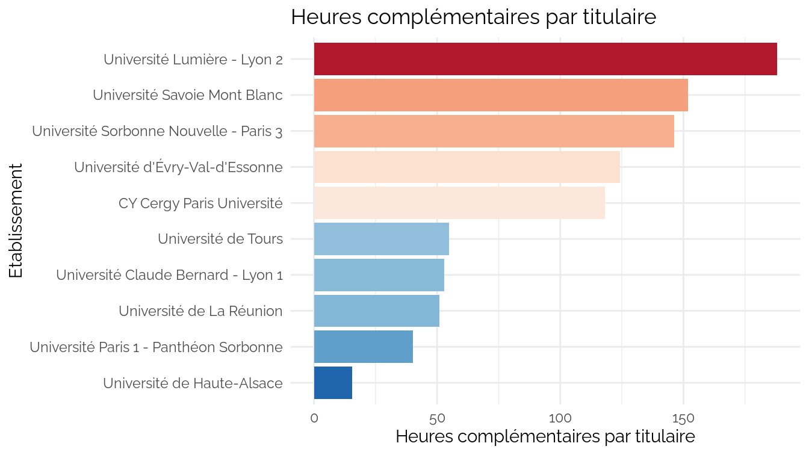

CPESR
================
CPESR
2024-04-09

## Données

- url source

<!-- -->

    ## [1] "Code.UAI"                             
    ## [2] "Etablissement"                        
    ## [3] "Rentrée"                              
    ## [4] "Charge.totale.d.enseignement"         
    ## [5] "Heures.complémentaires"               
    ## [6] "Heures.complémentaires.des.permanents"
    ## [7] "Heures.des.vacataires"                
    ## [8] "Heures.complémentaires.payables"

## Explorations

Nombre de rentrées par établissement

| Etablissement                                      | Code.UAI | nb_rentrée | nb_doublons |
|:---------------------------------------------------|:---------|-----------:|------------:|
| Université Toulouse Capitole                       | 0313124C |         20 |           8 |
| Nantes Université                                  | 0442953W |         18 |           4 |
| Université Claude Bernard - Lyon 1                 | 0691774D |         16 |           7 |
| Université Jean Monnet                             | 0421095M |         13 |           1 |
| Université de Strasbourg                           | 0673021V |         12 |           0 |
| Université Paul-Valéry - Montpellier 3             | 0341089Z |         11 |           1 |
| Université de La Réunion                           | 9740478B |          9 |           1 |
| Université Jean Moulin - Lyon 3                    | 0692437Z |          9 |           0 |
| Avignon Université                                 | 0840685N |          9 |           0 |
| Université d’Orléans                               | 0450855K |          8 |           0 |
| Université Paris-Est Créteil                       | 0941111X |          8 |           0 |
| Université de Tours                                | 0370800U |          8 |           3 |
| Université de Montpellier                          | 0342490X |          7 |           0 |
| Université de Haute-Alsace                         | 0681166Y |          7 |           0 |
| Université de Lille                                | 0597239Y |          7 |           1 |
| Université Savoie Mont Blanc                       | 0730858L |          7 |           0 |
| Université Lumière - Lyon 2                        | 0691775E |          7 |           0 |
| Université Polytechnique Hauts-de-France           | 0597132G |          6 |           0 |
| Université d’Évry-Val-d’Essonne                    | 0911975C |          6 |           0 |
| Université de Lorraine                             | 0542493S |          6 |           0 |
| Université de Toulon                               | 0830766G |          6 |           0 |
| Université d’Artois                                | 0623957P |          6 |           0 |
| Université Toulouse - Jean Jaurès                  | 0311383K |          5 |           0 |
| Université Gustave Eiffel                          | 0772894C |          5 |           1 |
| Université de Bourgogne                            | 0211237F |          5 |           0 |
| Université de Limoges                              | 0870669E |          5 |           0 |
| Université de Pau et des Pays de l’Adour           | 0640251A |          5 |           1 |
| Université Paris 1 - Panthéon Sorbonne             | 0751717J |          5 |           0 |
| Université d’Angers                                | 0490970N |          5 |           0 |
| Le Mans Université                                 | 0720916E |          4 |           0 |
| Université de la Polynésie Française               | 9840349G |          4 |           0 |
| Université Bretagne Sud                            | 0561718N |          4 |           0 |
| CY Cergy Paris Université                          | 0952259P |          4 |           0 |
| Université de Reims Champagne-Ardenne              | 0511296G |          4 |           0 |
| Université Paris-Est Marne-la-Vallée               | 0772710C |          4 |           0 |
| Université Paris Nanterre                          | 0921204J |          3 |           0 |
| Université Paris 8 - Vincennes - Saint-Denis       | 0931827F |          3 |           0 |
| Université Clermont Auvergne                       | 0632084Y |          3 |           0 |
| Université de Nîmes                                | 0301687W |          3 |           0 |
| Université de Bordeaux                             | 0333298F |          2 |           0 |
| Université Sorbonne Paris Nord                     | 0931238R |          2 |           0 |
| Université Le Havre Normandie                      | 0762762P |          2 |           0 |
| Université Sorbonne Nouvelle - Paris 3             | 0751719L |          2 |           0 |
| Université Paris Cité                              | 0755976N |          1 |           0 |
| Université de Caen Normandie                       | 0141408E |          1 |           0 |
| Université de Rennes                               | 0353074B |          1 |           0 |
| Université de Versailles Saint-Quentin-en-Yvelines | 0781944P |          1 |           0 |

En cas de doublons, on ne garde que la première ligne. Ajout des
effectifs étudiants et enseignants.

    ## Warning: remplacement de l'importation précédente 'ggthemes::theme_map' par
    ## 'cowplot::theme_map' lors du chargement de 'kpiESR'

    ## Joining with `by = join_by(Code.UAI)`
    ## Joining with `by = join_by(Rentrée, pid)`

Nb Etab par rentrée

| Rentrée | nb_etab |
|--------:|--------:|
|    2003 |       1 |
|    2004 |       1 |
|    2005 |       1 |
|    2006 |       1 |
|    2007 |       1 |
|    2008 |       3 |
|    2009 |       4 |
|    2010 |       6 |
|    2011 |       9 |
|    2012 |      11 |
|    2013 |      17 |
|    2014 |      25 |
|    2015 |      28 |
|    2016 |      34 |
|    2017 |      33 |
|    2018 |      34 |
|    2019 |      28 |
|    2020 |      15 |
|    2021 |       9 |

    ## Warning: Removed 2 rows containing missing values (`geom_point()`).

Données

| Rentrée | Heures.des.vacataires | Heures.complémentaires.des.permanents |
|--------:|----------------------:|--------------------------------------:|
|    2014 |              82689.89 |                              74048.18 |
|    2015 |              80087.90 |                              78013.50 |
|    2016 |              80020.25 |                              77458.04 |
|    2017 |              82526.35 |                              79198.23 |
|    2018 |              84671.00 |                              81180.04 |
|    2019 |              86230.70 |                             100694.45 |
|    2020 |              82182.85 |                              96732.77 |
|    2021 |              78951.43 |                             116343.00 |
|    2003 |             133868.00 |                              89048.00 |
|    2004 |             106310.00 |                              77556.00 |
|    2005 |             110159.00 |                              88264.00 |
|    2006 |             112224.00 |                              88227.00 |
|    2010 |             105637.00 |                              77802.60 |
|    2011 |              78014.00 |                              67328.29 |
|    2012 |              74961.71 |                              63082.86 |
|    2013 |              79052.42 |                              56146.91 |
|    2007 |                   NaN |                                   NaN |
|    2008 |             114215.00 |                              61935.50 |
|    2009 |             124661.00 |                              69898.50 |

    ## Warning: ggrepel: 18 unlabeled data points (too many overlaps). Consider
    ## increasing max.overlaps

