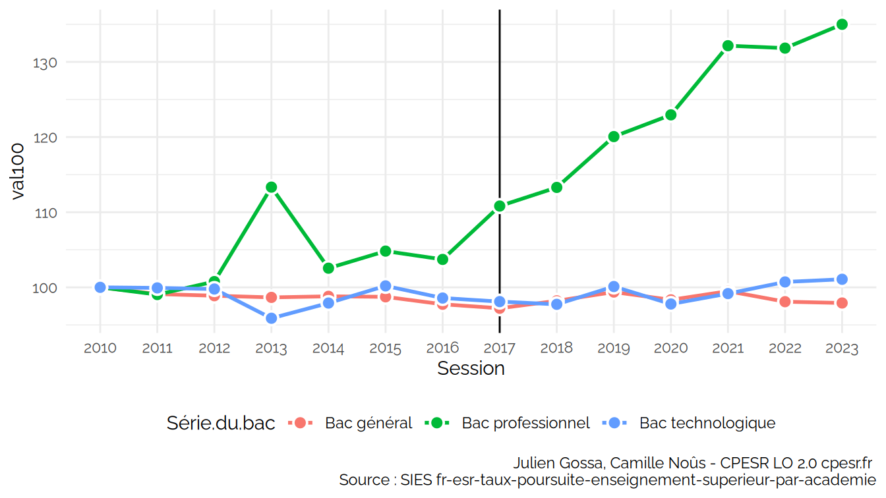
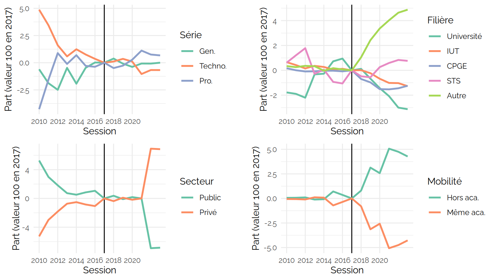
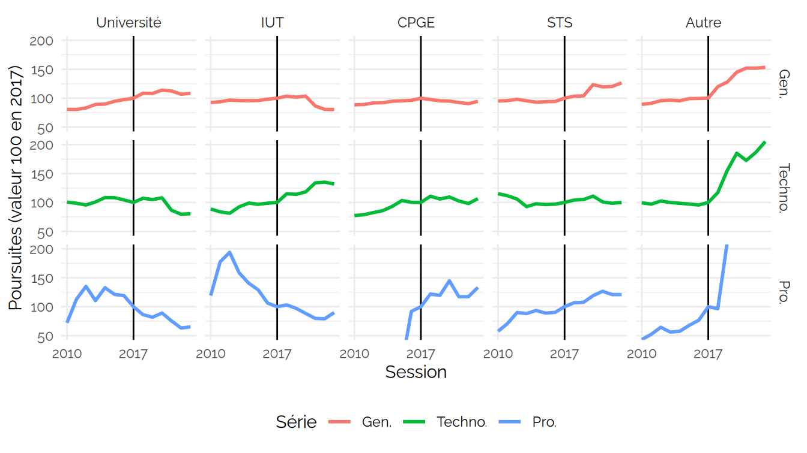
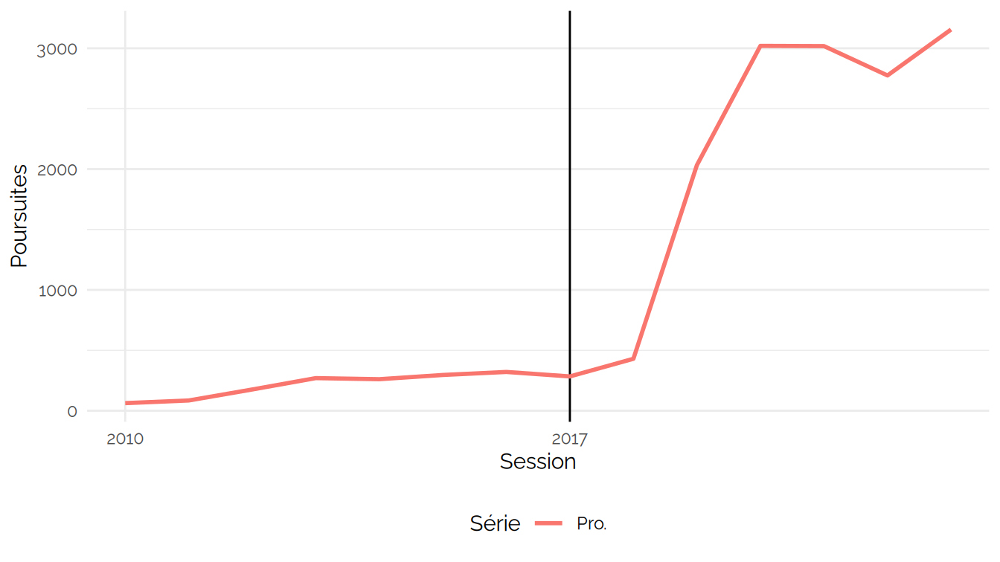
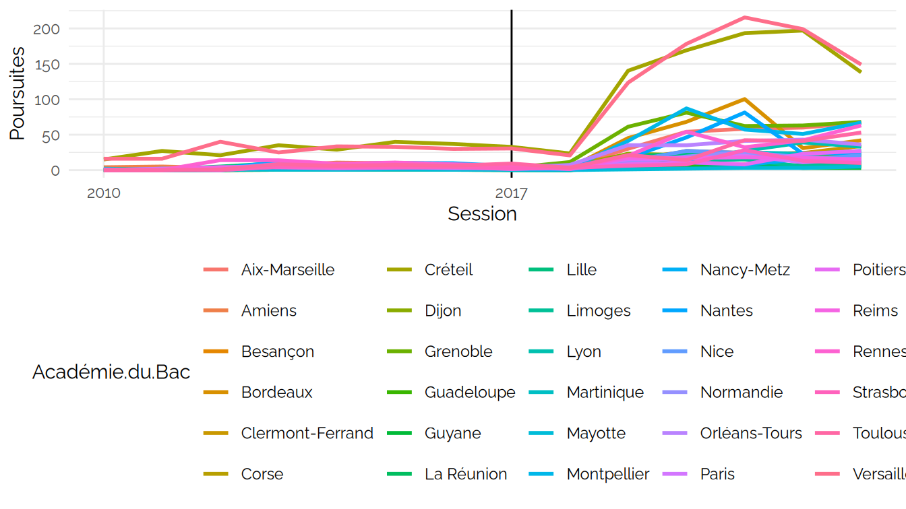
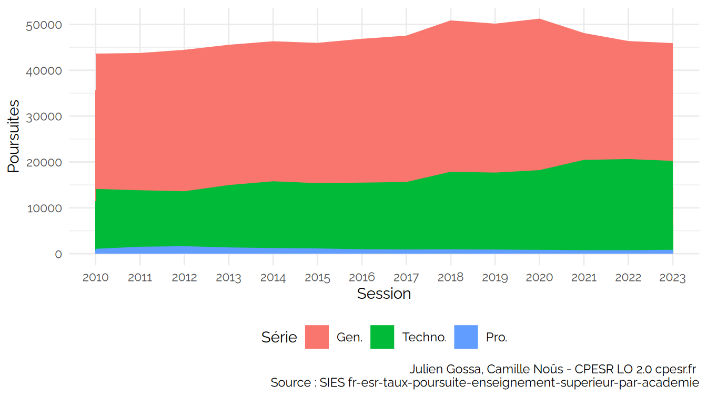
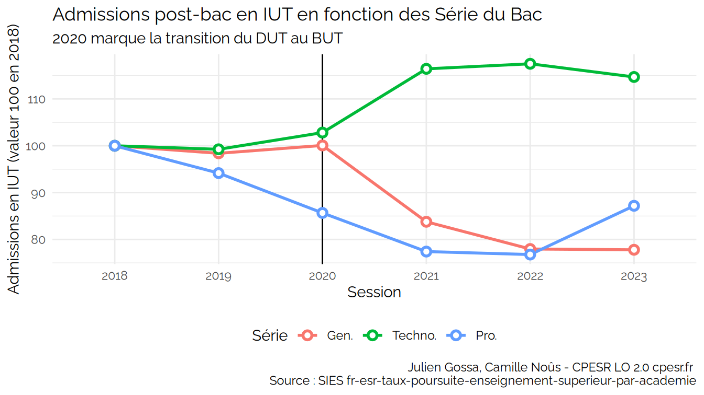

Poursuite d’étude
================

<https://data.enseignementsup-recherche.gouv.fr/explore/dataset/fr-esr-taux-poursuite-enseignement-superieur-par-academie/>

    ##  [1] "Session"                                                                                                                                           
    ##  [2] "Série.du.bac"                                                                                                                                      
    ##  [3] "Genre"                                                                                                                                             
    ##  [4] "Bacheliers"                                                                                                                                        
    ##  [5] "Néo.bacheliers.poursuivant.à.l.université..hors.IUT..dans.une.académie.différente.de.celle.d.obtention.de.leur.baccalauréat"                       
    ##  [6] "Néo.bacheliers.poursuivant.à.l.université..hors.IUT..dans.la.même.académie.que.celle.d.obtention.de.leur.baccalauréat"                             
    ##  [7] "Néo.bacheliers.poursuivant.en.IUT.dans.une.académie.différente.de.celle.d.obtention.de.leur.baccalauréat"                                          
    ##  [8] "Néo.bacheliers.poursuivant.en.IUT.dans.la.même.académie.que.celle.d.obtention.de.leur.baccalauréat"                                                
    ##  [9] "Néo.bacheliers.poursuivant.dans.une.CPGE.du.secteur.privé.dans.une.académie.différente.de.celle.d.obtention.de.leur.baccalauréat"                  
    ## [10] "Néo.bacheliers.poursuivant.dans.une.CPGE.du.secteur.privé.dans.la.même.académie.que.celle.d.obtention.de.leur.baccalauréat"                        
    ## [11] "Néo.bacheliers.poursuivant.dans.une.CPGE.du.secteur.public.dans.une.académie.différente.de.celle.d.obtention.de.leur.baccalauréat"                 
    ## [12] "Néo.bacheliers.poursuivant.dans.une.CPGE.du.secteur.public.dans.la.même.académie.que.celle.d.obtention.de.leur.baccalauréat"                       
    ## [13] "Néo.bacheliers.poursuivant.en.STS..secteur.non.renseigné..dans.une.académie.différente.de.celle.d.obtention.de.leur.baccalauréat"                  
    ## [14] "Néo.bacheliers.poursuivant.en.STS..secteur.non.renseigné..dans.la.même.académie.que.celle.d.obtention.de.leur.baccalauréat"                        
    ## [15] "Néo.bacheliers.poursuivant.en.STS.dans.le.secteur.privé.dans.une.académie.différente.de.celle.d.obtention.de.leur.baccalauréat"                    
    ## [16] "Néo.bacheliers.poursuivant.en.STS.dans.le.secteur.privé.dans.la.même.académie.que.celle.d.obtention.de.leur.baccalauréat"                          
    ## [17] "Néo.bacheliers.poursuivant.en.STS.dans.le.secteur.public.dans.une.académie.différente.de.celle.d.obtention.de.leur.baccalauréat"                   
    ## [18] "Néo.bacheliers.poursuivant.en.STS.dans.le.secteur.public.dans.la.même.académie.que.celle.d.obtention.de.leur.baccalauréat"                         
    ## [19] "Néo.bacheliers.poursuivant.dans.une.autre.formation..secteur.non.renseigné..dans.une.académie.différente.de.celle.d.obtention.de.leur.baccalauréat"
    ## [20] "Néo.bacheliers.poursuivant.dans.une.autre.formation..secteur.non.renseigné..dans.la.même.académie.que.celle.d.obtention.de.leur.baccalauréat"      
    ## [21] "Néo.bacheliers.poursuivant.dans.une.autre.formation.du.secteur.privé.dans.une.académie.différente.de.celle.d.obtention.de.leur.baccalauréat"       
    ## [22] "Néo.bacheliers.poursuivant.dans.une.autre.formation.du.secteur.privé.dans.la.même.académie.que.celle.d.obtention.de.leur.baccalauréat"             
    ## [23] "Néo.bacheliers.poursuivant.dans.une.autre.formation.du.secteur.public.dans.une.académie.différente.de.celle.d.obtention.de.leur.baccalauréat"      
    ## [24] "Néo.bacheliers.poursuivant.dans.une.autre.formation.du.secteur.public.dans.la.même.académie.que.celle.d.obtention.de.leur.baccalauréat"            
    ## [25] "Académie.du.Bac"                                                                                                                                   
    ## [26] "Code.académie.du.Bac"                                                                                                                              
    ## [27] "Code.Paysage.structure.de.l.académie"                                                                                                              
    ## [28] "Poursuivants"                                                                                                                                      
    ## [29] "Poursuivants.public"                                                                                                                               
    ## [30] "Poursuivants.privé"                                                                                                                                
    ## [31] "Poursuivants.nc"                                                                                                                                   
    ## [32] "Série"

Voir les données

| Session | Bac général | Bac professionnel | Bac technologique |
|:--------|------------:|------------------:|------------------:|
| 2010    |    15519.83 |          77280.52 |          25975.98 |
| 2011    |    18144.02 |         102226.01 |          25283.02 |
| 2012    |    19394.00 |         123896.00 |          24584.00 |
| 2013    |    20797.96 |          96378.99 |          28442.97 |
| 2014    |    20414.00 |         122631.00 |          27330.00 |
| 2015    |    21369.99 |         112150.00 |          24168.99 |

[non_poursuites.csv](non_poursuites.csv)

## Bacheliers

### Poursuites

Voir les données

| Session | Critère | Poursuites |      Part |     Evol |   PartEvol | Session17 | PartEvol17 |
|:--------|:--------|-----------:|----------:|---------:|-----------:|:----------|-----------:|
| 2010    | Public  |  321.98157 | 0.8826869 | 100.0000 |  0.0000000 | 2010      |  5.2732477 |
| 2011    | Public  |  328.29500 | 0.8598612 | 101.9608 | -0.0228257 | 2011      |  2.9906799 |
| 2012    | Public  |  346.84800 | 0.8481739 | 107.7229 | -0.0345130 | 2012      |  1.8219525 |
| 2013    | Public  |  356.72002 | 0.8372765 | 110.7890 | -0.0454104 | 2013      |  0.7322100 |
| 2014    | Public  |  364.85700 | 0.8351194 | 113.3161 | -0.0475674 | 2014      |  0.5165038 |
| 2015    | Public  |  370.75101 | 0.8384067 | 115.1467 | -0.0442802 | 2015      |  0.8452320 |
| 2016    | Public  |  375.87499 | 0.8405527 | 116.7380 | -0.0421341 | 2016      |  1.0598337 |
| 2017    | Public  |  379.16298 | 0.8299544 | 117.7592 | -0.0527325 | 2017      |  0.0000000 |
| 2018    | Public  |  406.35502 | 0.8336616 | 126.2044 | -0.0490253 | 2018      |  0.3707170 |
| 2019    | Public  |  407.14601 | 0.8289596 | 126.4501 | -0.0537273 | 2019      | -0.0994803 |
| 2020    | Public  |  426.91086 | 0.8317668 | 132.5886 | -0.0509201 | 2020      |  0.1812426 |
| 2021    | Public  |  404.80501 | 0.8299570 | 125.7230 | -0.0527298 | 2021      |  0.0002636 |
| 2022    | Public  |  397.63300 | 0.7607726 | 123.4956 | -0.1219143 | 2022      | -6.9181820 |
| 2023    | Public  |  405.43099 | 0.7614714 | 125.9175 | -0.1212154 | 2023      | -6.8482945 |
| 2010    | Privé   |   42.79283 | 0.1173131 | 100.0000 |  0.0000000 | 2010      | -5.2732477 |
| 2011    | Privé   |   53.50500 | 0.1401388 | 125.0326 |  0.0228257 | 2011      | -2.9906799 |
| 2012    | Privé   |   62.08700 | 0.1518261 | 145.0874 |  0.0345130 | 2012      | -1.8219525 |
| 2013    | Privé   |   69.32804 | 0.1627235 | 162.0085 |  0.0454104 | 2013      | -0.7322100 |
| 2014    | Privé   |   72.03500 | 0.1648806 | 168.3343 |  0.0475674 | 2014      | -0.5165038 |
| 2015    | Privé   |   71.45801 | 0.1615933 | 166.9860 |  0.0442802 | 2015      | -0.8452320 |
| 2016    | Privé   |   71.30099 | 0.1594473 | 166.6190 |  0.0421341 | 2016      | -1.0598337 |
| 2017    | Privé   |   77.68499 | 0.1700456 | 181.5374 |  0.0527325 | 2017      |  0.0000000 |
| 2018    | Privé   |   81.07902 | 0.1663384 | 189.4687 |  0.0490253 | 2018      | -0.3707170 |
| 2019    | Privé   |   84.00702 | 0.1710404 | 196.3110 |  0.0537273 | 2019      |  0.0994803 |
| 2020    | Privé   |   86.34700 | 0.1682332 | 201.7792 |  0.0509201 | 2020      | -0.1812426 |
| 2021    | Privé   |   82.93712 | 0.1700430 | 193.8108 |  0.0527298 | 2021      | -0.0002636 |
| 2022    | Privé   |  125.03700 | 0.2392274 | 292.1915 |  0.1219143 | 2022      |  6.9181820 |
| 2023    | Privé   |  126.99999 | 0.2385286 | 296.7787 |  0.1212154 | 2023      |  6.8482945 |

### Non poursuivants

### Flux Série / Filière

### Bac pro

### Flux des différences

    ## # A tibble: 15 × 5
    ## # Groups:   Série, Filière [15]
    ##    Session Série   Filière    Poursuites    Diff
    ##    <chr>   <fct>   <fct>           <dbl>   <dbl>
    ##  1 2023    Gen.    Université    186986  14601. 
    ##  2 2023    Gen.    IUT            25676  -6231  
    ##  3 2023    Gen.    CPGE           37608. -2190. 
    ##  4 2023    Gen.    STS            35831.  7496. 
    ##  5 2023    Gen.    Autre          57782. 20104. 
    ##  6 2023    Techno. Université     19445  -4707. 
    ##  7 2023    Techno. IUT            19393   4682  
    ##  8 2023    Techno. CPGE            2576.   158. 
    ##  9 2023    Techno. STS            53240.   -17.0
    ## 10 2023    Techno. Autre          14309.  7337. 
    ## 11 2023    Pro.    Université      7316  -3917. 
    ## 12 2023    Pro.    IUT              687    -77  
    ## 13 2023    Pro.    CPGE             116.    29.0
    ## 14 2023    Pro.    STS            66135. 11418. 
    ## 15 2023    Pro.    Autre           5331.  3590.

### IUT

