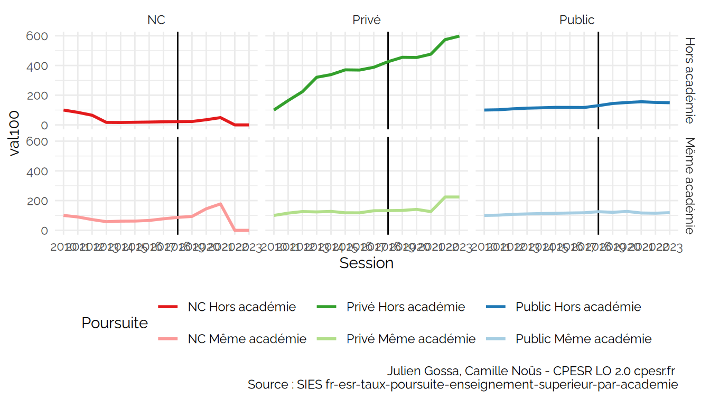
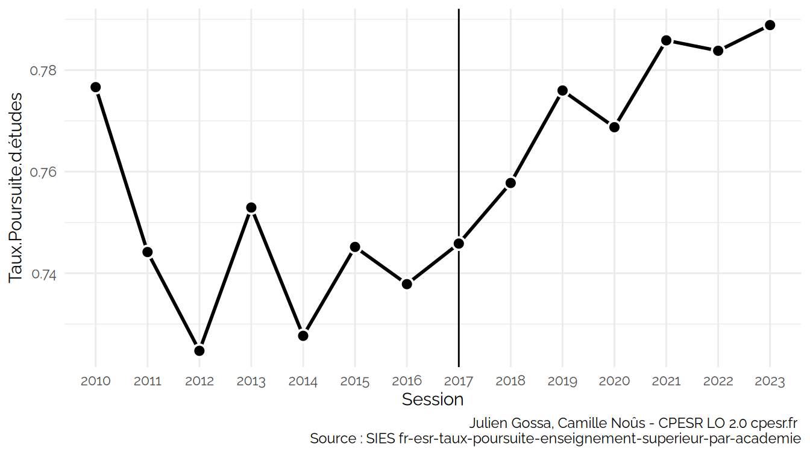
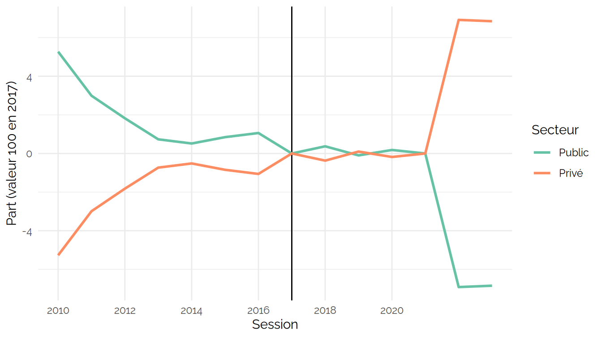
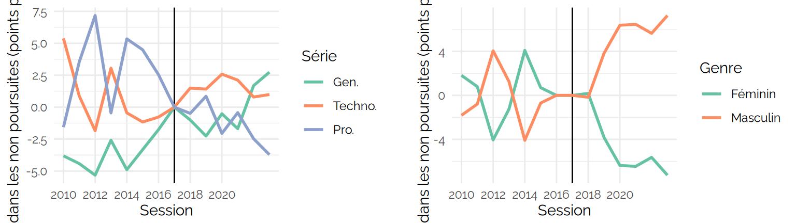

Poursuite d’étude
================

<https://data.enseignementsup-recherche.gouv.fr/explore/dataset/fr-esr-taux-poursuite-enseignement-superieur-par-academie/>

    ##  [1] "Session"                                                                                                                                           
    ##  [2] "Série.du.bac"                                                                                                                                      
    ##  [3] "Genre"                                                                                                                                             
    ##  [4] "Bacheliers"                                                                                                                                        
    ##  [5] "Néo.bacheliers.poursuivant.à.l.université..hors.IUT..dans.une.académie.différente.de.celle.d.obtention.de.leur.baccalauréat"                       
    ##  [6] "Néo.bacheliers.poursuivant.à.l.université..hors.IUT..dans.la.même.académie.que.celle.d.obtention.de.leur.baccalauréat"                             
    ##  [7] "Néo.bacheliers.poursuivant.en.IUT.dans.une.académie.différente.de.celle.d.obtention.de.leur.baccalauréat"                                          
    ##  [8] "Néo.bacheliers.poursuivant.en.IUT.dans.la.même.académie.que.celle.d.obtention.de.leur.baccalauréat"                                                
    ##  [9] "Néo.bacheliers.poursuivant.dans.une.CPGE.du.secteur.privé.dans.une.académie.différente.de.celle.d.obtention.de.leur.baccalauréat"                  
    ## [10] "Néo.bacheliers.poursuivant.dans.une.CPGE.du.secteur.privé.dans.la.même.académie.que.celle.d.obtention.de.leur.baccalauréat"                        
    ## [11] "Néo.bacheliers.poursuivant.dans.une.CPGE.du.secteur.public.dans.une.académie.différente.de.celle.d.obtention.de.leur.baccalauréat"                 
    ## [12] "Néo.bacheliers.poursuivant.dans.une.CPGE.du.secteur.public.dans.la.même.académie.que.celle.d.obtention.de.leur.baccalauréat"                       
    ## [13] "Néo.bacheliers.poursuivant.en.STS..secteur.non.renseigné..dans.une.académie.différente.de.celle.d.obtention.de.leur.baccalauréat"                  
    ## [14] "Néo.bacheliers.poursuivant.en.STS..secteur.non.renseigné..dans.la.même.académie.que.celle.d.obtention.de.leur.baccalauréat"                        
    ## [15] "Néo.bacheliers.poursuivant.en.STS.dans.le.secteur.privé.dans.une.académie.différente.de.celle.d.obtention.de.leur.baccalauréat"                    
    ## [16] "Néo.bacheliers.poursuivant.en.STS.dans.le.secteur.privé.dans.la.même.académie.que.celle.d.obtention.de.leur.baccalauréat"                          
    ## [17] "Néo.bacheliers.poursuivant.en.STS.dans.le.secteur.public.dans.une.académie.différente.de.celle.d.obtention.de.leur.baccalauréat"                   
    ## [18] "Néo.bacheliers.poursuivant.en.STS.dans.le.secteur.public.dans.la.même.académie.que.celle.d.obtention.de.leur.baccalauréat"                         
    ## [19] "Néo.bacheliers.poursuivant.dans.une.autre.formation..secteur.non.renseigné..dans.une.académie.différente.de.celle.d.obtention.de.leur.baccalauréat"
    ## [20] "Néo.bacheliers.poursuivant.dans.une.autre.formation..secteur.non.renseigné..dans.la.même.académie.que.celle.d.obtention.de.leur.baccalauréat"      
    ## [21] "Néo.bacheliers.poursuivant.dans.une.autre.formation.du.secteur.privé.dans.une.académie.différente.de.celle.d.obtention.de.leur.baccalauréat"       
    ## [22] "Néo.bacheliers.poursuivant.dans.une.autre.formation.du.secteur.privé.dans.la.même.académie.que.celle.d.obtention.de.leur.baccalauréat"             
    ## [23] "Néo.bacheliers.poursuivant.dans.une.autre.formation.du.secteur.public.dans.une.académie.différente.de.celle.d.obtention.de.leur.baccalauréat"      
    ## [24] "Néo.bacheliers.poursuivant.dans.une.autre.formation.du.secteur.public.dans.la.même.académie.que.celle.d.obtention.de.leur.baccalauréat"            
    ## [25] "Académie.du.Bac"                                                                                                                                   
    ## [26] "Code.académie.du.Bac"                                                                                                                              
    ## [27] "Code.Paysage.structure.de.l.académie"                                                                                                              
    ## [28] "Poursuivants.public"                                                                                                                               
    ## [29] "Poursuivants.privé"                                                                                                                                
    ## [30] "Poursuivants.nc"                                                                                                                                   
    ## [31] "Poursuivants"                                                                                                                                      
    ## [32] "Série"

## Bacheliers

### Poursuites

### Non poursuivants

