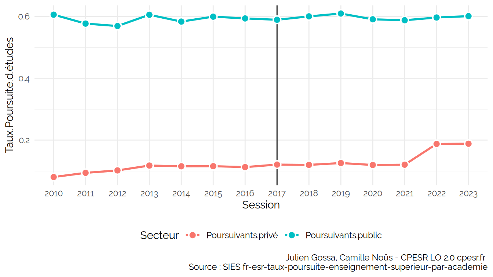
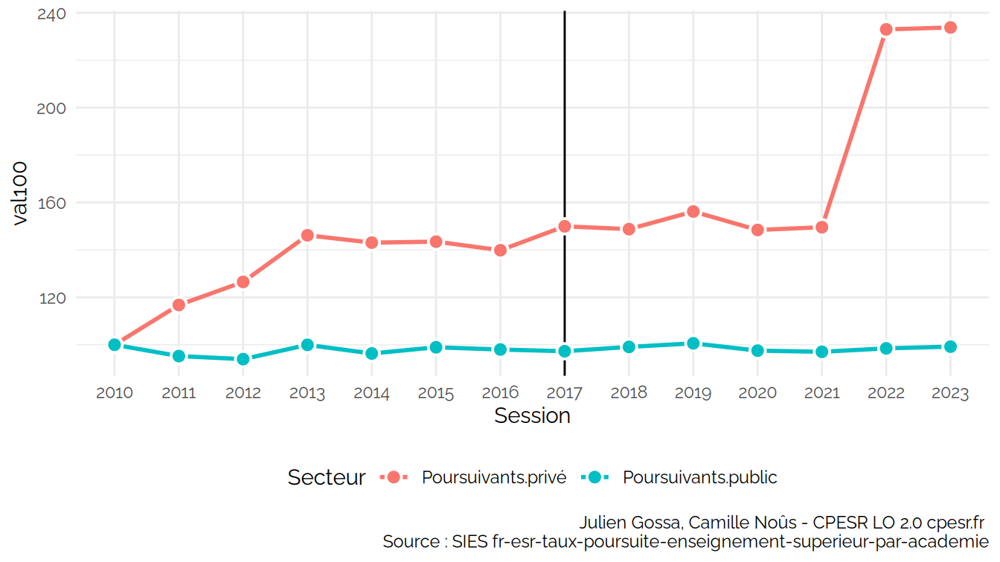
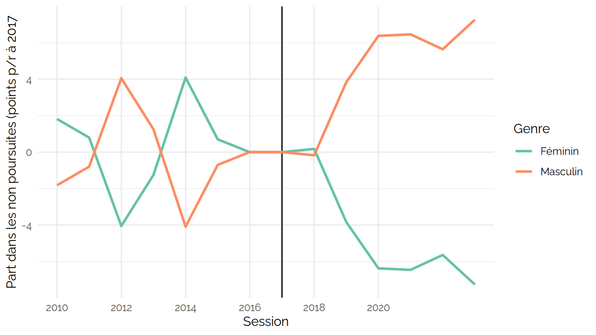
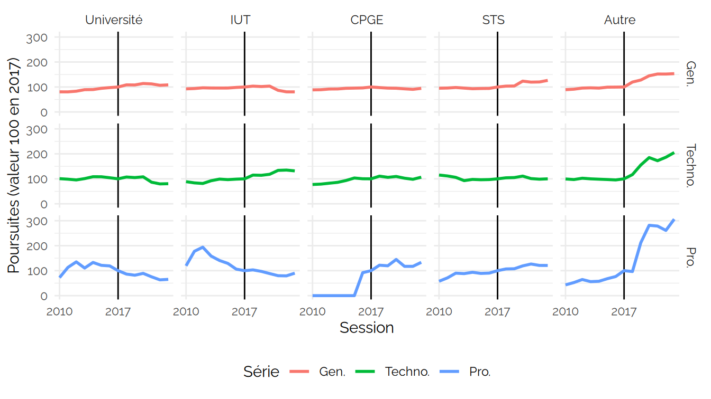
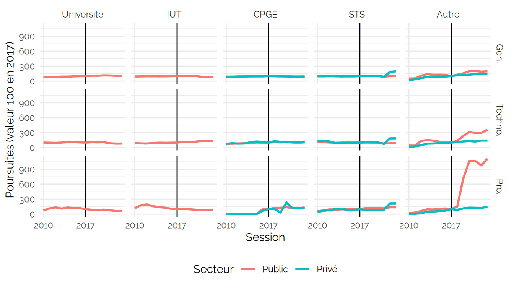
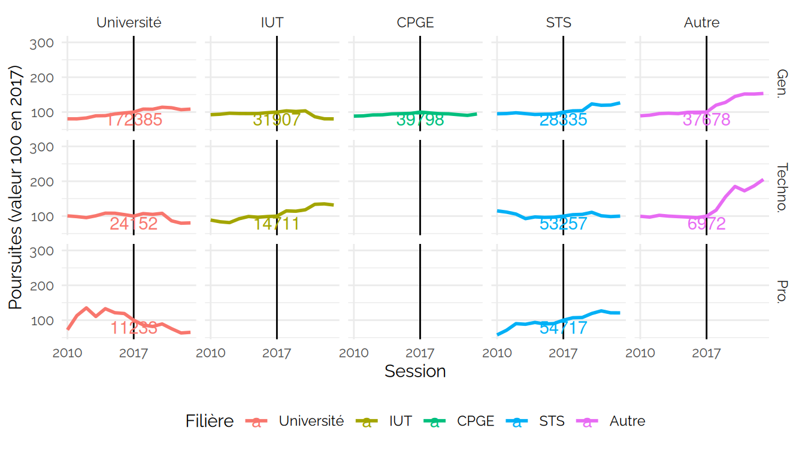
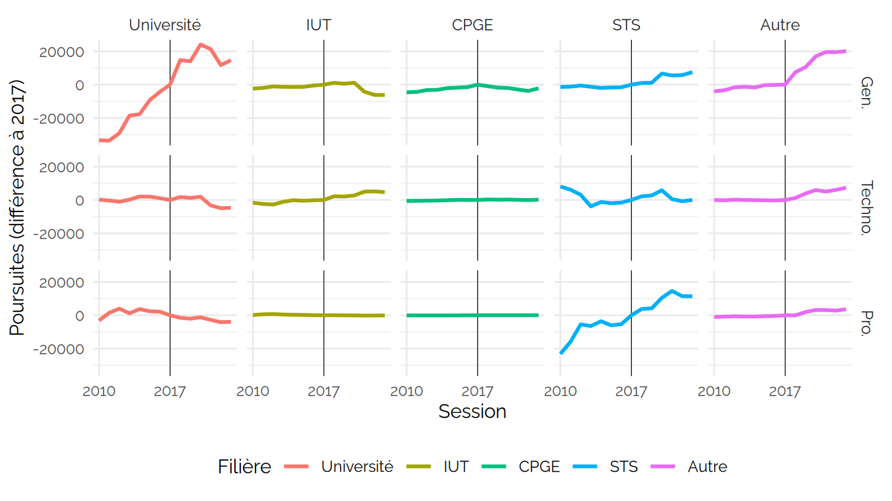
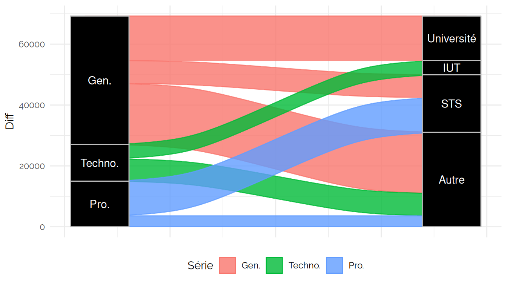

Poursuite d’étude
================

<https://data.enseignementsup-recherche.gouv.fr/explore/dataset/fr-esr-taux-poursuite-enseignement-superieur-par-academie/>

    ##  [1] "Session"                                                                                                                                           
    ##  [2] "Série.du.bac"                                                                                                                                      
    ##  [3] "Genre"                                                                                                                                             
    ##  [4] "Bacheliers"                                                                                                                                        
    ##  [5] "Néo.bacheliers.poursuivant.à.l.université..hors.IUT..dans.une.académie.différente.de.celle.d.obtention.de.leur.baccalauréat"                       
    ##  [6] "Néo.bacheliers.poursuivant.à.l.université..hors.IUT..dans.la.même.académie.que.celle.d.obtention.de.leur.baccalauréat"                             
    ##  [7] "Néo.bacheliers.poursuivant.en.IUT.dans.une.académie.différente.de.celle.d.obtention.de.leur.baccalauréat"                                          
    ##  [8] "Néo.bacheliers.poursuivant.en.IUT.dans.la.même.académie.que.celle.d.obtention.de.leur.baccalauréat"                                                
    ##  [9] "Néo.bacheliers.poursuivant.dans.une.CPGE.du.secteur.privé.dans.une.académie.différente.de.celle.d.obtention.de.leur.baccalauréat"                  
    ## [10] "Néo.bacheliers.poursuivant.dans.une.CPGE.du.secteur.privé.dans.la.même.académie.que.celle.d.obtention.de.leur.baccalauréat"                        
    ## [11] "Néo.bacheliers.poursuivant.dans.une.CPGE.du.secteur.public.dans.une.académie.différente.de.celle.d.obtention.de.leur.baccalauréat"                 
    ## [12] "Néo.bacheliers.poursuivant.dans.une.CPGE.du.secteur.public.dans.la.même.académie.que.celle.d.obtention.de.leur.baccalauréat"                       
    ## [13] "Néo.bacheliers.poursuivant.en.STS..secteur.non.renseigné..dans.une.académie.différente.de.celle.d.obtention.de.leur.baccalauréat"                  
    ## [14] "Néo.bacheliers.poursuivant.en.STS..secteur.non.renseigné..dans.la.même.académie.que.celle.d.obtention.de.leur.baccalauréat"                        
    ## [15] "Néo.bacheliers.poursuivant.en.STS.dans.le.secteur.privé.dans.une.académie.différente.de.celle.d.obtention.de.leur.baccalauréat"                    
    ## [16] "Néo.bacheliers.poursuivant.en.STS.dans.le.secteur.privé.dans.la.même.académie.que.celle.d.obtention.de.leur.baccalauréat"                          
    ## [17] "Néo.bacheliers.poursuivant.en.STS.dans.le.secteur.public.dans.une.académie.différente.de.celle.d.obtention.de.leur.baccalauréat"                   
    ## [18] "Néo.bacheliers.poursuivant.en.STS.dans.le.secteur.public.dans.la.même.académie.que.celle.d.obtention.de.leur.baccalauréat"                         
    ## [19] "Néo.bacheliers.poursuivant.dans.une.autre.formation..secteur.non.renseigné..dans.une.académie.différente.de.celle.d.obtention.de.leur.baccalauréat"
    ## [20] "Néo.bacheliers.poursuivant.dans.une.autre.formation..secteur.non.renseigné..dans.la.même.académie.que.celle.d.obtention.de.leur.baccalauréat"      
    ## [21] "Néo.bacheliers.poursuivant.dans.une.autre.formation.du.secteur.privé.dans.une.académie.différente.de.celle.d.obtention.de.leur.baccalauréat"       
    ## [22] "Néo.bacheliers.poursuivant.dans.une.autre.formation.du.secteur.privé.dans.la.même.académie.que.celle.d.obtention.de.leur.baccalauréat"             
    ## [23] "Néo.bacheliers.poursuivant.dans.une.autre.formation.du.secteur.public.dans.une.académie.différente.de.celle.d.obtention.de.leur.baccalauréat"      
    ## [24] "Néo.bacheliers.poursuivant.dans.une.autre.formation.du.secteur.public.dans.la.même.académie.que.celle.d.obtention.de.leur.baccalauréat"            
    ## [25] "Académie.du.Bac"                                                                                                                                   
    ## [26] "Code.académie.du.Bac"                                                                                                                              
    ## [27] "Code.Paysage.structure.de.l.académie"                                                                                                              
    ## [28] "Poursuivants.public"                                                                                                                               
    ## [29] "Poursuivants.privé"                                                                                                                                
    ## [30] "Poursuivants.nc"                                                                                                                                   
    ## [31] "Poursuivants"                                                                                                                                      
    ## [32] "Série"

Voir les données

| Session | Bac général | Bac professionnel | Bac technologique |
|:--------|------------:|------------------:|------------------:|
| 2010    |    15493.82 |          77280.43 |          26002.04 |
| 2011    |    18117.90 |         102225.97 |          25309.00 |
| 2012    |    19379.10 |         123896.00 |          24598.93 |
| 2013    |    20791.90 |          96378.84 |          28448.83 |
| 2014    |    20395.98 |         122630.97 |          27347.79 |
| 2015    |    21366.01 |         112149.84 |          24172.88 |
| 2016    |    25097.83 |         114871.99 |          26095.91 |
| 2017    |    27602.09 |         109027.93 |          26987.02 |
| 2018    |    26027.00 |         108519.91 |          29509.80 |
| 2019    |    21875.97 |         101044.97 |          26802.03 |
| 2020    |    27345.98 |         107965.95 |          31874.86 |
| 2021    |    22415.84 |          97691.99 |          27446.90 |

[non_poursuites.csv](non_poursuites.csv)

## Bacheliers

### Poursuites

Voir les données

| Session | Critère | Poursuites |      Part |     Evol |   PartEvol | Session17 | PartEvol17 |
|:--------|:--------|-----------:|----------:|---------:|-----------:|:----------|-----------:|
| 2010    | Public  |  321.98155 | 0.8826868 | 100.0000 |  0.0000000 | 2010      |  5.2732363 |
| 2011    | Public  |  328.29516 | 0.8598611 | 101.9609 | -0.0228257 | 2011      |  2.9906663 |
| 2012    | Public  |  346.84798 | 0.8481740 | 107.7229 | -0.0345128 | 2012      |  1.8219524 |
| 2013    | Public  |  356.72008 | 0.8372762 | 110.7890 | -0.0454106 | 2013      |  0.7321722 |
| 2014    | Public  |  364.85705 | 0.8351192 | 113.3161 | -0.0475676 | 2014      |  0.5164719 |
| 2015    | Public  |  370.75114 | 0.8384065 | 115.1467 | -0.0442803 | 2015      |  0.8452064 |
| 2016    | Public  |  375.87508 | 0.8405527 | 116.7381 | -0.0421342 | 2016      |  1.0598199 |
| 2017    | Public  |  379.16303 | 0.8299545 | 117.7592 | -0.0527324 | 2017      |  0.0000000 |
| 2018    | Public  |  406.35527 | 0.8336617 | 126.2045 | -0.0490251 | 2018      |  0.3707242 |
| 2019    | Public  |  407.14603 | 0.8289597 | 126.4501 | -0.0537272 | 2019      | -0.0994794 |
| 2020    | Public  |  426.91109 | 0.8317667 | 132.5887 | -0.0509201 | 2020      |  0.1812238 |
| 2021    | Public  |  404.80501 | 0.8299568 | 125.7230 | -0.0527300 | 2021      |  0.0002326 |
| 2010    | Privé   |   42.79284 | 0.1173132 | 100.0000 |  0.0000000 | 2010      | -5.2732363 |
| 2011    | Privé   |   53.50505 | 0.1401389 | 125.0327 |  0.0228257 | 2011      | -2.9906663 |
| 2012    | Privé   |   62.08696 | 0.1518260 | 145.0873 |  0.0345128 | 2012      | -1.8219524 |
| 2013    | Privé   |   69.32820 | 0.1627238 | 162.0089 |  0.0454106 | 2013      | -0.7321722 |
| 2014    | Privé   |   72.03514 | 0.1648808 | 168.3346 |  0.0475676 | 2014      | -0.5164719 |
| 2015    | Privé   |   71.45813 | 0.1615935 | 166.9862 |  0.0442803 | 2015      | -0.8452064 |
| 2016    | Privé   |   71.30104 | 0.1594473 | 166.6191 |  0.0421342 | 2016      | -1.0598199 |
| 2017    | Privé   |   77.68496 | 0.1700455 | 181.5373 |  0.0527324 | 2017      |  0.0000000 |
| 2018    | Privé   |   81.07898 | 0.1663383 | 189.4686 |  0.0490251 | 2018      | -0.3707242 |
| 2019    | Privé   |   84.00697 | 0.1710403 | 196.3108 |  0.0537272 | 2019      |  0.0994794 |
| 2020    | Privé   |   86.34712 | 0.1682333 | 201.7794 |  0.0509201 | 2020      | -0.1812238 |
| 2021    | Privé   |   82.93726 | 0.1700432 | 193.8111 |  0.0527300 | 2021      | -0.0002326 |

### Non poursuivants

### Flux Série / Filière

### Bac pro

### Flux des différences

    ## # A tibble: 15 × 5
    ## # Groups:   Série, Filière [15]
    ##    Session Série   Filière    Poursuites    Diff
    ##    <chr>   <fct>   <fct>           <dbl>   <dbl>
    ##  1 2021    Gen.    Université    193706. 21321. 
    ##  2 2021    Gen.    IUT            27649. -4258. 
    ##  3 2021    Gen.    CPGE           36839. -2959. 
    ##  4 2021    Gen.    STS            33856.  5521. 
    ##  5 2021    Gen.    Autre          57239. 19552. 
    ##  6 2021    Techno. Université     20884  -3268. 
    ##  7 2021    Techno. IUT            19687   4976  
    ##  8 2021    Techno. CPGE            2478.    60.1
    ##  9 2021    Techno. STS            53770    513  
    ## 10 2021    Techno. Autre          12030.  5067. 
    ## 11 2021    Pro.    Université      8471  -2762. 
    ## 12 2021    Pro.    IUT              610   -154  
    ## 13 2021    Pro.    CPGE             102.    15.0
    ## 14 2021    Pro.    STS            69295. 14578. 
    ## 15 2021    Pro.    Autre           4850.  3109.

