CPESR
================
CPESR
2024-05-07

## Données

- [Source
  wikidata](https://query.wikidata.org/index.html#SELECT%20%3Funiv%20%3FunivLabel%20%3Fdebut%20%3Ffin%20%3Fpresident%20%3FpresidentLabel%20%3Fnaissance%20%3Fdeces%20%3Fage%20%3FsexeLabel%20%3FroleLabel%20%3FmotifLabel%20%0AWHERE%20%7B%0A%20%20SERVICE%20wikibase%3Alabel%20%7B%20bd%3AserviceParam%20wikibase%3Alanguage%20%22fr%22.%20%7D%0A%20%20%0A%20%20%3Funiv%20wdt%3AP31%20wd%3AQ3551775%20.%20%23%20universit%C3%A9%20de%20France%0A%20%20%3Funiv%20p%3AP488%20%3Fnode%20.%20%20%20%20%20%20%20%20%23%20r%C3%A9cup%C3%A8re%20tous%20les%20pr%C3%A9sidents%20et%20pas%20seulement%20le%20dernier%0A%20%20%3Fnode%20ps%3AP488%20%3Fpresident%20.%20%0A%20%20OPTIONAL%20%7B%3Fnode%20pq%3AP1534%20%3Fmotif.%7D%0A%20%20OPTIONAL%20%7B%3Fnode%20pq%3AP39%20%3Frole.%7D%0A%20%20%0A%20%20OPTIONAL%7B%3Fnode%20pq%3AP580%20%3Fann%C3%A9e%20.%7D%20%23%20date%20de%20d%C3%A9but%20du%20mandat%0A%20%20OPTIONAL%7B%3Fnode%20pq%3AP582%20%3Fann%C3%A9e2%20.%7D%20%23%20date%20de%20fin%20du%20mandat%0A%20%20OPTIONAL%7B%3Fpresident%20wdt%3AP569%20%3Fann%C3%A9e3%20.%7D%20%23%20ann%C3%A9e%20de%20naissance%0A%20%20OPTIONAL%7B%3Fpresident%20wdt%3AP570%20%3Fann%C3%A9e4%20.%7D%20%23%20ann%C3%A9e%20de%20d%C3%A9c%C3%A8s%0A%20%20OPTIONAL%7B%3Fpresident%20wdt%3AP21%20%3Fsexe.%7D%20%23%20sexe%20du%20pr%C3%A9sident%0A%20%20%0A%20%20BIND(year(%3Fann%C3%A9e)%20as%20%3Fdebut)%20%23%20conserve%20que%20l'ann%C3%A9e%0A%20%20BIND(year(%3Fann%C3%A9e2)%20as%20%3Ffin)%0A%20%20BIND(year(%3Fann%C3%A9e3)%20as%20%3Fnaissance)%0A%20%20BIND(year(%3Fann%C3%A9e4)%20as%20%3Fdeces)%0A%20%20BIND(%3Fdebut%20-%20%3Fnaissance%20AS%20%3Fage)%20%23%20%C3%A2ge%20en%20d%C3%A9but%20de%20mandat%0A%7D%0A%0AORDER%20BY%20%3FunivLabel%20%3Fdebut)

<!-- -->

    ##  [1] "univ"           "univLabel"      "debut"          "fin"           
    ##  [5] "president"      "presidentLabel" "naissance"      "deces"         
    ##  [9] "age"            "sexeLabel"      "roleLabel"      "motifLabel"    
    ## [13] "décennie"       "durée"          "age_début"      "age_fin"

## Check

Multi prez

| presidentLabel        | Nombre |
|:----------------------|-------:|
| François Germinet     |      2 |
| Jean-Louis Vernet     |      2 |
| Philippe Tchamitchian |      2 |
| Yves Serra            |      2 |
| Jacques Fontaine      |      2 |
| Mathias Bernard       |      2 |

## Explorations

    ## Warning: Using `size` aesthetic for lines was deprecated in ggplot2 3.4.0.
    ## ℹ Please use `linewidth` instead.
    ## This warning is displayed once every 8 hours.
    ## Call `lifecycle::last_lifecycle_warnings()` to see where this warning was
    ## generated.

    ## Warning: The `guide` argument in `scale_*()` cannot be `FALSE`. This was deprecated in
    ## ggplot2 3.3.4.
    ## ℹ Please use "none" instead.
    ## This warning is displayed once every 8 hours.
    ## Call `lifecycle::last_lifecycle_warnings()` to see where this warning was
    ## generated.

    ## Warning: Removed 1 row containing missing values or values outside the scale range
    ## (`geom_col()`).

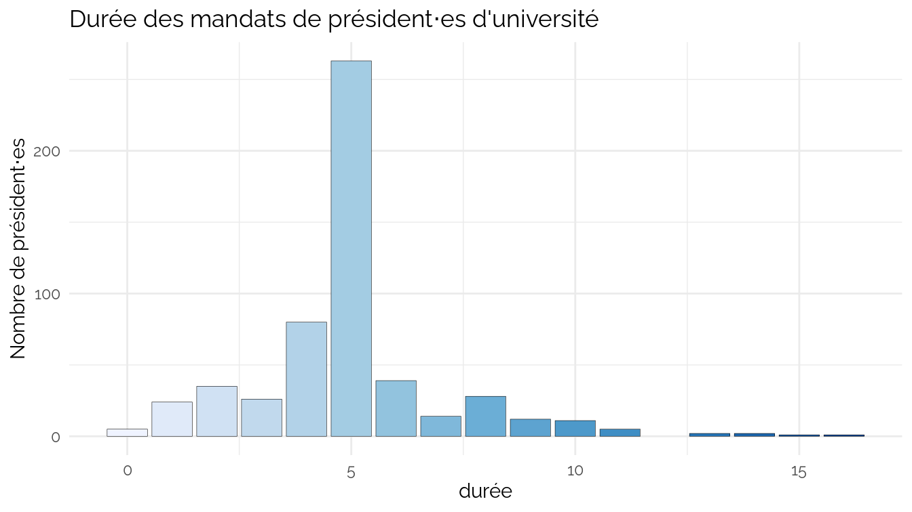

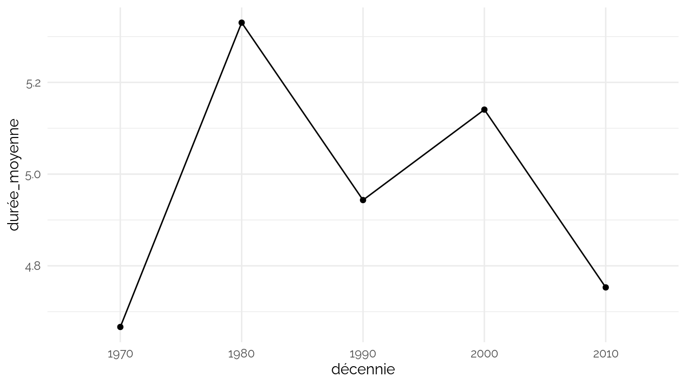

    ## `geom_smooth()` using method = 'loess' and formula = 'y ~ x'

    ## Warning: Removed 14 rows containing non-finite outside the scale range
    ## (`stat_smooth()`).

    ## Warning: Removed 14 rows containing missing values or values outside the scale range
    ## (`geom_point()`).

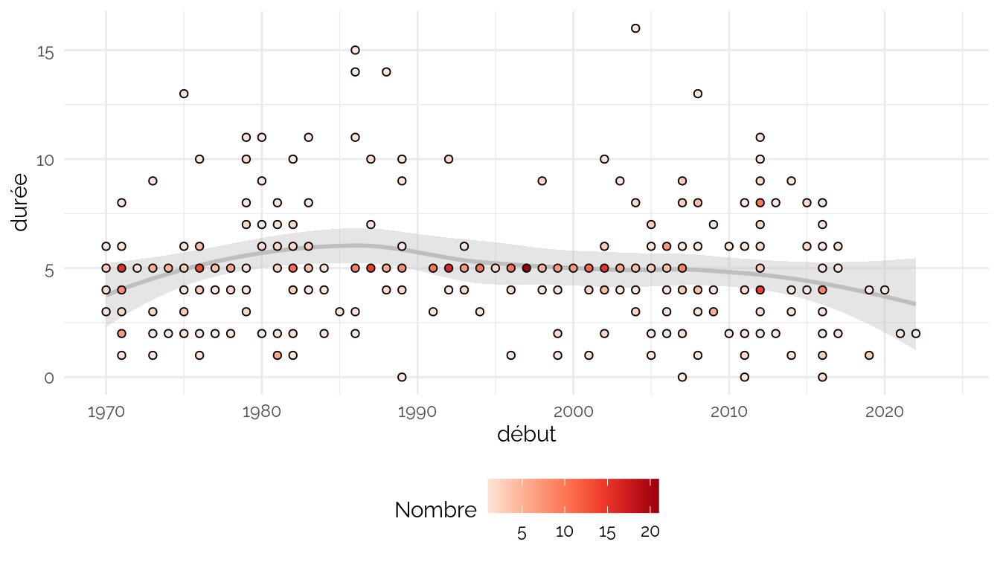

    ## Warning: Removed 24 rows containing non-finite outside the scale range
    ## (`stat_boxplot()`).

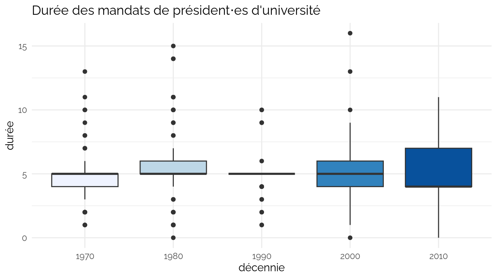

    ## `geom_smooth()` using method = 'loess' and formula = 'y ~ x'

    ## Warning: Removed 30 rows containing non-finite outside the scale range
    ## (`stat_smooth()`).

    ## Warning: Removed 30 rows containing missing values or values outside the scale range
    ## (`geom_point()`).

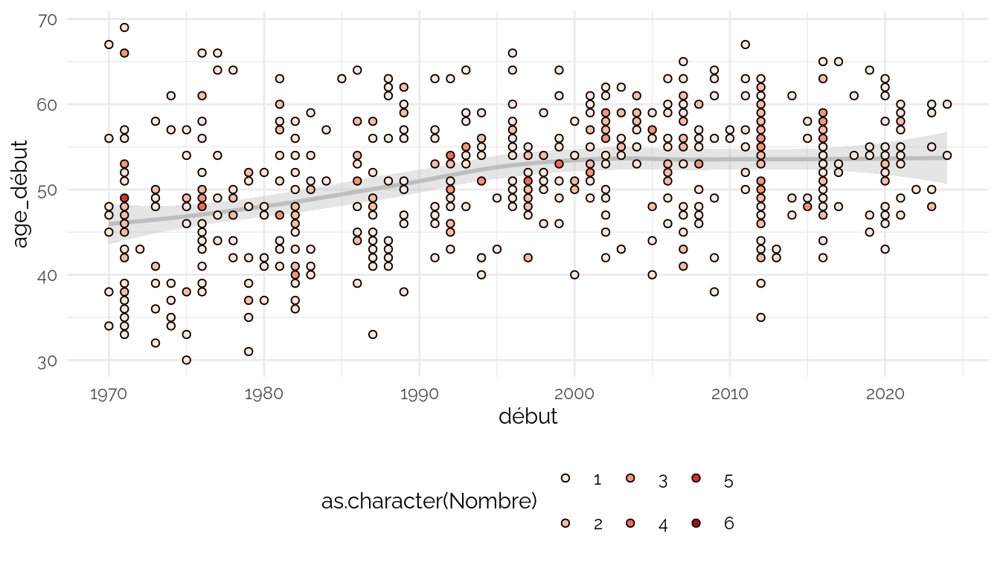

    ## Warning: Removed 51 rows containing non-finite outside the scale range
    ## (`stat_boxplot()`).

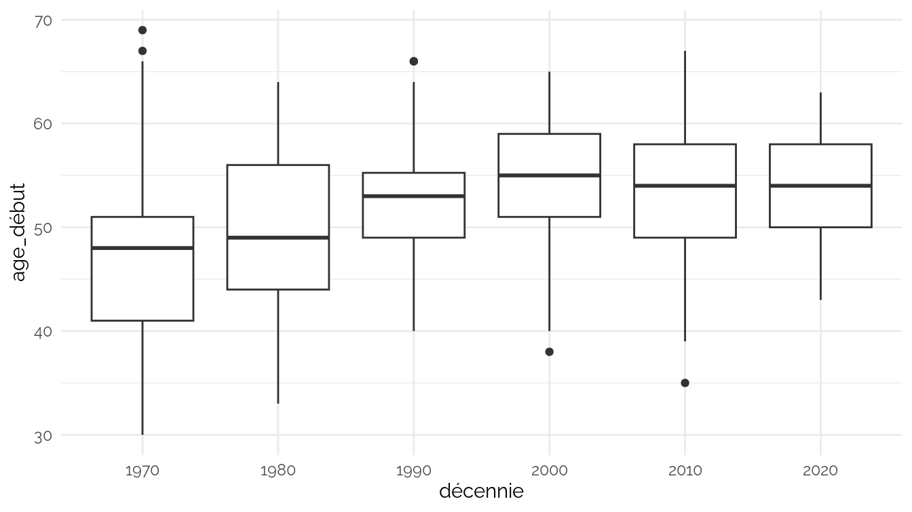

    ## `geom_smooth()` using method = 'loess' and formula = 'y ~ x'

    ## Warning: Removed 51 rows containing non-finite outside the scale range
    ## (`stat_smooth()`).

    ## Warning: Removed 51 rows containing missing values or values outside the scale range
    ## (`geom_point()`).

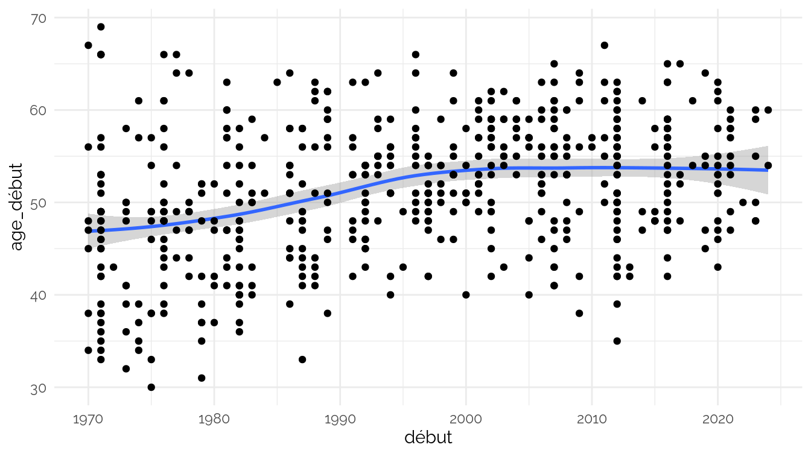

    ## Warning: Removed 106 rows containing non-finite outside the scale range
    ## (`stat_boxplot()`).

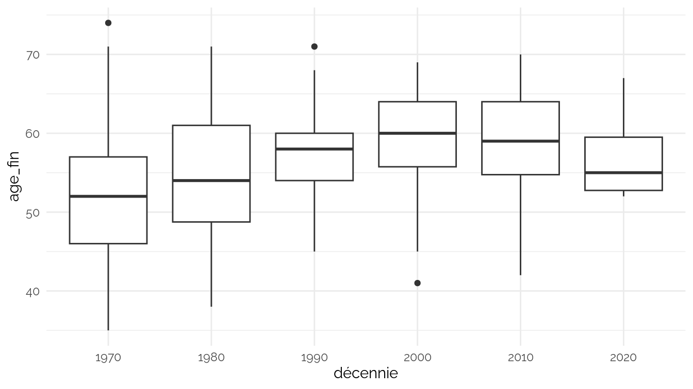

    ## `geom_smooth()` using method = 'loess' and formula = 'y ~ x'

    ## Warning: Removed 106 rows containing non-finite outside the scale range
    ## (`stat_smooth()`).

    ## Warning: Removed 106 rows containing missing values or values outside the scale range
    ## (`geom_point()`).

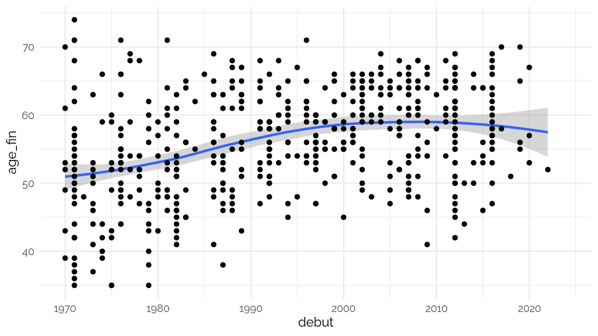

    ## Warning: Removed 157 rows containing non-finite outside the scale range
    ## (`stat_boxplot()`).

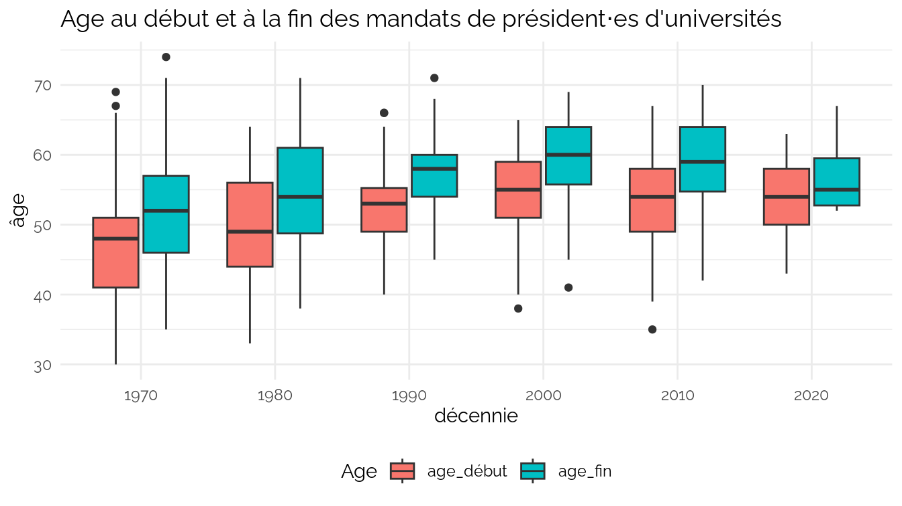

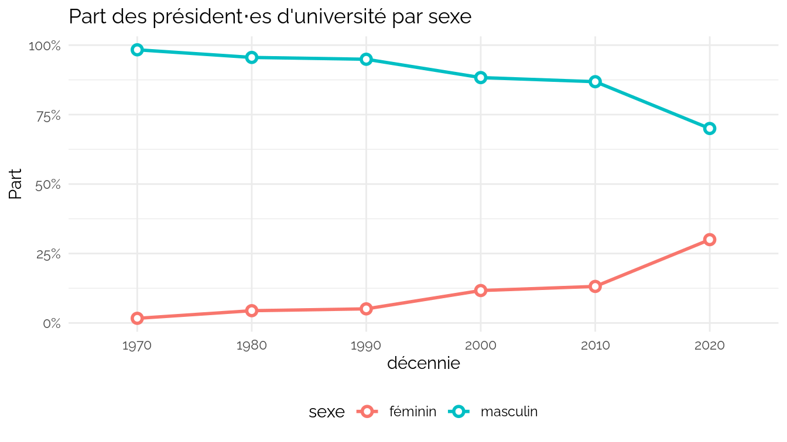
