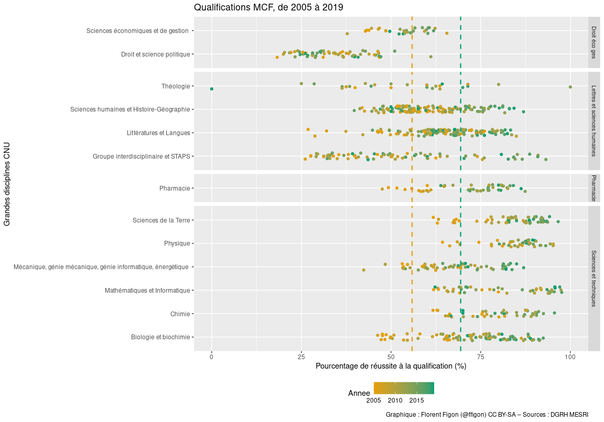
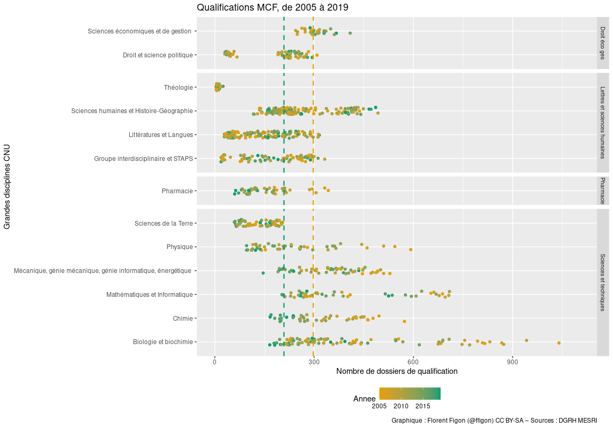
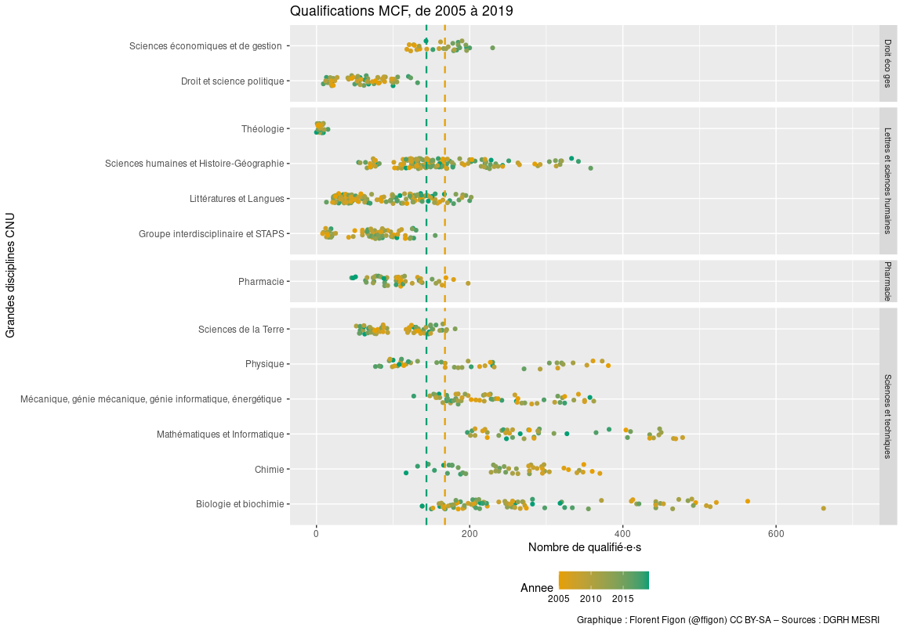

Qualification MCF
================

``` r
library(ggplot2)
library(ggbeeswarm)
library("gridExtra")
data_CNU = read.table("DB_CNU_QualificationRecrutements_20201123.csv", h=T, sep=";")
```

# Pourcentage de réussite à la qualification

## Moyenne toutes sections confondues de 2005 à 2019

``` r
tapply(data_CNU$QualificationQualifies.MCF/data_CNU$QualificationDossiers.MCF, data_CNU$Annee, mean, na.rm=T)
```

    ##      2005      2006      2007      2008      2009      2010      2011      2012 
    ## 0.5588368 0.5685157 0.5910385 0.6387567 0.6222343 0.6266630 0.6447297 0.6809704 
    ##      2013      2014      2015      2016      2017      2018      2019 
    ## 0.6946531 0.6956818 0.6848906 0.7009596 0.7129845 0.7122116 0.6941814

## Evolution du taux de réussite de 2005 à 2019

    ## Warning: Removed 3 rows containing missing values (geom_point).

<!-- -->

**Hypothèses**

  - la qualification devient de plus en plus facile à avoir ;
  - augmentation du niveau des candidats ;
      - soit par l’augmentation des standards ;
      - soit par une baisse éventuellement relative du nombre de
        candidats.

# Nombre de dossiers de qualification MCF

``` r
tapply(data_CNU$QualificationDossiers.MCF, data_CNU$Annee, mean, na.rm=T)
```

    ##     2005     2006     2007     2008     2009     2010     2011     2012 
    ## 297.5357 271.1754 268.5893 260.2500 274.7193 228.3684 238.7368 236.4912 
    ##     2013     2014     2015     2016     2017     2018     2019 
    ## 230.8246 232.3158 225.3333 216.0877 204.0175 202.0000 208.8947

## Evolution du nombre de dossiers de qualification MCF de 2005 à 2019

    ## Warning: Removed 3 rows containing missing values (geom_point).

<!-- -->

# Nombre de qualifiés MCF

``` r
tapply(data_CNU$QualificationQualifies.MCF, data_CNU$Annee, mean, na.rm=T)
```

    ##     2005     2006     2007     2008     2009     2010     2011     2012 
    ## 167.7500 156.7895 159.9286 166.6071 172.1228 143.6140 154.3158 160.6491 
    ##     2013     2014     2015     2016     2017     2018     2019 
    ## 161.1053 160.6491 154.3158 152.1930 143.8947 141.3860 143.5789

## Evolution du nombre de qualifiés de 2005 à 2019

    ## Warning: Removed 3 rows containing missing values (geom_point).

<!-- -->

**Conclusions**

  - Ca tendrait à confirmer l’hypothèse : le niveau des candidats monte,
    le nombre de candidats baisse.
  - Il pourrait aussi y avoir une politique des sections de ne pas
    passer en-dessous d’un certain nombre de qualifié·e·s, alors que le
    nombre de candidat·e·s ne cesse de diminuer.
