Qualification MCF
================

## Description des données

  - Nombre d’observations : 855
  - Variables :

<!-- end list -->

    ##  [1] "TypeRecrutement"            "GrandeDisciplineCNU"       
    ##  [3] "GroupeCNU"                  "SectionCNU"                
    ##  [5] "SectionCNU.ID"              "Annee"                     
    ##  [7] "QualificationDossiers.MCF"  "QualificationQualifies.MCF"
    ##  [9] "PostesPublies.MCF"          "Candidatures.MCF"          
    ## [11] "Candidats.MCF"              "PostesPourvus.MCF"         
    ## [13] "Candidatures.MCF.F"         "Candidatures.MCF.H"        
    ## [15] "Candidats.MCF.F"            "Candidats.MCF.H"           
    ## [17] "Recrutes.MCF.F"             "Recrutes.MCF.H"

  - Période : 2005, 2019

## Pourcentage de réussite à la qualification

### Moyenne toutes sections confondues de 2005 à 2019

    ##      2005      2006      2007      2008      2009      2010      2011      2012 
    ## 0.5588368 0.5685157 0.5910385 0.6387567 0.6222343 0.6266630 0.6447297 0.6809704 
    ##      2013      2014      2015      2016      2017      2018      2019 
    ## 0.6946531 0.6956818 0.6848906 0.7009596 0.7129845 0.7122116 0.6941814

### Evolution du taux de réussite de 2005 à 2019

    ## Warning: Removed 3 rows containing missing values (geom_point).

<!-- -->

**Hypothèses**

  - la qualification devient de plus en plus facile à avoir ;
  - augmentation du niveau des candidats ;
      - soit par l’augmentation des standards ;
      - soit par une baisse éventuellement relative du nombre de
        candidats.

## Nombre de dossiers de qualification MCF

    ##     2005     2006     2007     2008     2009     2010     2011     2012 
    ## 297.5357 271.1754 268.5893 260.2500 274.7193 228.3684 238.7368 236.4912 
    ##     2013     2014     2015     2016     2017     2018     2019 
    ## 230.8246 232.3158 225.3333 216.0877 204.0175 202.0000 208.8947

### Evolution du nombre de dossiers de qualification MCF de 2005 à 2019

    ## Warning: Removed 3 rows containing missing values (geom_point).

<!-- -->

# Nombre de qualifications MCF

    ##     2005     2006     2007     2008     2009     2010     2011     2012 
    ## 167.7500 156.7895 159.9286 166.6071 172.1228 143.6140 154.3158 160.6491 
    ##     2013     2014     2015     2016     2017     2018     2019 
    ## 161.1053 160.6491 154.3158 152.1930 143.8947 141.3860 143.5789

## Evolution du nombre de qualifications de 2005 à 2019

    ## Warning: Removed 3 rows containing missing values (geom_point).

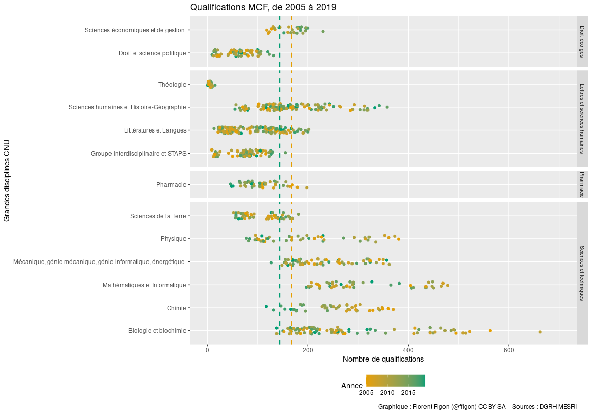<!-- -->

**Conclusions**

  - Ca tendrait à confirmer l’hypothèse : le niveau des candidats monte,
    le nombre de candidats baisse.
  - Il pourrait aussi y avoir une politique des sections de ne pas
    passer en-dessous d’un certain nombre de qualifié·e·s, alors que le
    nombre de candidat·e·s ne cesse de diminuer.

## Autres dataviz

### Taux de qualification MCF

    ## Warning: Removed 3 rows containing non-finite values (stat_boxplot).

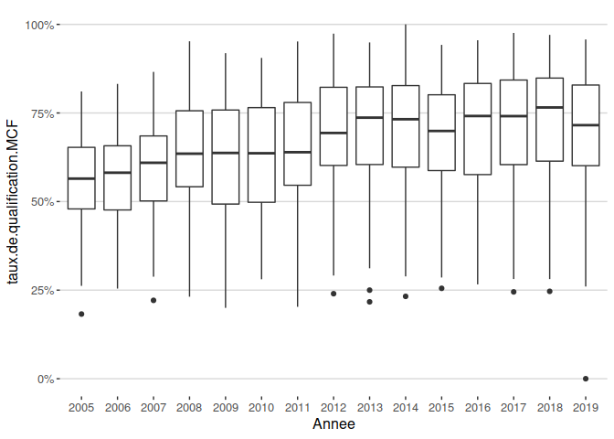<!-- -->

### Nombre de dossiers et nombre de qualifiés, toutes sections confondues

    ## `summarise()` ungrouping output (override with `.groups` argument)

    ## `geom_smooth()` using formula 'y ~ x'

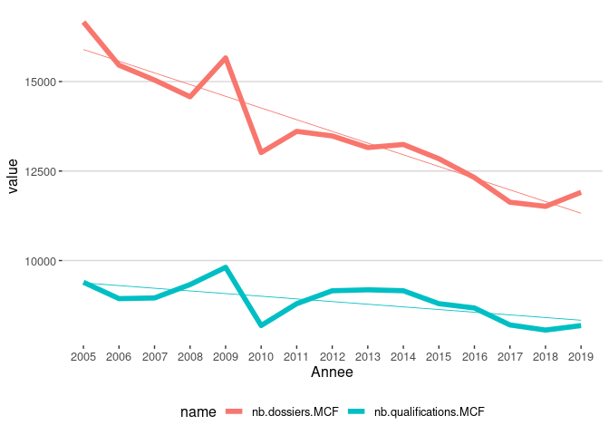<!-- -->

### Evolution du nombre de dossiers et nombre de qualifiés, toutes sections confondues (en valeur de 2005)

    ## `geom_smooth()` using formula 'y ~ x'

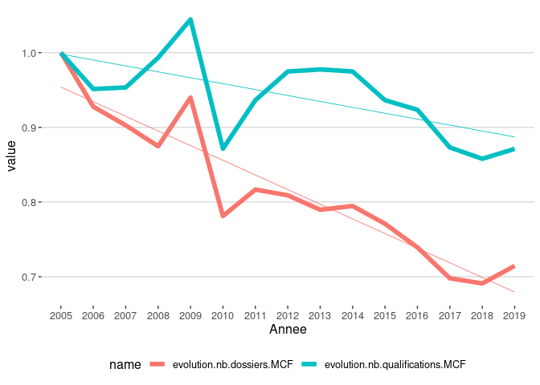<!-- -->

Entre 2005 et 2019, le nombre de dossiers de qualification est passé de
16662 à 11907 (soit -29%), pendant que le nombre de qualifications
passait de 9394 à 8184 (soit -13%).

### Evolution du nombre relatif de dossiers de qualification par section (en valeur de 2005)

    ## Warning: Removed 1 row(s) containing missing values (geom_path).

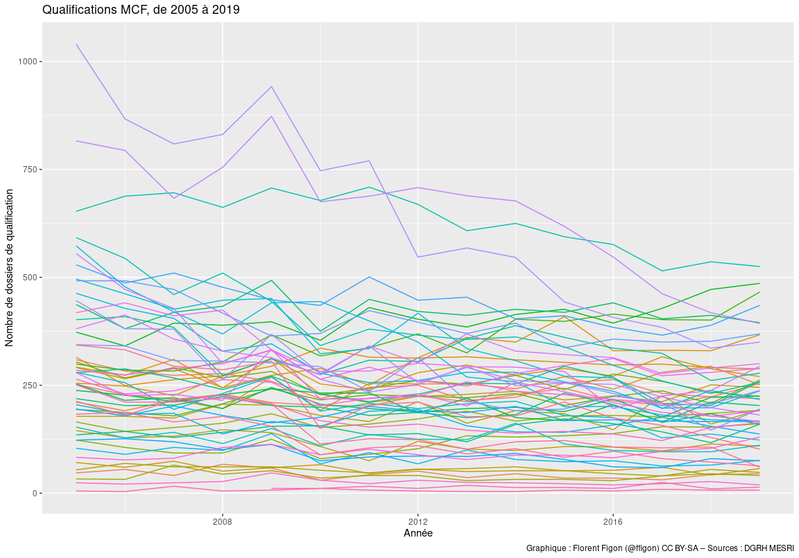<!-- -->

    ## Warning: Removed 3 rows containing non-finite values (stat_ydensity).

    ## Warning: Removed 3 rows containing non-finite values (stat_summary).

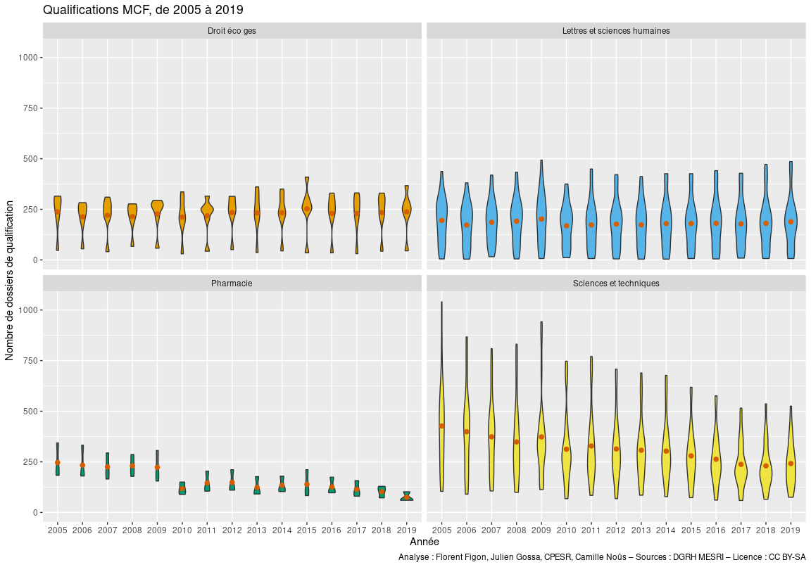<!-- -->

Le nombre total de dossiers de qualification semble être écrasé par les
hautes valeurs en 2005 des sections bio et informatique. On regarde donc
ce qu’il se passe, en relatif, au niveau de chaque section pour voir si
chacune voit son nb de dossiers diminuer ou pas.

    ## Warning: Removed 15 row(s) containing missing values (geom_path).

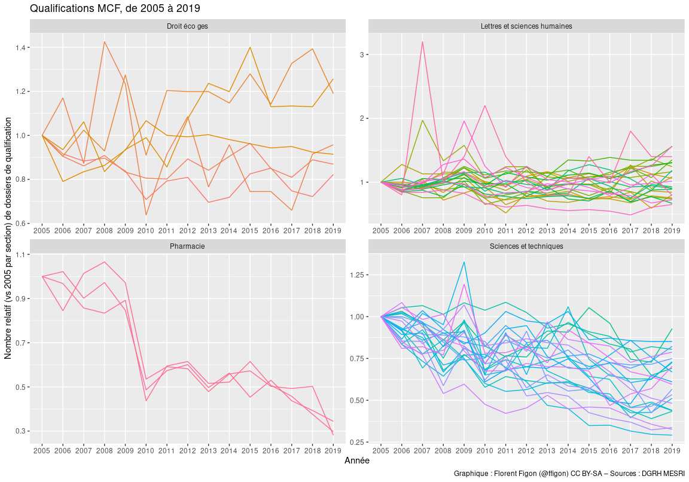<!-- -->

    ## `geom_smooth()` using formula 'y ~ x'

    ## Warning: Removed 15 rows containing non-finite values (stat_smooth).

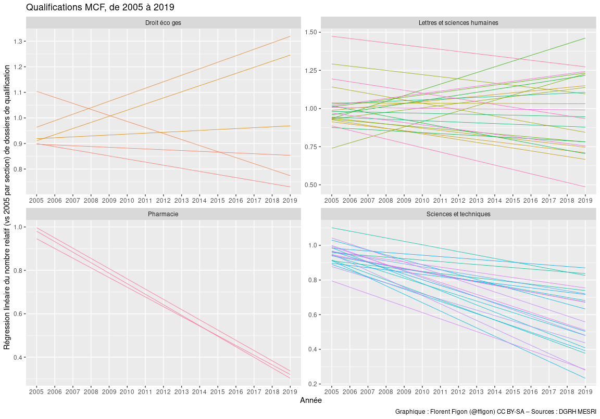<!-- -->

    ## Warning: Removed 15 rows containing non-finite values (stat_boxplot).

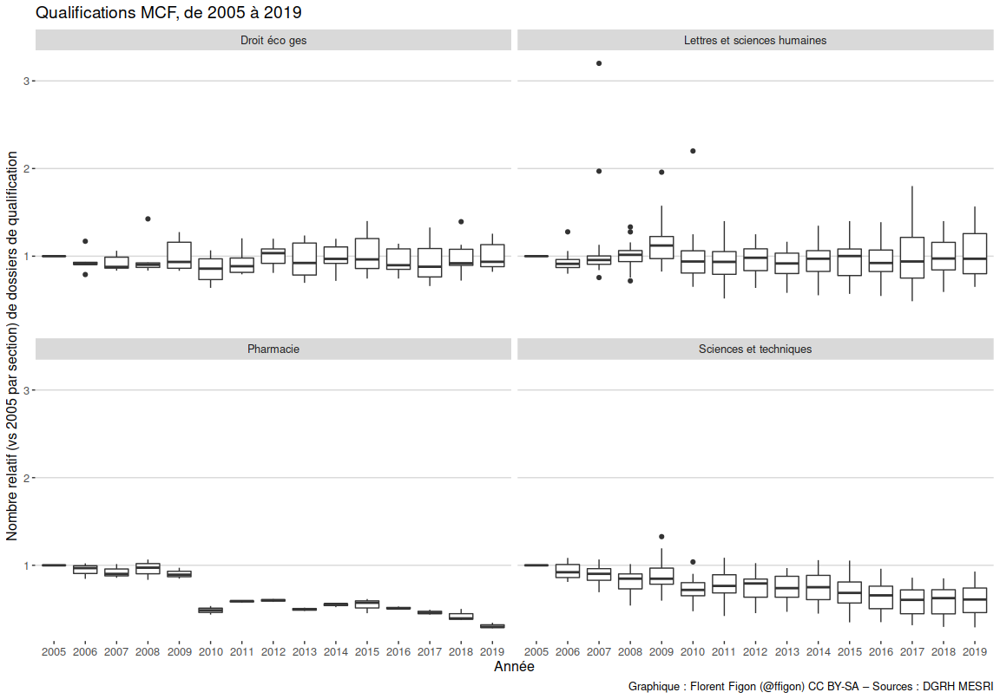<!-- -->

    ## Warning: Removed 15 rows containing non-finite values (stat_boxplot).

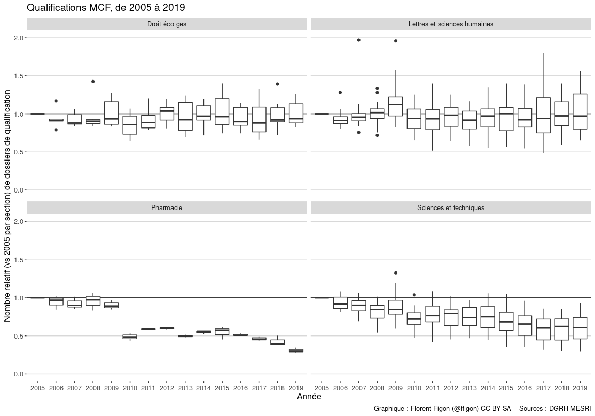<!-- -->

    ## Warning: Removed 15 rows containing non-finite values (stat_ydensity).

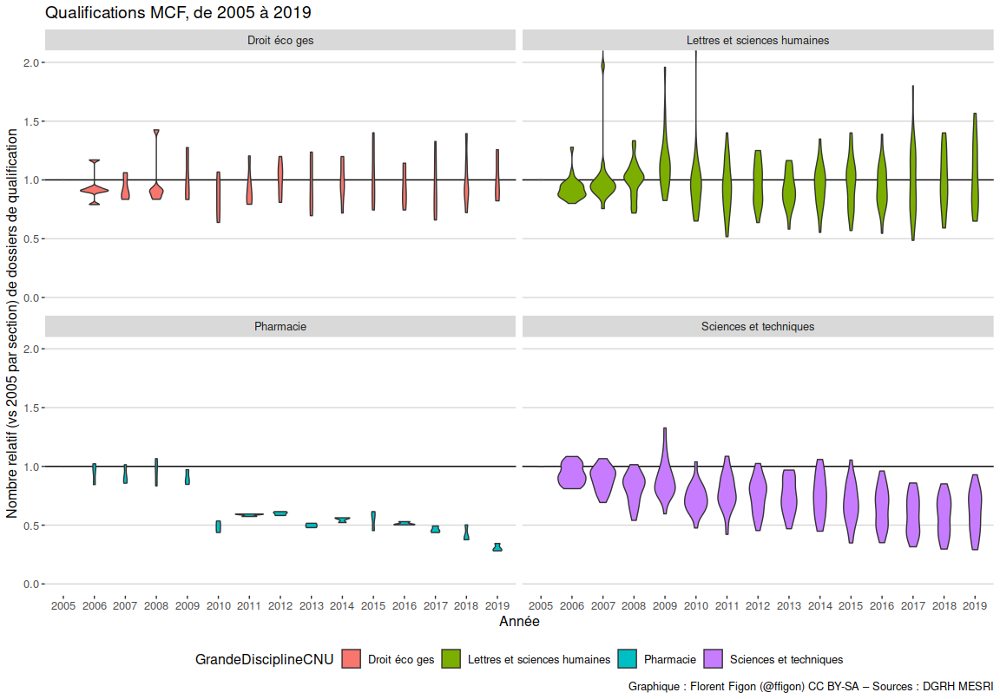<!-- -->

    ## Warning: Removed 15 rows containing non-finite values (stat_ydensity).

    ## Warning: Removed 15 rows containing non-finite values (stat_summary).

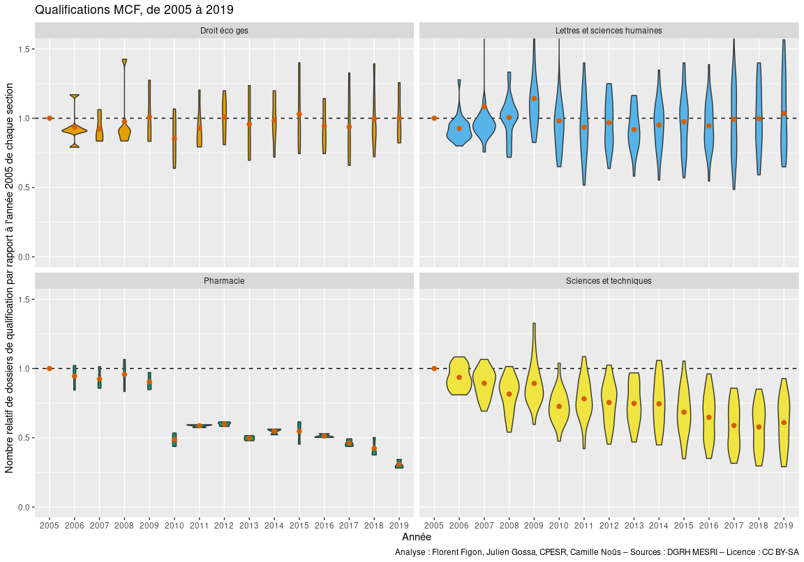<!-- -->
