RD Data
================
CPESR
2026-06-25

## Données

- <https://donnees.banquemondiale.org/indicateur/GB.XPD.RSDV.GD.ZS>
  (API_BG)
- <https://www.oecd.org/fr/data/insights/statistical-releases/2026/03/oecd-overall-rd-growth-stable-government-rd-budgets-decline-and-reorient-towards-defence.html>
  (OCDE\_)

Variables ( 62 lignes)

| MEASURE | Mesure |
|:---|:---|
| B | Dépenses intérieures de R-D des entreprises (DIRDE) |
| B_AERO | DIRDE exécutée dans l’industrie aérospatiale |
| B_COMP | DIRDE exécutée dans l’industrie de l’informatique, de l’électronique et de l’optique |
| B_DRUG | DIRDE exécutée dans l’industrie pharmaceutique |
| B_FA | DIRDE financée par le reste du monde |
| B_FB | DIRDE financée par le secteur des entreprises |
| B_FG | DIRDE financée par le secteur de l’État |
| B_FON | DIRDE financée par le secteur de l’enseignement supérieur et les ISBL |
| B_ICTS | DIRDE exécutée dans les services d’information et de communication |
| B_MANUF | DIRDE exécutée dans l’industrie manufacturière |
| B_RS | Chercheurs dans le secteur des entreprises |
| B_SERV | DIRDE exécutée dans les industries de services |
| B_TT | Personnel de R-D dans le secteur des entreprises |
| B_WRS | Chercheuses dans le secteur des entreprises |
| C | Crédits budgétaires publics de R-D (CBPRD) |
| C_CV | CBPRD civils |
| C_DF | CBPRD pour la défense |
| C_ECO | CBPRD civils pour les programmes de développement économique |
| C_EDU | CBPRD civils pour les programmes d’enseignement et de société |
| C_GUF | CBPRD civils pour les fonds généraux des l’université (FGU) |
| C_HEA | CBPRD civils pour les programmes de santé et d’environnement |
| C_NOR | CBPRD civils pour les programmes de recherche non orientée |
| C_SPA | CBPRD civils pour les programmes spatiaux |
| G | Dépenses intérieures brutes de R-D (DIRD) |
| GDP | Produit intérieur brut |
| GV | Dépenses intérieures de R-D de l’État (DIRDET) |
| GV_FB | DIRDET financée par le secteur des entreprises |
| G_BR | Dépenses pour la recherche fondamentale |
| G_CV | DIRD civiles |
| G_FA | DIRD financée par le reste du monde |
| G_FB | DIRD financée par le secteur des entreprises |
| G_FG | DIRD financée par le secteur de l’État |
| G_FON | DIRD financée par le secteur de l’enseignement supérieur et les ISBL |
| G_RS | Chercheurs dans le secteur de l’État |
| G_TT | Personnel de R-D dans le secteur de l’État |
| G_WRS | Chercheuses dans le secteur de l’État |
| H | Dépenses intérieures de R-D de l’enseignement supérieur (DIRDES) |
| H_FB | DIRDES financée par le secteur des entreprises |
| H_RS | Chercheurs dans le secteur de l’enseignement supérieur |
| H_TT | Personnel de R-D dans le secteur de l’enseignement supérieur |
| H_WRS | Chercheuses dans le secteur de l’enseignement supérieur |
| PI | Indice implicite du prix du PIB |
| PNP | Dépenses intérieures de R-D des institutions sans but lucratif (DIRDISBL) |
| PPP | Parité de pouvoir d’achat |
| P_BIOPCT | Brevets dans le secteur des biotechnologies - dépôts au titre du PCT |
| P_ICTPCT | Brevets dans le secteur des TIC - dépôts au titre du PCT |
| P_PCT | Demandes de brevets auprès du PCT |
| P_TRIAD | Familles de brevets triadiques |
| TD_BAERO | Balance commerciale sur les aéronefs et engins spatiaux |
| TD_BCOMP | Balance commerciale sur les ordinateurs, articles électroniques et optiques |
| TD_BDRUG | Balance commerciale sur les produits pharmaceutiques |
| TD_EAERO | Exportations d’aéronefs et engins spatiaux |
| TD_ECOMP | Exportations d’ordinateurs, articles électroniques et optiques |
| TD_EDRUG | Exportations de produits pharmaceutiques |
| TD_IAERO | Importations d’aéronefs et engins spatiaux |
| TD_ICOMP | Importations d’ordinateurs, articles électroniques et optiques |
| TD_IDRUG | Importations de produits pharmaceutiques |
| TOT_EMP | Emploi total |
| TOT_POP | Population |
| T_RS | Chercheurs |
| T_TT | Personnel de R-D |
| T_WRS | Chercheuses |

Unité de mesure ( 21 lignes)

| UNIT_MEASURE | Unité.de.mesure |
|:---|:---|
| 10P3EMP | Pour 1 000 emplois |
| FTE | Équivalent plein temps |
| IX | Indice |
| PATN | Brevets |
| PS | Personnes |
| PT_B1GQ | Pourcentage du PIB |
| PT_BERD | Pourcentage des dépenses de R&D des entreprises |
| PT_GBARD | Pourcentage des allocations gouvernementales pour la R&D |
| PT_GBARD_C | Pourcentage des allocations du gouvernement civil pour la R&D |
| PT_GERD | Pourcentage des dépenses intérieures brutes de R&D |
| PT_GOVERD | Pourcentage des dépenses intra-muros du gouvernement de R&D |
| PT_HERD | Pourcentage des dépenses de l’enseignement supérieur consacrées de R&D |
| PT_P6_W | Pourcentage des exportations mondiales |
| PT_PATN_FM_T | Pourcentage de familles de brevets triadiques dans le monde |
| PT_PRSNL_RD | Pourcentage du personnel de R&D |
| PT_RSH | Pourcentage de chercheurs |
| USD | Dollars des É-U |
| USD_PPP | Dollars des É-U, PPA convertis |
| USD_PPP_PS | Dollars des É-U par personne, PPA convertis |
| XDC | Monnaie nationale |
| XDC_USD | Monnaie nationale par dollar des É-U |

## Explorations

    ## Warning: Using `size` aesthetic for lines was deprecated in ggplot2 3.4.0.
    ## ℹ Please use `linewidth` instead.
    ## This warning is displayed once every 8 hours.
    ## Call `lifecycle::last_lifecycle_warnings()` to see where this warning was
    ## generated.

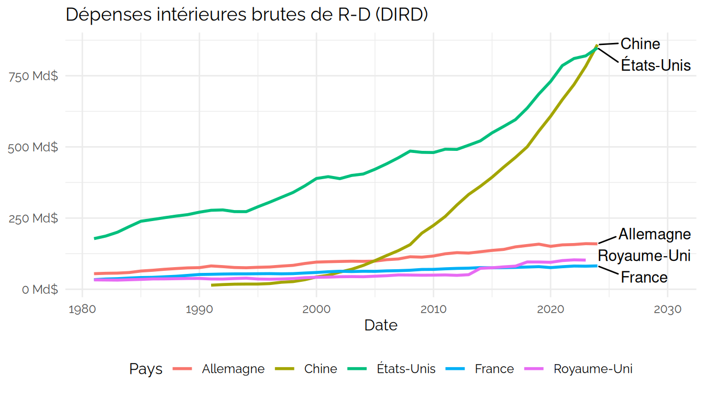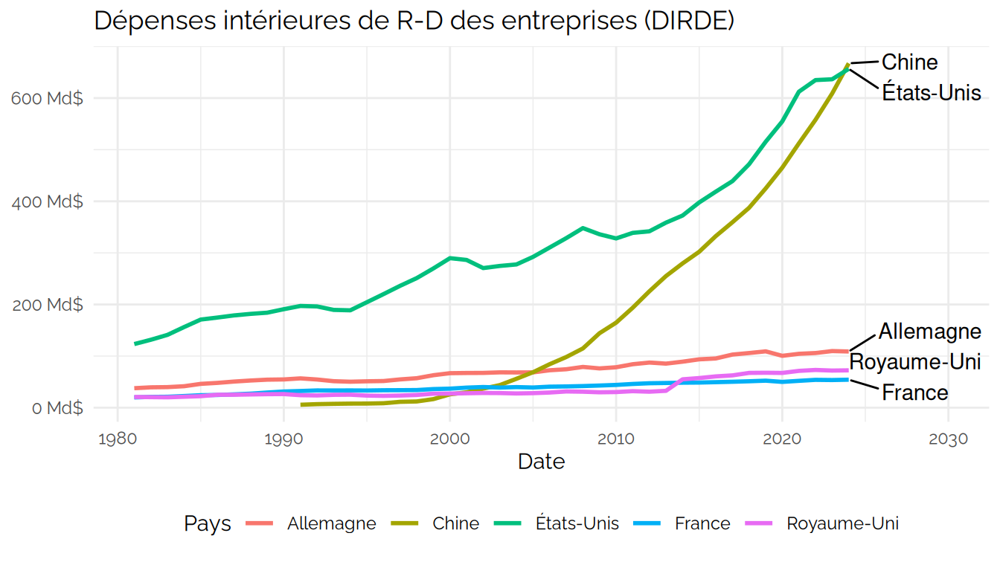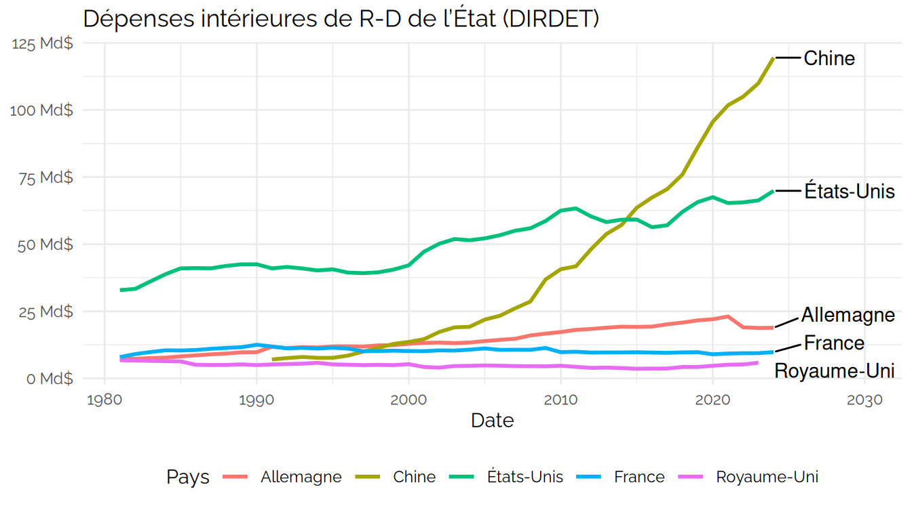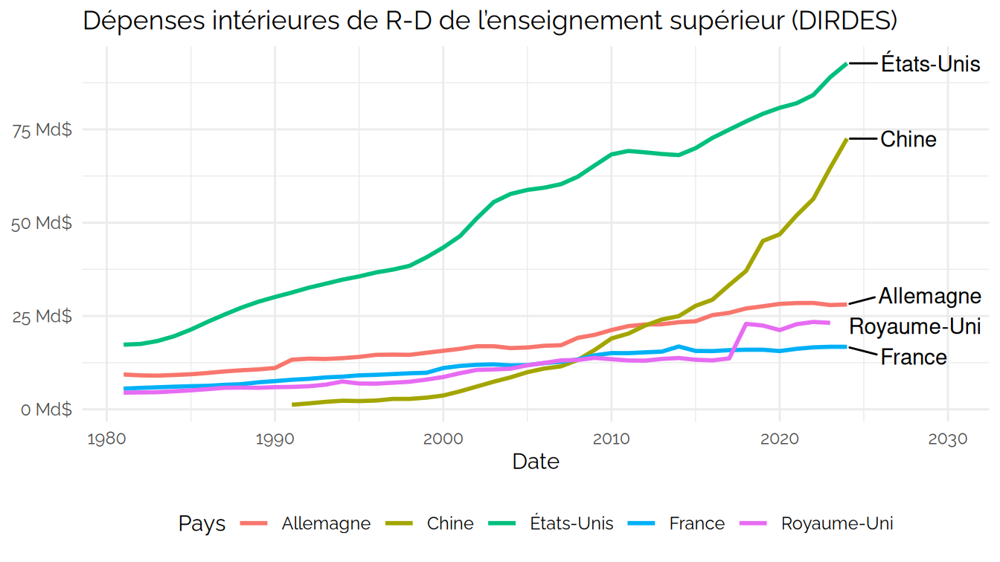

### vs Corp

    ## Joining with `by = join_by(Date)`

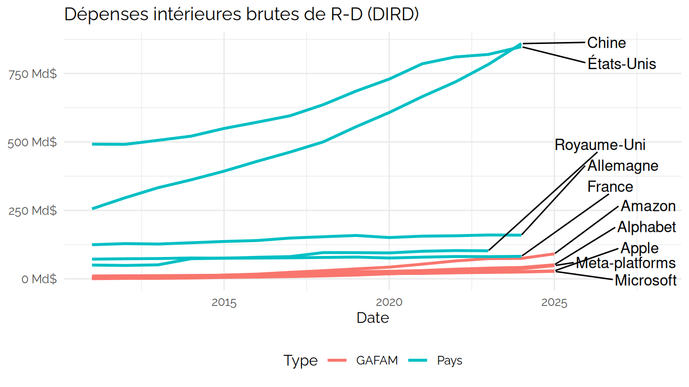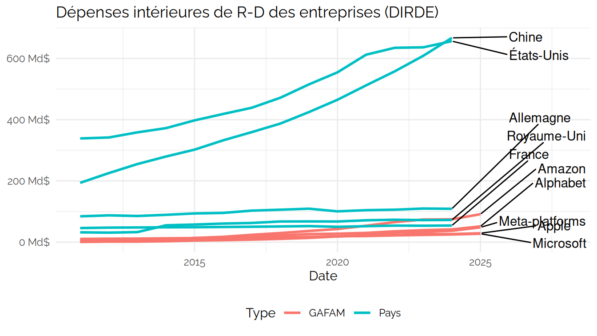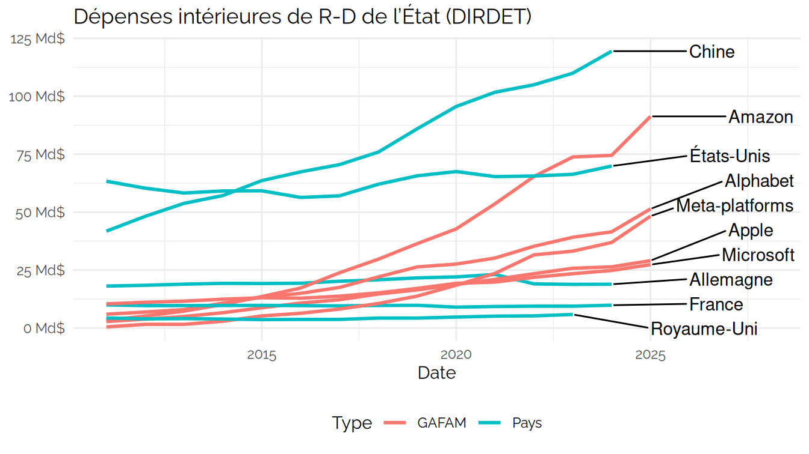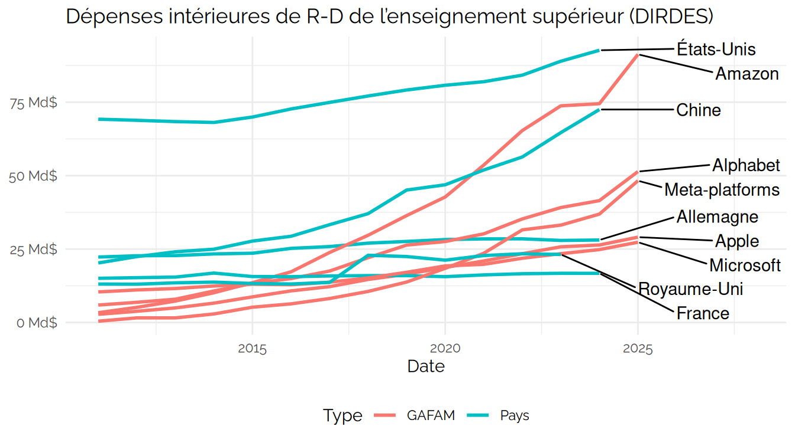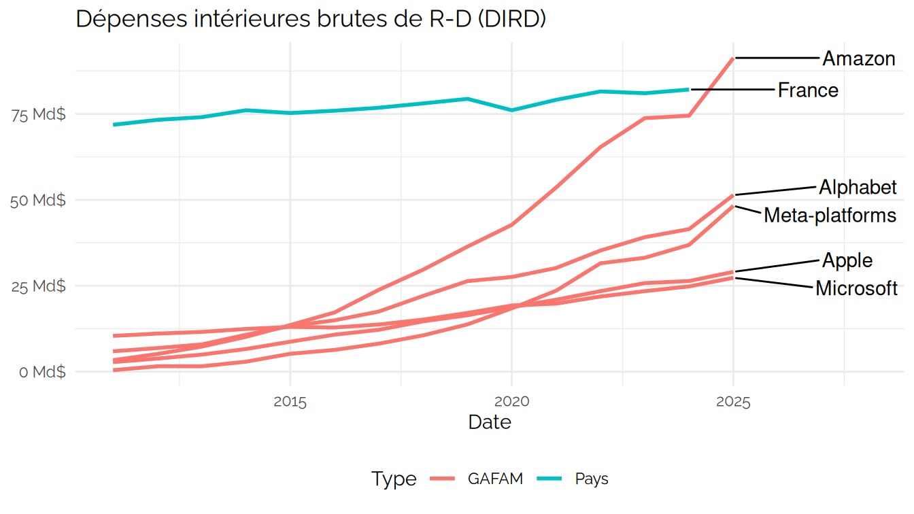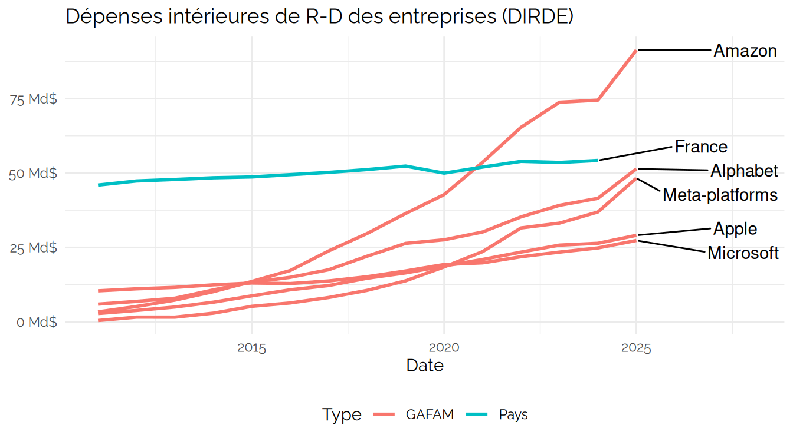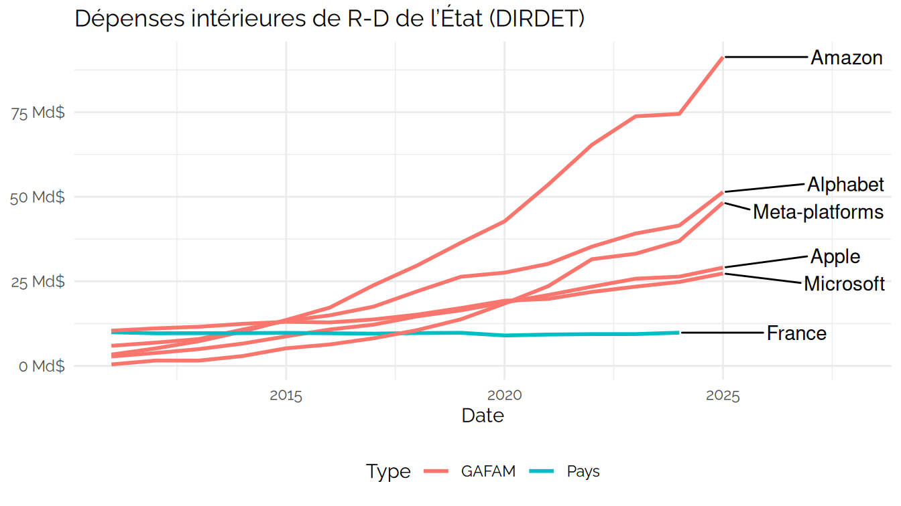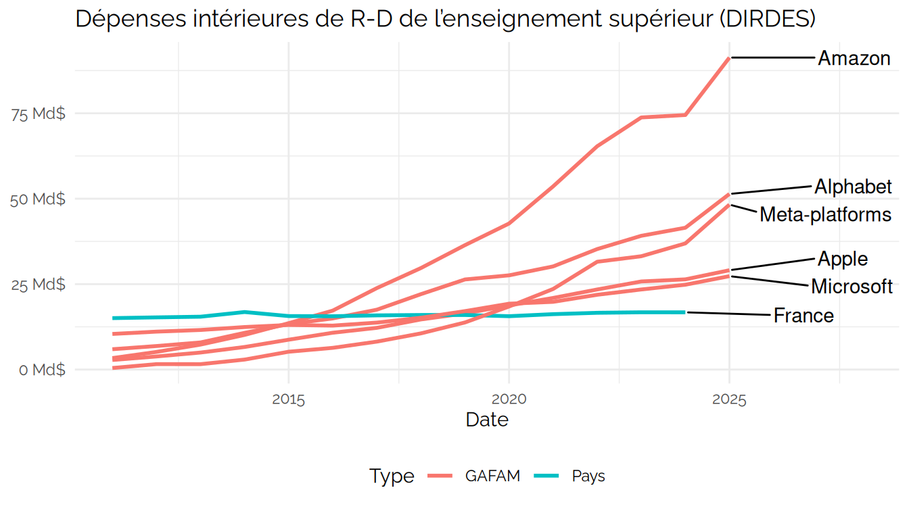

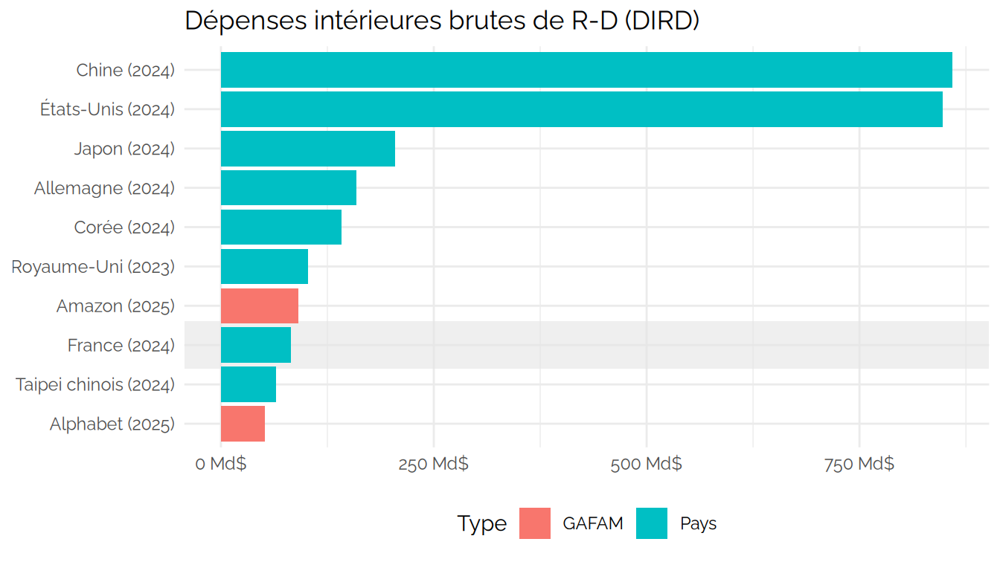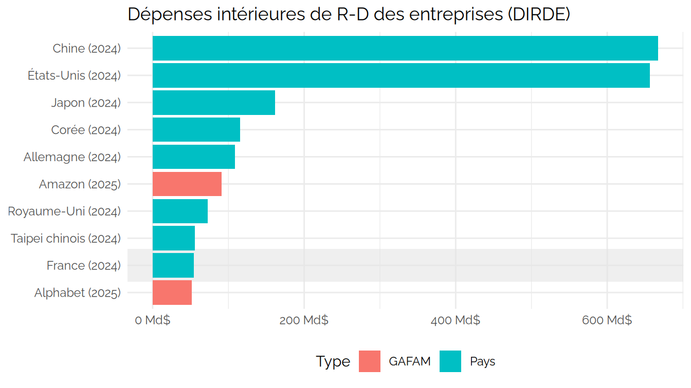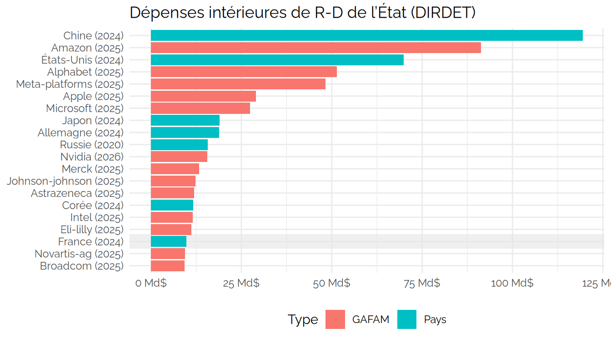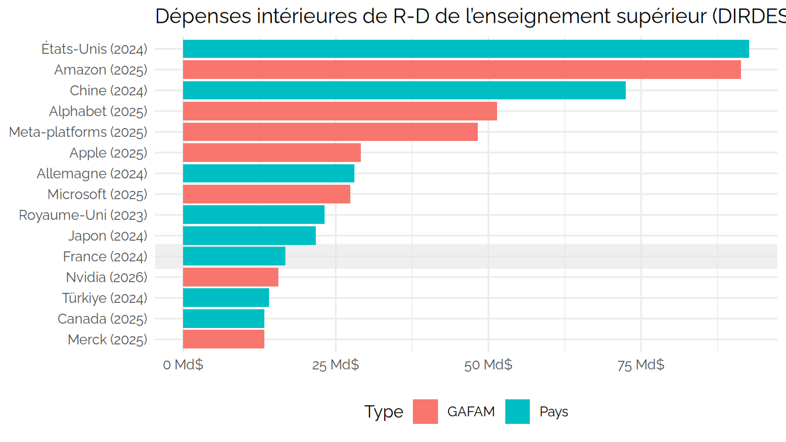
