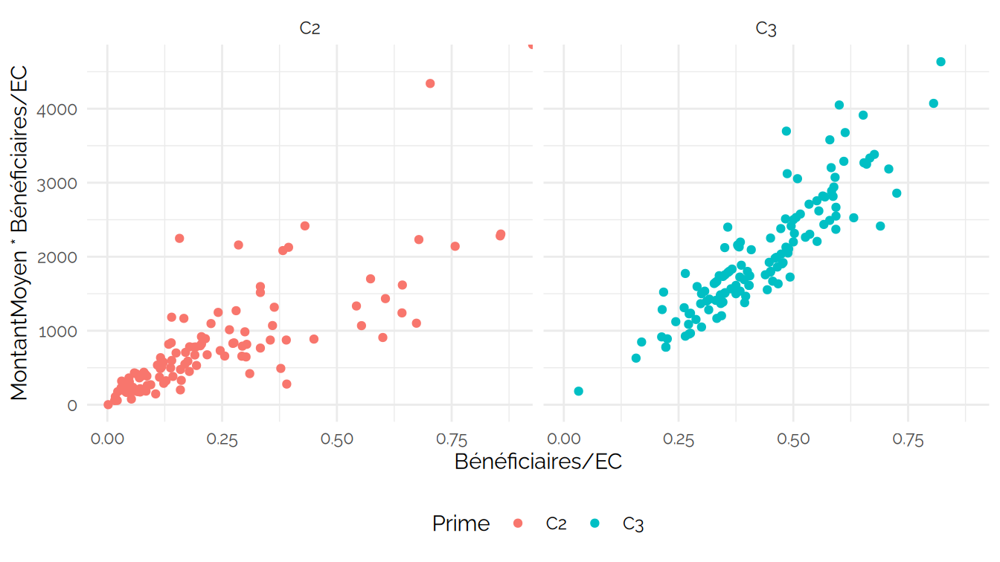
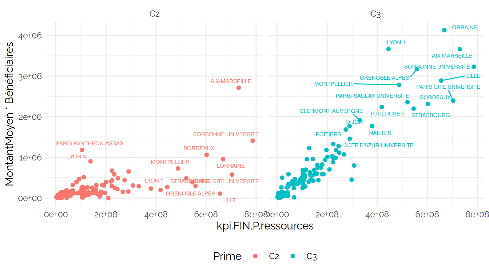

CPESR
================
CPESR
2024-12-18

## Données

- url source

<!-- -->

    ## New names:
    ## New names:
    ## New names:
    ## New names:
    ## New names:
    ## Joining with `by = join_by(UAI, Etablissement, Prime)`
    ## Joining with `by = join_by(UAI, Etablissement, Prime)`
    ## Joining with `by = join_by(UAI, Prime)`
    ## Joining with `by = join_by(pid, Etablissement, Groupe, Groupe.détaillé,
    ## Comparable)`
    ## • `` -> `...1`
    ## • `Effectif` -> `Effectif...3`
    ## • `Part de femmes` -> `Part.de.femmes...4`
    ## • `Part de MCF` -> `Part.de.MCF...5`
    ## • `Effectif` -> `Effectif...6`
    ## • `Part de femmes` -> `Part.de.femmes...7`
    ## • `Part de MCF` -> `Part.de.MCF...8`
    ## • `% bénéficiaires parmi les EC` -> `..bénéficiaires.parmi.les.EC`
    ## • `Effectif` -> `Effectif...10`
    ## • `Dont part de MCF` -> `Dont.part.de.MCF...11`
    ## • `Effectif` -> `Effectif...12`
    ## • `Dont part de MCF` -> `Dont.part.de.MCF...13`
    ## • `` -> `...14`
    ## • `` -> `...15`
    ## • `Femme` -> `Femme...16`
    ## • `Homme` -> `Homme...17`
    ## • `` -> `...18`
    ## • `Femme` -> `Femme...19`
    ## • `Homme` -> `Homme...20`
    ## • `` -> `...21`
    ## • `` -> `...22`
    ## • `Femme` -> `Femme...23`
    ## • `Homme` -> `Homme...24`
    ## • `` -> `...25`
    ## • `Femme` -> `Femme...26`
    ## • `Homme` -> `Homme...27`
    ## • `` -> `...28`
    ## • `` -> `...29`

    ##  [1] "UAI"            "Etablissement"  "Prime"          "EC"            
    ##  [5] "Bénéficiaires"  "MontantMoyen"   "Candidats.2022" "Lauréats.2022" 
    ##  [9] "Candidats.2023" "Lauréats.2023"

## Check

Etablissements sans groupe

| UAI | Etablissement.x | Groupe |
|:----|:----------------|:-------|

Groupes et périmètres

| Groupe                   | PerimEx | TypeEtablissement |
|:-------------------------|:--------|:------------------|
| Autres établissements    |         | Autres            |
| Ecoles d’ingénieurs      |         | Autres            |
| Ecoles d’ingénieurs      | NA      | Autres            |
| Regroupements            |         | Autres            |
| Universités et assimilés | IDEx    | Univ. IDEx        |
| Universités et assimilés |         | Univ. NINI        |
| Universités et assimilés | ISITE   | Univ. ISITE       |
| Universités et assimilés | NA      | Univ. NINI        |

## Explorations

