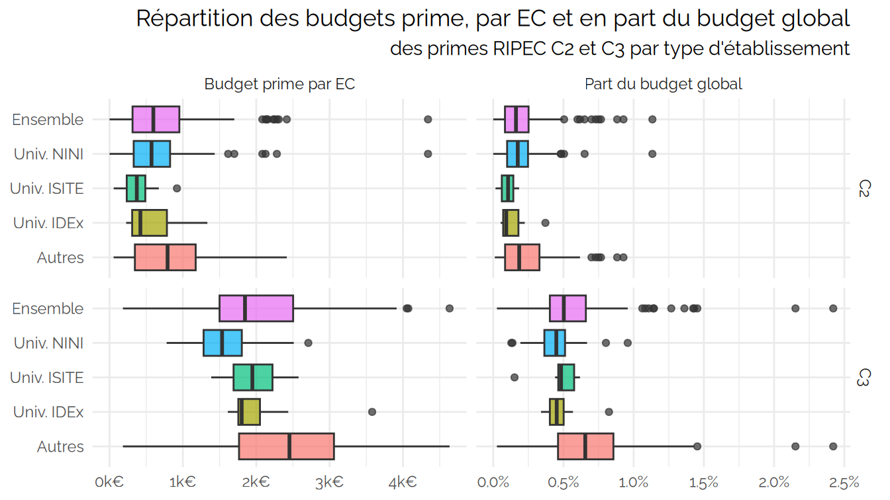
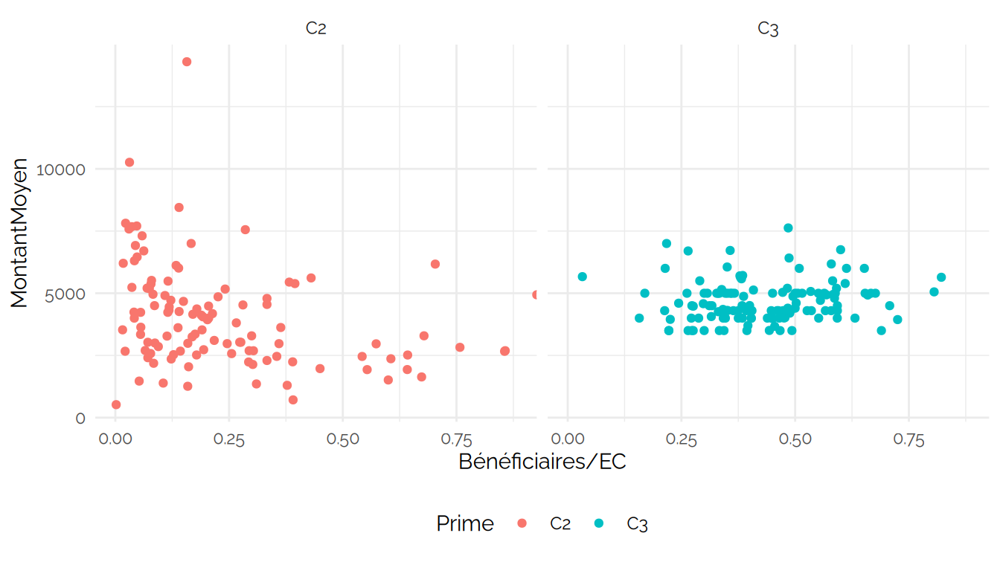
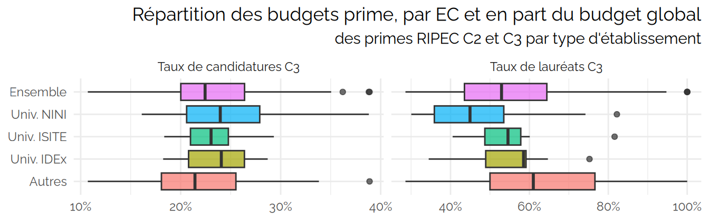

CPESR
================
CPESR
2024-12-24

## Données

- url source

<!-- -->

    ## New names:
    ## New names:
    ## New names:
    ## New names:
    ## New names:
    ## Joining with `by = join_by(UAI, Etablissement, Prime)`
    ## Joining with `by = join_by(UAI, Etablissement, Prime)`
    ## Joining with `by = join_by(UAI, Prime)`
    ## Joining with `by = join_by(pid, Etablissement, Groupe, Groupe.détaillé,
    ## Comparable)`
    ## • `` -> `...1`
    ## • `Effectif` -> `Effectif...3`
    ## • `Part de femmes` -> `Part.de.femmes...4`
    ## • `Part de MCF` -> `Part.de.MCF...5`
    ## • `Effectif` -> `Effectif...6`
    ## • `Part de femmes` -> `Part.de.femmes...7`
    ## • `Part de MCF` -> `Part.de.MCF...8`
    ## • `% bénéficiaires parmi les EC` -> `..bénéficiaires.parmi.les.EC`
    ## • `Effectif` -> `Effectif...10`
    ## • `Dont part de MCF` -> `Dont.part.de.MCF...11`
    ## • `Effectif` -> `Effectif...12`
    ## • `Dont part de MCF` -> `Dont.part.de.MCF...13`
    ## • `` -> `...14`
    ## • `` -> `...15`
    ## • `Femme` -> `Femme...16`
    ## • `Homme` -> `Homme...17`
    ## • `` -> `...18`
    ## • `Femme` -> `Femme...19`
    ## • `Homme` -> `Homme...20`
    ## • `` -> `...21`
    ## • `` -> `...22`
    ## • `Femme` -> `Femme...23`
    ## • `Homme` -> `Homme...24`
    ## • `` -> `...25`
    ## • `Femme` -> `Femme...26`
    ## • `Homme` -> `Homme...27`
    ## • `` -> `...28`
    ## • `` -> `...29`

    ##  [1] "UAI"            "Etablissement"  "Prime"          "EC"            
    ##  [5] "Bénéficiaires"  "MontantMoyen"   "Candidats.2022" "Lauréats.2022" 
    ##  [9] "Candidats.2023" "Lauréats.2023"

## Check

Etablissements sans groupe

| UAI | Etablissement.x | Groupe |
|:----|:----------------|:-------|

Groupes et périmètres

| Groupe                   | PerimEx | TypeEtablissement |
|:-------------------------|:--------|:------------------|
| Autres établissements    |         | Autres            |
| Ecoles d’ingénieurs      |         | Autres            |
| Ecoles d’ingénieurs      | NA      | Autres            |
| Regroupements            |         | Autres            |
| Universités et assimilés | IDEx    | Univ. IDEx        |
| Universités et assimilés |         | Univ. NINI        |
| Universités et assimilés | ISITE   | Univ. ISITE       |
| Universités et assimilés | NA      | Univ. NINI        |

## Explorations

MontantMoyen

| Prime | TypeEtablissement |  min |   max | median |
|:------|:------------------|-----:|------:|-------:|
| C2    | Autres            | 1261 | 14305 | 3443.0 |
| C2    | Univ. IDEx        | 2243 |  7582 | 4502.0 |
| C2    | Univ. ISITE       | 2531 |  4959 | 3634.0 |
| C2    | Univ. NINI        |  522 | 10263 | 3317.0 |
| C2    | Ensemble          |  522 | 14305 | 3619.0 |
| C3    | Autres            | 3500 |  7625 | 4942.5 |
| C3    | Univ. IDEx        | 3982 |  6177 | 4200.0 |
| C3    | Univ. ISITE       | 3505 |  5000 | 4504.5 |
| C3    | Univ. NINI        | 3500 |  6055 | 4300.0 |
| C3    | Ensemble          | 3500 |  7625 | 4500.0 |

Taux de bénéficiaires

| Prime | TypeEtablissement | min | max | median |
|:------|:------------------|----:|----:|-------:|
| C2    | Autres            |   0 |  86 |   16.0 |
| C2    | Univ. IDEx        |   3 |  54 |    9.0 |
| C2    | Univ. ISITE       |   0 |  20 |    9.5 |
| C2    | Univ. NINI        |   0 |  86 |   16.0 |
| C2    | Ensemble          |   0 |  86 |   16.0 |
| C3    | Autres            |   0 |  88 |   51.0 |
| C3    | Univ. IDEx        |  34 |  58 |   45.0 |
| C3    | Univ. ISITE       |  35 |  52 |   45.0 |
| C3    | Univ. NINI        |  17 |  53 |   35.0 |
| C3    | Ensemble          |   0 |  88 |   40.5 |

