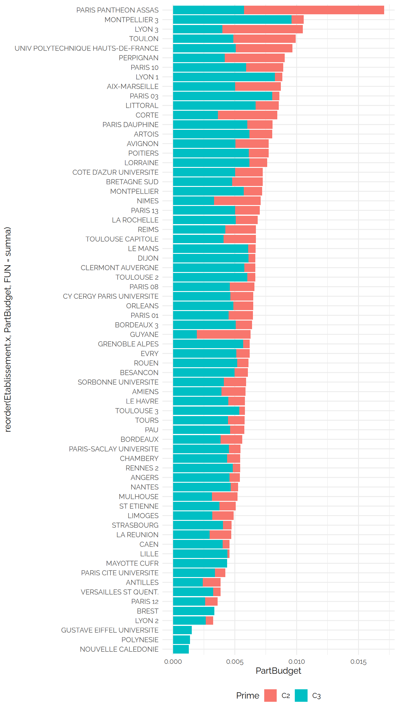
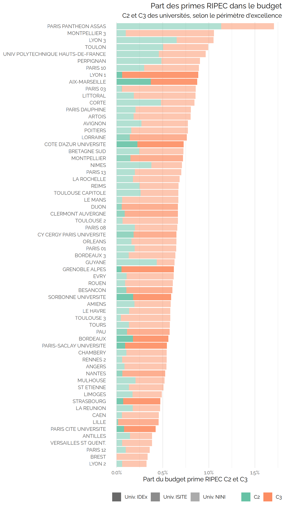
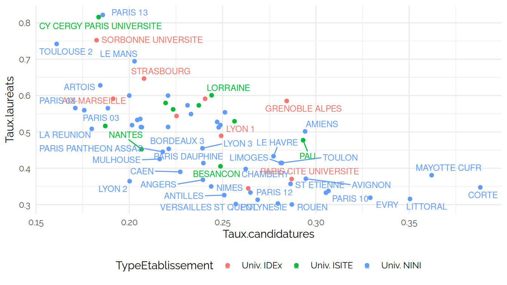
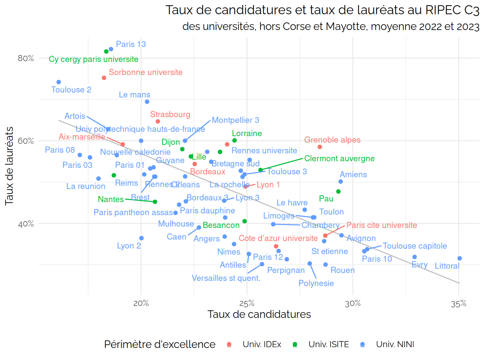

CPESR
================
CPESR
2025-01-01

## Données

- url source

<!-- -->

    ## New names:
    ## New names:
    ## New names:
    ## New names:
    ## New names:
    ## Joining with `by = join_by(UAI, Etablissement, Prime)`
    ## Joining with `by = join_by(UAI, Etablissement, Prime)`
    ## Joining with `by = join_by(UAI, Prime)`
    ## Joining with `by = join_by(pid, Etablissement, Groupe, Groupe.détaillé,
    ## Comparable)`
    ## • `` -> `...1`
    ## • `Effectif` -> `Effectif...3`
    ## • `Part de femmes` -> `Part.de.femmes...4`
    ## • `Part de MCF` -> `Part.de.MCF...5`
    ## • `Effectif` -> `Effectif...6`
    ## • `Part de femmes` -> `Part.de.femmes...7`
    ## • `Part de MCF` -> `Part.de.MCF...8`
    ## • `% bénéficiaires parmi les EC` -> `..bénéficiaires.parmi.les.EC`
    ## • `Effectif` -> `Effectif...10`
    ## • `Dont part de MCF` -> `Dont.part.de.MCF...11`
    ## • `Effectif` -> `Effectif...12`
    ## • `Dont part de MCF` -> `Dont.part.de.MCF...13`
    ## • `` -> `...14`
    ## • `` -> `...15`
    ## • `Femme` -> `Femme...16`
    ## • `Homme` -> `Homme...17`
    ## • `` -> `...18`
    ## • `Femme` -> `Femme...19`
    ## • `Homme` -> `Homme...20`
    ## • `` -> `...21`
    ## • `` -> `...22`
    ## • `Femme` -> `Femme...23`
    ## • `Homme` -> `Homme...24`
    ## • `` -> `...25`
    ## • `Femme` -> `Femme...26`
    ## • `Homme` -> `Homme...27`
    ## • `` -> `...28`
    ## • `` -> `...29`

    ##  [1] "UAI"            "Etablissement"  "Prime"          "EC"            
    ##  [5] "Bénéficiaires"  "MontantMoyen"   "Candidats.2022" "Lauréats.2022" 
    ##  [9] "Candidats.2023" "Lauréats.2023"

## Check

Etablissements sans groupe

| UAI | Etablissement.x | Groupe |
|:----|:----------------|:-------|

Groupes et périmètres

| Groupe                   | PerimEx | TypeEtablissement |
|:-------------------------|:--------|:------------------|
| Autres établissements    |         | Autres            |
| Ecoles d’ingénieurs      |         | Autres            |
| Ecoles d’ingénieurs      | NA      | Autres            |
| Regroupements            |         | Autres            |
| Universités et assimilés | IDEx    | Univ. IDEx        |
| Universités et assimilés |         | Univ. NINI        |
| Universités et assimilés | ISITE   | Univ. ISITE       |
| Universités et assimilés | NA      | Univ. NINI        |

## Explorations

MontantMoyen

| Prime | TypeEtablissement |  min |   max | median |
|:------|:------------------|-----:|------:|-------:|
| C2    | Autres            | 1261 | 14305 | 3443.0 |
| C2    | Univ. IDEx        | 2243 |  7582 | 4502.0 |
| C2    | Univ. ISITE       | 2531 |  4959 | 3634.0 |
| C2    | Univ. NINI        |  522 | 10263 | 3317.0 |
| C2    | Ensemble          |  522 | 14305 | 3619.0 |
| C3    | Autres            | 3500 |  7625 | 4942.5 |
| C3    | Univ. IDEx        | 3982 |  6177 | 4200.0 |
| C3    | Univ. ISITE       | 3505 |  5000 | 4504.5 |
| C3    | Univ. NINI        | 3500 |  6055 | 4300.0 |
| C3    | Ensemble          | 3500 |  7625 | 4500.0 |

Taux de bénéficiaires

| Prime | TypeEtablissement | min | max | median |
|:------|:------------------|----:|----:|-------:|
| C2    | Autres            |   0 |  86 |   16.0 |
| C2    | Univ. IDEx        |   3 |  54 |    9.0 |
| C2    | Univ. ISITE       |   0 |  20 |    9.5 |
| C2    | Univ. NINI        |   0 |  86 |   16.0 |
| C2    | Ensemble          |   0 |  86 |   16.0 |
| C3    | Autres            |   0 |  88 |   51.0 |
| C3    | Univ. IDEx        |  34 |  58 |   45.0 |
| C3    | Univ. ISITE       |  35 |  52 |   45.0 |
| C3    | Univ. NINI        |  17 |  53 |   35.0 |
| C3    | Ensemble          |   0 |  88 |   40.5 |

MontantMoyen

| Prime | Typologie                                         |  min |   max | median |
|:------|:--------------------------------------------------|-----:|------:|-------:|
| C2    | Université scientifique et/ou médicale            | 2185 |  6306 | 4939.0 |
| C2    | Université pluridisciplinaire avec santé          |  522 | 10263 | 3843.5 |
| C2    | Université pluridisciplinaire hors santé          | 2367 |  7814 | 4317.0 |
| C2    | Université tertiaire lettres et sciences Humaines |  714 |  4241 | 2866.0 |
| C2    | Université tertiaire droit et économie            | 1636 |  6172 | 2451.5 |
| C2    | NA                                                | 1261 | 14305 | 3529.0 |
| C3    | Université scientifique et/ou médicale            | 4000 |  6177 | 4250.0 |
| C3    | Université pluridisciplinaire avec santé          | 3500 |  5150 | 4300.0 |
| C3    | Université pluridisciplinaire hors santé          | 3500 |  6055 | 4300.0 |
| C3    | Université tertiaire lettres et sciences Humaines | 3500 |  5200 | 4400.0 |
| C3    | Université tertiaire droit et économie            | 4000 |  5714 | 4750.0 |
| C3    | NA                                                | 3500 |  7625 | 4950.0 |

Taux de bénéficiaires

| Prime | Typologie                                         | min | max | median |
|:------|:--------------------------------------------------|----:|----:|-------:|
| C2    | Université scientifique et/ou médicale            |   4 |   9 |    8.0 |
| C2    | Université pluridisciplinaire avec santé          |   0 |  57 |   12.5 |
| C2    | Université pluridisciplinaire hors santé          |   0 |  64 |   17.0 |
| C2    | Université tertiaire lettres et sciences Humaines |   4 |  39 |   10.5 |
| C2    | Université tertiaire droit et économie            |  29 |  86 |   68.5 |
| C2    | NA                                                |   0 |  86 |   16.0 |
| C3    | Université scientifique et/ou médicale            |  40 |  58 |   49.0 |
| C3    | Université pluridisciplinaire avec santé          |  17 |  57 |   36.0 |
| C3    | Université pluridisciplinaire hors santé          |  21 |  50 |   36.5 |
| C3    | Université tertiaire lettres et sciences Humaines |  22 |  53 |   34.0 |
| C3    | Université tertiaire droit et économie            |  31 |  38 |   36.5 |
| C3    | NA                                                |   0 |  88 |   50.0 |

Budget prime par EC

| Prime | TypeEtablissement |          min |       max |    median |
|:------|:------------------|-------------:|----------:|----------:|
| C2    | Autres            |   56.0158730 | 2416.5823 |  791.4706 |
| C2    | Univ. IDEx        |  227.2851653 | 1334.1254 |  421.0966 |
| C2    | Univ. ISITE       |   57.4287251 |  919.4279 |  372.3886 |
| C2    | Univ. NINI        |    0.9525547 | 4340.7473 |  572.9921 |
| C2    | Ensemble          |    0.9525547 | 4340.7473 |  597.8972 |
| C3    | Autres            |  182.8064516 | 4634.5000 | 2452.4675 |
| C3    | Univ. IDEx        | 1612.3822342 | 3579.6468 | 1801.5568 |
| C3    | Univ. ISITE       | 1386.5030675 | 2576.3182 | 1947.0006 |
| C3    | Univ. NINI        |  778.4697509 | 2709.5453 | 1534.5269 |
| C3    | Ensemble          |  182.8064516 | 4634.5000 | 1846.6027 |

Part du budget global

| Prime | TypeEtablissement |       min |       max |    median |
|:------|:------------------|----------:|----------:|----------:|
| C2    | Autres            | 0.0001135 | 0.0092757 | 0.0018509 |
| C2    | Univ. IDEx        | 0.0005297 | 0.0037146 | 0.0009284 |
| C2    | Univ. ISITE       | 0.0001628 | 0.0018457 | 0.0010581 |
| C2    | Univ. NINI        | 0.0000025 | 0.0113348 | 0.0017474 |
| C2    | Ensemble          | 0.0000025 | 0.0113348 | 0.0016210 |
| C3    | Autres            | 0.0002648 | 0.0242129 | 0.0065539 |
| C3    | Univ. IDEx        | 0.0034048 | 0.0082413 | 0.0045211 |
| C3    | Univ. ISITE       | 0.0015177 | 0.0061767 | 0.0048273 |
| C3    | Univ. NINI        | 0.0012891 | 0.0095772 | 0.0044923 |
| C3    | Ensemble          | 0.0002648 | 0.0242129 | 0.0050261 |

    ## `geom_smooth()` using formula = 'y ~ x'

    ## `geom_smooth()` using formula = 'y ~ x'

Données unnamed-chunk-16

| UAI | Etablissement.x | Prime | EC | Bénéficiaires | MontantMoyen | Candidats.2022 | Lauréats.2022 | Candidats.2023 | Lauréats.2023 | pid | Etablissement.y | Groupe | Groupe.détaillé | Type | nb_datasets | PerimEx | Association | Comparable | Sigle | Typologie | Secteur | Statut | EPE | Fusion | Vague | Académie | url.siteweb | url.wikidata | url.legifrance | twitter | siren | siret | dataset | Rattachement | Plotable | Rentrée | kpi.ENS.P.effectif | kpi.ENS.S.titulaires | kpi.ENS.S.EC | kpi.ENS.S.DocATER | kpi.ENS.S.contractuels | kpi.ETU.P.effectif | kpi.ETU.S.cycle1_L | kpi.ETU.S.cycle2_M | kpi.ETU.S.cycle3_D | kpi.ETU.S.DU_DE | kpi.BIA.P.effectif | kpi.BIA.S.A | kpi.BIA.S.B | kpi.BIA.S.C | kpi.BIA.S.titulaires | kpi.FIN.P.ressources | kpi.FIN.S.masseSalariale | kpi.FIN.S.SCSP | kpi.FIN.S.recettesFormation | kpi.FIN.S.recettesRecherche | kpi.FIN.S.investissements | kpi.IMO.P.batiments | kpi.IMO.S.état_satisfaisant | kpi.IMO.S.énergie_ABC | kpi.IMO.S.GES_ABC | kpi.IMO.S.propriété_propre | kpi.K.dotPres | kpi.K.resPetu | kpi.K.forPetu | kpi.K.recPect | kpi.K.ensPetu | kpi.K.titPper | kpi.K.biaPper | kpi.K.dotPetu | TypeEtablissement | BudgetPrime | PartBudget | PartParPrime |
|:---|:---|:---|---:|---:|---:|---:|---:|---:|---:|:---|:---|:---|:---|:---|---:|:---|:---|:---|:---|:---|:---|:---|:---|:---|:---|:---|:---|:---|:---|:---|:---|:---|:---|:---|:---|---:|---:|---:|---:|---:|---:|---:|---:|---:|---:|---:|---:|---:|---:|---:|---:|---:|---:|---:|---:|---:|---:|---:|---:|---:|---:|---:|---:|---:|---:|---:|---:|---:|---:|---:|:---|---:|---:|---:|
| 0756305W | PARIS PANTHEON ASSAS | C2 | 273 | 192 | 6172 | NA | NA | NA | NA | TWBzp | Université Panthéon-Assas | Universités et assimilés | Universités et assimilés | Université | 6 |  |  | FALSE | Assas | Université tertiaire |  |  |  |  |  |  |  |  |  |  |  |  |  |  |  |  |  |  |  |  |  |  |  |  |  |  |  |  |  |  |  |  |  |  |  |  |  |  |  |  |  |  |  |  |  |  |  |  |  |  |  |  |  |  |
| droit et économie | Public | NA | NA | NA | NA | Paris | <https://www.u-paris2.fr/fr> | <https://www.wikidata.org/entity/Q662976> | <https://www.legifrance.gouv.fr/jorf/id/JORFTEXT000042393667/> | <https://twitter.com/AssasParis2> | 197517188 | 19751718800011 | etab.21.2 | NA | TRUE | 2023 | NA | NA | NA | NA | NA | NA | NA | NA | NA | NA | NA | NA | NA | NA | NA | 104547280 | 81750000 | 76903000 | 15726000 | 2042280 | 15074000 | NA | NA | NA | NA | NA | 0.7355811 | NA | NA | NA | NA | NA | NA | NA | Univ. NINI | 1185024 | 0.0113348 | 0.6638812 |  |  |  |  |  |  |  |  |  |  |  |  |  |  |  |  |  |  |  |  |
| 0341089Z | MONTPELLIER 3 | C3 | 453 | 242 | 5072 | 86 | 40 | 114 | 80 | 1I7hJ | Université Paul-Valéry - Montpellier 3 | Universités et assimilés | Universités et assimilés | Université | 6 |  | AUREF | TRUE | UPV | Université tertiaire |  |  |  |  |  |  |  |  |  |  |  |  |  |  |  |  |  |  |  |  |  |  |  |  |  |  |  |  |  |  |  |  |  |  |  |  |  |  |  |  |  |  |  |  |  |  |  |  |  |  |  |  |  |  |
| lettres et sciences Humaines | public | EPSCP | NA | NA | Vague A | Montpellier | <https://www.univ-montp3.fr/> | <https://www.wikidata.org/entity/Q2912244> | <https://www.legifrance.gouv.fr/jorf/id/JORFTEXT000000511402/> | <https://twitter.com/univpaulvalery> | 193410891 | 19341089100017 | etab.24 | NA | TRUE | 2023 | NA | NA | NA | NA | NA | NA | NA | NA | NA | NA | NA | NA | NA | NA | NA | 128161355 | 109465300 | 103981159 | 7035739 | 5953748 | 34113665 | NA | NA | NA | NA | NA | 0.8113301 | NA | NA | NA | NA | NA | NA | NA | Univ. NINI | 1227424 | 0.0095772 | 0.9066496 |  |  |  |  |  |  |  |  |  |  |  |  |  |  |  |  |  |  |  |  |
| 0691774D | LYON 1 | C3 | 1025 | 594 | 6177 | 270 | 123 | 241 | 127 | etBz7 | Université Claude Bernard - Lyon 1 | Universités et assimilés | Universités et assimilés | Université | 6 | IDEx | Udice | TRUE | Lyon I | Université scientifique |  |  |  |  |  |  |  |  |  |  |  |  |  |  |  |  |  |  |  |  |  |  |  |  |  |  |  |  |  |  |  |  |  |  |  |  |  |  |  |  |  |  |  |  |  |  |  |  |  |  |  |  |  |  |
| et/ou médicale | public | EPSCP | NA | NA | Vague A | Lyon | <https://www.univ-lyon1.fr/> | <https://www.wikidata.org/entity/Q4032> | <https://www.legifrance.gouv.fr/jorf/id/JORFTEXT000000850542/> | <https://twitter.com/UnivLyon1> | 196917744 | 19691774400019 | etab.24 | NA | TRUE | 2023 | NA | NA | NA | NA | NA | NA | NA | NA | NA | NA | NA | NA | NA | NA | NA | 445214750 | 348547182 | 331106855 | 29497574 | 30923321 | 42995936 | NA | NA | NA | NA | NA | 0.7437014 | NA | NA | NA | NA | NA | NA | NA | Univ. IDEx | 3669138 | 0.0082413 | 0.9311833 |  |  |  |  |  |  |  |  |  |  |  |  |  |  |  |  |  |  |  |  |
| 0751719L | PARIS 03 | C3 | 381 | 184 | 5200 | 61 | 30 | 73 | 45 | 8k883 | Université Sorbonne Nouvelle - Paris 3 | Universités et assimilés | Universités et assimilés | Université | 6 |  |  | TRUE | Paris III | Université tertiaire |  |  |  |  |  |  |  |  |  |  |  |  |  |  |  |  |  |  |  |  |  |  |  |  |  |  |  |  |  |  |  |  |  |  |  |  |  |  |  |  |  |  |  |  |  |  |  |  |  |  |  |  |  |  |
| lettres et sciences Humaines | public | EPSCP | NA | NA | Vague D | Paris | <http://www.univ-paris3.fr/> | <https://www.wikidata.org/entity/Q571293> | <https://www.legifrance.gouv.fr/jorf/id/JORFTEXT000000511402/> | <https://twitter.com/SorbonneParis3> | 197517196 | 19751719600014 | etab.24 | NA | TRUE | 2023 | NA | NA | NA | NA | NA | NA | NA | NA | NA | NA | NA | NA | NA | NA | NA | 119213248 | 102266464 | 103386938 | 5608119 | 2060414 | 3279999 | NA | NA | NA | NA | NA | 0.8672437 | NA | NA | NA | NA | NA | NA | NA | Univ. NINI | 956800 | 0.0080260 | 0.9341013 |  |  |  |  |  |  |  |  |  |  |  |  |  |  |  |  |  |  |  |  |
| 0595964M | LITTORAL | C3 | 321 | 122 | 5634 | 128 | 30 | 97 | 41 | yH19Y | Université du Littoral Côte d’Opale | Universités et assimilés | Universités et assimilés | Université | 6 |  | AUREF | TRUE | ULCO | Université pluridisciplinaire |  |  |  |  |  |  |  |  |  |  |  |  |  |  |  |  |  |  |  |  |  |  |  |  |  |  |  |  |  |  |  |  |  |  |  |  |  |  |  |  |  |  |  |  |  |  |  |  |  |  |  |  |  |  |
| hors santé | public | EPSCP | NA | NA | Vague E | Lille | <http://www.univ-littoral.fr/> | <https://www.wikidata.org/entity/Q3551755> | <https://www.legifrance.gouv.fr/jorf/id/JORFTEXT000000538668/> | <https://twitter.com/ULCO_Univ> | 195944038 | 19594403800205 | etab.24 | NA | TRUE | 2023 | NA | NA | NA | NA | NA | NA | NA | NA | NA | NA | NA | NA | NA | NA | NA | 102857850 | 86041063 | 79359937 | 10127638 | 5882510 | 16343754 | NA | NA | NA | NA | NA | 0.7715496 | NA | NA | NA | NA | NA | NA | NA | Univ. NINI | 687348 | 0.0066825 | 0.7817231 |  |  |  |  |  |  |  |  |  |  |  |  |  |  |  |  |  |  |  |  |
| 0692437Z | LYON 3 | C2 | 395 | 338 | 2666 | NA | NA | NA | NA | 7Gzub | Université Jean Moulin - Lyon 3 | Universités et assimilés | Universités et assimilés | Université | 6 |  |  | TRUE | Lyon III | Université tertiaire |  |  |  |  |  |  |  |  |  |  |  |  |  |  |  |  |  |  |  |  |  |  |  |  |  |  |  |  |  |  |  |  |  |  |  |  |  |  |  |  |  |  |  |  |  |  |  |  |  |  |  |  |  |  |
| droit et économie | public | EPSCP | NA | NA | Vague A | Lyon | <http://www.univ-lyon3.fr/> | <https://www.wikidata.org/entity/Q4027> | <https://www.legifrance.gouv.fr/jorf/id/JORFTEXT000000500622/> | <https://twitter.com/UJML> | 196924377 | 19692437700282,19692437700019 | etab.24 | NA | TRUE | 2023 | NA | NA | NA | NA | NA | NA | NA | NA | NA | NA | NA | NA | NA | NA | NA | 138474896 | 109701066 | 100653460 | 21356916 | 926118 | 9829334 | NA | NA | NA | NA | NA | 0.7268715 | NA | NA | NA | NA | NA | NA | NA | Univ. NINI | 901108 | 0.0065074 | 0.6194851 |  |  |  |  |  |  |  |  |  |  |  |  |  |  |  |  |  |  |  |  |

Données unnamed-chunk-17

| UAI | Etablissement.x | Prime | EC | Bénéficiaires | MontantMoyen | Candidats.2022 | Lauréats.2022 | Candidats.2023 | Lauréats.2023 | pid | Etablissement.y | Groupe | Groupe.détaillé | Type | nb_datasets | PerimEx | Association | Comparable | Sigle | Typologie | Secteur | Statut | EPE | Fusion | Vague | Académie | url.siteweb | url.wikidata | url.legifrance | twitter | siren | siret | dataset | Rattachement | Plotable | Rentrée | kpi.ENS.P.effectif | kpi.ENS.S.titulaires | kpi.ENS.S.EC | kpi.ENS.S.DocATER | kpi.ENS.S.contractuels | kpi.ETU.P.effectif | kpi.ETU.S.cycle1_L | kpi.ETU.S.cycle2_M | kpi.ETU.S.cycle3_D | kpi.ETU.S.DU_DE | kpi.BIA.P.effectif | kpi.BIA.S.A | kpi.BIA.S.B | kpi.BIA.S.C | kpi.BIA.S.titulaires | kpi.FIN.P.ressources | kpi.FIN.S.masseSalariale | kpi.FIN.S.SCSP | kpi.FIN.S.recettesFormation | kpi.FIN.S.recettesRecherche | kpi.FIN.S.investissements | kpi.IMO.P.batiments | kpi.IMO.S.état_satisfaisant | kpi.IMO.S.énergie_ABC | kpi.IMO.S.GES_ABC | kpi.IMO.S.propriété_propre | kpi.K.dotPres | kpi.K.resPetu | kpi.K.forPetu | kpi.K.recPect | kpi.K.ensPetu | kpi.K.titPper | kpi.K.biaPper | kpi.K.dotPetu | TypeEtablissement | BudgetPrime | PartParPrime |
|:---|:---|:---|---:|---:|---:|---:|---:|---:|---:|:---|:---|:---|:---|:---|---:|:---|:---|:---|:---|:---|:---|:---|:---|:---|:---|:---|:---|:---|:---|:---|:---|:---|:---|:---|:---|---:|---:|---:|---:|---:|---:|---:|---:|---:|---:|---:|---:|---:|---:|---:|---:|---:|---:|---:|---:|---:|---:|---:|---:|---:|---:|---:|---:|---:|---:|---:|---:|---:|---:|---:|:---|---:|---:|
| 0062205P | COTE D’AZUR UNIVERSITE | C2 | 836 | 161 | 4053 | NA | NA | NA | NA | s3t8T | Université Côte d’Azur | Universités et assimilés | Universités et assimilés | Université | 6 | IDEx | Udice | TRUE | UCA | Université pluridisciplinaire |  |  |  |  |  |  |  |  |  |  |  |  |  |  |  |  |  |  |  |  |  |  |  |  |  |  |  |  |  |  |  |  |  |  |  |  |  |  |  |  |  |  |  |  |  |  |  |  |  |  |  |  |  |
| avec santé | public | EPSCP | TRUE | NA | Vague C | Nice | <https://univ-cotedazur.fr/> | <https://www.wikidata.org/entity/Q80186910> | <https://www.legifrance.gouv.fr/jorf/id/JORFTEXT000038821787/> | <https://twitter.com/Univ_CotedAzur> | 130025661 | 13002566100013 | etab.24 | NA | TRUE | 2023 | NA | NA | NA | NA | NA | NA | NA | NA | NA | NA | NA | NA | NA | NA | NA | 290639104 | 236028182 | 219247158 | 11707115 | 15880606 | 26289966 | NA | NA | NA | NA | NA | 0.7543622 | NA | NA | NA | NA | NA | NA | NA | Univ. IDEx | 652533 | 0.3092598 |  |  |  |  |  |  |  |  |  |  |  |  |  |  |  |  |  |  |  |  |
| 0134009M | AIX-MARSEILLE | C2 | 2033 | 1103 | 2459 | NA | NA | NA | NA | xJdyB | Aix-Marseille Université | Universités et assimilés | Universités et assimilés | Université | 6 | IDEx | Udice | TRUE | AMU | Université pluridisciplinaire |  |  |  |  |  |  |  |  |  |  |  |  |  |  |  |  |  |  |  |  |  |  |  |  |  |  |  |  |  |  |  |  |  |  |  |  |  |  |  |  |  |  |  |  |  |  |  |  |  |  |  |  |  |
| avec santé | public | EPSCP | NA | TRUE | Vague C | Aix-Marseille | <https://www.univ-amu.fr/> | <https://www.wikidata.org/entity/Q2302586> | <https://www.legifrance.gouv.fr/jorf/id/JORFTEXT000024502554/> | <https://twitter.com/univamu> | 130015332 | 13001533200013 | etab.24 | NA | TRUE | 2023 | NA | NA | NA | NA | NA | NA | NA | NA | NA | NA | NA | NA | NA | NA | NA | 730158262 | 586645130 | 559216604 | 51374115 | 64270486 | 122947640 | NA | NA | NA | NA | NA | 0.7658841 | NA | NA | NA | NA | NA | NA | NA | Univ. IDEx | 2712277 | 0.4254658 |  |  |  |  |  |  |  |  |  |  |  |  |  |  |  |  |  |  |  |  |
| 0141408E | CAEN | C2 | 761 | 59 | 2578 | NA | NA | NA | NA | p25Q3 | Université de Caen Normandie | Universités et assimilés | Universités et assimilés | Université | 6 |  | AUREF | TRUE | UNICAEN | Université pluridisciplinaire |  |  |  |  |  |  |  |  |  |  |  |  |  |  |  |  |  |  |  |  |  |  |  |  |  |  |  |  |  |  |  |  |  |  |  |  |  |  |  |  |  |  |  |  |  |  |  |  |  |  |  |  |  |
| avec santé | public | EPSCP | NA | NA | Vague B | Normandie | <http://www.unicaen.fr/> | <https://www.wikidata.org/entity/Q568554> | <https://www.legifrance.gouv.fr/jorf/id/JORFTEXT000000511402/> | <https://twitter.com/universite_caen> | 191414085 | 19141408500016 | etab.24 | NA | TRUE | 2023 | NA | NA | NA | NA | NA | NA | NA | NA | NA | NA | NA | NA | NA | NA | NA | 267632827 | 216578981 | 211606133 | 23370750 | 8128206 | 26965267 | NA | NA | NA | NA | NA | 0.7906584 | NA | NA | NA | NA | NA | NA | NA | Univ. NINI | 152102 | 0.1241529 |  |  |  |  |  |  |  |  |  |  |  |  |  |  |  |  |  |  |  |  |
| 0171463Y | LA ROCHELLE | C2 | 240 | 59 | 2975 | NA | NA | NA | NA | atbEK | La Rochelle Université | Universités et assimilés | Universités et assimilés | Université | 6 |  | AUREF | TRUE | U. La Rochelle | Université pluridisciplinaire |  |  |  |  |  |  |  |  |  |  |  |  |  |  |  |  |  |  |  |  |  |  |  |  |  |  |  |  |  |  |  |  |  |  |  |  |  |  |  |  |  |  |  |  |  |  |  |  |  |  |  |  |  |
| hors santé | public | EPSCP | NA | NA | Vague B | Poitiers | <https://www.univ-larochelle.fr/> | <https://www.wikidata.org/entity/Q1500822> | <https://www.legifrance.gouv.fr/jorf/id/JORFTEXT000000726433/> | <https://twitter.com/UnivLaRochelle> | 191700327 | 19170032700015 | etab.24 | NA | TRUE | 2023 | NA | NA | NA | NA | NA | NA | NA | NA | NA | NA | NA | NA | NA | NA | NA | 99158119 | 80074709 | 68921050 | 2835591 | 6320989 | 18302640 | NA | NA | NA | NA | NA | 0.6950621 | NA | NA | NA | NA | NA | NA | NA | Univ. NINI | 175525 | 0.2588227 |  |  |  |  |  |  |  |  |  |  |  |  |  |  |  |  |  |  |  |  |
| 0211237F | DIJON | C2 | 786 | 44 | 3634 | NA | NA | NA | NA | Lr94O | Université de Bourgogne | Universités et assimilés | Universités et assimilés | Université | 6 | ISITE |  | TRUE | uB | Université pluridisciplinaire |  |  |  |  |  |  |  |  |  |  |  |  |  |  |  |  |  |  |  |  |  |  |  |  |  |  |  |  |  |  |  |  |  |  |  |  |  |  |  |  |  |  |  |  |  |  |  |  |  |  |  |  |  |
| avec santé | public | EPSCP | NA | NA | Vague C | Dijon | <http://www.u-bourgogne.fr/> | <https://www.wikidata.org/entity/Q287072> | <https://www.legifrance.gouv.fr/jorf/id/JORFTEXT000000850542/> | <https://twitter.com/univbourgogne> | 192112373 | 19211237300019 | etab.24 | NA | TRUE | 2023 | NA | NA | NA | NA | NA | NA | NA | NA | NA | NA | NA | NA | NA | NA | NA | 289913340 | 227209357 | 216669852 | 27545133 | 7296366 | 24642165 | NA | NA | NA | NA | NA | 0.7473608 | NA | NA | NA | NA | NA | NA | NA | Univ. ISITE | 159896 | 0.0828521 |  |  |  |  |  |  |  |  |  |  |  |  |  |  |  |  |  |  |  |  |
| 0251215K | BESANCON | C2 | 669 | 76 | 3278 | NA | NA | NA | NA | 7Mpgt | Université de Franche-Comté | Universités et assimilés | Universités et assimilés | Université | 6 | ISITE |  | TRUE | UFC | Université pluridisciplinaire |  |  |  |  |  |  |  |  |  |  |  |  |  |  |  |  |  |  |  |  |  |  |  |  |  |  |  |  |  |  |  |  |  |  |  |  |  |  |  |  |  |  |  |  |  |  |  |  |  |  |  |  |  |
| avec santé | public | EPSCP | NA | NA | Vague C | Besançon | <https://www.univ-fcomte.fr/> | <https://www.wikidata.org/entity/Q829449> | <https://www.legifrance.gouv.fr/jorf/id/JORFTEXT000000511402/> | <https://twitter.com/fc_univ> | 192512150 | 19251215000363 | etab.24 | NA | TRUE | 2023 | NA | NA | NA | NA | NA | NA | NA | NA | NA | NA | NA | NA | NA | NA | NA | 235456131 | 193503700 | 186180337 | 18171532 | 4480277 | 23348342 | NA | NA | NA | NA | NA | 0.7907220 | NA | NA | NA | NA | NA | NA | NA | Univ. ISITE | 249128 | 0.1749337 |  |  |  |  |  |  |  |  |  |  |  |  |  |  |  |  |  |  |  |  |

Données unnamed-chunk-20

| UAI | Etablissement.x | Prime | EC | Bénéficiaires | MontantMoyen | Candidats.2022 | Lauréats.2022 | Candidats.2023 | Lauréats.2023 | pid | Etablissement.y | Groupe | Groupe.détaillé | Type | nb_datasets | PerimEx | Association | Comparable | Sigle | Typologie | Secteur | Statut | EPE | Fusion | Vague | Académie | url.siteweb | url.wikidata | url.legifrance | twitter | siren | siret | dataset | Rattachement | Plotable | Rentrée | kpi.ENS.P.effectif | kpi.ENS.S.titulaires | kpi.ENS.S.EC | kpi.ENS.S.DocATER | kpi.ENS.S.contractuels | kpi.ETU.P.effectif | kpi.ETU.S.cycle1_L | kpi.ETU.S.cycle2_M | kpi.ETU.S.cycle3_D | kpi.ETU.S.DU_DE | kpi.BIA.P.effectif | kpi.BIA.S.A | kpi.BIA.S.B | kpi.BIA.S.C | kpi.BIA.S.titulaires | kpi.FIN.P.ressources | kpi.FIN.S.masseSalariale | kpi.FIN.S.SCSP | kpi.FIN.S.recettesFormation | kpi.FIN.S.recettesRecherche | kpi.FIN.S.investissements | kpi.IMO.P.batiments | kpi.IMO.S.état_satisfaisant | kpi.IMO.S.énergie_ABC | kpi.IMO.S.GES_ABC | kpi.IMO.S.propriété_propre | kpi.K.dotPres | kpi.K.resPetu | kpi.K.forPetu | kpi.K.recPect | kpi.K.ensPetu | kpi.K.titPper | kpi.K.biaPper | kpi.K.dotPetu | TypeEtablissement | Taux.candidatures | Taux.lauréats |
|:---|:---|:---|---:|---:|---:|---:|---:|---:|---:|:---|:---|:---|:---|:---|---:|:---|:---|:---|:---|:---|:---|:---|:---|:---|:---|:---|:---|:---|:---|:---|:---|:---|:---|:---|:---|---:|---:|---:|---:|---:|---:|---:|---:|---:|---:|---:|---:|---:|---:|---:|---:|---:|---:|---:|---:|---:|---:|---:|---:|---:|---:|---:|---:|---:|---:|---:|---:|---:|---:|---:|:---|---:|---:|
| 0062205P | COTE D’AZUR UNIVERSITE | C3 | 836 | 283 | 5150 | 223 | 61 | 218 | 91 | s3t8T | Université Côte d’Azur | Universités et assimilés | Universités et assimilés | Université | 6 | IDEx | Udice | TRUE | UCA | Université pluridisciplinaire |  |  |  |  |  |  |  |  |  |  |  |  |  |  |  |  |  |  |  |  |  |  |  |  |  |  |  |  |  |  |  |  |  |  |  |  |  |  |  |  |  |  |  |  |  |  |  |  |  |  |  |  |  |
| avec santé | public | EPSCP | TRUE | NA | Vague C | Nice | <https://univ-cotedazur.fr/> | <https://www.wikidata.org/entity/Q80186910> | <https://www.legifrance.gouv.fr/jorf/id/JORFTEXT000038821787/> | <https://twitter.com/Univ_CotedAzur> | 130025661 | 13002566100013 | etab.24 | NA | TRUE | 2023 | NA | NA | NA | NA | NA | NA | NA | NA | NA | NA | NA | NA | NA | NA | NA | 290639104 | 236028182 | 219247158 | 11707115 | 15880606 | 26289966 | NA | NA | NA | NA | NA | 0.7543622 | NA | NA | NA | NA | NA | NA | NA | Univ. IDEx | 0.2637560 | 0.3446712 |  |  |  |  |  |  |  |  |  |  |  |  |  |  |  |  |  |  |  |  |
| 0134009M | AIX-MARSEILLE | C3 | 2033 | 813 | 4505 | 399 | 207 | 379 | 253 | xJdyB | Aix-Marseille Université | Universités et assimilés | Universités et assimilés | Université | 6 | IDEx | Udice | TRUE | AMU | Université pluridisciplinaire |  |  |  |  |  |  |  |  |  |  |  |  |  |  |  |  |  |  |  |  |  |  |  |  |  |  |  |  |  |  |  |  |  |  |  |  |  |  |  |  |  |  |  |  |  |  |  |  |  |  |  |  |  |
| avec santé | public | EPSCP | NA | TRUE | Vague C | Aix-Marseille | <https://www.univ-amu.fr/> | <https://www.wikidata.org/entity/Q2302586> | <https://www.legifrance.gouv.fr/jorf/id/JORFTEXT000024502554/> | <https://twitter.com/univamu> | 130015332 | 13001533200013 | etab.24 | NA | TRUE | 2023 | NA | NA | NA | NA | NA | NA | NA | NA | NA | NA | NA | NA | NA | NA | NA | 730158262 | 586645130 | 559216604 | 51374115 | 64270486 | 122947640 | NA | NA | NA | NA | NA | 0.7658841 | NA | NA | NA | NA | NA | NA | NA | Univ. IDEx | 0.1913428 | 0.5912596 |  |  |  |  |  |  |  |  |  |  |  |  |  |  |  |  |  |  |  |  |
| 0141408E | CAEN | C3 | 761 | 252 | 4258 | 166 | 67 | 180 | 68 | p25Q3 | Université de Caen Normandie | Universités et assimilés | Universités et assimilés | Université | 6 |  | AUREF | TRUE | UNICAEN | Université pluridisciplinaire |  |  |  |  |  |  |  |  |  |  |  |  |  |  |  |  |  |  |  |  |  |  |  |  |  |  |  |  |  |  |  |  |  |  |  |  |  |  |  |  |  |  |  |  |  |  |  |  |  |  |  |  |  |
| avec santé | public | EPSCP | NA | NA | Vague B | Normandie | <http://www.unicaen.fr/> | <https://www.wikidata.org/entity/Q568554> | <https://www.legifrance.gouv.fr/jorf/id/JORFTEXT000000511402/> | <https://twitter.com/universite_caen> | 191414085 | 19141408500016 | etab.24 | NA | TRUE | 2023 | NA | NA | NA | NA | NA | NA | NA | NA | NA | NA | NA | NA | NA | NA | NA | 267632827 | 216578981 | 211606133 | 23370750 | 8128206 | 26965267 | NA | NA | NA | NA | NA | 0.7906584 | NA | NA | NA | NA | NA | NA | NA | Univ. NINI | 0.2273325 | 0.3901734 |  |  |  |  |  |  |  |  |  |  |  |  |  |  |  |  |  |  |  |  |
| 0171463Y | LA ROCHELLE | C3 | 240 | 98 | 5129 | 57 | 27 | 62 | 34 | atbEK | La Rochelle Université | Universités et assimilés | Universités et assimilés | Université | 6 |  | AUREF | TRUE | U. La Rochelle | Université pluridisciplinaire |  |  |  |  |  |  |  |  |  |  |  |  |  |  |  |  |  |  |  |  |  |  |  |  |  |  |  |  |  |  |  |  |  |  |  |  |  |  |  |  |  |  |  |  |  |  |  |  |  |  |  |  |  |
| hors santé | public | EPSCP | NA | NA | Vague B | Poitiers | <https://www.univ-larochelle.fr/> | <https://www.wikidata.org/entity/Q1500822> | <https://www.legifrance.gouv.fr/jorf/id/JORFTEXT000000726433/> | <https://twitter.com/UnivLaRochelle> | 191700327 | 19170032700015 | etab.24 | NA | TRUE | 2023 | NA | NA | NA | NA | NA | NA | NA | NA | NA | NA | NA | NA | NA | NA | NA | 99158119 | 80074709 | 68921050 | 2835591 | 6320989 | 18302640 | NA | NA | NA | NA | NA | 0.6950621 | NA | NA | NA | NA | NA | NA | NA | Univ. NINI | 0.2479167 | 0.5126050 |  |  |  |  |  |  |  |  |  |  |  |  |  |  |  |  |  |  |  |  |
| 0211237F | DIJON | C3 | 786 | 354 | 5000 | 171 | 115 | 174 | 85 | Lr94O | Université de Bourgogne | Universités et assimilés | Universités et assimilés | Université | 6 | ISITE |  | TRUE | uB | Université pluridisciplinaire |  |  |  |  |  |  |  |  |  |  |  |  |  |  |  |  |  |  |  |  |  |  |  |  |  |  |  |  |  |  |  |  |  |  |  |  |  |  |  |  |  |  |  |  |  |  |  |  |  |  |  |  |  |
| avec santé | public | EPSCP | NA | NA | Vague C | Dijon | <http://www.u-bourgogne.fr/> | <https://www.wikidata.org/entity/Q287072> | <https://www.legifrance.gouv.fr/jorf/id/JORFTEXT000000850542/> | <https://twitter.com/univbourgogne> | 192112373 | 19211237300019 | etab.24 | NA | TRUE | 2023 | NA | NA | NA | NA | NA | NA | NA | NA | NA | NA | NA | NA | NA | NA | NA | 289913340 | 227209357 | 216669852 | 27545133 | 7296366 | 24642165 | NA | NA | NA | NA | NA | 0.7473608 | NA | NA | NA | NA | NA | NA | NA | Univ. ISITE | 0.2194656 | 0.5797101 |  |  |  |  |  |  |  |  |  |  |  |  |  |  |  |  |  |  |  |  |
| 0251215K | BESANCON | C3 | 669 | 235 | 5000 | 176 | 58 | 157 | 77 | 7Mpgt | Université de Franche-Comté | Universités et assimilés | Universités et assimilés | Université | 6 | ISITE |  | TRUE | UFC | Université pluridisciplinaire |  |  |  |  |  |  |  |  |  |  |  |  |  |  |  |  |  |  |  |  |  |  |  |  |  |  |  |  |  |  |  |  |  |  |  |  |  |  |  |  |  |  |  |  |  |  |  |  |  |  |  |  |  |
| avec santé | public | EPSCP | NA | NA | Vague C | Besançon | <https://www.univ-fcomte.fr/> | <https://www.wikidata.org/entity/Q829449> | <https://www.legifrance.gouv.fr/jorf/id/JORFTEXT000000511402/> | <https://twitter.com/fc_univ> | 192512150 | 19251215000363 | etab.24 | NA | TRUE | 2023 | NA | NA | NA | NA | NA | NA | NA | NA | NA | NA | NA | NA | NA | NA | NA | 235456131 | 193503700 | 186180337 | 18171532 | 4480277 | 23348342 | NA | NA | NA | NA | NA | 0.7907220 | NA | NA | NA | NA | NA | NA | NA | Univ. ISITE | 0.2488789 | 0.4054054 |  |  |  |  |  |  |  |  |  |  |  |  |  |  |  |  |  |  |  |  |

    ## `geom_smooth()` using formula = 'y ~ x'

