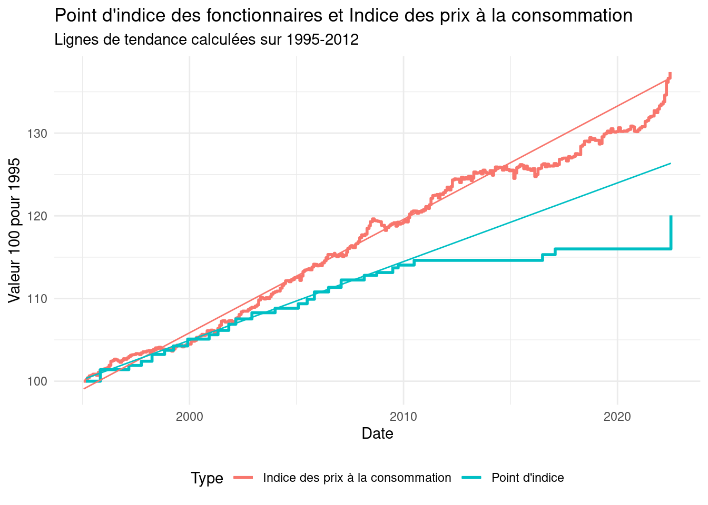
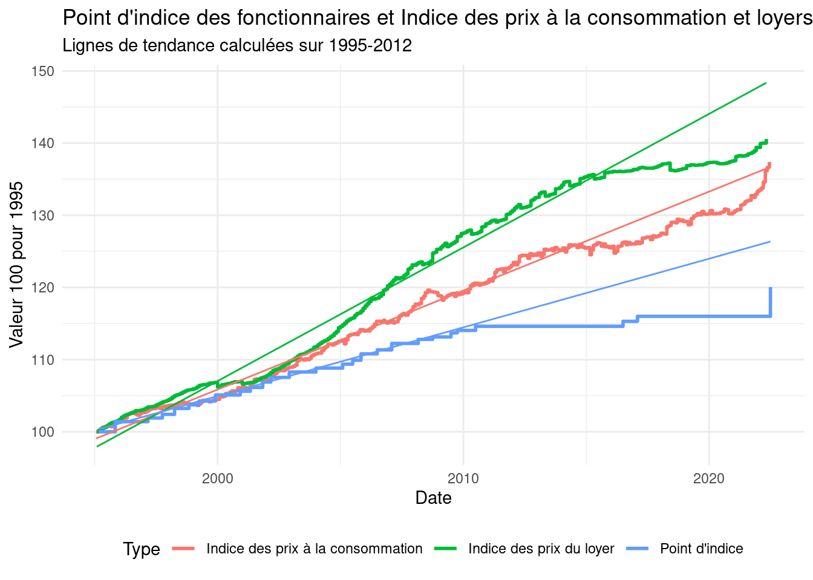

Revenus
================

Sources :

-   Point d’indice :
    <https://www.fonction-publique.gouv.fr/connaitre-point-dindice>
-   IPC : <https://www.insee.fr/fr/statistiques/serie/001759970>
-   Loyers : <https://www.insee.fr/fr/statistiques/serie/001764297>

