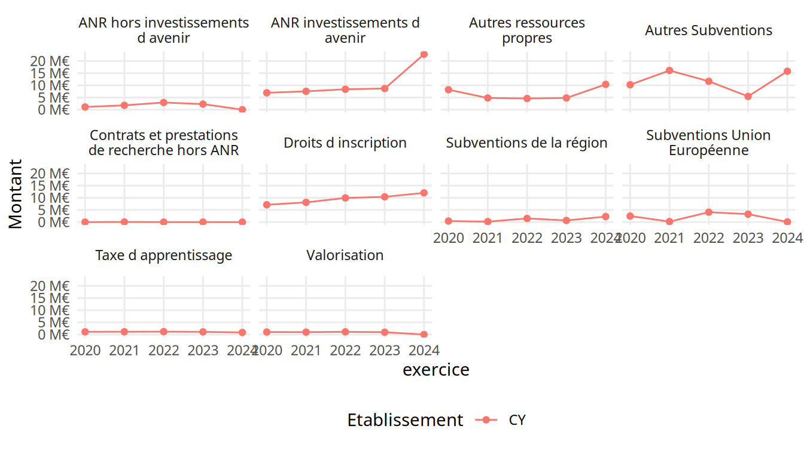
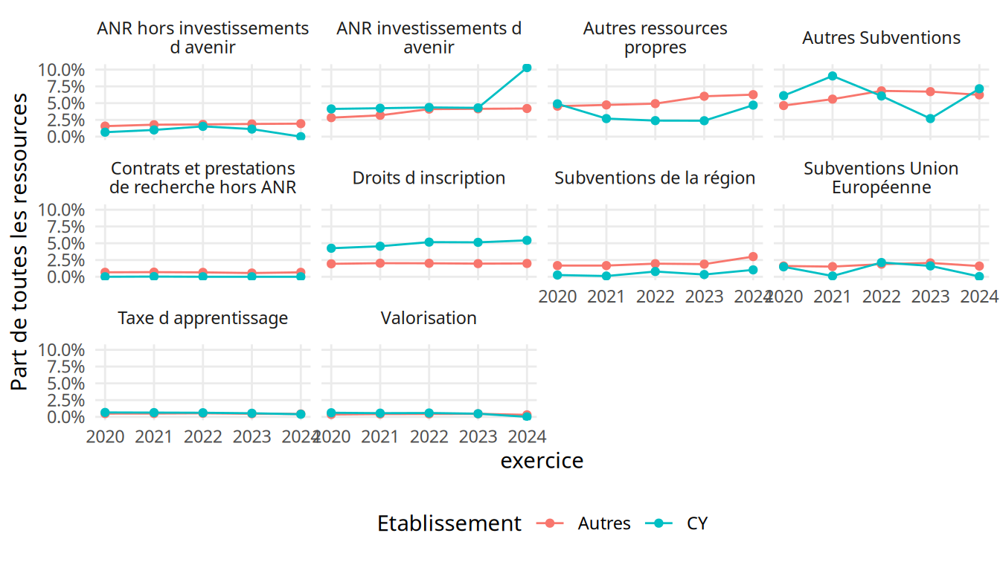

CPESR
================
CPESR
2024-10-15

## Données

    ##  [1] "uai...identifiant"                                  
    ##  [2] "exercice"                                           
    ##  [3] "Acquisitions.d.immobilisations"                     
    ##  [4] "ANR.hors.investissements.d.avenir"                  
    ##  [5] "ANR.investissements.d.avenir"                       
    ##  [6] "Autres.ressources.propres"                          
    ##  [7] "Autres.Subventions"                                 
    ##  [8] "Besoin.en.fonds.de.roulement"                       
    ##  [9] "CAF...Produits.encaissables"                        
    ## [10] "Charges.externes"                                   
    ## [11] "Charges.externes...Produits.encaissables"           
    ## [12] "Contrats.et.prestations.de.recherche.hors.ANR"      
    ## [13] "Droits.d.inscription"                               
    ## [14] "Fonds.de.roulement.net.global"                      
    ## [15] "Produits.de.fonctionnement.encaissables"            
    ## [16] "Ressources.propres...Produits.encaissables"         
    ## [17] "Taxe.d.apprentissage"                               
    ## [18] "Valorisation"                                       
    ## [19] "rce"                                                
    ## [20] "vague"                                              
    ## [21] "Etablissement"                                      
    ## [22] "commune"                                            
    ## [23] "academie"                                           
    ## [24] "region"                                             
    ## [25] "code.de.la.commune"                                 
    ## [26] "code.de.l.academie"                                 
    ## [27] "code.de.la.region"                                  
    ## [28] "source"                                             
    ## [29] "id...paysage"                                       
    ## [30] "CAF...Acquisitions.d.immobilisations"               
    ## [31] "Capacité.d.autofinancement"                         
    ## [32] "Charges.de.fonctionnement.décaissables"             
    ## [33] "Charges.de.personnel"                               
    ## [34] "Charges.de.personnel...Produits.encaissables"       
    ## [35] "Charges.décaissables...Produits.encaissables"       
    ## [36] "Excédent.Brut.d.Exploitation..EBE."                 
    ## [37] "Fonds.de.roulement.en.jours.de.charges.décaissables"
    ## [38] "Formation.continue..diplômes.propres.et.VAE"        
    ## [39] "Recettes.propres"                                   
    ## [40] "Ressources.propres.encaissables"                    
    ## [41] "Résultat.net.comptable"                             
    ## [42] "Résultat.net.comptable.hors.SIE"                    
    ## [43] "Solde.budgétaire"                                   
    ## [44] "Subventions.Union.Européenne"                       
    ## [45] "Subventions.de.la.région"                           
    ## [46] "Taux.de.rémunération.des.permanents"                
    ## [47] "Trésorerie"                                         
    ## [48] "Trésorerie.en.jours.de.charges.décaissables"

## Explorations

Données financières CY

| uai…identifiant | exercice | Acquisitions.d.immobilisations | ANR.hors.investissements.d.avenir | ANR.investissements.d.avenir | Autres.ressources.propres | Autres.Subventions | Besoin.en.fonds.de.roulement | CAF…Produits.encaissables | Charges.externes | Charges.externes…Produits.encaissables | Contrats.et.prestations.de.recherche.hors.ANR | Droits.d.inscription | Fonds.de.roulement.net.global | Produits.de.fonctionnement.encaissables | Ressources.propres…Produits.encaissables | Taxe.d.apprentissage | Valorisation | rce | vague | Etablissement | commune | academie | region | code.de.la.commune | code.de.l.academie | code.de.la.region | source | id…paysage | CAF…Acquisitions.d.immobilisations | Capacité.d.autofinancement | Charges.de.fonctionnement.décaissables | Charges.de.personnel | Charges.de.personnel…Produits.encaissables | Charges.décaissables…Produits.encaissables | Excédent.Brut.d.Exploitation..EBE. | Fonds.de.roulement.en.jours.de.charges.décaissables | Formation.continue..diplômes.propres.et.VAE | Recettes.propres | Ressources.propres.encaissables | Résultat.net.comptable | Résultat.net.comptable.hors.SIE | Solde.budgétaire | Subventions.Union.Européenne | Subventions.de.la.région | Taux.de.rémunération.des.permanents | Trésorerie | Trésorerie.en.jours.de.charges.décaissables |
|:---|---:|---:|---:|---:|---:|---:|---:|---:|---:|---:|---:|---:|---:|---:|---:|---:|---:|---:|:---|:---|:---|:---|:---|:---|:---|:---|:---|:---|---:|---:|---:|---:|---:|---:|---:|---:|---:|---:|---:|---:|---:|---:|---:|---:|---:|---:|---:|
| 0952259P | 2024 | 25328992 | 0 | 22768839 | 10393150 | 15804109 | -42305709 | -0.4687971 | NA | NA | 0 | 12020419 | 9718017 | 221178400 | 35.81494 | 865500 | 0 | 2019 | Vague E | CY Cergy Paris Université | Cergy | Versailles | Île-de-France | 95127 | A25 | R11 | Budget | RS4WF | -4.093641 | -1036878 | 222215278 | 175759517 | 79.46505 | 100.46880 | NA | 15.74368 | 24714518 | 88914648 | 79214905 | -5525166 | -5525166 | -16666127 | 74583 | 2273530 | NA | 52023726 | 84.28107 |
| 0952259P | 2021 | 21205931 | 1781876 | 7557662 | 4801756 | 16127085 | -43015057 | 3.8946341 | NA | NA | 48389 | 8113151 | 27440793 | 178194684 | 25.16947 | 1135882 | 986033 | 2019 | Vague E | CY Cergy Paris Université | Cergy | Versailles | Île-de-France | 95127 | A25 | R11 | Comptes financiers | RS4WF | 32.726839 | 6940031 | 171254653 | 140202899 | 78.67962 | 96.10537 | NA | 57.68419 | 14728461 | 55672895 | 44850653 | 1329060 | 1329060 | -1255354 | 202079 | 190521 | 75.71733 | 70455850 | 148.10754 |
| 0952259P | 2022 | 319325442 | 2948238 | 8382829 | 4597552 | 11654868 | -46852394 | 5.3554829 | NA | NA | NA | 9932140 | 32166255 | 192251235 | 28.76141 | 1180784 | 1108686 | 2019 | Vague E | CY Cergy Paris Université | Cergy | Versailles | Île-de-France | 95127 | A25 | R11 | Comptes financiers | RS4WF | 3.224291 | 10295982 | 181955254 | 148067783 | 77.01786 | 94.64452 | NA | 63.64121 | 19601700 | 64989539 | 55294159 | 4529596 | 4529596 | 5216814 | 4081568 | 1501174 | 73.67705 | 79018649 | 156.33906 |
| 0952259P | 2020 | 16323533 | 1113510 | 6931586 | 8199653 | 10248683 | -40809526 | 5.1681979 | NA | NA | 0 | 7130416 | 29799612 | 167601090 | 22.81666 | 1106878 | 1028704 | 2019 | Vague E | CY Cergy Paris Université | Cergy | Versailles | Île-de-France | 95127 | A25 | R11 | Comptes financiers | RS4WF | 53.064223 | 8661956 | 158939134 | 135957661 | 81.11980 | 94.83180 | NA | 67.49666 | 11431218 | 50107382 | 38240976 | 3420935 | 3420935 | 12866727 | 2483096 | 433638 | 78.20000 | 70609138 | 159.93097 |
| 0952259P | 2023 | 15112571 | 2284730 | 8686068 | 4806595 | 5453246 | -53969016 | 2.4385213 | NA | NA | 0 | 10384666 | 29770518 | 202226036 | 28.65298 | 1087727 | 959131 | 2019 | Vague E | CY Cergy Paris Université | Cergy | Versailles | Île-de-France | 95127 | A25 | R11 | Comptes financiers | RS4WF | 32.630616 | 4931325 | 197294711 | 157501532 | 77.88390 | 97.56148 | NA | 54.32171 | 21338683 | 58944743 | 57943782 | -60235 | -60235 | -4247541 | 3269194 | 674703 | 71.94045 | 83739534 | 152.79797 |

Données financières CY - long

| exercice | Etablissement | Indicateur | Montant | PFE | SCSP | Part | PartSCSP |
|---:|:---|:---|---:|---:|---:|---:|---:|
| 2020 | Autres | ANR hors investissements d avenir | 251746428 | 16025342433 | 12814799968 | 0.0157093 | 0.0196450 |
| 2020 | Autres | ANR investissements d avenir | 453933152 | 16025342433 | 12814799968 | 0.0283260 | 0.0354226 |
| 2020 | Autres | Autres ressources propres | 728427869 | 16025342433 | 12814799968 | 0.0454547 | 0.0568427 |
| 2020 | Autres | Autres Subventions | 743407193 | 16025342433 | 12814799968 | 0.0463895 | 0.0580116 |
| 2020 | Autres | Contrats et prestations de recherche hors ANR | 106584323 | 16025342433 | 12814799968 | 0.0066510 | 0.0083173 |
| 2020 | Autres | Droits d inscription | 309248350 | 16025342433 | 12814799968 | 0.0192975 | 0.0241321 |
| 2020 | Autres | Taxe d apprentissage | 78204201 | 16025342433 | 12814799968 | 0.0048800 | 0.0061026 |
| 2020 | Autres | Valorisation | 57764633 | 16025342433 | 12814799968 | 0.0036046 | 0.0045076 |
| 2020 | Autres | Subventions Union Européenne | 256975872 | 16025342433 | 12814799968 | 0.0160356 | 0.0200531 |
| 2020 | Autres | Subventions de la région | 267453946 | 16025342433 | 12814799968 | 0.0166894 | 0.0208707 |
| 2021 | Autres | ANR hors investissements d avenir | 301196848 | 16893730433 | 13141770666 | 0.0178289 | 0.0229190 |
| 2021 | Autres | ANR investissements d avenir | 537491538 | 16893730433 | 13141770666 | 0.0318160 | 0.0408995 |
| 2021 | Autres | Autres ressources propres | 799374125 | 16893730433 | 13141770666 | 0.0473178 | 0.0608270 |
| 2021 | Autres | Autres Subventions | 945865309 | 16893730433 | 13141770666 | 0.0559891 | 0.0719740 |
| 2021 | Autres | Contrats et prestations de recherche hors ANR | 116423610 | 16893730433 | 13141770666 | 0.0068915 | 0.0088591 |
| 2021 | Autres | Droits d inscription | 342041792 | 16893730433 | 13141770666 | 0.0202467 | 0.0260271 |
| 2021 | Autres | Taxe d apprentissage | 83859590 | 16893730433 | 13141770666 | 0.0049639 | 0.0063811 |
| 2021 | Autres | Valorisation | 71098182 | 16893730433 | 13141770666 | 0.0042086 | 0.0054101 |
| 2021 | Autres | Subventions Union Européenne | 256083557 | 16893730433 | 13141770666 | 0.0151585 | 0.0194862 |
| 2021 | Autres | Subventions de la région | 281799175 | 16893730433 | 13141770666 | 0.0166807 | 0.0214430 |
| 2024 | Autres | ANR hors investissements d avenir | 372424993 | 19220812076 | 14013035091 | 0.0193761 | 0.0265770 |
| 2024 | Autres | ANR investissements d avenir | 807218106 | 19220812076 | 14013035091 | 0.0419971 | 0.0576048 |
| 2024 | Autres | Autres ressources propres | 1204629254 | 19220812076 | 14013035091 | 0.0626732 | 0.0859649 |
| 2024 | Autres | Autres Subventions | 1197878342 | 19220812076 | 14013035091 | 0.0623219 | 0.0854831 |
| 2024 | Autres | Contrats et prestations de recherche hors ANR | 126960892 | 19220812076 | 14013035091 | 0.0066054 | 0.0090602 |
| 2024 | Autres | Droits d inscription | 380941840 | 19220812076 | 14013035091 | 0.0198192 | 0.0271848 |
| 2024 | Autres | Taxe d apprentissage | 83695538 | 19220812076 | 14013035091 | 0.0043544 | 0.0059727 |
| 2024 | Autres | Valorisation | 58203098 | 19220812076 | 14013035091 | 0.0030281 | 0.0041535 |
| 2024 | Autres | Subventions Union Européenne | 306825199 | 19220812076 | 14013035091 | 0.0159632 | 0.0218957 |
| 2024 | Autres | Subventions de la région | 578876323 | 19220812076 | 14013035091 | 0.0301172 | 0.0413098 |
| 2022 | Autres | ANR hors investissements d avenir | 323084999 | 17655380737 | 13527212791 | 0.0182995 | 0.0238841 |
| 2022 | Autres | ANR investissements d avenir | 725132574 | 17655380737 | 13527212791 | 0.0410715 | 0.0536055 |
| 2022 | Autres | Autres ressources propres | 869624865 | 17655380737 | 13527212791 | 0.0492555 | 0.0642871 |
| 2022 | Autres | Autres Subventions | 1205684805 | 17655380737 | 13527212791 | 0.0682899 | 0.0891303 |
| 2022 | Autres | Contrats et prestations de recherche hors ANR | 115512371 | 17655380737 | 13527212791 | 0.0065426 | 0.0085393 |
| 2022 | Autres | Droits d inscription | 354523711 | 17655380737 | 13527212791 | 0.0200802 | 0.0262082 |
| 2022 | Autres | Taxe d apprentissage | 93761701 | 17655380737 | 13527212791 | 0.0053107 | 0.0069313 |
| 2022 | Autres | Valorisation | 77496728 | 17655380737 | 13527212791 | 0.0043894 | 0.0057290 |
| 2022 | Autres | Subventions Union Européenne | 331650608 | 17655380737 | 13527212791 | 0.0187847 | 0.0245173 |
| 2022 | Autres | Subventions de la région | 345124720 | 17655380737 | 13527212791 | 0.0195478 | 0.0255134 |
| 2023 | Autres | ANR hors investissements d avenir | 352622887 | 18598454877 | 14092891577 | 0.0189598 | 0.0250213 |
| 2023 | Autres | ANR investissements d avenir | 771974986 | 18598454877 | 14092891577 | 0.0415075 | 0.0547776 |
| 2023 | Autres | Autres ressources propres | 1120377234 | 18598454877 | 14092891577 | 0.0602403 | 0.0794995 |
| 2023 | Autres | Autres Subventions | 1248785830 | 18598454877 | 14092891577 | 0.0671446 | 0.0886110 |
| 2023 | Autres | Contrats et prestations de recherche hors ANR | 103505436 | 18598454877 | 14092891577 | 0.0055653 | 0.0073445 |
| 2023 | Autres | Droits d inscription | 364556626 | 18598454877 | 14092891577 | 0.0196014 | 0.0258681 |
| 2023 | Autres | Taxe d apprentissage | 86022237 | 18598454877 | 14092891577 | 0.0046252 | 0.0061039 |
| 2023 | Autres | Valorisation | 84017681 | 18598454877 | 14092891577 | 0.0045175 | 0.0059617 |
| 2023 | Autres | Subventions Union Européenne | 383842603 | 18598454877 | 14092891577 | 0.0206384 | 0.0272366 |
| 2023 | Autres | Subventions de la région | 350500495 | 18598454877 | 14092891577 | 0.0188457 | 0.0248707 |
| 2024 | CY | ANR hors investissements d avenir | 0 | 221178400 | 141963495 | 0.0000000 | 0.0000000 |
| 2024 | CY | ANR investissements d avenir | 22768839 | 221178400 | 141963495 | 0.1029433 | 0.1603852 |
| 2024 | CY | Autres ressources propres | 10393150 | 221178400 | 141963495 | 0.0469899 | 0.0732100 |
| 2024 | CY | Autres Subventions | 15804109 | 221178400 | 141963495 | 0.0714541 | 0.1113252 |
| 2024 | CY | Contrats et prestations de recherche hors ANR | 0 | 221178400 | 141963495 | 0.0000000 | 0.0000000 |
| 2024 | CY | Droits d inscription | 12020419 | 221178400 | 141963495 | 0.0543472 | 0.0846726 |
| 2024 | CY | Taxe d apprentissage | 865500 | 221178400 | 141963495 | 0.0039131 | 0.0060966 |
| 2024 | CY | Valorisation | 0 | 221178400 | 141963495 | 0.0000000 | 0.0000000 |
| 2024 | CY | Subventions Union Européenne | 74583 | 221178400 | 141963495 | 0.0003372 | 0.0005254 |
| 2024 | CY | Subventions de la région | 2273530 | 221178400 | 141963495 | 0.0102792 | 0.0160149 |
| 2021 | CY | ANR hors investissements d avenir | 1781876 | 178194684 | 133344031 | 0.0099996 | 0.0133630 |
| 2021 | CY | ANR investissements d avenir | 7557662 | 178194684 | 133344031 | 0.0424124 | 0.0566779 |
| 2021 | CY | Autres ressources propres | 4801756 | 178194684 | 133344031 | 0.0269467 | 0.0360103 |
| 2021 | CY | Autres Subventions | 16127085 | 178194684 | 133344031 | 0.0905026 | 0.1209434 |
| 2021 | CY | Contrats et prestations de recherche hors ANR | 48389 | 178194684 | 133344031 | 0.0002716 | 0.0003629 |
| 2021 | CY | Droits d inscription | 8113151 | 178194684 | 133344031 | 0.0455297 | 0.0608438 |
| 2021 | CY | Taxe d apprentissage | 1135882 | 178194684 | 133344031 | 0.0063744 | 0.0085184 |
| 2021 | CY | Valorisation | 986033 | 178194684 | 133344031 | 0.0055335 | 0.0073947 |
| 2021 | CY | Subventions Union Européenne | 202079 | 178194684 | 133344031 | 0.0011340 | 0.0015155 |
| 2021 | CY | Subventions de la région | 190521 | 178194684 | 133344031 | 0.0010692 | 0.0014288 |
| 2022 | CY | ANR hors investissements d avenir | 2948238 | 192251235 | 136957076 | 0.0153353 | 0.0215267 |
| 2022 | CY | ANR investissements d avenir | 8382829 | 192251235 | 136957076 | 0.0436035 | 0.0612077 |
| 2022 | CY | Autres ressources propres | 4597552 | 192251235 | 136957076 | 0.0239143 | 0.0335693 |
| 2022 | CY | Autres Subventions | 11654868 | 192251235 | 136957076 | 0.0606231 | 0.0850987 |
| 2022 | CY | Contrats et prestations de recherche hors ANR | 0 | 192251235 | 136957076 | 0.0000000 | 0.0000000 |
| 2022 | CY | Droits d inscription | 9932140 | 192251235 | 136957076 | 0.0516623 | 0.0725201 |
| 2022 | CY | Taxe d apprentissage | 1180784 | 192251235 | 136957076 | 0.0061419 | 0.0086216 |
| 2022 | CY | Valorisation | 1108686 | 192251235 | 136957076 | 0.0057669 | 0.0080951 |
| 2022 | CY | Subventions Union Européenne | 4081568 | 192251235 | 136957076 | 0.0212304 | 0.0298018 |
| 2022 | CY | Subventions de la région | 1501174 | 192251235 | 136957076 | 0.0078084 | 0.0109609 |
| 2020 | CY | ANR hors investissements d avenir | 1113510 | 167601090 | 129360114 | 0.0066438 | 0.0086078 |
| 2020 | CY | ANR investissements d avenir | 6931586 | 167601090 | 129360114 | 0.0413576 | 0.0535836 |
| 2020 | CY | Autres ressources propres | 8199653 | 167601090 | 129360114 | 0.0489236 | 0.0633863 |
| 2020 | CY | Autres Subventions | 10248683 | 167601090 | 129360114 | 0.0611493 | 0.0792260 |
| 2020 | CY | Contrats et prestations de recherche hors ANR | 0 | 167601090 | 129360114 | 0.0000000 | 0.0000000 |
| 2020 | CY | Droits d inscription | 7130416 | 167601090 | 129360114 | 0.0425440 | 0.0551207 |
| 2020 | CY | Taxe d apprentissage | 1106878 | 167601090 | 129360114 | 0.0066042 | 0.0085566 |
| 2020 | CY | Valorisation | 1028704 | 167601090 | 129360114 | 0.0061378 | 0.0079523 |
| 2020 | CY | Subventions Union Européenne | 2483096 | 167601090 | 129360114 | 0.0148155 | 0.0191952 |
| 2020 | CY | Subventions de la région | 433638 | 167601090 | 129360114 | 0.0025873 | 0.0033522 |
| 2023 | CY | ANR hors investissements d avenir | 2284730 | 202226036 | 144282254 | 0.0112979 | 0.0158351 |
| 2023 | CY | ANR investissements d avenir | 8686068 | 202226036 | 144282254 | 0.0429523 | 0.0602019 |
| 2023 | CY | Autres ressources propres | 4806595 | 202226036 | 144282254 | 0.0237684 | 0.0333138 |
| 2023 | CY | Autres Subventions | 5453246 | 202226036 | 144282254 | 0.0269661 | 0.0377957 |
| 2023 | CY | Contrats et prestations de recherche hors ANR | 0 | 202226036 | 144282254 | 0.0000000 | 0.0000000 |
| 2023 | CY | Droits d inscription | 10384666 | 202226036 | 144282254 | 0.0513518 | 0.0719747 |
| 2023 | CY | Taxe d apprentissage | 1087727 | 202226036 | 144282254 | 0.0053788 | 0.0075389 |
| 2023 | CY | Valorisation | 959131 | 202226036 | 144282254 | 0.0047429 | 0.0066476 |
| 2023 | CY | Subventions Union Européenne | 3269194 | 202226036 | 144282254 | 0.0161660 | 0.0226583 |
| 2023 | CY | Subventions de la région | 674703 | 202226036 | 144282254 | 0.0033364 | 0.0046763 |

