SCSP
================
CPESR
2024-09-26

## Données

- <https://github.com/cpesr/kpiESR>

<!-- -->

    ## Joining with `by = join_by(Groupe, pid, Etablissement, Groupe.détaillé,
    ## Comparable)`

Données

| Etablissement | Typologie | PerimEx | Indicateur | Valeur100 | Valeur | Rang | Rang_Valeur100 | Rang_Typologie |
|:---|:---|:---|:---|---:|---:|---:|---:|---:|
| Aix-Marseille Université | Université pluridisciplinaire avec santé | IDEx | SCSP | 114.1050 | 5.592166e+08 | 1 | 163 | 1 |
| Aix-Marseille Université | Université pluridisciplinaire avec santé | IDEx | SCSP/E-EC | 109.7877 | 1.342796e+05 | 103 | 210 | 50 |
| Aix-Marseille Université | Université pluridisciplinaire avec santé | IDEx | SCSP/Etudiant | 109.6914 | 8.815203e+03 | 216 | 212 | 105 |
| Aix-Marseille Université | Université pluridisciplinaire avec santé | IDEx | SCSP/Etudiant(hors doc.) | 108.6437 | 9.167869e+03 | 208 | 223 | 101 |
| Aix-Marseille Université | Université pluridisciplinaire avec santé | IDEx | Ressources/Etudiant(hors doc.) | 116.4541 | 1.211214e+04 | 156 | 133 | 73 |
| Avignon Université | Université pluridisciplinaire hors santé | NINI | SCSP | 121.2591 | 5.658963e+07 | 63 | 77 | 15 |

Téléchargement : [csv](%22fr-cpesr-scsp.csv%22)
[xlsx](%22fr-cpesr-scsp.xlsx%22)

Dans la suite, les données sont limitées aux établissements en France
métropolitaine, sans Paris Sciences et Lettres, dont les indicateurs
sont trop hors-norme.

## SCSP

    ## Warning: The `guide` argument in `scale_*()` cannot be `FALSE`. This was deprecated in
    ## ggplot2 3.3.4.
    ## ℹ Please use "none" instead.
    ## This warning is displayed once every 8 hours.
    ## Call `lifecycle::last_lifecycle_warnings()` to see where this warning was
    ## generated.

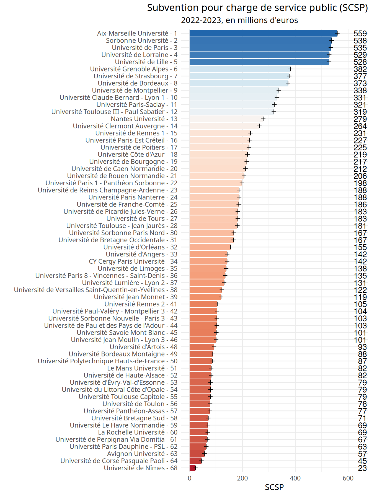

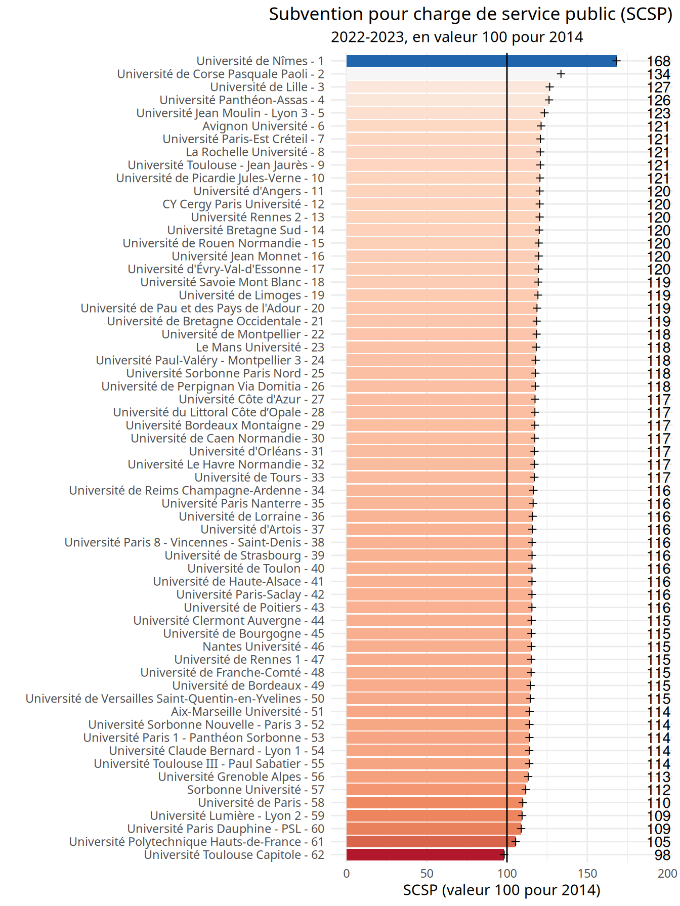

## SCSP par E-EC

## SCSP par Etudiant

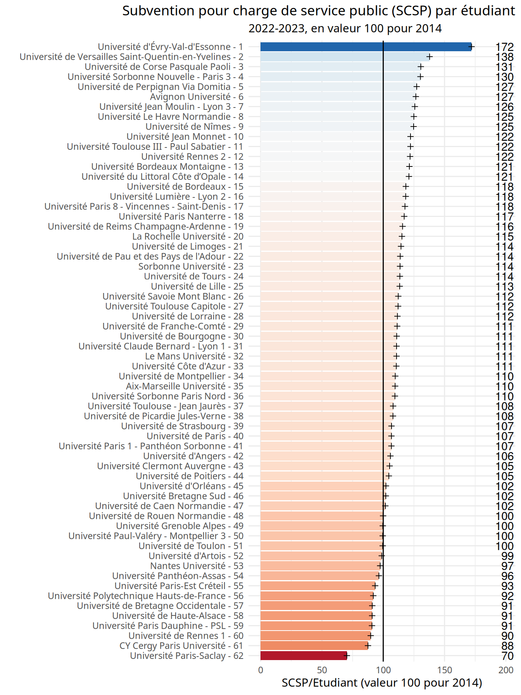

## SCSP par Etudiant (hors doctorants)

## Ressources par Etudiant (hors doctorants)

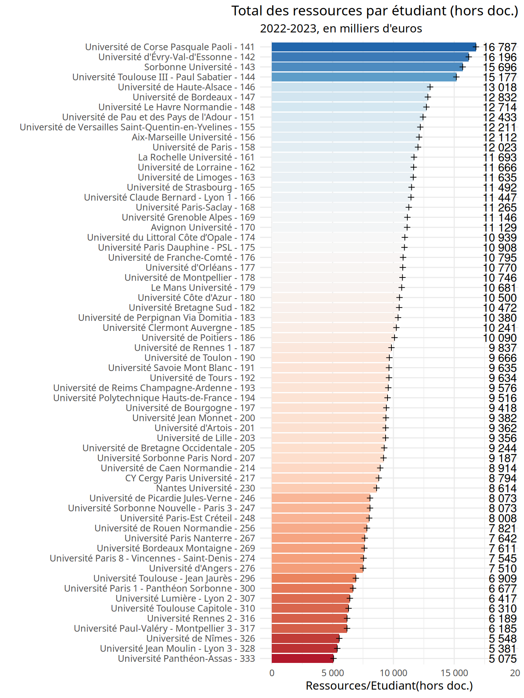

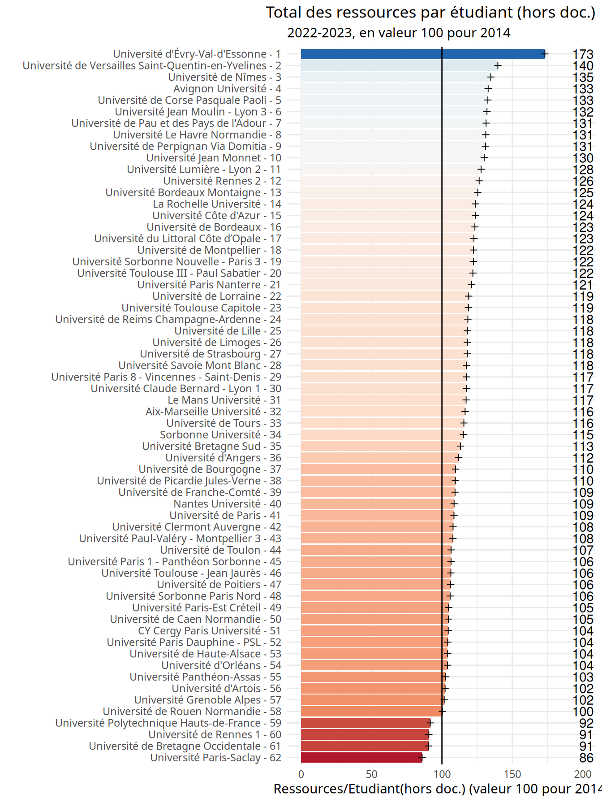

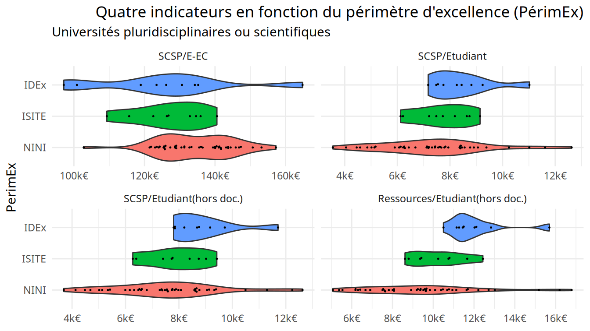

## Rangs

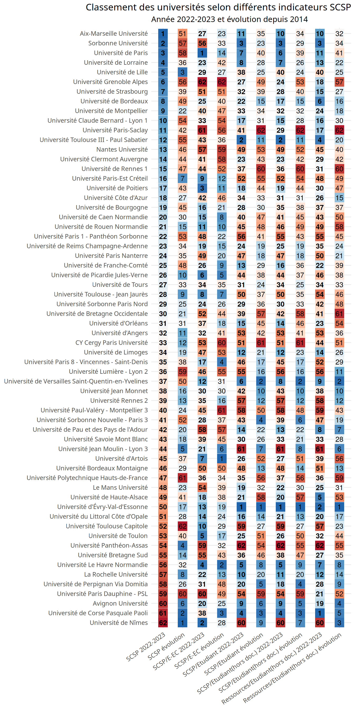

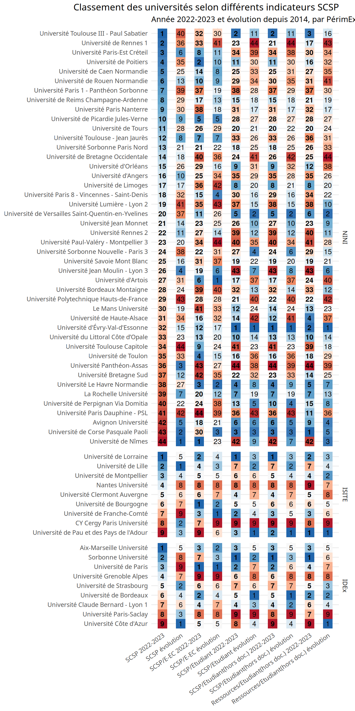

## SCSP vs. MS

    ## Warning: Using `size` aesthetic for lines was deprecated in ggplot2 3.4.0.
    ## ℹ Please use `linewidth` instead.
    ## This warning is displayed once every 8 hours.
    ## Call `lifecycle::last_lifecycle_warnings()` to see where this warning was
    ## generated.

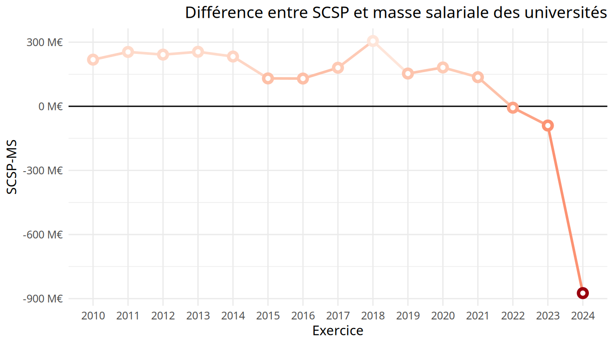

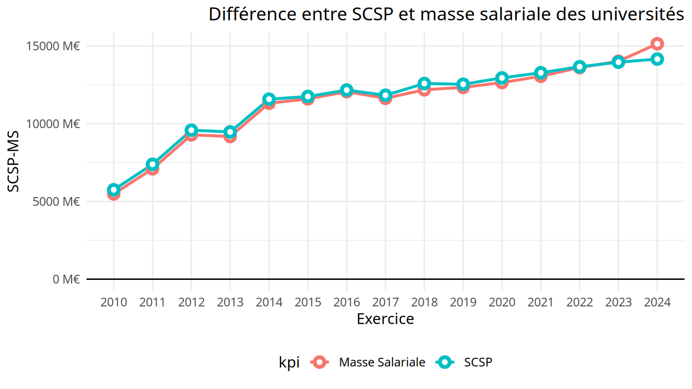

### Autres indicateurs

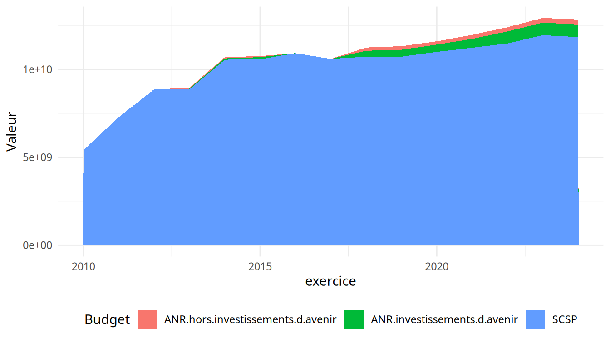

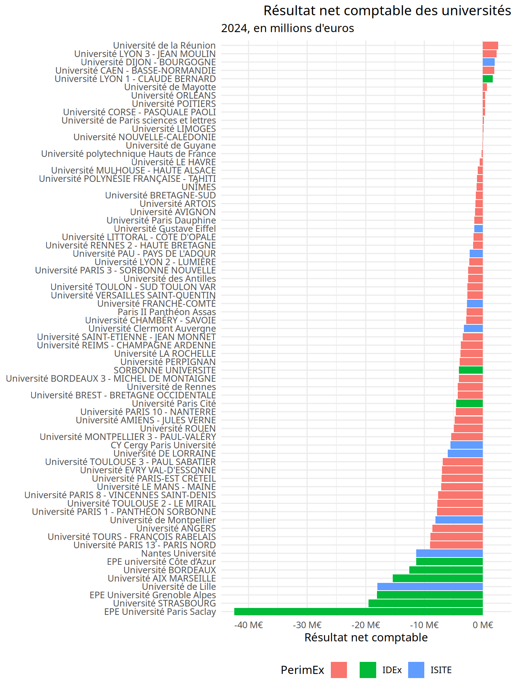

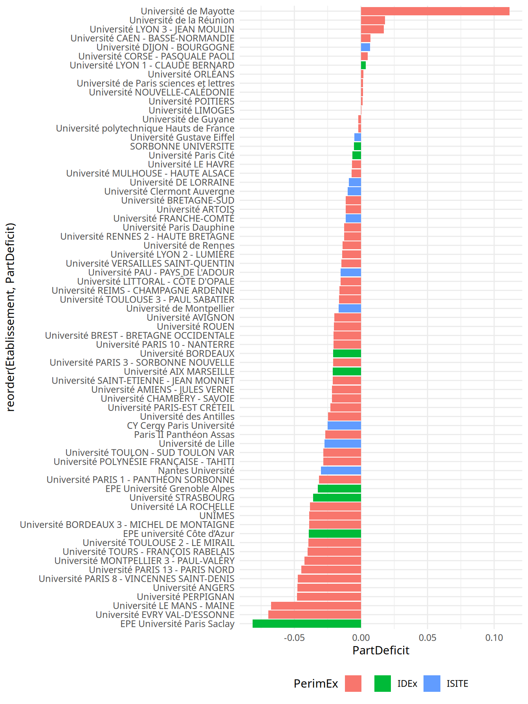
