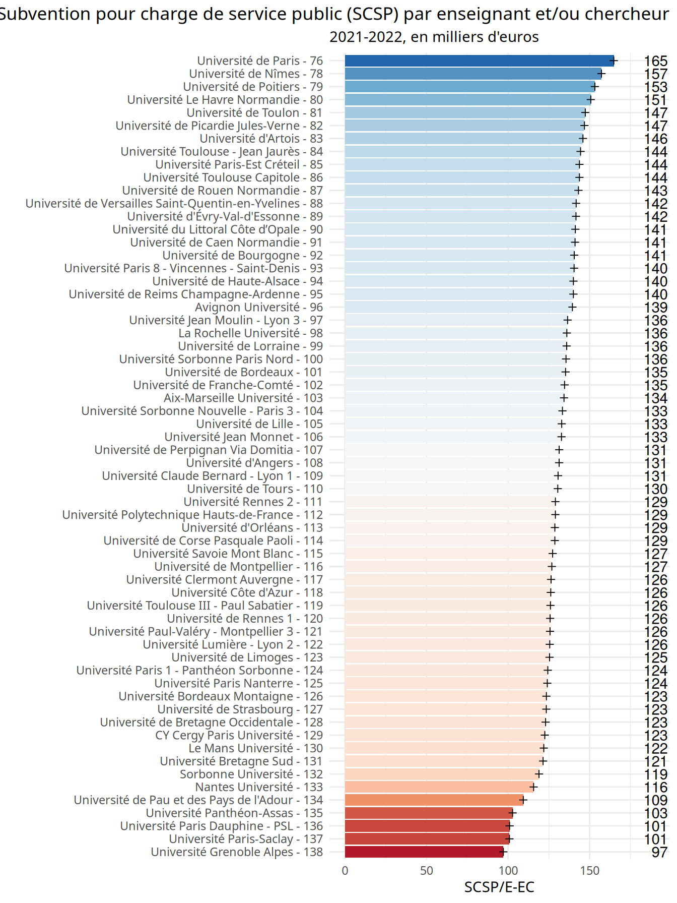
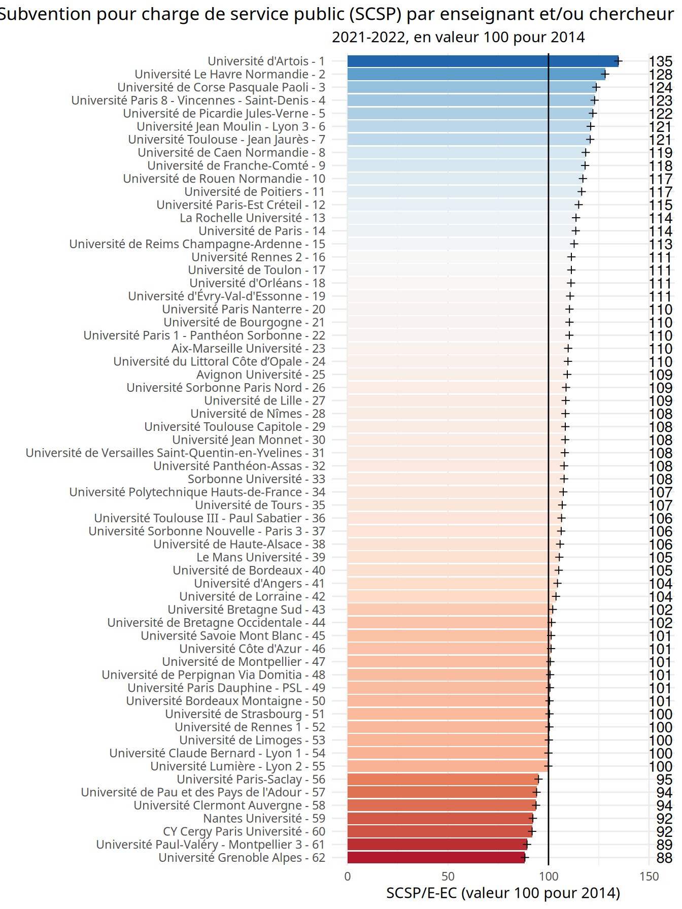
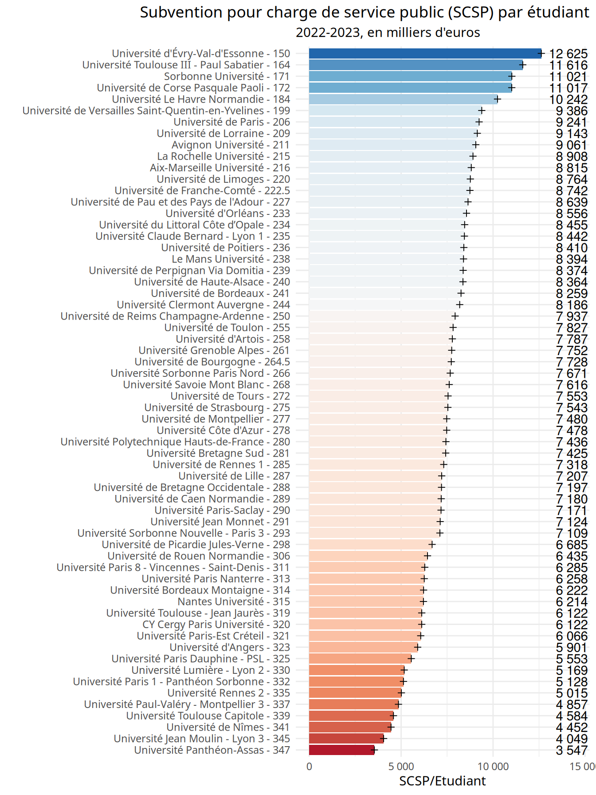
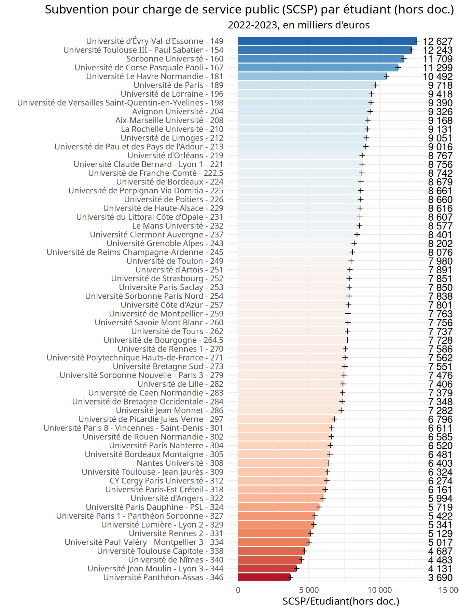
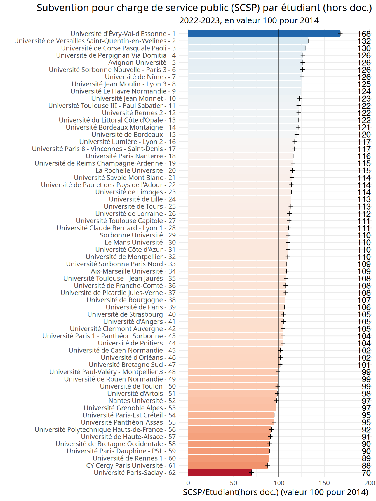
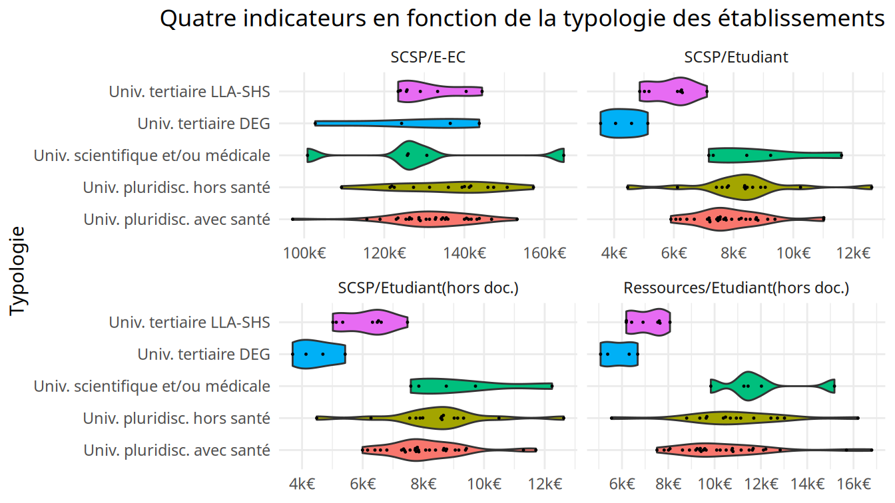
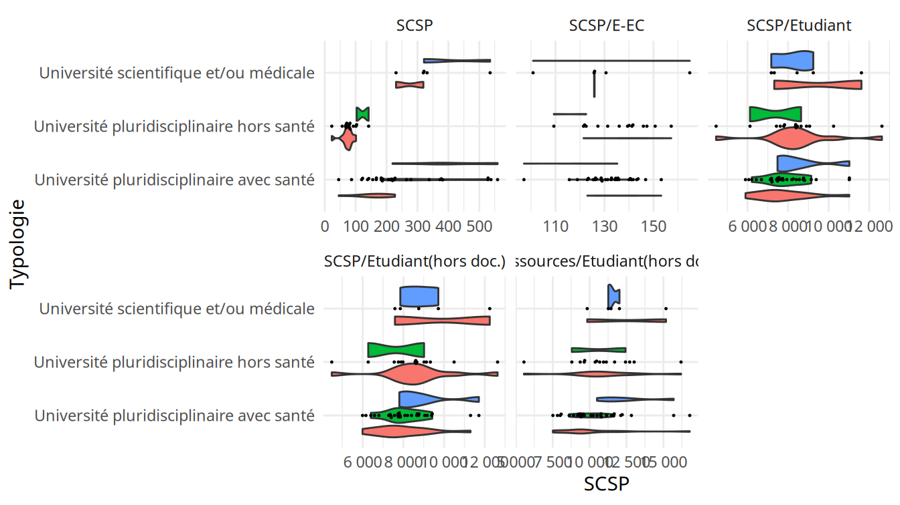
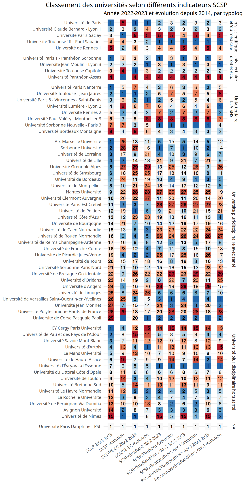
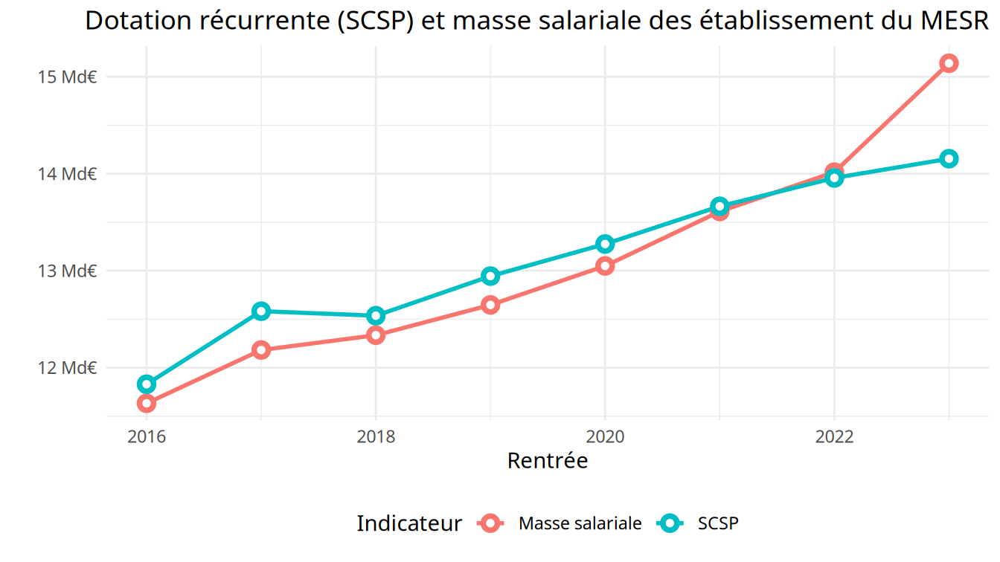

SCSP
================
CPESR
2023-12-14

## Données

- <https://github.com/cpesr/kpiESR>

<!-- -->

    ## Joining with `by = join_by(Groupe, pid, Etablissement, Groupe.détaillé,
    ## Comparable)`

Données

| Etablissement            | Typologie                                | PerimEx | Indicateur                     | Valeur100 |       Valeur | Rang | Rang_Valeur100 | Rang_Typologie |
|:-------------------------|:-----------------------------------------|:--------|:-------------------------------|----------:|-------------:|-----:|---------------:|---------------:|
| Aix-Marseille Université | Université pluridisciplinaire avec santé | IDEx    | SCSP                           |  110.9796 | 5.438997e+08 |    1 |            172 |              1 |
| Aix-Marseille Université | Université pluridisciplinaire avec santé | IDEx    | SCSP/E-EC                      |  109.7877 | 1.342796e+05 |  103 |            184 |             48 |
| Aix-Marseille Université | Université pluridisciplinaire avec santé | IDEx    | SCSP/Etudiant                  |  105.8324 | 8.505077e+03 |  220 |            240 |            104 |
| Aix-Marseille Université | Université pluridisciplinaire avec santé | IDEx    | SCSP/Etudiant(hors doc.)       |  104.8215 | 8.845335e+03 |  211 |            249 |             99 |
| Aix-Marseille Université | Université pluridisciplinaire avec santé | IDEx    | Ressources/Etudiant(hors doc.) |  118.5215 | 1.232717e+04 |  151 |             76 |             70 |
| Avignon Université       | Université pluridisciplinaire hors santé | NINI    | SCSP                           |  118.4700 | 5.528803e+07 |   63 |             78 |             16 |

Téléchargement : [csv](%22fr-cpesr-scsp.csv%22)
[xlsx](%22fr-cpesr-scsp.xlsx%22)

## SCSP

    ## Warning: The `guide` argument in `scale_*()` cannot be `FALSE`. This was deprecated in
    ## ggplot2 3.3.4.
    ## ℹ Please use "none" instead.
    ## This warning is displayed once every 8 hours.
    ## Call `lifecycle::last_lifecycle_warnings()` to see where this warning was
    ## generated.

## SCSP par E-EC

## SCSP par Etudiant

## SCSP par Etudiant (hors doctorants)

## Ressources par Etudiant (hors doctorants)

## Rangs

## SCSP vs. MS

    ## Warning: Using `size` aesthetic for lines was deprecated in ggplot2 3.4.0.
    ## ℹ Please use `linewidth` instead.
    ## This warning is displayed once every 8 hours.
    ## Call `lifecycle::last_lifecycle_warnings()` to see where this warning was
    ## generated.

