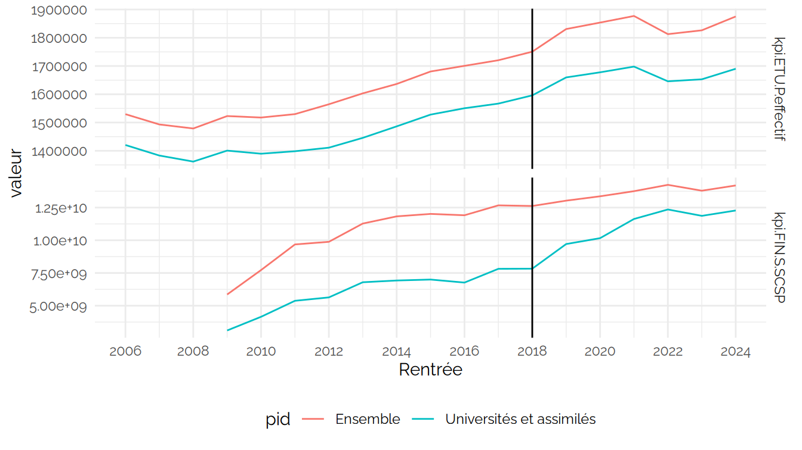
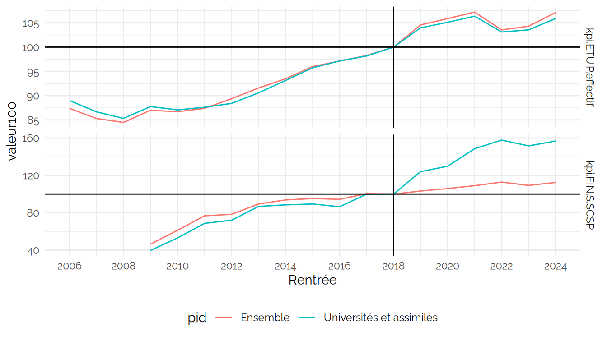

CPESR Assises
================
CPESR
2026-07-15

## Données

- <https://data.enseignementsup-recherche.gouv.fr/explore/assets/fr-esr-operateurs-indicateurs-financiers/export/?vt=chart&ct=col&page=2&refine=exercice%3A2025&orderBy=ressources_propres_produits_encaissables+DESC>

<!-- -->

    ## Warning: Removed 2 rows containing missing values or values outside the scale range
    ## (`geom_line()`).

