LvsM
================
CPESR
2026-03-09

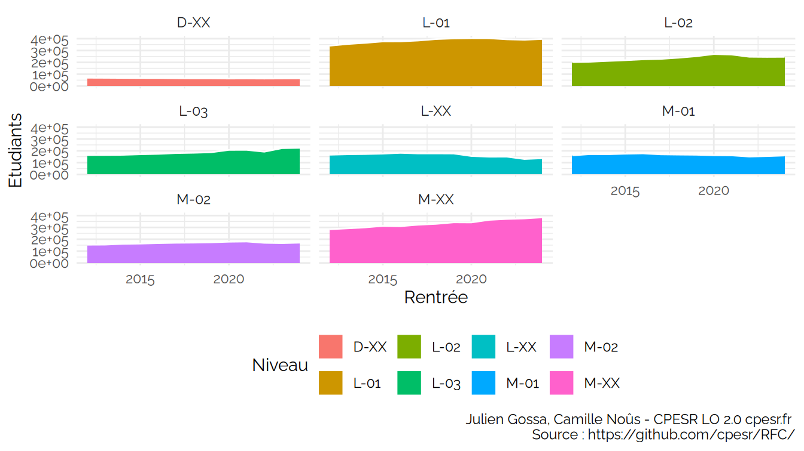

Voir les données ( 33 lignes)

| Niveau | Diplôme | Etudiants |
|:---|:---|---:|
| L-XX | Autres formations | 39960 |
| L-XX | Bachelor OF | 1603 |
| L-XX | Diplôme d’accès aux études universitaires | 6482 |
| L-XX | Diplôme d’État d’infirmier | 0 |
| L-XX | Diplôme d’études universitaires scientifiques et techniques | 12202 |
| L-XX | Diplôme de comptabilité et de gestion | 815 |
| L-XX | Diplômes conférant le grade de Licence | 1725 |
| L-XX | Diplômes de grand établissement conférant le grade de Licence | 8993 |
| L-XX | Diplômes nationaux conférant le grade de Licence | 3553 |
| L-XX | Dispositif rebond | 32 |
| L-XX | Formations paramédicales | 8991 |
| L-XX | Licence professionnelle en 1 an | 24422 |
| L-XX | Licence professionnelle en 2 ou 3 ans | 1225 |
| L-XX | PASS et PluriPASS | 25429 |
| L-XX | Passeport pour réussir et s’orienter | 1134 |
| L-XX | Passerelle | 449 |
| L-XX | Post-DUT | 138 |
| L-XX | Titres homologués RNCP | 12 |
| M-XX | Autres formations | 85751 |
| M-XX | Autres formations de santé | 136605 |
| M-XX | Diplôme de l’École normale supérieure | 3201 |
| M-XX | Diplôme inter-universitaire | 9085 |
| M-XX | Diplôme supérieur de comptabilité et de gestion | 313 |
| M-XX | Diplômes conférant le grade de Master | 1854 |
| M-XX | Diplômes de grand établissement conférant le grade de Master | 3113 |
| M-XX | Diplômes de management conférant le grade de Master | 1191 |
| M-XX | Diplômes nationaux conférant le grade de Master | 2752 |
| M-XX | Diplômes visés niveau BAC + 5 | 293 |
| M-XX | Formations d’ingénieurs | 99014 |
| M-XX | Formations d’instituts d’études politiques | 18271 |
| M-XX | Formations paramédicales | 18618 |
| M-XX | Magistère homologué | 499 |
| M-XX | Préparations aux concours pour devenir enseignant et certifications | 4513 |

Voir les données ( 19 lignes)

| Niveau | Diplôme                                        | Etudiants |
|:-------|:-----------------------------------------------|----------:|
| L-01   | Autres licences                                |    324537 |
| L-01   | Bachelor universitaire de technologie          |     61262 |
| L-01   | CPGE                                           |        31 |
| L-01   | Capacité en droit                              |      1480 |
| L-01   | Diplôme universitaire de technologie           |       197 |
| L-01   | Licence accès santé                            |     15102 |
| L-01   | Licence sciences pour la santé (majeure santé) |      1219 |
| L-02   | Autres licences                                |    206802 |
| L-02   | CPGE                                           |        24 |
| L-02   | Capacité en droit                              |       521 |
| L-02   | Diplôme universitaire de technologie           |     53731 |
| L-02   | Licence accès santé                            |      4870 |
| L-02   | Licence sciences pour la santé (majeure santé) |       466 |
| L-03   | Autres licences                                |    207591 |
| L-03   | Licence accès santé                            |       326 |
| M-01   | Master enseignement                            |     26305 |
| M-01   | Masters hors enseignement                      |    135217 |
| M-02   | Master enseignement                            |     27317 |
| M-02   | Masters hors enseignement                      |    153580 |

### L3 vs M1

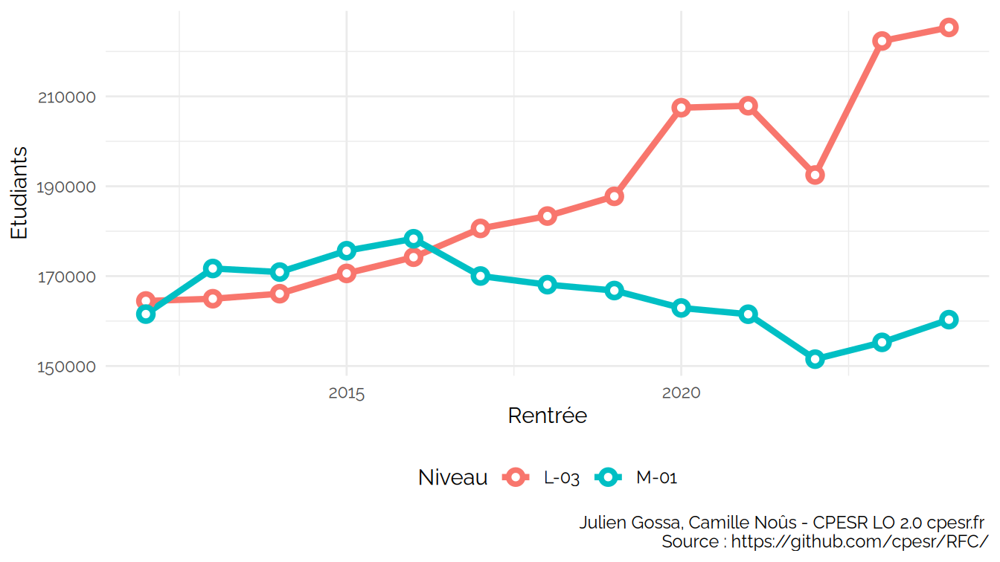

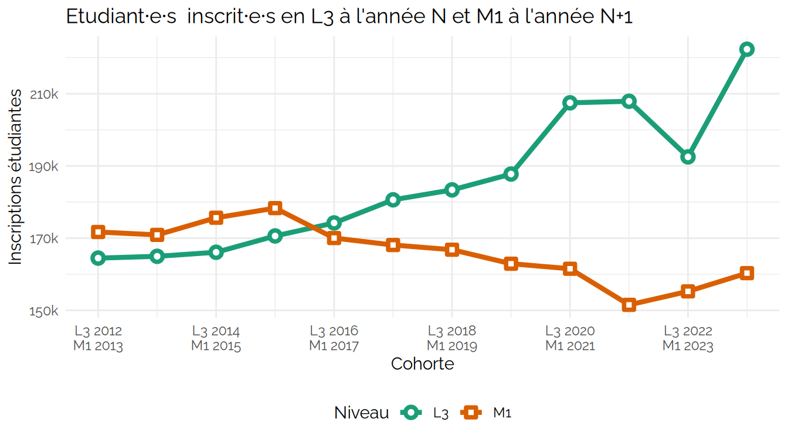

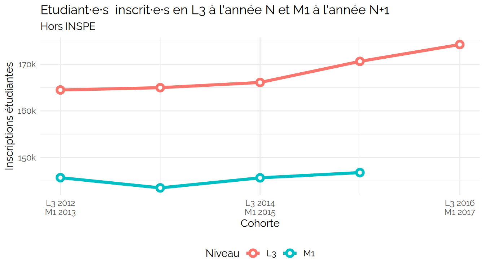

    ## `geom_line()`: Each group consists of only one observation.
    ## ℹ Do you need to adjust the group aesthetic?

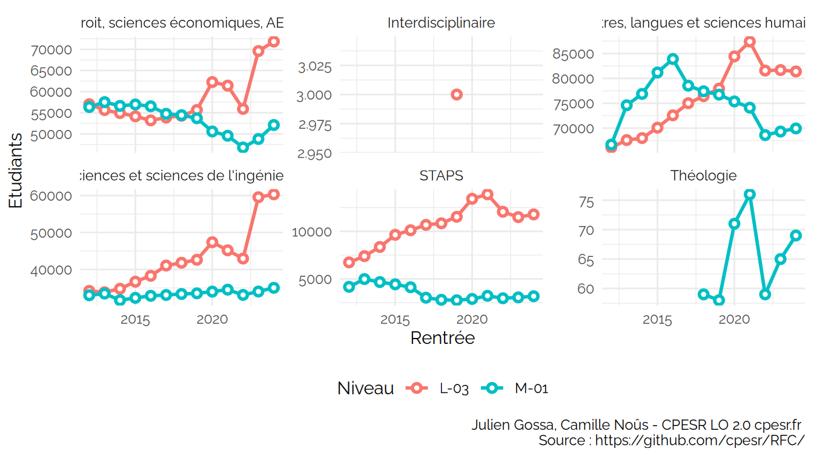

    ## `geom_line()`: Each group consists of only one observation.
    ## ℹ Do you need to adjust the group aesthetic?

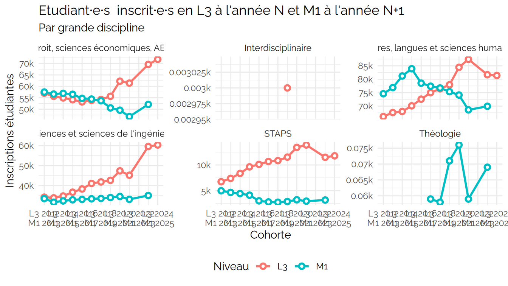

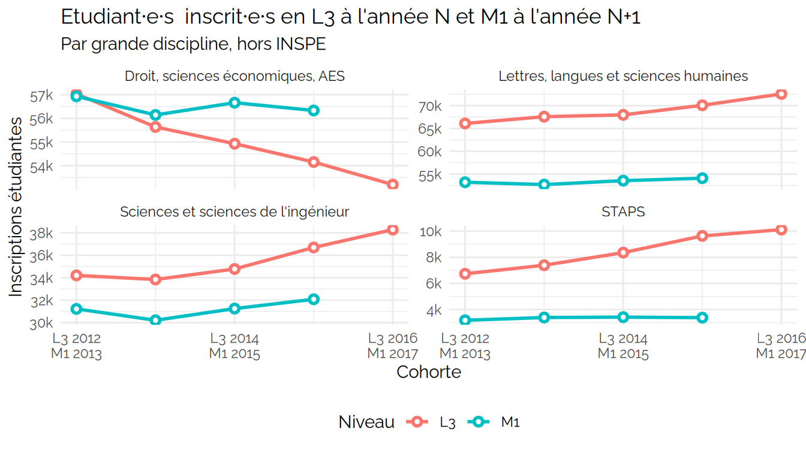

    ## `geom_line()`: Each group consists of only one observation.
    ## ℹ Do you need to adjust the group aesthetic?
    ## `geom_line()`: Each group consists of only one observation.
    ## ℹ Do you need to adjust the group aesthetic?
    ## `geom_line()`: Each group consists of only one observation.
    ## ℹ Do you need to adjust the group aesthetic?
    ## `geom_line()`: Each group consists of only one observation.
    ## ℹ Do you need to adjust the group aesthetic?
    ## `geom_line()`: Each group consists of only one observation.
    ## ℹ Do you need to adjust the group aesthetic?
    ## `geom_line()`: Each group consists of only one observation.
    ## ℹ Do you need to adjust the group aesthetic?

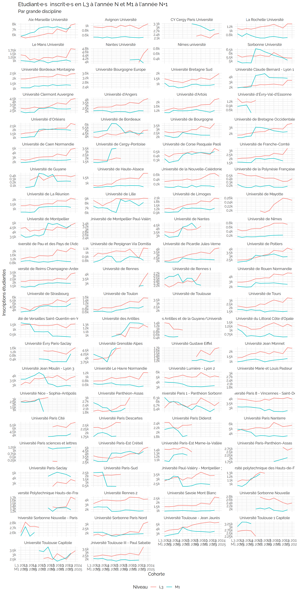

## Flux

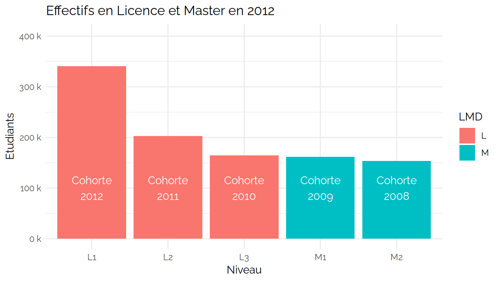<!-- -->

<!-- -->

    ## Warning: Removed 17 rows containing missing values or values outside the scale range
    ## (`geom_col()`).

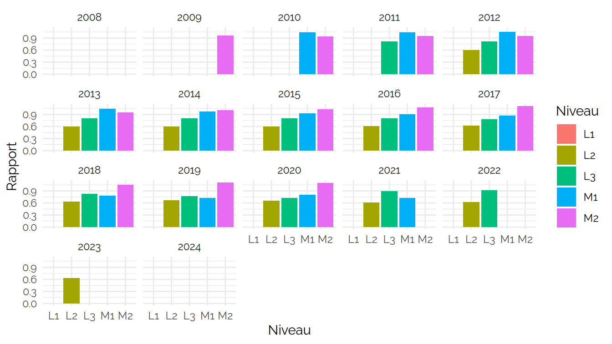

    ## Warning: Removed 17 rows containing missing values or values outside the scale range
    ## (`geom_col()`).

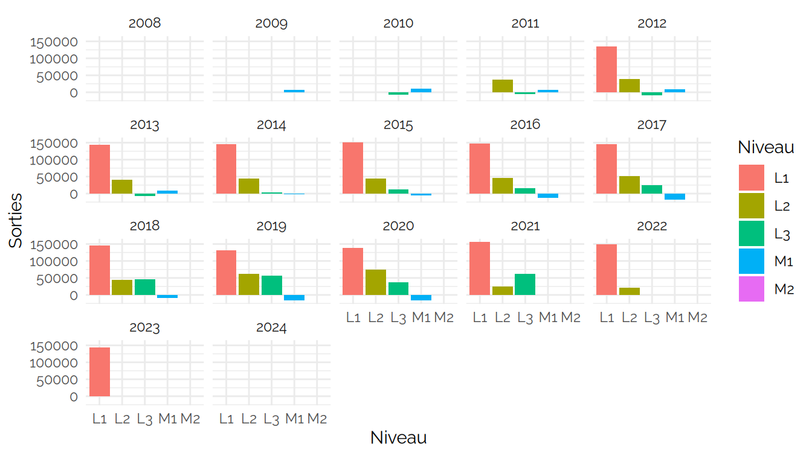

## M1-M2

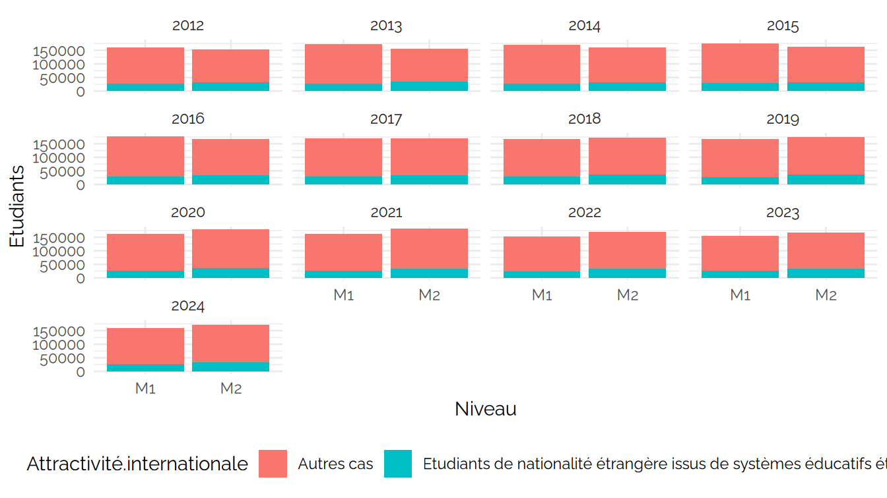

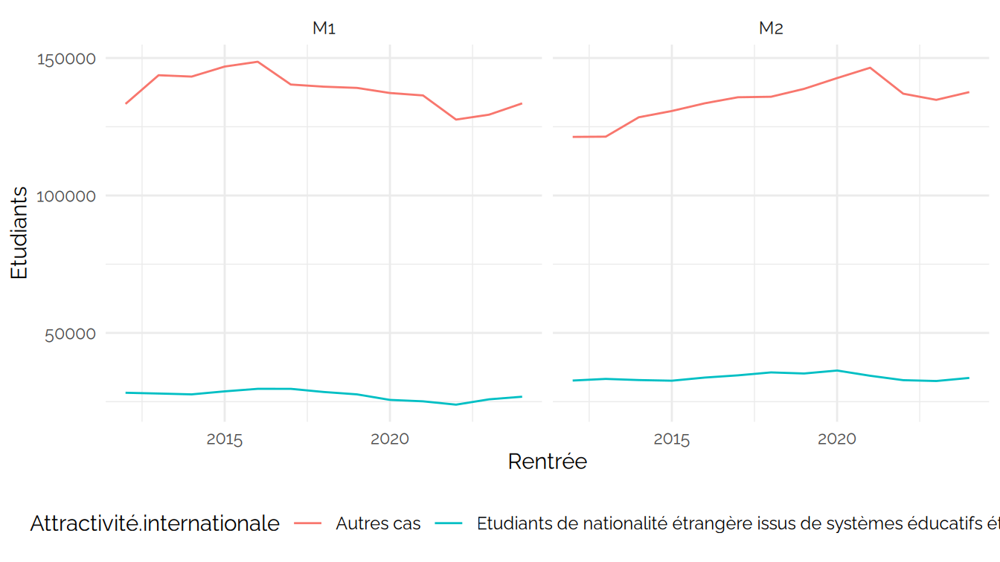

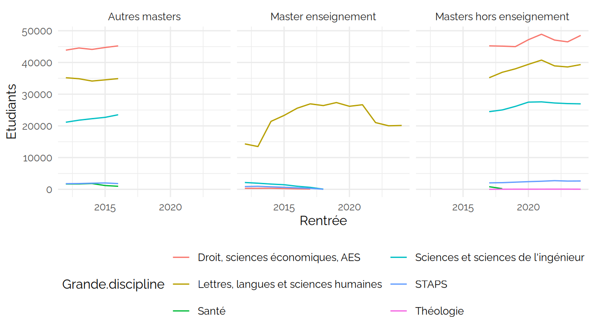

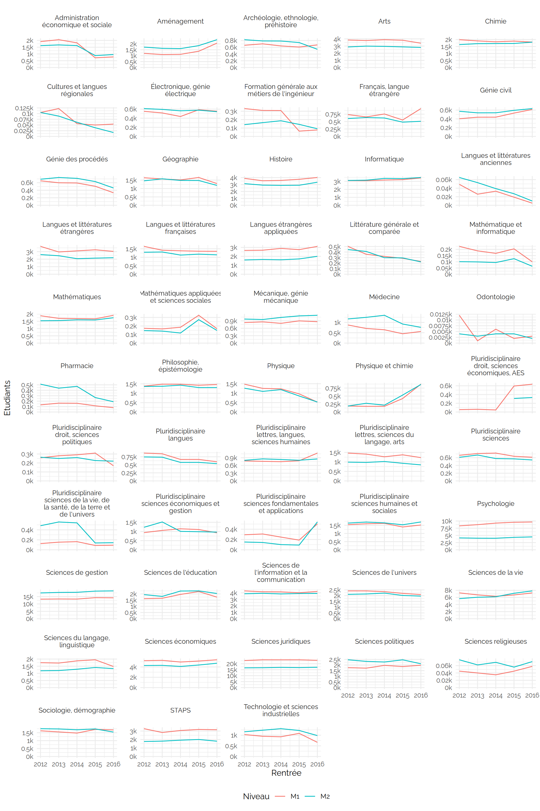

## Export 2021

    ## Warning: remplacement de l'importation précédente 'ggthemes::theme_map' par
    ## 'cowplot::theme_map' lors du chargement de 'kpiESR'

    ## Joining with `by = join_by(pid)`
    ## Adding missing grouping variables: `Rentrée`, `pid`

Voir les données ( 68 lignes)

| Rentrée | pid | Etablissement | L3 | M1_enseignement | M1 | PerimEx | Académie |
|---:|:---|:---|---:|---:|---:|:---|:---|
| 2024 | 3Z5e6 | Université Gustave Eiffel | 1708 | 0 | 1203 | ISITE | Créteil |
| 2024 | 4k25D | Université de Strasbourg | 5907 | 689 | 4963 | IDEx | Strasbourg |
| 2024 | 57OsX | Université de Reims Champagne-Ardenne | 3411 | 445 | 1846 |  | Reims |
| 2024 | 5cZyU | Université de Paris | 5870 | 0 | 4185 | IDEx | Paris |
| 2024 | 5gqzw | Université Jean Monnet | 2326 | 0 | 1287 |  | Lyon |
| 2024 | 5tVy4 | Université Bretagne Sud | 1959 | 0 | 919 |  | Rennes |
| 2024 | 6G2TU | Université Paris 1 - Panthéon Sorbonne | 5934 | 0 | 5394 |  | Paris |
| 2024 | 7Gzub | Université Jean Moulin - Lyon 3 | 3930 | 0 | 2895 |  | Lyon |
| 2024 | 8j5s2 | Université de Picardie Jules-Verne | 4168 | 647 | 2169 |  | Amiens |
| 2024 | 8k883 | Université Sorbonne Nouvelle - Paris 3 | 2384 | 0 | 1943 |  | Paris |
| 2024 | 90I54 | Université de Bordeaux | 5064 | 952 | 4545 | IDEx | Bordeaux |
| 2024 | 91D9w | Université de Rennes 1 | 4139 | 0 | 2751 |  | NA |
| 2024 | 9hqpm | Université de Toulouse | 3773 | 0 | 1782 |  | Toulouse |
| 2024 | 9xlel | Le Mans Université | 1810 | 0 | 946 |  | Nantes |
| 2024 | BWbvP | Université d’Artois | 2327 | 0 | 1189 |  | Lille |
| 2024 | C701f | Université de Toulon | 1537 | 0 | 976 |  | Nice |
| 2024 | CUBKB | Université Lumière - Lyon 2 | 5058 | 0 | 3284 |  | Lyon |
| 2024 | EW53M | Université Polytechnique Hauts-de-France | 1638 | 0 | 1250 |  | Lille |
| 2024 | G2qA7 | Université Paris-Saclay | 3421 | 0 | 4249 | IDEx | Versailles |
| 2024 | G4572 | Université de Rouen Normandie | 4664 | 598 | 2474 |  | Normandie |
| 2024 | HCBvW | Université d’Orléans | 2663 | 773 | 1931 |  | Orléans-Tours |
| 2024 | HqAYu | Université Toulouse - Jean Jaurès | 5400 | 1234 | 3448 |  | Toulouse |
| 2024 | IXHyv | Université d’Angers | 4161 | 0 | 2077 |  | Nantes |
| 2024 | K4lR3 | Université Clermont Auvergne | 4501 | 435 | 2801 | ISITE | Clermont-Ferrand |
| 2024 | LsQ24 | Université Le Havre Normandie | 1205 | 0 | 537 |  | Normandie |
| 2024 | Mz286 | Université de Pau et des Pays de l’Adour | 2150 | 0 | 923 | ISITE | Bordeaux |
| 2024 | Mz90U | Université Bordeaux Montaigne | 2458 | 0 | 1329 |  | Bordeaux |
| 2024 | NLCOF | Université de Corse Pasquale Paoli | 522 | 114 | 501 |  | Corse |
| 2024 | OJZ4a | Université de Haute-Alsace | 1890 | 0 | 661 |  | Strasbourg |
| 2024 | PpsCQ | Université Paris sciences et lettres | 0 | 0 | 1239 |  | Paris |
| 2024 | RN4E6 | Université d’Évry-Val-d’Essonne | 1643 | 0 | 972 |  | Versailles |
| 2024 | RS4WF | CY Cergy Paris Université | 2495 | 1419 | 2807 | ISITE | Versailles |
| 2024 | TWBzp | Université Panthéon-Assas | 2769 | 0 | 2057 |  | NA |
| 2024 | U8a0v | Université de Lille | 9009 | 2108 | 8160 | ISITE | Lille |
| 2024 | Uxr7Z | Université Paris 8 - Vincennes - Saint-Denis | 3968 | 0 | 2696 |  | NA |
| 2024 | V13Pk | Université de Versailles Saint-Quentin-en-Yvelines | 1555 | 0 | 237 |  | Versailles |
| 2024 | Y7ch7 | Université Grenoble Alpes | 6170 | 602 | 3841 | IDEx | Grenoble |
| 2024 | Z2FY5 | Université de la Nouvelle-Calédonie | 531 | 55 | 82 |  | Nouvelle-Calédonie |
| 2024 | atbEK | La Rochelle Université | 1326 | 0 | 667 |  | Poitiers |
| 2024 | bxPQe | Sorbonne Université | 5373 | 736 | 5108 | IDEx | Paris |
| 2024 | cEt92 | Université de La Réunion | 2043 | 512 | 1154 |  | La Réunion |
| 2024 | cqkij | Université de Tours | 3267 | 0 | 1519 |  | Orléans-Tours |
| 2024 | cqyN7 | Université Sorbonne Paris Nord | 3228 | 0 | 1927 |  | Créteil |
| 2024 | e2uv7 | Université de Brest | 3665 | 921 | 2306 |  | NA |
| 2024 | etBz7 | Université Claude Bernard - Lyon 1 | 3316 | 1688 | 3728 | IDEx | Lyon |
| 2024 | evv7S | Université de Montpellier | 4970 | 1111 | 4700 | ISITE | Montpellier |
| 2024 | g6rwB | Université Paris Nanterre | 5711 | 0 | 3500 |  | Versailles |
| 2024 | gap5Q | Université Toulouse Capitole | 3431 | 0 | 3149 |  | NA |
| 2024 | hlX1r | Université de Poitiers | 3889 | 600 | 2927 |  | Poitiers |
| 2024 | hy4EW | Université de Guyane | 406 | 103 | 228 |  | Guyane |
| 2024 | klrvr | Nîmes université | 792 | 0 | 230 |  | Montpellier |
| 2024 | l9qwd | Université Bourgogne Europe | 3569 | 489 | 2319 |  | Dijon |
| 2024 | n1W55 | Université de Perpignan Via Domitia | 1098 | 0 | 811 |  | Montpellier |
| 2024 | nkbwh | Université de Limoges | 2039 | 206 | 1249 |  | Limoges |
| 2024 | p25Q3 | Université de Caen Normandie | 4982 | 444 | 2522 |  | Normandie |
| 2024 | pVJpw | Centre universitaire de Mayotte | 249 | 0 | 0 |  | Mayotte |
| 2024 | qUCQp | Nantes Université | 4791 | 1232 | 3925 | ISITE | Nantes |
| 2024 | rwz11 | Université de Montpellier Paul-Valéry | 3421 | 0 | 2435 |  | Montpellier |
| 2024 | s3t8T | Université Côte d’Azur | 3541 | 438 | 2597 | IDEx | Nice |
| 2024 | t6Cq5 | Université de Lorraine | 7223 | 690 | 4857 | ISITE | Nancy-Metz |
| 2024 | ti37C | Université Rennes 2 | 4183 | 0 | 1700 |  | Rennes |
| 2024 | vb71K | Université Paris-Est Créteil | 5082 | 1272 | 4361 |  | Créteil |
| 2024 | vxHYt | Avignon Université | 1076 | 0 | 506 |  | Aix-Marseille |
| 2024 | xJdyB | Aix-Marseille Université | 8060 | 1162 | 7448 | IDEx | Aix-Marseille |
| 2024 | yH19Y | Université du Littoral Côte d’Opale | 1250 | 0 | 586 |  | Lille |
| 2024 | z3hdL | Université des Antilles | 1226 | 335 | 1306 |  | Guadeloupe |
| 2024 | zCa4j | Université Savoie Mont Blanc | 2585 | 0 | 1036 |  | Grenoble |
| 2024 | zepT6 | Université de la Polynésie Française | 399 | 102 | 176 |  | Polynésie Française |

## L3 vs. M1 vs. M2

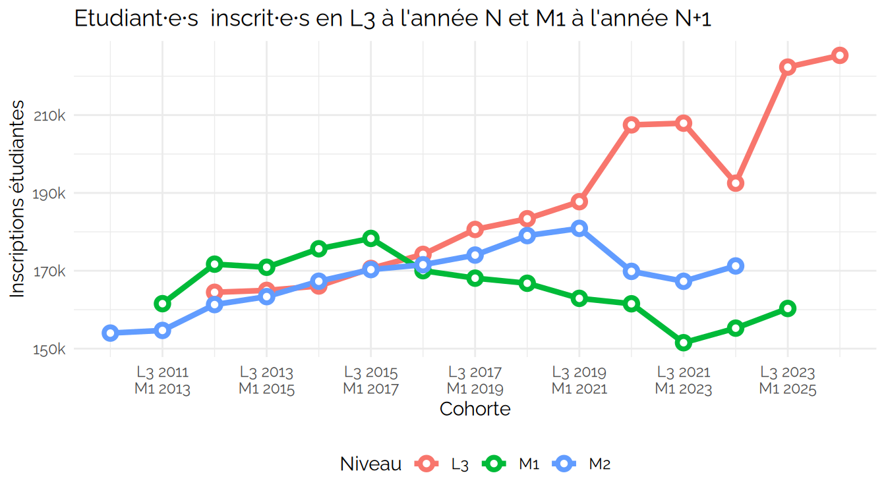
