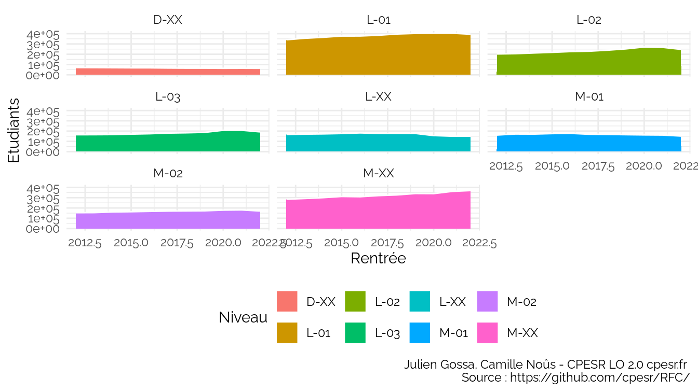
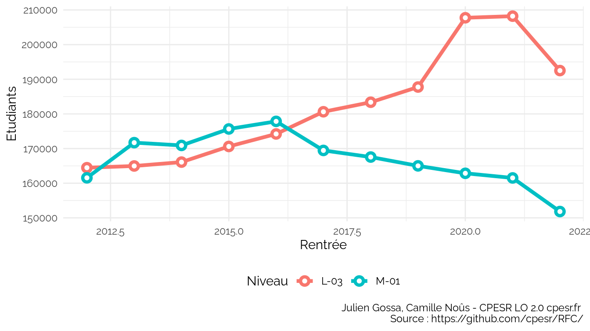
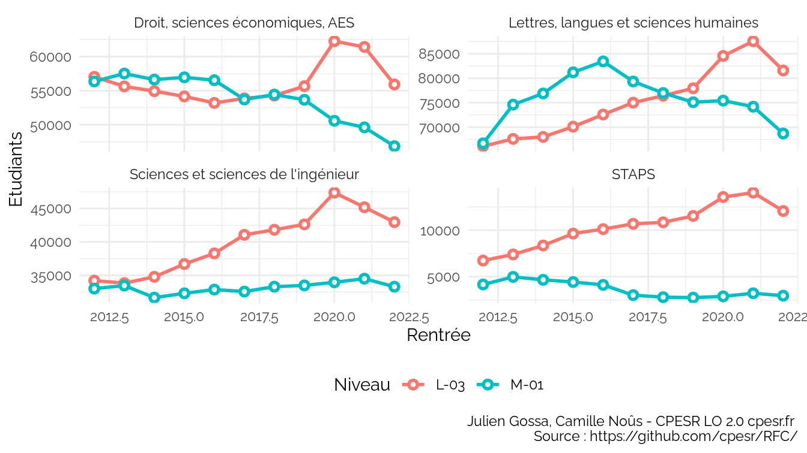
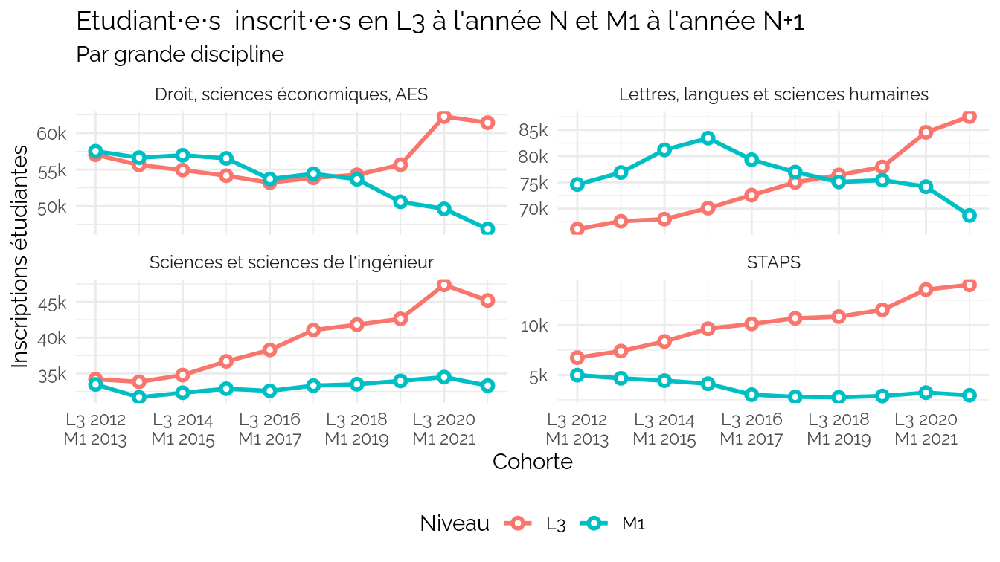
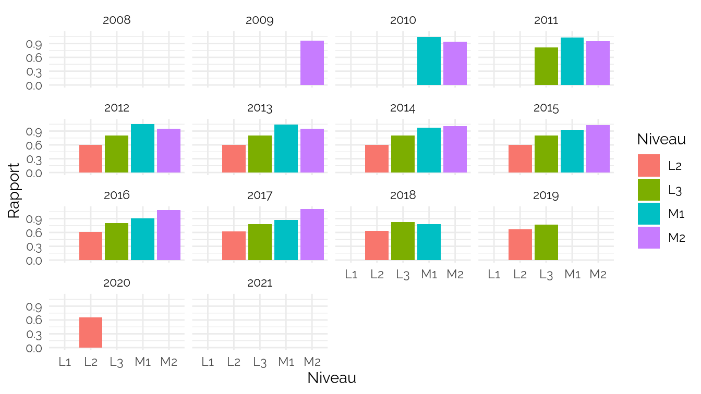
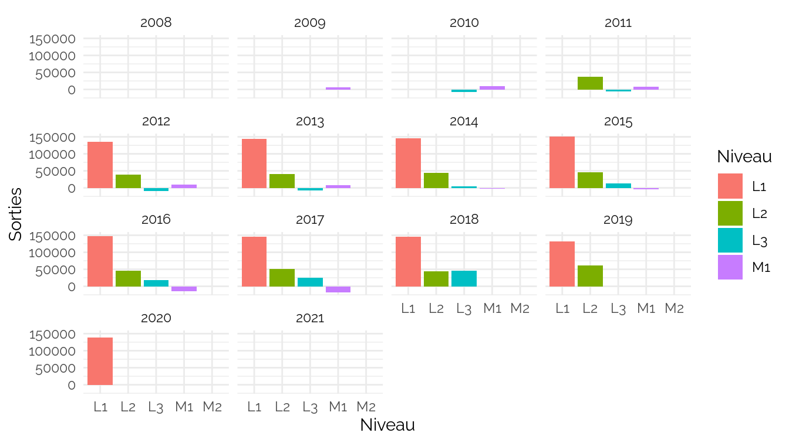
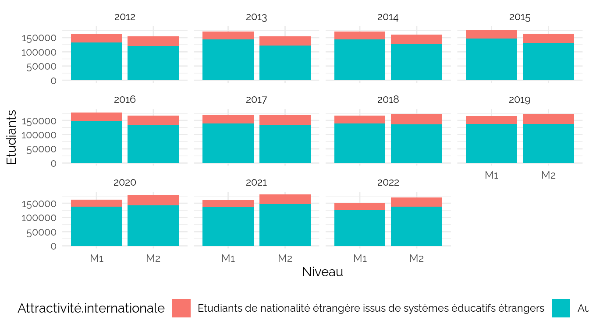
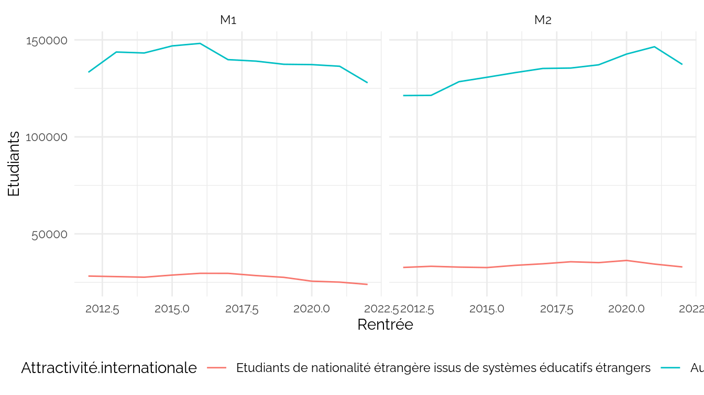
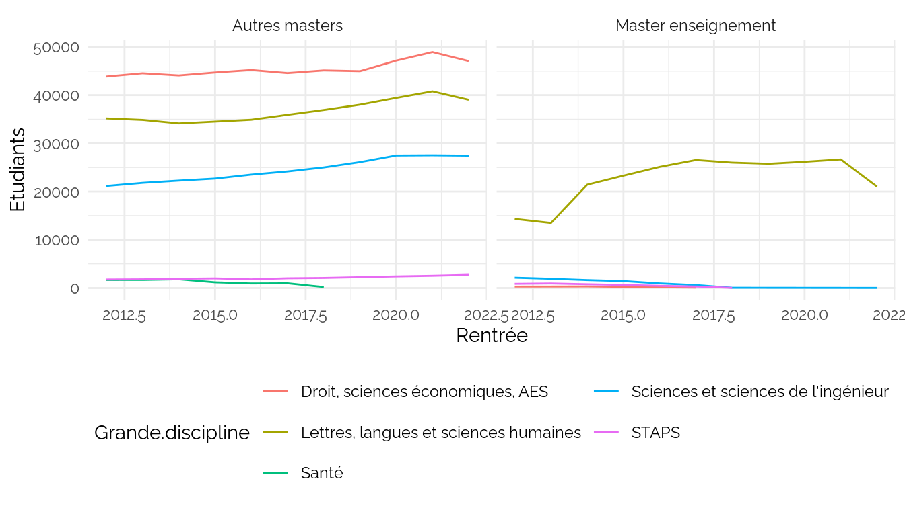
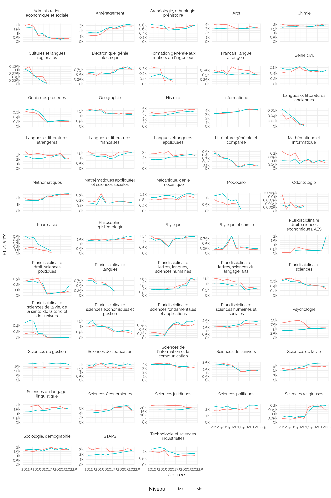

LvsM
================
CPESR
2023-06-19

Voir les données

| Niveau | Diplôme                                   | Etudiants |
|:-------|:------------------------------------------|----------:|
| L-XX   | Autres formations                         |     20234 |
| L-XX   | Diplôme d’accès aux études universitaires |      7132 |
| L-XX   | Diplôme d’État d’infirmier                |         0 |
| L-XX   | Diplômes d’établissement                  |     35917 |
| L-XX   | Formations paramédicales                  |      7551 |
| L-XX   | Licence professionnelle                   |     52429 |
| L-XX   | PASS et PluriPASS                         |     27207 |
| M-XX   | Autres formations                         |     23790 |
| M-XX   | Autres formations de santé                |    128899 |
| M-XX   | Diplômes d’établissement                  |     80824 |
| M-XX   | Formations d’IEP                          |     16301 |
| M-XX   | Formations d’ingénieurs                   |     97107 |
| M-XX   | Formations paramédicales                  |     14270 |

Voir les données

| Niveau | Diplôme                               | Etudiants |
|:-------|:--------------------------------------|----------:|
| L-01   | Autres licences                       |    326154 |
| L-01   | Bachelor universitaire de technologie |     61262 |
| L-01   | Capacité en droit                     |      1480 |
| L-01   | CPGE                                  |        31 |
| L-01   | Diplôme universitaire de technologie  |       197 |
| L-01   | Licence accès santé                   |     15102 |
| L-02   | Autres licences                       |    207593 |
| L-02   | Capacité en droit                     |       521 |
| L-02   | CPGE                                  |        24 |
| L-02   | Diplôme universitaire de technologie  |     53731 |
| L-02   | Licence accès santé                   |      4870 |
| L-03   | Autres licences                       |    207882 |
| L-03   | Licence accès santé                   |       326 |
| M-01   | Autres masters                        |    135215 |
| M-01   | Master enseignement                   |     26305 |
| M-02   | Autres masters                        |    153562 |
| M-02   | Master enseignement                   |     27317 |

### L3 vs M1

    ## `geom_line()`: Each group consists of only one observation.
    ## ℹ Do you need to adjust the group aesthetic?
    ## `geom_line()`: Each group consists of only one observation.
    ## ℹ Do you need to adjust the group aesthetic?
    ## `geom_line()`: Each group consists of only one observation.
    ## ℹ Do you need to adjust the group aesthetic?
    ## `geom_line()`: Each group consists of only one observation.
    ## ℹ Do you need to adjust the group aesthetic?
    ## `geom_line()`: Each group consists of only one observation.
    ## ℹ Do you need to adjust the group aesthetic?
    ## `geom_line()`: Each group consists of only one observation.
    ## ℹ Do you need to adjust the group aesthetic?
    ## `geom_line()`: Each group consists of only one observation.
    ## ℹ Do you need to adjust the group aesthetic?
    ## `geom_line()`: Each group consists of only one observation.
    ## ℹ Do you need to adjust the group aesthetic?

## Flux

<!-- -->

<!-- -->

    ## Warning: Removed 14 rows containing missing values (`position_stack()`).

    ## Warning: Removed 14 rows containing missing values (`position_stack()`).

## M1-M2

## Export 2021

    ## Warning: remplacement de l'importation précédente 'ggthemes::theme_map' par
    ## 'cowplot::theme_map' lors du chargement de 'kpiESR'

    ## Joining with `by = join_by(pid)`
    ## Adding missing grouping variables: `pid`

Voir les données

| pid   | Etablissement                                      |   L3 |   LP | M1_autres | M1_enseignement |   M1 | PerimEx | Académie            |
|:------|:---------------------------------------------------|-----:|-----:|----------:|----------------:|-----:|:--------|:--------------------|
| 06SE7 | Université de Bretagne Occidentale                 | 2898 |  819 |      1373 |            1079 | 2452 |         | Rennes              |
| 1I7hJ | Université Paul-Valéry - Montpellier 3             | 3826 |  107 |      2505 |               0 | 2505 |         | Montpellier         |
| 3Z5e6 | Université Gustave Eiffel                          | 1518 | 1656 |      1257 |               0 | 1257 | ISITE   | Créteil             |
| 4k25D | Université de Strasbourg                           | 5615 | 1081 |      3767 |             727 | 4494 | IDEx    | Strasbourg          |
| 57OsX | Université de Reims Champagne-Ardenne              | 2725 | 1155 |      1386 |             562 | 1948 |         | Reims               |
| 5cZyU | Université de Paris                                | 5444 |  798 |      3894 |               0 | 3894 | IDEx    | Paris               |
| 5tVy4 | Université Bretagne Sud                            | 1478 |  790 |       844 |               0 |  844 |         | Rennes              |
| 6G2TU | Université Paris 1 - Panthéon Sorbonne             | 6527 |  170 |      5547 |               0 | 5547 |         | Paris               |
| 7Gzub | Université Jean Moulin - Lyon 3                    | 3923 |  952 |      2803 |               0 | 2803 |         | Lyon                |
| 7Mpgt | Université de Franche-Comté                        | 2676 |  777 |      1597 |             437 | 2034 | ISITE   | Besançon            |
| 8j5s2 | Université de Picardie Jules-Verne                 | 3662 | 1085 |      1621 |             657 | 2278 |         | Amiens              |
| 8k883 | Université Sorbonne Nouvelle - Paris 3             | 2562 |   96 |      1914 |               0 | 1914 |         | Paris               |
| 90I54 | Université de Bordeaux                             | 4418 | 1457 |      3668 |            1094 | 4762 | IDEx    | Bordeaux            |
| 9xlel | Le Mans Université                                 | 1292 |  636 |       944 |               0 |  944 |         | Nantes              |
| atbEK | La Rochelle Université                             | 1359 |  400 |       722 |               0 |  722 |         | Poitiers            |
| BWbvP | Université d’Artois                                | 1889 |  751 |      1192 |               0 | 1192 |         | Lille               |
| bxPQe | Sorbonne Université                                | 5776 |  240 |      4434 |            1299 | 5733 | IDEx    | Paris               |
| C701f | Université de Toulon                               | 1427 |  941 |       893 |               0 |  893 |         | Nice                |
| cEt92 | Université de La Réunion                           | 1843 |  408 |       717 |             546 | 1263 |         | La Réunion          |
| cqkij | Université de Tours                                | 3281 |  635 |      1561 |               0 | 1561 |         | Orléans-Tours       |
| cqyN7 | Université Sorbonne Paris Nord                     | 2252 |  954 |      1859 |               0 | 1859 |         | Créteil             |
| CUBKB | Université Lumière - Lyon 2                        | 5697 |  602 |      3058 |               0 | 3058 |         | Lyon                |
| etBz7 | Université Claude Bernard - Lyon 1                 | 2616 | 1452 |      1926 |            1901 | 3827 | IDEx    | Lyon                |
| evv7S | Université de Montpellier                          | 4614 | 1216 |      3711 |            1211 | 4922 | ISITE   | Montpellier         |
| EW53M | Université Polytechnique Hauts-de-France           | 1410 |  786 |      1319 |               0 | 1319 |         | Lille               |
| G2qA7 | Université Paris-Saclay                            | 3131 | 1509 |      5117 |               0 | 5117 | IDEx    | Versailles          |
| G4572 | Université de Rouen Normandie                      | 4375 |  904 |      2035 |             716 | 2751 |         | Rouen               |
| g6rwB | Université Paris Nanterre                          | 6030 |  732 |      3546 |               0 | 3546 |         | Versailles          |
| HAU8L | Université de Nîmes                                |  781 |  216 |       207 |               0 |  207 |         | Montpellier         |
| HCBvW | Université d’Orléans                               | 2430 |  881 |      1182 |             851 | 2033 |         | Orléans-Tours       |
| hlX1r | Université de Poitiers                             | 3981 |  514 |      2634 |             663 | 3297 |         | Poitiers            |
| HqAYu | Université Toulouse - Jean Jaurès                  | 5703 |  429 |      2128 |            1288 | 3416 |         | Toulouse            |
| hy4EW | Université de Guyane                               |  450 |   98 |       169 |              56 |  225 |         | Guyane              |
| IXHyv | Université d’Angers                                | 3455 | 1083 |      1748 |               0 | 1748 |         | Nantes              |
| K4lR3 | Université Clermont Auvergne                       | 3963 | 1092 |      2375 |             410 | 2785 | ISITE   | Clermont-Ferrand    |
| Lr94O | Université de Bourgogne                            | 3531 | 1016 |      1660 |             557 | 2217 | ISITE   | Dijon               |
| LsQ24 | Université Le Havre Normandie                      |  959 |  308 |       597 |               0 |  597 |         | Rouen               |
| m7K6T | Université Toulouse III - Paul Sabatier            | 3008 | 1503 |      1773 |               0 | 1773 |         | Toulouse            |
| Mz286 | Université de Pau et des Pays de l’Adour           | 2137 |  701 |      1039 |               0 | 1039 | ISITE   | Bordeaux            |
| Mz90U | Université Bordeaux Montaigne                      | 2575 |  195 |      1298 |               0 | 1298 |         | Bordeaux            |
| n1W55 | Université de Perpignan Via Domitia                |  969 |  634 |       900 |               0 |  900 |         | Montpellier         |
| nkbwh | Université de Limoges                              | 1828 | 1036 |      1019 |             231 | 1250 |         | Limoges             |
| NLCOF | Université de Corse Pasquale Paoli                 |  436 |  229 |       340 |             139 |  479 |         | Corse               |
| OJZ4a | Université de Haute-Alsace                         | 1470 |  603 |       775 |               0 |  775 |         | Strasbourg          |
| p25Q3 | Université de Caen Normandie                       | 3832 |  650 |      1855 |             464 | 2319 |         | Caen                |
| PpsCQ | Université Paris sciences et lettres               |  139 |    0 |      1170 |               0 | 1170 |         | Paris               |
| pVJpw | Centre universitaire de Mayotte                    |  203 |   21 |         0 |               0 |    0 |         | Mayotte             |
| qUCQp | Nantes Université                                  | 4352 | 1149 |      2563 |            1548 | 4111 | ISITE   | Nantes              |
| RN4E6 | Université d’Évry-Val-d’Essonne                    | 1122 |  656 |       129 |               0 |  129 |         | Versailles          |
| RS4WF | CY Cergy Paris Université                          | 2558 |  929 |      1421 |            1728 | 3149 | ISITE   | Versailles          |
| s3t8T | Université Côte d’Azur                             | 3413 |  677 |      2184 |             515 | 2699 | IDEx    | Nice                |
| t6Cq5 | Université de Lorraine                             | 6286 | 2474 |      4029 |             981 | 5010 | ISITE   | Nancy-Metz          |
| ti37C | Université Rennes 2                                | 5139 |  237 |      1829 |               0 | 1829 |         | Rennes              |
| tIJ02 | Université Jean Monnet                             | 1876 |  714 |      1126 |               0 | 1126 |         | Lyon                |
| TWBzp | Université Panthéon-Assas                          | 2735 |  139 |      1762 |               0 | 1762 |         | Paris               |
| U8a0v | Université de Lille                                | 9275 | 1567 |      6252 |            2317 | 8569 | ISITE   | Lille               |
| Uxr7Z | Université Paris 8 - Vincennes - Saint-Denis       | 4113 |  178 |      2615 |               0 | 2615 |         | Créteil             |
| V13Pk | Université de Versailles Saint-Quentin-en-Yvelines | 1540 |  558 |       325 |               0 |  325 |         | Versailles          |
| vb71K | Université Paris-Est Créteil                       | 3944 | 1432 |      2553 |            1824 | 4377 |         | Créteil             |
| vxHYt | Avignon Université                                 |  959 |  321 |       510 |               0 |  510 |         | Aix-Marseille       |
| xJdyB | Aix-Marseille Université                           | 7121 | 1739 |      6165 |            1354 | 7519 | IDEx    | Aix-Marseille       |
| Y7ch7 | Université Grenoble Alpes                          | 5276 | 1366 |      3400 |             678 | 4078 | IDEx    | Grenoble            |
| yH19Y | Université du Littoral Côte d’Opale                | 1390 |  572 |       638 |               0 |  638 |         | Lille               |
| Z2FY5 | Université de la Nouvelle-Calédonie                |  546 |  110 |        72 |              57 |  129 |         | Nouvelle-Calédonie  |
| z3hdL | Université des Antilles                            | 1194 |  322 |       994 |             353 | 1347 |         | Guadeloupe          |
| zCa4j | Université Savoie Mont Blanc                       | 1793 | 1066 |       956 |               0 |  956 |         | Grenoble            |
| zepT6 | Université de la Polynésie Française               |  385 |   62 |        86 |              62 |  148 |         | Polynésie Française |

