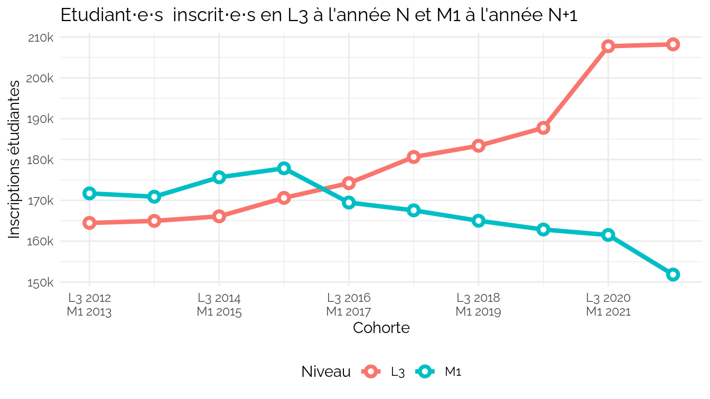
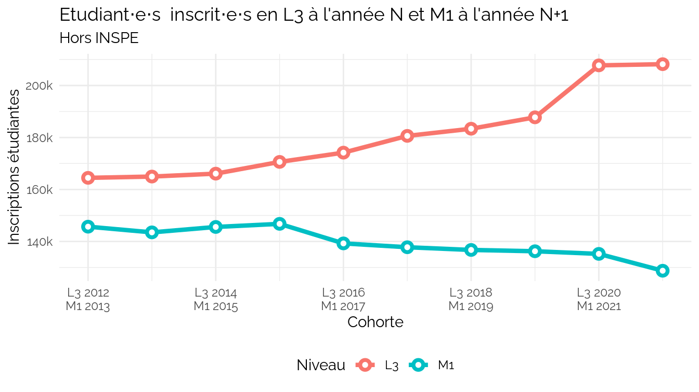
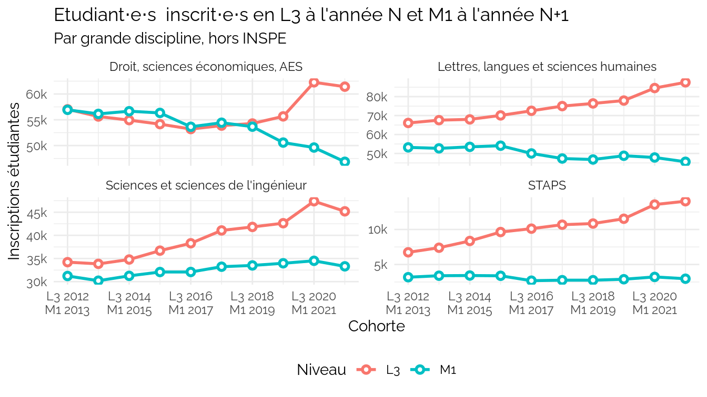
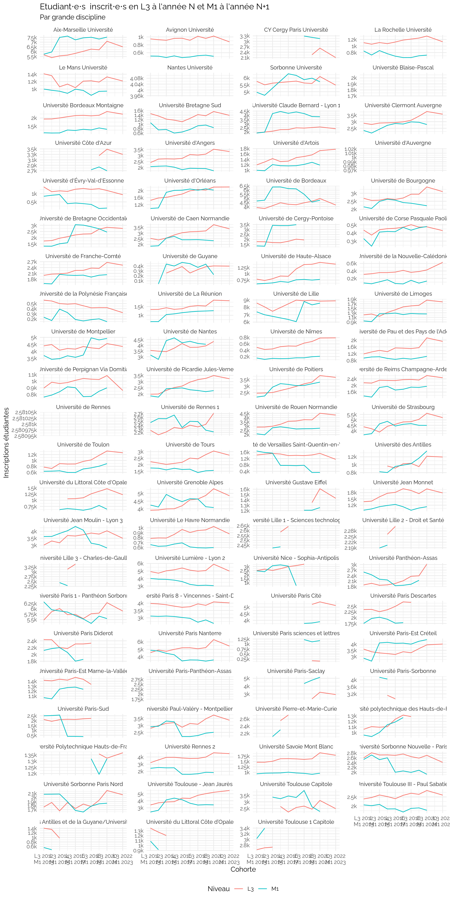

LvsM
================
CPESR
2023-05-28

Voir les données

| Niveau | Diplôme                                   | Etudiants |
|:-------|:------------------------------------------|----------:|
| L-XX   | Autres formations                         |     20234 |
| L-XX   | Diplôme d’accès aux études universitaires |      7132 |
| L-XX   | Diplôme d’État d’infirmier                |         0 |
| L-XX   | Diplômes d’établissement                  |     35917 |
| L-XX   | Formations paramédicales                  |      7551 |
| L-XX   | Licence professionnelle                   |     52429 |
| L-XX   | PASS et PluriPASS                         |     27207 |
| M-XX   | Autres formations                         |     23790 |
| M-XX   | Autres formations de santé                |    128899 |
| M-XX   | Diplômes d’établissement                  |     80824 |
| M-XX   | Formations d’IEP                          |     16301 |
| M-XX   | Formations d’ingénieurs                   |     97107 |
| M-XX   | Formations paramédicales                  |     14270 |

Voir les données

| Niveau | Diplôme                               | Etudiants |
|:-------|:--------------------------------------|----------:|
| L-01   | Autres licences                       |    326154 |
| L-01   | Bachelor universitaire de technologie |     61262 |
| L-01   | Capacité en droit                     |      1480 |
| L-01   | CPGE                                  |        31 |
| L-01   | Diplôme universitaire de technologie  |       197 |
| L-01   | Licence accès santé                   |     15102 |
| L-02   | Autres licences                       |    207593 |
| L-02   | Capacité en droit                     |       521 |
| L-02   | CPGE                                  |        24 |
| L-02   | Diplôme universitaire de technologie  |     53731 |
| L-02   | Licence accès santé                   |      4870 |
| L-03   | Autres licences                       |    207882 |
| L-03   | Licence accès santé                   |       326 |
| M-01   | Autres masters                        |    135215 |
| M-01   | Master enseignement                   |     26305 |
| M-02   | Autres masters                        |    153562 |
| M-02   | Master enseignement                   |     27317 |

### L3 vs M1

    ## `geom_line()`: Each group consists of only one observation.
    ## ℹ Do you need to adjust the group aesthetic?
    ## `geom_line()`: Each group consists of only one observation.
    ## ℹ Do you need to adjust the group aesthetic?
    ## `geom_line()`: Each group consists of only one observation.
    ## ℹ Do you need to adjust the group aesthetic?
    ## `geom_line()`: Each group consists of only one observation.
    ## ℹ Do you need to adjust the group aesthetic?
    ## `geom_line()`: Each group consists of only one observation.
    ## ℹ Do you need to adjust the group aesthetic?
    ## `geom_line()`: Each group consists of only one observation.
    ## ℹ Do you need to adjust the group aesthetic?
    ## `geom_line()`: Each group consists of only one observation.
    ## ℹ Do you need to adjust the group aesthetic?
    ## `geom_line()`: Each group consists of only one observation.
    ## ℹ Do you need to adjust the group aesthetic?

## Flux

<!-- -->

<!-- -->

    ## Warning: Removed 14 rows containing missing values (`position_stack()`).

    ## Warning: Removed 14 rows containing missing values (`position_stack()`).

