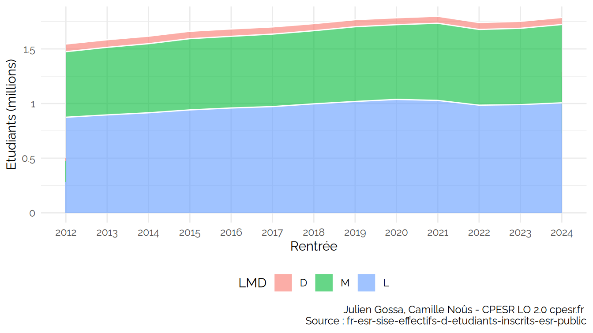
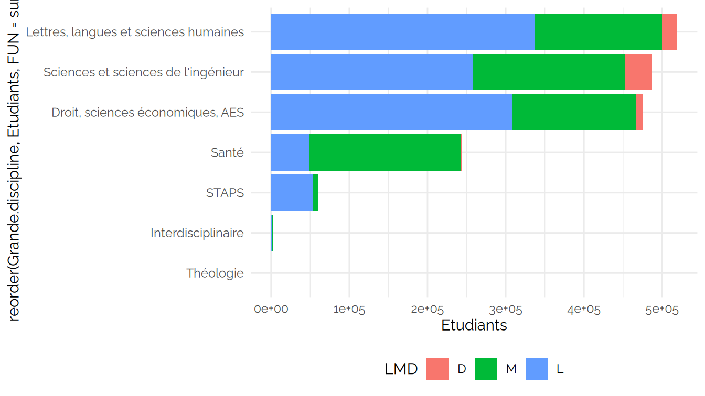
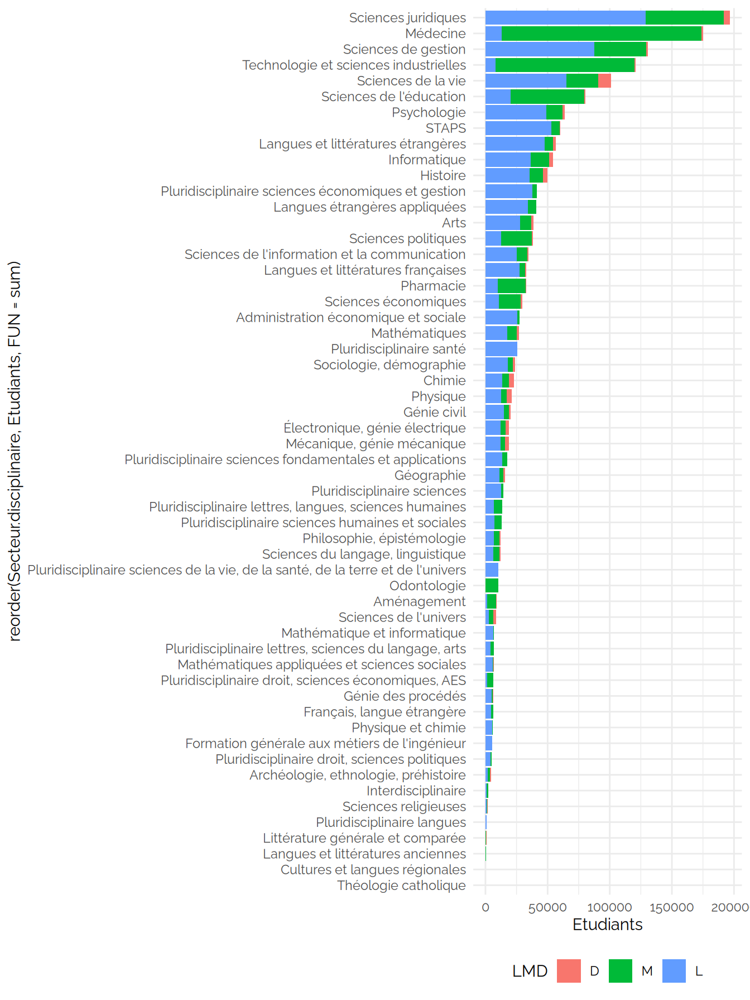
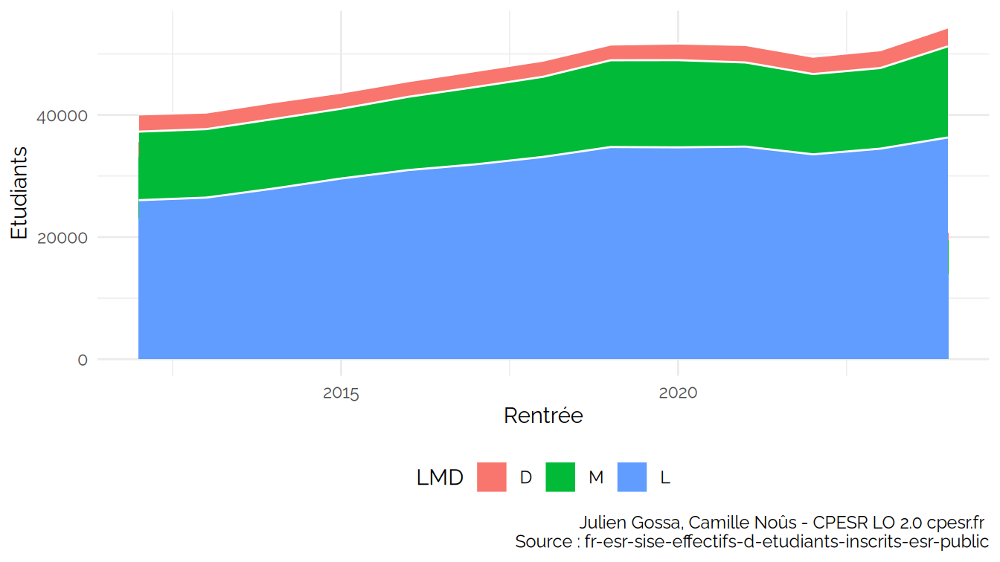
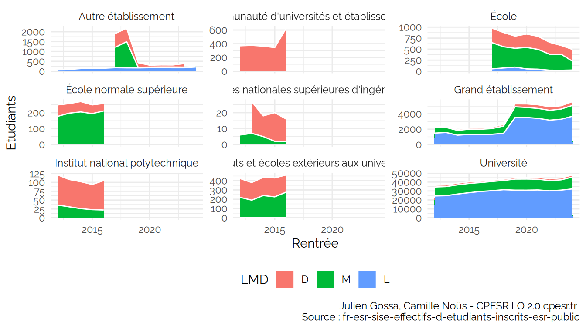
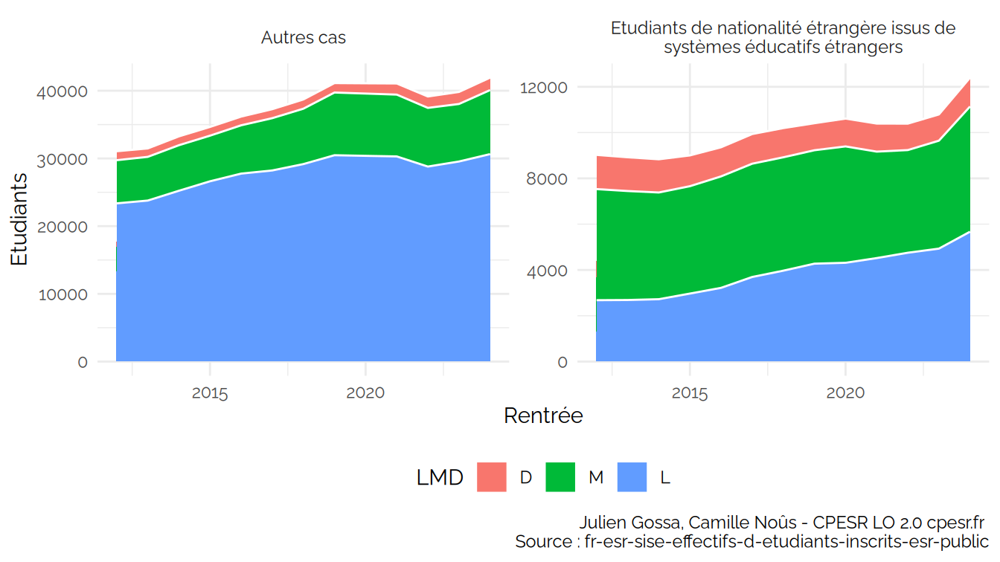
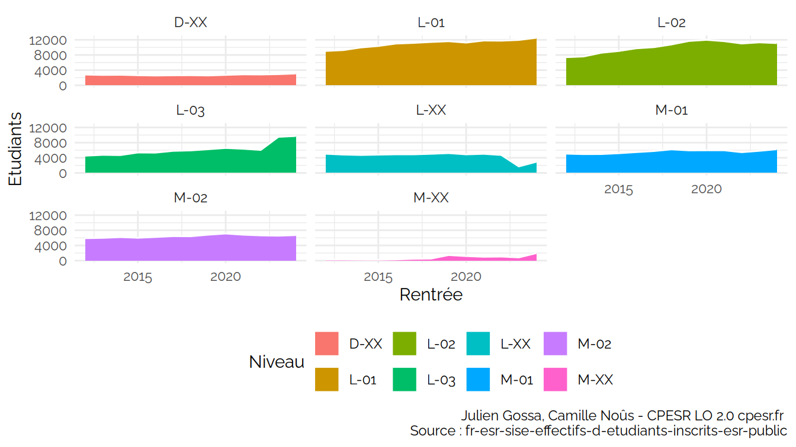
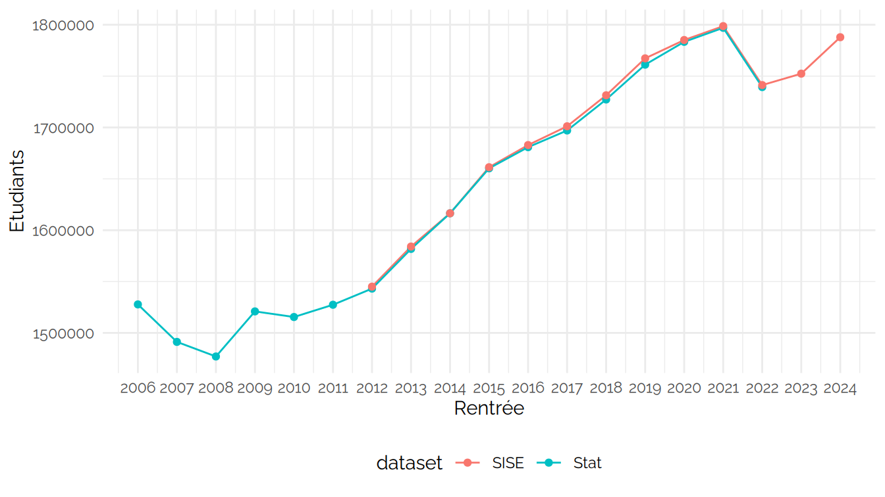

SISE
================

## Tout

    ## `summarise()` has grouped output by 'Rentrée'. You can override using the
    ## `.groups` argument.

## Disciplines

    ## `summarise()` has grouped output by 'LMD'. You can override using the `.groups`
    ## argument.

    ## `summarise()` has grouped output by 'LMD'. You can override using the `.groups`
    ## argument.

## Informatique

### Effectifs

    ## `summarise()` has grouped output by 'Rentrée'. You can override using the
    ## `.groups` argument.

Voir les données ( 13 lignes)

| Rentrée |     L |     M |    D |
|--------:|------:|------:|-----:|
|    2012 | 26046 | 11227 | 2817 |
|    2013 | 26467 | 11214 | 2719 |
|    2014 | 27951 | 11384 | 2758 |
|    2015 | 29595 | 11427 | 2634 |
|    2016 | 30981 | 12000 | 2561 |
|    2017 | 31920 | 12669 | 2623 |

### Type d’établissement

    ## `summarise()` has grouped output by 'Rentrée', 'Type.d.établissement'. You can
    ## override using the `.groups` argument.

Voir les données ( 72 lignes)

| Rentrée | Type.d.établissement                           |     L |    D |    M |
|--------:|:-----------------------------------------------|------:|-----:|-----:|
|    2012 | Autre établissement                            |    83 |   NA |   NA |
|    2012 | Communauté d’universités et établissements     |    NA |  370 |   NA |
|    2012 | Grand établissement                            |  1484 |  135 |  791 |
|    2012 | Institut national polytechnique                |    NA |   85 |   36 |
|    2012 | Instituts et écoles extérieurs aux universités |     2 |  202 |  218 |
|    2012 | Université                                     | 24477 | 1953 | 9999 |

### Attractivité internationale

    ## `summarise()` has grouped output by 'Rentrée', 'Attractivité.internationale'.
    ## You can override using the `.groups` argument.

Voir les données ( 26 lignes)

| Rentrée | Attractivité.internationale | L | M | D |
|---:|:---|---:|---:|---:|
| 2012 | Autres cas | 23366 | 6376 | 1323 |
| 2012 | Etudiants de nationalité étrangère issus de systèmes éducatifs étrangers | 2680 | 4851 | 1494 |
| 2013 | Autres cas | 23779 | 6455 | 1245 |
| 2013 | Etudiants de nationalité étrangère issus de systèmes éducatifs étrangers | 2688 | 4759 | 1474 |
| 2014 | Autres cas | 25228 | 6724 | 1308 |
| 2014 | Etudiants de nationalité étrangère issus de systèmes éducatifs étrangers | 2723 | 4660 | 1450 |

### Niveau

    ## `summarise()` has grouped output by 'Rentrée'. You can override using the
    ## `.groups` argument.

Voir les données ( 13 lignes)

| Rentrée | D-XX |  L-01 |  L-02 | L-03 | L-XX | M-01 | M-02 | M-XX |
|--------:|-----:|------:|------:|-----:|-----:|-----:|-----:|-----:|
|    2012 | 2817 |  9054 |  7404 | 4539 | 5049 | 5074 | 5902 |  251 |
|    2013 | 2719 |  9273 |  7599 | 4758 | 4837 | 4955 | 5994 |  265 |
|    2014 | 2758 |  9966 |  8568 | 4694 | 4723 | 4970 | 6184 |  230 |
|    2015 | 2634 | 10362 |  9040 | 5376 | 4817 | 5190 | 6013 |  224 |
|    2016 | 2561 | 10991 |  9747 | 5345 | 4898 | 5485 | 6216 |  299 |
|    2017 | 2623 | 11170 | 10044 | 5811 | 4895 | 5763 | 6444 |  462 |

## Comparaison sise vs. stat

