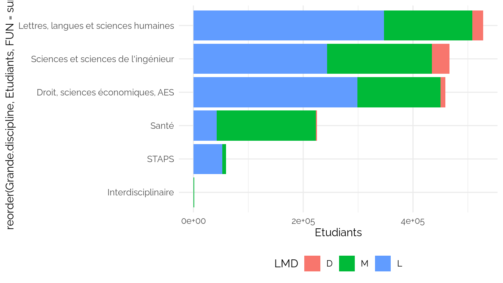
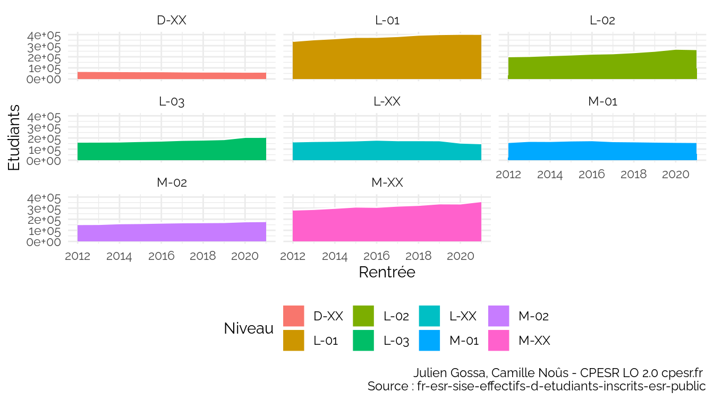
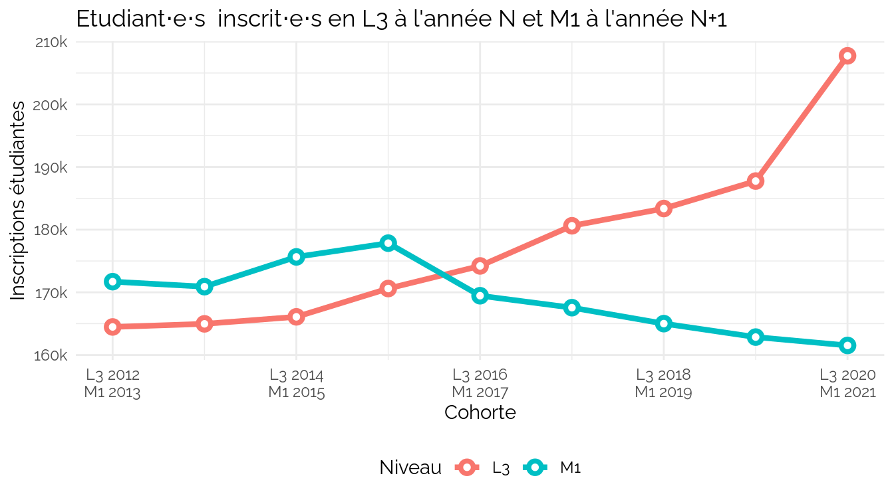
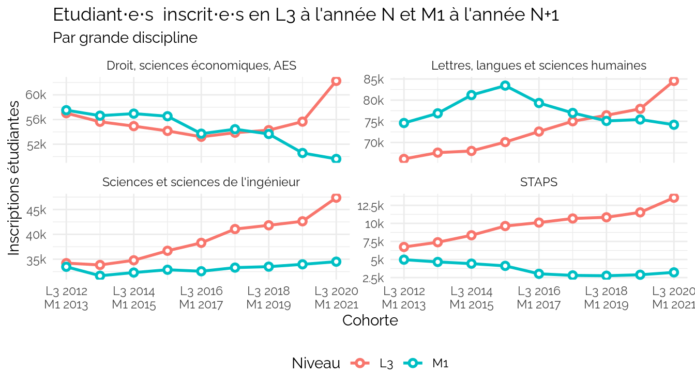
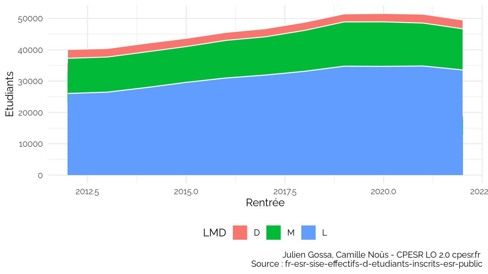
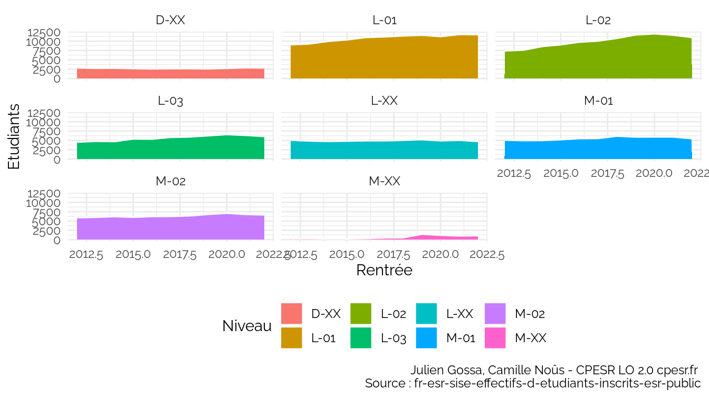

SISE
================

## Tout

    ## `summarise()` has grouped output by 'Rentrée'. You can override using the
    ## `.groups` argument.

## Disciplines

    ## `summarise()` has grouped output by 'LMD'. You can override using the `.groups`
    ## argument.

    ## `summarise()` has grouped output by 'LMD'. You can override using the `.groups`
    ## argument.

### L3 vs M1

    ## `summarise()` has grouped output by 'Rentrée'. You can override using the
    ## `.groups` argument.

    ## `summarise()` has grouped output by 'Rentrée'. You can override using the
    ## `.groups` argument.

    ## `summarise()` has grouped output by 'Rentrée'. You can override using the
    ## `.groups` argument.

    ## `summarise()` has grouped output by 'Rentrée', 'Niveau'. You can override using
    ## the `.groups` argument.

    ## `summarise()` has grouped output by 'Rentrée', 'Niveau'. You can override using
    ## the `.groups` argument.

## Informatique

### Effectifs

    ## `summarise()` has grouped output by 'Rentrée'. You can override using the
    ## `.groups` argument.

Voir les données

| Rentrée |     L |     M |    D |
|--------:|------:|------:|-----:|
|    2013 | 26467 | 11214 | 2719 |
|    2014 | 27951 | 11384 | 2758 |
|    2015 | 29595 | 11427 | 2634 |
|    2016 | 30981 | 12000 | 2561 |
|    2017 | 31920 | 12205 | 2605 |
|    2018 | 33125 | 13048 | 2621 |

### Type d’établissement

    ## `summarise()` has grouped output by 'Rentrée', 'Type.d.établissement'. You can
    ## override using the `.groups` argument.

Voir les données

| Rentrée | Type.d.établissement |     L |    D |     M |
|--------:|:---------------------|------:|-----:|------:|
|    2013 | Autre établissement  |    89 |  376 |    NA |
|    2013 | École                |     1 |  347 |   424 |
|    2013 | Grand établissement  |  1568 |  123 |   659 |
|    2013 | Université           | 24809 | 1873 | 10131 |
|    2014 | Autre établissement  |   131 |  365 |    NA |
|    2014 | École                |     5 |  350 |   471 |

### Attractivité internationale

    ## `summarise()` has grouped output by 'Rentrée', 'Attractivité.internationale'.
    ## You can override using the `.groups` argument.

Voir les données

| Rentrée | Attractivité.internationale                                              |     L |    M |    D |
|--------:|:-------------------------------------------------------------------------|------:|-----:|-----:|
|    2013 | Autres cas                                                               | 23779 | 6455 | 1245 |
|    2013 | Etudiants de nationalité étrangère issus de systèmes éducatifs étrangers |  2688 | 4759 | 1474 |
|    2014 | Autres cas                                                               | 25228 | 6724 | 1308 |
|    2014 | Etudiants de nationalité étrangère issus de systèmes éducatifs étrangers |  2723 | 4660 | 1450 |
|    2015 | Autres cas                                                               | 26626 | 6738 | 1290 |
|    2015 | Etudiants de nationalité étrangère issus de systèmes éducatifs étrangers |  2969 | 4689 | 1344 |

### Niveau

    ## `summarise()` has grouped output by 'Rentrée'. You can override using the
    ## `.groups` argument.

Voir les données

| Rentrée | D-XX |  L-01 |  L-02 | L-03 | L-XX | M-01 | M-02 | M-XX |
|--------:|-----:|------:|------:|-----:|-----:|-----:|-----:|-----:|
|    2013 | 2719 |  9273 |  7599 | 4758 | 4837 | 4955 | 5994 |  265 |
|    2014 | 2758 |  9966 |  8568 | 4694 | 4723 | 4970 | 6184 |  230 |
|    2015 | 2634 | 10362 |  9040 | 5376 | 4817 | 5190 | 6013 |  224 |
|    2016 | 2561 | 10991 |  9747 | 5345 | 4898 | 5485 | 6216 |  299 |
|    2017 | 2605 | 11170 | 10044 | 5811 | 4895 | 5511 | 6232 |  462 |
|    2018 | 2621 | 11416 | 10757 | 5928 | 5024 | 6149 | 6391 |  508 |

